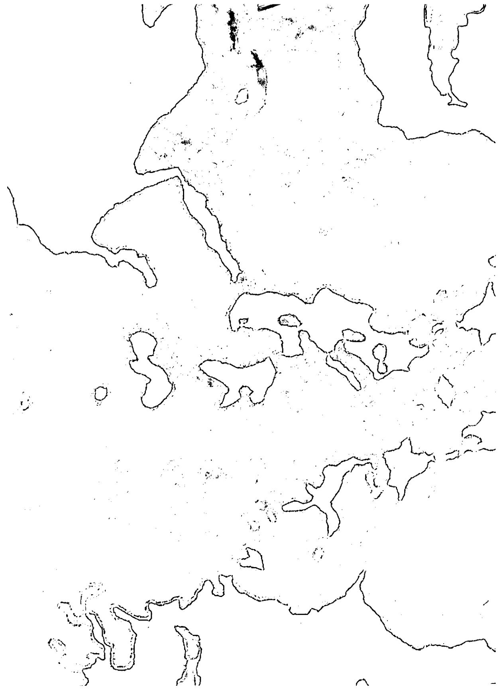

# ▲ 地名索引 灿

#### Α

阿尔及利亚 (Algeria),44
阿富汗 (Afghanistan),120
阿肯色州 (Arkansas),159
阿雷佐 (Arezzo),77
阿利根尼山脉 (Allegheny Mountains),103
埃及 (Egypt),124
爱尔兰 (Ireland),59,175
安道尔 (Andorra),67
奥地利 (Austrian),56
奥克兰 (Auckland),64,125
奥马哈 (Omaha),66

#### В

巴格达 (Baghdad),43 巴基斯坦 (Pakistan),174 巴黎 (Paris),44,47,106,107 巴婆罗那 (Barcelona),66,67,68 巴西 (Brazil),200 北极陽 (Arctic Circle),186 北卡罗来纳州 (North Carolina),37,186 北美 (North America),115 贝贾亚港 (Bejaïa),44 比萨 (Pisa),44 浜夕法尼亚州 (Pennsylvania), 101 波兰 (Poland), 57, 77 波士顿 (Boston), 125, 171, 192 波斯 (Persia), 42, 106 布达佩斯 (Budapest), 8 布舟窓尔 (Brussels), 107

#### D

德国 (Germany), 15, 48, 49, 76, 107, 173, 198 德州 (Texas), 116, 141 地中海 (Mediterranean), 44 东欧 (Bastern Europe), 175, 200

#### F

俄亥俄州 (Ohio), 77, 103 俄勒冈州的普赖恩维尔县 (Prineville, Oregon), 186 俄罗斯 (Russia), 51, 57, 120 厄巴纳 (Urbana), 81, 102

#### F

法国 (France), 44, 49, 54, 56, 66, 67, 106 法国马赛 (Marseilles, France), 130

