# Designing Data-Intensive Applications

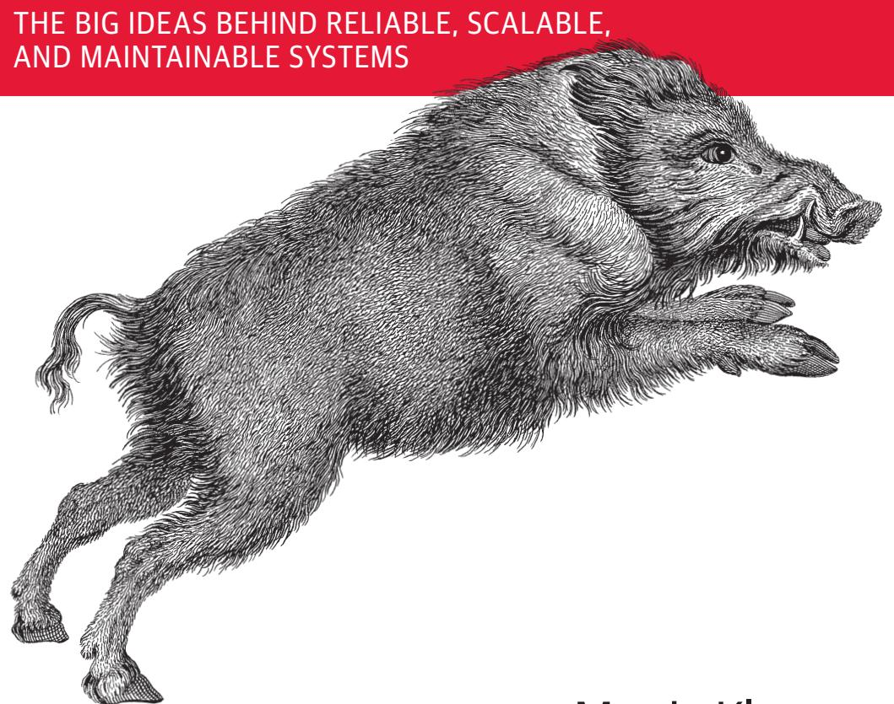

Martin Kleppmann

## O'REILLY®

## **Designing Data-Intensive Applications**

Data is at the center of many challenges in system design today. Difficult issues need to be figured out, such as scalability, consistency, reliability, efficiency, and maintainability. In addition, we have an overwhelming variety of tools, including relational databases, NoSQL datastores, stream or batch processors, and message brokers. What are the right choices for your application? How do you make sense of all these buzzwords?

In this practical and comprehensive guide, author Martin Kleppmann helps you navigate this diverse landscape by examining the pros and cons of various technologies for processing and storing data. Software keeps changing, but the fundamental principles remain the same. With this book, software engineers and architects will learn how to apply those ideas in practice, and how to make full use of data in modern applications.

- Peer under the hood of the systems you already use, and learn how to use and operate them more effectively
- Make informed decisions by identifying the strengths and weaknesses of different tools
- Navigate the trade-offs around consistency, scalability, fault tolerance, and complexity
- Understand the distributed systems research upon which modern databases are built
- Peek behind the scenes of major online services, and learn from their architectures

**Martin Kleppmann** is a researcher in distributed systems at the University of Cambridge, UK. Previously he was a software engineer and entrepreneur at internet companies including LinkedIn and Rapportive, where he worked on large-scale data infrastructure. Martin is a regular conference speaker, blogger, and open source contributor.

"This book is awesome.
It bridges the huge gap
between distributed
systems theory and
practical engineering.
I wish it had existed a
decade ago, so I could
have read it then and
saved myself all the
mistakes along the way."

—Jay Kreps Creator of Apache Kafka and CEO of Confluent

"This book should be required reading for software engineers.

Designing Data-Intensive Applications is a rare resource that connects theory and practice to help developers make smart decisions as they design and implement data infrastructure and systems."

-Kevin Scott

Chief Technology Officer at Microsoft

DATA | HADOOP

US \$44.99

CAN \$59.99

N: 978-1-449-37332-0

7 8 1 4 4 9 0 3 7 3 3 2 0 III

7332-0


Twitter: @oreillymedia facebook.com/oreilly

# **Designing Data-Intensive Applications**

*The Big Ideas Behind Reliable, Scalable, and Maintainable Systems*

*Martin Kleppmann*


#### **Designing Data-Intensive Applications**

by Martin Kleppmann

Copyright © 2017 Martin Kleppmann. All rights reserved.

Printed in the United States of America.

Published by O'Reilly Media, Inc., 1005 Gravenstein Highway North, Sebastopol, CA 95472.

O'Reilly books may be purchased for educational, business, or sales promotional use. Online editions are also available for most titles (*<http://oreilly.com/safari>*). For more information, contact our corporate/insti‐ tutional sales department: 800-998-9938 or *corporate@oreilly.com*.

**Editors:** Ann Spencer and Marie Beaugureau **Indexer:** Ellen Troutman-Zaig

**Production Editor:** Kristen Brown **Interior Designer:** David Futato **Copyeditor:** Rachel Head **Cover Designer:** Karen Montgomery **Proofreader:** Amanda Kersey **Illustrator:** Rebecca Demarest

March 2017: First Edition

**Revision History for the First Edition**

2017-03-01: First Release

See *<http://oreilly.com/catalog/errata.csp?isbn=9781449373320>* for release details.

The O'Reilly logo is a registered trademark of O'Reilly Media, Inc. *Designing Data-Intensive Applications*, the cover image, and related trade dress are trademarks of O'Reilly Media, Inc.

While the publisher and the author have used good faith efforts to ensure that the information and instructions contained in this work are accurate, the publisher and the author disclaim all responsibility for errors or omissions, including without limitation responsibility for damages resulting from the use of or reliance on this work. Use of the information and instructions contained in this work is at your own risk. If any code samples or other technology this work contains or describes is subject to open source licenses or the intellectual property rights of others, it is your responsibility to ensure that your use thereof complies with such licenses and/or rights.

*Technology is a powerful force in our society. Data, software, and communication can be used for bad: to entrench unfair power structures, to undermine human rights, and to protect vested interests. But they can also be used for good: to make underrepresented people's voices heard, to create opportunities for everyone, and to avert disasters. This book is dedicated to everyone working toward the good.*

*Computing is pop culture. […] Pop culture holds a disdain for history. Pop culture is all about identity and feeling like you're participating. It has nothing to do with cooperation, the past or the future—it's living in the present. I think the same is true of most people who write code for money. They have no idea where [their culture came from].*

—[Alan Kay](http://www.drdobbs.com/architecture-and-design/interview-with-alan-kay/240003442), in interview with *Dr Dobb's Journal* (2012)

# **Table of Contents**

|         | Preface xiii                                        |    |  |  |
|---------|-----------------------------------------------------|----|--|--|
| Part I. | Foundations of Data Systems                         |    |  |  |
| 1.      | Reliable, Scalable, and Maintainable Applications 3 |    |  |  |
|         | Thinking About Data Systems                         | 4  |  |  |
|         | Reliability                                         | 6  |  |  |
|         | Hardware Faults                                     | 7  |  |  |
|         | Software Errors                                     | 8  |  |  |
|         | Human Errors                                        | 9  |  |  |
|         | How Important Is Reliability?                       | 10 |  |  |
|         | Scalability                                         | 10 |  |  |
|         | Describing Load                                     | 11 |  |  |
|         | Describing Performance                              | 13 |  |  |
|         | Approaches for Coping with Load                     | 17 |  |  |
|         | Maintainability                                     | 18 |  |  |
|         | Operability: Making Life Easy for Operations        | 19 |  |  |
|         | Simplicity: Managing Complexity                     | 20 |  |  |
|         | Evolvability: Making Change Easy                    | 21 |  |  |
|         | Summary                                             | 22 |  |  |
| 2.      | Data Models and Query Languages 27                  |    |  |  |
|         | Relational Model Versus Document Model              | 28 |  |  |
|         | The Birth of NoSQL                                  | 29 |  |  |
|         | The Object-Relational Mismatch                      | 29 |  |  |
|         | Many-to-One and Many-to-Many Relationships          | 33 |  |  |
|         | Are Document Databases Repeating History?           | 36 |  |  |

|    | Relational Versus Document Databases Today     | 38  |
|----|------------------------------------------------|-----|
|    | Query Languages for Data                       | 42  |
|    | Declarative Queries on the Web                 | 44  |
|    | MapReduce Querying                             | 46  |
|    | Graph-Like Data Models                         | 49  |
|    | Property Graphs                                | 50  |
|    | The Cypher Query Language                      | 52  |
|    | Graph Queries in SQL                           | 53  |
|    | Triple-Stores and SPARQL                       | 55  |
|    | The Foundation: Datalog                        | 60  |
|    | Summary                                        | 63  |
| 3. | Storage and Retrieval 69                       |     |
|    | Data Structures That Power Your Database       | 70  |
|    | Hash Indexes                                   | 72  |
|    | SSTables and LSM-Trees                         | 76  |
|    | B-Trees                                        | 79  |
|    | Comparing B-Trees and LSM-Trees                | 83  |
|    | Other Indexing Structures                      | 85  |
|    | Transaction Processing or Analytics?           | 90  |
|    | Data Warehousing                               | 91  |
|    | Stars and Snowflakes: Schemas for Analytics    | 93  |
|    | Column-Oriented Storage                        | 95  |
|    | Column Compression                             | 97  |
|    | Sort Order in Column Storage                   | 99  |
|    | Writing to Column-Oriented Storage             | 101 |
|    | Aggregation: Data Cubes and Materialized Views | 101 |
|    | Summary                                        | 103 |
| 4. | Encoding and Evolution 111                     |     |
|    | Formats for Encoding Data                      | 112 |
|    | Language-Specific Formats                      | 113 |
|    | JSON, XML, and Binary Variants                 | 114 |
|    | Thrift and Protocol Buffers                    | 117 |
|    | Avro                                           | 122 |
|    | The Merits of Schemas                          | 127 |
|    | Modes of Dataflow                              | 128 |
|    | Dataflow Through Databases                     | 129 |
|    | Dataflow Through Services: REST and RPC        | 131 |
|    | Message-Passing Dataflow                       | 136 |
|    | Summary                                        | 139 |

## **Part II. [Distributed Data](#page-166-0)**

| 5. | Replication 151                             |     |
|----|---------------------------------------------|-----|
|    | Leaders and Followers                       | 152 |
|    | Synchronous Versus Asynchronous Replication | 153 |
|    | Setting Up New Followers                    | 155 |
|    | Handling Node Outages                       | 156 |
|    | Implementation of Replication Logs          | 158 |
|    | Problems with Replication Lag               | 161 |
|    | Reading Your Own Writes                     | 162 |
|    | Monotonic Reads                             | 164 |
|    | Consistent Prefix Reads                     | 165 |
|    | Solutions for Replication Lag               | 167 |
|    | Multi-Leader Replication                    | 168 |
|    | Use Cases for Multi-Leader Replication      | 168 |
|    | Handling Write Conflicts                    | 171 |
|    | Multi-Leader Replication Topologies         | 175 |
|    | Leaderless Replication                      | 177 |
|    | Writing to the Database When a Node Is Down | 177 |
|    | Limitations of Quorum Consistency           | 181 |
|    | Sloppy Quorums and Hinted Handoff           | 183 |
|    | Detecting Concurrent Writes                 | 184 |
|    | Summary                                     | 192 |
| 6. | Partitioning 199                            |     |
|    | Partitioning and Replication                | 200 |
|    | Partitioning of Key-Value Data              | 201 |
|    | Partitioning by Key Range                   | 202 |
|    | Partitioning by Hash of Key                 | 203 |
|    | Skewed Workloads and Relieving Hot Spots    | 205 |
|    | Partitioning and Secondary Indexes          | 206 |
|    | Partitioning Secondary Indexes by Document  | 206 |
|    | Partitioning Secondary Indexes by Term      | 208 |
|    | Rebalancing Partitions                      | 209 |
|    | Strategies for Rebalancing                  | 210 |
|    | Operations: Automatic or Manual Rebalancing | 213 |
|    | Request Routing                             | 214 |
|    | Parallel Query Execution                    | 216 |
|    | Summary                                     | 216 |
| 7. | Transactions 221                            |     |
|    | The Slippery Concept of a Transaction       | 222 |
|    |                                             |     |

| The Meaning of ACID<br>Single-Object and Multi-Object Operations<br>Weak Isolation Levels<br>Read Committed<br>Snapshot Isolation and Repeatable Read<br>Preventing Lost Updates<br>Write Skew and Phantoms<br>Serializability<br>Actual Serial Execution<br>Two-Phase Locking (2PL)<br>Serializable Snapshot Isolation (SSI)<br>Summary<br>8.<br>The Trouble with Distributed Systems 273<br>Faults and Partial Failures<br>Cloud Computing and Supercomputing<br>Unreliable Networks<br>Network Faults in Practice<br>Detecting Faults<br>Timeouts and Unbounded Delays<br>Synchronous Versus Asynchronous Networks<br>Unreliable Clocks<br>Monotonic Versus Time-of-Day Clocks<br>Clock Synchronization and Accuracy<br>Relying on Synchronized Clocks<br>Process Pauses<br>Knowledge, Truth, and Lies<br>The Truth Is Defined by the Majority<br>Byzantine Faults<br>System Model and Reality<br>Summary<br>9.<br>Consistency and Consensus 321<br>Consistency Guarantees<br>Linearizability<br>What Makes a System Linearizable?<br>Relying on Linearizability<br>Implementing Linearizable Systems | 223 |
|----------------------------------------------------------------------------------------------------------------------------------------------------------------------------------------------------------------------------------------------------------------------------------------------------------------------------------------------------------------------------------------------------------------------------------------------------------------------------------------------------------------------------------------------------------------------------------------------------------------------------------------------------------------------------------------------------------------------------------------------------------------------------------------------------------------------------------------------------------------------------------------------------------------------------------------------------------------------------------------------------------------------------------------------------------------------------------------------------------|-----|
|                                                                                                                                                                                                                                                                                                                                                                                                                                                                                                                                                                                                                                                                                                                                                                                                                                                                                                                                                                                                                                                                                                          | 228 |
|                                                                                                                                                                                                                                                                                                                                                                                                                                                                                                                                                                                                                                                                                                                                                                                                                                                                                                                                                                                                                                                                                                          | 233 |
|                                                                                                                                                                                                                                                                                                                                                                                                                                                                                                                                                                                                                                                                                                                                                                                                                                                                                                                                                                                                                                                                                                          | 234 |
|                                                                                                                                                                                                                                                                                                                                                                                                                                                                                                                                                                                                                                                                                                                                                                                                                                                                                                                                                                                                                                                                                                          | 237 |
|                                                                                                                                                                                                                                                                                                                                                                                                                                                                                                                                                                                                                                                                                                                                                                                                                                                                                                                                                                                                                                                                                                          | 242 |
|                                                                                                                                                                                                                                                                                                                                                                                                                                                                                                                                                                                                                                                                                                                                                                                                                                                                                                                                                                                                                                                                                                          | 246 |
|                                                                                                                                                                                                                                                                                                                                                                                                                                                                                                                                                                                                                                                                                                                                                                                                                                                                                                                                                                                                                                                                                                          | 251 |
|                                                                                                                                                                                                                                                                                                                                                                                                                                                                                                                                                                                                                                                                                                                                                                                                                                                                                                                                                                                                                                                                                                          | 252 |
|                                                                                                                                                                                                                                                                                                                                                                                                                                                                                                                                                                                                                                                                                                                                                                                                                                                                                                                                                                                                                                                                                                          | 257 |
|                                                                                                                                                                                                                                                                                                                                                                                                                                                                                                                                                                                                                                                                                                                                                                                                                                                                                                                                                                                                                                                                                                          | 261 |
|                                                                                                                                                                                                                                                                                                                                                                                                                                                                                                                                                                                                                                                                                                                                                                                                                                                                                                                                                                                                                                                                                                          | 266 |
|                                                                                                                                                                                                                                                                                                                                                                                                                                                                                                                                                                                                                                                                                                                                                                                                                                                                                                                                                                                                                                                                                                          |     |
|                                                                                                                                                                                                                                                                                                                                                                                                                                                                                                                                                                                                                                                                                                                                                                                                                                                                                                                                                                                                                                                                                                          | 274 |
|                                                                                                                                                                                                                                                                                                                                                                                                                                                                                                                                                                                                                                                                                                                                                                                                                                                                                                                                                                                                                                                                                                          | 275 |
|                                                                                                                                                                                                                                                                                                                                                                                                                                                                                                                                                                                                                                                                                                                                                                                                                                                                                                                                                                                                                                                                                                          | 277 |
|                                                                                                                                                                                                                                                                                                                                                                                                                                                                                                                                                                                                                                                                                                                                                                                                                                                                                                                                                                                                                                                                                                          | 279 |
|                                                                                                                                                                                                                                                                                                                                                                                                                                                                                                                                                                                                                                                                                                                                                                                                                                                                                                                                                                                                                                                                                                          | 280 |
|                                                                                                                                                                                                                                                                                                                                                                                                                                                                                                                                                                                                                                                                                                                                                                                                                                                                                                                                                                                                                                                                                                          | 281 |
|                                                                                                                                                                                                                                                                                                                                                                                                                                                                                                                                                                                                                                                                                                                                                                                                                                                                                                                                                                                                                                                                                                          | 284 |
|                                                                                                                                                                                                                                                                                                                                                                                                                                                                                                                                                                                                                                                                                                                                                                                                                                                                                                                                                                                                                                                                                                          | 287 |
|                                                                                                                                                                                                                                                                                                                                                                                                                                                                                                                                                                                                                                                                                                                                                                                                                                                                                                                                                                                                                                                                                                          | 288 |
|                                                                                                                                                                                                                                                                                                                                                                                                                                                                                                                                                                                                                                                                                                                                                                                                                                                                                                                                                                                                                                                                                                          | 289 |
|                                                                                                                                                                                                                                                                                                                                                                                                                                                                                                                                                                                                                                                                                                                                                                                                                                                                                                                                                                                                                                                                                                          | 291 |
|                                                                                                                                                                                                                                                                                                                                                                                                                                                                                                                                                                                                                                                                                                                                                                                                                                                                                                                                                                                                                                                                                                          | 295 |
|                                                                                                                                                                                                                                                                                                                                                                                                                                                                                                                                                                                                                                                                                                                                                                                                                                                                                                                                                                                                                                                                                                          | 300 |
|                                                                                                                                                                                                                                                                                                                                                                                                                                                                                                                                                                                                                                                                                                                                                                                                                                                                                                                                                                                                                                                                                                          | 300 |
|                                                                                                                                                                                                                                                                                                                                                                                                                                                                                                                                                                                                                                                                                                                                                                                                                                                                                                                                                                                                                                                                                                          | 304 |
|                                                                                                                                                                                                                                                                                                                                                                                                                                                                                                                                                                                                                                                                                                                                                                                                                                                                                                                                                                                                                                                                                                          | 306 |
|                                                                                                                                                                                                                                                                                                                                                                                                                                                                                                                                                                                                                                                                                                                                                                                                                                                                                                                                                                                                                                                                                                          | 310 |
|                                                                                                                                                                                                                                                                                                                                                                                                                                                                                                                                                                                                                                                                                                                                                                                                                                                                                                                                                                                                                                                                                                          |     |
|                                                                                                                                                                                                                                                                                                                                                                                                                                                                                                                                                                                                                                                                                                                                                                                                                                                                                                                                                                                                                                                                                                          | 322 |
|                                                                                                                                                                                                                                                                                                                                                                                                                                                                                                                                                                                                                                                                                                                                                                                                                                                                                                                                                                                                                                                                                                          | 324 |
|                                                                                                                                                                                                                                                                                                                                                                                                                                                                                                                                                                                                                                                                                                                                                                                                                                                                                                                                                                                                                                                                                                          | 325 |
|                                                                                                                                                                                                                                                                                                                                                                                                                                                                                                                                                                                                                                                                                                                                                                                                                                                                                                                                                                                                                                                                                                          | 330 |
|                                                                                                                                                                                                                                                                                                                                                                                                                                                                                                                                                                                                                                                                                                                                                                                                                                                                                                                                                                                                                                                                                                          | 332 |
| The Cost of Linearizability                                                                                                                                                                                                                                                                                                                                                                                                                                                                                                                                                                                                                                                                                                                                                                                                                                                                                                                                                                                                                                                                              | 335 |
| Ordering Guarantees                                                                                                                                                                                                                                                                                                                                                                                                                                                                                                                                                                                                                                                                                                                                                                                                                                                                                                                                                                                                                                                                                      | 339 |
| Ordering and Causality                                                                                                                                                                                                                                                                                                                                                                                                                                                                                                                                                                                                                                                                                                                                                                                                                                                                                                                                                                                                                                                                                   | 339 |
| Sequence Number Ordering                                                                                                                                                                                                                                                                                                                                                                                                                                                                                                                                                                                                                                                                                                                                                                                                                                                                                                                                                                                                                                                                                 | 343 |

|     | Total Order Broadcast                     | 348 |
|-----|-------------------------------------------|-----|
|     | Distributed Transactions and Consensus    | 352 |
|     | Atomic Commit and Two-Phase Commit (2PC)  | 354 |
|     | Distributed Transactions in Practice      | 360 |
|     | Fault-Tolerant Consensus                  | 364 |
|     | Membership and Coordination Services      | 370 |
|     | Summary                                   | 373 |
|     | Part III.<br>Derived Data                 |     |
| 10. | Batch Processing 389                      |     |
|     | Batch Processing with Unix Tools          | 391 |
|     | Simple Log Analysis                       | 391 |
|     | The Unix Philosophy                       | 394 |
|     | MapReduce and Distributed Filesystems     | 397 |
|     | MapReduce Job Execution                   | 399 |
|     | Reduce-Side Joins and Grouping            | 403 |
|     | Map-Side Joins                            | 408 |
|     | The Output of Batch Workflows             | 411 |
|     | Comparing Hadoop to Distributed Databases | 414 |
|     | Beyond MapReduce                          | 419 |
|     | Materialization of Intermediate State     | 419 |
|     | Graphs and Iterative Processing           | 424 |
|     | High-Level APIs and Languages             | 426 |
|     | Summary                                   | 429 |
| 11. | Stream Processing 439                     |     |
|     | Transmitting Event Streams                | 440 |
|     | Messaging Systems                         | 441 |
|     | Partitioned Logs                          | 446 |
|     | Databases and Streams                     | 451 |
|     | Keeping Systems in Sync                   | 452 |
|     | Change Data Capture                       | 454 |
|     | Event Sourcing                            | 457 |
|     | State, Streams, and Immutability          | 459 |
|     | Processing Streams                        | 464 |
|     | Uses of Stream Processing                 | 465 |
|     | Reasoning About Time                      | 468 |
|     | Stream Joins                              | 472 |
|     | Fault Tolerance                           | 476 |
|     | Summary                                   | 479 |

| 12. | The Future of Data Systems 489               |     |
|-----|----------------------------------------------|-----|
|     | Data Integration                             | 490 |
|     | Combining Specialized Tools by Deriving Data | 490 |
|     | Batch and Stream Processing                  | 494 |
|     | Unbundling Databases                         | 499 |
|     | Composing Data Storage Technologies          | 499 |
|     | Designing Applications Around Dataflow       | 504 |
|     | Observing Derived State                      | 509 |
|     | Aiming for Correctness                       | 515 |
|     | The End-to-End Argument for Databases        | 516 |
|     | Enforcing Constraints                        | 521 |
|     | Timeliness and Integrity                     | 524 |
|     | Trust, but Verify                            | 528 |
|     | Doing the Right Thing                        | 533 |
|     | Predictive Analytics                         | 533 |
|     | Privacy and Tracking                         | 536 |
|     | Summary                                      | 543 |
|     | Glossary 553                                 |     |
|     | Index 559                                    |     |

# **Preface**

<span id="page-14-0"></span>If you have worked in software engineering in recent years, especially in server-side and backend systems, you have probably been bombarded with a plethora of buzz‐ words relating to storage and processing of data. NoSQL! Big Data! Web-scale! Sharding! Eventual consistency! ACID! CAP theorem! Cloud services! MapReduce! Real-time!

In the last decade we have seen many interesting developments in databases, in dis‐ tributed systems, and in the ways we build applications on top of them. There are various driving forces for these developments:

- Internet companies such as Google, Yahoo!, Amazon, Facebook, LinkedIn, Microsoft, and Twitter are handling huge volumes of data and traffic, forcing them to create new tools that enable them to efficiently handle such scale.
- Businesses need to be agile, test hypotheses cheaply, and respond quickly to new market insights by keeping development cycles short and data models flexible.
- Free and open source software has become very successful and is now preferred to commercial or bespoke in-house software in many environments.
- CPU clock speeds are barely increasing, but multi-core processors are standard, and networks are getting faster. This means parallelism is only going to increase.
- Even if you work on a small team, you can now build systems that are distributed across many machines and even multiple geographic regions, thanks to infra‐ structure as a service (IaaS) such as Amazon Web Services.
- Many services are now expected to be highly available; extended downtime due to outages or maintenance is becoming increasingly unacceptable.

*Data-intensive applications* are pushing the boundaries of what is possible by making use of these technological developments. We call an application *data-intensive* if data is its primary challenge—the quantity of data, the complexity of data, or the speed at which it is changing—as opposed to *compute-intensive*, where CPU cycles are the bottleneck.

The tools and technologies that help data-intensive applications store and process data have been rapidly adapting to these changes. New types of database systems ("NoSQL") have been getting lots of attention, but message queues, caches, search indexes, frameworks for batch and stream processing, and related technologies are very important too. Many applications use some combination of these.

The buzzwords that fill this space are a sign of enthusiasm for the new possibilities, which is a great thing. However, as software engineers and architects, we also need to have a technically accurate and precise understanding of the various technologies and their trade-offs if we want to build good applications. For that understanding, we have to dig deeper than buzzwords.

Fortunately, behind the rapid changes in technology, there are enduring principles that remain true, no matter which version of a particular tool you are using. If you understand those principles, you're in a position to see where each tool fits in, how to make good use of it, and how to avoid its pitfalls. That's where this book comes in.

The goal of this book is to help you navigate the diverse and fast-changing landscape of technologies for processing and storing data. This book is not a tutorial for one particular tool, nor is it a textbook full of dry theory. Instead, we will look at examples of successful data systems: technologies that form the foundation of many popular applications and that have to meet scalability, performance, and reliability require‐ ments in production every day.

We will dig into the internals of those systems, tease apart their key algorithms, dis‐ cuss their principles and the trade-offs they have to make. On this journey, we will try to find useful ways of *thinking about* data systems—not just *how* they work, but also *why* they work that way, and what questions we need to ask.

After reading this book, you will be in a great position to decide which kind of tech‐ nology is appropriate for which purpose, and understand how tools can be combined to form the foundation of a good application architecture. You won't be ready to build your own database storage engine from scratch, but fortunately that is rarely necessary. You will, however, develop a good intuition for what your systems are doing under the hood so that you can reason about their behavior, make good design decisions, and track down any problems that may arise.

## **Who Should Read This Book?**

If you develop applications that have some kind of server/backend for storing or pro‐ cessing data, and your applications use the internet (e.g., web applications, mobile apps, or internet-connected sensors), then this book is for you.

This book is for software engineers, software architects, and technical managers who love to code. It is especially relevant if you need to make decisions about the architec‐ ture of the systems you work on—for example, if you need to choose tools for solving a given problem and figure out how best to apply them. But even if you have no choice over your tools, this book will help you better understand their strengths and weaknesses.

You should have some experience building web-based applications or network serv‐ ices, and you should be familiar with relational databases and SQL. Any nonrelational databases and other data-related tools you know are a bonus, but not required. A general understanding of common network protocols like TCP and HTTP is helpful. Your choice of programming language or framework makes no dif‐ ference for this book.

If any of the following are true for you, you'll find this book valuable:

- You want to learn how to make data systems scalable, for example, to support web or mobile apps with millions of users.
- You need to make applications highly available (minimizing downtime) and operationally robust.
- You are looking for ways of making systems easier to maintain in the long run, even as they grow and as requirements and technologies change.
- You have a natural curiosity for the way things work and want to know what goes on inside major websites and online services. This book breaks down the internals of various databases and data processing systems, and it's great fun to explore the bright thinking that went into their design.

Sometimes, when discussing scalable data systems, people make comments along the lines of, "You're not Google or Amazon. Stop worrying about scale and just use a relational database." There is truth in that statement: building for scale that you don't need is wasted effort and may lock you into an inflexible design. In effect, it is a form of premature optimization. However, it's also important to choose the right tool for the job, and different technologies each have their own strengths and weaknesses. As we shall see, relational databases are important but not the final word on dealing with data.

## **Scope of This Book**

This book does not attempt to give detailed instructions on how to install or use spe‐ cific software packages or APIs, since there is already plenty of documentation for those things. Instead we discuss the various principles and trade-offs that are funda‐ mental to data systems, and we explore the different design decisions taken by differ‐ ent products.

In the ebook editions we have included links to the full text of online resources. All links were verified at the time of publication, but unfortunately links tend to break frequently due to the nature of the web. If you come across a broken link, or if you are reading a print copy of this book, you can look up references using a search engine. For academic papers, you can search for the title in Google Scholar to find open-access PDF files. Alternatively, you can find all of the references at *[https://](https://github.com/ept/ddia-references) [github.com/ept/ddia-references](https://github.com/ept/ddia-references)*, where we maintain up-to-date links.

We look primarily at the *architecture* of data systems and the ways they are integrated into data-intensive applications. This book doesn't have space to cover deployment, operations, security, management, and other areas—those are complex and impor‐ tant topics, and we wouldn't do them justice by making them superficial side notes in this book. They deserve books of their own.

Many of the technologies described in this book fall within the realm of the *Big Data* buzzword. However, the term "Big Data" is so overused and underdefined that it is not useful in a serious engineering discussion. This book uses less ambiguous terms, such as single-node versus distributed systems, or online/interactive versus offline/ batch processing systems.

This book has a bias toward free and open source software (FOSS), because reading, modifying, and executing source code is a great way to understand how something works in detail. Open platforms also reduce the risk of vendor lock-in. However, where appropriate, we also discuss proprietary software (closed-source software, soft‐ ware as a service, or companies' in-house software that is only described in literature but not released publicly).

## **Outline of This Book**

This book is arranged into three parts:

- 1. In [Part I,](#page-22-0) we discuss the fundamental ideas that underpin the design of dataintensive applications. We start in [Chapter 1](#page-24-0) by discussing what we're actually trying to achieve: reliability, scalability, and maintainability; how we need to think about them; and how we can achieve them. In [Chapter 2](#page-48-0) we compare sev‐ eral different data models and query languages, and see how they are appropriate to different situations. In [Chapter 3](#page-90-0) we talk about storage engines: how databases arrange data on disk so that we can find it again efficiently. [Chapter 4](#page-132-0) turns to formats for data encoding (serialization) and evolution of schemas over time.
- 2. In [Part II](#page-166-0), we move from data stored on one machine to data that is distributed across multiple machines. This is often necessary for scalability, but brings with it a variety of unique challenges. We first discuss replication [\(Chapter 5\)](#page-172-0), parti‐ tioning/sharding [\(Chapter 6\)](#page-220-0), and transactions [\(Chapter 7](#page-242-0)). We then go into

- more detail on the problems with distributed systems [\(Chapter 8](#page-294-0)) and what it means to achieve consistency and consensus in a distributed system [\(Chapter 9\)](#page-342-0).
- 3. In [Part III](#page-406-0), we discuss systems that derive some datasets from other datasets. Derived data often occurs in heterogeneous systems: when there is no one data‐ base that can do everything well, applications need to integrate several different databases, caches, indexes, and so on. In [Chapter 10](#page-410-0) we start with a batch pro‐ cessing approach to derived data, and we build upon it with stream processing in [Chapter 11.](#page-460-0) Finally, in [Chapter 12](#page-510-0) we put everything together and discuss approaches for building reliable, scalable, and maintainable applications in the future.

## **References and Further Reading**

Most of what we discuss in this book has already been said elsewhere in some form or another—in conference presentations, research papers, blog posts, code, bug trackers, mailing lists, and engineering folklore. This book summarizes the most important ideas from many different sources, and it includes pointers to the original literature throughout the text. The references at the end of each chapter are a great resource if you want to explore an area in more depth, and most of them are freely available online.

## **O'Reilly Safari**


*[Safari](http://oreilly.com/safari)* (formerly Safari Books Online) is a membership-based training and reference platform for enterprise, government, educators, and individuals.

Members have access to thousands of books, training videos, Learning Paths, interac‐ tive tutorials, and curated playlists from over 250 publishers, including O'Reilly Media, Harvard Business Review, Prentice Hall Professional, Addison-Wesley Pro‐ fessional, Microsoft Press, Sams, Que, Peachpit Press, Adobe, Focal Press, Cisco Press, John Wiley & Sons, Syngress, Morgan Kaufmann, IBM Redbooks, Packt, Adobe Press, FT Press, Apress, Manning, New Riders, McGraw-Hill, Jones & Bartlett, and Course Technology, among others.

For more information, please visit *<http://oreilly.com/safari>*.

## **How to Contact Us**

Please address comments and questions concerning this book to the publisher:

O'Reilly Media, Inc. 1005 Gravenstein Highway North Sebastopol, CA 95472 800-998-9938 (in the United States or Canada) 707-829-0515 (international or local) 707-829-0104 (fax)

We have a web page for this book, where we list errata, examples, and any additional information. You can access this page at *<http://bit.ly/designing-data-intensive-apps>*.

To comment or ask technical questions about this book, send email to *[bookques‐](mailto:bookquestions@oreilly.com) [tions@oreilly.com](mailto:bookquestions@oreilly.com)*.

For more information about our books, courses, conferences, and news, see our web‐ site at *<http://www.oreilly.com>*.

Find us on Facebook: *<http://facebook.com/oreilly>*

Follow us on Twitter: *<http://twitter.com/oreillymedia>*

Watch us on YouTube: *<http://www.youtube.com/oreillymedia>*

## **Acknowledgments**

This book is an amalgamation and systematization of a large number of other peo‐ ple's ideas and knowledge, combining experience from both academic research and industrial practice. In computing we tend to be attracted to things that are new and shiny, but I think we have a huge amount to learn from things that have been done before. This book has over 800 references to articles, blog posts, talks, documenta‐ tion, and more, and they have been an invaluable learning resource for me. I am very grateful to the authors of this material for sharing their knowledge.

I have also learned a lot from personal conversations, thanks to a large number of people who have taken the time to discuss ideas or patiently explain things to me. In particular, I would like to thank Joe Adler, Ross Anderson, Peter Bailis, Márton Balassi, Alastair Beresford, Mark Callaghan, Mat Clayton, Patrick Collison, Sean Cribbs, Shirshanka Das, Niklas Ekström, Stephan Ewen, Alan Fekete, Gyula Fóra, Camille Fournier, Andres Freund, John Garbutt, Seth Gilbert, Tom Haggett, Pat Hel‐ land, Joe Hellerstein, Jakob Homan, Heidi Howard, John Hugg, Julian Hyde, Conrad Irwin, Evan Jones, Flavio Junqueira, Jessica Kerr, Kyle Kingsbury, Jay Kreps, Carl Lerche, Nicolas Liochon, Steve Loughran, Lee Mallabone, Nathan Marz, Caitie

McCaffrey, Josie McLellan, Christopher Meiklejohn, Ian Meyers, Neha Narkhede, Neha Narula, Cathy O'Neil, Onora O'Neill, Ludovic Orban, Zoran Perkov, Julia Powles, Chris Riccomini, Henry Robinson, David Rosenthal, Jennifer Rullmann, Matthew Sackman, Martin Scholl, Amit Sela, Gwen Shapira, Greg Spurrier, Sam Stokes, Ben Stopford, Tom Stuart, Diana Vasile, Rahul Vohra, Pete Warden, and Brett Wooldridge.

Several more people have been invaluable to the writing of this book by reviewing drafts and providing feedback. For these contributions I am particularly indebted to Raul Agepati, Tyler Akidau, Mattias Andersson, Sasha Baranov, Veena Basavaraj, David Beyer, Jim Brikman, Paul Carey, Raul Castro Fernandez, Joseph Chow, Derek Elkins, Sam Elliott, Alexander Gallego, Mark Grover, Stu Halloway, Heidi Howard, Nicola Kleppmann, Stefan Kruppa, Bjorn Madsen, Sander Mak, Stefan Podkowinski, Phil Potter, Hamid Ramazani, Sam Stokes, and Ben Summers. Of course, I take all responsibility for any remaining errors or unpalatable opinions in this book.

For helping this book become real, and for their patience with my slow writing and unusual requests, I am grateful to my editors Marie Beaugureau, Mike Loukides, Ann Spencer, and all the team at O'Reilly. For helping find the right words, I thank Rachel Head. For giving me the time and freedom to write in spite of other work commit‐ ments, I thank Alastair Beresford, Susan Goodhue, Neha Narkhede, and Kevin Scott.

Very special thanks are due to Shabbir Diwan and Edie Freedman, who illustrated with great care the maps that accompany the chapters. It's wonderful that they took on the unconventional idea of creating maps, and made them so beautiful and com‐ pelling.

Finally, my love goes to my family and friends, without whom I would not have been able to get through this writing process that has taken almost four years. You're the best.

# <span id="page-22-0"></span>**Foundations of Data Systems**

The first four chapters go through the fundamental ideas that apply to all data sys‐ tems, whether running on a single machine or distributed across a cluster of machines:

- 1. [Chapter 1](#page-24-0) introduces the terminology and approach that we're going to use throughout this book. It examines what we actually mean by words like *reliabil‐ ity*, *scalability*, and *maintainability*, and how we can try to achieve these goals.
- 2. [Chapter 2](#page-48-0) compares several different data models and query languages—the most visible distinguishing factor between databases from a developer's point of view. We will see how different models are appropriate to different situations.
- 3. [Chapter 3](#page-90-0) turns to the internals of storage engines and looks at how databases lay out data on disk. Different storage engines are optimized for different workloads, and choosing the right one can have a huge effect on performance.
- 4. [Chapter 4](#page-132-0) compares various formats for data encoding (serialization) and espe‐ cially examines how they fare in an environment where application requirements change and schemas need to adapt over time.

Later, [Part II](#page-166-0) will turn to the particular issues of distributed data systems.

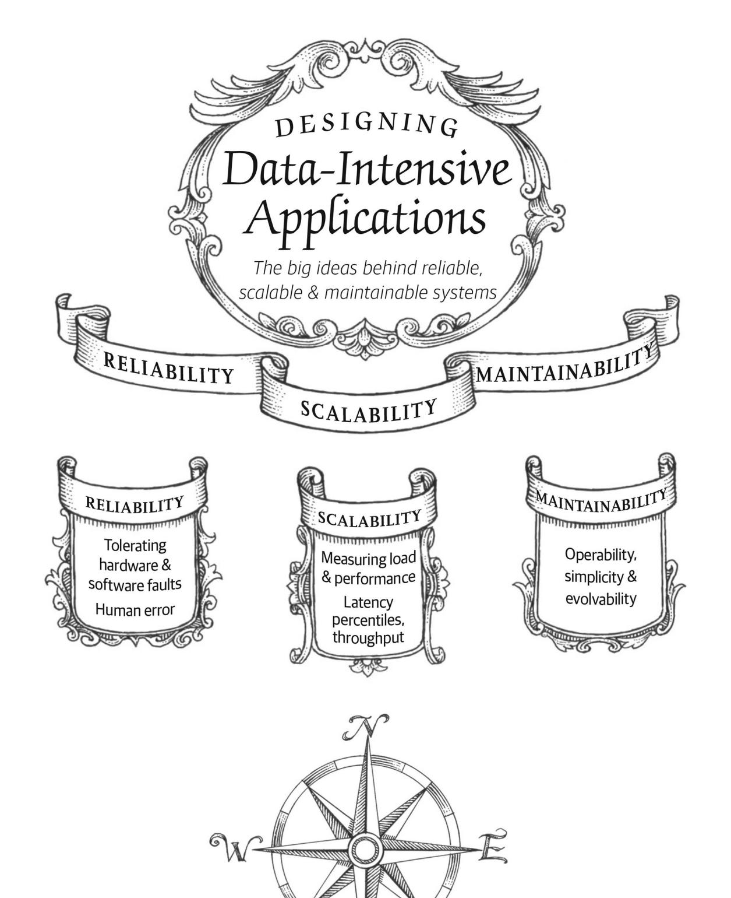

## <span id="page-24-0"></span>**Reliable, Scalable, and Maintainable Applications**

*The Internet was done so well that most people think of it as a natural resource like the Pacific Ocean, rather than something that was man-made. When was the last time a tech‐ nology with a scale like that was so error-free?*

—[Alan Kay](http://www.drdobbs.com/architecture-and-design/interview-with-alan-kay/240003442), in interview with *Dr Dobb's Journal* (2012)

Many applications today are *data-intensive*, as opposed to *compute-intensive*. Raw CPU power is rarely a limiting factor for these applications—bigger problems are usually the amount of data, the complexity of data, and the speed at which it is changing.

A data-intensive application is typically built from standard building blocks that pro‐ vide commonly needed functionality. For example, many applications need to:

- Store data so that they, or another application, can find it again later (*databases*)
- Remember the result of an expensive operation, to speed up reads (*caches*)
- Allow users to search data by keyword or filter it in various ways (*search indexes*)
- Send a message to another process, to be handled asynchronously (*stream pro‐ cessing*)
- Periodically crunch a large amount of accumulated data (*batch processing*)

If that sounds painfully obvious, that's just because these *data systems* are such a suc‐ cessful abstraction: we use them all the time without thinking too much. When build‐ ing an application, most engineers wouldn't dream of writing a new data storage engine from scratch, because databases are a perfectly good tool for the job.

<span id="page-25-0"></span>But reality is not that simple. There are many database systems with different charac‐ teristics, because different applications have different requirements. There are vari‐ ous approaches to caching, several ways of building search indexes, and so on. When building an application, we still need to figure out which tools and which approaches are the most appropriate for the task at hand. And it can be hard to combine tools when you need to do something that a single tool cannot do alone.

This book is a journey through both the principles and the practicalities of data sys‐ tems, and how you can use them to build data-intensive applications. We will explore what different tools have in common, what distinguishes them, and how they achieve their characteristics.

In this chapter, we will start by exploring the fundamentals of what we are trying to achieve: reliable, scalable, and maintainable data systems. We'll clarify what those things mean, outline some ways of thinking about them, and go over the basics that we will need for later chapters. In the following chapters we will continue layer by layer, looking at different design decisions that need to be considered when working on a data-intensive application.

## **Thinking About Data Systems**

We typically think of databases, queues, caches, etc. as being very different categories of tools. Although a database and a message queue have some superficial similarity both store data for some time—they have very different access patterns, which means different performance characteristics, and thus very different implementations.

So why should we lump them all together under an umbrella term like *data systems*?

Many new tools for data storage and processing have emerged in recent years. They are optimized for a variety of different use cases, and they no longer neatly fit into traditional categories [\[1](#page-44-0)]. For example, there are datastores that are also used as mes‐ sage queues (Redis), and there are message queues with database-like durability guar‐ antees (Apache Kafka). The boundaries between the categories are becoming blurred.

Secondly, increasingly many applications now have such demanding or wide-ranging requirements that a single tool can no longer meet all of its data processing and stor‐ age needs. Instead, the work is broken down into tasks that *can* be performed effi‐ ciently on a single tool, and those different tools are stitched together using application code.

For example, if you have an application-managed caching layer (using Memcached or similar), or a full-text search server (such as Elasticsearch or Solr) separate from your main database, it is normally the application code's responsibility to keep those caches and indexes in sync with the main database. [Figure 1-1](#page-26-0) gives a glimpse of what this may look like (we will go into detail in later chapters).

<span id="page-26-0"></span>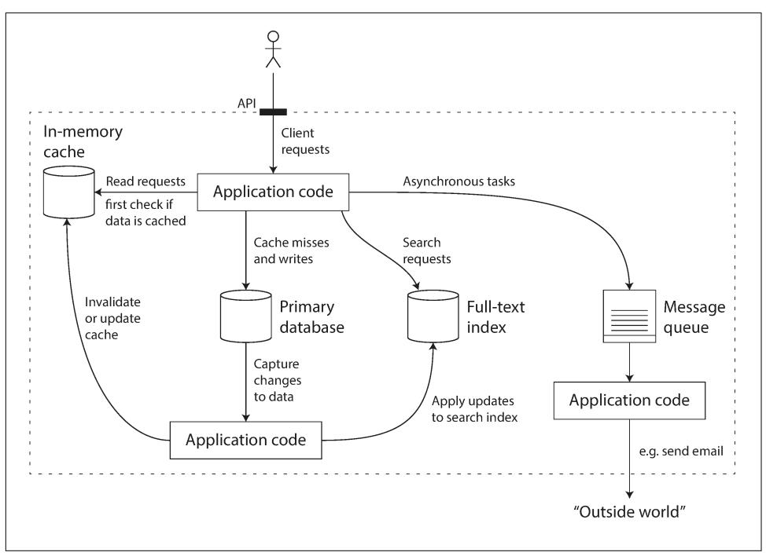

*Figure 1-1. One possible architecture for a data system that combines several components.*

When you combine several tools in order to provide a service, the service's interface or application programming interface (API) usually hides those implementation details from clients. Now you have essentially created a new, special-purpose data system from smaller, general-purpose components. Your composite data system may provide certain guarantees: e.g., that the cache will be correctly invalidated or upda‐ ted on writes so that outside clients see consistent results. You are now not only an application developer, but also a data system designer.

If you are designing a data system or service, a lot of tricky questions arise. How do you ensure that the data remains correct and complete, even when things go wrong internally? How do you provide consistently good performance to clients, even when parts of your system are degraded? How do you scale to handle an increase in load? What does a good API for the service look like?

There are many factors that may influence the design of a data system, including the skills and experience of the people involved, legacy system dependencies, the time‐ scale for delivery, your organization's tolerance of different kinds of risk, regulatory constraints, etc. Those factors depend very much on the situation.

<span id="page-27-0"></span>In this book, we focus on three concerns that are important in most software systems:

## *Reliability*

The system should continue to work *correctly* (performing the correct function at the desired level of performance) even in the face of *adversity* (hardware or soft‐ ware faults, and even human error). See "Reliability" on page 6.

## *Scalability*

As the system *grows* (in data volume, traffic volume, or complexity), there should be reasonable ways of dealing with that growth. See ["Scalability" on page 10.](#page-31-0)

## *Maintainability*

Over time, many different people will work on the system (engineering and oper‐ ations, both maintaining current behavior and adapting the system to new use cases), and they should all be able to work on it *productively*. See ["Maintainabil‐](#page-39-0) [ity" on page 18.](#page-39-0)

These words are often cast around without a clear understanding of what they mean. In the interest of thoughtful engineering, we will spend the rest of this chapter exploring ways of thinking about reliability, scalability, and maintainability. Then, in the following chapters, we will look at various techniques, architectures, and algo‐ rithms that are used in order to achieve those goals.

## **Reliability**

Everybody has an intuitive idea of what it means for something to be reliable or unre‐ liable. For software, typical expectations include:

- The application performs the function that the user expected.
- It can tolerate the user making mistakes or using the software in unexpected ways.
- Its performance is good enough for the required use case, under the expected load and data volume.
- The system prevents any unauthorized access and abuse.

If all those things together mean "working correctly," then we can understand *relia‐ bility* as meaning, roughly, "continuing to work correctly, even when things go wrong."

The things that can go wrong are called *faults*, and systems that anticipate faults and can cope with them are called *fault-tolerant* or *resilient*. The former term is slightly misleading: it suggests that we could make a system tolerant of every possible kind of fault, which in reality is not feasible. If the entire planet Earth (and all servers on it) were swallowed by a black hole, tolerance of that fault would require web hosting in <span id="page-28-0"></span>space—good luck getting that budget item approved. So it only makes sense to talk about tolerating *certain types* of faults.

Note that a fault is not the same as a failure [\[2](#page-44-0)]. A fault is usually defined as one com‐ ponent of the system deviating from its spec, whereas a *failure* is when the system as a whole stops providing the required service to the user. It is impossible to reduce the probability of a fault to zero; therefore it is usually best to design fault-tolerance mechanisms that prevent faults from causing failures. In this book we cover several techniques for building reliable systems from unreliable parts.

Counterintuitively, in such fault-tolerant systems, it can make sense to *increase* the rate of faults by triggering them deliberately—for example, by randomly killing indi‐ vidual processes without warning. Many critical bugs are actually due to poor error handling [\[3](#page-44-0)]; by deliberately inducing faults, you ensure that the fault-tolerance machinery is continually exercised and tested, which can increase your confidence that faults will be handled correctly when they occur naturally. The Netflix *Chaos Monkey* [[4\]](#page-44-0) is an example of this approach.

Although we generally prefer tolerating faults over preventing faults, there are cases where prevention is better than cure (e.g., because no cure exists). This is the case with security matters, for example: if an attacker has compromised a system and gained access to sensitive data, that event cannot be undone. However, this book mostly deals with the kinds of faults that can be cured, as described in the following sections.

## **Hardware Faults**

When we think of causes of system failure, hardware faults quickly come to mind. Hard disks crash, RAM becomes faulty, the power grid has a blackout, someone unplugs the wrong network cable. Anyone who has worked with large datacenters can tell you that these things happen *all the time* when you have a lot of machines.

Hard disks are reported as having a mean time to failure (MTTF) of about 10 to 50 years [[5,](#page-44-0) [6\]](#page-44-0). Thus, on a storage cluster with 10,000 disks, we should expect on average one disk to die per day.

Our first response is usually to add redundancy to the individual hardware compo‐ nents in order to reduce the failure rate of the system. Disks may be set up in a RAID configuration, servers may have dual power supplies and hot-swappable CPUs, and datacenters may have batteries and diesel generators for backup power. When one component dies, the redundant component can take its place while the broken com‐ ponent is replaced. This approach cannot completely prevent hardware problems from causing failures, but it is well understood and can often keep a machine running uninterrupted for years.

<span id="page-29-0"></span>Until recently, redundancy of hardware components was sufficient for most applica‐ tions, since it makes total failure of a single machine fairly rare. As long as you can restore a backup onto a new machine fairly quickly, the downtime in case of failure is not catastrophic in most applications. Thus, multi-machine redundancy was only required by a small number of applications for which high availability was absolutely essential.

However, as data volumes and applications' computing demands have increased, more applications have begun using larger numbers of machines, which proportion‐ ally increases the rate of hardware faults. Moreover, in some cloud platforms such as Amazon Web Services (AWS) it is fairly common for virtual machine instances to become unavailable without warning [\[7](#page-44-0)], as the platforms are designed to prioritize flexibility and elasticity<sup>i</sup> over single-machine reliability.

Hence there is a move toward systems that can tolerate the loss of entire machines, by using software fault-tolerance techniques in preference or in addition to hardware redundancy. Such systems also have operational advantages: a single-server system requires planned downtime if you need to reboot the machine (to apply operating system security patches, for example), whereas a system that can tolerate machine failure can be patched one node at a time, without downtime of the entire system (a *rolling upgrade*; see [Chapter 4\)](#page-132-0).

## **Software Errors**

We usually think of hardware faults as being random and independent from each other: one machine's disk failing does not imply that another machine's disk is going to fail. There may be weak correlations (for example due to a common cause, such as the temperature in the server rack), but otherwise it is unlikely that a large number of hardware components will fail at the same time.

Another class of fault is a systematic error within the system [\[8\]](#page-45-0). Such faults are harder to anticipate, and because they are correlated across nodes, they tend to cause many more system failures than uncorrelated hardware faults [\[5](#page-44-0)]. Examples include:

- A software bug that causes every instance of an application server to crash when given a particular bad input. For example, consider the leap second on June 30, 2012, that caused many applications to hang simultaneously due to a bug in the Linux kernel [[9\]](#page-45-0).
- A runaway process that uses up some shared resource—CPU time, memory, disk space, or network bandwidth.

i. Defined in ["Approaches for Coping with Load" on page 17](#page-38-0).

- <span id="page-30-0"></span>• A service that the system depends on that slows down, becomes unresponsive, or starts returning corrupted responses.
- Cascading failures, where a small fault in one component triggers a fault in another component, which in turn triggers further faults [[10\]](#page-45-0).

The bugs that cause these kinds of software faults often lie dormant for a long time until they are triggered by an unusual set of circumstances. In those circumstances, it is revealed that the software is making some kind of assumption about its environ‐ ment—and while that assumption is usually true, it eventually stops being true for some reason [[11\]](#page-45-0).

There is no quick solution to the problem of systematic faults in software. Lots of small things can help: carefully thinking about assumptions and interactions in the system; thorough testing; process isolation; allowing processes to crash and restart; measuring, monitoring, and analyzing system behavior in production. If a system is expected to provide some guarantee (for example, in a message queue, that the num‐ ber of incoming messages equals the number of outgoing messages), it can constantly check itself while it is running and raise an alert if a discrepancy is found [[12\]](#page-45-0).

## **Human Errors**

Humans design and build software systems, and the operators who keep the systems running are also human. Even when they have the best intentions, humans are known to be unreliable. For example, one study of large internet services found that configuration errors by operators were the leading cause of outages, whereas hard‐ ware faults (servers or network) played a role in only 10–25% of outages [\[13](#page-45-0)].

How do we make our systems reliable, in spite of unreliable humans? The best sys‐ tems combine several approaches:

- Design systems in a way that minimizes opportunities for error. For example, well-designed abstractions, APIs, and admin interfaces make it easy to do "the right thing" and discourage "the wrong thing." However, if the interfaces are too restrictive people will work around them, negating their benefit, so this is a tricky balance to get right.
- Decouple the places where people make the most mistakes from the places where they can cause failures. In particular, provide fully featured non-production *sandbox* environments where people can explore and experiment safely, using real data, without affecting real users.
- Test thoroughly at all levels, from unit tests to whole-system integration tests and manual tests [\[3](#page-44-0)]. Automated testing is widely used, well understood, and espe‐ cially valuable for covering corner cases that rarely arise in normal operation.

- <span id="page-31-0"></span>• Allow quick and easy recovery from human errors, to minimize the impact in the case of a failure. For example, make it fast to roll back configuration changes, roll out new code gradually (so that any unexpected bugs affect only a small subset of users), and provide tools to recompute data (in case it turns out that the old com‐ putation was incorrect).
- Set up detailed and clear monitoring, such as performance metrics and error rates. In other engineering disciplines this is referred to as *telemetry*. (Once a rocket has left the ground, telemetry is essential for tracking what is happening, and for understanding failures [\[14](#page-45-0)].) Monitoring can show us early warning sig‐ nals and allow us to check whether any assumptions or constraints are being vio‐ lated. When a problem occurs, metrics can be invaluable in diagnosing the issue.
- Implement good management practices and training—a complex and important aspect, and beyond the scope of this book.

## **How Important Is Reliability?**

Reliability is not just for nuclear power stations and air traffic control software more mundane applications are also expected to work reliably. Bugs in business applications cause lost productivity (and legal risks if figures are reported incor‐ rectly), and outages of ecommerce sites can have huge costs in terms of lost revenue and damage to reputation.

Even in "noncritical" applications we have a responsibility to our users. Consider a parent who stores all their pictures and videos of their children in your photo appli‐ cation [[15\]](#page-45-0). How would they feel if that database was suddenly corrupted? Would they know how to restore it from a backup?

There are situations in which we may choose to sacrifice reliability in order to reduce development cost (e.g., when developing a prototype product for an unproven mar‐ ket) or operational cost (e.g., for a service with a very narrow profit margin)—but we should be very conscious of when we are cutting corners.

## **Scalability**

Even if a system is working reliably today, that doesn't mean it will necessarily work reliably in the future. One common reason for degradation is increased load: perhaps the system has grown from 10,000 concurrent users to 100,000 concurrent users, or from 1 million to 10 million. Perhaps it is processing much larger volumes of data than it did before.

*Scalability* is the term we use to describe a system's ability to cope with increased load. Note, however, that it is not a one-dimensional label that we can attach to a sys‐ tem: it is meaningless to say "X is scalable" or "Y doesn't scale." Rather, discussing

<span id="page-32-0"></span>scalability means considering questions like "If the system grows in a particular way, what are our options for coping with the growth?" and "How can we add computing resources to handle the additional load?"

## **Describing Load**

First, we need to succinctly describe the current load on the system; only then can we discuss growth questions (what happens if our load doubles?). Load can be described with a few numbers which we call *load parameters*. The best choice of parameters depends on the architecture of your system: it may be requests per second to a web server, the ratio of reads to writes in a database, the number of simultaneously active users in a chat room, the hit rate on a cache, or something else. Perhaps the average case is what matters for you, or perhaps your bottleneck is dominated by a small number of extreme cases.

To make this idea more concrete, let's consider Twitter as an example, using data published in November 2012 [\[16](#page-45-0)]. Two of Twitter's main operations are:

#### *Post tweet*

A user can publish a new message to their followers (4.6k requests/sec on aver‐ age, over 12k requests/sec at peak).

#### *Home timeline*

A user can view tweets posted by the people they follow (300k requests/sec).

Simply handling 12,000 writes per second (the peak rate for posting tweets) would be fairly easy. However, Twitter's scaling challenge is not primarily due to tweet volume, but due to *fan-out*ii—each user follows many people, and each user is followed by many people. There are broadly two ways of implementing these two operations:

1. Posting a tweet simply inserts the new tweet into a global collection of tweets. When a user requests their home timeline, look up all the people they follow, find all the tweets for each of those users, and merge them (sorted by time). In a relational database like in [Figure 1-2,](#page-33-0) you could write a query such as:

```
SELECT tweets.*, users.* FROM tweets
 JOIN users ON tweets.sender_id = users.id
 JOIN follows ON follows.followee_id = users.id
 WHERE follows.follower_id = current_user
```

ii. A term borrowed from electronic engineering, where it describes the number of logic gate inputs that are attached to another gate's output. The output needs to supply enough current to drive all the attached inputs. In transaction processing systems, we use it to describe the number of requests to other services that we need to make in order to serve one incoming request.

<span id="page-33-0"></span>2. Maintain a cache for each user's home timeline—like a mailbox of tweets for each recipient user (see Figure 1-3). When a user *posts a tweet*, look up all the people who follow that user, and insert the new tweet into each of their home timeline caches. The request to read the home timeline is then cheap, because its result has been computed ahead of time.

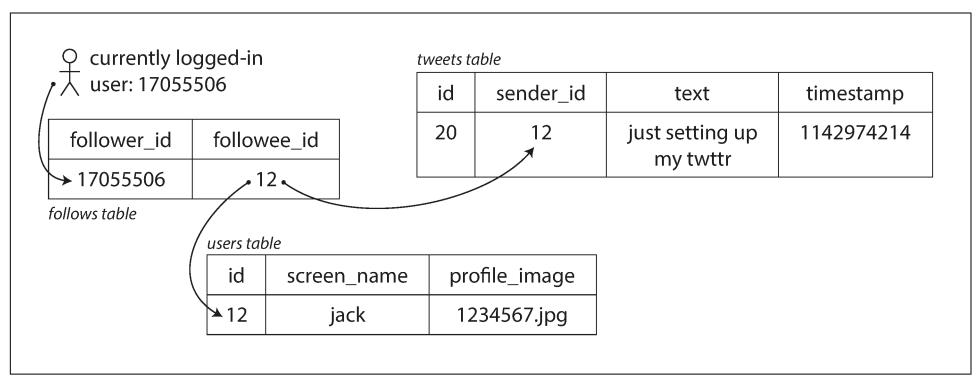

*Figure 1-2. Simple relational schema for implementing a Twitter home timeline.*


*Figure 1-3. Twitter's data pipeline for delivering tweets to followers, with load parame‐ ters as of November 2012 [[16\]](#page-45-0).*

The first version of Twitter used approach 1, but the systems struggled to keep up with the load of home timeline queries, so the company switched to approach 2. This works better because the average rate of published tweets is almost two orders of magnitude lower than the rate of home timeline reads, and so in this case it's prefera‐ ble to do more work at write time and less at read time.

However, the downside of approach 2 is that posting a tweet now requires a lot of extra work. On average, a tweet is delivered to about 75 followers, so 4.6k tweets per second become 345k writes per second to the home timeline caches. But this average hides the fact that the number of followers per user varies wildly, and some users

<span id="page-34-0"></span>have over 30 million followers. This means that a single tweet may result in over 30 million writes to home timelines! Doing this in a timely manner—Twitter tries to deliver tweets to followers within five seconds—is a significant challenge.

In the example of Twitter, the distribution of followers per user (maybe weighted by how often those users tweet) is a key load parameter for discussing scalability, since it determines the fan-out load. Your application may have very different characteristics, but you can apply similar principles to reasoning about its load.

The final twist of the Twitter anecdote: now that approach 2 is robustly implemented, Twitter is moving to a hybrid of both approaches. Most users' tweets continue to be fanned out to home timelines at the time when they are posted, but a small number of users with a very large number of followers (i.e., celebrities) are excepted from this fan-out. Tweets from any celebrities that a user may follow are fetched separately and merged with that user's home timeline when it is read, like in approach 1. This hybrid approach is able to deliver consistently good performance. We will revisit this exam‐ ple in [Chapter 12](#page-510-0) after we have covered some more technical ground.

## **Describing Performance**

Once you have described the load on your system, you can investigate what happens when the load increases. You can look at it in two ways:

- When you increase a load parameter and keep the system resources (CPU, mem‐ ory, network bandwidth, etc.) unchanged, how is the performance of your system affected?
- When you increase a load parameter, how much do you need to increase the resources if you want to keep performance unchanged?

Both questions require performance numbers, so let's look briefly at describing the performance of a system.

In a batch processing system such as Hadoop, we usually care about *throughput*—the number of records we can process per second, or the total time it takes to run a job on a dataset of a certain size.iii In online systems, what's usually more important is the service's *response time*—that is, the time between a client sending a request and receiving a response.

iii. In an ideal world, the running time of a batch job is the size of the dataset divided by the throughput. In practice, the running time is often longer, due to skew (data not being spread evenly across worker processes) and needing to wait for the slowest task to complete.

<span id="page-35-0"></span>

#### **Latency and response time**

*Latency* and *response time* are often used synonymously, but they are not the same. The response time is what the client sees: besides the actual time to process the request (the *service time*), it includes network delays and queueing delays. Latency is the duration that a request is waiting to be handled—during which it is *latent*, await‐ ing service [[17](#page-45-0)].

Even if you only make the same request over and over again, you'll get a slightly dif‐ ferent response time on every try. In practice, in a system handling a variety of requests, the response time can vary a lot. We therefore need to think of response time not as a single number, but as a *distribution* of values that you can measure.

In Figure 1-4, each gray bar represents a request to a service, and its height shows how long that request took. Most requests are reasonably fast, but there are occa‐ sional *outliers* that take much longer. Perhaps the slow requests are intrinsically more expensive, e.g., because they process more data. But even in a scenario where you'd think all requests should take the same time, you get variation: random additional latency could be introduced by a context switch to a background process, the loss of a network packet and TCP retransmission, a garbage collection pause, a page fault forcing a read from disk, mechanical vibrations in the server rack [[18](#page-45-0)], or many other causes.

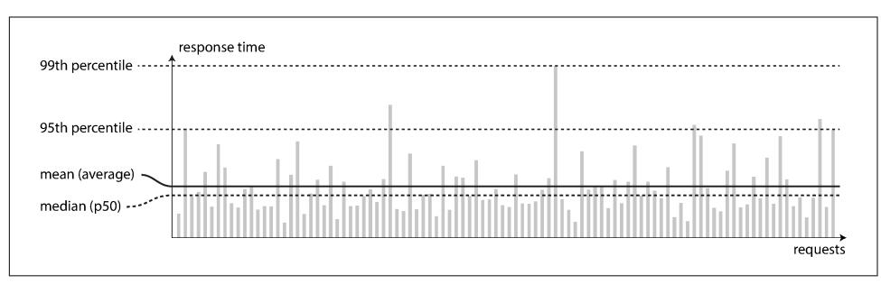

*Figure 1-4. Illustrating mean and percentiles: response times for a sample of 100 requests to a service.*

It's common to see the *average* response time of a service reported. (Strictly speaking, the term "average" doesn't refer to any particular formula, but in practice it is usually understood as the *arithmetic mean*: given *n* values, add up all the values, and divide by *n*.) However, the mean is not a very good metric if you want to know your "typi‐ cal" response time, because it doesn't tell you how many users actually experienced that delay.

Usually it is better to use *percentiles*. If you take your list of response times and sort it from fastest to slowest, then the *median* is the halfway point: for example, if your <span id="page-36-0"></span>median response time is 200 ms, that means half your requests return in less than 200 ms, and half your requests take longer than that.

This makes the median a good metric if you want to know how long users typically have to wait: half of user requests are served in less than the median response time, and the other half take longer than the median. The median is also known as the *50th percentile*, and sometimes abbreviated as *p50*. Note that the median refers to a single request; if the user makes several requests (over the course of a session, or because several resources are included in a single page), the probability that at least one of them is slower than the median is much greater than 50%.

In order to figure out how bad your outliers are, you can look at higher percentiles: the *95th*, *99th*, and *99.9th* percentiles are common (abbreviated *p95*, *p99*, and *p999*). They are the response time thresholds at which 95%, 99%, or 99.9% of requests are faster than that particular threshold. For example, if the 95th percentile response time is 1.5 seconds, that means 95 out of 100 requests take less than 1.5 seconds, and 5 out of 100 requests take 1.5 seconds or more. This is illustrated in [Figure 1-4.](#page-35-0)

High percentiles of response times, also known as *tail latencies*, are important because they directly affect users' experience of the service. For example, Amazon describes response time requirements for internal services in terms of the 99.9th per‐ centile, even though it only affects 1 in 1,000 requests. This is because the customers with the slowest requests are often those who have the most data on their accounts because they have made many purchases—that is, they're the most valuable custom‐ ers [[19\]](#page-45-0). It's important to keep those customers happy by ensuring the website is fast for them: Amazon has also observed that a 100 ms increase in response time reduces sales by 1% [[20\]](#page-45-0), and others report that a 1-second slowdown reduces a customer sat‐ isfaction metric by 16% [[21,](#page-45-0) [22\]](#page-45-0).

On the other hand, optimizing the 99.99th percentile (the slowest 1 in 10,000 requests) was deemed too expensive and to not yield enough benefit for Amazon's purposes. Reducing response times at very high percentiles is difficult because they are easily affected by random events outside of your control, and the benefits are diminishing.

For example, percentiles are often used in *service level objectives* (SLOs) and *service level agreements* (SLAs), contracts that define the expected performance and availa‐ bility of a service. An SLA may state that the service is considered to be up if it has a median response time of less than 200 ms and a 99th percentile under 1 s (if the response time is longer, it might as well be down), and the service may be required to be up at least 99.9% of the time. These metrics set expectations for clients of the ser‐ vice and allow customers to demand a refund if the SLA is not met.

Queueing delays often account for a large part of the response time at high percen‐ tiles. As a server can only process a small number of things in parallel (limited, for <span id="page-37-0"></span>example, by its number of CPU cores), it only takes a small number of slow requests to hold up the processing of subsequent requests—an effect sometimes known as *head-of-line blocking*. Even if those subsequent requests are fast to process on the server, the client will see a slow overall response time due to the time waiting for the prior request to complete. Due to this effect, it is important to measure response times on the client side.

When generating load artificially in order to test the scalability of a system, the loadgenerating client needs to keep sending requests independently of the response time. If the client waits for the previous request to complete before sending the next one, that behavior has the effect of artificially keeping the queues shorter in the test than they would be in reality, which skews the measurements [[23\]](#page-45-0).

## **Percentiles in Practice**

High percentiles become especially important in backend services that are called mul‐ tiple times as part of serving a single end-user request. Even if you make the calls in parallel, the end-user request still needs to wait for the slowest of the parallel calls to complete. It takes just one slow call to make the entire end-user request slow, as illus‐ trated in [Figure 1-5.](#page-38-0) Even if only a small percentage of backend calls are slow, the chance of getting a slow call increases if an end-user request requires multiple back‐ end calls, and so a higher proportion of end-user requests end up being slow (an effect known as *tail latency amplification* [[24](#page-46-0)]).

If you want to add response time percentiles to the monitoring dashboards for your services, you need to efficiently calculate them on an ongoing basis. For example, you may want to keep a rolling window of response times of requests in the last 10 minutes. Every minute, you calculate the median and various percentiles over the val‐ ues in that window and plot those metrics on a graph.

The naïve implementation is to keep a list of response times for all requests within the time window and to sort that list every minute. If that is too inefficient for you, there are algorithms that can calculate a good approximation of percentiles at minimal CPU and memory cost, such as forward decay [[25](#page-46-0)], t-digest [[26](#page-46-0)], or HdrHistogram [[27](#page-46-0)]. Beware that averaging percentiles, e.g., to reduce the time resolution or to com‐ bine data from several machines, is mathematically meaningless—the right way of aggregating response time data is to add the histograms [[28](#page-46-0)].

<span id="page-38-0"></span>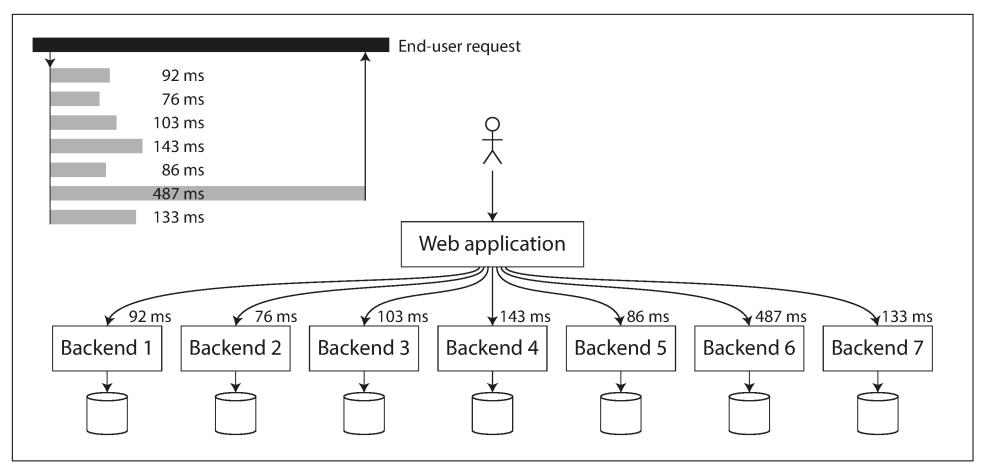

*Figure 1-5. When several backend calls are needed to serve a request, it takes just a sin‐ gle slow backend request to slow down the entire end-user request.*

## **Approaches for Coping with Load**

Now that we have discussed the parameters for describing load and metrics for meas‐ uring performance, we can start discussing scalability in earnest: how do we maintain good performance even when our load parameters increase by some amount?

An architecture that is appropriate for one level of load is unlikely to cope with 10 times that load. If you are working on a fast-growing service, it is therefore likely that you will need to rethink your architecture on every order of magnitude load increase —or perhaps even more often than that.

People often talk of a dichotomy between *scaling up* (*vertical scaling*, moving to a more powerful machine) and *scaling out* (*horizontal scaling*, distributing the load across multiple smaller machines). Distributing load across multiple machines is also known as a *shared-nothing* architecture. A system that can run on a single machine is often simpler, but high-end machines can become very expensive, so very intensive workloads often can't avoid scaling out. In reality, good architectures usually involve a pragmatic mixture of approaches: for example, using several fairly powerful machines can still be simpler and cheaper than a large number of small virtual machines.

Some systems are *elastic*, meaning that they can automatically add computing resour‐ ces when they detect a load increase, whereas other systems are scaled manually (a human analyzes the capacity and decides to add more machines to the system). An elastic system can be useful if load is highly unpredictable, but manually scaled sys‐ tems are simpler and may have fewer operational surprises (see ["Rebalancing Parti‐](#page-230-0) [tions" on page 209](#page-230-0)).

<span id="page-39-0"></span>While distributing stateless services across multiple machines is fairly straightfor‐ ward, taking stateful data systems from a single node to a distributed setup can intro‐ duce a lot of additional complexity. For this reason, common wisdom until recently was to keep your database on a single node (scale up) until scaling cost or highavailability requirements forced you to make it distributed.

As the tools and abstractions for distributed systems get better, this common wisdom may change, at least for some kinds of applications. It is conceivable that distributed data systems will become the default in the future, even for use cases that don't han‐ dle large volumes of data or traffic. Over the course of the rest of this book we will cover many kinds of distributed data systems, and discuss how they fare not just in terms of scalability, but also ease of use and maintainability.

The architecture of systems that operate at large scale is usually highly specific to the application—there is no such thing as a generic, one-size-fits-all scalable architecture (informally known as *magic scaling sauce*). The problem may be the volume of reads, the volume of writes, the volume of data to store, the complexity of the data, the response time requirements, the access patterns, or (usually) some mixture of all of these plus many more issues.

For example, a system that is designed to handle 100,000 requests per second, each 1 kB in size, looks very different from a system that is designed for 3 requests per minute, each 2 GB in size—even though the two systems have the same data through‐ put.

An architecture that scales well for a particular application is built around assump‐ tions of which operations will be common and which will be rare—the load parame‐ ters. If those assumptions turn out to be wrong, the engineering effort for scaling is at best wasted, and at worst counterproductive. In an early-stage startup or an unpro‐ ven product it's usually more important to be able to iterate quickly on product fea‐ tures than it is to scale to some hypothetical future load.

Even though they are specific to a particular application, scalable architectures are nevertheless usually built from general-purpose building blocks, arranged in familiar patterns. In this book we discuss those building blocks and patterns.

## **Maintainability**

It is well known that the majority of the cost of software is not in its initial develop‐ ment, but in its ongoing maintenance—fixing bugs, keeping its systems operational, investigating failures, adapting it to new platforms, modifying it for new use cases, repaying technical debt, and adding new features.

Yet, unfortunately, many people working on software systems dislike maintenance of so-called *legacy* systems—perhaps it involves fixing other people's mistakes, or work‐ <span id="page-40-0"></span>ing with platforms that are now outdated, or systems that were forced to do things they were never intended for. Every legacy system is unpleasant in its own way, and so it is difficult to give general recommendations for dealing with them.

However, we can and should design software in such a way that it will hopefully min‐ imize pain during maintenance, and thus avoid creating legacy software ourselves. To this end, we will pay particular attention to three design principles for software systems:

#### *Operability*

Make it easy for operations teams to keep the system running smoothly.

## *Simplicity*

Make it easy for new engineers to understand the system, by removing as much complexity as possible from the system. (Note this is not the same as simplicity of the user interface.)

## *Evolvability*

Make it easy for engineers to make changes to the system in the future, adapting it for unanticipated use cases as requirements change. Also known as *extensibil‐ ity*, *modifiability*, or *plasticity*.

As previously with reliability and scalability, there are no easy solutions for achieving these goals. Rather, we will try to think about systems with operability, simplicity, and evolvability in mind.

## **Operability: Making Life Easy for Operations**

It has been suggested that "good operations can often work around the limitations of bad (or incomplete) software, but good software cannot run reliably with bad opera‐ tions" [[12\]](#page-45-0). While some aspects of operations can and should be automated, it is still up to humans to set up that automation in the first place and to make sure it's work‐ ing correctly.

Operations teams are vital to keeping a software system running smoothly. A good operations team typically is responsible for the following, and more [\[29](#page-46-0)]:

- Monitoring the health of the system and quickly restoring service if it goes into a bad state
- Tracking down the cause of problems, such as system failures or degraded per‐ formance
- Keeping software and platforms up to date, including security patches
- Keeping tabs on how different systems affect each other, so that a problematic change can be avoided before it causes damage

- <span id="page-41-0"></span>• Anticipating future problems and solving them before they occur (e.g., capacity planning)
- Establishing good practices and tools for deployment, configuration manage‐ ment, and more
- Performing complex maintenance tasks, such as moving an application from one platform to another
- Maintaining the security of the system as configuration changes are made
- Defining processes that make operations predictable and help keep the produc‐ tion environment stable
- Preserving the organization's knowledge about the system, even as individual people come and go

Good operability means making routine tasks easy, allowing the operations team to focus their efforts on high-value activities. Data systems can do various things to make routine tasks easy, including:

- Providing visibility into the runtime behavior and internals of the system, with good monitoring
- Providing good support for automation and integration with standard tools
- Avoiding dependency on individual machines (allowing machines to be taken down for maintenance while the system as a whole continues running uninter‐ rupted)
- Providing good documentation and an easy-to-understand operational model ("If I do X, Y will happen")
- Providing good default behavior, but also giving administrators the freedom to override defaults when needed
- Self-healing where appropriate, but also giving administrators manual control over the system state when needed
- Exhibiting predictable behavior, minimizing surprises

## **Simplicity: Managing Complexity**

Small software projects can have delightfully simple and expressive code, but as projects get larger, they often become very complex and difficult to understand. This complexity slows down everyone who needs to work on the system, further increas‐ ing the cost of maintenance. A software project mired in complexity is sometimes described as a *big ball of mud* [[30\]](#page-46-0).

<span id="page-42-0"></span>There are various possible symptoms of complexity: explosion of the state space, tight coupling of modules, tangled dependencies, inconsistent naming and terminology, hacks aimed at solving performance problems, special-casing to work around issues elsewhere, and many more. Much has been said on this topic already [\[31](#page-46-0), [32](#page-46-0), [33](#page-46-0)].

When complexity makes maintenance hard, budgets and schedules are often over‐ run. In complex software, there is also a greater risk of introducing bugs when mak‐ ing a change: when the system is harder for developers to understand and reason about, hidden assumptions, unintended consequences, and unexpected interactions are more easily overlooked. Conversely, reducing complexity greatly improves the maintainability of software, and thus simplicity should be a key goal for the systems we build.

Making a system simpler does not necessarily mean reducing its functionality; it can also mean removing *accidental* complexity. Moseley and Marks [\[32](#page-46-0)] define complex‐ ity as accidental if it is not inherent in the problem that the software solves (as seen by the users) but arises only from the implementation.

One of the best tools we have for removing accidental complexity is *abstraction*. A good abstraction can hide a great deal of implementation detail behind a clean, simple-to-understand façade. A good abstraction can also be used for a wide range of different applications. Not only is this reuse more efficient than reimplementing a similar thing multiple times, but it also leads to higher-quality software, as quality improvements in the abstracted component benefit all applications that use it.

For example, high-level programming languages are abstractions that hide machine code, CPU registers, and syscalls. SQL is an abstraction that hides complex on-disk and in-memory data structures, concurrent requests from other clients, and inconsis‐ tencies after crashes. Of course, when programming in a high-level language, we are still using machine code; we are just not using it *directly*, because the programming language abstraction saves us from having to think about it.

However, finding good abstractions is very hard. In the field of distributed systems, although there are many good algorithms, it is much less clear how we should be packaging them into abstractions that help us keep the complexity of the system at a manageable level.

Throughout this book, we will keep our eyes open for good abstractions that allow us to extract parts of a large system into well-defined, reusable components.

## **Evolvability: Making Change Easy**

It's extremely unlikely that your system's requirements will remain unchanged for‐ ever. They are much more likely to be in constant flux: you learn new facts, previ‐ ously unanticipated use cases emerge, business priorities change, users request new <span id="page-43-0"></span>features, new platforms replace old platforms, legal or regulatory requirements change, growth of the system forces architectural changes, etc.

In terms of organizational processes, *Agile* working patterns provide a framework for adapting to change. The Agile community has also developed technical tools and pat‐ terns that are helpful when developing software in a frequently changing environ‐ ment, such as test-driven development (TDD) and refactoring.

Most discussions of these Agile techniques focus on a fairly small, local scale (a cou‐ ple of source code files within the same application). In this book, we search for ways of increasing agility on the level of a larger data system, perhaps consisting of several different applications or services with different characteristics. For example, how would you "refactor" Twitter's architecture for assembling home timelines (["Describ‐](#page-32-0) [ing Load" on page 11](#page-32-0)) from approach 1 to approach 2?

The ease with which you can modify a data system, and adapt it to changing require‐ ments, is closely linked to its simplicity and its abstractions: simple and easy-tounderstand systems are usually easier to modify than complex ones. But since this is such an important idea, we will use a different word to refer to agility on a data sys‐ tem level: *evolvability* [\[34](#page-46-0)].

## **Summary**

In this chapter, we have explored some fundamental ways of thinking about dataintensive applications. These principles will guide us through the rest of the book, where we dive into deep technical detail.

An application has to meet various requirements in order to be useful. There are *functional requirements* (what it should do, such as allowing data to be stored, retrieved, searched, and processed in various ways), and some *nonfunctional require‐ ments* (general properties like security, reliability, compliance, scalability, compatibil‐ ity, and maintainability). In this chapter we discussed reliability, scalability, and maintainability in detail.

*Reliability* means making systems work correctly, even when faults occur. Faults can be in hardware (typically random and uncorrelated), software (bugs are typically sys‐ tematic and hard to deal with), and humans (who inevitably make mistakes from time to time). Fault-tolerance techniques can hide certain types of faults from the end user.

*Scalability* means having strategies for keeping performance good, even when load increases. In order to discuss scalability, we first need ways of describing load and performance quantitatively. We briefly looked at Twitter's home timelines as an example of describing load, and response time percentiles as a way of measuring per‐

<span id="page-44-0"></span>formance. In a scalable system, you can add processing capacity in order to remain reliable under high load.

*Maintainability* has many facets, but in essence it's about making life better for the engineering and operations teams who need to work with the system. Good abstrac‐ tions can help reduce complexity and make the system easier to modify and adapt for new use cases. Good operability means having good visibility into the system's health, and having effective ways of managing it.

There is unfortunately no easy fix for making applications reliable, scalable, or main‐ tainable. However, there are certain patterns and techniques that keep reappearing in different kinds of applications. In the next few chapters we will take a look at some examples of data systems and analyze how they work toward those goals.

Later in the book, in [Part III,](#page-406-0) we will look at patterns for systems that consist of sev‐ eral components working together, such as the one in [Figure 1-1.](#page-26-0)

## **References**

- [[1\]](#page-25-0) Michael Stonebraker and Uğur Çetintemel: ["'One Size Fits All': An Idea Whose](http://citeseerx.ist.psu.edu/viewdoc/download?doi=10.1.1.68.9136&rep=rep1&type=pdf) [Time Has Come and Gone,](http://citeseerx.ist.psu.edu/viewdoc/download?doi=10.1.1.68.9136&rep=rep1&type=pdf)" at *21st International Conference on Data Engineering* (ICDE), April 2005.
- [[2\]](#page-28-0) Walter L. Heimerdinger and Charles B. Weinstock: "[A Conceptual Framework](http://www.sei.cmu.edu/reports/92tr033.pdf) [for System Fault Tolerance,](http://www.sei.cmu.edu/reports/92tr033.pdf)" Technical Report CMU/SEI-92-TR-033, Software Engi‐ neering Institute, Carnegie Mellon University, October 1992.
- [[3\]](#page-28-0) Ding Yuan, Yu Luo, Xin Zhuang, et al.: ["Simple Testing Can Prevent Most Criti‐](https://www.usenix.org/system/files/conference/osdi14/osdi14-paper-yuan.pdf) [cal Failures: An Analysis of Production Failures in Distributed Data-Intensive Sys‐](https://www.usenix.org/system/files/conference/osdi14/osdi14-paper-yuan.pdf) [tems](https://www.usenix.org/system/files/conference/osdi14/osdi14-paper-yuan.pdf)," at *11th USENIX Symposium on Operating Systems Design and Implementation* (OSDI), October 2014.
- [[4\]](#page-28-0) Yury Izrailevsky and Ariel Tseitlin: ["The Netflix Simian Army,](http://techblog.netflix.com/2011/07/netflix-simian-army.html)" *techblog.net‐ flix.com*, July 19, 2011.
- [[5\]](#page-28-0) Daniel Ford, François Labelle, Florentina I. Popovici, et al.: "[Availability in Glob‐](http://research.google.com/pubs/archive/36737.pdf) [ally Distributed Storage Systems,](http://research.google.com/pubs/archive/36737.pdf)" at *9th USENIX Symposium on Operating Systems Design and Implementation* (OSDI), October 2010.
- [[6\]](#page-28-0) Brian Beach: ["Hard Drive Reliability Update Sep 2014,](https://www.backblaze.com/blog/hard-drive-reliability-update-september-2014/)" *backblaze.com*, Septem‐ ber 23, 2014.
- [[7\]](#page-29-0) Laurie Voss: "[AWS: The Good, the Bad and the Ugly,](https://web.archive.org/web/20160429075023/http://blog.awe.sm/2012/12/18/aws-the-good-the-bad-and-the-ugly/)" *blog.awe.sm*, December 18, 2012.

- <span id="page-45-0"></span>[[8\]](#page-29-0) Haryadi S. Gunawi, Mingzhe Hao, Tanakorn Leesatapornwongsa, et al.: ["What](http://ucare.cs.uchicago.edu/pdf/socc14-cbs.pdf) [Bugs Live in the Cloud?](http://ucare.cs.uchicago.edu/pdf/socc14-cbs.pdf)," at *5th ACM Symposium on Cloud Computing* (SoCC), November 2014. [doi:10.1145/2670979.2670986](http://dx.doi.org/10.1145/2670979.2670986)
- [[9\]](#page-29-0) Nelson Minar: "[Leap Second Crashes Half the Internet](http://www.somebits.com/weblog/tech/bad/leap-second-2012.html)," *somebits.com*, July 3, 2012.
- [[10\]](#page-30-0) Amazon Web Services: ["Summary of the Amazon EC2 and Amazon RDS Ser‐](http://aws.amazon.com/message/65648/) [vice Disruption in the US East Region](http://aws.amazon.com/message/65648/)," *aws.amazon.com*, April 29, 2011.
- [[11\]](#page-30-0) Richard I. Cook: ["How Complex Systems Fail](http://web.mit.edu/2.75/resources/random/How%20Complex%20Systems%20Fail.pdf)," Cognitive Technologies Labora‐ tory, April 2000.
- [[12\]](#page-30-0) Jay Kreps: ["Getting Real About Distributed System Reliability,](http://blog.empathybox.com/post/19574936361/getting-real-about-distributed-system-reliability)" *blog.empathy‐ box.com*, March 19, 2012.
- [[13\]](#page-30-0) David Oppenheimer, Archana Ganapathi, and David A. Patterson: ["Why Do](http://static.usenix.org/legacy/events/usits03/tech/full_papers/oppenheimer/oppenheimer.pdf) [Internet Services Fail, and What Can Be Done About It?,](http://static.usenix.org/legacy/events/usits03/tech/full_papers/oppenheimer/oppenheimer.pdf)" at *4th USENIX Symposium on Internet Technologies and Systems* (USITS), March 2003.
- [[14\]](#page-31-0) Nathan Marz: ["Principles of Software Engineering, Part 1](http://nathanmarz.com/blog/principles-of-software-engineering-part-1.html)," *nathanmarz.com*, April 2, 2013.
- [[15\]](#page-31-0) Michael Jurewitz: ["The Human Impact of Bugs,](http://jury.me/blog/2013/3/14/the-human-impact-of-bugs)" *jury.me*, March 15, 2013.
- [[16\]](#page-32-0) Raffi Krikorian: "[Timelines at Scale](http://www.infoq.com/presentations/Twitter-Timeline-Scalability)," at *QCon San Francisco*, November 2012.
- [[17\]](#page-35-0) Martin Fowler: *Patterns of Enterprise Application Architecture*. Addison Wesley, 2002. ISBN: 978-0-321-12742-6
- [[18\]](#page-35-0) Kelly Sommers: ["After all that run around, what caused 500ms disk latency even](https://twitter.com/kellabyte/status/532930540777635840) [when we replaced physical server?](https://twitter.com/kellabyte/status/532930540777635840)" *twitter.com*, November 13, 2014.
- [[19\]](#page-36-0) Giuseppe DeCandia, Deniz Hastorun, Madan Jampani, et al.: ["Dynamo: Ama‐](http://www.allthingsdistributed.com/files/amazon-dynamo-sosp2007.pdf) [zon's Highly Available Key-Value Store](http://www.allthingsdistributed.com/files/amazon-dynamo-sosp2007.pdf)," at *21st ACM Symposium on Operating Sys‐ tems Principles* (SOSP), October 2007.
- [[20\]](#page-36-0) Greg Linden: "[Make Data Useful,](http://glinden.blogspot.co.uk/2006/12/slides-from-my-talk-at-stanford.html)" slides from presentation at Stanford Univer‐ sity Data Mining class (CS345), December 2006.
- [[21\]](#page-36-0) Tammy Everts: "[The Real Cost of Slow Time vs Downtime,](http://www.webperformancetoday.com/2014/11/12/real-cost-slow-time-vs-downtime-slides/)" *webperformanceto‐ day.com*, November 12, 2014.
- [[22\]](#page-36-0) Jake Brutlag: ["Speed Matters for Google Web Search](http://googleresearch.blogspot.co.uk/2009/06/speed-matters.html)," *googleresearch.blog‐ spot.co.uk*, June 22, 2009.
- [[23\]](#page-37-0) Tyler Treat: ["Everything You Know About Latency Is Wrong,](http://bravenewgeek.com/everything-you-know-about-latency-is-wrong/)" *bravenew‐ geek.com*, December 12, 2015.

- <span id="page-46-0"></span>[[24\]](#page-37-0) Jeffrey Dean and Luiz André Barroso: "[The Tail at Scale](http://cacm.acm.org/magazines/2013/2/160173-the-tail-at-scale/fulltext)," *Communications of the ACM*, volume 56, number 2, pages 74–80, February 2013. [doi:](http://dx.doi.org/10.1145/2408776.2408794) [10.1145/2408776.2408794](http://dx.doi.org/10.1145/2408776.2408794)
- [[25\]](#page-37-0) Graham Cormode, Vladislav Shkapenyuk, Divesh Srivastava, and Bojian Xu: ["Forward Decay: A Practical Time Decay Model for Streaming Systems](http://dimacs.rutgers.edu/~graham/pubs/papers/fwddecay.pdf)," at *25th IEEE International Conference on Data Engineering* (ICDE), March 2009.
- [[26\]](#page-37-0) Ted Dunning and Otmar Ertl: ["Computing Extremely Accurate Quantiles Using](https://github.com/tdunning/t-digest) [t-Digests,](https://github.com/tdunning/t-digest)" *github.com*, March 2014.
- [[27\]](#page-37-0) Gil Tene: ["HdrHistogram,](http://www.hdrhistogram.org/)" *hdrhistogram.org*.
- [[28\]](#page-37-0) Baron Schwartz: ["Why Percentiles Don't Work the Way You Think](https://www.vividcortex.com/blog/why-percentiles-dont-work-the-way-you-think)," *vividcor‐ tex.com*, December 7, 2015.
- [[29\]](#page-40-0) James Hamilton: "[On Designing and Deploying Internet-Scale Services,](https://www.usenix.org/legacy/events/lisa07/tech/full_papers/hamilton/hamilton.pdf)" at *21st Large Installation System Administration Conference* (LISA), November 2007.
- [[30\]](#page-41-0) Brian Foote and Joseph Yoder: ["Big Ball of Mud](http://www.laputan.org/pub/foote/mud.pdf)," at *4th Conference on Pattern Languages of Programs* (PLoP), September 1997.
- [[31\]](#page-42-0) Frederick P Brooks: "No Silver Bullet Essence and Accident in Software Engi‐ neering," in *The Mythical Man-Month*, Anniversary edition, Addison-Wesley, 1995. ISBN: 978-0-201-83595-3
- [[32\]](#page-42-0) Ben Moseley and Peter Marks: "[Out of the Tar Pit](http://citeseerx.ist.psu.edu/viewdoc/summary?doi=10.1.1.93.8928)," at *BCS Software Practice Advancement* (SPA), 2006.
- [[33\]](#page-42-0) Rich Hickey: ["Simple Made Easy](http://www.infoq.com/presentations/Simple-Made-Easy)," at *Strange Loop*, September 2011.
- [[34\]](#page-43-0) Hongyu Pei Breivold, Ivica Crnkovic, and Peter J. Eriksson: "[Analyzing Software](http://www.mrtc.mdh.se/publications/1478.pdf) [Evolvability,](http://www.mrtc.mdh.se/publications/1478.pdf)" at *32nd Annual IEEE International Computer Software and Applica‐ tions Conference* (COMPSAC), July 2008. [doi:10.1109/COMPSAC.2008.50](http://dx.doi.org/10.1109/COMPSAC.2008.50)

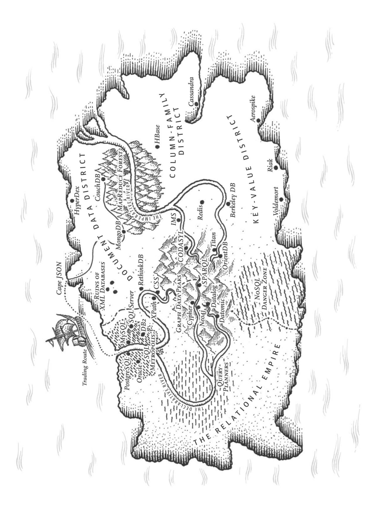

# <span id="page-48-0"></span>**Data Models and Query Languages**

*The limits of my language mean the limits of my world.* —Ludwig Wittgenstein, *Tractatus Logico-Philosophicus* (1922)

Data models are perhaps the most important part of developing software, because they have such a profound effect: not only on how the software is written, but also on how we *think about the problem* that we are solving.

Most applications are built by layering one data model on top of another. For each layer, the key question is: how is it *represented* in terms of the next-lower layer? For example:

- 1. As an application developer, you look at the real world (in which there are peo‐ ple, organizations, goods, actions, money flows, sensors, etc.) and model it in terms of objects or data structures, and APIs that manipulate those data struc‐ tures. Those structures are often specific to your application.
- 2. When you want to store those data structures, you express them in terms of a general-purpose data model, such as JSON or XML documents, tables in a rela‐ tional database, or a graph model.
- 3. The engineers who built your database software decided on a way of representing that JSON/XML/relational/graph data in terms of bytes in memory, on disk, or on a network. The representation may allow the data to be queried, searched, manipulated, and processed in various ways.
- 4. On yet lower levels, hardware engineers have figured out how to represent bytes in terms of electrical currents, pulses of light, magnetic fields, and more.

In a complex application there may be more intermediary levels, such as APIs built upon APIs, but the basic idea is still the same: each layer hides the complexity of the layers below it by providing a clean data model. These abstractions allow different

<span id="page-49-0"></span>groups of people—for example, the engineers at the database vendor and the applica‐ tion developers using their database—to work together effectively.

There are many different kinds of data models, and every data model embodies assumptions about how it is going to be used. Some kinds of usage are easy and some are not supported; some operations are fast and some perform badly; some data transformations feel natural and some are awkward.

It can take a lot of effort to master just one data model (think how many books there are on relational data modeling). Building software is hard enough, even when work‐ ing with just one data model and without worrying about its inner workings. But since the data model has such a profound effect on what the software above it can and can't do, it's important to choose one that is appropriate to the application.

In this chapter we will look at a range of general-purpose data models for data stor‐ age and querying (point 2 in the preceding list). In particular, we will compare the relational model, the document model, and a few graph-based data models. We will also look at various query languages and compare their use cases. In [Chapter 3](#page-90-0) we will discuss how storage engines work; that is, how these data models are actually implemented (point 3 in the list).

## **Relational Model Versus Document Model**

The best-known data model today is probably that of SQL, based on the relational model proposed by Edgar Codd in 1970 [[1\]](#page-85-0): data is organized into *relations* (called *tables* in SQL), where each relation is an unordered collection of *tuples* (*rows* in SQL).

The relational model was a theoretical proposal, and many people at the time doubted whether it could be implemented efficiently. However, by the mid-1980s, relational database management systems (RDBMSes) and SQL had become the tools of choice for most people who needed to store and query data with some kind of reg‐ ular structure. The dominance of relational databases has lasted around 25‒30 years —an eternity in computing history.

The roots of relational databases lie in *business data processing*, which was performed on mainframe computers in the 1960s and '70s. The use cases appear mundane from today's perspective: typically *transaction processing* (entering sales or banking trans‐ actions, airline reservations, stock-keeping in warehouses) and *batch processing* (cus‐ tomer invoicing, payroll, reporting).

Other databases at that time forced application developers to think a lot about the internal representation of the data in the database. The goal of the relational model was to hide that implementation detail behind a cleaner interface.

Over the years, there have been many competing approaches to data storage and querying. In the 1970s and early 1980s, the *network model* and the *hierarchical model* <span id="page-50-0"></span>were the main alternatives, but the relational model came to dominate them. Object databases came and went again in the late 1980s and early 1990s. XML databases appeared in the early 2000s, but have only seen niche adoption. Each competitor to the relational model generated a lot of hype in its time, but it never lasted [\[2](#page-85-0)].

As computers became vastly more powerful and networked, they started being used for increasingly diverse purposes. And remarkably, relational databases turned out to generalize very well, beyond their original scope of business data processing, to a broad variety of use cases. Much of what you see on the web today is still powered by relational databases, be it online publishing, discussion, social networking, ecom‐ merce, games, software-as-a-service productivity applications, or much more.

## **The Birth of NoSQL**

Now, in the 2010s, *NoSQL* is the latest attempt to overthrow the relational model's dominance. The name "NoSQL" is unfortunate, since it doesn't actually refer to any particular technology—it was originally intended simply as a catchy Twitter hashtag for a meetup on open source, distributed, nonrelational databases in 2009 [\[3](#page-85-0)]. Never‐ theless, the term struck a nerve and quickly spread through the web startup commu‐ nity and beyond. A number of interesting database systems are now associated with the #NoSQL hashtag, and it has been retroactively reinterpreted as *Not Only SQL* [[4\]](#page-85-0).

There are several driving forces behind the adoption of NoSQL databases, including:

- A need for greater scalability than relational databases can easily achieve, includ‐ ing very large datasets or very high write throughput
- A widespread preference for free and open source software over commercial database products
- Specialized query operations that are not well supported by the relational model
- Frustration with the restrictiveness of relational schemas, and a desire for a more dynamic and expressive data model [[5\]](#page-85-0)

Different applications have different requirements, and the best choice of technology for one use case may well be different from the best choice for another use case. It therefore seems likely that in the foreseeable future, relational databases will continue to be used alongside a broad variety of nonrelational datastores—an idea that is sometimes called *polyglot persistence* [[3\]](#page-85-0).

## **The Object-Relational Mismatch**

Most application development today is done in object-oriented programming lan‐ guages, which leads to a common criticism of the SQL data model: if data is stored in relational tables, an awkward translation layer is required between the objects in the <span id="page-51-0"></span>application code and the database model of tables, rows, and columns. The discon‐ nect between the models is sometimes called an *impedance mismatch*. i

Object-relational mapping (ORM) frameworks like ActiveRecord and Hibernate reduce the amount of boilerplate code required for this translation layer, but they can't completely hide the differences between the two models.

For example, [Figure 2-1](#page-52-0) illustrates how a résumé (a LinkedIn profile) could be expressed in a relational schema. The profile as a whole can be identified by a unique identifier, user\_id. Fields like first\_name and last\_name appear exactly once per user, so they can be modeled as columns on the users table. However, most people have had more than one job in their career (positions), and people may have varying numbers of periods of education and any number of pieces of contact information. There is a one-to-many relationship from the user to these items, which can be repre‐ sented in various ways:

- In the traditional SQL model (prior to SQL:1999), the most common normalized representation is to put positions, education, and contact information in separate tables, with a foreign key reference to the users table, as in [Figure 2-1](#page-52-0).
- Later versions of the SQL standard added support for structured datatypes and XML data; this allowed multi-valued data to be stored within a single row, with support for querying and indexing inside those documents. These features are supported to varying degrees by Oracle, IBM DB2, MS SQL Server, and Post‐ greSQL [\[6](#page-85-0), [7](#page-85-0)]. A JSON datatype is also supported by several databases, including IBM DB2, MySQL, and PostgreSQL [[8\]](#page-85-0).
- A third option is to encode jobs, education, and contact info as a JSON or XML document, store it on a text column in the database, and let the application inter‐ pret its structure and content. In this setup, you typically cannot use the database to query for values inside that encoded column.

i. A term borrowed from electronics. Every electric circuit has a certain impedance (resistance to alternating current) on its inputs and outputs. When you connect one circuit's output to another one's input, the power transfer across the connection is maximized if the output and input impedances of the two circuits match. An impedance mismatch can lead to signal reflections and other troubles.

<span id="page-52-0"></span>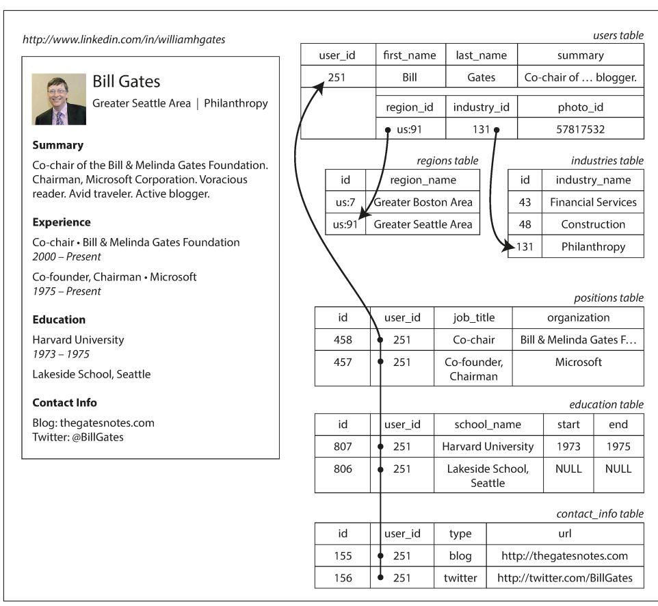

*Figure 2-1. Representing a LinkedIn profile using a relational schema. Photo of Bill Gates courtesy of Wikimedia Commons, Ricardo Stuckert, Agência Brasil.*

For a data structure like a résumé, which is mostly a self-contained *document*, a JSON representation can be quite appropriate: see Example 2-1. JSON has the appeal of being much simpler than XML. Document-oriented databases like MongoDB [[9\]](#page-85-0), RethinkDB [\[10\]](#page-86-0), CouchDB [[11\]](#page-86-0), and Espresso [\[12](#page-86-0)] support this data model.

*Example 2-1. Representing a LinkedIn profile as a JSON document*

```
{
 "user_id": 251,
 "first_name": "Bill",
 "last_name": "Gates",
 "summary": "Co-chair of the Bill & Melinda Gates... Active blogger.",
 "region_id": "us:91",
 "industry_id": 131,
 "photo_url": "/p/7/000/253/05b/308dd6e.jpg",
```

```
 "positions": [
 {"job_title": "Co-chair", "organization": "Bill & Melinda Gates Foundation"},
 {"job_title": "Co-founder, Chairman", "organization": "Microsoft"}
 ],
 "education": [
 {"school_name": "Harvard University", "start": 1973, "end": 1975},
 {"school_name": "Lakeside School, Seattle", "start": null, "end": null}
 ],
 "contact_info": {
 "blog": "http://thegatesnotes.com",
 "twitter": "http://twitter.com/BillGates"
 }
}
```

Some developers feel that the JSON model reduces the impedance mismatch between the application code and the storage layer. However, as we shall see in [Chapter 4,](#page-132-0) there are also problems with JSON as a data encoding format. The lack of a schema is often cited as an advantage; we will discuss this in ["Schema flexibility in the docu‐](#page-60-0) [ment model" on page 39](#page-60-0).

The JSON representation has better *locality* than the multi-table schema in [Figure 2-1.](#page-52-0) If you want to fetch a profile in the relational example, you need to either perform multiple queries (query each table by user\_id) or perform a messy multiway join between the users table and its subordinate tables. In the JSON representa‐ tion, all the relevant information is in one place, and one query is sufficient.

The one-to-many relationships from the user profile to the user's positions, educa‐ tional history, and contact information imply a tree structure in the data, and the JSON representation makes this tree structure explicit (see Figure 2-2).

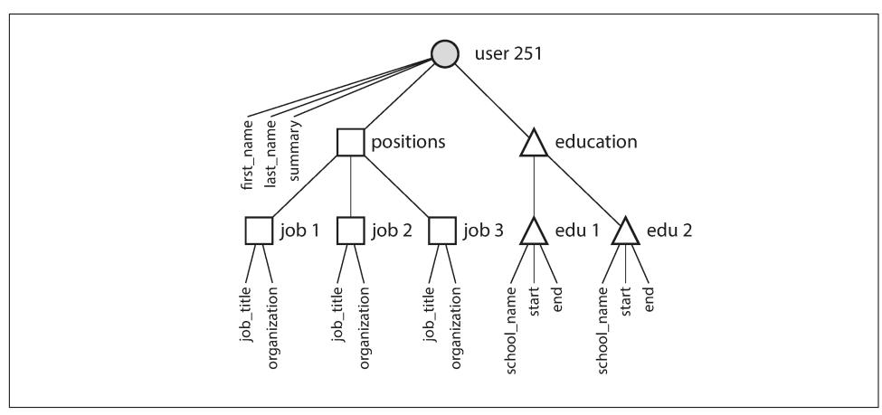

*Figure 2-2. One-to-many relationships forming a tree structure.*

## <span id="page-54-0"></span>**Many-to-One and Many-to-Many Relationships**

In [Example 2-1](#page-52-0) in the preceding section, region\_id and industry\_id are given as IDs, not as plain-text strings "Greater Seattle Area" and "Philanthropy". Why?

If the user interface has free-text fields for entering the region and the industry, it makes sense to store them as plain-text strings. But there are advantages to having standardized lists of geographic regions and industries, and letting users choose from a drop-down list or autocompleter:

- Consistent style and spelling across profiles
- Avoiding ambiguity (e.g., if there are several cities with the same name)
- Ease of updating—the name is stored in only one place, so it is easy to update across the board if it ever needs to be changed (e.g., change of a city name due to political events)
- Localization support—when the site is translated into other languages, the stand‐ ardized lists can be localized, so the region and industry can be displayed in the viewer's language
- Better search—e.g., a search for philanthropists in the state of Washington can match this profile, because the list of regions can encode the fact that Seattle is in Washington (which is not apparent from the string "Greater Seattle Area")

Whether you store an ID or a text string is a question of duplication. When you use an ID, the information that is meaningful to humans (such as the word *Philanthropy*) is stored in only one place, and everything that refers to it uses an ID (which only has meaning within the database). When you store the text directly, you are duplicating the human-meaningful information in every record that uses it.

The advantage of using an ID is that because it has no meaning to humans, it never needs to change: the ID can remain the same, even if the information it identifies changes. Anything that is meaningful to humans may need to change sometime in the future—and if that information is duplicated, all the redundant copies need to be updated. That incurs write overheads, and risks inconsistencies (where some copies of the information are updated but others aren't). Removing such duplication is the key idea behind *normalization* in databases.ii

ii. Literature on the relational model distinguishes several different normal forms, but the distinctions are of little practical interest. As a rule of thumb, if you're duplicating values that could be stored in just one place, the schema is not normalized.

<span id="page-55-0"></span>

Database administrators and developers love to argue about nor‐ malization and denormalization, but we will suspend judgment for now. In [Part III](#page-406-0) of this book we will return to this topic and explore systematic ways of dealing with caching, denormalization, and derived data.

Unfortunately, normalizing this data requires *many-to-one* relationships (many peo‐ ple live in one particular region, many people work in one particular industry), which don't fit nicely into the document model. In relational databases, it's normal to refer to rows in other tables by ID, because joins are easy. In document databases, joins are not needed for one-to-many tree structures, and support for joins is often weak.iii

If the database itself does not support joins, you have to emulate a join in application code by making multiple queries to the database. (In this case, the lists of regions and industries are probably small and slow-changing enough that the application can simply keep them in memory. But nevertheless, the work of making the join is shifted from the database to the application code.)

Moreover, even if the initial version of an application fits well in a join-free docu‐ ment model, data has a tendency of becoming more interconnected as features are added to applications. For example, consider some changes we could make to the résumé example:

#### *Organizations and schools as entities*

In the previous description, organization (the company where the user worked) and school\_name (where they studied) are just strings. Perhaps they should be references to entities instead? Then each organization, school, or university could have its own web page (with logo, news feed, etc.); each résumé could link to the organizations and schools that it mentions, and include their logos and other information (see [Figure 2-3](#page-56-0) for an example from LinkedIn).

#### *Recommendations*

Say you want to add a new feature: one user can write a recommendation for another user. The recommendation is shown on the résumé of the user who was recommended, together with the name and photo of the user making the recom‐ mendation. If the recommender updates their photo, any recommendations they have written need to reflect the new photo. Therefore, the recommendation should have a reference to the author's profile.

iii. At the time of writing, joins are supported in RethinkDB, not supported in MongoDB, and only sup‐ ported in predeclared views in CouchDB.

<span id="page-56-0"></span>

*Figure 2-3. The company name is not just a string, but a link to a company entity. Screenshot of linkedin.com.*

Figure 2-4 illustrates how these new features require many-to-many relationships. The data within each dotted rectangle can be grouped into one document, but the references to organizations, schools, and other users need to be represented as refer‐ ences, and require joins when queried.

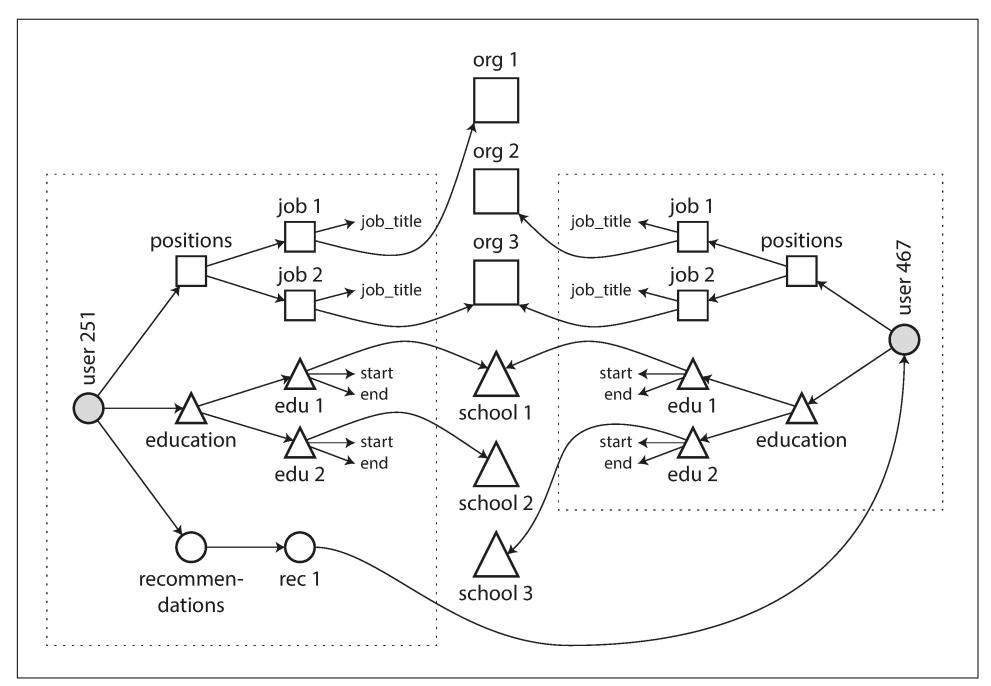

*Figure 2-4. Extending résumés with many-to-many relationships.*

## <span id="page-57-0"></span>**Are Document Databases Repeating History?**

While many-to-many relationships and joins are routinely used in relational data‐ bases, document databases and NoSQL reopened the debate on how best to represent such relationships in a database. This debate is much older than NoSQL—in fact, it goes back to the very earliest computerized database systems.

The most popular database for business data processing in the 1970s was IBM's *Infor‐ mation Management System* (IMS), originally developed for stock-keeping in the Apollo space program and first commercially released in 1968 [[13\]](#page-86-0). It is still in use and maintained today, running on OS/390 on IBM mainframes [\[14\]](#page-86-0).

The design of IMS used a fairly simple data model called the *hierarchical model*, which has some remarkable similarities to the JSON model used by document data‐ bases [[2\]](#page-85-0). It represented all data as a tree of records nested within records, much like the JSON structure of [Figure 2-2.](#page-53-0)

Like document databases, IMS worked well for one-to-many relationships, but it made many-to-many relationships difficult, and it didn't support joins. Developers had to decide whether to duplicate (denormalize) data or to manually resolve refer‐ ences from one record to another. These problems of the 1960s and '70s were very much like the problems that developers are running into with document databases today [[15\]](#page-86-0).

Various solutions were proposed to solve the limitations of the hierarchical model. The two most prominent were the *relational model* (which became SQL, and took over the world) and the *network model* (which initially had a large following but eventually faded into obscurity). The "great debate" between these two camps lasted for much of the 1970s [[2\]](#page-85-0).

Since the problem that the two models were solving is still so relevant today, it's worth briefly revisiting this debate in today's light.

#### **The network model**

The network model was standardized by a committee called the Conference on Data Systems Languages (CODASYL) and implemented by several different database ven‐ dors; it is also known as the *CODASYL model* [\[16](#page-86-0)].

The CODASYL model was a generalization of the hierarchical model. In the tree structure of the hierarchical model, every record has exactly one parent; in the net‐ work model, a record could have multiple parents. For example, there could be one record for the "Greater Seattle Area" region, and every user who lived in that region could be linked to it. This allowed many-to-one and many-to-many relation‐ ships to be modeled.

<span id="page-58-0"></span>The links between records in the network model were not foreign keys, but more like pointers in a programming language (while still being stored on disk). The only way of accessing a record was to follow a path from a root record along these chains of links. This was called an *access path*.

In the simplest case, an access path could be like the traversal of a linked list: start at the head of the list, and look at one record at a time until you find the one you want. But in a world of many-to-many relationships, several different paths can lead to the same record, and a programmer working with the network model had to keep track of these different access paths in their head.

A query in CODASYL was performed by moving a cursor through the database by iterating over lists of records and following access paths. If a record had multiple parents (i.e., multiple incoming pointers from other records), the application code had to keep track of all the various relationships. Even CODASYL committee mem‐ bers admitted that this was like navigating around an *n*-dimensional data space [\[17](#page-86-0)].

Although manual access path selection was able to make the most efficient use of the very limited hardware capabilities in the 1970s (such as tape drives, whose seeks are extremely slow), the problem was that they made the code for querying and updating the database complicated and inflexible. With both the hierarchical and the network model, if you didn't have a path to the data you wanted, you were in a difficult situa‐ tion. You could change the access paths, but then you had to go through a lot of handwritten database query code and rewrite it to handle the new access paths. It was difficult to make changes to an application's data model.

#### **The relational model**

What the relational model did, by contrast, was to lay out all the data in the open: a relation (table) is simply a collection of tuples (rows), and that's it. There are no laby‐ rinthine nested structures, no complicated access paths to follow if you want to look at the data. You can read any or all of the rows in a table, selecting those that match an arbitrary condition. You can read a particular row by designating some columns as a key and matching on those. You can insert a new row into any table without worrying about foreign key relationships to and from other tables.iv

In a relational database, the query optimizer automatically decides which parts of the query to execute in which order, and which indexes to use. Those choices are effec‐ tively the "access path," but the big difference is that they are made automatically by

iv. Foreign key constraints allow you to restrict modifications, but such constraints are not required by the relational model. Even with constraints, joins on foreign keys are performed at query time, whereas in CODASYL, the join was effectively done at insert time.

<span id="page-59-0"></span>the query optimizer, not by the application developer, so we rarely need to think about them.

If you want to query your data in new ways, you can just declare a new index, and queries will automatically use whichever indexes are most appropriate. You don't need to change your queries to take advantage of a new index. (See also ["Query Lan‐](#page-63-0) [guages for Data" on page 42.](#page-63-0)) The relational model thus made it much easier to add new features to applications.

Query optimizers for relational databases are complicated beasts, and they have con‐ sumed many years of research and development effort [\[18](#page-86-0)]. But a key insight of the relational model was this: you only need to build a query optimizer once, and then all applications that use the database can benefit from it. If you don't have a query opti‐ mizer, it's easier to handcode the access paths for a particular query than to write a general-purpose optimizer—but the general-purpose solution wins in the long run.

## **Comparison to document databases**

Document databases reverted back to the hierarchical model in one aspect: storing nested records (one-to-many relationships, like positions, education, and contact\_info in [Figure 2-1](#page-52-0)) within their parent record rather than in a separate table.

However, when it comes to representing many-to-one and many-to-many relation‐ ships, relational and document databases are not fundamentally different: in both cases, the related item is referenced by a unique identifier, which is called a *foreign key* in the relational model and a *document reference* in the document model [[9\]](#page-85-0). That identifier is resolved at read time by using a join or follow-up queries. To date, document databases have not followed the path of CODASYL.

## **Relational Versus Document Databases Today**

There are many differences to consider when comparing relational databases to document databases, including their fault-tolerance properties (see [Chapter 5\)](#page-172-0) and handling of concurrency (see [Chapter 7\)](#page-242-0). In this chapter, we will concentrate only on the differences in the data model.

The main arguments in favor of the document data model are schema flexibility, bet‐ ter performance due to locality, and that for some applications it is closer to the data structures used by the application. The relational model counters by providing better support for joins, and many-to-one and many-to-many relationships.

## **Which data model leads to simpler application code?**

If the data in your application has a document-like structure (i.e., a tree of one-tomany relationships, where typically the entire tree is loaded at once), then it's proba‐ <span id="page-60-0"></span>bly a good idea to use a document model. The relational technique of *shredding* splitting a document-like structure into multiple tables (like positions, education, and contact\_info in [Figure 2-1\)](#page-52-0)—can lead to cumbersome schemas and unnecessa‐ rily complicated application code.

The document model has limitations: for example, you cannot refer directly to a nes‐ ted item within a document, but instead you need to say something like "the second item in the list of positions for user 251" (much like an access path in the hierarchical model). However, as long as documents are not too deeply nested, that is not usually a problem.

The poor support for joins in document databases may or may not be a problem, depending on the application. For example, many-to-many relationships may never be needed in an analytics application that uses a document database to record which events occurred at which time [\[19](#page-86-0)].

However, if your application does use many-to-many relationships, the document model becomes less appealing. It's possible to reduce the need for joins by denormal‐ izing, but then the application code needs to do additional work to keep the denor‐ malized data consistent. Joins can be emulated in application code by making multiple requests to the database, but that also moves complexity into the application and is usually slower than a join performed by specialized code inside the database. In such cases, using a document model can lead to significantly more complex appli‐ cation code and worse performance [\[15](#page-86-0)].

It's not possible to say in general which data model leads to simpler application code; it depends on the kinds of relationships that exist between data items. For highly interconnected data, the document model is awkward, the relational model is accept‐ able, and graph models (see ["Graph-Like Data Models" on page 49\)](#page-70-0) are the most natural.

## **Schema flexibility in the document model**

Most document databases, and the JSON support in relational databases, do not enforce any schema on the data in documents. XML support in relational databases usually comes with optional schema validation. No schema means that arbitrary keys and values can be added to a document, and when reading, clients have no guaran‐ tees as to what fields the documents may contain.

Document databases are sometimes called *schemaless*, but that's misleading, as the code that reads the data usually assumes some kind of structure—i.e., there is an implicit schema, but it is not enforced by the database [[20\]](#page-86-0). A more accurate term is *schema-on-read* (the structure of the data is implicit, and only interpreted when the data is read), in contrast with *schema-on-write* (the traditional approach of relational <span id="page-61-0"></span>databases, where the schema is explicit and the database ensures all written data con‐ forms to it) [[21\]](#page-86-0).

Schema-on-read is similar to dynamic (runtime) type checking in programming lan‐ guages, whereas schema-on-write is similar to static (compile-time) type checking. Just as the advocates of static and dynamic type checking have big debates about their relative merits [\[22](#page-86-0)], enforcement of schemas in database is a contentious topic, and in general there's no right or wrong answer.

The difference between the approaches is particularly noticeable in situations where an application wants to change the format of its data. For example, say you are cur‐ rently storing each user's full name in one field, and you instead want to store the first name and last name separately [\[23](#page-86-0)]. In a document database, you would just start writing new documents with the new fields and have code in the application that handles the case when old documents are read. For example:

```
if (user && user.name && !user.first_name) {
 // Documents written before Dec 8, 2013 don't have first_name
 user.first_name = user.name.split(" ")[0];
}
```

On the other hand, in a "statically typed" database schema, you would typically per‐ form a *migration* along the lines of:

```
ALTER TABLE users ADD COLUMN first_name text;
UPDATE users SET first_name = split_part(name, ' ', 1); -- PostgreSQL
UPDATE users SET first_name = substring_index(name, ' ', 1); -- MySQL
```

Schema changes have a bad reputation of being slow and requiring downtime. This reputation is not entirely deserved: most relational database systems execute the ALTER TABLE statement in a few milliseconds. MySQL is a notable exception—it copies the entire table on ALTER TABLE, which can mean minutes or even hours of downtime when altering a large table—although various tools exist to work around this limitation [[24,](#page-86-0) [25,](#page-86-0) [26](#page-87-0)].

Running the UPDATE statement on a large table is likely to be slow on any database, since every row needs to be rewritten. If that is not acceptable, the application can leave first\_name set to its default of NULL and fill it in at read time, like it would with a document database.

The schema-on-read approach is advantageous if the items in the collection don't all have the same structure for some reason (i.e., the data is heterogeneous)—for exam‐ ple, because:

• There are many different types of objects, and it is not practical to put each type of object in its own table.

<span id="page-62-0"></span>• The structure of the data is determined by external systems over which you have no control and which may change at any time.

In situations like these, a schema may hurt more than it helps, and schemaless docu‐ ments can be a much more natural data model. But in cases where all records are expected to have the same structure, schemas are a useful mechanism for document‐ ing and enforcing that structure. We will discuss schemas and schema evolution in more detail in [Chapter 4.](#page-132-0)

## **Data locality for queries**

A document is usually stored as a single continuous string, encoded as JSON, XML, or a binary variant thereof (such as MongoDB's BSON). If your application often needs to access the entire document (for example, to render it on a web page), there is a performance advantage to this *storage locality*. If data is split across multiple tables, like in [Figure 2-1](#page-52-0), multiple index lookups are required to retrieve it all, which may require more disk seeks and take more time.

The locality advantage only applies if you need large parts of the document at the same time. The database typically needs to load the entire document, even if you access only a small portion of it, which can be wasteful on large documents. On updates to a document, the entire document usually needs to be rewritten—only modifications that don't change the encoded size of a document can easily be per‐ formed in place [\[19](#page-86-0)]. For these reasons, it is generally recommended that you keep documents fairly small and avoid writes that increase the size of a document [[9\]](#page-85-0). These performance limitations significantly reduce the set of situations in which document databases are useful.

It's worth pointing out that the idea of grouping related data together for locality is not limited to the document model. For example, Google's Spanner database offers the same locality properties in a relational data model, by allowing the schema to declare that a table's rows should be interleaved (nested) within a parent table [[27\]](#page-87-0). Oracle allows the same, using a feature called *multi-table index cluster tables* [[28\]](#page-87-0). The *column-family* concept in the Bigtable data model (used in Cassandra and HBase) has a similar purpose of managing locality [\[29\]](#page-87-0).

We will also see more on locality in [Chapter 3.](#page-90-0)

## **Convergence of document and relational databases**

Most relational database systems (other than MySQL) have supported XML since the mid-2000s. This includes functions to make local modifications to XML documents and the ability to index and query inside XML documents, which allows applications to use data models very similar to what they would do when using a document data‐ base.

<span id="page-63-0"></span>PostgreSQL since version 9.3 [\[8](#page-85-0)], MySQL since version 5.7, and IBM DB2 since ver‐ sion 10.5 [\[30\]](#page-87-0) also have a similar level of support for JSON documents. Given the popularity of JSON for web APIs, it is likely that other relational databases will follow in their footsteps and add JSON support.

On the document database side, RethinkDB supports relational-like joins in its query language, and some MongoDB drivers automatically resolve database references (effectively performing a client-side join, although this is likely to be slower than a join performed in the database since it requires additional network round-trips and is less optimized).

It seems that relational and document databases are becoming more similar over time, and that is a good thing: the data models complement each other.<sup>v</sup> If a database is able to handle document-like data and also perform relational queries on it, appli‐ cations can use the combination of features that best fits their needs.

A hybrid of the relational and document models is a good route for databases to take in the future.

## **Query Languages for Data**

When the relational model was introduced, it included a new way of querying data: SQL is a *declarative* query language, whereas IMS and CODASYL queried the data‐ base using *imperative* code. What does that mean?

Many commonly used programming languages are imperative. For example, if you have a list of animal species, you might write something like this to return only the sharks in the list:

```
function getSharks() {
 var sharks = [];
 for (var i = 0; i < animals.length; i++) {
 if (animals[i].family === "Sharks") {
 sharks.push(animals[i]);
 }
 }
 return sharks;
}
```

In the relational algebra, you would instead write:

```
sharks = σfamily = "Sharks" (animals)
```

v. Codd's original description of the relational model [\[1](#page-85-0)] actually allowed something quite similar to JSON documents within a relational schema. He called it *nonsimple domains*. The idea was that a value in a row doesn't have to just be a primitive datatype like a number or a string, but could also be a nested relation (table)—so you can have an arbitrarily nested tree structure as a value, much like the JSON or XML support that was added to SQL over 30 years later.

<span id="page-64-0"></span>where σ (the Greek letter sigma) is the selection operator, returning only those ani‐ mals that match the condition *family = "Sharks"*.

When SQL was defined, it followed the structure of the relational algebra fairly closely:

```
SELECT * FROM animals WHERE family = 'Sharks';
```

An imperative language tells the computer to perform certain operations in a certain order. You can imagine stepping through the code line by line, evaluating conditions, updating variables, and deciding whether to go around the loop one more time.

In a declarative query language, like SQL or relational algebra, you just specify the pattern of the data you want—what conditions the results must meet, and how you want the data to be transformed (e.g., sorted, grouped, and aggregated)—but not *how* to achieve that goal. It is up to the database system's query optimizer to decide which indexes and which join methods to use, and in which order to execute various parts of the query.

A declarative query language is attractive because it is typically more concise and eas‐ ier to work with than an imperative API. But more importantly, it also hides imple‐ mentation details of the database engine, which makes it possible for the database system to introduce performance improvements without requiring any changes to queries.

For example, in the imperative code shown at the beginning of this section, the list of animals appears in a particular order. If the database wants to reclaim unused disk space behind the scenes, it might need to move records around, changing the order in which the animals appear. Can the database do that safely, without breaking queries?

The SQL example doesn't guarantee any particular ordering, and so it doesn't mind if the order changes. But if the query is written as imperative code, the database can never be sure whether the code is relying on the ordering or not. The fact that SQL is more limited in functionality gives the database much more room for automatic opti‐ mizations.

Finally, declarative languages often lend themselves to parallel execution. Today, CPUs are getting faster by adding more cores, not by running at significantly higher clock speeds than before [\[31\]](#page-87-0). Imperative code is very hard to parallelize across mul‐ tiple cores and multiple machines, because it specifies instructions that must be per‐ formed in a particular order. Declarative languages have a better chance of getting faster in parallel execution because they specify only the pattern of the results, not the algorithm that is used to determine the results. The database is free to use a parallel implementation of the query language, if appropriate [\[32](#page-87-0)].

## <span id="page-65-0"></span>**Declarative Queries on the Web**

The advantages of declarative query languages are not limited to just databases. To illustrate the point, let's compare declarative and imperative approaches in a com‐ pletely different environment: a web browser.

Say you have a website about animals in the ocean. The user is currently viewing the page on sharks, so you mark the navigation item "Sharks" as currently selected, like this:

```
<ul>
 <li class="selected">
 <p>Sharks</p>
 <ul>
 <li>Great White Shark</li>
 <li>Tiger Shark</li>
 <li>Hammerhead Shark</li>
 </ul>
 </li>
 <li>
 <p>Whales</p>
 <ul>
 <li>Blue Whale</li>
 <li>Humpback Whale</li>
 <li>Fin Whale</li>
 </ul>
 </li>
</ul>
```

- The selected item is marked with the CSS class "selected".
- <p>Sharks</p> is the title of the currently selected page.

Now say you want the title of the currently selected page to have a blue background, so that it is visually highlighted. This is easy, using CSS:

```
li.selected > p {
 background-color: blue;
}
```

Here the CSS selector li.selected > p declares the pattern of elements to which we want to apply the blue style: namely, all <p> elements whose direct parent is an <li> element with a CSS class of selected. The element <p>Sharks</p> in the example matches this pattern, but <p>Whales</p> does not match because its <li> parent lacks class="selected".

<span id="page-66-0"></span>If you were using XSL instead of CSS, you could do something similar:

```
<xsl:template match="li[@class='selected']/p">
 <fo:block background-color="blue">
 <xsl:apply-templates/>
 </fo:block>
</xsl:template>
```

Here, the XPath expression li[@class='selected']/p is equivalent to the CSS selec‐ tor li.selected > p in the previous example. What CSS and XSL have in common is that they are both *declarative* languages for specifying the styling of a document.

Imagine what life would be like if you had to use an imperative approach. In Java‐ Script, using the core Document Object Model (DOM) API, the result might look something like this:

```
var liElements = document.getElementsByTagName("li");
for (var i = 0; i < liElements.length; i++) {
 if (liElements[i].className === "selected") {
 var children = liElements[i].childNodes;
 for (var j = 0; j < children.length; j++) {
 var child = children[j];
 if (child.nodeType === Node.ELEMENT_NODE && child.tagName === "P") {
 child.setAttribute("style", "background-color: blue");
 }
 }
 }
}
```

This JavaScript imperatively sets the element <p>Sharks</p> to have a blue back‐ ground, but the code is awful. Not only is it much longer and harder to understand than the CSS and XSL equivalents, but it also has some serious problems:

- If the selected class is removed (e.g., because the user clicks a different page), the blue color won't be removed, even if the code is rerun—and so the item will remain highlighted until the entire page is reloaded. With CSS, the browser auto‐ matically detects when the li.selected > p rule no longer applies and removes the blue background as soon as the selected class is removed.
- If you want to take advantage of a new API, such as document.getElementsBy ClassName("selected") or even document.evaluate()—which may improve performance—you have to rewrite the code. On the other hand, browser vendors can improve the performance of CSS and XPath without breaking compatibility.

<span id="page-67-0"></span>In a web browser, using declarative CSS styling is much better than manipulating styles imperatively in JavaScript. Similarly, in databases, declarative query languages like SQL turned out to be much better than imperative query APIs.vi

## **MapReduce Querying**

*MapReduce* is a programming model for processing large amounts of data in bulk across many machines, popularized by Google [\[33](#page-87-0)]. A limited form of MapReduce is supported by some NoSQL datastores, including MongoDB and CouchDB, as a mechanism for performing read-only queries across many documents.

MapReduce in general is described in more detail in [Chapter 10](#page-410-0). For now, we'll just briefly discuss MongoDB's use of the model.

MapReduce is neither a declarative query language nor a fully imperative query API, but somewhere in between: the logic of the query is expressed with snippets of code, which are called repeatedly by the processing framework. It is based on the map (also known as collect) and reduce (also known as fold or inject) functions that exist in many functional programming languages.

To give an example, imagine you are a marine biologist, and you add an observation record to your database every time you see animals in the ocean. Now you want to generate a report saying how many sharks you have sighted per month.

In PostgreSQL you might express that query like this:

```
SELECT date_trunc('month', observation_timestamp) AS observation_month,
 sum(num_animals) AS total_animals
FROM observations
WHERE family = 'Sharks'
GROUP BY observation_month;
```

The date\_trunc('month', timestamp) function determines the calendar month containing timestamp, and returns another timestamp representing the begin‐ ning of that month. In other words, it rounds a timestamp down to the nearest month.

This query first filters the observations to only show species in the Sharks family, then groups the observations by the calendar month in which they occurred, and finally adds up the number of animals seen in all observations in that month.

The same can be expressed with MongoDB's MapReduce feature as follows:

vi. IMS and CODASYL both used imperative query APIs. Applications typically used COBOL code to iterate over records in the database, one record at a time [[2,](#page-85-0) [16](#page-86-0)].

```
db.observations.mapReduce(
 function map() {
 var year = this.observationTimestamp.getFullYear();
 var month = this.observationTimestamp.getMonth() + 1;
 emit(year + "-" + month, this.numAnimals);
 },
 function reduce(key, values) {
 return Array.sum(values);
 },
 {
 query: { family: "Sharks" },
 out: "monthlySharkReport"
 }
);
```

- The filter to consider only shark species can be specified declaratively (this is a MongoDB-specific extension to MapReduce).
- The JavaScript function map is called once for every document that matches query, with this set to the document object.
- The map function emits a key (a string consisting of year and month, such as "2013-12" or "2014-1") and a value (the number of animals in that observation).
- The key-value pairs emitted by map are grouped by key. For all key-value pairs with the same key (i.e., the same month and year), the reduce function is called once.
- The reduce function adds up the number of animals from all observations in a particular month.
- The final output is written to the collection monthlySharkReport.

For example, say the observations collection contains these two documents:

```
{
 observationTimestamp: Date.parse("Mon, 25 Dec 1995 12:34:56 GMT"),
 family: "Sharks",
 species: "Carcharodon carcharias",
 numAnimals: 3
}
{
 observationTimestamp: Date.parse("Tue, 12 Dec 1995 16:17:18 GMT"),
 family: "Sharks",
 species: "Carcharias taurus",
 numAnimals: 4
}
```

<span id="page-69-0"></span>The map function would be called once for each document, resulting in emit("1995-12", 3) and emit("1995-12", 4). Subsequently, the reduce function would be called with reduce("1995-12", [3, 4]), returning 7.

The map and reduce functions are somewhat restricted in what they are allowed to do. They must be *pure* functions, which means they only use the data that is passed to them as input, they cannot perform additional database queries, and they must not have any side effects. These restrictions allow the database to run the functions any‐ where, in any order, and rerun them on failure. However, they are nevertheless pow‐ erful: they can parse strings, call library functions, perform calculations, and more.

MapReduce is a fairly low-level programming model for distributed execution on a cluster of machines. Higher-level query languages like SQL can be implemented as a pipeline of MapReduce operations (see [Chapter 10\)](#page-410-0), but there are also many dis‐ tributed implementations of SQL that don't use MapReduce. Note there is nothing in SQL that constrains it to running on a single machine, and MapReduce doesn't have a monopoly on distributed query execution.

Being able to use JavaScript code in the middle of a query is a great feature for advanced queries, but it's not limited to MapReduce—some SQL databases can be extended with JavaScript functions too [[34\]](#page-87-0).

A usability problem with MapReduce is that you have to write two carefully coordi‐ nated JavaScript functions, which is often harder than writing a single query. More‐ over, a declarative query language offers more opportunities for a query optimizer to improve the performance of a query. For these reasons, MongoDB 2.2 added support for a declarative query language called the *aggregation pipeline* [[9\]](#page-85-0). In this language, the same shark-counting query looks like this:

```
db.observations.aggregate([
 { $match: { family: "Sharks" } },
 { $group: {
 _id: {
 year: { $year: "$observationTimestamp" },
 month: { $month: "$observationTimestamp" }
 },
 totalAnimals: { $sum: "$numAnimals" }
 } }
]);
```

The aggregation pipeline language is similar in expressiveness to a subset of SQL, but it uses a JSON-based syntax rather than SQL's English-sentence-style syntax; the dif‐ ference is perhaps a matter of taste. The moral of the story is that a NoSQL system may find itself accidentally reinventing SQL, albeit in disguise.

## <span id="page-70-0"></span>**Graph-Like Data Models**

We saw earlier that many-to-many relationships are an important distinguishing fea‐ ture between different data models. If your application has mostly one-to-many rela‐ tionships (tree-structured data) or no relationships between records, the document model is appropriate.

But what if many-to-many relationships are very common in your data? The rela‐ tional model can handle simple cases of many-to-many relationships, but as the con‐ nections within your data become more complex, it becomes more natural to start modeling your data as a graph.

A graph consists of two kinds of objects: *vertices* (also known as *nodes* or *entities*) and *edges* (also known as *relationships* or *arcs*). Many kinds of data can be modeled as a graph. Typical examples include:

*Social graphs*

Vertices are people, and edges indicate which people know each other.

*The web graph*

Vertices are web pages, and edges indicate HTML links to other pages.

*Road or rail networks*

Vertices are junctions, and edges represent the roads or railway lines between them.

Well-known algorithms can operate on these graphs: for example, car navigation sys‐ tems search for the shortest path between two points in a road network, and PageRank can be used on the web graph to determine the popularity of a web page and thus its ranking in search results.

In the examples just given, all the vertices in a graph represent the same kind of thing (people, web pages, or road junctions, respectively). However, graphs are not limited to such *homogeneous* data: an equally powerful use of graphs is to provide a consis‐ tent way of storing completely different types of objects in a single datastore. For example, Facebook maintains a single graph with many different types of vertices and edges: vertices represent people, locations, events, checkins, and comments made by users; edges indicate which people are friends with each other, which checkin hap‐ pened in which location, who commented on which post, who attended which event, and so on [[35](#page-87-0)].

In this section we will use the example shown in [Figure 2-5.](#page-71-0) It could be taken from a social network or a genealogical database: it shows two people, Lucy from Idaho and Alain from Beaune, France. They are married and living in London.

<span id="page-71-0"></span>

*Figure 2-5. Example of graph-structured data (boxes represent vertices, arrows repre‐ sent edges).*

There are several different, but related, ways of structuring and querying data in graphs. In this section we will discuss the *property graph* model (implemented by Neo4j, Titan, and InfiniteGraph) and the *triple-store* model (implemented by Datomic, AllegroGraph, and others). We will look at three declarative query lan‐ guages for graphs: Cypher, SPARQL, and Datalog. Besides these, there are also imperative graph query languages such as Gremlin [[36\]](#page-87-0) and graph processing frame‐ works like Pregel (see [Chapter 10\)](#page-410-0).

## **Property Graphs**

In the property graph model, each vertex consists of:

- A unique identifier
- A set of outgoing edges
- A set of incoming edges
- A collection of properties (key-value pairs)

## Each edge consists of:

- A unique identifier
- The vertex at which the edge starts (the *tail vertex*)

- <span id="page-72-0"></span>• The vertex at which the edge ends (the *head vertex*)
- A label to describe the kind of relationship between the two vertices
- A collection of properties (key-value pairs)

You can think of a graph store as consisting of two relational tables, one for vertices and one for edges, as shown in Example 2-2 (this schema uses the PostgreSQL json datatype to store the properties of each vertex or edge). The head and tail vertex are stored for each edge; if you want the set of incoming or outgoing edges for a vertex, you can query the edges table by head\_vertex or tail\_vertex, respectively.

*Example 2-2. Representing a property graph using a relational schema*

```
CREATE TABLE vertices (
 vertex_id integer PRIMARY KEY,
 properties json
);
CREATE TABLE edges (
 edge_id integer PRIMARY KEY,
 tail_vertex integer REFERENCES vertices (vertex_id),
 head_vertex integer REFERENCES vertices (vertex_id),
 label text,
 properties json
);
CREATE INDEX edges_tails ON edges (tail_vertex);
CREATE INDEX edges_heads ON edges (head_vertex);
```

Some important aspects of this model are:

- 1. Any vertex can have an edge connecting it with any other vertex. There is no schema that restricts which kinds of things can or cannot be associated.
- 2. Given any vertex, you can efficiently find both its incoming and its outgoing edges, and thus *traverse* the graph—i.e., follow a path through a chain of vertices —both forward and backward. (That's why Example 2-2 has indexes on both the tail\_vertex and head\_vertex columns.)
- 3. By using different labels for different kinds of relationships, you can store several different kinds of information in a single graph, while still maintaining a clean data model.

Those features give graphs a great deal of flexibility for data modeling, as illustrated in [Figure 2-5.](#page-71-0) The figure shows a few things that would be difficult to express in a traditional relational schema, such as different kinds of regional structures in differ‐ ent countries (France has *départements* and *régions*, whereas the US has *counties* and *states*), quirks of history such as a country within a country (ignoring for now the

<span id="page-73-0"></span>intricacies of sovereign states and nations), and varying granularity of data (Lucy's current residence is specified as a city, whereas her place of birth is specified only at the level of a state).

You could imagine extending the graph to also include many other facts about Lucy and Alain, or other people. For instance, you could use it to indicate any food aller‐ gies they have (by introducing a vertex for each allergen, and an edge between a per‐ son and an allergen to indicate an allergy), and link the allergens with a set of vertices that show which foods contain which substances. Then you could write a query to find out what is safe for each person to eat. Graphs are good for evolvability: as you add features to your application, a graph can easily be extended to accommodate changes in your application's data structures.

## **The Cypher Query Language**

*Cypher* is a declarative query language for property graphs, created for the Neo4j graph database [\[37\]](#page-87-0). (It is named after a character in the movie *The Matrix* and is not related to ciphers in cryptography [[38\]](#page-87-0).)

Example 2-3 shows the Cypher query to insert the lefthand portion of [Figure 2-5](#page-71-0) into a graph database. The rest of the graph can be added similarly and is omitted for readability. Each vertex is given a symbolic name like USA or Idaho, and other parts of the query can use those names to create edges between the vertices, using an arrow notation: (Idaho) -[:WITHIN]-> (USA) creates an edge labeled WITHIN, with Idaho as the tail node and USA as the head node.

*Example 2-3. A subset of the data in [Figure 2-5,](#page-71-0) represented as a Cypher query*

#### **CREATE**

```
 (NAmerica:Location {name:'North America', type:'continent'}),
 (USA:Location {name:'United States', type:'country' }),
 (Idaho:Location {name:'Idaho', type:'state' }),
 (Lucy:Person {name:'Lucy' }),
 (Idaho) -[:WITHIN]-> (USA) -[:WITHIN]-> (NAmerica),
 (Lucy) -[:BORN_IN]-> (Idaho)
```

When all the vertices and edges of [Figure 2-5](#page-71-0) are added to the database, we can start asking interesting questions: for example, *find the names of all the people who emigra‐ ted from the United States to Europe*. To be more precise, here we want to find all the vertices that have a BORN\_IN edge to a location within the US, and also a LIVING\_IN edge to a location within Europe, and return the name property of each of those verti‐ ces.

[Example 2-4](#page-74-0) shows how to express that query in Cypher. The same arrow notation is used in a MATCH clause to find patterns in the graph: (person) -[:BORN\_IN]-> () <span id="page-74-0"></span>matches any two vertices that are related by an edge labeled BORN\_IN. The tail vertex of that edge is bound to the variable person, and the head vertex is left unnamed.

*Example 2-4. Cypher query to find people who emigrated from the US to Europe*

#### **MATCH** (person) -[:BORN\_IN]-> () -[:WITHIN\*0..]-> (us:Location {name:'United States'}), (person) -[:LIVES\_IN]-> () -[:WITHIN\*0..]-> (eu:Location {name:'Europe'}) **RETURN** person.name

The query can be read as follows:

Find any vertex (call it person) that meets *both* of the following conditions:

- 1. person has an outgoing BORN\_IN edge to some vertex. From that vertex, you can follow a chain of outgoing WITHIN edges until eventually you reach a vertex of type Location, whose name property is equal to "United States".
- 2. That same person vertex also has an outgoing LIVES\_IN edge. Following that edge, and then a chain of outgoing WITHIN edges, you eventually reach a vertex of type Location, whose name property is equal to "Europe".

For each such person vertex, return the name property.

There are several possible ways of executing the query. The description given here suggests that you start by scanning all the people in the database, examine each per‐ son's birthplace and residence, and return only those people who meet the criteria.

But equivalently, you could start with the two Location vertices and work backward. If there is an index on the name property, you can probably efficiently find the two vertices representing the US and Europe. Then you can proceed to find all locations (states, regions, cities, etc.) in the US and Europe respectively by following all incom‐ ing WITHIN edges. Finally, you can look for people who can be found through an incoming BORN\_IN or LIVES\_IN edge at one of the location vertices.

As is typical for a declarative query language, you don't need to specify such execu‐ tion details when writing the query: the query optimizer automatically chooses the strategy that is predicted to be the most efficient, so you can get on with writing the rest of your application.

## **Graph Queries in SQL**

[Example 2-2](#page-72-0) suggested that graph data can be represented in a relational database. But if we put graph data in a relational structure, can we also query it using SQL?

The answer is yes, but with some difficulty. In a relational database, you usually know in advance which joins you need in your query. In a graph query, you may need to <span id="page-75-0"></span>traverse a variable number of edges before you find the vertex you're looking for that is, the number of joins is not fixed in advance.

In our example, that happens in the () -[:WITHIN\*0..]-> () rule in the Cypher query. A person's LIVES\_IN edge may point at any kind of location: a street, a city, a district, a region, a state, etc. A city may be WITHIN a region, a region WITHIN a state, a state WITHIN a country, etc. The LIVES\_IN edge may point directly at the location ver‐ tex you're looking for, or it may be several levels removed in the location hierarchy.

In Cypher, :WITHIN\*0.. expresses that fact very concisely: it means "follow a WITHIN edge, zero or more times." It is like the \* operator in a regular expression.

Since SQL:1999, this idea of variable-length traversal paths in a query can be expressed using something called *recursive common table expressions* (the WITH RECURSIVE syntax). Example 2-5 shows the same query—finding the names of people who emigrated from the US to Europe—expressed in SQL using this technique (sup‐ ported in PostgreSQL, IBM DB2, Oracle, and SQL Server). However, the syntax is very clumsy in comparison to Cypher.

*Example 2-5. The same query as [Example 2-4,](#page-74-0) expressed in SQL using recursive common table expressions*

#### **WITH RECURSIVE**

```
 -- in_usa is the set of vertex IDs of all locations within the United States
 in_usa(vertex_id) AS (
 SELECT vertex_id FROM vertices WHERE properties->>'name' = 'United States'
 UNION
 SELECT edges.tail_vertex FROM edges
 JOIN in_usa ON edges.head_vertex = in_usa.vertex_id
 WHERE edges.label = 'within'
 ),
 -- in_europe is the set of vertex IDs of all locations within Europe
 in_europe(vertex_id) AS (
 SELECT vertex_id FROM vertices WHERE properties->>'name' = 'Europe'
 UNION
 SELECT edges.tail_vertex FROM edges
 JOIN in_europe ON edges.head_vertex = in_europe.vertex_id
 WHERE edges.label = 'within'
 ),
 -- born_in_usa is the set of vertex IDs of all people born in the US
 born_in_usa(vertex_id) AS (
 SELECT edges.tail_vertex FROM edges
 JOIN in_usa ON edges.head_vertex = in_usa.vertex_id
 WHERE edges.label = 'born_in'
 ),
```

```
 -- lives_in_europe is the set of vertex IDs of all people living in Europe
 lives_in_europe(vertex_id) AS (
 SELECT edges.tail_vertex FROM edges
 JOIN in_europe ON edges.head_vertex = in_europe.vertex_id
 WHERE edges.label = 'lives_in'
 )
SELECT vertices.properties->>'name'
FROM vertices
-- join to find those people who were both born in the US *and* live in Europe
JOIN born_in_usa ON vertices.vertex_id = born_in_usa.vertex_id
JOIN lives_in_europe ON vertices.vertex_id = lives_in_europe.vertex_id;
```

- First find the vertex whose name property has the value "United States", and make it the first element of the set of vertices in\_usa.
- Follow all incoming within edges from vertices in the set in\_usa, and add them to the same set, until all incoming within edges have been visited.
- Do the same starting with the vertex whose name property has the value "Europe", and build up the set of vertices in\_europe.
- For each of the vertices in the set in\_usa, follow incoming born\_in edges to find people who were born in some place within the United States.
- Similarly, for each of the vertices in the set in\_europe, follow incoming lives\_in edges to find people who live in Europe.
- Finally, intersect the set of people born in the USA with the set of people living in Europe, by joining them.

If the same query can be written in 4 lines in one query language but requires 29 lines in another, that just shows that different data models are designed to satisfy different use cases. It's important to pick a data model that is suitable for your application.

## **Triple-Stores and SPARQL**

The triple-store model is mostly equivalent to the property graph model, using differ‐ ent words to describe the same ideas. It is nevertheless worth discussing, because there are various tools and languages for triple-stores that can be valuable additions to your toolbox for building applications.

In a triple-store, all information is stored in the form of very simple three-part state‐ ments: (*subject*, *predicate*, *object*). For example, in the triple (*Jim*, *likes*, *bananas*), *Jim* is the subject, *likes* is the predicate (verb), and *bananas* is the object.

<span id="page-77-0"></span>The subject of a triple is equivalent to a vertex in a graph. The object is one of two things:

- 1. A value in a primitive datatype, such as a string or a number. In that case, the predicate and object of the triple are equivalent to the key and value of a property on the subject vertex. For example, (*lucy*, *age*, *33*) is like a vertex lucy with prop‐ erties {"age":33}.
- 2. Another vertex in the graph. In that case, the predicate is an edge in the graph, the subject is the tail vertex, and the object is the head vertex. For example, in (*lucy*, *marriedTo*, *alain*) the subject and object *lucy* and *alain* are both vertices, and the predicate *marriedTo* is the label of the edge that connects them.

Example 2-6 shows the same data as in [Example 2-3,](#page-73-0) written as triples in a format called *Turtle*, a subset of *Notation3* (*N3*) [\[39](#page-87-0)].

*Example 2-6. A subset of the data in [Figure 2-5,](#page-71-0) represented as Turtle triples*

```
@prefix : <urn:example:>.
_:lucy a :Person.
_:lucy :name "Lucy".
_:lucy :bornIn _:idaho.
_:idaho a :Location.
_:idaho :name "Idaho".
_:idaho :type "state".
_:idaho :within _:usa.
_:usa a :Location.
_:usa :name "United States".
_:usa :type "country".
_:usa :within _:namerica.
_:namerica a :Location.
_:namerica :name "North America".
_:namerica :type "continent".
```

In this example, vertices of the graph are written as \_:*someName*. The name doesn't mean anything outside of this file; it exists only because we otherwise wouldn't know which triples refer to the same vertex. When the predicate represents an edge, the object is a vertex, as in \_:idaho :within \_:usa. When the predicate is a property, the object is a string literal, as in \_:usa :name "United States".

It's quite repetitive to repeat the same subject over and over again, but fortunately you can use semicolons to say multiple things about the same subject. This makes the Turtle format quite nice and readable: see [Example 2-7](#page-78-0).

#### <span id="page-78-0"></span>*Example 2-7. A more concise way of writing the data in [Example 2-6](#page-77-0)*

```
@prefix : <urn:example:>.
_:lucy a :Person; :name "Lucy"; :bornIn _:idaho.
_:idaho a :Location; :name "Idaho"; :type "state"; :within _:usa.
_:usa a :Location; :name "United States"; :type "country"; :within _:namerica.
_:namerica a :Location; :name "North America"; :type "continent".
```

## **The semantic web**

If you read more about triple-stores, you may get sucked into a maelstrom of articles written about the *semantic web*. The triple-store data model is completely independ‐ ent of the semantic web—for example, Datomic [[40\]](#page-87-0) is a triple-store that does not claim to have anything to do with it.vii But since the two are so closely linked in many people's minds, we should discuss them briefly.

The semantic web is fundamentally a simple and reasonable idea: websites already publish information as text and pictures for humans to read, so why don't they also publish information as machine-readable data for computers to read? The *Resource Description Framework* (RDF) [[41\]](#page-87-0) was intended as a mechanism for different web‐ sites to publish data in a consistent format, allowing data from different websites to be automatically combined into a *web of data*—a kind of internet-wide "database of everything."

Unfortunately, the semantic web was overhyped in the early 2000s but so far hasn't shown any sign of being realized in practice, which has made many people cynical about it. It has also suffered from a dizzying plethora of acronyms, overly complex standards proposals, and hubris.

However, if you look past those failings, there is also a lot of good work that has come out of the semantic web project. Triples can be a good internal data model for appli‐ cations, even if you have no interest in publishing RDF data on the semantic web.

#### **The RDF data model**

The Turtle language we used in Example 2-7 is a human-readable format for RDF data. Sometimes RDF is also written in an XML format, which does the same thing much more verbosely—see [Example 2-8.](#page-79-0) Turtle/N3 is preferable as it is much easier on the eyes, and tools like Apache Jena [[42\]](#page-87-0) can automatically convert between differ‐ ent RDF formats if necessary.

vii. Technically, Datomic uses 5-tuples rather than triples; the two additional fields are metadata for version‐ ing.

#### <span id="page-79-0"></span>*Example 2-8. The data of [Example 2-7,](#page-78-0) expressed using RDF/XML syntax*

```
<rdf:RDF xmlns="urn:example:"
 xmlns:rdf="http://www.w3.org/1999/02/22-rdf-syntax-ns#">
 <Location rdf:nodeID="idaho">
 <name>Idaho</name>
 <type>state</type>
 <within>
 <Location rdf:nodeID="usa">
 <name>United States</name>
 <type>country</type>
 <within>
 <Location rdf:nodeID="namerica">
 <name>North America</name>
 <type>continent</type>
 </Location>
 </within>
 </Location>
 </within>
 </Location>
 <Person rdf:nodeID="lucy">
 <name>Lucy</name>
 <bornIn rdf:nodeID="idaho"/>
 </Person>
</rdf:RDF>
```

RDF has a few quirks due to the fact that it is designed for internet-wide data exchange. The subject, predicate, and object of a triple are often URIs. For example, a predicate might be an URI such as <http://my-company.com/namespace#within> or <http://my-company.com/namespace#lives\_in>, rather than just WITHIN or LIVES\_IN. The reasoning behind this design is that you should be able to combine your data with someone else's data, and if they attach a different meaning to the word within or lives\_in, you won't get a conflict because their predicates are actually <http://other.org/foo#within> and <http://other.org/foo#lives\_in>.

The URL <http://my-company.com/namespace> doesn't necessarily need to resolve to anything—from RDF's point of view, it is simply a namespace. To avoid potential confusion with http:// URLs, the examples in this section use non-resolvable URIs such as urn:example:within. Fortunately, you can just specify this prefix once at the top of the file, and then forget about it.

## <span id="page-80-0"></span>**The SPARQL query language**

*SPARQL* is a query language for triple-stores using the RDF data model [[43\]](#page-88-0). (It is an acronym for *SPARQL Protocol and RDF Query Language*, pronounced "sparkle.") It predates Cypher, and since Cypher's pattern matching is borrowed from SPARQL, they look quite similar [\[37\]](#page-87-0).

The same query as before—finding people who have moved from the US to Europe is even more concise in SPARQL than it is in Cypher (see Example 2-9).

*Example 2-9. The same query as [Example 2-4,](#page-74-0) expressed in SPARQL*

```
PREFIX : <urn:example:>
SELECT ?personName WHERE {
 ?person :name ?personName.
 ?person :bornIn / :within* / :name "United States".
 ?person :livesIn / :within* / :name "Europe".
}
```

The structure is very similar. The following two expressions are equivalent (variables start with a question mark in SPARQL):

```
(person) -[:BORN_IN]-> () -[:WITHIN*0..]-> (location) # Cypher
?person :bornIn / :within* ?location. # SPARQL
```

Because RDF doesn't distinguish between properties and edges but just uses predi‐ cates for both, you can use the same syntax for matching properties. In the following expression, the variable usa is bound to any vertex that has a name property whose value is the string "United States":

```
(usa {name:'United States'}) # Cypher
?usa :name "United States". # SPARQL
```

SPARQL is a nice query language—even if the semantic web never happens, it can be a powerful tool for applications to use internally.

## **Graph Databases Compared to the Network Model**

<span id="page-81-0"></span>In ["Are Document Databases Repeating History?" on page 36](#page-57-0) we discussed how CODASYL and the relational model competed to solve the problem of many-tomany relationships in IMS. At first glance, CODASYL's network model looks similar to the graph model. Are graph databases the second coming of CODASYL in disguise?

No. They differ in several important ways:

- In CODASYL, a database had a schema that specified which record type could be nested within which other record type. In a graph database, there is no such restriction: any vertex can have an edge to any other vertex. This gives much greater flexibility for applications to adapt to changing requirements.
- In CODASYL, the only way to reach a particular record was to traverse one of the access paths to it. In a graph database, you can refer directly to any vertex by its unique ID, or you can use an index to find vertices with a particular value.
- In CODASYL, the children of a record were an ordered set, so the database had to maintain that ordering (which had consequences for the storage layout) and applications that inserted new records into the database had to worry about the positions of the new records in these sets. In a graph database, vertices and edges are not ordered (you can only sort the results when making a query).
- In CODASYL, all queries were imperative, difficult to write and easily broken by changes in the schema. In a graph database, you can write your traversal in imperative code if you want to, but most graph databases also support high-level, declarative query languages such as Cypher or SPARQL.

## **The Foundation: Datalog**

*Datalog* is a much older language than SPARQL or Cypher, having been studied extensively by academics in the 1980s [[44](#page-88-0), [45,](#page-88-0) [46](#page-88-0)]. It is less well known among soft‐ ware engineers, but it is nevertheless important, because it provides the foundation that later query languages build upon.

In practice, Datalog is used in a few data systems: for example, it is the query lan‐ guage of Datomic [[40\]](#page-87-0), and Cascalog [\[47](#page-88-0)] is a Datalog implementation for querying large datasets in Hadoop.viii

viii. Datomic and Cascalog use a Clojure S-expression syntax for Datalog. In the following examples we use a Prolog syntax, which is a little easier to read, but this makes no functional difference.

<span id="page-82-0"></span>Datalog's data model is similar to the triple-store model, generalized a bit. Instead of writing a triple as (*subject*, *predicate*, *object*), we write it as *predicate*(*subject*, *object*). Example 2-10 shows how to write the data from our example in Datalog.

*Example 2-10. A subset of the data in [Figure 2-5,](#page-71-0) represented as Datalog facts*

```
name(namerica, 'North America').
type(namerica, continent).
name(usa, 'United States').
type(usa, country).
within(usa, namerica).
name(idaho, 'Idaho').
type(idaho, state).
within(idaho, usa).
name(lucy, 'Lucy').
born_in(lucy, idaho).
```

Now that we have defined the data, we can write the same query as before, as shown in Example 2-11. It looks a bit different from the equivalent in Cypher or SPARQL, but don't let that put you off. Datalog is a subset of Prolog, which you might have seen before if you've studied computer science.

*Example 2-11. The same query as [Example 2-4,](#page-74-0) expressed in Datalog*

```
within_recursive(Location, Name) :- name(Location, Name). /* Rule 1 */
within_recursive(Location, Name) :- within(Location, Via), /* Rule 2 */
 within_recursive(Via, Name).
migrated(Name, BornIn, LivingIn) :- name(Person, Name), /* Rule 3 */
 born_in(Person, BornLoc),
 within_recursive(BornLoc, BornIn),
 lives_in(Person, LivingLoc),
 within_recursive(LivingLoc, LivingIn).
?- migrated(Who, 'United States', 'Europe').
/* Who = 'Lucy'. */
```

Cypher and SPARQL jump in right away with SELECT, but Datalog takes a small step at a time. We define *rules* that tell the database about new predicates: here, we define two new predicates, within\_recursive and migrated. These predicates aren't triples stored in the database, but instead they are derived from data or from other rules. Rules can refer to other rules, just like functions can call other functions or recur‐ sively call themselves. Like this, complex queries can be built up a small piece at a time.

<span id="page-83-0"></span>In rules, words that start with an uppercase letter are variables, and predicates are matched like in Cypher and SPARQL. For example, name(Location, Name) matches the triple name(namerica, 'North America') with variable bindings Location = namerica and Name = 'North America'.

A rule applies if the system can find a match for *all* predicates on the righthand side of the :- operator. When the rule applies, it's as though the lefthand side of the : was added to the database (with variables replaced by the values they matched).

One possible way of applying the rules is thus:

- 1. name(namerica, 'North America') exists in the database, so rule 1 applies. It generates within\_recursive(namerica, 'North America').
- 2. within(usa, namerica) exists in the database and the previous step generated within\_recursive(namerica, 'North America'), so rule 2 applies. It generates within\_recursive(usa, 'North America').
- 3. within(idaho, usa) exists in the database and the previous step generated within\_recursive(usa, 'North America'), so rule 2 applies. It generates within\_recursive(idaho, 'North America').

By repeated application of rules 1 and 2, the within\_recursive predicate can tell us all the locations in North America (or any other location name) contained in our database. This process is illustrated in Figure 2-6.

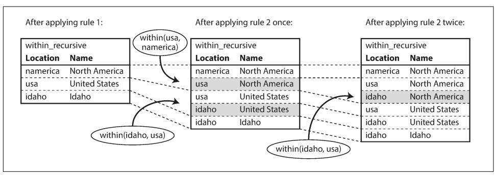

*Figure 2-6. Determining that Idaho is in North America, using the Datalog rules from [Example 2-11](#page-82-0).*

Now rule 3 can find people who were born in some location BornIn and live in some location LivingIn. By querying with BornIn = 'United States' and LivingIn = 'Europe', and leaving the person as a variable Who, we ask the Datalog system to find out which values can appear for the variable Who. So, finally we get the same answer as in the earlier Cypher and SPARQL queries.

<span id="page-84-0"></span>The Datalog approach requires a different kind of thinking to the other query lan‐ guages discussed in this chapter, but it's a very powerful approach, because rules can be combined and reused in different queries. It's less convenient for simple one-off queries, but it can cope better if your data is complex.

## **Summary**

Data models are a huge subject, and in this chapter we have taken a quick look at a broad variety of different models. We didn't have space to go into all the details of each model, but hopefully the overview has been enough to whet your appetite to find out more about the model that best fits your application's requirements.

Historically, data started out being represented as one big tree (the hierarchical model), but that wasn't good for representing many-to-many relationships, so the relational model was invented to solve that problem. More recently, developers found that some applications don't fit well in the relational model either. New nonrelational "NoSQL" datastores have diverged in two main directions:

- 1. *Document databases* target use cases where data comes in self-contained docu‐ ments and relationships between one document and another are rare.
- 2. *Graph databases* go in the opposite direction, targeting use cases where anything is potentially related to everything.

All three models (document, relational, and graph) are widely used today, and each is good in its respective domain. One model can be emulated in terms of another model —for example, graph data can be represented in a relational database—but the result is often awkward. That's why we have different systems for different purposes, not a single one-size-fits-all solution.

One thing that document and graph databases have in common is that they typically don't enforce a schema for the data they store, which can make it easier to adapt applications to changing requirements. However, your application most likely still assumes that data has a certain structure; it's just a question of whether the schema is explicit (enforced on write) or implicit (handled on read).

Each data model comes with its own query language or framework, and we discussed several examples: SQL, MapReduce, MongoDB's aggregation pipeline, Cypher, SPARQL, and Datalog. We also touched on CSS and XSL/XPath, which aren't data‐ base query languages but have interesting parallels.

Although we have covered a lot of ground, there are still many data models left unmentioned. To give just a few brief examples:

• Researchers working with genome data often need to perform *sequencesimilarity searches*, which means taking one very long string (representing a <span id="page-85-0"></span>DNA molecule) and matching it against a large database of strings that are simi‐ lar, but not identical. None of the databases described here can handle this kind of usage, which is why researchers have written specialized genome database software like GenBank [\[48](#page-88-0)].

- Particle physicists have been doing Big Data–style large-scale data analysis for decades, and projects like the Large Hadron Collider (LHC) now work with hun‐ dreds of petabytes! At such a scale custom solutions are required to stop the hardware cost from spiraling out of control [[49](#page-88-0)].
- *Full-text search* is arguably a kind of data model that is frequently used alongside databases. Information retrieval is a large specialist subject that we won't cover in great detail in this book, but we'll touch on search indexes in [Chapter 3](#page-90-0) and [Part III.](#page-406-0)

We have to leave it there for now. In the next chapter we will discuss some of the trade-offs that come into play when *implementing* the data models described in this chapter.

## **References**

- [[1\]](#page-49-0) Edgar F. Codd: ["A Relational Model of Data for Large Shared Data Banks](https://www.seas.upenn.edu/~zives/03f/cis550/codd.pdf)," *Com‐ munications of the ACM*, volume 13, number 6, pages 377–387, June 1970. [doi:](http://dx.doi.org/10.1145/362384.362685) [10.1145/362384.362685](http://dx.doi.org/10.1145/362384.362685)
- [[2\]](#page-50-0) Michael Stonebraker and Joseph M. Hellerstein: "[What Goes Around Comes](http://mitpress2.mit.edu/books/chapters/0262693143chapm1.pdf) [Around](http://mitpress2.mit.edu/books/chapters/0262693143chapm1.pdf)," in *Readings in Database Systems*, 4th edition, MIT Press, pages 2–41, 2005. ISBN: 978-0-262-69314-1
- [[3\]](#page-50-0) Pramod J. Sadalage and Martin Fowler: *NoSQL Distilled*. Addison-Wesley, August 2012. ISBN: 978-0-321-82662-6
- [[4\]](#page-50-0) Eric Evans: ["NoSQL: What's in a Name?](http://blog.sym-link.com/2009/10/30/nosql_whats_in_a_name.html)," *blog.sym-link.com*, October 30, 2009.
- [[5\]](#page-50-0) James Phillips: ["Surprises in Our NoSQL Adoption Survey,](http://blog.couchbase.com/nosql-adoption-survey-surprises)" *blog.couchbase.com*, February 8, 2012.
- [[6\]](#page-51-0) Michael Wagner: *SQL/XML:2006 Evaluierung der Standardkonformität ausge‐ wählter Datenbanksysteme*. Diplomica Verlag, Hamburg, 2010. ISBN: 978-3-836-64609-3
- [[7\]](#page-51-0) ["XML Data in SQL Server,](http://technet.microsoft.com/en-us/library/bb522446.aspx)" SQL Server 2012 documentation, *technet.micro‐ soft.com*, 2013.
- [[8\]](#page-51-0) ["PostgreSQL 9.3.1 Documentation,](http://www.postgresql.org/docs/9.3/static/index.html)" The PostgreSQL Global Development Group, 2013.
- [[9\]](#page-52-0) "[The MongoDB 2.4 Manual](http://docs.mongodb.org/manual/)," MongoDB, Inc., 2013.

- <span id="page-86-0"></span>[[10\]](#page-52-0) "[RethinkDB 1.11 Documentation](http://www.rethinkdb.com/docs/)," *rethinkdb.com*, 2013.
- [[11\]](#page-52-0) "[Apache CouchDB 1.6 Documentation](http://docs.couchdb.org/en/latest/)," *docs.couchdb.org*, 2014.
- [[12\]](#page-52-0) Lin Qiao, Kapil Surlaker, Shirshanka Das, et al.: "[On Brewing Fresh Espresso:](http://www.slideshare.net/amywtang/espresso-20952131) [LinkedIn's Distributed Data Serving Platform,](http://www.slideshare.net/amywtang/espresso-20952131)" at *ACM International Conference on Management of Data* (SIGMOD), June 2013.
- [[13\]](#page-57-0) Rick Long, Mark Harrington, Robert Hain, and Geoff Nicholls: *[IMS Primer](http://www.redbooks.ibm.com/redbooks/pdfs/sg245352.pdf)*. IBM Redbook SG24-5352-00, IBM International Technical Support Organization, January 2000.
- [[14\]](#page-57-0) Stephen D. Bartlett: "[IBM's IMS—Myths, Realities, and Opportunities](ftp://public.dhe.ibm.com/software/data/ims/pdf/TCG2013015LI.pdf)," The Clipper Group Navigator, TCG2013015LI, July 2013.
- [[15\]](#page-57-0) Sarah Mei: ["Why You Should Never Use MongoDB](http://www.sarahmei.com/blog/2013/11/11/why-you-should-never-use-mongodb/)," *sarahmei.com*, November 11, 2013.
- [[16\]](#page-57-0) J. S. Knowles and D. M. R. Bell: "The CODASYL Model," in *Databases—Role and Structure: An Advanced Course*, edited by P. M. Stocker, P. M. D. Gray, and M. P. Atkinson, pages 19–56, Cambridge University Press, 1984. ISBN: 978-0-521-25430-4
- [[17\]](#page-58-0) Charles W. Bachman: ["The Programmer as Navigator,](http://dl.acm.org/citation.cfm?id=362534)" *Communications of the ACM*, volume 16, number 11, pages 653–658, November 1973. [doi:](http://dx.doi.org/10.1145/355611.362534) [10.1145/355611.362534](http://dx.doi.org/10.1145/355611.362534)
- [[18\]](#page-59-0) Joseph M. Hellerstein, Michael Stonebraker, and James Hamilton: "[Architecture](http://db.cs.berkeley.edu/papers/fntdb07-architecture.pdf) [of a Database System,](http://db.cs.berkeley.edu/papers/fntdb07-architecture.pdf)" *Foundations and Trends in Databases*, volume 1, number 2, pages 141–259, November 2007. [doi:10.1561/1900000002](http://dx.doi.org/10.1561/1900000002)
- [[19\]](#page-60-0) Sandeep Parikh and Kelly Stirman: ["Schema Design for Time Series Data in](http://blog.mongodb.org/post/65517193370/schema-design-for-time-series-data-in-mongodb) [MongoDB,](http://blog.mongodb.org/post/65517193370/schema-design-for-time-series-data-in-mongodb)" *blog.mongodb.org*, October 30, 2013.
- [[20\]](#page-60-0) Martin Fowler: "[Schemaless Data Structures,](http://martinfowler.com/articles/schemaless/)" *martinfowler.com*, January 7, 2013.
- [[21\]](#page-61-0) Amr Awadallah: ["Schema-on-Read vs. Schema-on-Write,](http://www.slideshare.net/awadallah/schemaonread-vs-schemaonwrite)" at *Berkeley EECS RAD Lab Retreat*, Santa Cruz, CA, May 2009.
- [[22\]](#page-61-0) Martin Odersky: ["The Trouble with Types,](http://www.infoq.com/presentations/data-types-issues)" at *Strange Loop*, September 2013.
- [[23\]](#page-61-0) Conrad Irwin: "[MongoDB—Confessions of a PostgreSQL Lover](https://speakerdeck.com/conradirwin/mongodb-confessions-of-a-postgresql-lover)," at *HTML5DevConf*, October 2013.
- [[24\]](#page-61-0) "[Percona Toolkit Documentation: pt-online-schema-change](http://www.percona.com/doc/percona-toolkit/2.2/pt-online-schema-change.html)," Percona Ireland Ltd., 2013.
- [[25\]](#page-61-0) Rany Keddo, Tobias Bielohlawek, and Tobias Schmidt: "[Large Hadron Migra‐](https://github.com/soundcloud/lhm) [tor](https://github.com/soundcloud/lhm)," SoundCloud, 2013.

- <span id="page-87-0"></span>[[26\]](#page-61-0) Shlomi Noach: ["gh-ost: GitHub's Online Schema Migration Tool for MySQL](http://githubengineering.com/gh-ost-github-s-online-migration-tool-for-mysql/)," *githubengineering.com*, August 1, 2016.
- [[27\]](#page-62-0) James C. Corbett, Jeffrey Dean, Michael Epstein, et al.: ["Spanner: Google's](http://research.google.com/archive/spanner.html) [Globally-Distributed Database,](http://research.google.com/archive/spanner.html)" at *10th USENIX Symposium on Operating System Design and Implementation* (OSDI), October 2012.
- [[28\]](#page-62-0) Donald K. Burleson: ["Reduce I/O with Oracle Cluster Tables,](http://www.dba-oracle.com/oracle_tip_hash_index_cluster_table.htm)" *dba-oracle.com*.
- [[29\]](#page-62-0) Fay Chang, Jeffrey Dean, Sanjay Ghemawat, et al.: "[Bigtable: A Distributed Stor‐](http://research.google.com/archive/bigtable.html) [age System for Structured Data,](http://research.google.com/archive/bigtable.html)" at *7th USENIX Symposium on Operating System Design and Implementation* (OSDI), November 2006.
- [[30\]](#page-63-0) Bobbie J. Cochrane and Kathy A. McKnight: "[DB2 JSON Capabilities, Part 1:](http://www.ibm.com/developerworks/data/library/techarticle/dm-1306nosqlforjson1/) [Introduction to DB2 JSON](http://www.ibm.com/developerworks/data/library/techarticle/dm-1306nosqlforjson1/)," IBM developerWorks, June 20, 2013.
- [[31\]](#page-64-0) Herb Sutter: ["The Free Lunch Is Over: A Fundamental Turn Toward Concur‐](http://www.gotw.ca/publications/concurrency-ddj.htm) [rency in Software,](http://www.gotw.ca/publications/concurrency-ddj.htm)" *Dr. Dobb's Journal*, volume 30, number 3, pages 202-210, March 2005.
- [[32\]](#page-64-0) Joseph M. Hellerstein: "[The Declarative Imperative: Experiences and Conjec‐](http://www.eecs.berkeley.edu/Pubs/TechRpts/2010/EECS-2010-90.pdf) [tures in Distributed Logic,](http://www.eecs.berkeley.edu/Pubs/TechRpts/2010/EECS-2010-90.pdf)" Electrical Engineering and Computer Sciences, Univer‐ sity of California at Berkeley, Tech report UCB/EECS-2010-90, June 2010.
- [[33\]](#page-67-0) Jeffrey Dean and Sanjay Ghemawat: "[MapReduce: Simplified Data Processing on](http://research.google.com/archive/mapreduce.html) [Large Clusters](http://research.google.com/archive/mapreduce.html)," at *6th USENIX Symposium on Operating System Design and Imple‐ mentation* (OSDI), December 2004.
- [[34\]](#page-69-0) Craig Kerstiens: "[JavaScript in Your Postgres,](https://blog.heroku.com/javascript_in_your_postgres)" *blog.heroku.com*, June 5, 2013.
- [[35\]](#page-70-0) Nathan Bronson, Zach Amsden, George Cabrera, et al.: ["TAO: Facebook's Dis‐](https://www.usenix.org/conference/atc13/technical-sessions/presentation/bronson) [tributed Data Store for the Social Graph,](https://www.usenix.org/conference/atc13/technical-sessions/presentation/bronson)" at *USENIX Annual Technical Conference* (USENIX ATC), June 2013.
- [[36\]](#page-71-0) "[Apache TinkerPop3.2.3 Documentation,](http://tinkerpop.apache.org/docs/3.2.3/reference/)" *tinkerpop.apache.org*, October 2016.
- [[37\]](#page-73-0) "[The Neo4j Manual v2.0.0](http://docs.neo4j.org/chunked/2.0.0/index.html)," Neo Technology, 2013.
- [[38\]](#page-73-0) Emil Eifrem: [Twitter correspondence,](https://twitter.com/emileifrem/status/419107961512804352) January 3, 2014.
- [[39\]](#page-77-0) David Beckett and Tim Berners-Lee: "[Turtle Terse RDF Triple Language](http://www.w3.org/TeamSubmission/turtle/)," W3C Team Submission, March 28, 2011.
- [[40\]](#page-78-0) "[Datomic Development Resources,](http://docs.datomic.com/)" Metadata Partners, LLC, 2013.
- [[41\]](#page-78-0) W3C RDF Working Group: ["Resource Description Framework \(RDF\)](http://www.w3.org/RDF/)," *w3.org*, 10 February 2004.
- [[42\]](#page-78-0) "[Apache Jena](http://jena.apache.org/)," Apache Software Foundation.

- <span id="page-88-0"></span>[[43\]](#page-80-0) Steve Harris, Andy Seaborne, and Eric Prud'hommeaux: ["SPARQL 1.1 Query](http://www.w3.org/TR/sparql11-query/) [Language](http://www.w3.org/TR/sparql11-query/)," W3C Recommendation, March 2013.
- [[44\]](#page-81-0) Todd J. Green, Shan Shan Huang, Boon Thau Loo, and Wenchao Zhou: ["Data‐](http://blogs.evergreen.edu/sosw/files/2014/04/Green-Vol5-DBS-017.pdf) [log and Recursive Query Processing](http://blogs.evergreen.edu/sosw/files/2014/04/Green-Vol5-DBS-017.pdf)," *Foundations and Trends in Databases*, volume 5, number 2, pages 105–195, November 2013. [doi:10.1561/1900000017](http://dx.doi.org/10.1561/1900000017)
- [[45\]](#page-81-0) Stefano Ceri, Georg Gottlob, and Letizia Tanca: "[What You Always Wanted to](https://www.researchgate.net/profile/Letizia_Tanca/publication/3296132_What_you_always_wanted_to_know_about_Datalog_and_never_dared_to_ask/links/0fcfd50ca2d20473ca000000.pdf) [Know About Datalog \(And Never Dared to Ask\),](https://www.researchgate.net/profile/Letizia_Tanca/publication/3296132_What_you_always_wanted_to_know_about_Datalog_and_never_dared_to_ask/links/0fcfd50ca2d20473ca000000.pdf)" *IEEE Transactions on Knowledge and Data Engineering*, volume 1, number 1, pages 146–166, March 1989. [doi:](http://dx.doi.org/10.1109/69.43410) [10.1109/69.43410](http://dx.doi.org/10.1109/69.43410)
- [[46\]](#page-81-0) Serge Abiteboul, Richard Hull, and Victor Vianu: *[Foundations of Databases](http://webdam.inria.fr/Alice/)*. Addison-Wesley, 1995. ISBN: 978-0-201-53771-0, available online at *web‐ dam.inria.fr/Alice*
- [[47\]](#page-81-0) Nathan Marz: "[Cascalog](http://cascalog.org/)," *cascalog.org*.
- [[48\]](#page-85-0) Dennis A. Benson, Ilene Karsch-Mizrachi, David J. Lipman, et al.: "[GenBank](http://nar.oxfordjournals.org/content/36/suppl_1/D25.full-text-lowres.pdf)," *Nucleic Acids Research*, volume 36, Database issue, pages D25–D30, December 2007. [doi:10.1093/nar/gkm929](http://dx.doi.org/10.1093/nar/gkm929)
- [[49\]](#page-85-0) Fons Rademakers: "[ROOT for Big Data Analysis,](http://indico.cern.ch/getFile.py/access?contribId=13&resId=0&materialId=slides&confId=246453)" at *Workshop on the Future of Big Data Management*, London, UK, June 2013.

# **Storage and Retrieval**

<span id="page-90-0"></span>*Wer Ordnung hält, ist nur zu faul zum Suchen. (If you keep things tidily ordered, you're just too lazy to go searching.)* —German proverb

On the most fundamental level, a database needs to do two things: when you give it some data, it should store the data, and when you ask it again later, it should give the data back to you.

In [Chapter 2](#page-48-0) we discussed data models and query languages—i.e., the format in which you (the application developer) give the database your data, and the mecha‐ nism by which you can ask for it again later. In this chapter we discuss the same from the database's point of view: how we can store the data that we're given, and how we can find it again when we're asked for it.

Why should you, as an application developer, care how the database handles storage and retrieval internally? You're probably not going to implement your own storage engine from scratch, but you *do* need to select a storage engine that is appropriate for your application, from the many that are available. In order to tune a storage engine to perform well on your kind of workload, you need to have a rough idea of what the storage engine is doing under the hood.

In particular, there is a big difference between storage engines that are optimized for transactional workloads and those that are optimized for analytics. We will explore that distinction later in ["Transaction Processing or Analytics?" on page 90](#page-111-0), and in ["Column-Oriented Storage" on page 95](#page-116-0) we'll discuss a family of storage engines that is optimized for analytics.

However, first we'll start this chapter by talking about storage engines that are used in the kinds of databases that you're probably familiar with: traditional relational data‐ bases, and also most so-called NoSQL databases. We will examine two families of

<span id="page-91-0"></span>storage engines: *log-structured* storage engines, and *page-oriented* storage engines such as B-trees.

## **Data Structures That Power Your Database**

Consider the world's simplest database, implemented as two Bash functions:

```
#!/bin/bash
db_set () {
 echo "$1,$2" >> database
db_get () {
 grep "^$1," database | sed -e "s/^$1,//" | tail -n 1
```

These two functions implement a key-value store. You can call db\_set key value, which will store key and value in the database. The key and value can be (almost) anything you like—for example, the value could be a JSON document. You can then call db\_get key, which looks up the most recent value associated with that particular key and returns it.

And it works:

```
$ db_set 123456 '{"name":"London","attractions":["Big Ben","London Eye"]}'
$ db_set 42 '{"name":"San Francisco","attractions":["Golden Gate Bridge"]}'
$ db_get 42
{"name":"San Francisco","attractions":["Golden Gate Bridge"]}
```

The underlying storage format is very simple: a text file where each line contains a key-value pair, separated by a comma (roughly like a CSV file, ignoring escaping issues). Every call to db\_set appends to the end of the file, so if you update a key sev‐ eral times, the old versions of the value are not overwritten—you need to look at the last occurrence of a key in a file to find the latest value (hence the tail -n 1 in db\_get):

```
$ db_set 42 '{"name":"San Francisco","attractions":["Exploratorium"]}'
$ db_get 42
{"name":"San Francisco","attractions":["Exploratorium"]}
$ cat database
123456,{"name":"London","attractions":["Big Ben","London Eye"]}
42,{"name":"San Francisco","attractions":["Golden Gate Bridge"]}
42,{"name":"San Francisco","attractions":["Exploratorium"]}
```

<span id="page-92-0"></span>Our db\_set function actually has pretty good performance for something that is so simple, because appending to a file is generally very efficient. Similarly to what db\_set does, many databases internally use a *log*, which is an append-only data file. Real databases have more issues to deal with (such as concurrency control, reclaim‐ ing disk space so that the log doesn't grow forever, and handling errors and partially written records), but the basic principle is the same. Logs are incredibly useful, and we will encounter them several times in the rest of this book.


The word *log* is often used to refer to application logs, where an application outputs text that describes what's happening. In this book, *log* is used in the more general sense: an append-only sequence of records. It doesn't have to be human-readable; it might be binary and intended only for other programs to read.

On the other hand, our db\_get function has terrible performance if you have a large number of records in your database. Every time you want to look up a key, db\_get has to scan the entire database file from beginning to end, looking for occurrences of the key. In algorithmic terms, the cost of a lookup is *O*(*n*): if you double the number of records *n* in your database, a lookup takes twice as long. That's not good.

In order to efficiently find the value for a particular key in the database, we need a different data structure: an *index*. In this chapter we will look at a range of indexing structures and see how they compare; the general idea behind them is to keep some additional metadata on the side, which acts as a signpost and helps you to locate the data you want. If you want to search the same data in several different ways, you may need several different indexes on different parts of the data.

An index is an *additional* structure that is derived from the primary data. Many data‐ bases allow you to add and remove indexes, and this doesn't affect the contents of the database; it only affects the performance of queries. Maintaining additional structures incurs overhead, especially on writes. For writes, it's hard to beat the performance of simply appending to a file, because that's the simplest possible write operation. Any kind of index usually slows down writes, because the index also needs to be updated every time data is written.

This is an important trade-off in storage systems: well-chosen indexes speed up read queries, but every index slows down writes. For this reason, databases don't usually index everything by default, but require you—the application developer or database administrator—to choose indexes manually, using your knowledge of the applica‐ tion's typical query patterns. You can then choose the indexes that give your applica‐ tion the greatest benefit, without introducing more overhead than necessary.

## <span id="page-93-0"></span>**Hash Indexes**

Let's start with indexes for key-value data. This is not the only kind of data you can index, but it's very common, and it's a useful building block for more complex indexes.

Key-value stores are quite similar to the *dictionary* type that you can find in most programming languages, and which is usually implemented as a hash map (hash table). Hash maps are described in many algorithms textbooks [\[1](#page-125-0), [2\]](#page-125-0), so we won't go into detail of how they work here. Since we already have hash maps for our inmemory data structures, why not use them to index our data on disk?

Let's say our data storage consists only of appending to a file, as in the preceding example. Then the simplest possible indexing strategy is this: keep an in-memory hash map where every key is mapped to a byte offset in the data file—the location at which the value can be found, as illustrated in Figure 3-1. Whenever you append a new key-value pair to the file, you also update the hash map to reflect the offset of the data you just wrote (this works both for inserting new keys and for updating existing keys). When you want to look up a value, use the hash map to find the offset in the data file, seek to that location, and read the value.

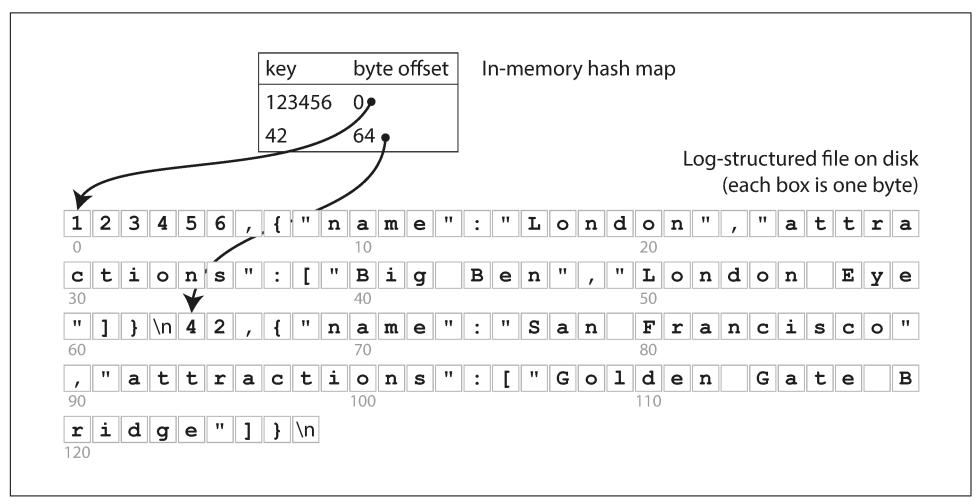

*Figure 3-1. Storing a log of key-value pairs in a CSV-like format, indexed with an inmemory hash map.*

This may sound simplistic, but it is a viable approach. In fact, this is essentially what Bitcask (the default storage engine in Riak) does [\[3](#page-125-0)]. Bitcask offers high-performance reads and writes, subject to the requirement that all the keys fit in the available RAM, since the hash map is kept completely in memory. The values can use more space than there is available memory, since they can be loaded from disk with just one disk

<span id="page-94-0"></span>seek. If that part of the data file is already in the filesystem cache, a read doesn't require any disk I/O at all.

A storage engine like Bitcask is well suited to situations where the value for each key is updated frequently. For example, the key might be the URL of a cat video, and the value might be the number of times it has been played (incremented every time someone hits the play button). In this kind of workload, there are a lot of writes, but there are not too many distinct keys—you have a large number of writes per key, but it's feasible to keep all keys in memory.

As described so far, we only ever append to a file—so how do we avoid eventually running out of disk space? A good solution is to break the log into segments of a cer‐ tain size by closing a segment file when it reaches a certain size, and making subse‐ quent writes to a new segment file. We can then perform *compaction* on these segments, as illustrated in Figure 3-2. Compaction means throwing away duplicate keys in the log, and keeping only the most recent update for each key.

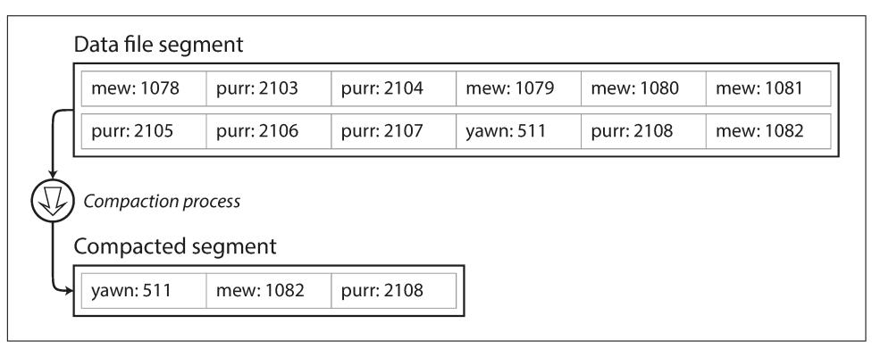

*Figure 3-2. Compaction of a key-value update log (counting the number of times each cat video was played), retaining only the most recent value for each key.*

Moreover, since compaction often makes segments much smaller (assuming that a key is overwritten several times on average within one segment), we can also merge several segments together at the same time as performing the compaction, as shown in [Figure 3-3.](#page-95-0) Segments are never modified after they have been written, so the merged segment is written to a new file. The merging and compaction of frozen seg‐ ments can be done in a background thread, and while it is going on, we can still con‐ tinue to serve read and write requests as normal, using the old segment files. After the merging process is complete, we switch read requests to using the new merged seg‐ ment instead of the old segments—and then the old segment files can simply be deleted.

<span id="page-95-0"></span>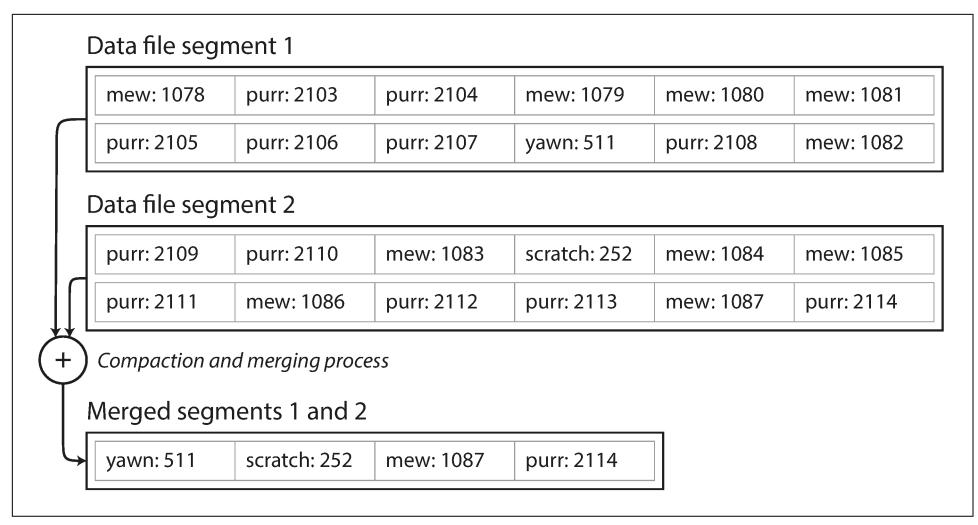

*Figure 3-3. Performing compaction and segment merging simultaneously.*

Each segment now has its own in-memory hash table, mapping keys to file offsets. In order to find the value for a key, we first check the most recent segment's hash map; if the key is not present we check the second-most-recent segment, and so on. The merging process keeps the number of segments small, so lookups don't need to check many hash maps.

Lots of detail goes into making this simple idea work in practice. Briefly, some of the issues that are important in a real implementation are:

## *File format*

CSV is not the best format for a log. It's faster and simpler to use a binary format that first encodes the length of a string in bytes, followed by the raw string (without need for escaping).

## *Deleting records*

If you want to delete a key and its associated value, you have to append a special deletion record to the data file (sometimes called a *tombstone*). When log seg‐ ments are merged, the tombstone tells the merging process to discard any previ‐ ous values for the deleted key.

## *Crash recovery*

If the database is restarted, the in-memory hash maps are lost. In principle, you can restore each segment's hash map by reading the entire segment file from beginning to end and noting the offset of the most recent value for every key as you go along. However, that might take a long time if the segment files are large, which would make server restarts painful. Bitcask speeds up recovery by storing <span id="page-96-0"></span>a snapshot of each segment's hash map on disk, which can be loaded into mem‐ ory more quickly.

#### *Partially written records*

The database may crash at any time, including halfway through appending a record to the log. Bitcask files include checksums, allowing such corrupted parts of the log to be detected and ignored.

## *Concurrency control*

As writes are appended to the log in a strictly sequential order, a common imple‐ mentation choice is to have only one writer thread. Data file segments are append-only and otherwise immutable, so they can be read concurrently by mul‐ tiple threads.

An append-only log seems wasteful at first glance: why don't you update the file in place, overwriting the old value with the new value? But an append-only design turns out to be good for several reasons:

- Appending and segment merging are sequential write operations, which are gen‐ erally much faster than random writes, especially on magnetic spinning-disk hard drives. To some extent sequential writes are also preferable on flash-based *solid state drives* (SSDs) [\[4](#page-125-0)]. We will discuss this issue further in ["Comparing B-](#page-104-0)[Trees and LSM-Trees" on page 83.](#page-104-0)
- Concurrency and crash recovery are much simpler if segment files are appendonly or immutable. For example, you don't have to worry about the case where a crash happened while a value was being overwritten, leaving you with a file con‐ taining part of the old and part of the new value spliced together.
- Merging old segments avoids the problem of data files getting fragmented over time.

However, the hash table index also has limitations:

- The hash table must fit in memory, so if you have a very large number of keys, you're out of luck. In principle, you could maintain a hash map on disk, but unfortunately it is difficult to make an on-disk hash map perform well. It requires a lot of random access I/O, it is expensive to grow when it becomes full, and hash collisions require fiddly logic [\[5](#page-125-0)].
- Range queries are not efficient. For example, you cannot easily scan over all keys between kitty00000 and kitty99999—you'd have to look up each key individu‐ ally in the hash maps.

In the next section we will look at an indexing structure that doesn't have those limi‐ tations.

## <span id="page-97-0"></span>**SSTables and LSM-Trees**

In [Figure 3-3](#page-95-0), each log-structured storage segment is a sequence of key-value pairs. These pairs appear in the order that they were written, and values later in the log take precedence over values for the same key earlier in the log. Apart from that, the order of key-value pairs in the file does not matter.

Now we can make a simple change to the format of our segment files: we require that the sequence of key-value pairs is *sorted by key*. At first glance, that requirement seems to break our ability to use sequential writes, but we'll get to that in a moment.

We call this format *Sorted String Table*, or *SSTable* for short. We also require that each key only appears once within each merged segment file (the compaction process already ensures that). SSTables have several big advantages over log segments with hash indexes:

1. Merging segments is simple and efficient, even if the files are bigger than the available memory. The approach is like the one used in the *mergesort* algorithm and is illustrated in Figure 3-4: you start reading the input files side by side, look at the first key in each file, copy the lowest key (according to the sort order) to the output file, and repeat. This produces a new merged segment file, also sorted by key.

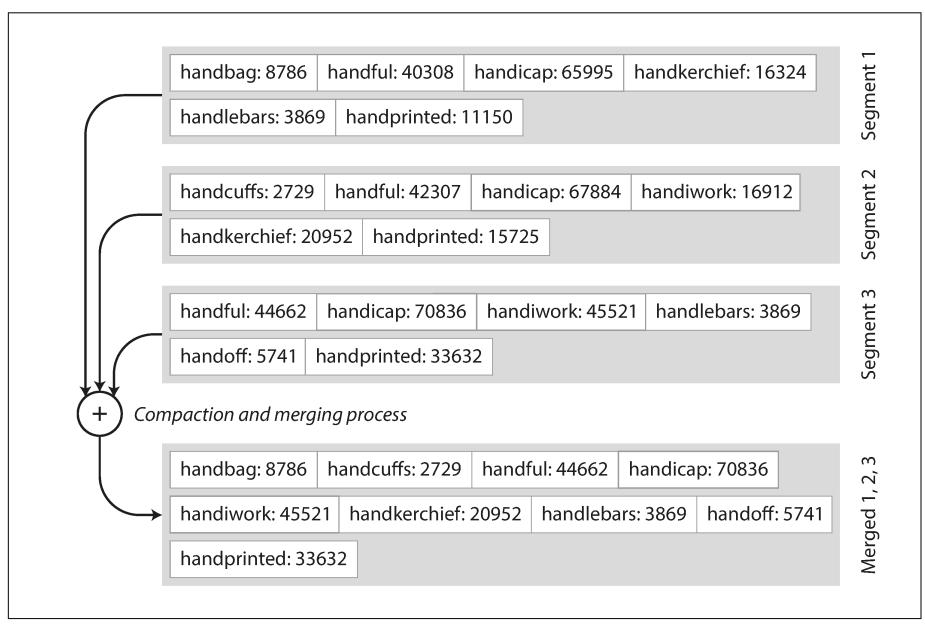

*Figure 3-4. Merging several SSTable segments, retaining only the most recent value for each key.*

<span id="page-98-0"></span>What if the same key appears in several input segments? Remember that each segment contains all the values written to the database during some period of time. This means that all the values in one input segment must be more recent than all the values in the other segment (assuming that we always merge adjacent segments). When multiple segments contain the same key, we can keep the value from the most recent segment and discard the values in older segments.

2. In order to find a particular key in the file, you no longer need to keep an index of all the keys in memory. See Figure 3-5 for an example: say you're looking for the key handiwork, but you don't know the exact offset of that key in the segment file. However, you do know the offsets for the keys *handbag* and *handsome*, and because of the sorting you know that *handiwork* must appear between those two. This means you can jump to the offset for *handbag* and scan from there until you find *handiwork* (or not, if the key is not present in the file).

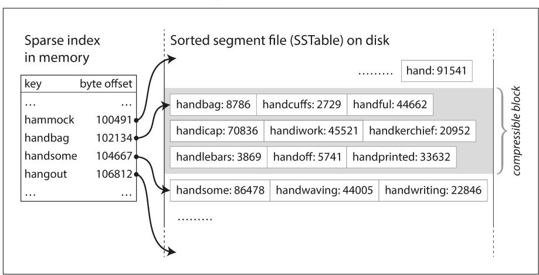

*Figure 3-5. An SSTable with an in-memory index.*

You still need an in-memory index to tell you the offsets for some of the keys, but it can be sparse: one key for every few kilobytes of segment file is sufficient, because a few kilobytes can be scanned very quickly.<sup>i</sup>

3. Since read requests need to scan over several key-value pairs in the requested range anyway, it is possible to group those records into a block and compress it before writing it to disk (indicated by the shaded area in Figure 3-5). Each entry of the sparse in-memory index then points at the start of a compressed block. Besides saving disk space, compression also reduces the I/O bandwidth use.

i. If all keys and values had a fixed size, you could use binary search on a segment file and avoid the inmemory index entirely. However, they are usually variable-length in practice, which makes it difficult to tell where one record ends and the next one starts if you don't have an index.

## <span id="page-99-0"></span>**Constructing and maintaining SSTables**

Fine so far—but how do you get your data to be sorted by key in the first place? Our incoming writes can occur in any order.

Maintaining a sorted structure on disk is possible (see "B-Trees" [on page 79\)](#page-100-0), but maintaining it in memory is much easier. There are plenty of well-known tree data structures that you can use, such as red-black trees or AVL trees [\[2](#page-125-0)]. With these data structures, you can insert keys in any order and read them back in sorted order.

We can now make our storage engine work as follows:

- When a write comes in, add it to an in-memory balanced tree data structure (for example, a red-black tree). This in-memory tree is sometimes called a *memtable*.
- When the memtable gets bigger than some threshold—typically a few megabytes —write it out to disk as an SSTable file. This can be done efficiently because the tree already maintains the key-value pairs sorted by key. The new SSTable file becomes the most recent segment of the database. While the SSTable is being written out to disk, writes can continue to a new memtable instance.
- In order to serve a read request, first try to find the key in the memtable, then in the most recent on-disk segment, then in the next-older segment, etc.
- From time to time, run a merging and compaction process in the background to combine segment files and to discard overwritten or deleted values.

This scheme works very well. It only suffers from one problem: if the database crashes, the most recent writes (which are in the memtable but not yet written out to disk) are lost. In order to avoid that problem, we can keep a separate log on disk to which every write is immediately appended, just like in the previous section. That log is not in sorted order, but that doesn't matter, because its only purpose is to restore the memtable after a crash. Every time the memtable is written out to an SSTable, the corresponding log can be discarded.

## **Making an LSM-tree out of SSTables**

The algorithm described here is essentially what is used in LevelDB [[6\]](#page-125-0) and RocksDB [[7\]](#page-125-0), key-value storage engine libraries that are designed to be embedded into other applications. Among other things, LevelDB can be used in Riak as an alternative to Bitcask. Similar storage engines are used in Cassandra and HBase [\[8](#page-125-0)], both of which were inspired by Google's Bigtable paper [[9\]](#page-126-0) (which introduced the terms *SSTable* and *memtable*).

Originally this indexing structure was described by Patrick O'Neil et al. under the name *Log-Structured Merge-Tree* (or LSM-Tree) [\[10](#page-126-0)], building on earlier work on <span id="page-100-0"></span>log-structured filesystems [[11\]](#page-126-0). Storage engines that are based on this principle of merging and compacting sorted files are often called LSM storage engines.

Lucene, an indexing engine for full-text search used by Elasticsearch and Solr, uses a similar method for storing its *term dictionary* [[12,](#page-126-0) [13\]](#page-126-0). A full-text index is much more complex than a key-value index but is based on a similar idea: given a word in a search query, find all the documents (web pages, product descriptions, etc.) that mention the word. This is implemented with a key-value structure where the key is a word (a *term*) and the value is the list of IDs of all the documents that contain the word (the *postings list*). In Lucene, this mapping from term to postings list is kept in SSTable-like sorted files, which are merged in the background as needed [\[14\]](#page-126-0).

## **Performance optimizations**

As always, a lot of detail goes into making a storage engine perform well in practice. For example, the LSM-tree algorithm can be slow when looking up keys that do not exist in the database: you have to check the memtable, then the segments all the way back to the oldest (possibly having to read from disk for each one) before you can be sure that the key does not exist. In order to optimize this kind of access, storage engines often use additional *Bloom filters* [\[15](#page-126-0)]. (A Bloom filter is a memory-efficient data structure for approximating the contents of a set. It can tell you if a key does not appear in the database, and thus saves many unnecessary disk reads for nonexistent keys.)

There are also different strategies to determine the order and timing of how SSTables are compacted and merged. The most common options are *size-tiered* and *leveled* compaction. LevelDB and RocksDB use leveled compaction (hence the name of Lev‐ elDB), HBase uses size-tiered, and Cassandra supports both [\[16](#page-126-0)]. In size-tiered com‐ paction, newer and smaller SSTables are successively merged into older and larger SSTables. In leveled compaction, the key range is split up into smaller SSTables and older data is moved into separate "levels," which allows the compaction to proceed more incrementally and use less disk space.

Even though there are many subtleties, the basic idea of LSM-trees—keeping a cas‐ cade of SSTables that are merged in the background—is simple and effective. Even when the dataset is much bigger than the available memory it continues to work well. Since data is stored in sorted order, you can efficiently perform range queries (scan‐ ning all keys above some minimum and up to some maximum), and because the disk writes are sequential the LSM-tree can support remarkably high write throughput.

## **B-Trees**

The log-structured indexes we have discussed so far are gaining acceptance, but they are not the most common type of index. The most widely used indexing structure is quite different: the *B-tree*.

<span id="page-101-0"></span>Introduced in 1970 [[17\]](#page-126-0) and called "ubiquitous" less than 10 years later [\[18](#page-126-0)], B-trees have stood the test of time very well. They remain the standard index implementation in almost all relational databases, and many nonrelational databases use them too.

Like SSTables, B-trees keep key-value pairs sorted by key, which allows efficient keyvalue lookups and range queries. But that's where the similarity ends: B-trees have a very different design philosophy.

The log-structured indexes we saw earlier break the database down into variable-size *segments*, typically several megabytes or more in size, and always write a segment sequentially. By contrast, B-trees break the database down into fixed-size *blocks* or *pages*, traditionally 4 KB in size (sometimes bigger), and read or write one page at a time. This design corresponds more closely to the underlying hardware, as disks are also arranged in fixed-size blocks.

Each page can be identified using an address or location, which allows one page to refer to another—similar to a pointer, but on disk instead of in memory. We can use these page references to construct a tree of pages, as illustrated in Figure 3-6.

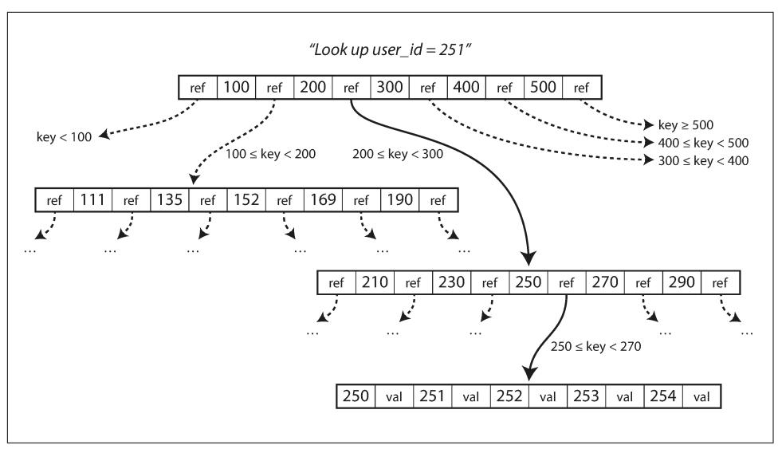

*Figure 3-6. Looking up a key using a B-tree index.*

One page is designated as the *root* of the B-tree; whenever you want to look up a key in the index, you start here. The page contains several keys and references to child pages. Each child is responsible for a continuous range of keys, and the keys between the references indicate where the boundaries between those ranges lie.

In the example in Figure 3-6, we are looking for the key 251, so we know that we need to follow the page reference between the boundaries 200 and 300. That takes us to a similar-looking page that further breaks down the 200–300 range into subranges.

<span id="page-102-0"></span>Eventually we get down to a page containing individual keys (a *leaf page*), which either contains the value for each key inline or contains references to the pages where the values can be found.

The number of references to child pages in one page of the B-tree is called the *branching factor*. For example, in [Figure 3-6](#page-101-0) the branching factor is six. In practice, the branching factor depends on the amount of space required to store the page refer‐ ences and the range boundaries, but typically it is several hundred.

If you want to update the value for an existing key in a B-tree, you search for the leaf page containing that key, change the value in that page, and write the page back to disk (any references to that page remain valid). If you want to add a new key, you need to find the page whose range encompasses the new key and add it to that page. If there isn't enough free space in the page to accommodate the new key, it is split into two half-full pages, and the parent page is updated to account for the new subdi‐ vision of key ranges—see Figure 3-7. ii

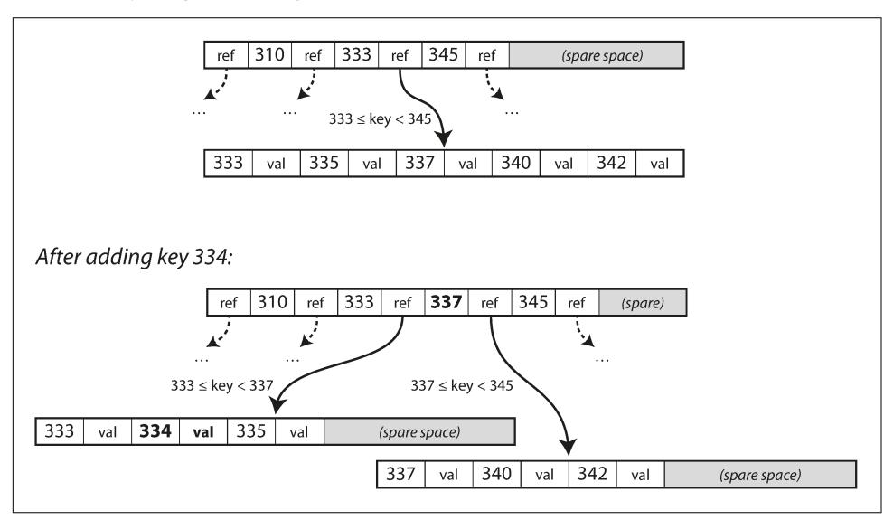

*Figure 3-7. Growing a B-tree by splitting a page.*

This algorithm ensures that the tree remains *balanced*: a B-tree with *n* keys always has a depth of *O*(log *n*). Most databases can fit into a B-tree that is three or four levels deep, so you don't need to follow many page references to find the page you are look‐ ing for. (A four-level tree of 4 KB pages with a branching factor of 500 can store up to 256 TB.)

ii. Inserting a new key into a B-tree is reasonably intuitive, but deleting one (while keeping the tree balanced) is somewhat more involved [\[2](#page-125-0)].

## <span id="page-103-0"></span>**Making B-trees reliable**

The basic underlying write operation of a B-tree is to overwrite a page on disk with new data. It is assumed that the overwrite does not change the location of the page; i.e., all references to that page remain intact when the page is overwritten. This is in stark contrast to log-structured indexes such as LSM-trees, which only append to files (and eventually delete obsolete files) but never modify files in place.

You can think of overwriting a page on disk as an actual hardware operation. On a magnetic hard drive, this means moving the disk head to the right place, waiting for the right position on the spinning platter to come around, and then overwriting the appropriate sector with new data. On SSDs, what happens is somewhat more compli‐ cated, due to the fact that an SSD must erase and rewrite fairly large blocks of a stor‐ age chip at a time [\[19](#page-126-0)].

Moreover, some operations require several different pages to be overwritten. For example, if you split a page because an insertion caused it to be overfull, you need to write the two pages that were split, and also overwrite their parent page to update the references to the two child pages. This is a dangerous operation, because if the data‐ base crashes after only some of the pages have been written, you end up with a cor‐ rupted index (e.g., there may be an *orphan* page that is not a child of any parent).

In order to make the database resilient to crashes, it is common for B-tree implemen‐ tations to include an additional data structure on disk: a *write-ahead log* (WAL, also known as a *redo log*). This is an append-only file to which every B-tree modification must be written before it can be applied to the pages of the tree itself. When the data‐ base comes back up after a crash, this log is used to restore the B-tree back to a con‐ sistent state [[5,](#page-125-0) [20\]](#page-126-0).

An additional complication of updating pages in place is that careful concurrency control is required if multiple threads are going to access the B-tree at the same time —otherwise a thread may see the tree in an inconsistent state. This is typically done by protecting the tree's data structures with *latches* (lightweight locks). Logstructured approaches are simpler in this regard, because they do all the merging in the background without interfering with incoming queries and atomically swap old segments for new segments from time to time.

#### **B-tree optimizations**

As B-trees have been around for so long, it's not surprising that many optimizations have been developed over the years. To mention just a few:

• Instead of overwriting pages and maintaining a WAL for crash recovery, some databases (like LMDB) use a copy-on-write scheme [\[21](#page-126-0)]. A modified page is written to a different location, and a new version of the parent pages in the tree is created, pointing at the new location. This approach is also useful for concur‐

<span id="page-104-0"></span>rency control, as we shall see in ["Snapshot Isolation and Repeatable Read" on](#page-258-0) [page 237.](#page-258-0)

- We can save space in pages by not storing the entire key, but abbreviating it. Especially in pages on the interior of the tree, keys only need to provide enough information to act as boundaries between key ranges. Packing more keys into a page allows the tree to have a higher branching factor, and thus fewer levels.iii
- In general, pages can be positioned anywhere on disk; there is nothing requiring pages with nearby key ranges to be nearby on disk. If a query needs to scan over a large part of the key range in sorted order, that page-by-page layout can be ineffi‐ cient, because a disk seek may be required for every page that is read. Many Btree implementations therefore try to lay out the tree so that leaf pages appear in sequential order on disk. However, it's difficult to maintain that order as the tree grows. By contrast, since LSM-trees rewrite large segments of the storage in one go during merging, it's easier for them to keep sequential keys close to each other on disk.
- Additional pointers have been added to the tree. For example, each leaf page may have references to its sibling pages to the left and right, which allows scanning keys in order without jumping back to parent pages.
- B-tree variants such as *fractal trees* [\[22](#page-126-0)] borrow some log-structured ideas to reduce disk seeks (and they have nothing to do with fractals).

## **Comparing B-Trees and LSM-Trees**

Even though B-tree implementations are generally more mature than LSM-tree implementations, LSM-trees are also interesting due to their performance character‐ istics. As a rule of thumb, LSM-trees are typically faster for writes, whereas B-trees are thought to be faster for reads [[23\]](#page-126-0). Reads are typically slower on LSM-trees because they have to check several different data structures and SSTables at different stages of compaction.

However, benchmarks are often inconclusive and sensitive to details of the workload. You need to test systems with your particular workload in order to make a valid com‐ parison. In this section we will briefly discuss a few things that are worth considering when measuring the performance of a storage engine.

iii. This variant is sometimes known as a B+ tree, although the optimization is so common that it often isn't distinguished from other B-tree variants.

## <span id="page-105-0"></span>**Advantages of LSM-trees**

A B-tree index must write every piece of data at least twice: once to the write-ahead log, and once to the tree page itself (and perhaps again as pages are split). There is also overhead from having to write an entire page at a time, even if only a few bytes in that page changed. Some storage engines even overwrite the same page twice in order to avoid ending up with a partially updated page in the event of a power failure [[24,](#page-127-0) [25](#page-127-0)].

Log-structured indexes also rewrite data multiple times due to repeated compaction and merging of SSTables. This effect—one write to the database resulting in multiple writes to the disk over the course of the database's lifetime—is known as *write ampli‐ fication*. It is of particular concern on SSDs, which can only overwrite blocks a limi‐ ted number of times before wearing out.

In write-heavy applications, the performance bottleneck might be the rate at which the database can write to disk. In this case, write amplification has a direct perfor‐ mance cost: the more that a storage engine writes to disk, the fewer writes per second it can handle within the available disk bandwidth.

Moreover, LSM-trees are typically able to sustain higher write throughput than Btrees, partly because they sometimes have lower write amplification (although this depends on the storage engine configuration and workload), and partly because they sequentially write compact SSTable files rather than having to overwrite several pages in the tree [[26](#page-127-0)]. This difference is particularly important on magnetic hard drives, where sequential writes are much faster than random writes.

LSM-trees can be compressed better, and thus often produce smaller files on disk than B-trees. B-tree storage engines leave some disk space unused due to fragmenta‐ tion: when a page is split or when a row cannot fit into an existing page, some space in a page remains unused. Since LSM-trees are not page-oriented and periodically rewrite SSTables to remove fragmentation, they have lower storage overheads, espe‐ cially when using leveled compaction [[27\]](#page-127-0).

On many SSDs, the firmware internally uses a log-structured algorithm to turn ran‐ dom writes into sequential writes on the underlying storage chips, so the impact of the storage engine's write pattern is less pronounced [\[19](#page-126-0)]. However, lower write amplification and reduced fragmentation are still advantageous on SSDs: represent‐ ing data more compactly allows more read and write requests within the available I/O bandwidth.

#### **Downsides of LSM-trees**

A downside of log-structured storage is that the compaction process can sometimes interfere with the performance of ongoing reads and writes. Even though storage engines try to perform compaction incrementally and without affecting concurrent <span id="page-106-0"></span>access, disks have limited resources, so it can easily happen that a request needs to wait while the disk finishes an expensive compaction operation. The impact on throughput and average response time is usually small, but at higher percentiles (see ["Describing Performance" on page 13](#page-34-0)) the response time of queries to log-structured storage engines can sometimes be quite high, and B-trees can be more predictable [[28\]](#page-127-0).

Another issue with compaction arises at high write throughput: the disk's finite write bandwidth needs to be shared between the initial write (logging and flushing a memtable to disk) and the compaction threads running in the background. When writing to an empty database, the full disk bandwidth can be used for the initial write, but the bigger the database gets, the more disk bandwidth is required for compaction.

If write throughput is high and compaction is not configured carefully, it can happen that compaction cannot keep up with the rate of incoming writes. In this case, the number of unmerged segments on disk keeps growing until you run out of disk space, and reads also slow down because they need to check more segment files. Typ‐ ically, SSTable-based storage engines do not throttle the rate of incoming writes, even if compaction cannot keep up, so you need explicit monitoring to detect this situa‐ tion [\[29](#page-127-0), [30](#page-127-0)].

An advantage of B-trees is that each key exists in exactly one place in the index, whereas a log-structured storage engine may have multiple copies of the same key in different segments. This aspect makes B-trees attractive in databases that want to offer strong transactional semantics: in many relational databases, transaction isola‐ tion is implemented using locks on ranges of keys, and in a B-tree index, those locks can be directly attached to the tree [\[5](#page-125-0)]. In [Chapter 7](#page-242-0) we will discuss this point in more detail.

B-trees are very ingrained in the architecture of databases and provide consistently good performance for many workloads, so it's unlikely that they will go away anytime soon. In new datastores, log-structured indexes are becoming increasingly popular. There is no quick and easy rule for determining which type of storage engine is better for your use case, so it is worth testing empirically.

## **Other Indexing Structures**

So far we have only discussed key-value indexes, which are like a *primary key* index in the relational model. A primary key uniquely identifies one row in a relational table, or one document in a document database, or one vertex in a graph database. Other records in the database can refer to that row/document/vertex by its primary key (or ID), and the index is used to resolve such references.

It is also very common to have *secondary indexes*. In relational databases, you can create several secondary indexes on the same table using the CREATE INDEX com‐

<span id="page-107-0"></span>mand, and they are often crucial for performing joins efficiently. For example, in [Figure 2-1](#page-52-0) in [Chapter 2](#page-48-0) you would most likely have a secondary index on the user\_id columns so that you can find all the rows belonging to the same user in each of the tables.

A secondary index can easily be constructed from a key-value index. The main differ‐ ence is that keys are not unique; i.e., there might be many rows (documents, vertices) with the same key. This can be solved in two ways: either by making each value in the index a list of matching row identifiers (like a postings list in a full-text index) or by making each key unique by appending a row identifier to it. Either way, both B-trees and log-structured indexes can be used as secondary indexes.

## **Storing values within the index**

The key in an index is the thing that queries search for, but the value can be one of two things: it could be the actual row (document, vertex) in question, or it could be a reference to the row stored elsewhere. In the latter case, the place where rows are stored is known as a *heap file*, and it stores data in no particular order (it may be append-only, or it may keep track of deleted rows in order to overwrite them with new data later). The heap file approach is common because it avoids duplicating data when multiple secondary indexes are present: each index just references a location in the heap file, and the actual data is kept in one place.

When updating a value without changing the key, the heap file approach can be quite efficient: the record can be overwritten in place, provided that the new value is not larger than the old value. The situation is more complicated if the new value is larger, as it probably needs to be moved to a new location in the heap where there is enough space. In that case, either all indexes need to be updated to point at the new heap location of the record, or a forwarding pointer is left behind in the old heap location [[5\]](#page-125-0).

In some situations, the extra hop from the index to the heap file is too much of a per‐ formance penalty for reads, so it can be desirable to store the indexed row directly within an index. This is known as a *clustered index*. For example, in MySQL's InnoDB storage engine, the primary key of a table is always a clustered index, and secondary indexes refer to the primary key (rather than a heap file location) [[31\]](#page-127-0). In SQL Server, you can specify one clustered index per table [[32\]](#page-127-0).

A compromise between a clustered index (storing all row data within the index) and a nonclustered index (storing only references to the data within the index) is known as a *covering index* or *index with included columns*, which stores *some* of a table's col‐ umns within the index [[33\]](#page-127-0). This allows some queries to be answered by using the index alone (in which case, the index is said to *cover* the query) [\[32](#page-127-0)].

<span id="page-108-0"></span>As with any kind of duplication of data, clustered and covering indexes can speed up reads, but they require additional storage and can add overhead on writes. Databases also need to go to additional effort to enforce transactional guarantees, because appli‐ cations should not see inconsistencies due to the duplication.

## **Multi-column indexes**

The indexes discussed so far only map a single key to a value. That is not sufficient if we need to query multiple columns of a table (or multiple fields in a document) simultaneously.

The most common type of multi-column index is called a *concatenated index*, which simply combines several fields into one key by appending one column to another (the index definition specifies in which order the fields are concatenated). This is like an old-fashioned paper phone book, which provides an index from (*lastname*, *first‐ name*) to phone number. Due to the sort order, the index can be used to find all the people with a particular last name, or all the people with a particular *lastnamefirstname* combination. However, the index is useless if you want to find all the peo‐ ple with a particular first name.

Multi-dimensional indexes are a more general way of querying several columns at once, which is particularly important for geospatial data. For example, a restaurantsearch website may have a database containing the latitude and longitude of each res‐ taurant. When a user is looking at the restaurants on a map, the website needs to search for all the restaurants within the rectangular map area that the user is cur‐ rently viewing. This requires a two-dimensional range query like the following:

```
SELECT * FROM restaurants WHERE latitude > 51.4946 AND latitude < 51.5079
 AND longitude > -0.1162 AND longitude < -0.1004;
```

A standard B-tree or LSM-tree index is not able to answer that kind of query effi‐ ciently: it can give you either all the restaurants in a range of latitudes (but at any lon‐ gitude), or all the restaurants in a range of longitudes (but anywhere between the North and South poles), but not both simultaneously.

One option is to translate a two-dimensional location into a single number using a space-filling curve, and then to use a regular B-tree index [[34\]](#page-127-0). More commonly, spe‐ cialized spatial indexes such as R-trees are used. For example, PostGIS implements geospatial indexes as R-trees using PostgreSQL's Generalized Search Tree indexing facility [[35\]](#page-127-0). We don't have space to describe R-trees in detail here, but there is plenty of literature on them.

An interesting idea is that multi-dimensional indexes are not just for geographic locations. For example, on an ecommerce website you could use a three-dimensional index on the dimensions (*red*, *green*, *blue*) to search for products in a certain range of colors, or in a database of weather observations you could have a two-dimensional

<span id="page-109-0"></span>index on (*date*, *temperature*) in order to efficiently search for all the observations during the year 2013 where the temperature was between 25 and 30℃. With a onedimensional index, you would have to either scan over all the records from 2013 (regardless of temperature) and then filter them by temperature, or vice versa. A 2D index could narrow down by timestamp and temperature simultaneously. This tech‐ nique is used by HyperDex [[36\]](#page-127-0).

## **Full-text search and fuzzy indexes**

All the indexes discussed so far assume that you have exact data and allow you to query for exact values of a key, or a range of values of a key with a sort order. What they don't allow you to do is search for *similar* keys, such as misspelled words. Such *fuzzy* querying requires different techniques.

For example, full-text search engines commonly allow a search for one word to be expanded to include synonyms of the word, to ignore grammatical variations of words, and to search for occurrences of words near each other in the same document, and support various other features that depend on linguistic analysis of the text. To cope with typos in documents or queries, Lucene is able to search text for words within a certain edit distance (an edit distance of 1 means that one letter has been added, removed, or replaced) [\[37](#page-127-0)].

As mentioned in ["Making an LSM-tree out of SSTables" on page 78,](#page-99-0) Lucene uses a SSTable-like structure for its term dictionary. This structure requires a small inmemory index that tells queries at which offset in the sorted file they need to look for a key. In LevelDB, this in-memory index is a sparse collection of some of the keys, but in Lucene, the in-memory index is a finite state automaton over the characters in the keys, similar to a *trie* [\[38](#page-127-0)]. This automaton can be transformed into a *Levenshtein automaton*, which supports efficient search for words within a given edit distance [[39\]](#page-127-0).

Other fuzzy search techniques go in the direction of document classification and machine learning. See an information retrieval textbook for more detail [e.g., [40](#page-127-0)].

## **Keeping everything in memory**

The data structures discussed so far in this chapter have all been answers to the limi‐ tations of disks. Compared to main memory, disks are awkward to deal with. With both magnetic disks and SSDs, data on disk needs to be laid out carefully if you want good performance on reads and writes. However, we tolerate this awkwardness because disks have two significant advantages: they are durable (their contents are not lost if the power is turned off), and they have a lower cost per gigabyte than RAM.

As RAM becomes cheaper, the cost-per-gigabyte argument is eroded. Many datasets are simply not that big, so it's quite feasible to keep them entirely in memory, poten‐

<span id="page-110-0"></span>tially distributed across several machines. This has led to the development of *inmemory databases*.

Some in-memory key-value stores, such as Memcached, are intended for caching use only, where it's acceptable for data to be lost if a machine is restarted. But other inmemory databases aim for durability, which can be achieved with special hardware (such as battery-powered RAM), by writing a log of changes to disk, by writing peri‐ odic snapshots to disk, or by replicating the in-memory state to other machines.

When an in-memory database is restarted, it needs to reload its state, either from disk or over the network from a replica (unless special hardware is used). Despite writing to disk, it's still an in-memory database, because the disk is merely used as an append-only log for durability, and reads are served entirely from memory. Writing to disk also has operational advantages: files on disk can easily be backed up, inspected, and analyzed by external utilities.

Products such as VoltDB, MemSQL, and Oracle TimesTen are in-memory databases with a relational model, and the vendors claim that they can offer big performance improvements by removing all the overheads associated with managing on-disk data structures [\[41](#page-128-0), [42\]](#page-128-0). RAMCloud is an open source, in-memory key-value store with durability (using a log-structured approach for the data in memory as well as the data on disk) [[43\]](#page-128-0). Redis and Couchbase provide weak durability by writing to disk asyn‐ chronously.

Counterintuitively, the performance advantage of in-memory databases is not due to the fact that they don't need to read from disk. Even a disk-based storage engine may never need to read from disk if you have enough memory, because the operating sys‐ tem caches recently used disk blocks in memory anyway. Rather, they can be faster because they can avoid the overheads of encoding in-memory data structures in a form that can be written to disk [[44](#page-128-0)].

Besides performance, another interesting area for in-memory databases is providing data models that are difficult to implement with disk-based indexes. For example, Redis offers a database-like interface to various data structures such as priority queues and sets. Because it keeps all data in memory, its implementation is compara‐ tively simple.

Recent research indicates that an in-memory database architecture could be extended to support datasets larger than the available memory, without bringing back the over‐ heads of a disk-centric architecture [\[45](#page-128-0)]. The so-called *anti-caching* approach works by evicting the least recently used data from memory to disk when there is not enough memory, and loading it back into memory when it is accessed again in the future. This is similar to what operating systems do with virtual memory and swap files, but the database can manage memory more efficiently than the OS, as it can work at the granularity of individual records rather than entire memory pages. This <span id="page-111-0"></span>approach still requires indexes to fit entirely in memory, though (like the Bitcask example at the beginning of the chapter).

Further changes to storage engine design will probably be needed if *non-volatile memory* (NVM) technologies become more widely adopted [[46](#page-128-0)]. At present, this is a new area of research, but it is worth keeping an eye on in the future.

## **Transaction Processing or Analytics?**

In the early days of business data processing, a write to the database typically corre‐ sponded to a *commercial transaction* taking place: making a sale, placing an order with a supplier, paying an employee's salary, etc. As databases expanded into areas that didn't involve money changing hands, the term *transaction* nevertheless stuck, referring to a group of reads and writes that form a logical unit.


A transaction needn't necessarily have ACID (atomicity, consis‐ tency, isolation, and durability) properties. *Transaction processing* just means allowing clients to make low-latency reads and writes as opposed to *batch processing* jobs, which only run periodically (for example, once per day). We discuss the ACID properties in [Chapter 7](#page-242-0) and batch processing in [Chapter 10](#page-410-0).

Even though databases started being used for many different kinds of data—com‐ ments on blog posts, actions in a game, contacts in an address book, etc.—the basic access pattern remained similar to processing business transactions. An application typically looks up a small number of records by some key, using an index. Records are inserted or updated based on the user's input. Because these applications are interactive, the access pattern became known as *online transaction processing* (OLTP).

However, databases also started being increasingly used for *data analytics*, which has very different access patterns. Usually an analytic query needs to scan over a huge number of records, only reading a few columns per record, and calculates aggregate statistics (such as count, sum, or average) rather than returning the raw data to the user. For example, if your data is a table of sales transactions, then analytic queries might be:

- What was the total revenue of each of our stores in January?
- How many more bananas than usual did we sell during our latest promotion?
- Which brand of baby food is most often purchased together with brand X diapers?

<span id="page-112-0"></span>These queries are often written by business analysts, and feed into reports that help the management of a company make better decisions (*business intelligence*). In order to differentiate this pattern of using databases from transaction processing, it has been called *online analytic processing* (OLAP) [\[47](#page-128-0)].iv The difference between OLTP and OLAP is not always clear-cut, but some typical characteristics are listed in Table 3-1.

*Table 3-1. Comparing characteristics of transaction processing versus analytic systems*

| Property             | Transaction processing systems (OLTP)             | Analytic systems (OLAP)                   |
|----------------------|---------------------------------------------------|-------------------------------------------|
| Main read pattern    | Small number of records per query, fetched by key | Aggregate over large number of records    |
| Main write pattern   | Random-access, low-latency writes from user input | Bulk import (ETL) or event stream         |
| Primarily used by    | End user/customer, via web application            | Internal analyst, for decision support    |
| What data represents | Latest state of data (current point in time)      | History of events that happened over time |
| Dataset size         | Gigabytes to terabytes                            | Terabytes to petabytes                    |

At first, the same databases were used for both transaction processing and analytic queries. SQL turned out to be quite flexible in this regard: it works well for OLTPtype queries as well as OLAP-type queries. Nevertheless, in the late 1980s and early 1990s, there was a trend for companies to stop using their OLTP systems for analytics purposes, and to run the analytics on a separate database instead. This separate data‐ base was called a *data warehouse*.

## **Data Warehousing**

An enterprise may have dozens of different transaction processing systems: systems powering the customer-facing website, controlling point of sale (checkout) systems in physical stores, tracking inventory in warehouses, planning routes for vehicles, man‐ aging suppliers, administering employees, etc. Each of these systems is complex and needs a team of people to maintain it, so the systems end up operating mostly auton‐ omously from each other.

These OLTP systems are usually expected to be highly available and to process trans‐ actions with low latency, since they are often critical to the operation of the business. Database administrators therefore closely guard their OLTP databases. They are usu‐ ally reluctant to let business analysts run ad hoc analytic queries on an OLTP data‐ base, since those queries are often expensive, scanning large parts of the dataset, which can harm the performance of concurrently executing transactions.

iv. The meaning of *online* in OLAP is unclear; it probably refers to the fact that queries are not just for prede‐ fined reports, but that analysts use the OLAP system interactively for explorative queries.

<span id="page-113-0"></span>A *data warehouse*, by contrast, is a separate database that analysts can query to their hearts' content, without affecting OLTP operations [[48\]](#page-128-0). The data warehouse con‐ tains a read-only copy of the data in all the various OLTP systems in the company. Data is extracted from OLTP databases (using either a periodic data dump or a con‐ tinuous stream of updates), transformed into an analysis-friendly schema, cleaned up, and then loaded into the data warehouse. This process of getting data into the warehouse is known as *Extract–Transform–Load* (ETL) and is illustrated in Figure 3-8.


*Figure 3-8. Simplified outline of ETL into a data warehouse.*

Data warehouses now exist in almost all large enterprises, but in small companies they are almost unheard of. This is probably because most small companies don't have so many different OLTP systems, and most small companies have a small amount of data—small enough that it can be queried in a conventional SQL database, or even analyzed in a spreadsheet. In a large company, a lot of heavy lifting is required to do something that is simple in a small company.

A big advantage of using a separate data warehouse, rather than querying OLTP sys‐ tems directly for analytics, is that the data warehouse can be optimized for analytic access patterns. It turns out that the indexing algorithms discussed in the first half of this chapter work well for OLTP, but are not very good at answering analytic queries.

<span id="page-114-0"></span>In the rest of this chapter we will look at storage engines that are optimized for ana‐ lytics instead.

## **The divergence between OLTP databases and data warehouses**

The data model of a data warehouse is most commonly relational, because SQL is generally a good fit for analytic queries. There are many graphical data analysis tools that generate SQL queries, visualize the results, and allow analysts to explore the data (through operations such as *drill-down* and *slicing and dicing*).

On the surface, a data warehouse and a relational OLTP database look similar, because they both have a SQL query interface. However, the internals of the systems can look quite different, because they are optimized for very different query patterns. Many database vendors now focus on supporting either transaction processing or analytics workloads, but not both.

Some databases, such as Microsoft SQL Server and SAP HANA, have support for transaction processing and data warehousing in the same product. However, they are increasingly becoming two separate storage and query engines, which happen to be accessible through a common SQL interface [[49,](#page-128-0) [50,](#page-128-0) [51\]](#page-128-0).

Data warehouse vendors such as Teradata, Vertica, SAP HANA, and ParAccel typi‐ cally sell their systems under expensive commercial licenses. Amazon RedShift is a hosted version of ParAccel. More recently, a plethora of open source SQL-on-Hadoop projects have emerged; they are young but aiming to compete with commer‐ cial data warehouse systems. These include Apache Hive, Spark SQL, Cloudera Impala, Facebook Presto, Apache Tajo, and Apache Drill [[52,](#page-128-0) [53](#page-128-0)]. Some of them are based on ideas from Google's Dremel [\[54](#page-129-0)].

## **Stars and Snowflakes: Schemas for Analytics**

As explored in [Chapter 2](#page-48-0), a wide range of different data models are used in the realm of transaction processing, depending on the needs of the application. On the other hand, in analytics, there is much less diversity of data models. Many data warehouses are used in a fairly formulaic style, known as a *star schema* (also known as *dimen‐ sional modeling* [\[55](#page-129-0)]).

The example schema in [Figure 3-9](#page-115-0) shows a data warehouse that might be found at a grocery retailer. At the center of the schema is a so-called *fact table* (in this example, it is called fact\_sales). Each row of the fact table represents an event that occurred at a particular time (here, each row represents a customer's purchase of a product). If we were analyzing website traffic rather than retail sales, each row might represent a page view or a click by a user.

<span id="page-115-0"></span>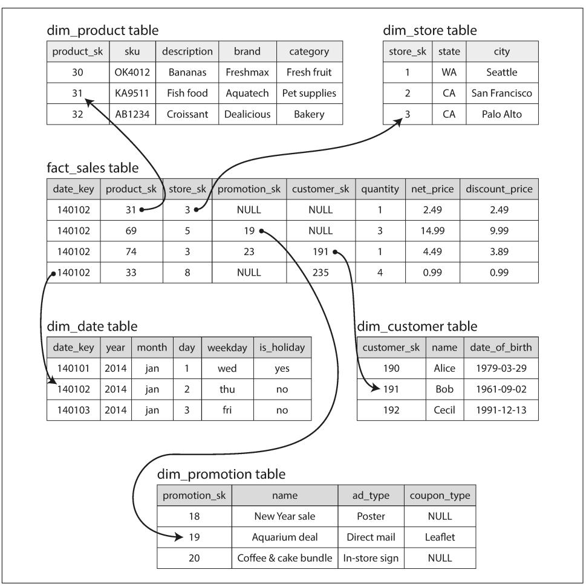

*Figure 3-9. Example of a star schema for use in a data warehouse.*

Usually, facts are captured as individual events, because this allows maximum flexi‐ bility of analysis later. However, this means that the fact table can become extremely large. A big enterprise like Apple, Walmart, or eBay may have tens of petabytes of transaction history in its data warehouse, most of which is in fact tables [\[56](#page-129-0)].

Some of the columns in the fact table are attributes, such as the price at which the product was sold and the cost of buying it from the supplier (allowing the profit mar‐ gin to be calculated). Other columns in the fact table are foreign key references to other tables, called *dimension tables*. As each row in the fact table represents an event, the dimensions represent the *who*, *what*, *where*, *when*, *how*, and *why* of the event.

For example, in Figure 3-9, one of the dimensions is the product that was sold. Each row in the dim\_product table represents one type of product that is for sale, including

<span id="page-116-0"></span>its stock-keeping unit (SKU), description, brand name, category, fat content, package size, etc. Each row in the fact\_sales table uses a foreign key to indicate which prod‐ uct was sold in that particular transaction. (For simplicity, if the customer buys sev‐ eral different products at once, they are represented as separate rows in the fact table.)

Even date and time are often represented using dimension tables, because this allows additional information about dates (such as public holidays) to be encoded, allowing queries to differentiate between sales on holidays and non-holidays.

The name "star schema" comes from the fact that when the table relationships are visualized, the fact table is in the middle, surrounded by its dimension tables; the connections to these tables are like the rays of a star.

A variation of this template is known as the *snowflake schema*, where dimensions are further broken down into subdimensions. For example, there could be separate tables for brands and product categories, and each row in the dim\_product table could ref‐ erence the brand and category as foreign keys, rather than storing them as strings in the dim\_product table. Snowflake schemas are more normalized than star schemas, but star schemas are often preferred because they are simpler for analysts to work with [[55\]](#page-129-0).

In a typical data warehouse, tables are often very wide: fact tables often have over 100 columns, sometimes several hundred [[51\]](#page-128-0). Dimension tables can also be very wide, as they include all the metadata that may be relevant for analysis—for example, the dim\_store table may include details of which services are offered at each store, whether it has an in-store bakery, the square footage, the date when the store was first opened, when it was last remodeled, how far it is from the nearest highway, etc.

## **Column-Oriented Storage**

If you have trillions of rows and petabytes of data in your fact tables, storing and querying them efficiently becomes a challenging problem. Dimension tables are usu‐ ally much smaller (millions of rows), so in this section we will concentrate primarily on storage of facts.

Although fact tables are often over 100 columns wide, a typical data warehouse query only accesses 4 or 5 of them at one time ("SELECT \*" queries are rarely needed for analytics) [[51\]](#page-128-0). Take the query in [Example 3-1:](#page-117-0) it accesses a large number of rows (every occurrence of someone buying fruit or candy during the 2013 calendar year), but it only needs to access three columns of the fact\_sales table: date\_key, product\_sk, and quantity. The query ignores all other columns.

<span id="page-117-0"></span>*Example 3-1. Analyzing whether people are more inclined to buy fresh fruit or candy, depending on the day of the week*

```
SELECT
 dim_date.weekday, dim_product.category,
 SUM(fact_sales.quantity) AS quantity_sold
FROM fact_sales
 JOIN dim_date ON fact_sales.date_key = dim_date.date_key
 JOIN dim_product ON fact_sales.product_sk = dim_product.product_sk
WHERE
 dim_date.year = 2013 AND
 dim_product.category IN ('Fresh fruit', 'Candy')
GROUP BY
 dim_date.weekday, dim_product.category;
```

How can we execute this query efficiently?

In most OLTP databases, storage is laid out in a *row-oriented* fashion: all the values from one row of a table are stored next to each other. Document databases are simi‐ lar: an entire document is typically stored as one contiguous sequence of bytes. You can see this in the CSV example of [Figure 3-1](#page-93-0).

In order to process a query like Example 3-1, you may have indexes on fact\_sales.date\_key and/or fact\_sales.product\_sk that tell the storage engine where to find all the sales for a particular date or for a particular product. But then, a row-oriented storage engine still needs to load all of those rows (each consisting of over 100 attributes) from disk into memory, parse them, and filter out those that don't meet the required conditions. That can take a long time.

The idea behind *column-oriented storage* is simple: don't store all the values from one row together, but store all the values from each *column* together instead. If each col‐ umn is stored in a separate file, a query only needs to read and parse those columns that are used in that query, which can save a lot of work. This principle is illustrated in [Figure 3-10](#page-118-0).


Column storage is easiest to understand in a relational data model, but it applies equally to nonrelational data. For example, Parquet [[57](#page-129-0)] is a columnar storage format that supports a document data model, based on Google's Dremel [[54](#page-129-0)].

<span id="page-118-0"></span>

| date_key | product_sk | store_sk | promotion_sk | customer_sk | quantity | net_price | discount_price |
|----------|------------|----------|--------------|-------------|----------|-----------|----------------|
| 140102   | 69         | 4        | NULL         | NULL        | 1        | 13.99     | 13.99          |
| 140102   | 69         | 5        | 19           | NULL        | 3        | 14.99     | 9.99           |
| 140102   | 69         | 5        | NULL         | 191         | 1        | 14.99     | 14.99          |
| 140102   | 74         | 3        | 23           | 202         | 5        | 0.99      | 0.89           |
| 140103   | 31         | 2        | NULL         | NULL        | 1        | 2.49      | 2.49           |
| 140103   | 31         | 3        | NULL         | NULL        | 3        | 14.99     | 9.99           |
| 140103   | 31         | 3        | 21           | 123         | 1        | 49.99     | 39.99          |
| 140103   | 31         | 8        | NULL         | 233         | 1        | 0.99      | 0.99           |

*Figure 3-10. Storing relational data by column, rather than by row.*

The column-oriented storage layout relies on each column file containing the rows in the same order. Thus, if you need to reassemble an entire row, you can take the 23rd entry from each of the individual column files and put them together to form the 23rd row of the table.

## **Column Compression**

Besides only loading those columns from disk that are required for a query, we can further reduce the demands on disk throughput by compressing data. Fortunately, column-oriented storage often lends itself very well to compression.

Take a look at the sequences of values for each column in Figure 3-10: they often look quite repetitive, which is a good sign for compression. Depending on the data in the column, different compression techniques can be used. One technique that is particu‐ larly effective in data warehouses is *bitmap encoding*, illustrated in [Figure 3-11.](#page-119-0)

<span id="page-119-0"></span>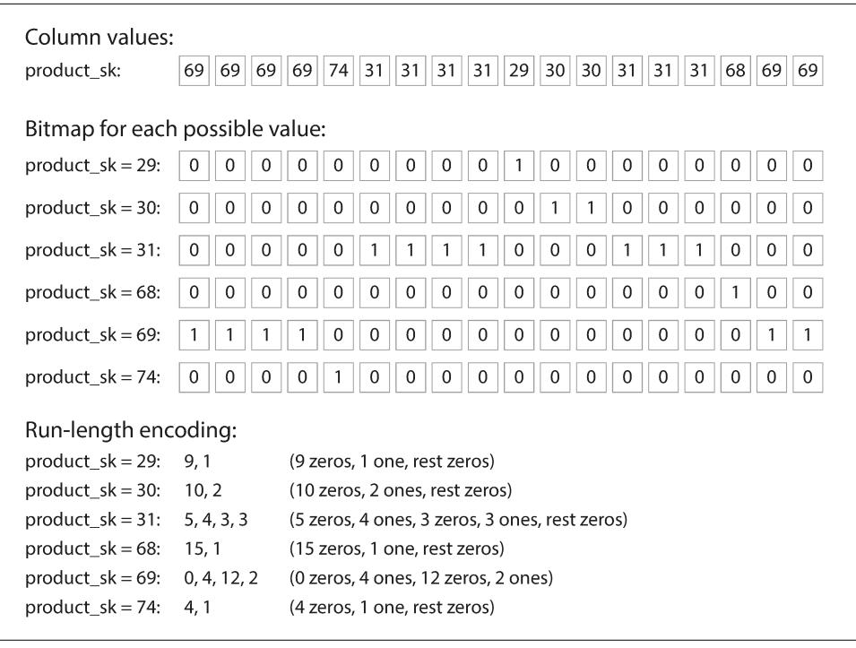

*Figure 3-11. Compressed, bitmap-indexed storage of a single column.*

Often, the number of distinct values in a column is small compared to the number of rows (for example, a retailer may have billions of sales transactions, but only 100,000 distinct products). We can now take a column with *n* distinct values and turn it into *n* separate bitmaps: one bitmap for each distinct value, with one bit for each row. The bit is 1 if the row has that value, and 0 if not.

If *n* is very small (for example, a *country* column may have approximately 200 dis‐ tinct values), those bitmaps can be stored with one bit per row. But if *n* is bigger, there will be a lot of zeros in most of the bitmaps (we say that they are *sparse*). In that case, the bitmaps can additionally be run-length encoded, as shown at the bottom of Figure 3-11. This can make the encoding of a column remarkably compact.

Bitmap indexes such as these are very well suited for the kinds of queries that are common in a data warehouse. For example:

```
WHERE product_sk IN (30, 68, 69):
```

Load the three bitmaps for product\_sk = 30, product\_sk = 68, and product\_sk = 69, and calculate the bitwise *OR* of the three bitmaps, which can be done very efficiently.

<span id="page-120-0"></span>WHERE product\_sk = 31 AND store\_sk = 3:

Load the bitmaps for product\_sk = 31 and store\_sk = 3, and calculate the bit‐ wise *AND*. This works because the columns contain the rows in the same order, so the *k*th bit in one column's bitmap corresponds to the same row as the *k*th bit in another column's bitmap.

There are also various other compression schemes for different kinds of data, but we won't go into them in detail—see [\[58](#page-129-0)] for an overview.


#### **Column-oriented storage and column families**

Cassandra and HBase have a concept of *column families*, which they inherited from Bigtable [[9](#page-126-0)]. However, it is very misleading to call them column-oriented: within each column family, they store all columns from a row together, along with a row key, and they do not use column compression. Thus, the Bigtable model is still mostly row-oriented.

## **Memory bandwidth and vectorized processing**

For data warehouse queries that need to scan over millions of rows, a big bottleneck is the bandwidth for getting data from disk into memory. However, that is not the only bottleneck. Developers of analytical databases also worry about efficiently using the bandwidth from main memory into the CPU cache, avoiding branch mispredic‐ tions and bubbles in the CPU instruction processing pipeline, and making use of single-instruction-multi-data (SIMD) instructions in modern CPUs [\[59](#page-129-0), [60\]](#page-129-0).

Besides reducing the volume of data that needs to be loaded from disk, columnoriented storage layouts are also good for making efficient use of CPU cycles. For example, the query engine can take a chunk of compressed column data that fits comfortably in the CPU's L1 cache and iterate through it in a tight loop (that is, with no function calls). A CPU can execute such a loop much faster than code that requires a lot of function calls and conditions for each record that is processed. Col‐ umn compression allows more rows from a column to fit in the same amount of L1 cache. Operators, such as the bitwise *AND* and *OR* described previously, can be designed to operate on such chunks of compressed column data directly. This techni‐ que is known as *vectorized processing* [\[58,](#page-129-0) [49](#page-128-0)].

## **Sort Order in Column Storage**

In a column store, it doesn't necessarily matter in which order the rows are stored. It's easiest to store them in the order in which they were inserted, since then inserting a new row just means appending to each of the column files. However, we can choose to impose an order, like we did with SSTables previously, and use that as an indexing mechanism.

<span id="page-121-0"></span>Note that it wouldn't make sense to sort each column independently, because then we would no longer know which items in the columns belong to the same row. We can only reconstruct a row because we know that the *k*th item in one column belongs to the same row as the *k*th item in another column.

Rather, the data needs to be sorted an entire row at a time, even though it is stored by column. The administrator of the database can choose the columns by which the table should be sorted, using their knowledge of common queries. For example, if queries often target date ranges, such as the last month, it might make sense to make date\_key the first sort key. Then the query optimizer can scan only the rows from the last month, which will be much faster than scanning all rows.

A second column can determine the sort order of any rows that have the same value in the first column. For example, if date\_key is the first sort key in [Figure 3-10,](#page-118-0) it might make sense for product\_sk to be the second sort key so that all sales for the same product on the same day are grouped together in storage. That will help queries that need to group or filter sales by product within a certain date range.

Another advantage of sorted order is that it can help with compression of columns. If the primary sort column does not have many distinct values, then after sorting, it will have long sequences where the same value is repeated many times in a row. A simple run-length encoding, like we used for the bitmaps in [Figure 3-11](#page-119-0), could compress that column down to a few kilobytes—even if the table has billions of rows.

That compression effect is strongest on the first sort key. The second and third sort keys will be more jumbled up, and thus not have such long runs of repeated values. Columns further down the sorting priority appear in essentially random order, so they probably won't compress as well. But having the first few columns sorted is still a win overall.

#### **Several different sort orders**

A clever extension of this idea was introduced in C-Store and adopted in the com‐ mercial data warehouse Vertica [\[61](#page-129-0), [62](#page-129-0)]. Different queries benefit from different sort orders, so why not store the same data sorted in *several different* ways? Data needs to be replicated to multiple machines anyway, so that you don't lose data if one machine fails. You might as well store that redundant data sorted in different ways so that when you're processing a query, you can use the version that best fits the query pattern.

Having multiple sort orders in a column-oriented store is a bit similar to having mul‐ tiple secondary indexes in a row-oriented store. But the big difference is that the roworiented store keeps every row in one place (in the heap file or a clustered index), and secondary indexes just contain pointers to the matching rows. In a column store, there normally aren't any pointers to data elsewhere, only columns containing values.

## <span id="page-122-0"></span>**Writing to Column-Oriented Storage**

These optimizations make sense in data warehouses, because most of the load con‐ sists of large read-only queries run by analysts. Column-oriented storage, compres‐ sion, and sorting all help to make those read queries faster. However, they have the downside of making writes more difficult.

An update-in-place approach, like B-trees use, is not possible with compressed col‐ umns. If you wanted to insert a row in the middle of a sorted table, you would most likely have to rewrite all the column files. As rows are identified by their position within a column, the insertion has to update all columns consistently.

Fortunately, we have already seen a good solution earlier in this chapter: LSM-trees. All writes first go to an in-memory store, where they are added to a sorted structure and prepared for writing to disk. It doesn't matter whether the in-memory store is row-oriented or column-oriented. When enough writes have accumulated, they are merged with the column files on disk and written to new files in bulk. This is essen‐ tially what Vertica does [[62\]](#page-129-0).

Queries need to examine both the column data on disk and the recent writes in mem‐ ory, and combine the two. However, the query optimizer hides this distinction from the user. From an analyst's point of view, data that has been modified with inserts, updates, or deletes is immediately reflected in subsequent queries.

## **Aggregation: Data Cubes and Materialized Views**

Not every data warehouse is necessarily a column store: traditional row-oriented databases and a few other architectures are also used. However, columnar storage can be significantly faster for ad hoc analytical queries, so it is rapidly gaining popularity [[51,](#page-128-0) [63\]](#page-129-0).

Another aspect of data warehouses that is worth mentioning briefly is *materialized aggregates*. As discussed earlier, data warehouse queries often involve an aggregate function, such as COUNT, SUM, AVG, MIN, or MAX in SQL. If the same aggregates are used by many different queries, it can be wasteful to crunch through the raw data every time. Why not cache some of the counts or sums that queries use most often?

One way of creating such a cache is a *materialized view*. In a relational data model, it is often defined like a standard (virtual) view: a table-like object whose contents are the results of some query. The difference is that a materialized view is an actual copy of the query results, written to disk, whereas a virtual view is just a shortcut for writ‐ ing queries. When you read from a virtual view, the SQL engine expands it into the view's underlying query on the fly and then processes the expanded query.

When the underlying data changes, a materialized view needs to be updated, because it is a denormalized copy of the data. The database can do that automatically, but <span id="page-123-0"></span>such updates make writes more expensive, which is why materialized views are not often used in OLTP databases. In read-heavy data warehouses they can make more sense (whether or not they actually improve read performance depends on the indi‐ vidual case).

A common special case of a materialized view is known as a *data cube* or *OLAP cube* [[64\]](#page-129-0). It is a grid of aggregates grouped by different dimensions. Figure 3-12 shows an example.

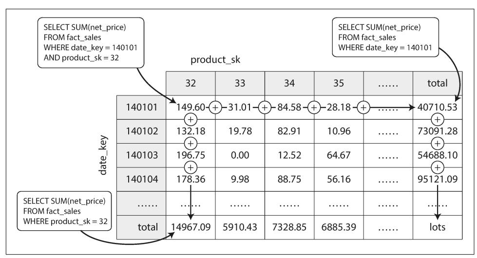

*Figure 3-12. Two dimensions of a data cube, aggregating data by summing.*

Imagine for now that each fact has foreign keys to only two dimension tables—in Figure 3-12, these are *date* and *product*. You can now draw a two-dimensional table, with dates along one axis and products along the other. Each cell contains the aggre‐ gate (e.g., SUM) of an attribute (e.g., net\_price) of all facts with that date-product combination. Then you can apply the same aggregate along each row or column and get a summary that has been reduced by one dimension (the sales by product regard‐ less of date, or the sales by date regardless of product).

In general, facts often have more than two dimensions. In [Figure 3-9](#page-115-0) there are five dimensions: date, product, store, promotion, and customer. It's a lot harder to imag‐ ine what a five-dimensional hypercube would look like, but the principle remains the same: each cell contains the sales for a particular date-product-store-promotioncustomer combination. These values can then repeatedly be summarized along each of the dimensions.

The advantage of a materialized data cube is that certain queries become very fast because they have effectively been precomputed. For example, if you want to know <span id="page-124-0"></span>the total sales per store yesterday, you just need to look at the totals along the appro‐ priate dimension—no need to scan millions of rows.

The disadvantage is that a data cube doesn't have the same flexibility as querying the raw data. For example, there is no way of calculating which proportion of sales comes from items that cost more than \$100, because the price isn't one of the dimensions. Most data warehouses therefore try to keep as much raw data as possible, and use aggregates such as data cubes only as a performance boost for certain queries.

## **Summary**

In this chapter we tried to get to the bottom of how databases handle storage and retrieval. What happens when you store data in a database, and what does the data‐ base do when you query for the data again later?

On a high level, we saw that storage engines fall into two broad categories: those opti‐ mized for transaction processing (OLTP), and those optimized for analytics (OLAP). There are big differences between the access patterns in those use cases:

- OLTP systems are typically user-facing, which means that they may see a huge volume of requests. In order to handle the load, applications usually only touch a small number of records in each query. The application requests records using some kind of key, and the storage engine uses an index to find the data for the requested key. Disk seek time is often the bottleneck here.
- Data warehouses and similar analytic systems are less well known, because they are primarily used by business analysts, not by end users. They handle a much lower volume of queries than OLTP systems, but each query is typically very demanding, requiring many millions of records to be scanned in a short time. Disk bandwidth (not seek time) is often the bottleneck here, and columnoriented storage is an increasingly popular solution for this kind of workload.

On the OLTP side, we saw storage engines from two main schools of thought:

- The log-structured school, which only permits appending to files and deleting obsolete files, but never updates a file that has been written. Bitcask, SSTables, LSM-trees, LevelDB, Cassandra, HBase, Lucene, and others belong to this group.
- The update-in-place school, which treats the disk as a set of fixed-size pages that can be overwritten. B-trees are the biggest example of this philosophy, being used in all major relational databases and also many nonrelational ones.

Log-structured storage engines are a comparatively recent development. Their key idea is that they systematically turn random-access writes into sequential writes on disk, which enables higher write throughput due to the performance characteristics of hard drives and SSDs.

<span id="page-125-0"></span>Finishing off the OLTP side, we did a brief tour through some more complicated indexing structures, and databases that are optimized for keeping all data in memory.

We then took a detour from the internals of storage engines to look at the high-level architecture of a typical data warehouse. This background illustrated why analytic workloads are so different from OLTP: when your queries require sequentially scan‐ ning across a large number of rows, indexes are much less relevant. Instead it becomes important to encode data very compactly, to minimize the amount of data that the query needs to read from disk. We discussed how column-oriented storage helps achieve this goal.

As an application developer, if you're armed with this knowledge about the internals of storage engines, you are in a much better position to know which tool is best suited for your particular application. If you need to adjust a database's tuning parameters, this understanding allows you to imagine what effect a higher or a lower value may have.

Although this chapter couldn't make you an expert in tuning any one particular stor‐ age engine, it has hopefully equipped you with enough vocabulary and ideas that you can make sense of the documentation for the database of your choice.

## **References**

- [[1\]](#page-93-0) Alfred V. Aho, John E. Hopcroft, and Jeffrey D. Ullman: *Data Structures and Algorithms*. Addison-Wesley, 1983. ISBN: 978-0-201-00023-8
- [[2\]](#page-93-0) Thomas H. Cormen, Charles E. Leiserson, Ronald L. Rivest, and Clifford Stein: *Introduction to Algorithms*, 3rd edition. MIT Press, 2009. ISBN: 978-0-262-53305-8
- [[3\]](#page-93-0) Justin Sheehy and David Smith: ["Bitcask: A Log-Structured Hash Table for Fast](http://basho.com/wp-content/uploads/2015/05/bitcask-intro.pdf) [Key/Value Data](http://basho.com/wp-content/uploads/2015/05/bitcask-intro.pdf)," Basho Technologies, April 2010.
- [[4\]](#page-96-0) Yinan Li, Bingsheng He, Robin Jun Yang, et al.: "[Tree Indexing on Solid State](http://www.vldb.org/pvldb/vldb2010/papers/R106.pdf) [Drives,](http://www.vldb.org/pvldb/vldb2010/papers/R106.pdf)" *Proceedings of the VLDB Endowment*, volume 3, number 1, pages 1195–1206, September 2010.
- [[5\]](#page-96-0) Goetz Graefe: "[Modern B-Tree Techniques,](http://citeseerx.ist.psu.edu/viewdoc/download?doi=10.1.1.219.7269&rep=rep1&type=pdf)" *Foundations and Trends in Data‐ bases*, volume 3, number 4, pages 203–402, August 2011. [doi:10.1561/1900000028](http://dx.doi.org/10.1561/1900000028)
- [[6\]](#page-99-0) Jeffrey Dean and Sanjay Ghemawat: ["LevelDB Implementation Notes,](https://github.com/google/leveldb/blob/master/doc/impl.html)" *lev‐ eldb.googlecode.com*.
- [[7\]](#page-99-0) Dhruba Borthakur: ["The History of RocksDB,](http://rocksdb.blogspot.com/)" *rocksdb.blogspot.com*, November 24, 2013.
- [[8\]](#page-99-0) Matteo Bertozzi: "[Apache HBase I/O HFile](http://blog.cloudera.com/blog/2012/06/hbase-io-hfile-input-output/)," *blog.cloudera.com*, June, 29 2012.

- <span id="page-126-0"></span>[[9\]](#page-99-0) Fay Chang, Jeffrey Dean, Sanjay Ghemawat, et al.: ["Bigtable: A Distributed Stor‐](http://research.google.com/archive/bigtable.html) [age System for Structured Data,](http://research.google.com/archive/bigtable.html)" at *7th USENIX Symposium on Operating System Design and Implementation* (OSDI), November 2006.
- [[10\]](#page-99-0) Patrick O'Neil, Edward Cheng, Dieter Gawlick, and Elizabeth O'Neil: ["The Log-](http://www.cs.umb.edu/~poneil/lsmtree.pdf)[Structured Merge-Tree \(LSM-Tree\),](http://www.cs.umb.edu/~poneil/lsmtree.pdf)" *Acta Informatica*, volume 33, number 4, pages 351–385, June 1996. [doi:10.1007/s002360050048](http://dx.doi.org/10.1007/s002360050048)
- [[11\]](#page-100-0) Mendel Rosenblum and John K. Ousterhout: ["The Design and Implementation](http://research.cs.wisc.edu/areas/os/Qual/papers/lfs.pdf) [of a Log-Structured File System,](http://research.cs.wisc.edu/areas/os/Qual/papers/lfs.pdf)" *ACM Transactions on Computer Systems*, volume 10, number 1, pages 26–52, February 1992. [doi:10.1145/146941.146943](http://dx.doi.org/10.1145/146941.146943)
- [[12\]](#page-100-0) Adrien Grand: "[What Is in a Lucene Index?](http://www.slideshare.net/lucenerevolution/what-is-inaluceneagrandfinal)," at *Lucene/Solr Revolution*, Novem‐ ber 14, 2013.
- [[13\]](#page-100-0) Deepak Kandepet: "[Hacking Lucene—The Index Format](http://hackerlabs.github.io/blog/2011/10/01/hacking-lucene-the-index-format/index.html)," *hackerlabs.org*, Octo‐ ber 1, 2011.
- [[14\]](#page-100-0) Michael McCandless: "[Visualizing Lucene's Segment Merges](http://blog.mikemccandless.com/2011/02/visualizing-lucenes-segment-merges.html)," *blog.mikemccand‐ less.com*, February 11, 2011.
- [[15\]](#page-100-0) Burton H. Bloom: "[Space/Time Trade-offs in Hash Coding with Allowable](http://www.cs.upc.edu/~diaz/p422-bloom.pdf) [Errors,](http://www.cs.upc.edu/~diaz/p422-bloom.pdf)" *Communications of the ACM*, volume 13, number 7, pages 422–426, July 1970. [doi:10.1145/362686.362692](http://dx.doi.org/10.1145/362686.362692)
- [[16\]](#page-100-0) "[Operating Cassandra: Compaction](https://cassandra.apache.org/doc/latest/operating/compaction.html)," Apache Cassandra Documentation v4.0, 2016.
- [[17\]](#page-101-0) Rudolf Bayer and Edward M. McCreight: "[Organization and Maintenance of](http://www.dtic.mil/cgi-bin/GetTRDoc?AD=AD0712079) [Large Ordered Indices,](http://www.dtic.mil/cgi-bin/GetTRDoc?AD=AD0712079)" Boeing Scientific Research Laboratories, Mathematical and Information Sciences Laboratory, report no. 20, July 1970.
- [[18\]](#page-101-0) Douglas Comer: ["The Ubiquitous B-Tree,](http://citeseerx.ist.psu.edu/viewdoc/download?doi=10.1.1.96.6637&rep=rep1&type=pdf)" *ACM Computing Surveys*, volume 11, number 2, pages 121–137, June 1979. [doi:10.1145/356770.356776](http://dx.doi.org/10.1145/356770.356776)
- [[19\]](#page-103-0) Emmanuel Goossaert: ["Coding for SSDs](http://codecapsule.com/2014/02/12/coding-for-ssds-part-1-introduction-and-table-of-contents/)," *codecapsule.com*, February 12, 2014.
- [[20\]](#page-103-0) C. Mohan and Frank Levine: "[ARIES/IM: An Efficient and High Concurrency](http://www.ics.uci.edu/~cs223/papers/p371-mohan.pdf) [Index Management Method Using Write-Ahead Logging,](http://www.ics.uci.edu/~cs223/papers/p371-mohan.pdf)" at *ACM International Conference on Management of Data* (SIGMOD), June 1992. [doi:](http://dx.doi.org/10.1145/130283.130338) [10.1145/130283.130338](http://dx.doi.org/10.1145/130283.130338)
- [[21\]](#page-103-0) Howard Chu: "[LDAP at Lightning Speed,](https://buildstuff14.sched.com/event/08a1a368e272eb599a52e08b4c3c779d)" at *Build Stuff '14*, November 2014.
- [[22\]](#page-104-0) Bradley C. Kuszmaul: ["A Comparison of Fractal Trees to Log-Structured Merge](http://insideanalysis.com/wp-content/uploads/2014/08/Tokutek_lsm-vs-fractal.pdf) [\(LSM\) Trees,](http://insideanalysis.com/wp-content/uploads/2014/08/Tokutek_lsm-vs-fractal.pdf)" *tokutek.com*, April 22, 2014.
- [[23\]](#page-104-0) Manos Athanassoulis, Michael S. Kester, Lukas M. Maas, et al.: ["Designing](http://openproceedings.org/2016/conf/edbt/paper-12.pdf) [Access Methods: The RUM Conjecture,](http://openproceedings.org/2016/conf/edbt/paper-12.pdf)" at *19th International Conference on Extend‐ ing Database Technology* (EDBT), March 2016. [doi:10.5441/002/edbt.2016.42](http://dx.doi.org/10.5441/002/edbt.2016.42)

- <span id="page-127-0"></span>[[24\]](#page-105-0) Peter Zaitsev: ["Innodb Double Write,](https://www.percona.com/blog/2006/08/04/innodb-double-write/)" *percona.com*, August 4, 2006.
- [[25\]](#page-105-0) Tomas Vondra: "[On the Impact of Full-Page Writes,](http://blog.2ndquadrant.com/on-the-impact-of-full-page-writes/)" *blog.2ndquadrant.com*, November 23, 2016.
- [[26\]](#page-105-0) Mark Callaghan: ["The Advantages of an LSM vs a B-Tree,](http://smalldatum.blogspot.co.uk/2016/01/summary-of-advantages-of-lsm-vs-b-tree.html)" *smalldatum.blog‐ spot.co.uk*, January 19, 2016.
- [[27\]](#page-105-0) Mark Callaghan: ["Choosing Between Efficiency and Performance with](http://www.codemesh.io/codemesh/mark-callaghan) [RocksDB](http://www.codemesh.io/codemesh/mark-callaghan)," at *Code Mesh*, November 4, 2016.
- [[28\]](#page-106-0) Michi Mutsuzaki: "[MySQL vs. LevelDB](https://github.com/m1ch1/mapkeeper/wiki/MySQL-vs.-LevelDB)," *github.com*, August 2011.
- [[29\]](#page-106-0) Benjamin Coverston, Jonathan Ellis, et al.: "[CASSANDRA-1608: Redesigned](https://issues.apache.org/jira/browse/CASSANDRA-1608) [Compaction,](https://issues.apache.org/jira/browse/CASSANDRA-1608) *issues.apache.org*, July 2011.
- [[30\]](#page-106-0) Igor Canadi, Siying Dong, and Mark Callaghan: ["RocksDB Tuning Guide](https://github.com/facebook/rocksdb/wiki/RocksDB-Tuning-Guide)," *git‐ hub.com*, 2016.
- [[31\]](#page-107-0) *[MySQL 5.7 Reference Manual](http://dev.mysql.com/doc/refman/5.7/en/index.html)*. Oracle, 2014.
- [[32\]](#page-107-0) *[Books Online for SQL Server 2012](http://msdn.microsoft.com/en-us/library/ms130214.aspx)*. Microsoft, 2012.
- [[33\]](#page-107-0) Joe Webb: "[Using Covering Indexes to Improve Query Performance](https://www.simple-talk.com/sql/learn-sql-server/using-covering-indexes-to-improve-query-performance/)," *simpletalk.com*, 29 September 2008.
- [[34\]](#page-108-0) Frank Ramsak, Volker Markl, Robert Fenk, et al.: ["Integrating the UB-Tree into](http://www.vldb.org/conf/2000/P263.pdf) [a Database System Kernel,](http://www.vldb.org/conf/2000/P263.pdf)" at *26th International Conference on Very Large Data Bases* (VLDB), September 2000.
- [[35\]](#page-108-0) The PostGIS Development Group: "[PostGIS 2.1.2dev Manual](http://postgis.net/docs/manual-2.1/)," *postgis.net*, 2014.
- [[36\]](#page-109-0) Robert Escriva, Bernard Wong, and Emin Gün Sirer: ["HyperDex: A Distributed,](http://www.cs.princeton.edu/courses/archive/fall13/cos518/papers/hyperdex.pdf) [Searchable Key-Value Store,](http://www.cs.princeton.edu/courses/archive/fall13/cos518/papers/hyperdex.pdf)" at *ACM SIGCOMM Conference*, August 2012. [doi:](http://dx.doi.org/10.1145/2377677.2377681) [10.1145/2377677.2377681](http://dx.doi.org/10.1145/2377677.2377681)
- [[37\]](#page-109-0) Michael McCandless: "[Lucene's FuzzyQuery Is 100 Times Faster in 4.0](http://blog.mikemccandless.com/2011/03/lucenes-fuzzyquery-is-100-times-faster.html)," *blog.mikemccandless.com*, March 24, 2011.
- [[38\]](#page-109-0) Steffen Heinz, Justin Zobel, and Hugh E. Williams: "[Burst Tries: A Fast, Efficient](http://citeseer.ist.psu.edu/viewdoc/summary?doi=10.1.1.18.3499) [Data Structure for String Keys](http://citeseer.ist.psu.edu/viewdoc/summary?doi=10.1.1.18.3499)," *ACM Transactions on Information Systems*, volume 20, number 2, pages 192–223, April 2002. [doi:10.1145/506309.506312](http://dx.doi.org/10.1145/506309.506312)
- [[39\]](#page-109-0) Klaus U. Schulz and Stoyan Mihov: "[Fast String Correction with Levenshtein](http://citeseerx.ist.psu.edu/viewdoc/summary?doi=10.1.1.16.652) [Automata](http://citeseerx.ist.psu.edu/viewdoc/summary?doi=10.1.1.16.652)," *International Journal on Document Analysis and Recognition*, volume 5, number 1, pages 67–85, November 2002. [doi:10.1007/s10032-002-0082-8](http://dx.doi.org/10.1007/s10032-002-0082-8)
- [[40\]](#page-109-0) Christopher D. Manning, Prabhakar Raghavan, and Hinrich Schütze: *[Introduc‐](http://nlp.stanford.edu/IR-book/) [tion to Information Retrieval](http://nlp.stanford.edu/IR-book/)*. Cambridge University Press, 2008. ISBN: 978-0-521-86571-5, available online at *nlp.stanford.edu/IR-book*

- <span id="page-128-0"></span>[[41\]](#page-110-0) Michael Stonebraker, Samuel Madden, Daniel J. Abadi, et al.: ["The End of an](http://citeseerx.ist.psu.edu/viewdoc/download?doi=10.1.1.137.3697&rep=rep1&type=pdf) [Architectural Era \(It's Time for a Complete Rewrite\)](http://citeseerx.ist.psu.edu/viewdoc/download?doi=10.1.1.137.3697&rep=rep1&type=pdf)," at *33rd International Confer‐ ence on Very Large Data Bases* (VLDB), September 2007.
- [[42\]](#page-110-0) "[VoltDB Technical Overview White Paper](https://www.voltdb.com/wptechnicaloverview)," VoltDB, 2014.
- [[43\]](#page-110-0) Stephen M. Rumble, Ankita Kejriwal, and John K. Ousterhout: "[Log-Structured](https://www.usenix.org/system/files/conference/fast14/fast14-paper_rumble.pdf) [Memory for DRAM-Based Storage](https://www.usenix.org/system/files/conference/fast14/fast14-paper_rumble.pdf)," at *12th USENIX Conference on File and Storage Technologies* (FAST), February 2014.
- [[44\]](#page-110-0) Stavros Harizopoulos, Daniel J. Abadi, Samuel Madden, and Michael Stone‐ braker: "[OLTP Through the Looking Glass, and What We Found There](http://hstore.cs.brown.edu/papers/hstore-lookingglass.pdf)," at *ACM International Conference on Management of Data* (SIGMOD), June 2008. [doi:](http://dx.doi.org/10.1145/1376616.1376713) [10.1145/1376616.1376713](http://dx.doi.org/10.1145/1376616.1376713)
- [[45\]](#page-110-0) Justin DeBrabant, Andrew Pavlo, Stephen Tu, et al.: "[Anti-Caching: A New](http://www.vldb.org/pvldb/vol6/p1942-debrabant.pdf) [Approach to Database Management System Architecture,](http://www.vldb.org/pvldb/vol6/p1942-debrabant.pdf)" *Proceedings of the VLDB Endowment*, volume 6, number 14, pages 1942–1953, September 2013.
- [[46\]](#page-111-0) Joy Arulraj, Andrew Pavlo, and Subramanya R. Dulloor: "[Let's Talk About Stor‐](http://www.pdl.cmu.edu/PDL-FTP/NVM/storage.pdf) [age & Recovery Methods for Non-Volatile Memory Database Systems](http://www.pdl.cmu.edu/PDL-FTP/NVM/storage.pdf)," at *ACM International Conference on Management of Data* (SIGMOD), June 2015. [doi:](http://dx.doi.org/10.1145/2723372.2749441) [10.1145/2723372.2749441](http://dx.doi.org/10.1145/2723372.2749441)
- [[47\]](#page-112-0) Edgar F. Codd, S. B. Codd, and C. T. Salley: "[Providing OLAP to User-Analysts:](http://www.minet.uni-jena.de/dbis/lehre/ss2005/sem_dwh/lit/Cod93.pdf) [An IT Mandate](http://www.minet.uni-jena.de/dbis/lehre/ss2005/sem_dwh/lit/Cod93.pdf)," E. F. Codd Associates, 1993.
- [[48\]](#page-113-0) Surajit Chaudhuri and Umeshwar Dayal: ["An Overview of Data Warehousing](https://www.microsoft.com/en-us/research/wp-content/uploads/2016/02/sigrecord.pdf) [and OLAP Technology](https://www.microsoft.com/en-us/research/wp-content/uploads/2016/02/sigrecord.pdf)," *ACM SIGMOD Record*, volume 26, number 1, pages 65–74, March 1997. [doi:10.1145/248603.248616](http://dx.doi.org/10.1145/248603.248616)
- [[49\]](#page-114-0) Per-Åke Larson, Cipri Clinciu, Campbell Fraser, et al.: "[Enhancements to SQL](http://research.microsoft.com/pubs/193599/Apollo3%20-%20Sigmod%202013%20-%20final.pdf) [Server Column Stores](http://research.microsoft.com/pubs/193599/Apollo3%20-%20Sigmod%202013%20-%20final.pdf)," at *ACM International Conference on Management of Data* (SIGMOD), June 2013.
- [[50\]](#page-114-0) Franz Färber, Norman May, Wolfgang Lehner, et al.: ["The SAP HANA Database](http://sites.computer.org/debull/A12mar/hana.pdf) [– An Architecture Overview](http://sites.computer.org/debull/A12mar/hana.pdf)," *IEEE Data Engineering Bulletin*, volume 35, number 1, pages 28–33, March 2012.
- [[51\]](#page-114-0) Michael Stonebraker: ["The Traditional RDBMS Wisdom Is \(Almost Certainly\)](http://slideshot.epfl.ch/talks/166) [All Wrong](http://slideshot.epfl.ch/talks/166)," presentation at *EPFL*, May 2013.
- [[52\]](#page-114-0) Daniel J. Abadi: "[Classifying the SQL-on-Hadoop Solutions](https://web.archive.org/web/20150622074951/http://hadapt.com/blog/2013/10/02/classifying-the-sql-on-hadoop-solutions/)," *hadapt.com*, Octo‐ ber 2, 2013.
- [[53\]](#page-114-0) Marcel Kornacker, Alexander Behm, Victor Bittorf, et al.: ["Impala: A Modern,](http://pandis.net/resources/cidr15impala.pdf) [Open-Source SQL Engine for Hadoop,](http://pandis.net/resources/cidr15impala.pdf)" at *7th Biennial Conference on Innovative Data Systems Research* (CIDR), January 2015.

- <span id="page-129-0"></span>[[54\]](#page-114-0) Sergey Melnik, Andrey Gubarev, Jing Jing Long, et al.: "[Dremel: Interactive](http://research.google.com/pubs/pub36632.html) [Analysis of Web-Scale Datasets,](http://research.google.com/pubs/pub36632.html)" at *36th International Conference on Very Large Data Bases* (VLDB), pages 330–339, September 2010.
- [[55\]](#page-114-0) Ralph Kimball and Margy Ross: *The Data Warehouse Toolkit: The Definitive Guide to Dimensional Modeling*, 3rd edition. John Wiley & Sons, July 2013. ISBN: 978-1-118-53080-1
- [[56\]](#page-115-0) Derrick Harris: ["Why Apple, eBay, and Walmart Have Some of the Biggest Data](http://gigaom.com/2013/03/27/why-apple-ebay-and-walmart-have-some-of-the-biggest-data-warehouses-youve-ever-seen/) [Warehouses You've Ever Seen](http://gigaom.com/2013/03/27/why-apple-ebay-and-walmart-have-some-of-the-biggest-data-warehouses-youve-ever-seen/)," *gigaom.com*, March 27, 2013.
- [[57\]](#page-117-0) Julien Le Dem: "[Dremel Made Simple with Parquet,](https://blog.twitter.com/2013/dremel-made-simple-with-parquet)" *blog.twitter.com*, Septem‐ ber 11, 2013.
- [[58\]](#page-120-0) Daniel J. Abadi, Peter Boncz, Stavros Harizopoulos, et al.: ["The Design and](http://cs-www.cs.yale.edu/homes/dna/papers/abadi-column-stores.pdf) [Implementation of Modern Column-Oriented Database Systems,](http://cs-www.cs.yale.edu/homes/dna/papers/abadi-column-stores.pdf)" *Foundations and Trends in Databases*, volume 5, number 3, pages 197–280, December 2013. [doi:](http://dx.doi.org/10.1561/1900000024) [10.1561/1900000024](http://dx.doi.org/10.1561/1900000024)
- [[59\]](#page-120-0) Peter Boncz, Marcin Zukowski, and Niels Nes: ["MonetDB/X100: Hyper-](http://www.cidrdb.org/cidr2005/papers/P19.pdf)[Pipelining Query Execution](http://www.cidrdb.org/cidr2005/papers/P19.pdf)," at *2nd Biennial Conference on Innovative Data Systems Research* (CIDR), January 2005.
- [[60\]](#page-120-0) Jingren Zhou and Kenneth A. Ross: ["Implementing Database Operations Using](http://www1.cs.columbia.edu/~kar/pubsk/simd.pdf) [SIMD Instructions,](http://www1.cs.columbia.edu/~kar/pubsk/simd.pdf)" at *ACM International Conference on Management of Data* (SIG‐ MOD), pages 145–156, June 2002. [doi:10.1145/564691.564709](http://dx.doi.org/10.1145/564691.564709)
- [[61\]](#page-121-0) Michael Stonebraker, Daniel J. Abadi, Adam Batkin, et al.: "[C-Store: A Column](http://www.vldb2005.org/program/paper/thu/p553-stonebraker.pdf)[oriented DBMS](http://www.vldb2005.org/program/paper/thu/p553-stonebraker.pdf)," at *31st International Conference on Very Large Data Bases* (VLDB), pages 553–564, September 2005.
- [[62\]](#page-121-0) Andrew Lamb, Matt Fuller, Ramakrishna Varadarajan, et al.: "[The Vertica Ana‐](http://vldb.org/pvldb/vol5/p1790_andrewlamb_vldb2012.pdf) [lytic Database: C-Store 7 Years Later](http://vldb.org/pvldb/vol5/p1790_andrewlamb_vldb2012.pdf)," *Proceedings of the VLDB Endowment*, volume 5, number 12, pages 1790–1801, August 2012.
- [[63\]](#page-122-0) Julien Le Dem and Nong Li: "[Efficient Data Storage for Analytics with Apache](http://www.slideshare.net/julienledem/th-210pledem) [Parquet 2.0,](http://www.slideshare.net/julienledem/th-210pledem)" at *Hadoop Summit*, San Jose, June 2014.
- [[64\]](#page-123-0) Jim Gray, Surajit Chaudhuri, Adam Bosworth, et al.: ["Data Cube: A Relational](http://arxiv.org/pdf/cs/0701155.pdf) [Aggregation Operator Generalizing Group-By, Cross-Tab, and Sub-Totals,](http://arxiv.org/pdf/cs/0701155.pdf)" *Data Mining and Knowledge Discovery*, volume 1, number 1, pages 29–53, March 2007. [doi:10.1023/A:1009726021843](http://dx.doi.org/10.1023/A:1009726021843)

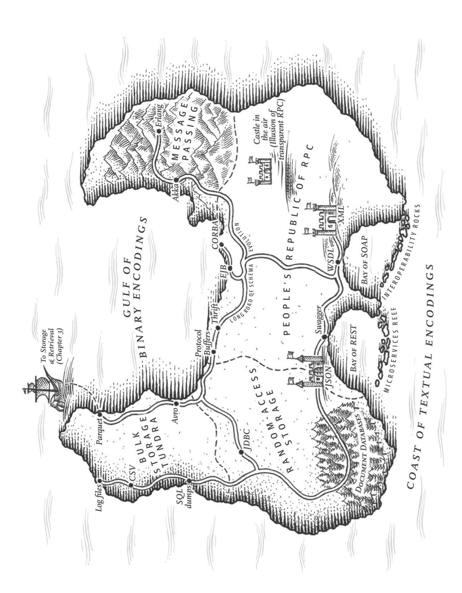

# **Encoding and Evolution**

<span id="page-132-0"></span>*Everything changes and nothing stands still.*

—Heraclitus of Ephesus, as quoted by Plato in *Cratylus* (360 BCE)

Applications inevitably change over time. Features are added or modified as new products are launched, user requirements become better understood, or business cir‐ cumstances change. In [Chapter 1](#page-24-0) we introduced the idea of *evolvability*: we should aim to build systems that make it easy to adapt to change (see ["Evolvability: Making](#page-42-0) [Change Easy" on page 21\)](#page-42-0).

In most cases, a change to an application's features also requires a change to data that it stores: perhaps a new field or record type needs to be captured, or perhaps existing data needs to be presented in a new way.

The data models we discussed in [Chapter 2](#page-48-0) have different ways of coping with such change. Relational databases generally assume that all data in the database conforms to one schema: although that schema can be changed (through schema migrations; i.e., ALTER statements), there is exactly one schema in force at any one point in time. By contrast, schema-on-read ("schemaless") databases don't enforce a schema, so the database can contain a mixture of older and newer data formats written at different times (see ["Schema flexibility in the document model" on page 39\)](#page-60-0).

When a data format or schema changes, a corresponding change to application code often needs to happen (for example, you add a new field to a record, and the applica‐ tion code starts reading and writing that field). However, in a large application, code changes often cannot happen instantaneously:

- <span id="page-133-0"></span>• With server-side applications you may want to perform a *rolling upgrade* (also known as a *staged rollout*), deploying the new version to a few nodes at a time, checking whether the new version is running smoothly, and gradually working your way through all the nodes. This allows new versions to be deployed without service downtime, and thus encourages more frequent releases and better evolva‐ bility.
- With client-side applications you're at the mercy of the user, who may not install the update for some time.

This means that old and new versions of the code, and old and new data formats, may potentially all coexist in the system at the same time. In order for the system to continue running smoothly, we need to maintain compatibility in both directions:

#### *Backward compatibility*

Newer code can read data that was written by older code.

## *Forward compatibility*

Older code can read data that was written by newer code.

Backward compatibility is normally not hard to achieve: as author of the newer code, you know the format of data written by older code, and so you can explicitly handle it (if necessary by simply keeping the old code to read the old data). Forward compati‐ bility can be trickier, because it requires older code to ignore additions made by a newer version of the code.

In this chapter we will look at several formats for encoding data, including JSON, XML, Protocol Buffers, Thrift, and Avro. In particular, we will look at how they han‐ dle schema changes and how they support systems where old and new data and code need to coexist. We will then discuss how those formats are used for data storage and for communication: in web services, Representational State Transfer (REST), and remote procedure calls (RPC), as well as message-passing systems such as actors and message queues.

## **Formats for Encoding Data**

Programs usually work with data in (at least) two different representations:

- 1. In memory, data is kept in objects, structs, lists, arrays, hash tables, trees, and so on. These data structures are optimized for efficient access and manipulation by the CPU (typically using pointers).
- 2. When you want to write data to a file or send it over the network, you have to encode it as some kind of self-contained sequence of bytes (for example, a JSON document). Since a pointer wouldn't make sense to any other process, this

<span id="page-134-0"></span>sequence-of-bytes representation looks quite different from the data structures that are normally used in memory.<sup>i</sup>

Thus, we need some kind of translation between the two representations. The trans‐ lation from the in-memory representation to a byte sequence is called *encoding* (also known as *serialization* or *marshalling*), and the reverse is called *decoding* (*parsing*, *deserialization*, *unmarshalling*).ii


#### **Terminology clash**

*Serialization* is unfortunately also used in the context of transac‐ tions (see [Chapter 7](#page-242-0)), with a completely different meaning. To avoid overloading the word we'll stick with *encoding* in this book, even though *serialization* is perhaps a more common term.

As this is such a common problem, there are a myriad different libraries and encod‐ ing formats to choose from. Let's do a brief overview.

## **Language-Specific Formats**

Many programming languages come with built-in support for encoding in-memory objects into byte sequences. For example, Java has java.io.Serializable [[1\]](#page-161-0), Ruby has Marshal [[2\]](#page-161-0), Python has pickle [\[3](#page-161-0)], and so on. Many third-party libraries also exist, such as Kryo for Java [[4\]](#page-161-0).

These encoding libraries are very convenient, because they allow in-memory objects to be saved and restored with minimal additional code. However, they also have a number of deep problems:

- The encoding is often tied to a particular programming language, and reading the data in another language is very difficult. If you store or transmit data in such an encoding, you are committing yourself to your current programming lan‐ guage for potentially a very long time, and precluding integrating your systems with those of other organizations (which may use different languages).
- In order to restore data in the same object types, the decoding process needs to be able to instantiate arbitrary classes. This is frequently a source of security problems [\[5](#page-161-0)]: if an attacker can get your application to decode an arbitrary byte sequence, they can instantiate arbitrary classes, which in turn often allows them to do terrible things such as remotely executing arbitrary code [[6, 7](#page-161-0)].

i. With the exception of some special cases, such as certain memory-mapped files or when operating directly on compressed data (as described in ["Column Compression" on page 97\)](#page-118-0).

ii. Note that *encoding* has nothing to do with *encryption*. We don't discuss encryption in this book.

- <span id="page-135-0"></span>• Versioning data is often an afterthought in these libraries: as they are intended for quick and easy encoding of data, they often neglect the inconvenient prob‐ lems of forward and backward compatibility.
- Efficiency (CPU time taken to encode or decode, and the size of the encoded structure) is also often an afterthought. For example, Java's built-in serialization is notorious for its bad performance and bloated encoding [[8\]](#page-161-0).

For these reasons it's generally a bad idea to use your language's built-in encoding for anything other than very transient purposes.

## **JSON, XML, and Binary Variants**

Moving to standardized encodings that can be written and read by many program‐ ming languages, JSON and XML are the obvious contenders. They are widely known, widely supported, and almost as widely disliked. XML is often criticized for being too verbose and unnecessarily complicated [\[9\]](#page-162-0). JSON's popularity is mainly due to its built-in support in web browsers (by virtue of being a subset of JavaScript) and sim‐ plicity relative to XML. CSV is another popular language-independent format, albeit less powerful.

JSON, XML, and CSV are textual formats, and thus somewhat human-readable (although the syntax is a popular topic of debate). Besides the superficial syntactic issues, they also have some subtle problems:

- There is a lot of ambiguity around the encoding of numbers. In XML and CSV, you cannot distinguish between a number and a string that happens to consist of digits (except by referring to an external schema). JSON distinguishes strings and numbers, but it doesn't distinguish integers and floating-point numbers, and it doesn't specify a precision.
  - This is a problem when dealing with large numbers; for example, integers greater than 253 cannot be exactly represented in an IEEE 754 double-precision floatingpoint number, so such numbers become inaccurate when parsed in a language that uses floating-point numbers (such as JavaScript). An example of numbers larger than 2<sup>53</sup> occurs on Twitter, which uses a 64-bit number to identify each tweet. The JSON returned by Twitter's API includes tweet IDs twice, once as a JSON number and once as a decimal string, to work around the fact that the numbers are not correctly parsed by JavaScript applications [\[10](#page-162-0)].
- JSON and XML have good support for Unicode character strings (i.e., humanreadable text), but they don't support binary strings (sequences of bytes without a character encoding). Binary strings are a useful feature, so people get around this limitation by encoding the binary data as text using Base64. The schema is then used to indicate that the value should be interpreted as Base64-encoded. This works, but it's somewhat hacky and increases the data size by 33%.

- <span id="page-136-0"></span>• There is optional schema support for both XML [\[11](#page-162-0)] and JSON [\[12\]](#page-162-0). These schema languages are quite powerful, and thus quite complicated to learn and implement. Use of XML schemas is fairly widespread, but many JSON-based tools don't bother using schemas. Since the correct interpretation of data (such as numbers and binary strings) depends on information in the schema, applica‐ tions that don't use XML/JSON schemas need to potentially hardcode the appro‐ priate encoding/decoding logic instead.
- CSV does not have any schema, so it is up to the application to define the mean‐ ing of each row and column. If an application change adds a new row or column, you have to handle that change manually. CSV is also a quite vague format (what happens if a value contains a comma or a newline character?). Although its escaping rules have been formally specified [[13\]](#page-162-0), not all parsers implement them correctly.

Despite these flaws, JSON, XML, and CSV are good enough for many purposes. It's likely that they will remain popular, especially as data interchange formats (i.e., for sending data from one organization to another). In these situations, as long as people agree on what the format is, it often doesn't matter how pretty or efficient the format is. The difficulty of getting different organizations to agree on *anything* outweighs most other concerns.

## **Binary encoding**

For data that is used only internally within your organization, there is less pressure to use a lowest-common-denominator encoding format. For example, you could choose a format that is more compact or faster to parse. For a small dataset, the gains are negligible, but once you get into the terabytes, the choice of data format can have a big impact.

JSON is less verbose than XML, but both still use a lot of space compared to binary formats. This observation led to the development of a profusion of binary encodings for JSON (MessagePack, BSON, BJSON, UBJSON, BISON, and Smile, to name a few) and for XML (WBXML and Fast Infoset, for example). These formats have been adopted in various niches, but none of them are as widely adopted as the textual ver‐ sions of JSON and XML.

Some of these formats extend the set of datatypes (e.g., distinguishing integers and floating-point numbers, or adding support for binary strings), but otherwise they keep the JSON/XML data model unchanged. In particular, since they don't prescribe a schema, they need to include all the object field names within the encoded data. That is, in a binary encoding of the JSON document in [Example 4-1,](#page-137-0) they will need to include the strings userName, favoriteNumber, and interests somewhere.

<span id="page-137-0"></span>*Example 4-1. Example record which we will encode in several binary formats in this chapter*

```
{
 "userName": "Martin",
 "favoriteNumber": 1337,
 "interests": ["daydreaming", "hacking"]
}
```

Let's look at an example of MessagePack, a binary encoding for JSON. [Figure 4-1](#page-138-0) shows the byte sequence that you get if you encode the JSON document in Example 4-1 with MessagePack [\[14](#page-162-0)]. The first few bytes are as follows:

- 1. The first byte, 0x83, indicates that what follows is an object (top four bits = 0x80) with three fields (bottom four bits = 0x03). (In case you're wondering what hap‐ pens if an object has more than 15 fields, so that the number of fields doesn't fit in four bits, it then gets a different type indicator, and the number of fields is encoded in two or four bytes.)
- 2. The second byte, 0xa8, indicates that what follows is a string (top four bits = 0xa0) that is eight bytes long (bottom four bits = 0x08).
- 3. The next eight bytes are the field name userName in ASCII. Since the length was indicated previously, there's no need for any marker to tell us where the string ends (or any escaping).
- 4. The next seven bytes encode the six-letter string value Martin with a prefix 0xa6, and so on.

The binary encoding is 66 bytes long, which is only a little less than the 81 bytes taken by the textual JSON encoding (with whitespace removed). All the binary encodings of JSON are similar in this regard. It's not clear whether such a small space reduction (and perhaps a speedup in parsing) is worth the loss of human-readability.

In the following sections we will see how we can do much better, and encode the same record in just 32 bytes.

<span id="page-138-0"></span>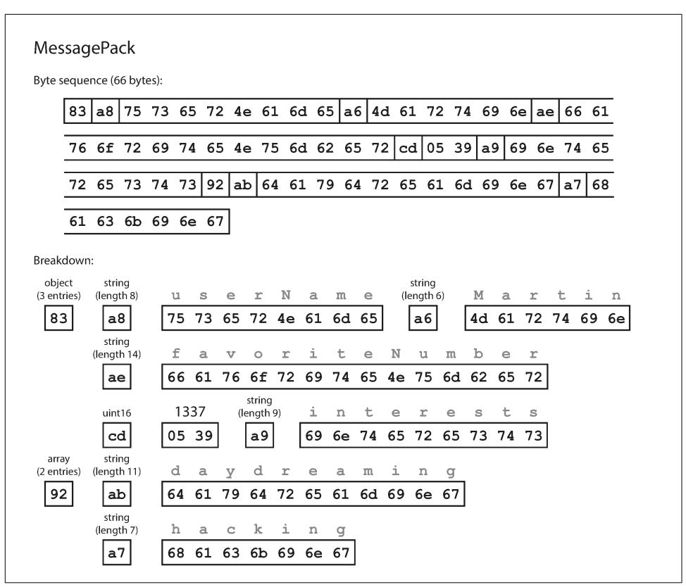

*Figure 4-1. Example record ([Example 4-1](#page-137-0)) encoded using MessagePack.*

## **Thrift and Protocol Buffers**

Apache Thrift [[15\]](#page-162-0) and Protocol Buffers (protobuf) [[16\]](#page-162-0) are binary encoding libraries that are based on the same principle. Protocol Buffers was originally developed at Google, Thrift was originally developed at Facebook, and both were made open source in 2007–08 [[17\]](#page-162-0).

Both Thrift and Protocol Buffers require a schema for any data that is encoded. To encode the data in [Example 4-1](#page-137-0) in Thrift, you would describe the schema in the Thrift interface definition language (IDL) like this:

```
struct Person {
 1: required string userName,
 2: optional i64 favoriteNumber,
 3: optional list<string> interests
}
```

<span id="page-139-0"></span>The equivalent schema definition for Protocol Buffers looks very similar:

```
message Person {
 required string user_name = 1;
 optional int64 favorite_number = 2;
 repeated string interests = 3;
}
```

Thrift and Protocol Buffers each come with a code generation tool that takes a schema definition like the ones shown here, and produces classes that implement the schema in various programming languages [\[18](#page-162-0)]. Your application code can call this generated code to encode or decode records of the schema.

What does data encoded with this schema look like? Confusingly, Thrift has two dif‐ ferent binary encoding formats,iii called *BinaryProtocol* and *CompactProtocol*, respec‐ tively. Let's look at BinaryProtocol first. Encoding [Example 4-1](#page-137-0) in that format takes 59 bytes, as shown in Figure 4-2 [\[19](#page-162-0)].


*Figure 4-2. Example record encoded using Thrift's BinaryProtocol.*

iii. Actually, it has three—BinaryProtocol, CompactProtocol, and DenseProtocol—although DenseProtocol is only supported by the C++ implementation, so it doesn't count as cross-language [[18](#page-162-0)]. Besides those, it also has two different JSON-based encoding formats [[19\]](#page-162-0). What fun!

<span id="page-140-0"></span>Similarly to [Figure 4-1,](#page-138-0) each field has a type annotation (to indicate whether it is a string, integer, list, etc.) and, where required, a length indication (length of a string, number of items in a list). The strings that appear in the data ("Martin", "daydream‐ ing", "hacking") are also encoded as ASCII (or rather, UTF-8), similar to before.

The big difference compared to [Figure 4-1](#page-138-0) is that there are no field names (userName, favoriteNumber, interests). Instead, the encoded data contains *field tags*, which are numbers (1, 2, and 3). Those are the numbers that appear in the schema definition. Field tags are like aliases for fields—they are a compact way of saying what field we're talking about, without having to spell out the field name.

The Thrift CompactProtocol encoding is semantically equivalent to BinaryProtocol, but as you can see in Figure 4-3, it packs the same information into only 34 bytes. It does this by packing the field type and tag number into a single byte, and by using variable-length integers. Rather than using a full eight bytes for the number 1337, it is encoded in two bytes, with the top bit of each byte used to indicate whether there are still more bytes to come. This means numbers between –64 and 63 are encoded in one byte, numbers between –8192 and 8191 are encoded in two bytes, etc. Bigger numbers use more bytes.

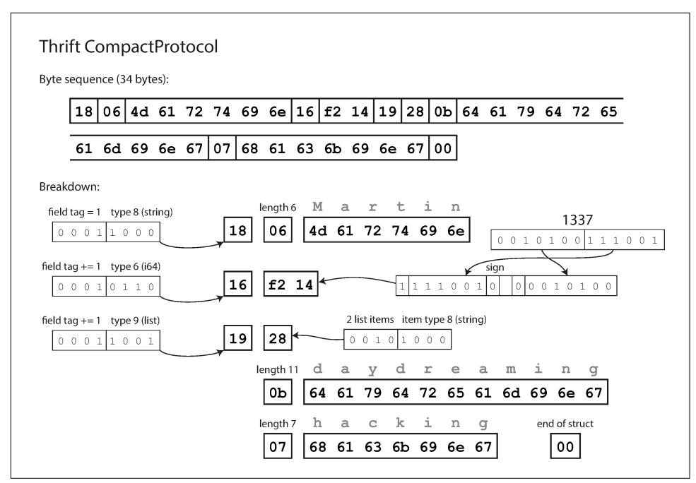

*Figure 4-3. Example record encoded using Thrift's CompactProtocol.*

Finally, Protocol Buffers (which has only one binary encoding format) encodes the same data as shown in [Figure 4-4.](#page-141-0) It does the bit packing slightly differently, but is

<span id="page-141-0"></span>otherwise very similar to Thrift's CompactProtocol. Protocol Buffers fits the same record in 33 bytes.

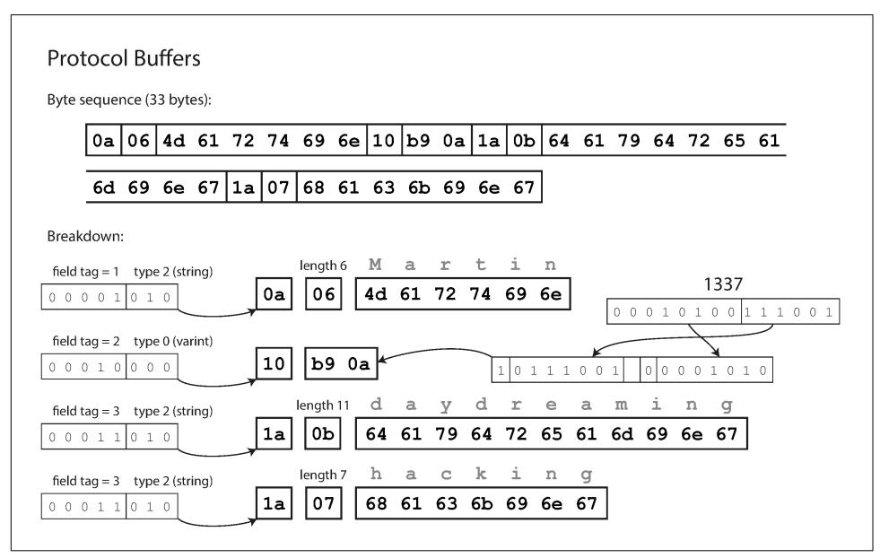

*Figure 4-4. Example record encoded using Protocol Buffers.*

One detail to note: in the schemas shown earlier, each field was marked either required or optional, but this makes no difference to how the field is encoded (nothing in the binary data indicates whether a field was required). The difference is simply that required enables a runtime check that fails if the field is not set, which can be useful for catching bugs.

## **Field tags and schema evolution**

We said previously that schemas inevitably need to change over time. We call this *schema evolution*. How do Thrift and Protocol Buffers handle schema changes while keeping backward and forward compatibility?

As you can see from the examples, an encoded record is just the concatenation of its encoded fields. Each field is identified by its tag number (the numbers 1, 2, 3 in the sample schemas) and annotated with a datatype (e.g., string or integer). If a field value is not set, it is simply omitted from the encoded record. From this you can see that field tags are critical to the meaning of the encoded data. You can change the name of a field in the schema, since the encoded data never refers to field names, but you cannot change a field's tag, since that would make all existing encoded data invalid.

<span id="page-142-0"></span>You can add new fields to the schema, provided that you give each field a new tag number. If old code (which doesn't know about the new tag numbers you added) tries to read data written by new code, including a new field with a tag number it doesn't recognize, it can simply ignore that field. The datatype annotation allows the parser to determine how many bytes it needs to skip. This maintains forward com‐ patibility: old code can read records that were written by new code.

What about backward compatibility? As long as each field has a unique tag number, new code can always read old data, because the tag numbers still have the same meaning. The only detail is that if you add a new field, you cannot make it required. If you were to add a field and make it required, that check would fail if new code read data written by old code, because the old code will not have written the new field that you added. Therefore, to maintain backward compatibility, every field you add after the initial deployment of the schema must be optional or have a default value.

Removing a field is just like adding a field, with backward and forward compatibility concerns reversed. That means you can only remove a field that is optional (a required field can never be removed), and you can never use the same tag number again (because you may still have data written somewhere that includes the old tag number, and that field must be ignored by new code).

## **Datatypes and schema evolution**

What about changing the datatype of a field? That may be possible—check the docu‐ mentation for details—but there is a risk that values will lose precision or get trunca‐ ted. For example, say you change a 32-bit integer into a 64-bit integer. New code can easily read data written by old code, because the parser can fill in any missing bits with zeros. However, if old code reads data written by new code, the old code is still using a 32-bit variable to hold the value. If the decoded 64-bit value won't fit in 32 bits, it will be truncated.

A curious detail of Protocol Buffers is that it does not have a list or array datatype, but instead has a repeated marker for fields (which is a third option alongside required and optional). As you can see in [Figure 4-4,](#page-141-0) the encoding of a repeated field is just what it says on the tin: the same field tag simply appears multiple times in the record. This has the nice effect that it's okay to change an optional (singlevalued) field into a repeated (multi-valued) field. New code reading old data sees a list with zero or one elements (depending on whether the field was present); old code reading new data sees only the last element of the list.

Thrift has a dedicated list datatype, which is parameterized with the datatype of the list elements. This does not allow the same evolution from single-valued to multivalued as Protocol Buffers does, but it has the advantage of supporting nested lists.

## <span id="page-143-0"></span>**Avro**

Apache Avro [[20\]](#page-162-0) is another binary encoding format that is interestingly different from Protocol Buffers and Thrift. It was started in 2009 as a subproject of Hadoop, as a result of Thrift not being a good fit for Hadoop's use cases [[21](#page-162-0)].

Avro also uses a schema to specify the structure of the data being encoded. It has two schema languages: one (Avro IDL) intended for human editing, and one (based on JSON) that is more easily machine-readable.

Our example schema, written in Avro IDL, might look like this:

```
record Person {
 string userName;
 union { null, long } favoriteNumber = null;
 array<string> interests;
}
```

The equivalent JSON representation of that schema is as follows:

```
{
 "type": "record",
 "name": "Person",
 "fields": [
 {"name": "userName", "type": "string"},
 {"name": "favoriteNumber", "type": ["null", "long"], "default": null},
 {"name": "interests", "type": {"type": "array", "items": "string"}}
 ]
}
```

First of all, notice that there are no tag numbers in the schema. If we encode our example record ([Example 4-1\)](#page-137-0) using this schema, the Avro binary encoding is just 32 bytes long—the most compact of all the encodings we have seen. The breakdown of the encoded byte sequence is shown in [Figure 4-5](#page-144-0).

If you examine the byte sequence, you can see that there is nothing to identify fields or their datatypes. The encoding simply consists of values concatenated together. A string is just a length prefix followed by UTF-8 bytes, but there's nothing in the enco‐ ded data that tells you that it is a string. It could just as well be an integer, or some‐ thing else entirely. An integer is encoded using a variable-length encoding (the same as Thrift's CompactProtocol).

<span id="page-144-0"></span>

*Figure 4-5. Example record encoded using Avro.*

To parse the binary data, you go through the fields in the order that they appear in the schema and use the schema to tell you the datatype of each field. This means that the binary data can only be decoded correctly if the code reading the data is using the *exact same schema* as the code that wrote the data. Any mismatch in the schema between the reader and the writer would mean incorrectly decoded data.

So, how does Avro support schema evolution?

#### **The writer's schema and the reader's schema**

With Avro, when an application wants to encode some data (to write it to a file or database, to send it over the network, etc.), it encodes the data using whatever version of the schema it knows about—for example, that schema may be compiled into the application. This is known as the *writer's schema*.

When an application wants to decode some data (read it from a file or database, receive it from the network, etc.), it is expecting the data to be in some schema, which is known as the *reader's schema*. That is the schema the application code is relying on —code may have been generated from that schema during the application's build process.

The key idea with Avro is that the writer's schema and the reader's schema *don't have to be the same*—they only need to be compatible. When data is decoded (read), the Avro library resolves the differences by looking at the writer's schema and the reader's schema side by side and translating the data from the writer's schema into the reader's schema. The Avro specification [\[20\]](#page-162-0) defines exactly how this resolution works, and it is illustrated in Figure 4-6.

For example, it's no problem if the writer's schema and the reader's schema have their fields in a different order, because the schema resolution matches up the fields by field name. If the code reading the data encounters a field that appears in the writer's schema but not in the reader's schema, it is ignored. If the code reading the data expects some field, but the writer's schema does not contain a field of that name, it is filled in with a default value declared in the reader's schema.

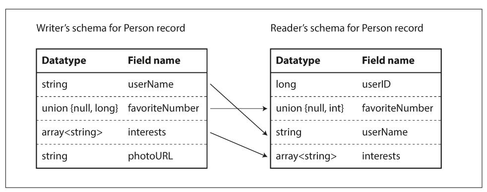

*Figure 4-6. An Avro reader resolves differences between the writer's schema and the reader's schema.*

#### **Schema evolution rules**

With Avro, forward compatibility means that you can have a new version of the schema as writer and an old version of the schema as reader. Conversely, backward compatibility means that you can have a new version of the schema as reader and an old version as writer.

To maintain compatibility, you may only add or remove a field that has a default value. (The field favoriteNumber in our Avro schema has a default value of null.) For example, say you add a field with a default value, so this new field exists in the new schema but not the old one. When a reader using the new schema reads a record written with the old schema, the default value is filled in for the missing field.

If you were to add a field that has no default value, new readers wouldn't be able to read data written by old writers, so you would break backward compatibility. If you were to remove a field that has no default value, old readers wouldn't be able to read data written by new writers, so you would break forward compatibility.

<span id="page-146-0"></span>In some programming languages, null is an acceptable default for any variable, but this is not the case in Avro: if you want to allow a field to be null, you have to use a *union type*. For example, union { null, long, string } field; indicates that field can be a number, or a string, or null. You can only use null as a default value if it is one of the branches of the union.iv This is a little more verbose than having every‐ thing nullable by default, but it helps prevent bugs by being explicit about what can and cannot be null [[22\]](#page-162-0).

Consequently, Avro doesn't have optional and required markers in the same way as Protocol Buffers and Thrift do (it has union types and default values instead).

Changing the datatype of a field is possible, provided that Avro can convert the type. Changing the name of a field is possible but a little tricky: the reader's schema can contain aliases for field names, so it can match an old writer's schema field names against the aliases. This means that changing a field name is backward compatible but not forward compatible. Similarly, adding a branch to a union type is backward com‐ patible but not forward compatible.

## **But what is the writer's schema?**

There is an important question that we've glossed over so far: how does the reader know the writer's schema with which a particular piece of data was encoded? We can't just include the entire schema with every record, because the schema would likely be much bigger than the encoded data, making all the space savings from the binary encoding futile.

The answer depends on the context in which Avro is being used. To give a few exam‐ ples:

## *Large file with lots of records*

A common use for Avro—especially in the context of Hadoop—is for storing a large file containing millions of records, all encoded with the same schema. (We will discuss this kind of situation in [Chapter 10.](#page-410-0)) In this case, the writer of that file can just include the writer's schema once at the beginning of the file. Avro specifies a file format (object container files) to do this.

## *Database with individually written records*

In a database, different records may be written at different points in time using different writer's schemas—you cannot assume that all the records will have the same schema. The simplest solution is to include a version number at the begin‐ ning of every encoded record, and to keep a list of schema versions in your data‐

iv. To be precise, the default value must be of the type of the *first* branch of the union, although this is a specific limitation of Avro, not a general feature of union types.

<span id="page-147-0"></span>base. A reader can fetch a record, extract the version number, and then fetch the writer's schema for that version number from the database. Using that writer's schema, it can decode the rest of the record. (Espresso [[23\]](#page-162-0) works this way, for example.)

*Sending records over a network connection*

When two processes are communicating over a bidirectional network connec‐ tion, they can negotiate the schema version on connection setup and then use that schema for the lifetime of the connection. The Avro RPC protocol (see ["Dataflow Through Services: REST and RPC" on page 131](#page-152-0)) works like this.

A database of schema versions is a useful thing to have in any case, since it acts as documentation and gives you a chance to check schema compatibility [\[24](#page-162-0)]. As the version number, you could use a simple incrementing integer, or you could use a hash of the schema.

## **Dynamically generated schemas**

One advantage of Avro's approach, compared to Protocol Buffers and Thrift, is that the schema doesn't contain any tag numbers. But why is this important? What's the problem with keeping a couple of numbers in the schema?

The difference is that Avro is friendlier to *dynamically generated* schemas. For exam‐ ple, say you have a relational database whose contents you want to dump to a file, and you want to use a binary format to avoid the aforementioned problems with textual formats (JSON, CSV, SQL). If you use Avro, you can fairly easily generate an Avro schema (in the JSON representation we saw earlier) from the relational schema and encode the database contents using that schema, dumping it all to an Avro object container file [[25\]](#page-162-0). You generate a record schema for each database table, and each column becomes a field in that record. The column name in the database maps to the field name in Avro.

Now, if the database schema changes (for example, a table has one column added and one column removed), you can just generate a new Avro schema from the updated database schema and export data in the new Avro schema. The data export process does not need to pay any attention to the schema change—it can simply do the schema conversion every time it runs. Anyone who reads the new data files will see that the fields of the record have changed, but since the fields are identified by name, the updated writer's schema can still be matched up with the old reader's schema.

By contrast, if you were using Thrift or Protocol Buffers for this purpose, the field tags would likely have to be assigned by hand: every time the database schema changes, an administrator would have to manually update the mapping from data‐ base column names to field tags. (It might be possible to automate this, but the schema generator would have to be very careful to not assign previously used field

<span id="page-148-0"></span>tags.) This kind of dynamically generated schema simply wasn't a design goal of Thrift or Protocol Buffers, whereas it was for Avro.

#### **Code generation and dynamically typed languages**

Thrift and Protocol Buffers rely on code generation: after a schema has been defined, you can generate code that implements this schema in a programming language of your choice. This is useful in statically typed languages such as Java, C++, or C#, because it allows efficient in-memory structures to be used for decoded data, and it allows type checking and autocompletion in IDEs when writing programs that access the data structures.

In dynamically typed programming languages such as JavaScript, Ruby, or Python, there is not much point in generating code, since there is no compile-time type checker to satisfy. Code generation is often frowned upon in these languages, since they otherwise avoid an explicit compilation step. Moreover, in the case of a dynami‐ cally generated schema (such as an Avro schema generated from a database table), code generation is an unnecessarily obstacle to getting to the data.

Avro provides optional code generation for statically typed programming languages, but it can be used just as well without any code generation. If you have an object con‐ tainer file (which embeds the writer's schema), you can simply open it using the Avro library and look at the data in the same way as you could look at a JSON file. The file is *self-describing* since it includes all the necessary metadata.

This property is especially useful in conjunction with dynamically typed data pro‐ cessing languages like Apache Pig [[26\]](#page-162-0). In Pig, you can just open some Avro files, start analyzing them, and write derived datasets to output files in Avro format without even thinking about schemas.

## **The Merits of Schemas**

As we saw, Protocol Buffers, Thrift, and Avro all use a schema to describe a binary encoding format. Their schema languages are much simpler than XML Schema or JSON Schema, which support much more detailed validation rules (e.g., "the string value of this field must match this regular expression" or "the integer value of this field must be between 0 and 100"). As Protocol Buffers, Thrift, and Avro are simpler to implement and simpler to use, they have grown to support a fairly wide range of programming languages.

The ideas on which these encodings are based are by no means new. For example, they have a lot in common with ASN.1, a schema definition language that was first standardized in 1984 [\[27](#page-162-0)]. It was used to define various network protocols, and its binary encoding (DER) is still used to encode SSL certificates (X.509), for example [[28\]](#page-163-0). ASN.1 supports schema evolution using tag numbers, similar to Protocol Buf‐ <span id="page-149-0"></span>fers and Thrift [\[29](#page-163-0)]. However, it's also very complex and badly documented, so ASN.1 is probably not a good choice for new applications.

Many data systems also implement some kind of proprietary binary encoding for their data. For example, most relational databases have a network protocol over which you can send queries to the database and get back responses. Those protocols are generally specific to a particular database, and the database vendor provides a driver (e.g., using the ODBC or JDBC APIs) that decodes responses from the data‐ base's network protocol into in-memory data structures.

So, we can see that although textual data formats such as JSON, XML, and CSV are widespread, binary encodings based on schemas are also a viable option. They have a number of nice properties:

- They can be much more compact than the various "binary JSON" variants, since they can omit field names from the encoded data.
- The schema is a valuable form of documentation, and because the schema is required for decoding, you can be sure that it is up to date (whereas manually maintained documentation may easily diverge from reality).
- Keeping a database of schemas allows you to check forward and backward com‐ patibility of schema changes, before anything is deployed.
- For users of statically typed programming languages, the ability to generate code from the schema is useful, since it enables type checking at compile time.

In summary, schema evolution allows the same kind of flexibility as schemaless/ schema-on-read JSON databases provide (see ["Schema flexibility in the document](#page-60-0) [model" on page 39](#page-60-0)), while also providing better guarantees about your data and bet‐ ter tooling.

## **Modes of Dataflow**

At the beginning of this chapter we said that whenever you want to send some data to another process with which you don't share memory—for example, whenever you want to send data over the network or write it to a file—you need to encode it as a sequence of bytes. We then discussed a variety of different encodings for doing this.

We talked about forward and backward compatibility, which are important for evolv‐ ability (making change easy by allowing you to upgrade different parts of your system independently, and not having to change everything at once). Compatibility is a rela‐ tionship between one process that encodes the data, and another process that decodes it.

<span id="page-150-0"></span>That's a fairly abstract idea—there are many ways data can flow from one process to another. Who encodes the data, and who decodes it? In the rest of this chapter we will explore some of the most common ways how data flows between processes:

- Via databases (see "Dataflow Through Databases" on page 129)
- Via service calls (see ["Dataflow Through Services: REST and RPC" on page 131](#page-152-0))
- Via asynchronous message passing (see ["Message-Passing Dataflow" on page 136](#page-157-0))

## **Dataflow Through Databases**

In a database, the process that writes to the database encodes the data, and the pro‐ cess that reads from the database decodes it. There may just be a single process accessing the database, in which case the reader is simply a later version of the same process—in that case you can think of storing something in the database as *sending a message to your future self*.

Backward compatibility is clearly necessary here; otherwise your future self won't be able to decode what you previously wrote.

In general, it's common for several different processes to be accessing a database at the same time. Those processes might be several different applications or services, or they may simply be several instances of the same service (running in parallel for scal‐ ability or fault tolerance). Either way, in an environment where the application is changing, it is likely that some processes accessing the database will be running newer code and some will be running older code—for example because a new version is cur‐ rently being deployed in a rolling upgrade, so some instances have been updated while others haven't yet.

This means that a value in the database may be written by a *newer* version of the code, and subsequently read by an *older* version of the code that is still running. Thus, forward compatibility is also often required for databases.

However, there is an additional snag. Say you add a field to a record schema, and the newer code writes a value for that new field to the database. Subsequently, an older version of the code (which doesn't yet know about the new field) reads the record, updates it, and writes it back. In this situation, the desirable behavior is usually for the old code to keep the new field intact, even though it couldn't be interpreted.

The encoding formats discussed previously support such preservation of unknown fields, but sometimes you need to take care at an application level, as illustrated in [Figure 4-7.](#page-151-0) For example, if you decode a database value into model objects in the application, and later reencode those model objects, the unknown field might be lost in that translation process. Solving this is not a hard problem; you just need to be aware of it.

<span id="page-151-0"></span>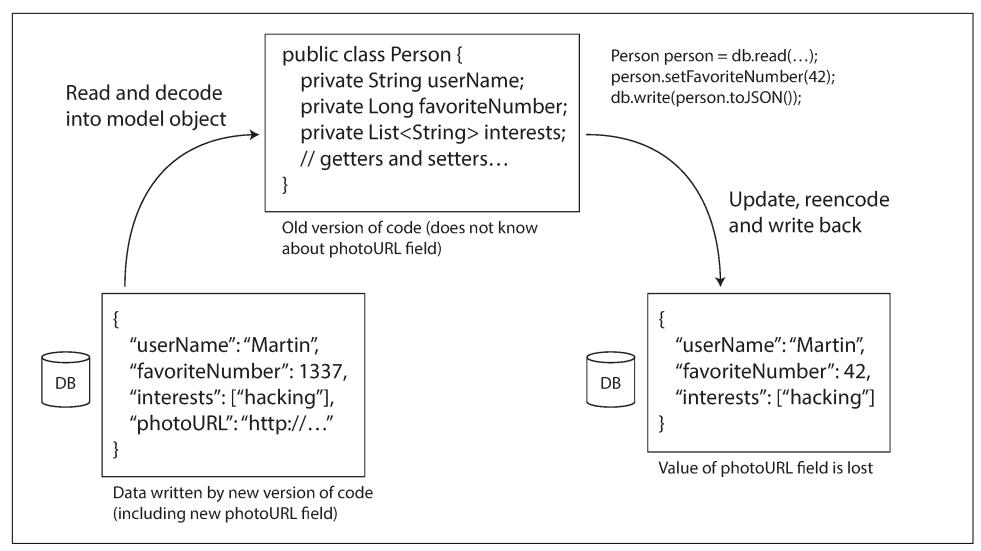

*Figure 4-7. When an older version of the application updates data previously written by a newer version of the application, data may be lost if you're not careful.*

## **Different values written at different times**

A database generally allows any value to be updated at any time. This means that within a single database you may have some values that were written five milli‐ seconds ago, and some values that were written five years ago.

When you deploy a new version of your application (of a server-side application, at least), you may entirely replace the old version with the new version within a few minutes. The same is not true of database contents: the five-year-old data will still be there, in the original encoding, unless you have explicitly rewritten it since then. This observation is sometimes summed up as *data outlives code*.

Rewriting (*migrating*) data into a new schema is certainly possible, but it's an expen‐ sive thing to do on a large dataset, so most databases avoid it if possible. Most rela‐ tional databases allow simple schema changes, such as adding a new column with a null default value, without rewriting existing data.<sup>v</sup> When an old row is read, the database fills in nulls for any columns that are missing from the encoded data on disk. LinkedIn's document database Espresso uses Avro for storage, allowing it to use Avro's schema evolution rules [[23\]](#page-162-0).

v. Except for MySQL, which often rewrites an entire table even though it is not strictly necessary, as men‐ tioned in ["Schema flexibility in the document model" on page 39](#page-60-0).

<span id="page-152-0"></span>Schema evolution thus allows the entire database to appear as if it was encoded with a single schema, even though the underlying storage may contain records encoded with various historical versions of the schema.

#### **Archival storage**

Perhaps you take a snapshot of your database from time to time, say for backup pur‐ poses or for loading into a data warehouse (see ["Data Warehousing" on page 91\)](#page-112-0). In this case, the data dump will typically be encoded using the latest schema, even if the original encoding in the source database contained a mixture of schema versions from different eras. Since you're copying the data anyway, you might as well encode the copy of the data consistently.

As the data dump is written in one go and is thereafter immutable, formats like Avro object container files are a good fit. This is also a good opportunity to encode the data in an analytics-friendly column-oriented format such as Parquet (see ["Column Com‐](#page-118-0) [pression" on page 97\)](#page-118-0).

In [Chapter 10](#page-410-0) we will talk more about using data in archival storage.

## **Dataflow Through Services: REST and RPC**

When you have processes that need to communicate over a network, there are a few different ways of arranging that communication. The most common arrangement is to have two roles: *clients* and *servers*. The servers expose an API over the network, and the clients can connect to the servers to make requests to that API. The API exposed by the server is known as a *service*.

The web works this way: clients (web browsers) make requests to web servers, mak‐ ing GET requests to download HTML, CSS, JavaScript, images, etc., and making POST requests to submit data to the server. The API consists of a standardized set of proto‐ cols and data formats (HTTP, URLs, SSL/TLS, HTML, etc.). Because web browsers, web servers, and website authors mostly agree on these standards, you can use any web browser to access any website (at least in theory!).

Web browsers are not the only type of client. For example, a native app running on a mobile device or a desktop computer can also make network requests to a server, and a client-side JavaScript application running inside a web browser can use XMLHttpRequest to become an HTTP client (this technique is known as *Ajax* [\[30](#page-163-0)]). In this case, the server's response is typically not HTML for displaying to a human, but rather data in an encoding that is convenient for further processing by the clientside application code (such as JSON). Although HTTP may be used as the transport protocol, the API implemented on top is application-specific, and the client and server need to agree on the details of that API.

<span id="page-153-0"></span>Moreover, a server can itself be a client to another service (for example, a typical web app server acts as client to a database). This approach is often used to decompose a large application into smaller services by area of functionality, such that one service makes a request to another when it requires some functionality or data from that other service. This way of building applications has traditionally been called a *serviceoriented architecture* (SOA), more recently refined and rebranded as *microservices architecture* [[31, 32](#page-163-0)].

In some ways, services are similar to databases: they typically allow clients to submit and query data. However, while databases allow arbitrary queries using the query lan‐ guages we discussed in [Chapter 2](#page-48-0), services expose an application-specific API that only allows inputs and outputs that are predetermined by the business logic (applica‐ tion code) of the service [[33](#page-163-0)]. This restriction provides a degree of encapsulation: services can impose fine-grained restrictions on what clients can and cannot do.

A key design goal of a service-oriented/microservices architecture is to make the application easier to change and maintain by making services independently deploya‐ ble and evolvable. For example, each service should be owned by one team, and that team should be able to release new versions of the service frequently, without having to coordinate with other teams. In other words, we should expect old and new ver‐ sions of servers and clients to be running at the same time, and so the data encoding used by servers and clients must be compatible across versions of the service API precisely what we've been talking about in this chapter.

#### **Web services**

When HTTP is used as the underlying protocol for talking to the service, it is called a *web service*. This is perhaps a slight misnomer, because web services are not only used on the web, but in several different contexts. For example:

- 1. A client application running on a user's device (e.g., a native app on a mobile device, or JavaScript web app using Ajax) making requests to a service over HTTP. These requests typically go over the public internet.
- 2. One service making requests to another service owned by the same organization, often located within the same datacenter, as part of a service-oriented/microser‐ vices architecture. (Software that supports this kind of use case is sometimes called *middleware*.)
- 3. One service making requests to a service owned by a different organization, usu‐ ally via the internet. This is used for data exchange between different organiza‐ tions' backend systems. This category includes public APIs provided by online services, such as credit card processing systems, or OAuth for shared access to user data.

<span id="page-154-0"></span>There are two popular approaches to web services: *REST* and *SOAP*. They are almost diametrically opposed in terms of philosophy, and often the subject of heated debate among their respective proponents.vi

REST is not a protocol, but rather a design philosophy that builds upon the principles of HTTP [[34,](#page-163-0) [35](#page-163-0)]. It emphasizes simple data formats, using URLs for identifying resources and using HTTP features for cache control, authentication, and content type negotiation. REST has been gaining popularity compared to SOAP, at least in the context of cross-organizational service integration [\[36](#page-163-0)], and is often associated with microservices [[31\]](#page-163-0). An API designed according to the principles of REST is called *RESTful*.

By contrast, SOAP is an XML-based protocol for making network API requests.vii Although it is most commonly used over HTTP, it aims to be independent from HTTP and avoids using most HTTP features. Instead, it comes with a sprawling and complex multitude of related standards (the *web service framework*, known as *WS-\**) that add various features [[37\]](#page-163-0).

The API of a SOAP web service is described using an XML-based language called the Web Services Description Language, or WSDL. WSDL enables code generation so that a client can access a remote service using local classes and method calls (which are encoded to XML messages and decoded again by the framework). This is useful in statically typed programming languages, but less so in dynamically typed ones (see ["Code generation and dynamically typed languages" on page 127\)](#page-148-0).

As WSDL is not designed to be human-readable, and as SOAP messages are often too complex to construct manually, users of SOAP rely heavily on tool support, code generation, and IDEs [\[38](#page-163-0)]. For users of programming languages that are not sup‐ ported by SOAP vendors, integration with SOAP services is difficult.

Even though SOAP and its various extensions are ostensibly standardized, interoper‐ ability between different vendors' implementations often causes problems [[39\]](#page-163-0). For all of these reasons, although SOAP is still used in many large enterprises, it has fallen out of favor in most smaller companies.

RESTful APIs tend to favor simpler approaches, typically involving less code genera‐ tion and automated tooling. A definition format such as OpenAPI, also known as Swagger [[40](#page-163-0)], can be used to describe RESTful APIs and produce documentation.

vi. Even within each camp there are plenty of arguments. For example, HATEOAS (*hypermedia as the engine of application state*), often provokes discussions [[35](#page-163-0)].

vii. Despite the similarity of acronyms, SOAP is not a requirement for SOA. SOAP is a particular technology, whereas SOA is a general approach to building systems.

## <span id="page-155-0"></span>**The problems with remote procedure calls (RPCs)**

Web services are merely the latest incarnation of a long line of technologies for mak‐ ing API requests over a network, many of which received a lot of hype but have seri‐ ous problems. Enterprise JavaBeans (EJB) and Java's Remote Method Invocation (RMI) are limited to Java. The Distributed Component Object Model (DCOM) is limited to Microsoft platforms. The Common Object Request Broker Architecture (CORBA) is excessively complex, and does not provide backward or forward compat‐ ibility [\[41\]](#page-163-0).

All of these are based on the idea of a *remote procedure call* (RPC), which has been around since the 1970s [[42\]](#page-163-0). The RPC model tries to make a request to a remote net‐ work service look the same as calling a function or method in your programming lan‐ guage, within the same process (this abstraction is called *location transparency*). Although RPC seems convenient at first, the approach is fundamentally flawed [[43,](#page-163-0) [44](#page-163-0)]. A network request is very different from a local function call:

- A local function call is predictable and either succeeds or fails, depending only on parameters that are under your control. A network request is unpredictable: the request or response may be lost due to a network problem, or the remote machine may be slow or unavailable, and such problems are entirely outside of your control. Network problems are common, so you have to anticipate them, for example by retrying a failed request.
- A local function call either returns a result, or throws an exception, or never returns (because it goes into an infinite loop or the process crashes). A network request has another possible outcome: it may return without a result, due to a *timeout*. In that case, you simply don't know what happened: if you don't get a response from the remote service, you have no way of knowing whether the request got through or not. (We discuss this issue in more detail in [Chapter 8](#page-294-0).)
- If you retry a failed network request, it could happen that the requests are actually getting through, and only the responses are getting lost. In that case, retrying will cause the action to be performed multiple times, unless you build a mechanism for deduplication (*idempotence*) into the protocol. Local function calls don't have this problem. (We discuss idempotence in more detail in [Chap‐](#page-460-0) [ter 11](#page-460-0).)
- Every time you call a local function, it normally takes about the same time to exe‐ cute. A network request is much slower than a function call, and its latency is also wildly variable: at good times it may complete in less than a millisecond, but when the network is congested or the remote service is overloaded it may take many seconds to do exactly the same thing.
- When you call a local function, you can efficiently pass it references (pointers) to objects in local memory. When you make a network request, all those parameters

<span id="page-156-0"></span>need to be encoded into a sequence of bytes that can be sent over the network. That's okay if the parameters are primitives like numbers or strings, but quickly becomes problematic with larger objects.

• The client and the service may be implemented in different programming lan‐ guages, so the RPC framework must translate datatypes from one language into another. This can end up ugly, since not all languages have the same types recall JavaScript's problems with numbers greater than 2<sup>53</sup>, for example (see ["JSON, XML, and Binary Variants"](#page-135-0) on page 114). This problem doesn't exist in a single process written in a single language.

All of these factors mean that there's no point trying to make a remote service look too much like a local object in your programming language, because it's a fundamen‐ tally different thing. Part of the appeal of REST is that it doesn't try to hide the fact that it's a network protocol (although this doesn't seem to stop people from building RPC libraries on top of REST).

## **Current directions for RPC**

Despite all these problems, RPC isn't going away. Various RPC frameworks have been built on top of all the encodings mentioned in this chapter: for example, Thrift and Avro come with RPC support included, gRPC is an RPC implementation using Protocol Buffers, Finagle also uses Thrift, and Rest.li uses JSON over HTTP.

This new generation of RPC frameworks is more explicit about the fact that a remote request is different from a local function call. For example, Finagle and Rest.li use *futures* (*promises*) to encapsulate asynchronous actions that may fail. Futures also simplify situations where you need to make requests to multiple services in parallel, and combine their results [\[45\]](#page-164-0). gRPC supports *streams*, where a call consists of not just one request and one response, but a series of requests and responses over time [[46\]](#page-164-0).

Some of these frameworks also provide *service discovery*—that is, allowing a client to find out at which IP address and port number it can find a particular service. We will return to this topic in ["Request Routing" on page 214.](#page-235-0)

Custom RPC protocols with a binary encoding format can achieve better perfor‐ mance than something generic like JSON over REST. However, a RESTful API has other significant advantages: it is good for experimentation and debugging (you can simply make requests to it using a web browser or the command-line tool curl, without any code generation or software installation), it is supported by all main‐ stream programming languages and platforms, and there is a vast ecosystem of tools available (servers, caches, load balancers, proxies, firewalls, monitoring, debugging tools, testing tools, etc.).

<span id="page-157-0"></span>For these reasons, REST seems to be the predominant style for public APIs. The main focus of RPC frameworks is on requests between services owned by the same organi‐ zation, typically within the same datacenter.

## **Data encoding and evolution for RPC**

For evolvability, it is important that RPC clients and servers can be changed and deployed independently. Compared to data flowing through databases (as described in the last section), we can make a simplifying assumption in the case of dataflow through services: it is reasonable to assume that all the servers will be updated first, and all the clients second. Thus, you only need backward compatibility on requests, and forward compatibility on responses.

The backward and forward compatibility properties of an RPC scheme are inherited from whatever encoding it uses:

- Thrift, gRPC (Protocol Buffers), and Avro RPC can be evolved according to the compatibility rules of the respective encoding format.
- In SOAP, requests and responses are specified with XML schemas. These can be evolved, but there are some subtle pitfalls [\[47](#page-164-0)].
- RESTful APIs most commonly use JSON (without a formally specified schema) for responses, and JSON or URI-encoded/form-encoded request parameters for requests. Adding optional request parameters and adding new fields to response objects are usually considered changes that maintain compatibility.

Service compatibility is made harder by the fact that RPC is often used for communi‐ cation across organizational boundaries, so the provider of a service often has no control over its clients and cannot force them to upgrade. Thus, compatibility needs to be maintained for a long time, perhaps indefinitely. If a compatibility-breaking change is required, the service provider often ends up maintaining multiple versions of the service API side by side.

There is no agreement on how API versioning should work (i.e., how a client can indicate which version of the API it wants to use [[48\]](#page-164-0)). For RESTful APIs, common approaches are to use a version number in the URL or in the HTTP Accept header. For services that use API keys to identify a particular client, another option is to store a client's requested API version on the server and to allow this version selection to be updated through a separate administrative interface [\[49\]](#page-164-0).

## **Message-Passing Dataflow**

We have been looking at the different ways encoded data flows from one process to another. So far, we've discussed REST and RPC (where one process sends a request over the network to another process and expects a response as quickly as possible), <span id="page-158-0"></span>and databases (where one process writes encoded data, and another process reads it again sometime in the future).

In this final section, we will briefly look at *asynchronous message-passing* systems, which are somewhere between RPC and databases. They are similar to RPC in that a client's request (usually called a *message*) is delivered to another process with low latency. They are similar to databases in that the message is not sent via a direct net‐ work connection, but goes via an intermediary called a *message broker* (also called a *message queue* or *message-oriented middleware*), which stores the message temporar‐ ily.

Using a message broker has several advantages compared to direct RPC:

- It can act as a buffer if the recipient is unavailable or overloaded, and thus improve system reliability.
- It can automatically redeliver messages to a process that has crashed, and thus prevent messages from being lost.
- It avoids the sender needing to know the IP address and port number of the recipient (which is particularly useful in a cloud deployment where virtual machines often come and go).
- It allows one message to be sent to several recipients.
- It logically decouples the sender from the recipient (the sender just publishes messages and doesn't care who consumes them).

However, a difference compared to RPC is that message-passing communication is usually one-way: a sender normally doesn't expect to receive a reply to its messages. It is possible for a process to send a response, but this would usually be done on a sepa‐ rate channel. This communication pattern is *asynchronous*: the sender doesn't wait for the message to be delivered, but simply sends it and then forgets about it.

## **Message brokers**

In the past, the landscape of message brokers was dominated by commercial enter‐ prise software from companies such as TIBCO, IBM WebSphere, and webMethods. More recently, open source implementations such as RabbitMQ, ActiveMQ, Hor‐ netQ, NATS, and Apache Kafka have become popular. We will compare them in more detail in [Chapter 11](#page-460-0).

The detailed delivery semantics vary by implementation and configuration, but in general, message brokers are used as follows: one process sends a message to a named *queue* or *topic*, and the broker ensures that the message is delivered to one or more *consumers* of or *subscribers* to that queue or topic. There can be many producers and many consumers on the same topic.

<span id="page-159-0"></span>A topic provides only one-way dataflow. However, a consumer may itself publish messages to another topic (so you can chain them together, as we shall see in [Chap‐](#page-460-0) [ter 11](#page-460-0)), or to a reply queue that is consumed by the sender of the original message (allowing a request/response dataflow, similar to RPC).

Message brokers typically don't enforce any particular data model—a message is just a sequence of bytes with some metadata, so you can use any encoding format. If the encoding is backward and forward compatible, you have the greatest flexibility to change publishers and consumers independently and deploy them in any order.

If a consumer republishes messages to another topic, you may need to be careful to preserve unknown fields, to prevent the issue described previously in the context of databases [\(Figure 4-7\)](#page-151-0).

## **Distributed actor frameworks**

The *actor model* is a programming model for concurrency in a single process. Rather than dealing directly with threads (and the associated problems of race conditions, locking, and deadlock), logic is encapsulated in *actors*. Each actor typically represents one client or entity, it may have some local state (which is not shared with any other actor), and it communicates with other actors by sending and receiving asynchro‐ nous messages. Message delivery is not guaranteed: in certain error scenarios, mes‐ sages will be lost. Since each actor processes only one message at a time, it doesn't need to worry about threads, and each actor can be scheduled independently by the framework.

In *distributed actor frameworks*, this programming model is used to scale an applica‐ tion across multiple nodes. The same message-passing mechanism is used, no matter whether the sender and recipient are on the same node or different nodes. If they are on different nodes, the message is transparently encoded into a byte sequence, sent over the network, and decoded on the other side.

Location transparency works better in the actor model than in RPC, because the actor model already assumes that messages may be lost, even within a single process. Although latency over the network is likely higher than within the same process, there is less of a fundamental mismatch between local and remote communication when using the actor model.

A distributed actor framework essentially integrates a message broker and the actor programming model into a single framework. However, if you want to perform roll‐ ing upgrades of your actor-based application, you still have to worry about forward and backward compatibility, as messages may be sent from a node running the new version to a node running the old version, and vice versa.

Three popular distributed actor frameworks handle message encoding as follows:

- <span id="page-160-0"></span>• *Akka* uses Java's built-in serialization by default, which does not provide forward or backward compatibility. However, you can replace it with something like Pro‐ tocol Buffers, and thus gain the ability to do rolling upgrades [\[50](#page-164-0)].
- *Orleans* by default uses a custom data encoding format that does not support rolling upgrade deployments; to deploy a new version of your application, you need to set up a new cluster, move traffic from the old cluster to the new one, and shut down the old one [[51](#page-164-0), [52](#page-164-0)]. Like with Akka, custom serialization plug-ins can be used.
- In *Erlang OTP* it is surprisingly hard to make changes to record schemas (despite the system having many features designed for high availability); rolling upgrades are possible but need to be planned carefully [[53\]](#page-164-0). An experimental new maps datatype (a JSON-like structure, introduced in Erlang R17 in 2014) may make this easier in the future [[54\]](#page-164-0).

## **Summary**

In this chapter we looked at several ways of turning data structures into bytes on the network or bytes on disk. We saw how the details of these encodings affect not only their efficiency, but more importantly also the architecture of applications and your options for deploying them.

In particular, many services need to support rolling upgrades, where a new version of a service is gradually deployed to a few nodes at a time, rather than deploying to all nodes simultaneously. Rolling upgrades allow new versions of a service to be released without downtime (thus encouraging frequent small releases over rare big releases) and make deployments less risky (allowing faulty releases to be detected and rolled back before they affect a large number of users). These properties are hugely benefi‐ cial for *evolvability*, the ease of making changes to an application.

During rolling upgrades, or for various other reasons, we must assume that different nodes are running the different versions of our application's code. Thus, it is impor‐ tant that all data flowing around the system is encoded in a way that provides back‐ ward compatibility (new code can read old data) and forward compatibility (old code can read new data).

We discussed several data encoding formats and their compatibility properties:

- Programming language–specific encodings are restricted to a single program‐ ming language and often fail to provide forward and backward compatibility.
- Textual formats like JSON, XML, and CSV are widespread, and their compatibil‐ ity depends on how you use them. They have optional schema languages, which are sometimes helpful and sometimes a hindrance. These formats are somewhat

- <span id="page-161-0"></span>vague about datatypes, so you have to be careful with things like numbers and binary strings.
- Binary schema–driven formats like Thrift, Protocol Buffers, and Avro allow compact, efficient encoding with clearly defined forward and backward compati‐ bility semantics. The schemas can be useful for documentation and code genera‐ tion in statically typed languages. However, they have the downside that data needs to be decoded before it is human-readable.

We also discussed several modes of dataflow, illustrating different scenarios in which data encodings are important:

- Databases, where the process writing to the database encodes the data and the process reading from the database decodes it
- RPC and REST APIs, where the client encodes a request, the server decodes the request and encodes a response, and the client finally decodes the response
- Asynchronous message passing (using message brokers or actors), where nodes communicate by sending each other messages that are encoded by the sender and decoded by the recipient

We can conclude that with a bit of care, backward/forward compatibility and rolling upgrades are quite achievable. May your application's evolution be rapid and your deployments be frequent.

## **References**

- [[1\]](#page-134-0) "[Java Object Serialization Specification](http://docs.oracle.com/javase/7/docs/platform/serialization/spec/serialTOC.html)," *docs.oracle.com*, 2010.
- [[2\]](#page-134-0) "[Ruby 2.2.0 API Documentation,](http://ruby-doc.org/core-2.2.0/)" *ruby-doc.org*, Dec 2014.
- [[3\]](#page-134-0) "[The Python 3.4.3 Standard Library Reference Manual,](https://docs.python.org/3/library/pickle.html)" *docs.python.org*, Febru‐ ary 2015.
- [[4\]](#page-134-0) "[EsotericSoftware/kryo](https://github.com/EsotericSoftware/kryo)," *github.com*, October 2014.
- [[5\]](#page-134-0) ["CWE-502: Deserialization of Untrusted Data,](http://cwe.mitre.org/data/definitions/502.html)" Common Weakness Enumera‐ tion, *cwe.mitre.org*, July 30, 2014.
- [[6\]](#page-134-0) Steve Breen: ["What Do WebLogic, WebSphere, JBoss, Jenkins, OpenNMS, and](http://foxglovesecurity.com/2015/11/06/what-do-weblogic-websphere-jboss-jenkins-opennms-and-your-application-have-in-common-this-vulnerability/) [Your Application Have in Common? This Vulnerability](http://foxglovesecurity.com/2015/11/06/what-do-weblogic-websphere-jboss-jenkins-opennms-and-your-application-have-in-common-this-vulnerability/)," *foxglovesecurity.com*, November 6, 2015.
- [[7\]](#page-134-0) Patrick McKenzie: "[What the Rails Security Issue Means for Your Startup,](http://www.kalzumeus.com/2013/01/31/what-the-rails-security-issue-means-for-your-startup/)" *kalzu‐ meus.com*, January 31, 2013.
- [[8\]](#page-135-0) Eishay Smith: "[jvm-serializers wiki,](https://github.com/eishay/jvm-serializers/wiki)" *github.com*, November 2014.

- <span id="page-162-0"></span>[[9\]](#page-135-0) "[XML Is a Poor Copy of S-Expressions,](http://c2.com/cgi/wiki?XmlIsaPoorCopyOfEssExpressions)" *c2.com* wiki.
- [[10\]](#page-135-0) Matt Harris: ["Snowflake: An Update and Some Very Important Information](https://groups.google.com/forum/#!topic/twitter-development-talk/ahbvo3VTIYI)," email to *Twitter Development Talk* mailing list, October 19, 2010.
- [[11\]](#page-136-0) Shudi (Sandy) Gao, C. M. Sperberg-McQueen, and Henry S. Thompson: ["XML](http://www.w3.org/XML/Schema) [Schema 1.1,](http://www.w3.org/XML/Schema)" W3C Recommendation, May 2001.
- [[12\]](#page-136-0) Francis Galiegue, Kris Zyp, and Gary Court: "[JSON Schema,](http://json-schema.org/)" IETF Internet-Draft, February 2013.
- [[13\]](#page-136-0) Yakov Shafranovich: "[RFC 4180: Common Format and MIME Type for](https://tools.ietf.org/html/rfc4180) [Comma-Separated Values \(CSV\) Files,](https://tools.ietf.org/html/rfc4180)" October 2005.
- [[14\]](#page-137-0) "[MessagePack Specification](http://msgpack.org/)," *msgpack.org*.
- [[15\]](#page-138-0) Mark Slee, Aditya Agarwal, and Marc Kwiatkowski: "[Thrift: Scalable Cross-](http://thrift.apache.org/static/files/thrift-20070401.pdf)[Language Services Implementation,](http://thrift.apache.org/static/files/thrift-20070401.pdf)" Facebook technical report, April 2007.
- [[16\]](#page-138-0) "[Protocol Buffers Developer Guide,](https://developers.google.com/protocol-buffers/docs/overview)" Google, Inc., *developers.google.com*.
- [[17\]](#page-138-0) Igor Anishchenko: ["Thrift vs Protocol Buffers vs Avro Biased Comparison](http://www.slideshare.net/IgorAnishchenko/pb-vs-thrift-vs-avro)," *slideshare.net*, September 17, 2012.
- [[18\]](#page-139-0) "[A Matrix of the Features Each Individual Language Library Supports](http://wiki.apache.org/thrift/LibraryFeatures)," *wiki.apache.org*.
- [[19\]](#page-139-0) Martin Kleppmann: ["Schema Evolution in Avro, Protocol Buffers and Thrift](http://martin.kleppmann.com/2012/12/05/schema-evolution-in-avro-protocol-buffers-thrift.html)," *martin.kleppmann.com*, December 5, 2012.
- [[20\]](#page-143-0) "[Apache Avro 1.7.7 Documentation](http://avro.apache.org/docs/1.7.7/)," *avro.apache.org*, July 2014.
- [[21\]](#page-143-0) Doug Cutting, Chad Walters, Jim Kellerman, et al.: "[\[PROPOSAL\] New Subpro‐](http://mail-archives.apache.org/mod_mbox/hadoop-general/200904.mbox/%3C49D53694.1050906@apache.org%3E) [ject: Avro](http://mail-archives.apache.org/mod_mbox/hadoop-general/200904.mbox/%3C49D53694.1050906@apache.org%3E)," email thread on *hadoop-general* mailing list, *mail-archives.apache.org*, April 2009.
- [[22\]](#page-146-0) Tony Hoare: ["Null References: The Billion Dollar Mistake](http://www.infoq.com/presentations/Null-References-The-Billion-Dollar-Mistake-Tony-Hoare)," at *QCon London*, March 2009.
- [[23\]](#page-147-0) Aditya Auradkar and Tom Quiggle: ["Introducing Espresso—LinkedIn's Hot](https://engineering.linkedin.com/espresso/introducing-espresso-linkedins-hot-new-distributed-document-store) [New Distributed Document Store](https://engineering.linkedin.com/espresso/introducing-espresso-linkedins-hot-new-distributed-document-store)," *engineering.linkedin.com*, January 21, 2015.
- [[24\]](#page-147-0) Jay Kreps: "[Putting Apache Kafka to Use: A Practical Guide to Building a Stream](http://blog.confluent.io/2015/02/25/stream-data-platform-2/) [Data Platform \(Part 2\),](http://blog.confluent.io/2015/02/25/stream-data-platform-2/)" *blog.confluent.io*, February 25, 2015.
- [[25\]](#page-147-0) Gwen Shapira: "[The Problem of Managing Schemas,](http://radar.oreilly.com/2014/11/the-problem-of-managing-schemas.html)" *radar.oreilly.com*, Novem‐ ber 4, 2014.
- [[26\]](#page-148-0) "[Apache Pig 0.14.0 Documentation](http://pig.apache.org/docs/r0.14.0/)," *pig.apache.org*, November 2014.
- [[27\]](#page-148-0) John Larmouth: *[ASN.1 Complete](http://www.oss.com/asn1/resources/books-whitepapers-pubs/larmouth-asn1-book.pdf)*. Morgan Kaufmann, 1999. ISBN: 978-0-122-33435-1

- <span id="page-163-0"></span>[[28\]](#page-148-0) Russell Housley, Warwick Ford, Tim Polk, and David Solo: "[RFC 2459: Internet](https://www.ietf.org/rfc/rfc2459.txt) [X.509 Public Key Infrastructure: Certificate and CRL Profile](https://www.ietf.org/rfc/rfc2459.txt)," IETF Network Work‐ ing Group, Standards Track, January 1999.
- [[29\]](#page-149-0) Lev Walkin: ["Question: Extensibility and Dropping Fields,](http://lionet.info/asn1c/blog/2010/09/21/question-extensibility-removing-fields/)" *lionet.info*, Septem‐ ber 21, 2010.
- [[30\]](#page-152-0) Jesse James Garrett: "[Ajax: A New Approach to Web Applications](http://www.adaptivepath.com/ideas/ajax-new-approach-web-applications/)," *adaptive‐ path.com*, February 18, 2005.
- [[31\]](#page-153-0) Sam Newman: *Building Microservices*. O'Reilly Media, 2015. ISBN: 978-1-491-95035-7
- [[32\]](#page-153-0) Chris Richardson: "[Microservices: Decomposing Applications for Deployability](http://www.infoq.com/articles/microservices-intro) [and Scalability](http://www.infoq.com/articles/microservices-intro)," *infoq.com*, May 25, 2014.
- [[33\]](#page-153-0) Pat Helland: ["Data on the Outside Versus Data on the Inside,](http://cidrdb.org/cidr2005/papers/P12.pdf)" at *2nd Biennial Conference on Innovative Data Systems Research* (CIDR), January 2005.
- [[34\]](#page-154-0) Roy Thomas Fielding: "[Architectural Styles and the Design of Network-Based](https://www.ics.uci.edu/~fielding/pubs/dissertation/fielding_dissertation.pdf) [Software Architectures](https://www.ics.uci.edu/~fielding/pubs/dissertation/fielding_dissertation.pdf)," PhD Thesis, University of California, Irvine, 2000.
- [[35\]](#page-154-0) Roy Thomas Fielding: "[REST APIs Must Be Hypertext-Driven](http://roy.gbiv.com/untangled/2008/rest-apis-must-be-hypertext-driven)," *roy.gbiv.com*, October 20 2008.
- [[36\]](#page-154-0) "[REST in Peace, SOAP,](http://royal.pingdom.com/2010/10/15/rest-in-peace-soap/)" *royal.pingdom.com*, October 15, 2010.
- [[37\]](#page-154-0) "[Web Services Standards as of Q1 2007,](https://www.innoq.com/resources/ws-standards-poster/)" *innoq.com*, February 2007.
- [[38\]](#page-154-0) Pete Lacey: ["The S Stands for Simple](http://harmful.cat-v.org/software/xml/soap/simple)," *harmful.cat-v.org*, November 15, 2006.
- [[39\]](#page-154-0) Stefan Tilkov: "[Interview: Pete Lacey Criticizes Web Services,](http://www.infoq.com/articles/pete-lacey-ws-criticism)" *infoq.com*, December 12, 2006.
- [[40\]](#page-154-0) "[OpenAPI Specification \(fka Swagger RESTful API Documentation Specifica‐](http://swagger.io/specification/) [tion\) Version 2.0](http://swagger.io/specification/)," *swagger.io*, September 8, 2014.
- [[41\]](#page-155-0) Michi Henning: ["The Rise and Fall of CORBA,](http://queue.acm.org/detail.cfm?id=1142044)" *ACM Queue*, volume 4, number 5, pages 28–34, June 2006. [doi:10.1145/1142031.1142044](http://dx.doi.org/10.1145/1142031.1142044)
- [[42\]](#page-155-0) Andrew D. Birrell and Bruce Jay Nelson: ["Implementing Remote Procedure](http://www.cs.princeton.edu/courses/archive/fall03/cs518/papers/rpc.pdf) [Calls,](http://www.cs.princeton.edu/courses/archive/fall03/cs518/papers/rpc.pdf)" *ACM Transactions on Computer Systems* (TOCS), volume 2, number 1, pages 39–59, February 1984. [doi:10.1145/2080.357392](http://dx.doi.org/10.1145/2080.357392)
- [[43\]](#page-155-0) Jim Waldo, Geoff Wyant, Ann Wollrath, and Sam Kendall: "[A Note on Dis‐](http://m.mirror.facebook.net/kde/devel/smli_tr-94-29.pdf) [tributed Computing](http://m.mirror.facebook.net/kde/devel/smli_tr-94-29.pdf)," Sun Microsystems Laboratories, Inc., Technical Report TR-94-29, November 1994.
- [[44\]](#page-155-0) Steve Vinoski: ["Convenience over Correctness,](http://steve.vinoski.net/pdf/IEEE-Convenience_Over_Correctness.pdf)" *IEEE Internet Computing*, vol‐ ume 12, number 4, pages 89–92, July 2008. [doi:10.1109/MIC.2008.75](http://dx.doi.org/10.1109/MIC.2008.75)

- <span id="page-164-0"></span>[[45\]](#page-156-0) Marius Eriksen: "[Your Server as a Function](http://monkey.org/~marius/funsrv.pdf)," at *7th Workshop on Programming Languages and Operating Systems* (PLOS), November 2013. [doi:](http://dx.doi.org/10.1145/2525528.2525538) [10.1145/2525528.2525538](http://dx.doi.org/10.1145/2525528.2525538)
- [[46\]](#page-156-0) "[grpc-common Documentation,](https://github.com/grpc/grpc-common)" Google, Inc., *github.com*, February 2015.
- [[47\]](#page-157-0) Aditya Narayan and Irina Singh: ["Designing and Versioning Compatible Web](http://www.ibm.com/developerworks/websphere/library/techarticles/0705_narayan/0705_narayan.html) [Services,](http://www.ibm.com/developerworks/websphere/library/techarticles/0705_narayan/0705_narayan.html)" *ibm.com*, March 28, 2007.
- [[48\]](#page-157-0) Troy Hunt: ["Your API Versioning Is Wrong, Which Is Why I Decided to Do It 3](http://www.troyhunt.com/2014/02/your-api-versioning-is-wrong-which-is.html) [Different Wrong Ways,](http://www.troyhunt.com/2014/02/your-api-versioning-is-wrong-which-is.html)" *troyhunt.com*, February 10, 2014.
- [[49\]](#page-157-0) "[API Upgrades,](https://stripe.com/docs/upgrades)" Stripe, Inc., April 2015.
- [[50\]](#page-160-0) Jonas Bonér: "[Upgrade in an Akka Cluster,](http://grokbase.com/t/gg/akka-user/138wd8j9e3/upgrade-in-an-akka-cluster)" email to *akka-user* mailing list, *grok‐ base.com*, August 28, 2013.
- [[51\]](#page-160-0) Philip A. Bernstein, Sergey Bykov, Alan Geller, et al.: "[Orleans: Distributed Vir‐](http://research.microsoft.com/pubs/210931/Orleans-MSR-TR-2014-41.pdf) [tual Actors for Programmability and Scalability,](http://research.microsoft.com/pubs/210931/Orleans-MSR-TR-2014-41.pdf)" Microsoft Research Technical Report MSR-TR-2014-41, March 2014.
- [[52\]](#page-160-0) "[Microsoft Project Orleans Documentation](http://dotnet.github.io/orleans/)," Microsoft Research, *dotnet.git‐ hub.io*, 2015.
- [[53\]](#page-160-0) David Mercer, Sean Hinde, Yinso Chen, and Richard A O'Keefe: ["beginner:](http://erlang.org/pipermail/erlang-questions/2007-October/030318.html) [Updating Data Structures](http://erlang.org/pipermail/erlang-questions/2007-October/030318.html)," email thread on *erlang-questions* mailing list, *erlang.com*, October 29, 2007.
- [[54\]](#page-160-0) Fred Hebert: "[Postscript: Maps](http://learnyousomeerlang.com/maps)," *learnyousomeerlang.com*, April 9, 2014.

# **Distributed Data**

<span id="page-166-0"></span>*For a successful technology, reality must take precedence over public relations, for nature cannot be fooled.*

—Richard Feynman, *Rogers Commission Report* (1986)

In [Part I](#page-22-0) of this book, we discussed aspects of data systems that apply when data is stored on a single machine. Now, in Part II, we move up a level and ask: what hap‐ pens if multiple machines are involved in storage and retrieval of data?

There are various reasons why you might want to distribute a database across multi‐ ple machines:

## *Scalability*

If your data volume, read load, or write load grows bigger than a single machine can handle, you can potentially spread the load across multiple machines.

## *Fault tolerance/high availability*

If your application needs to continue working even if one machine (or several machines, or the network, or an entire datacenter) goes down, you can use multi‐ ple machines to give you redundancy. When one fails, another one can take over.

#### *Latency*

If you have users around the world, you might want to have servers at various locations worldwide so that each user can be served from a datacenter that is geo‐ graphically close to them. That avoids the users having to wait for network pack‐ ets to travel halfway around the world.

## <span id="page-167-0"></span>**Scaling to Higher Load**

If all you need is to scale to higher load, the simplest approach is to buy a more pow‐ erful machine (sometimes called *vertical scaling* or *scaling up*). Many CPUs, many RAM chips, and many disks can be joined together under one operating system, and a fast interconnect allows any CPU to access any part of the memory or disk. In this kind of *shared-memory architecture*, all the components can be treated as a single machine [\[1](#page-169-0)].<sup>i</sup>

The problem with a shared-memory approach is that the cost grows faster than line‐ arly: a machine with twice as many CPUs, twice as much RAM, and twice as much disk capacity as another typically costs significantly more than twice as much. And due to bottlenecks, a machine twice the size cannot necessarily handle twice the load.

A shared-memory architecture may offer limited fault tolerance—high-end machines have hot-swappable components (you can replace disks, memory modules, and even CPUs without shutting down the machines)—but it is definitely limited to a single geographic location.

Another approach is the *shared-disk architecture*, which uses several machines with independent CPUs and RAM, but stores data on an array of disks that is shared between the machines, which are connected via a fast network.ii This architecture is used for some data warehousing workloads, but contention and the overhead of lock‐ ing limit the scalability of the shared-disk approach [[2\]](#page-169-0).

## **Shared-Nothing Architectures**

By contrast, *shared-nothing architectures* [[3\]](#page-169-0) (sometimes called *horizontal scaling* or *scaling out*) have gained a lot of popularity. In this approach, each machine or virtual machine running the database software is called a *node*. Each node uses its CPUs, RAM, and disks independently. Any coordination between nodes is done at the soft‐ ware level, using a conventional network.

No special hardware is required by a shared-nothing system, so you can use whatever machines have the best price/performance ratio. You can potentially distribute data across multiple geographic regions, and thus reduce latency for users and potentially be able to survive the loss of an entire datacenter. With cloud deployments of virtual

i. In a large machine, although any CPU can access any part of memory, some banks of memory are closer to one CPU than to others (this is called *nonuniform memory access*, or NUMA [[1](#page-169-0)]). To make efficient use of this architecture, the processing needs to be broken down so that each CPU mostly accesses memory that is nearby—which means that partitioning is still required, even when ostensibly running on one machine.

ii. *Network Attached Storage* (NAS) or *Storage Area Network* (SAN).

<span id="page-168-0"></span>machines, you don't need to be operating at Google scale: even for small companies, a multi-region distributed architecture is now feasible.

In this part of the book, we focus on shared-nothing architectures—not because they are necessarily the best choice for every use case, but rather because they require the most caution from you, the application developer. If your data is distributed across multiple nodes, you need to be aware of the constraints and trade-offs that occur in such a distributed system—the database cannot magically hide these from you.

While a distributed shared-nothing architecture has many advantages, it usually also incurs additional complexity for applications and sometimes limits the expressive‐ ness of the data models you can use. In some cases, a simple single-threaded program can perform significantly better than a cluster with over 100 CPU cores [[4\]](#page-169-0). On the other hand, shared-nothing systems can be very powerful. The next few chapters go into details on the issues that arise when data is distributed.

## **Replication Versus Partitioning**

There are two common ways data is distributed across multiple nodes:

## *Replication*

Keeping a copy of the same data on several different nodes, potentially in differ‐ ent locations. Replication provides redundancy: if some nodes are unavailable, the data can still be served from the remaining nodes. Replication can also help improve performance. We discuss replication in [Chapter 5.](#page-172-0)

## *Partitioning*

Splitting a big database into smaller subsets called *partitions* so that different par‐ titions can be assigned to different nodes (also known as *sharding*). We discuss partitioning in [Chapter 6.](#page-220-0)

These are separate mechanisms, but they often go hand in hand, as illustrated in [Figure II-1.](#page-169-0)

<span id="page-169-0"></span>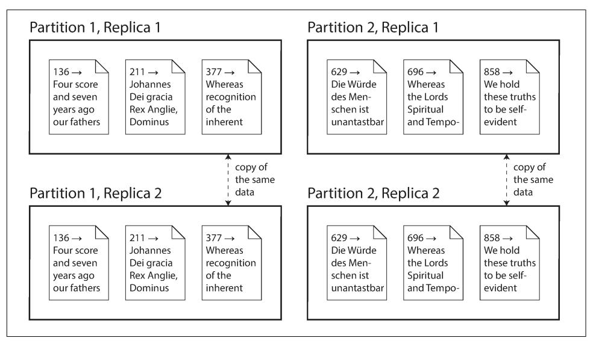

*Figure II-1. A database split into two partitions, with two replicas per partition.*

With an understanding of those concepts, we can discuss the difficult trade-offs that you need to make in a distributed system. We'll discuss *transactions* in [Chapter 7](#page-242-0), as that will help you understand all the many things that can go wrong in a data system, and what you can do about them. We'll conclude this part of the book by discussing the fundamental limitations of distributed systems in Chapters [8](#page-294-0) and [9.](#page-342-0)

Later, in [Part III](#page-406-0) of this book, we will discuss how you can take several (potentially distributed) datastores and integrate them into a larger system, satisfying the needs of a complex application. But first, let's talk about distributed data.

## **References**

- [[1\]](#page-167-0) Ulrich Drepper: "[What Every Programmer Should Know About Memory,](http://www.akkadia.org/drepper/cpumemory.pdf)" *akka‐ dia.org*, November 21, 2007.
- [[2\]](#page-167-0) Ben Stopford: ["Shared Nothing vs. Shared Disk Architectures: An Independent](http://www.benstopford.com/2009/11/24/understanding-the-shared-nothing-architecture/) [View,](http://www.benstopford.com/2009/11/24/understanding-the-shared-nothing-architecture/)" *benstopford.com*, November 24, 2009.
- [[3\]](#page-167-0) Michael Stonebraker: "[The Case for Shared Nothing,](http://db.cs.berkeley.edu/papers/hpts85-nothing.pdf)" *IEEE Database Engineering Bulletin*, volume 9, number 1, pages 4–9, March 1986.
- [[4\]](#page-168-0) Frank McSherry, Michael Isard, and Derek G. Murray: ["Scalability! But at What](http://www.frankmcsherry.org/assets/COST.pdf) [COST?](http://www.frankmcsherry.org/assets/COST.pdf)," at *15th USENIX Workshop on Hot Topics in Operating Systems* (HotOS), May 2015.

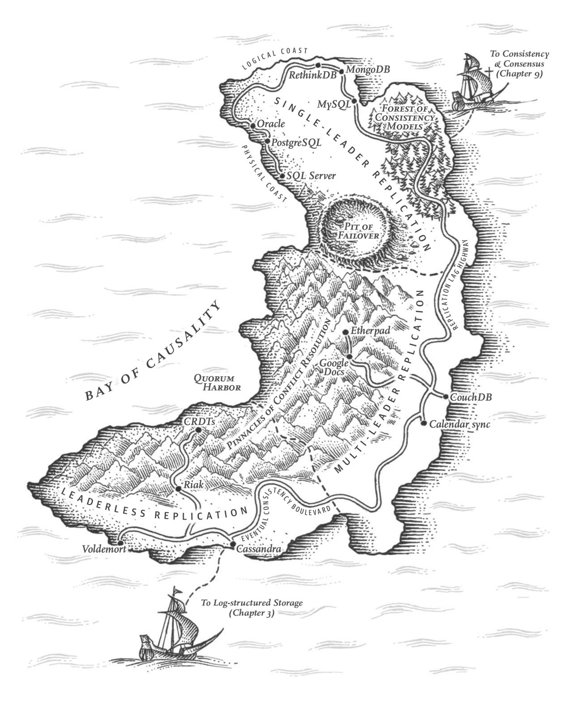

# **Replication**

<span id="page-172-0"></span>*The major difference between a thing that might go wrong and a thing that cannot possibly go wrong is that when a thing that cannot possibly go wrong goes wrong it usually turns out to be impossible to get at or repair.*

—Douglas Adams, *Mostly Harmless* (1992)

*Replication* means keeping a copy of the same data on multiple machines that are connected via a network. As discussed in the introduction to [Part II](#page-166-0), there are several reasons why you might want to replicate data:

- To keep data geographically close to your users (and thus reduce latency)
- To allow the system to continue working even if some of its parts have failed (and thus increase availability)
- To scale out the number of machines that can serve read queries (and thus increase read throughput)

In this chapter we will assume that your dataset is so small that each machine can hold a copy of the entire dataset. In [Chapter 6](#page-220-0) we will relax that assumption and dis‐ cuss *partitioning* (*sharding*) of datasets that are too big for a single machine. In later chapters we will discuss various kinds of faults that can occur in a replicated data sys‐ tem, and how to deal with them.

If the data that you're replicating does not change over time, then replication is easy: you just need to copy the data to every node once, and you're done. All of the diffi‐ culty in replication lies in handling *changes* to replicated data, and that's what this chapter is about. We will discuss three popular algorithms for replicating changes between nodes: *single-leader*, *multi-leader*, and *leaderless* replication. Almost all dis‐ tributed databases use one of these three approaches. They all have various pros and cons, which we will examine in detail.

<span id="page-173-0"></span>There are many trade-offs to consider with replication: for example, whether to use synchronous or asynchronous replication, and how to handle failed replicas. Those are often configuration options in databases, and although the details vary by data‐ base, the general principles are similar across many different implementations. We will discuss the consequences of such choices in this chapter.

Replication of databases is an old topic—the principles haven't changed much since they were studied in the 1970s [[1\]](#page-214-0), because the fundamental constraints of networks have remained the same. However, outside of research, many developers continued to assume for a long time that a database consisted of just one node. Mainstream use of distributed databases is more recent. Since many application developers are new to this area, there has been a lot of misunderstanding around issues such as *eventual consistency*. In ["Problems with Replication Lag"](#page-182-0) on page 161 we will get more precise about eventual consistency and discuss things like the *read-your-writes* and *mono‐ tonic reads* guarantees.

## **Leaders and Followers**

Each node that stores a copy of the database is called a *replica*. With multiple replicas, a question inevitably arises: how do we ensure that all the data ends up on all the rep‐ licas?

Every write to the database needs to be processed by every replica; otherwise, the rep‐ licas would no longer contain the same data. The most common solution for this is called *leader-based replication* (also known as *active/passive* or *master–slave replica‐ tion*) and is illustrated in [Figure 5-1](#page-174-0). It works as follows:

- 1. One of the replicas is designated the *leader* (also known as *master* or *primary*). When clients want to write to the database, they must send their requests to the leader, which first writes the new data to its local storage.
- 2. The other replicas are known as *followers* (*read replicas*, *slaves*, *secondaries*, or *hot standbys*).<sup>i</sup> Whenever the leader writes new data to its local storage, it also sends the data change to all of its followers as part of a *replication log* or *change stream*. Each follower takes the log from the leader and updates its local copy of the data‐ base accordingly, by applying all writes in the same order as they were processed on the leader.

i. Different people have different definitions for *hot*, *warm*, and *cold* standby servers. In PostgreSQL, for example, *hot standby* is used to refer to a replica that accepts reads from clients, whereas a *warm standby* processes changes from the leader but doesn't process any queries from clients. For purposes of this book, the difference isn't important.

<span id="page-174-0"></span>3. When a client wants to read from the database, it can query either the leader or any of the followers. However, writes are only accepted on the leader (the follow‐ ers are read-only from the client's point of view).

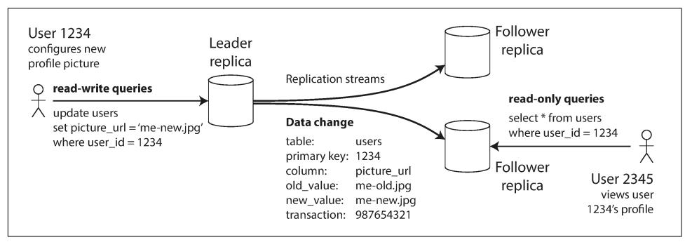

*Figure 5-1. Leader-based (master–slave) replication.*

This mode of replication is a built-in feature of many relational databases, such as PostgreSQL (since version 9.0), MySQL, Oracle Data Guard [[2](#page-214-0)], and SQL Server's AlwaysOn Availability Groups [\[3](#page-214-0)]. It is also used in some nonrelational databases, including MongoDB, RethinkDB, and Espresso [\[4](#page-215-0)]. Finally, leader-based replication is not restricted to only databases: distributed message brokers such as Kafka [[5\]](#page-215-0) and RabbitMQ highly available queues [[6\]](#page-215-0) also use it. Some network filesystems and replicated block devices such as DRBD are similar.

## **Synchronous Versus Asynchronous Replication**

An important detail of a replicated system is whether the replication happens *syn‐ chronously* or *asynchronously*. (In relational databases, this is often a configurable option; other systems are often hardcoded to be either one or the other.)

Think about what happens in Figure 5-1, where the user of a website updates their profile image. At some point in time, the client sends the update request to the leader; shortly afterward, it is received by the leader. At some point, the leader forwards the data change to the followers. Eventually, the leader notifies the client that the update was successful.

[Figure 5-2](#page-175-0) shows the communication between various components of the system: the user's client, the leader, and two followers. Time flows from left to right. A request or response message is shown as a thick arrow.

<span id="page-175-0"></span>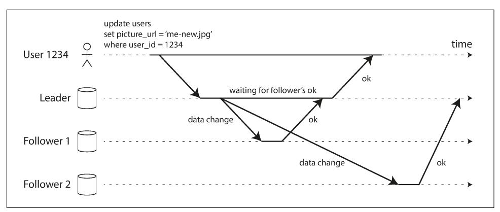

*Figure 5-2. Leader-based replication with one synchronous and one asynchronous fol‐ lower.*

In the example of Figure 5-2, the replication to follower 1 is *synchronous*: the leader waits until follower 1 has confirmed that it received the write before reporting success to the user, and before making the write visible to other clients. The replication to follower 2 is *asynchronous*: the leader sends the message, but doesn't wait for a response from the follower.

The diagram shows that there is a substantial delay before follower 2 processes the message. Normally, replication is quite fast: most database systems apply changes to followers in less than a second. However, there is no guarantee of how long it might take. There are circumstances when followers might fall behind the leader by several minutes or more; for example, if a follower is recovering from a failure, if the system is operating near maximum capacity, or if there are network problems between the nodes.

The advantage of synchronous replication is that the follower is guaranteed to have an up-to-date copy of the data that is consistent with the leader. If the leader sud‐ denly fails, we can be sure that the data is still available on the follower. The disad‐ vantage is that if the synchronous follower doesn't respond (because it has crashed, or there is a network fault, or for any other reason), the write cannot be processed. The leader must block all writes and wait until the synchronous replica is available again.

For that reason, it is impractical for all followers to be synchronous: any one node outage would cause the whole system to grind to a halt. In practice, if you enable syn‐ chronous replication on a database, it usually means that *one* of the followers is syn‐ chronous, and the others are asynchronous. If the synchronous follower becomes unavailable or slow, one of the asynchronous followers is made synchronous. This guarantees that you have an up-to-date copy of the data on at least two nodes: the <span id="page-176-0"></span>leader and one synchronous follower. This configuration is sometimes also called *semi-synchronous* [[7\]](#page-215-0).

Often, leader-based replication is configured to be completely asynchronous. In this case, if the leader fails and is not recoverable, any writes that have not yet been repli‐ cated to followers are lost. This means that a write is not guaranteed to be durable, even if it has been confirmed to the client. However, a fully asynchronous configura‐ tion has the advantage that the leader can continue processing writes, even if all of its followers have fallen behind.

Weakening durability may sound like a bad trade-off, but asynchronous replication is nevertheless widely used, especially if there are many followers or if they are geo‐ graphically distributed. We will return to this issue in ["Problems with Replication](#page-182-0) [Lag" on page 161](#page-182-0).

## **Research on Replication**

It can be a serious problem for asynchronously replicated systems to lose data if the leader fails, so researchers have continued investigating replication methods that do not lose data but still provide good performance and availability. For example, *chain replication* [[8](#page-215-0), [9](#page-215-0)] is a variant of synchronous replication that has been successfully implemented in a few systems such as Microsoft Azure Storage [[10](#page-215-0), [11](#page-215-0)].

There is a strong connection between consistency of replication and *consensus* (get‐ ting several nodes to agree on a value), and we will explore this area of theory in more detail in [Chapter 9.](#page-342-0) In this chapter we will concentrate on the simpler forms of repli‐ cation that are most commonly used in databases in practice.

## **Setting Up New Followers**

From time to time, you need to set up new followers—perhaps to increase the num‐ ber of replicas, or to replace failed nodes. How do you ensure that the new follower has an accurate copy of the leader's data?

Simply copying data files from one node to another is typically not sufficient: clients are constantly writing to the database, and the data is always in flux, so a standard file copy would see different parts of the database at different points in time. The result might not make any sense.

You could make the files on disk consistent by locking the database (making it unavailable for writes), but that would go against our goal of high availability. Fortu‐ nately, setting up a follower can usually be done without downtime. Conceptually, the process looks like this:

- <span id="page-177-0"></span>1. Take a consistent snapshot of the leader's database at some point in time—if pos‐ sible, without taking a lock on the entire database. Most databases have this fea‐ ture, as it is also required for backups. In some cases, third-party tools are needed, such as *innobackupex* for MySQL [\[12\]](#page-215-0).
- 2. Copy the snapshot to the new follower node.
- 3. The follower connects to the leader and requests all the data changes that have happened since the snapshot was taken. This requires that the snapshot is associ‐ ated with an exact position in the leader's replication log. That position has vari‐ ous names: for example, PostgreSQL calls it the *log sequence number*, and MySQL calls it the *binlog coordinates*.
- 4. When the follower has processed the backlog of data changes since the snapshot, we say it has *caught up*. It can now continue to process data changes from the leader as they happen.

The practical steps of setting up a follower vary significantly by database. In some systems the process is fully automated, whereas in others it can be a somewhat arcane multi-step workflow that needs to be manually performed by an administrator.

## **Handling Node Outages**

Any node in the system can go down, perhaps unexpectedly due to a fault, but just as likely due to planned maintenance (for example, rebooting a machine to install a ker‐ nel security patch). Being able to reboot individual nodes without downtime is a big advantage for operations and maintenance. Thus, our goal is to keep the system as a whole running despite individual node failures, and to keep the impact of a node out‐ age as small as possible.

How do you achieve high availability with leader-based replication?

## **Follower failure: Catch-up recovery**

On its local disk, each follower keeps a log of the data changes it has received from the leader. If a follower crashes and is restarted, or if the network between the leader and the follower is temporarily interrupted, the follower can recover quite easily: from its log, it knows the last transaction that was processed before the fault occur‐ red. Thus, the follower can connect to the leader and request all the data changes that occurred during the time when the follower was disconnected. When it has applied these changes, it has caught up to the leader and can continue receiving a stream of data changes as before.

#### <span id="page-178-0"></span>**Leader failure: Failover**

Handling a failure of the leader is trickier: one of the followers needs to be promoted to be the new leader, clients need to be reconfigured to send their writes to the new leader, and the other followers need to start consuming data changes from the new leader. This process is called *failover*.

Failover can happen manually (an administrator is notified that the leader has failed and takes the necessary steps to make a new leader) or automatically. An automatic failover process usually consists of the following steps:

- 1. *Determining that the leader has failed.* There are many things that could poten‐ tially go wrong: crashes, power outages, network issues, and more. There is no foolproof way of detecting what has gone wrong, so most systems simply use a timeout: nodes frequently bounce messages back and forth between each other, and if a node doesn't respond for some period of time—say, 30 seconds—it is assumed to be dead. (If the leader is deliberately taken down for planned mainte‐ nance, this doesn't apply.)
- 2. *Choosing a new leader.* This could be done through an election process (where the leader is chosen by a majority of the remaining replicas), or a new leader could be appointed by a previously elected *controller node*. The best candidate for leadership is usually the replica with the most up-to-date data changes from the old leader (to minimize any data loss). Getting all the nodes to agree on a new leader is a consensus problem, discussed in detail in [Chapter 9](#page-342-0).
- 3. *Reconfiguring the system to use the new leader.* Clients now need to send their write requests to the new leader (we discuss this in ["Request Routing" on](#page-235-0) [page 214\)](#page-235-0). If the old leader comes back, it might still believe that it is the leader, not realizing that the other replicas have forced it to step down. The system needs to ensure that the old leader becomes a follower and recognizes the new leader.

Failover is fraught with things that can go wrong:

- If asynchronous replication is used, the new leader may not have received all the writes from the old leader before it failed. If the former leader rejoins the cluster after a new leader has been chosen, what should happen to those writes? The new leader may have received conflicting writes in the meantime. The most common solution is for the old leader's unreplicated writes to simply be discarded, which may violate clients' durability expectations.
- Discarding writes is especially dangerous if other storage systems outside of the database need to be coordinated with the database contents. For example, in one incident at GitHub [\[13](#page-215-0)], an out-of-date MySQL follower was promoted to leader. The database used an autoincrementing counter to assign primary keys to new

<span id="page-179-0"></span>rows, but because the new leader's counter lagged behind the old leader's, it reused some primary keys that were previously assigned by the old leader. These primary keys were also used in a Redis store, so the reuse of primary keys resul‐ ted in inconsistency between MySQL and Redis, which caused some private data to be disclosed to the wrong users.

- In certain fault scenarios (see [Chapter 8](#page-294-0)), it could happen that two nodes both believe that they are the leader. This situation is called *split brain*, and it is dan‐ gerous: if both leaders accept writes, and there is no process for resolving con‐ flicts (see ["Multi-Leader Replication" on page 168](#page-189-0)), data is likely to be lost or corrupted. As a safety catch, some systems have a mechanism to shut down one node if two leaders are detected.ii However, if this mechanism is not carefully designed, you can end up with both nodes being shut down [[14\]](#page-215-0).
- What is the right timeout before the leader is declared dead? A longer timeout means a longer time to recovery in the case where the leader fails. However, if the timeout is too short, there could be unnecessary failovers. For example, a tempo‐ rary load spike could cause a node's response time to increase above the timeout, or a network glitch could cause delayed packets. If the system is already strug‐ gling with high load or network problems, an unnecessary failover is likely to make the situation worse, not better.

There are no easy solutions to these problems. For this reason, some operations teams prefer to perform failovers manually, even if the software supports automatic failover.

These issues—node failures; unreliable networks; and trade-offs around replica con‐ sistency, durability, availability, and latency—are in fact fundamental problems in distributed systems. In [Chapter 8](#page-294-0) and [Chapter 9](#page-342-0) we will discuss them in greater depth.

## **Implementation of Replication Logs**

How does leader-based replication work under the hood? Several different replica‐ tion methods are used in practice, so let's look at each one briefly.

## **Statement-based replication**

In the simplest case, the leader logs every write request (*statement*) that it executes and sends that statement log to its followers. For a relational database, this means that every INSERT, UPDATE, or DELETE statement is forwarded to followers, and each

ii. This approach is known as *fencing* or, more emphatically, *Shoot The Other Node In The Head* (STONITH). We will discuss fencing in more detail in ["The leader and the lock" on page 301](#page-322-0).

<span id="page-180-0"></span>follower parses and executes that SQL statement as if it had been received from a client.

Although this may sound reasonable, there are various ways in which this approach to replication can break down:

- Any statement that calls a nondeterministic function, such as NOW() to get the current date and time or RAND() to get a random number, is likely to generate a different value on each replica.
- If statements use an autoincrementing column, or if they depend on the existing data in the database (e.g., UPDATE … WHERE *<some condition>*), they must be executed in exactly the same order on each replica, or else they may have a differ‐ ent effect. This can be limiting when there are multiple concurrently executing transactions.
- Statements that have side effects (e.g., triggers, stored procedures, user-defined functions) may result in different side effects occurring on each replica, unless the side effects are absolutely deterministic.

It is possible to work around those issues—for example, the leader can replace any nondeterministic function calls with a fixed return value when the statement is log‐ ged so that the followers all get the same value. However, because there are so many edge cases, other replication methods are now generally preferred.

Statement-based replication was used in MySQL before version 5.1. It is still some‐ times used today, as it is quite compact, but by default MySQL now switches to rowbased replication (discussed shortly) if there is any nondeterminism in a statement. VoltDB uses statement-based replication, and makes it safe by requiring transactions to be deterministic [[15](#page-215-0)].

## **Write-ahead log (WAL) shipping**

In [Chapter 3](#page-90-0) we discussed how storage engines represent data on disk, and we found that usually every write is appended to a log:

- In the case of a log-structured storage engine (see ["SSTables and LSM-Trees" on](#page-97-0) [page 76](#page-97-0)), this log is the main place for storage. Log segments are compacted and garbage-collected in the background.
- In the case of a B-tree (see ["B-Trees" on page 79\)](#page-100-0), which overwrites individual disk blocks, every modification is first written to a write-ahead log so that the index can be restored to a consistent state after a crash.

In either case, the log is an append-only sequence of bytes containing all writes to the database. We can use the exact same log to build a replica on another node: besides writing the log to disk, the leader also sends it across the network to its followers. <span id="page-181-0"></span>When the follower processes this log, it builds a copy of the exact same data struc‐ tures as found on the leader.

This method of replication is used in PostgreSQL and Oracle, among others [[16\]](#page-215-0). The main disadvantage is that the log describes the data on a very low level: a WAL con‐ tains details of which bytes were changed in which disk blocks. This makes replica‐ tion closely coupled to the storage engine. If the database changes its storage format from one version to another, it is typically not possible to run different versions of the database software on the leader and the followers.

That may seem like a minor implementation detail, but it can have a big operational impact. If the replication protocol allows the follower to use a newer software version than the leader, you can perform a zero-downtime upgrade of the database software by first upgrading the followers and then performing a failover to make one of the upgraded nodes the new leader. If the replication protocol does not allow this version mismatch, as is often the case with WAL shipping, such upgrades require downtime.

## **Logical (row-based) log replication**

An alternative is to use different log formats for replication and for the storage engine, which allows the replication log to be decoupled from the storage engine internals. This kind of replication log is called a *logical log*, to distinguish it from the storage engine's (*physical*) data representation.

A logical log for a relational database is usually a sequence of records describing writes to database tables at the granularity of a row:

- For an inserted row, the log contains the new values of all columns.
- For a deleted row, the log contains enough information to uniquely identify the row that was deleted. Typically this would be the primary key, but if there is no primary key on the table, the old values of all columns need to be logged.
- For an updated row, the log contains enough information to uniquely identify the updated row, and the new values of all columns (or at least the new values of all columns that changed).

A transaction that modifies several rows generates several such log records, followed by a record indicating that the transaction was committed. MySQL's binlog (when configured to use row-based replication) uses this approach [[17\]](#page-215-0).

Since a logical log is decoupled from the storage engine internals, it can more easily be kept backward compatible, allowing the leader and the follower to run different versions of the database software, or even different storage engines.

A logical log format is also easier for external applications to parse. This aspect is use‐ ful if you want to send the contents of a database to an external system, such as a data <span id="page-182-0"></span>warehouse for offline analysis, or for building custom indexes and caches [[18](#page-215-0)]. This technique is called *change data capture*, and we will return to it in [Chapter 11](#page-460-0).

#### **Trigger-based replication**

The replication approaches described so far are implemented by the database system, without involving any application code. In many cases, that's what you want—but there are some circumstances where more flexibility is needed. For example, if you want to only replicate a subset of the data, or want to replicate from one kind of database to another, or if you need conflict resolution logic (see ["Handling Write](#page-192-0) [Conflicts" on page 171\)](#page-192-0), then you may need to move replication up to the application layer.

Some tools, such as Oracle GoldenGate [\[19](#page-215-0)], can make data changes available to an application by reading the database log. An alternative is to use features that are available in many relational databases: *triggers* and *stored procedures*.

A trigger lets you register custom application code that is automatically executed when a data change (write transaction) occurs in a database system. The trigger has the opportunity to log this change into a separate table, from which it can be read by an external process. That external process can then apply any necessary application logic and replicate the data change to another system. Databus for Oracle [[20\]](#page-215-0) and Bucardo for Postgres [\[21](#page-216-0)] work like this, for example.

Trigger-based replication typically has greater overheads than other replication methods, and is more prone to bugs and limitations than the database's built-in repli‐ cation. However, it can nevertheless be useful due to its flexibility.

## **Problems with Replication Lag**

Being able to tolerate node failures is just one reason for wanting replication. As mentioned in the introduction to [Part II](#page-166-0), other reasons are scalability (processing more requests than a single machine can handle) and latency (placing replicas geo‐ graphically closer to users).

Leader-based replication requires all writes to go through a single node, but readonly queries can go to any replica. For workloads that consist of mostly reads and only a small percentage of writes (a common pattern on the web), there is an attrac‐ tive option: create many followers, and distribute the read requests across those fol‐ lowers. This removes load from the leader and allows read requests to be served by nearby replicas.

In this *read-scaling* architecture, you can increase the capacity for serving read-only requests simply by adding more followers. However, this approach only realistically works with asynchronous replication—if you tried to synchronously replicate to all followers, a single node failure or network outage would make the entire system <span id="page-183-0"></span>unavailable for writing. And the more nodes you have, the likelier it is that one will be down, so a fully synchronous configuration would be very unreliable.

Unfortunately, if an application reads from an *asynchronous* follower, it may see out‐ dated information if the follower has fallen behind. This leads to apparent inconsis‐ tencies in the database: if you run the same query on the leader and a follower at the same time, you may get different results, because not all writes have been reflected in the follower. This inconsistency is just a temporary state—if you stop writing to the database and wait a while, the followers will eventually catch up and become consis‐ tent with the leader. For that reason, this effect is known as *eventual consistency* [[22,](#page-216-0) [23](#page-216-0)].iii

The term "eventually" is deliberately vague: in general, there is no limit to how far a replica can fall behind. In normal operation, the delay between a write happening on the leader and being reflected on a follower—the *replication lag*—may be only a frac‐ tion of a second, and not noticeable in practice. However, if the system is operating near capacity or if there is a problem in the network, the lag can easily increase to several seconds or even minutes.

When the lag is so large, the inconsistencies it introduces are not just a theoretical issue but a real problem for applications. In this section we will highlight three exam‐ ples of problems that are likely to occur when there is replication lag and outline some approaches to solving them.

## **Reading Your Own Writes**

Many applications let the user submit some data and then view what they have sub‐ mitted. This might be a record in a customer database, or a comment on a discussion thread, or something else of that sort. When new data is submitted, it must be sent to the leader, but when the user views the data, it can be read from a follower. This is especially appropriate if data is frequently viewed but only occasionally written.

With asynchronous replication, there is a problem, illustrated in [Figure 5-3:](#page-184-0) if the user views the data shortly after making a write, the new data may not yet have reached the replica. To the user, it looks as though the data they submitted was lost, so they will be understandably unhappy.

iii. The term *eventual consistency* was coined by Douglas Terry et al. [[24\]](#page-216-0), popularized by Werner Vogels [[22](#page-216-0)], and became the battle cry of many NoSQL projects. However, not only NoSQL databases are eventually consistent: followers in an asynchronously replicated relational database have the same characteristics.

<span id="page-184-0"></span>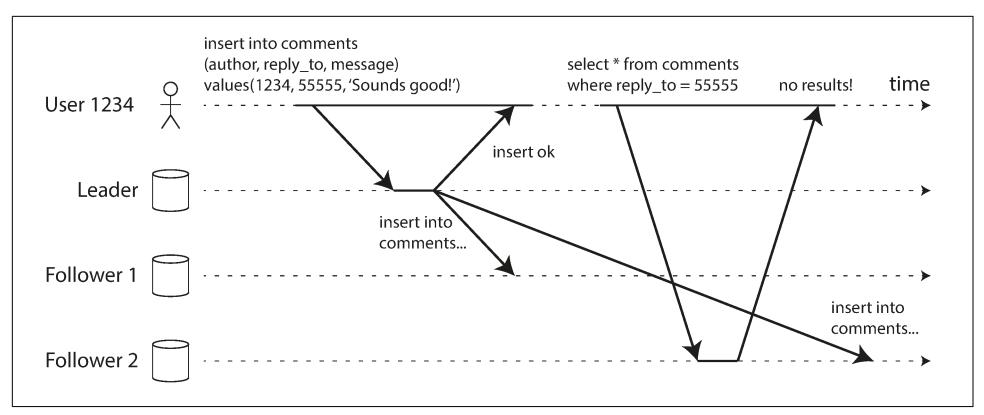

*Figure 5-3. A user makes a write, followed by a read from a stale replica. To prevent this anomaly, we need read-after-write consistency.*

In this situation, we need *read-after-write consistency*, also known as *read-your-writes consistency* [[24\]](#page-216-0). This is a guarantee that if the user reloads the page, they will always see any updates they submitted themselves. It makes no promises about other users: other users' updates may not be visible until some later time. However, it reassures the user that their own input has been saved correctly.

How can we implement read-after-write consistency in a system with leader-based replication? There are various possible techniques. To mention a few:

- When reading something that the user may have modified, read it from the leader; otherwise, read it from a follower. This requires that you have some way of knowing whether something might have been modified, without actually querying it. For example, user profile information on a social network is nor‐ mally only editable by the owner of the profile, not by anybody else. Thus, a sim‐ ple rule is: always read the user's own profile from the leader, and any other users' profiles from a follower.
- If most things in the application are potentially editable by the user, that approach won't be effective, as most things would have to be read from the leader (negating the benefit of read scaling). In that case, other criteria may be used to decide whether to read from the leader. For example, you could track the time of the last update and, for one minute after the last update, make all reads from the leader. You could also monitor the replication lag on followers and pre‐ vent queries on any follower that is more than one minute behind the leader.
- The client can remember the timestamp of its most recent write—then the sys‐ tem can ensure that the replica serving any reads for that user reflects updates at least until that timestamp. If a replica is not sufficiently up to date, either the read can be handled by another replica or the query can wait until the replica has

<span id="page-185-0"></span>caught up. The timestamp could be a *logical timestamp* (something that indicates ordering of writes, such as the log sequence number) or the actual system clock (in which case clock synchronization becomes critical; see ["Unreliable Clocks"](#page-308-0) [on page 287](#page-308-0)).

• If your replicas are distributed across multiple datacenters (for geographical proximity to users or for availability), there is additional complexity. Any request that needs to be served by the leader must be routed to the datacenter that con‐ tains the leader.

Another complication arises when the same user is accessing your service from mul‐ tiple devices, for example a desktop web browser and a mobile app. In this case you may want to provide *cross-device* read-after-write consistency: if the user enters some information on one device and then views it on another device, they should see the information they just entered.

In this case, there are some additional issues to consider:

- Approaches that require remembering the timestamp of the user's last update become more difficult, because the code running on one device doesn't know what updates have happened on the other device. This metadata will need to be centralized.
- If your replicas are distributed across different datacenters, there is no guarantee that connections from different devices will be routed to the same datacenter. (For example, if the user's desktop computer uses the home broadband connec‐ tion and their mobile device uses the cellular data network, the devices' network routes may be completely different.) If your approach requires reading from the leader, you may first need to route requests from all of a user's devices to the same datacenter.

## **Monotonic Reads**

Our second example of an anomaly that can occur when reading from asynchronous followers is that it's possible for a user to see things *moving backward in time*.

This can happen if a user makes several reads from different replicas. For example, [Figure 5-4](#page-186-0) shows user 2345 making the same query twice, first to a follower with little lag, then to a follower with greater lag. (This scenario is quite likely if the user refreshes a web page, and each request is routed to a random server.) The first query returns a comment that was recently added by user 1234, but the second query doesn't return anything because the lagging follower has not yet picked up that write. In effect, the second query is observing the system at an earlier point in time than the first query. This wouldn't be so bad if the first query hadn't returned anything, because user 2345 probably wouldn't know that user 1234 had recently added a com‐

<span id="page-186-0"></span>ment. However, it's very confusing for user 2345 if they first see user 1234's comment appear, and then see it disappear again.

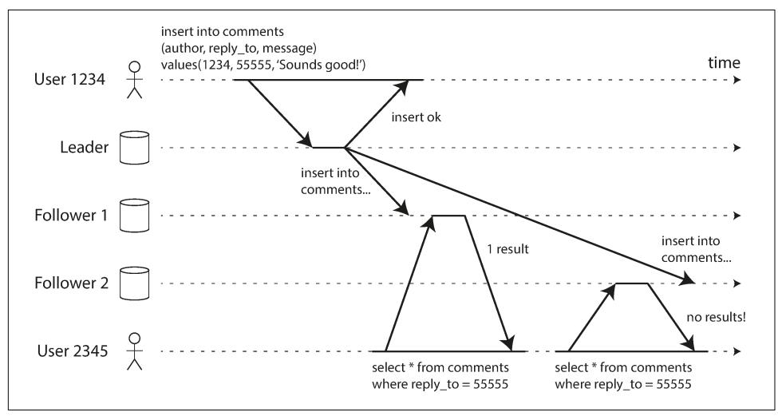

*Figure 5-4. A user first reads from a fresh replica, then from a stale replica. Time appears to go backward. To prevent this anomaly, we need monotonic reads.*

*Monotonic reads* [\[23\]](#page-216-0) is a guarantee that this kind of anomaly does not happen. It's a lesser guarantee than strong consistency, but a stronger guarantee than eventual con‐ sistency. When you read data, you may see an old value; monotonic reads only means that if one user makes several reads in sequence, they will not see time go backward i.e., they will not read older data after having previously read newer data.

One way of achieving monotonic reads is to make sure that each user always makes their reads from the same replica (different users can read from different replicas). For example, the replica can be chosen based on a hash of the user ID, rather than randomly. However, if that replica fails, the user's queries will need to be rerouted to another replica.

## **Consistent Prefix Reads**

Our third example of replication lag anomalies concerns violation of causality. Imag‐ ine the following short dialog between Mr. Poons and Mrs. Cake:

*Mr. Poons*

How far into the future can you see, Mrs. Cake?

*Mrs. Cake*

About ten seconds usually, Mr. Poons.

<span id="page-187-0"></span>There is a causal dependency between those two sentences: Mrs. Cake heard Mr. Poons's question and answered it.

Now, imagine a third person is listening to this conversation through followers. The things said by Mrs. Cake go through a follower with little lag, but the things said by Mr. Poons have a longer replication lag (see Figure 5-5). This observer would hear the following:

*Mrs. Cake*

About ten seconds usually, Mr. Poons.

*Mr. Poons*

How far into the future can you see, Mrs. Cake?

To the observer it looks as though Mrs. Cake is answering the question before Mr. Poons has even asked it. Such psychic powers are impressive, but very confusing [\[25](#page-216-0)].

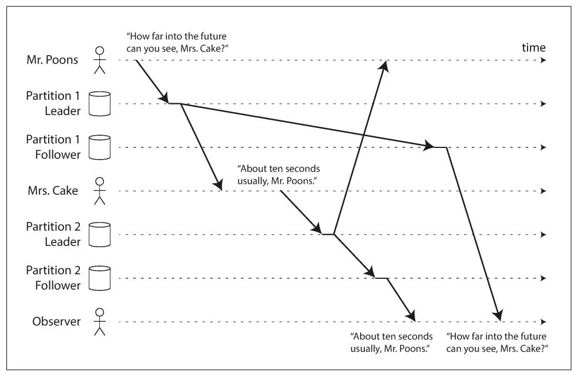

*Figure 5-5. If some partitions are replicated slower than others, an observer may see the answer before they see the question.*

Preventing this kind of anomaly requires another type of guarantee: *consistent prefix reads* [\[23](#page-216-0)]. This guarantee says that if a sequence of writes happens in a certain order, then anyone reading those writes will see them appear in the same order.

This is a particular problem in partitioned (sharded) databases, which we will discuss in [Chapter 6](#page-220-0). If the database always applies writes in the same order, reads always see a consistent prefix, so this anomaly cannot happen. However, in many distributed <span id="page-188-0"></span>databases, different partitions operate independently, so there is no global ordering of writes: when a user reads from the database, they may see some parts of the database in an older state and some in a newer state.

One solution is to make sure that any writes that are causally related to each other are written to the same partition—but in some applications that cannot be done effi‐ ciently. There are also algorithms that explicitly keep track of causal dependencies, a topic that we will return to in ["The "happens-before" relationship and concurrency"](#page-207-0) [on page 186](#page-207-0).

## **Solutions for Replication Lag**

When working with an eventually consistent system, it is worth thinking about how the application behaves if the replication lag increases to several minutes or even hours. If the answer is "no problem," that's great. However, if the result is a bad expe‐ rience for users, it's important to design the system to provide a stronger guarantee, such as read-after-write. Pretending that replication is synchronous when in fact it is asynchronous is a recipe for problems down the line.

As discussed earlier, there are ways in which an application can provide a stronger guarantee than the underlying database—for example, by performing certain kinds of reads on the leader. However, dealing with these issues in application code is com‐ plex and easy to get wrong.

It would be better if application developers didn't have to worry about subtle replica‐ tion issues and could just trust their databases to "do the right thing." This is why *transactions* exist: they are a way for a database to provide stronger guarantees so that the application can be simpler.

Single-node transactions have existed for a long time. However, in the move to dis‐ tributed (replicated and partitioned) databases, many systems have abandoned them, claiming that transactions are too expensive in terms of performance and availability, and asserting that eventual consistency is inevitable in a scalable system. There is some truth in that statement, but it is overly simplistic, and we will develop a more nuanced view over the course of the rest of this book. We will return to the topic of transactions in Chapters [7](#page-242-0) and [9,](#page-342-0) and we will discuss some alternative mechanisms in [Part III.](#page-406-0)

## <span id="page-189-0"></span>**Multi-Leader Replication**

So far in this chapter we have only considered replication architectures using a single leader. Although that is a common approach, there are interesting alternatives.

Leader-based replication has one major downside: there is only one leader, and all writes must go through it.iv If you can't connect to the leader for any reason, for example due to a network interruption between you and the leader, you can't write to the database.

A natural extension of the leader-based replication model is to allow more than one node to accept writes. Replication still happens in the same way: each node that pro‐ cesses a write must forward that data change to all the other nodes. We call this a *multi-leader* configuration (also known as *master–master* or *active/active replication*). In this setup, each leader simultaneously acts as a follower to the other leaders.

## **Use Cases for Multi-Leader Replication**

It rarely makes sense to use a multi-leader setup within a single datacenter, because the benefits rarely outweigh the added complexity. However, there are some situa‐ tions in which this configuration is reasonable.

## **Multi-datacenter operation**

Imagine you have a database with replicas in several different datacenters (perhaps so that you can tolerate failure of an entire datacenter, or perhaps in order to be closer to your users). With a normal leader-based replication setup, the leader has to be in *one* of the datacenters, and all writes must go through that datacenter.

In a multi-leader configuration, you can have a leader in *each* datacenter. [Figure 5-6](#page-190-0) shows what this architecture might look like. Within each datacenter, regular leader– follower replication is used; between datacenters, each datacenter's leader replicates its changes to the leaders in other datacenters.

iv. If the database is partitioned (see [Chapter 6\)](#page-220-0), each partition has one leader. Different partitions may have their leaders on different nodes, but each partition must nevertheless have one leader node.

<span id="page-190-0"></span>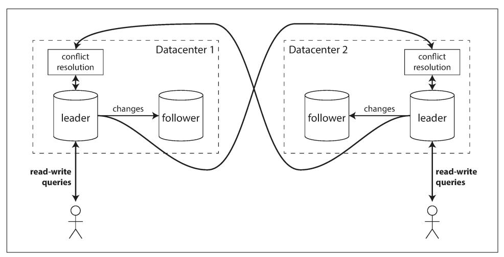

*Figure 5-6. Multi-leader replication across multiple datacenters.*

Let's compare how the single-leader and multi-leader configurations fare in a multidatacenter deployment:

## *Performance*

In a single-leader configuration, every write must go over the internet to the datacenter with the leader. This can add significant latency to writes and might contravene the purpose of having multiple datacenters in the first place. In a multi-leader configuration, every write can be processed in the local datacenter and is replicated asynchronously to the other datacenters. Thus, the interdatacenter network delay is hidden from users, which means the perceived per‐ formance may be better.

## *Tolerance of datacenter outages*

In a single-leader configuration, if the datacenter with the leader fails, failover can promote a follower in another datacenter to be leader. In a multi-leader con‐ figuration, each datacenter can continue operating independently of the others, and replication catches up when the failed datacenter comes back online.

## *Tolerance of network problems*

Traffic between datacenters usually goes over the public internet, which may be less reliable than the local network within a datacenter. A single-leader configu‐ ration is very sensitive to problems in this inter-datacenter link, because writes are made synchronously over this link. A multi-leader configuration with asyn‐ chronous replication can usually tolerate network problems better: a temporary network interruption does not prevent writes being processed.

<span id="page-191-0"></span>Some databases support multi-leader configurations by default, but it is also often implemented with external tools, such as Tungsten Replicator for MySQL [[26\]](#page-216-0), BDR for PostgreSQL [[27\]](#page-216-0), and GoldenGate for Oracle [[19\]](#page-215-0).

Although multi-leader replication has advantages, it also has a big downside: the same data may be concurrently modified in two different datacenters, and those write conflicts must be resolved (indicated as "conflict resolution" in [Figure 5-6\)](#page-190-0). We will discuss this issue in ["Handling Write Conflicts" on page 171.](#page-192-0)

As multi-leader replication is a somewhat retrofitted feature in many databases, there are often subtle configuration pitfalls and surprising interactions with other database features. For example, autoincrementing keys, triggers, and integrity constraints can be problematic. For this reason, multi-leader replication is often considered danger‐ ous territory that should be avoided if possible [[28](#page-216-0)].

## **Clients with offline operation**

Another situation in which multi-leader replication is appropriate is if you have an application that needs to continue to work while it is disconnected from the internet.

For example, consider the calendar apps on your mobile phone, your laptop, and other devices. You need to be able to see your meetings (make read requests) and enter new meetings (make write requests) at any time, regardless of whether your device currently has an internet connection. If you make any changes while you are offline, they need to be synced with a server and your other devices when the device is next online.

In this case, every device has a local database that acts as a leader (it accepts write requests), and there is an asynchronous multi-leader replication process (sync) between the replicas of your calendar on all of your devices. The replication lag may be hours or even days, depending on when you have internet access available.

From an architectural point of view, this setup is essentially the same as multi-leader replication between datacenters, taken to the extreme: each device is a "datacenter," and the network connection between them is extremely unreliable. As the rich his‐ tory of broken calendar sync implementations demonstrates, multi-leader replication is a tricky thing to get right.

There are tools that aim to make this kind of multi-leader configuration easier. For example, CouchDB is designed for this mode of operation [[29\]](#page-216-0).

## **Collaborative editing**

*Real-time collaborative editing* applications allow several people to edit a document simultaneously. For example, Etherpad [\[30](#page-216-0)] and Google Docs [[31\]](#page-216-0) allow multiple people to concurrently edit a text document or spreadsheet (the algorithm is briefly discussed in ["Automatic Conflict Resolution" on page 174](#page-195-0)).

<span id="page-192-0"></span>We don't usually think of collaborative editing as a database replication problem, but it has a lot in common with the previously mentioned offline editing use case. When one user edits a document, the changes are instantly applied to their local replica (the state of the document in their web browser or client application) and asynchronously replicated to the server and any other users who are editing the same document.

If you want to guarantee that there will be no editing conflicts, the application must obtain a lock on the document before a user can edit it. If another user wants to edit the same document, they first have to wait until the first user has committed their changes and released the lock. This collaboration model is equivalent to single-leader replication with transactions on the leader.

However, for faster collaboration, you may want to make the unit of change very small (e.g., a single keystroke) and avoid locking. This approach allows multiple users to edit simultaneously, but it also brings all the challenges of multi-leader replication, including requiring conflict resolution [[32\]](#page-216-0).

## **Handling Write Conflicts**

The biggest problem with multi-leader replication is that write conflicts can occur, which means that conflict resolution is required.

For example, consider a wiki page that is simultaneously being edited by two users, as shown in Figure 5-7. User 1 changes the title of the page from A to B, and user 2 changes the title from A to C at the same time. Each user's change is successfully applied to their local leader. However, when the changes are asynchronously replica‐ ted, a conflict is detected [[33](#page-216-0)]. This problem does not occur in a single-leader data‐ base.

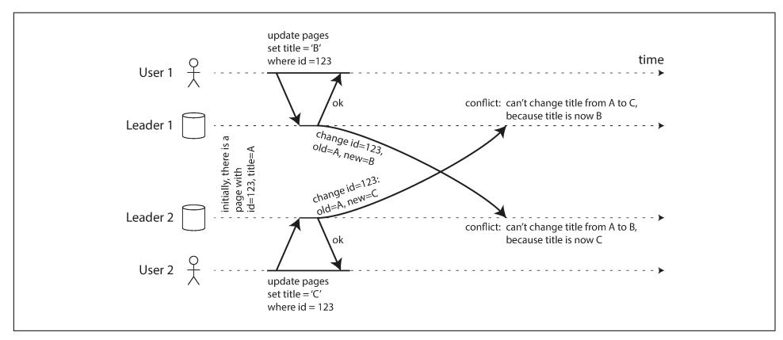

*Figure 5-7. A write conflict caused by two leaders concurrently updating the same record.*

## <span id="page-193-0"></span>**Synchronous versus asynchronous conflict detection**

In a single-leader database, the second writer will either block and wait for the first write to complete, or abort the second write transaction, forcing the user to retry the write. On the other hand, in a multi-leader setup, both writes are successful, and the conflict is only detected asynchronously at some later point in time. At that time, it may be too late to ask the user to resolve the conflict.

In principle, you could make the conflict detection synchronous—i.e., wait for the write to be replicated to all replicas before telling the user that the write was success‐ ful. However, by doing so, you would lose the main advantage of multi-leader repli‐ cation: allowing each replica to accept writes independently. If you want synchronous conflict detection, you might as well just use single-leader replication.

## **Conflict avoidance**

The simplest strategy for dealing with conflicts is to avoid them: if the application can ensure that all writes for a particular record go through the same leader, then con‐ flicts cannot occur. Since many implementations of multi-leader replication handle conflicts quite poorly, avoiding conflicts is a frequently recommended approach [[34](#page-216-0)].

For example, in an application where a user can edit their own data, you can ensure that requests from a particular user are always routed to the same datacenter and use the leader in that datacenter for reading and writing. Different users may have differ‐ ent "home" datacenters (perhaps picked based on geographic proximity to the user), but from any one user's point of view the configuration is essentially single-leader.

However, sometimes you might want to change the designated leader for a record perhaps because one datacenter has failed and you need to reroute traffic to another datacenter, or perhaps because a user has moved to a different location and is now closer to a different datacenter. In this situation, conflict avoidance breaks down, and you have to deal with the possibility of concurrent writes on different leaders.

#### **Converging toward a consistent state**

A single-leader database applies writes in a sequential order: if there are several updates to the same field, the last write determines the final value of the field.

In a multi-leader configuration, there is no defined ordering of writes, so it's not clear what the final value should be. In [Figure 5-7,](#page-192-0) at leader 1 the title is first updated to B and then to C; at leader 2 it is first updated to C and then to B. Neither order is "more correct" than the other.

If each replica simply applied writes in the order that it saw the writes, the database would end up in an inconsistent state: the final value would be C at leader 1 and B at leader 2. That is not acceptable—every replication scheme must ensure that the data is eventually the same in all replicas. Thus, the database must resolve the conflict in a

<span id="page-194-0"></span>*convergent* way, which means that all replicas must arrive at the same final value when all changes have been replicated.

There are various ways of achieving convergent conflict resolution:

- Give each write a unique ID (e.g., a timestamp, a long random number, a UUID, or a hash of the key and value), pick the write with the highest ID as the *winner*, and throw away the other writes. If a timestamp is used, this technique is known as *last write wins* (LWW). Although this approach is popular, it is dangerously prone to data loss [\[35](#page-216-0)]. We will discuss LWW in more detail at the end of this chapter (["Detecting Concurrent Writes" on page 184](#page-205-0)).
- Give each replica a unique ID, and let writes that originated at a highernumbered replica always take precedence over writes that originated at a lowernumbered replica. This approach also implies data loss.
- Somehow merge the values together—e.g., order them alphabetically and then concatenate them (in [Figure 5-7,](#page-192-0) the merged title might be something like "B/C").
- Record the conflict in an explicit data structure that preserves all information, and write application code that resolves the conflict at some later time (perhaps by prompting the user).

## **Custom conflict resolution logic**

As the most appropriate way of resolving a conflict may depend on the application, most multi-leader replication tools let you write conflict resolution logic using appli‐ cation code. That code may be executed on write or on read:

#### *On write*

As soon as the database system detects a conflict in the log of replicated changes, it calls the conflict handler. For example, Bucardo allows you to write a snippet of Perl for this purpose. This handler typically cannot prompt a user—it runs in a background process and it must execute quickly.

#### *On read*

When a conflict is detected, all the conflicting writes are stored. The next time the data is read, these multiple versions of the data are returned to the applica‐ tion. The application may prompt the user or automatically resolve the conflict, and write the result back to the database. CouchDB works this way, for example.

Note that conflict resolution usually applies at the level of an individual row or docu‐ ment, not for an entire transaction [\[36](#page-216-0)]. Thus, if you have a transaction that atomi‐ cally makes several different writes (see [Chapter 7](#page-242-0)), each write is still considered separately for the purposes of conflict resolution.

## **Automatic Conflict Resolution**

<span id="page-195-0"></span>Conflict resolution rules can quickly become complicated, and custom code can be error-prone. Amazon is a frequently cited example of surprising effects due to a con‐ flict resolution handler: for some time, the conflict resolution logic on the shopping cart would preserve items added to the cart, but not items removed from the cart. Thus, customers would sometimes see items reappearing in their carts even though they had previously been removed [[37](#page-217-0)].

There has been some interesting research into automatically resolving conflicts caused by concurrent data modifications. A few lines of research are worth mention‐ ing:

- *Conflict-free replicated datatypes* (CRDTs) [[32](#page-216-0), [38](#page-217-0)] are a family of data structures for sets, maps, ordered lists, counters, etc. that can be concurrently edited by multiple users, and which automatically resolve conflicts in sensible ways. Some CRDTs have been implemented in Riak 2.0 [[39](#page-217-0), [40](#page-217-0)].
- *Mergeable persistent data structures* [[41](#page-217-0)] track history explicitly, similarly to the Git version control system, and use a three-way merge function (whereas CRDTs use two-way merges).
- *Operational transformation* [[42](#page-217-0)] is the conflict resolution algorithm behind col‐ laborative editing applications such as Etherpad [[30](#page-216-0)] and Google Docs [[31](#page-216-0)]. It was designed particularly for concurrent editing of an ordered list of items, such as the list of characters that constitute a text document.

Implementations of these algorithms in databases are still young, but it's likely that they will be integrated into more replicated data systems in the future. Automatic conflict resolution could make multi-leader data synchronization much simpler for applications to deal with.

## **What is a conflict?**

Some kinds of conflict are obvious. In the example in [Figure 5-7,](#page-192-0) two writes concur‐ rently modified the same field in the same record, setting it to two different values. There is little doubt that this is a conflict.

Other kinds of conflict can be more subtle to detect. For example, consider a meeting room booking system: it tracks which room is booked by which group of people at which time. This application needs to ensure that each room is only booked by one group of people at any one time (i.e., there must not be any overlapping bookings for the same room). In this case, a conflict may arise if two different bookings are created for the same room at the same time. Even if the application checks availability before

<span id="page-196-0"></span>allowing a user to make a booking, there can be a conflict if the two bookings are made on two different leaders.

There isn't a quick ready-made answer, but in the following chapters we will trace a path toward a good understanding of this problem. We will see some more examples of conflicts in [Chapter 7](#page-242-0), and in [Chapter 12](#page-510-0) we will discuss scalable approaches for detecting and resolving conflicts in a replicated system.

## **Multi-Leader Replication Topologies**

A *replication topology* describes the communication paths along which writes are propagated from one node to another. If you have two leaders, like in [Figure 5-7,](#page-192-0) there is only one plausible topology: leader 1 must send all of its writes to leader 2, and vice versa. With more than two leaders, various different topologies are possible. Some examples are illustrated in Figure 5-8.

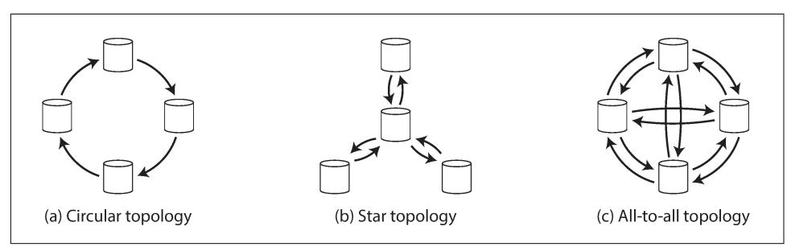

*Figure 5-8. Three example topologies in which multi-leader replication can be set up.*

The most general topology is *all-to-all* (Figure 5-8 [c]), in which every leader sends its writes to every other leader. However, more restricted topologies are also used: for example, MySQL by default supports only a *circular topology* [[34\]](#page-216-0), in which each node receives writes from one node and forwards those writes (plus any writes of its own) to one other node. Another popular topology has the shape of a *star*: v one desig‐ nated root node forwards writes to all of the other nodes. The star topology can be generalized to a tree.

In circular and star topologies, a write may need to pass through several nodes before it reaches all replicas. Therefore, nodes need to forward data changes they receive from other nodes. To prevent infinite replication loops, each node is given a unique identifier, and in the replication log, each write is tagged with the identifiers of all the nodes it has passed through [[43\]](#page-217-0). When a node receives a data change that is tagged

v. Not to be confused with a *star schema* (see ["Stars and Snowflakes: Schemas for Analytics" on page 93\)](#page-114-0), which describes the structure of a data model, not the communication topology between nodes.

<span id="page-197-0"></span>with its own identifier, that data change is ignored, because the node knows that it has already been processed.

A problem with circular and star topologies is that if just one node fails, it can inter‐ rupt the flow of replication messages between other nodes, causing them to be unable to communicate until the node is fixed. The topology could be reconfigured to work around the failed node, but in most deployments such reconfiguration would have to be done manually. The fault tolerance of a more densely connected topology (such as all-to-all) is better because it allows messages to travel along different paths, avoiding a single point of failure.

On the other hand, all-to-all topologies can have issues too. In particular, some net‐ work links may be faster than others (e.g., due to network congestion), with the result that some replication messages may "overtake" others, as illustrated in Figure 5-9.

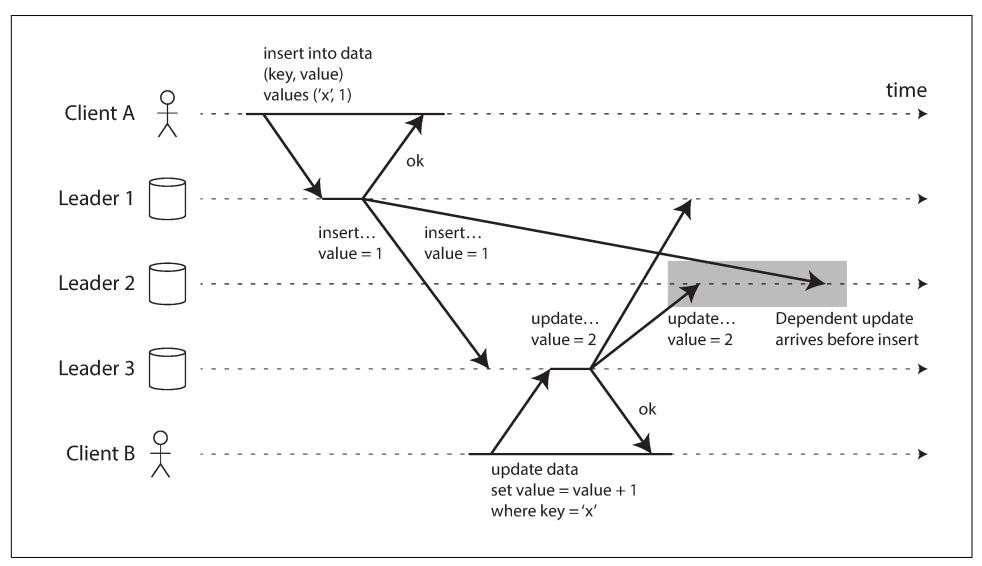

*Figure 5-9. With multi-leader replication, writes may arrive in the wrong order at some replicas.*

In Figure 5-9, client A inserts a row into a table on leader 1, and client B updates that row on leader 3. However, leader 2 may receive the writes in a different order: it may first receive the update (which, from its point of view, is an update to a row that does not exist in the database) and only later receive the corresponding insert (which should have preceded the update).

This is a problem of causality, similar to the one we saw in ["Consistent Prefix Reads"](#page-186-0) [on page 165](#page-186-0): the update depends on the prior insert, so we need to make sure that all nodes process the insert first, and then the update. Simply attaching a timestamp to

<span id="page-198-0"></span>every write is not sufficient, because clocks cannot be trusted to be sufficiently in sync to correctly order these events at leader 2 (see [Chapter 8](#page-294-0)).

To order these events correctly, a technique called *version vectors* can be used, which we will discuss later in this chapter (see ["Detecting Concurrent Writes"](#page-205-0) on page 184). However, conflict detection techniques are poorly implemented in many multi-leader replication systems. For example, at the time of writing, PostgreSQL BDR does not provide causal ordering of writes [\[27](#page-216-0)], and Tungsten Replicator for MySQL doesn't even try to detect conflicts [\[34\]](#page-216-0).

If you are using a system with multi-leader replication, it is worth being aware of these issues, carefully reading the documentation, and thoroughly testing your data‐ base to ensure that it really does provide the guarantees you believe it to have.

## **Leaderless Replication**

The replication approaches we have discussed so far in this chapter—single-leader and multi-leader replication—are based on the idea that a client sends a write request to one node (the leader), and the database system takes care of copying that write to the other replicas. A leader determines the order in which writes should be processed, and followers apply the leader's writes in the same order.

Some data storage systems take a different approach, abandoning the concept of a leader and allowing any replica to directly accept writes from clients. Some of the ear‐ liest replicated data systems were leaderless [\[1](#page-214-0), [44\]](#page-217-0), but the idea was mostly forgotten during the era of dominance of relational databases. It once again became a fashiona‐ ble architecture for databases after Amazon used it for its in-house *Dynamo* system [[37\]](#page-217-0).vi Riak, Cassandra, and Voldemort are open source datastores with leaderless replication models inspired by Dynamo, so this kind of database is also known as *Dynamo-style*.

In some leaderless implementations, the client directly sends its writes to several rep‐ licas, while in others, a coordinator node does this on behalf of the client. However, unlike a leader database, that coordinator does not enforce a particular ordering of writes. As we shall see, this difference in design has profound consequences for the way the database is used.

## **Writing to the Database When a Node Is Down**

Imagine you have a database with three replicas, and one of the replicas is currently unavailable—perhaps it is being rebooted to install a system update. In a leader-based

vi. Dynamo is not available to users outside of Amazon. Confusingly, AWS offers a hosted database product called *DynamoDB*, which uses a completely different architecture: it is based on single-leader replication.

<span id="page-199-0"></span>configuration, if you want to continue processing writes, you may need to perform a failover (see ["Handling Node Outages" on page 156\)](#page-177-0).

On the other hand, in a leaderless configuration, failover does not exist. Figure 5-10 shows what happens: the client (user 1234) sends the write to all three replicas in par‐ allel, and the two available replicas accept the write but the unavailable replica misses it. Let's say that it's sufficient for two out of three replicas to acknowledge the write: after user 1234 has received two *ok* responses, we consider the write to be successful. The client simply ignores the fact that one of the replicas missed the write.

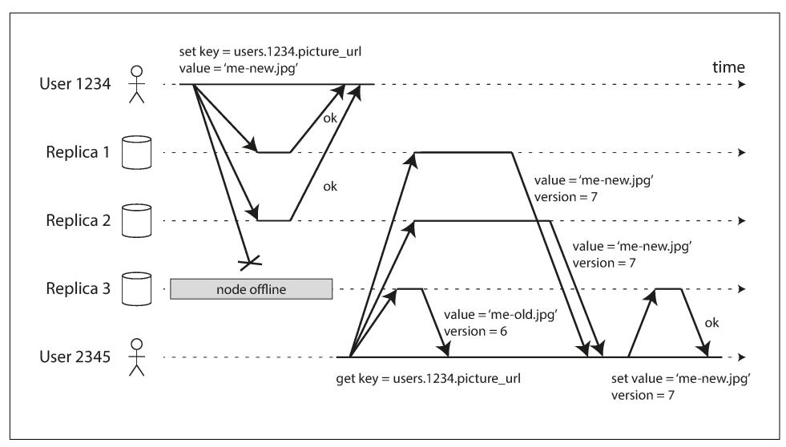

*Figure 5-10. A quorum write, quorum read, and read repair after a node outage.*

Now imagine that the unavailable node comes back online, and clients start reading from it. Any writes that happened while the node was down are missing from that node. Thus, if you read from that node, you may get *stale* (outdated) values as responses.

To solve that problem, when a client reads from the database, it doesn't just send its request to one replica: *read requests are also sent to several nodes in parallel*. The cli‐ ent may get different responses from different nodes; i.e., the up-to-date value from one node and a stale value from another. Version numbers are used to determine which value is newer (see ["Detecting Concurrent Writes" on page 184](#page-205-0)).

#### **Read repair and anti-entropy**

The replication scheme should ensure that eventually all the data is copied to every replica. After an unavailable node comes back online, how does it catch up on the writes that it missed?

<span id="page-200-0"></span>Two mechanisms are often used in Dynamo-style datastores:

## *Read repair*

When a client makes a read from several nodes in parallel, it can detect any stale responses. For example, in [Figure 5-10](#page-199-0), user 2345 gets a version 6 value from rep‐ lica 3 and a version 7 value from replicas 1 and 2. The client sees that replica 3 has a stale value and writes the newer value back to that replica. This approach works well for values that are frequently read.

## *Anti-entropy process*

In addition, some datastores have a background process that constantly looks for differences in the data between replicas and copies any missing data from one replica to another. Unlike the replication log in leader-based replication, this *anti-entropy process* does not copy writes in any particular order, and there may be a significant delay before data is copied.

Not all systems implement both of these; for example, Voldemort currently does not have an anti-entropy process. Note that without an anti-entropy process, values that are rarely read may be missing from some replicas and thus have reduced durability, because read repair is only performed when a value is read by the application.

## **Quorums for reading and writing**

In the example of [Figure 5-10,](#page-199-0) we considered the write to be successful even though it was only processed on two out of three replicas. What if only one out of three replicas accepted the write? How far can we push this?

If we know that every successful write is guaranteed to be present on at least two out of three replicas, that means at most one replica can be stale. Thus, if we read from at least two replicas, we can be sure that at least one of the two is up to date. If the third replica is down or slow to respond, reads can nevertheless continue returning an upto-date value.

More generally, if there are *n* replicas, every write must be confirmed by *w* nodes to be considered successful, and we must query at least *r* nodes for each read. (In our example, *n* = 3, *w* = 2, *r* = 2.) As long as *w* + *r* > *n*, we expect to get an up-to-date value when reading, because at least one of the *r* nodes we're reading from must be up to date. Reads and writes that obey these *r* and *w* values are called *quorum* reads and writes [[44\]](#page-217-0).vii You can think of *r* and *w* as the minimum number of votes required for the read or write to be valid.

vii. Sometimes this kind of quorum is called a *strict quorum*, to contrast with *sloppy quorums* (discussed in ["Sloppy Quorums and Hinted Handoff" on page 183\)](#page-204-0).

<span id="page-201-0"></span>In Dynamo-style databases, the parameters *n*, *w*, and *r* are typically configurable. A common choice is to make *n* an odd number (typically 3 or 5) and to set *w* = *r* = (*n* + 1) / 2 (rounded up). However, you can vary the numbers as you see fit. For example, a workload with few writes and many reads may benefit from setting *w* = *n* and *r* = 1. This makes reads faster, but has the disadvantage that just one failed node causes all database writes to fail.


There may be more than *n* nodes in the cluster, but any given value is stored only on *n* nodes. This allows the dataset to be partitioned, supporting datasets that are larger than you can fit on one node. We will return to partitioning in [Chapter 6.](#page-220-0)

The quorum condition, *w* + *r* > *n*, allows the system to tolerate unavailable nodes as follows:

- If *w* < *n*, we can still process writes if a node is unavailable.
- If *r* < *n*, we can still process reads if a node is unavailable.
- With *n* = 3, *w* = 2, *r* = 2 we can tolerate one unavailable node.
- With *n* = 5, *w* = 3, *r* = 3 we can tolerate two unavailable nodes. This case is illus‐ trated in Figure 5-11.
- Normally, reads and writes are always sent to all *n* replicas in parallel. The parameters *w* and *r* determine how many nodes we wait for—i.e., how many of the *n* nodes need to report success before we consider the read or write to be suc‐ cessful.

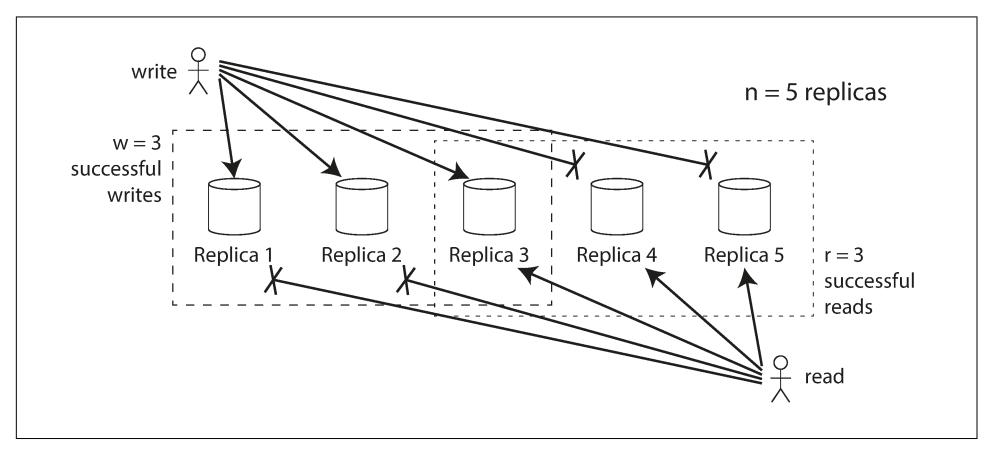

*Figure 5-11. If w + r > n, at least one of the r replicas you read from must have seen the most recent successful write.*

<span id="page-202-0"></span>If fewer than the required *w* or *r* nodes are available, writes or reads return an error. A node could be unavailable for many reasons: because the node is down (crashed, powered down), due to an error executing the operation (can't write because the disk is full), due to a network interruption between the client and the node, or for any number of other reasons. We only care whether the node returned a successful response and don't need to distinguish between different kinds of fault.

## **Limitations of Quorum Consistency**

If you have *n* replicas, and you choose *w* and *r* such that *w* + *r* > *n*, you can generally expect every read to return the most recent value written for a key. This is the case because the set of nodes to which you've written and the set of nodes from which you've read must overlap. That is, among the nodes you read there must be at least one node with the latest value (illustrated in [Figure 5-11](#page-201-0)).

Often, *r* and *w* are chosen to be a majority (more than *n*/2) of nodes, because that ensures *w* + *r* > *n* while still tolerating up to *n*/2 node failures. But quorums are not necessarily majorities—it only matters that the sets of nodes used by the read and write operations overlap in at least one node. Other quorum assignments are possi‐ ble, which allows some flexibility in the design of distributed algorithms [[45](#page-217-0)].

You may also set *w* and *r* to smaller numbers, so that *w* + *r* ≤ *n* (i.e., the quorum con‐ dition is not satisfied). In this case, reads and writes will still be sent to *n* nodes, but a smaller number of successful responses is required for the operation to succeed.

With a smaller *w* and *r* you are more likely to read stale values, because it's more likely that your read didn't include the node with the latest value. On the upside, this configuration allows lower latency and higher availability: if there is a network inter‐ ruption and many replicas become unreachable, there's a higher chance that you can continue processing reads and writes. Only after the number of reachable replicas falls below *w* or *r* does the database become unavailable for writing or reading, respectively.

However, even with *w* + *r* > *n*, there are likely to be edge cases where stale values are returned. These depend on the implementation, but possible scenarios include:

- If a sloppy quorum is used (see ["Sloppy Quorums and Hinted Handoff"](#page-204-0) on page [183](#page-204-0)), the *w* writes may end up on different nodes than the *r* reads, so there is no longer a guaranteed overlap between the *r* nodes and the *w* nodes [\[46](#page-217-0)].
- If two writes occur concurrently, it is not clear which one happened first. In this case, the only safe solution is to merge the concurrent writes (see ["Handling](#page-192-0) [Write Conflicts" on page 171\)](#page-192-0). If a winner is picked based on a timestamp (last write wins), writes can be lost due to clock skew [\[35\]](#page-216-0). We will return to this topic in ["Detecting Concurrent Writes" on page 184.](#page-205-0)

- <span id="page-203-0"></span>• If a write happens concurrently with a read, the write may be reflected on only some of the replicas. In this case, it's undetermined whether the read returns the old or the new value.
- If a write succeeded on some replicas but failed on others (for example because the disks on some nodes are full), and overall succeeded on fewer than *w* replicas, it is not rolled back on the replicas where it succeeded. This means that if a write was reported as failed, subsequent reads may or may not return the value from that write [[47\]](#page-217-0).
- If a node carrying a new value fails, and its data is restored from a replica carry‐ ing an old value, the number of replicas storing the new value may fall below *w*, breaking the quorum condition.
- Even if everything is working correctly, there are edge cases in which you can get unlucky with the timing, as we shall see in ["Linearizability and quorums" on](#page-355-0) [page 334.](#page-355-0)

Thus, although quorums appear to guarantee that a read returns the latest written value, in practice it is not so simple. Dynamo-style databases are generally optimized for use cases that can tolerate eventual consistency. The parameters *w* and *r* allow you to adjust the probability of stale values being read, but it's wise to not take them as absolute guarantees.

In particular, you usually do not get the guarantees discussed in ["Problems with Rep‐](#page-182-0) [lication Lag" on page 161](#page-182-0) (reading your writes, monotonic reads, or consistent prefix reads), so the previously mentioned anomalies can occur in applications. Stronger guarantees generally require transactions or consensus. We will return to these topics in [Chapter 7](#page-242-0) and [Chapter 9.](#page-342-0)

## **Monitoring staleness**

From an operational perspective, it's important to monitor whether your databases are returning up-to-date results. Even if your application can tolerate stale reads, you need to be aware of the health of your replication. If it falls behind significantly, it should alert you so that you can investigate the cause (for example, a problem in the network or an overloaded node).

For leader-based replication, the database typically exposes metrics for the replication lag, which you can feed into a monitoring system. This is possible because writes are applied to the leader and to followers in the same order, and each node has a position in the replication log (the number of writes it has applied locally). By subtracting a follower's current position from the leader's current position, you can measure the amount of replication lag.

However, in systems with leaderless replication, there is no fixed order in which writes are applied, which makes monitoring more difficult. Moreover, if the database <span id="page-204-0"></span>only uses read repair (no anti-entropy), there is no limit to how old a value might be —if a value is only infrequently read, the value returned by a stale replica may be ancient.

There has been some research on measuring replica staleness in databases with lead‐ erless replication and predicting the expected percentage of stale reads depending on the parameters *n*, *w*, and *r* [[48\]](#page-217-0). This is unfortunately not yet common practice, but it would be good to include staleness measurements in the standard set of metrics for databases. Eventual consistency is a deliberately vague guarantee, but for operability it's important to be able to quantify "eventual."

## **Sloppy Quorums and Hinted Handoff**

Databases with appropriately configured quorums can tolerate the failure of individ‐ ual nodes without the need for failover. They can also tolerate individual nodes going slow, because requests don't have to wait for all *n* nodes to respond—they can return when *w* or *r* nodes have responded. These characteristics make databases with leader‐ less replication appealing for use cases that require high availability and low latency, and that can tolerate occasional stale reads.

However, quorums (as described so far) are not as fault-tolerant as they could be. A network interruption can easily cut off a client from a large number of database nodes. Although those nodes are alive, and other clients may be able to connect to them, to a client that is cut off from the database nodes, they might as well be dead. In this situation, it's likely that fewer than *w* or *r* reachable nodes remain, so the client can no longer reach a quorum.

In a large cluster (with significantly more than *n* nodes) it's likely that the client can connect to *some* database nodes during the network interruption, just not to the nodes that it needs to assemble a quorum for a particular value. In that case, database designers face a trade-off:

- Is it better to return errors to all requests for which we cannot reach a quorum of *w* or *r* nodes?
- Or should we accept writes anyway, and write them to some nodes that are reachable but aren't among the *n* nodes on which the value usually lives?

The latter is known as a *sloppy quorum* [\[37](#page-217-0)]: writes and reads still require *w* and *r* successful responses, but those may include nodes that are not among the designated *n* "home" nodes for a value. By analogy, if you lock yourself out of your house, you may knock on the neighbor's door and ask whether you may stay on their couch tem‐ porarily.

Once the network interruption is fixed, any writes that one node temporarily accepted on behalf of another node are sent to the appropriate "home" nodes. This is <span id="page-205-0"></span>called *hinted handoff*. (Once you find the keys to your house again, your neighbor politely asks you to get off their couch and go home.)

Sloppy quorums are particularly useful for increasing write availability: as long as *any w* nodes are available, the database can accept writes. However, this means that even when *w* + *r* > *n*, you cannot be sure to read the latest value for a key, because the latest value may have been temporarily written to some nodes outside of *n* [\[47](#page-217-0)].

Thus, a sloppy quorum actually isn't a quorum at all in the traditional sense. It's only an assurance of durability, namely that the data is stored on *w* nodes somewhere. There is no guarantee that a read of *r* nodes will see it until the hinted handoff has completed.

Sloppy quorums are optional in all common Dynamo implementations. In Riak they are enabled by default, and in Cassandra and Voldemort they are disabled by default [[46, 49, 50](#page-217-0)].

## **Multi-datacenter operation**

We previously discussed cross-datacenter replication as a use case for multi-leader replication (see ["Multi-Leader Replication" on page 168\)](#page-189-0). Leaderless replication is also suitable for multi-datacenter operation, since it is designed to tolerate conflicting concurrent writes, network interruptions, and latency spikes.

Cassandra and Voldemort implement their multi-datacenter support within the nor‐ mal leaderless model: the number of replicas *n* includes nodes in all datacenters, and in the configuration you can specify how many of the *n* replicas you want to have in each datacenter. Each write from a client is sent to all replicas, regardless of datacen‐ ter, but the client usually only waits for acknowledgment from a quorum of nodes within its local datacenter so that it is unaffected by delays and interruptions on the cross-datacenter link. The higher-latency writes to other datacenters are often config‐ ured to happen asynchronously, although there is some flexibility in the configura‐ tion [\[50](#page-217-0), [51](#page-217-0)].

Riak keeps all communication between clients and database nodes local to one data‐ center, so *n* describes the number of replicas within one datacenter. Cross-datacenter replication between database clusters happens asynchronously in the background, in a style that is similar to multi-leader replication [\[52](#page-217-0)].

## **Detecting Concurrent Writes**

Dynamo-style databases allow several clients to concurrently write to the same key, which means that conflicts will occur even if strict quorums are used. The situation is similar to multi-leader replication (see ["Handling Write Conflicts" on page 171\)](#page-192-0), although in Dynamo-style databases conflicts can also arise during read repair or hinted handoff.

<span id="page-206-0"></span>The problem is that events may arrive in a different order at different nodes, due to variable network delays and partial failures. For example, Figure 5-12 shows two cli‐ ents, A and B, simultaneously writing to a key *X* in a three-node datastore:

- Node 1 receives the write from A, but never receives the write from B due to a transient outage.
- Node 2 first receives the write from A, then the write from B.
- Node 3 first receives the write from B, then the write from A.

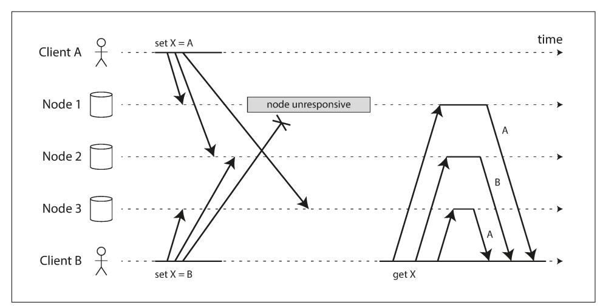

*Figure 5-12. Concurrent writes in a Dynamo-style datastore: there is no well-defined ordering.*

If each node simply overwrote the value for a key whenever it received a write request from a client, the nodes would become permanently inconsistent, as shown by the final *get* request in Figure 5-12: node 2 thinks that the final value of *X* is B, whereas the other nodes think that the value is A.

In order to become eventually consistent, the replicas should converge toward the same value. How do they do that? One might hope that replicated databases would handle this automatically, but unfortunately most implementations are quite poor: if you want to avoid losing data, you—the application developer—need to know a lot about the internals of your database's conflict handling.

We briefly touched on some techniques for conflict resolution in ["Handling Write](#page-192-0) [Conflicts" on page 171](#page-192-0). Before we wrap up this chapter, let's explore the issue in a bit more detail.

#### <span id="page-207-0"></span>**Last write wins (discarding concurrent writes)**

One approach for achieving eventual convergence is to declare that each replica need only store the most "recent" value and allow "older" values to be overwritten and dis‐ carded. Then, as long as we have some way of unambiguously determining which write is more "recent," and every write is eventually copied to every replica, the repli‐ cas will eventually converge to the same value.

As indicated by the quotes around "recent," this idea is actually quite misleading. In the example of [Figure 5-12,](#page-206-0) neither client knew about the other one when it sent its write requests to the database nodes, so it's not clear which one happened first. In fact, it doesn't really make sense to say that either happened "first": we say the writes are *concurrent*, so their order is undefined.

Even though the writes don't have a natural ordering, we can force an arbitrary order on them. For example, we can attach a timestamp to each write, pick the biggest timestamp as the most "recent," and discard any writes with an earlier timestamp. This conflict resolution algorithm, called *last write wins* (LWW), is the only sup‐ ported conflict resolution method in Cassandra [\[53](#page-218-0)], and an optional feature in Riak [[35\]](#page-216-0).

LWW achieves the goal of eventual convergence, but at the cost of durability: if there are several concurrent writes to the same key, even if they were all reported as suc‐ cessful to the client (because they were written to *w* replicas), only one of the writes will survive and the others will be silently discarded. Moreover, LWW may even drop writes that are not concurrent, as we shall discuss in ["Timestamps for ordering](#page-312-0) [events" on page 291.](#page-312-0)

There are some situations, such as caching, in which lost writes are perhaps accepta‐ ble. If losing data is not acceptable, LWW is a poor choice for conflict resolution.

The only safe way of using a database with LWW is to ensure that a key is only writ‐ ten once and thereafter treated as immutable, thus avoiding any concurrent updates to the same key. For example, a recommended way of using Cassandra is to use a UUID as the key, thus giving each write operation a unique key [\[53](#page-218-0)].

## **The "happens-before" relationship and concurrency**

How do we decide whether two operations are concurrent or not? To develop an intuition, let's look at some examples:

• In [Figure 5-9,](#page-197-0) the two writes are not concurrent: A's insert *happens before* B's increment, because the value incremented by B is the value inserted by A. In other words, B's operation builds upon A's operation, so B's operation must have happened later. We also say that B is *causally dependent* on A.

<span id="page-208-0"></span>• On the other hand, the two writes in [Figure 5-12](#page-206-0) are concurrent: when each cli‐ ent starts the operation, it does not know that another client is also performing an operation on the same key. Thus, there is no causal dependency between the operations.

An operation A *happens before* another operation B if B knows about A, or depends on A, or builds upon A in some way. Whether one operation happens before another operation is the key to defining what concurrency means. In fact, we can simply say that two operations are *concurrent* if neither happens before the other (i.e., neither knows about the other) [\[54](#page-218-0)].

Thus, whenever you have two operations A and B, there are three possibilities: either A happened before B, or B happened before A, or A and B are concurrent. What we need is an algorithm to tell us whether two operations are concurrent or not. If one operation happened before another, the later operation should overwrite the earlier operation, but if the operations are concurrent, we have a conflict that needs to be resolved.

## **Concurrency, Time, and Relativity**

It may seem that two operations should be called concurrent if they occur "at the same time"—but in fact, it is not important whether they literally overlap in time. Because of problems with clocks in distributed systems, it is actually quite difficult to tell whether two things happened at exactly the same time—an issue we will discuss in more detail in [Chapter 8.](#page-294-0)

For defining concurrency, exact time doesn't matter: we simply call two operations concurrent if they are both unaware of each other, regardless of the physical time at which they occurred. People sometimes make a connection between this principle and the special theory of relativity in physics [[54](#page-218-0)], which introduced the idea that information cannot travel faster than the speed of light. Consequently, two events that occur some distance apart cannot possibly affect each other if the time between the events is shorter than the time it takes light to travel the distance between them.

In computer systems, two operations might be concurrent even though the speed of light would in principle have allowed one operation to affect the other. For example, if the network was slow or interrupted at the time, two operations can occur some time apart and still be concurrent, because the network problems prevented one operation from being able to know about the other.

## **Capturing the happens-before relationship**

Let's look at an algorithm that determines whether two operations are concurrent, or whether one happened before another. To keep things simple, let's start with a data‐ base that has only one replica. Once we have worked out how to do this on a single replica, we can generalize the approach to a leaderless database with multiple replicas.

[Figure 5-13](#page-210-0) shows two clients concurrently adding items to the same shopping cart. (If that example strikes you as too inane, imagine instead two air traffic controllers concurrently adding aircraft to the sector they are tracking.) Initially, the cart is empty. Between them, the clients make five writes to the database:

- 1. Client 1 adds milk to the cart. This is the first write to that key, so the server suc‐ cessfully stores it and assigns it version 1. The server also echoes the value back to the client, along with the version number.
- 2. Client 2 adds eggs to the cart, not knowing that client 1 concurrently added milk (client 2 thought that its eggs were the only item in the cart). The server assigns version 2 to this write, and stores eggs and milk as two separate values. It then returns *both* values to the client, along with the version number of 2.
- 3. Client 1, oblivious to client 2's write, wants to add flour to the cart, so it thinks the current cart contents should be [milk, flour]. It sends this value to the server, along with the version number 1 that the server gave client 1 previously. The server can tell from the version number that the write of [milk, flour] supersedes the prior value of [milk] but that it is concurrent with [eggs]. Thus, the server assigns version 3 to [milk, flour], overwrites the version 1 value [milk], but keeps the version 2 value [eggs] and returns both remaining values to the client.
- 4. Meanwhile, client 2 wants to add ham to the cart, unaware that client 1 just added flour. Client 2 received the two values [milk] and [eggs] from the server in the last response, so the client now merges those values and adds ham to form a new value, [eggs, milk, ham]. It sends that value to the server, along with the previ‐ ous version number 2. The server detects that version 2 overwrites [eggs] but is concurrent with [milk, flour], so the two remaining values are [milk, flour] with version 3, and [eggs, milk, ham] with version 4.
- 5. Finally, client 1 wants to add bacon. It previously received [milk, flour] and [eggs] from the server at version 3, so it merges those, adds bacon, and sends the final value [milk, flour, eggs, bacon] to the server, along with the version number 3. This overwrites [milk, flour] (note that [eggs] was already over‐ written in the last step) but is concurrent with [eggs, milk, ham], so the server keeps those two concurrent values.

<span id="page-210-0"></span>

*Figure 5-13. Capturing causal dependencies between two clients concurrently editing a shopping cart.*

The dataflow between the operations in Figure 5-13 is illustrated graphically in Figure 5-14. The arrows indicate which operation *happened before* which other oper‐ ation, in the sense that the later operation *knew about* or *depended on* the earlier one. In this example, the clients are never fully up to date with the data on the server, since there is always another operation going on concurrently. But old versions of the value do get overwritten eventually, and no writes are lost.

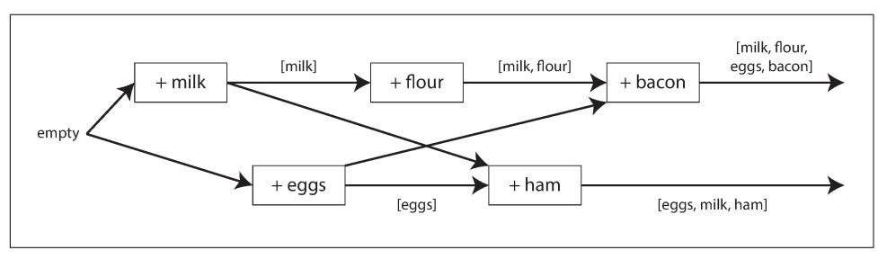

*Figure 5-14. Graph of causal dependencies in Figure 5-13.*

Note that the server can determine whether two operations are concurrent by looking at the version numbers—it does not need to interpret the value itself (so the value could be any data structure). The algorithm works as follows:

- <span id="page-211-0"></span>• The server maintains a version number for every key, increments the version number every time that key is written, and stores the new version number along with the value written.
- When a client reads a key, the server returns all values that have not been over‐ written, as well as the latest version number. A client must read a key before writing.
- When a client writes a key, it must include the version number from the prior read, and it must merge together all values that it received in the prior read. (The response from a write request can be like a read, returning all current values, which allows us to chain several writes like in the shopping cart example.)
- When the server receives a write with a particular version number, it can over‐ write all values with that version number or below (since it knows that they have been merged into the new value), but it must keep all values with a higher ver‐ sion number (because those values are concurrent with the incoming write).

When a write includes the version number from a prior read, that tells us which pre‐ vious state the write is based on. If you make a write without including a version number, it is concurrent with all other writes, so it will not overwrite anything—it will just be returned as one of the values on subsequent reads.

## **Merging concurrently written values**

This algorithm ensures that no data is silently dropped, but it unfortunately requires that the clients do some extra work: if several operations happen concurrently, clients have to clean up afterward by merging the concurrently written values. Riak calls these concurrent values *siblings*.

Merging sibling values is essentially the same problem as conflict resolution in multileader replication, which we discussed previously (see ["Handling Write Conflicts" on](#page-192-0) [page 171\)](#page-192-0). A simple approach is to just pick one of the values based on a version number or timestamp (last write wins), but that implies losing data. So, you may need to do something more intelligent in application code.

With the example of a shopping cart, a reasonable approach to merging siblings is to just take the union. In [Figure 5-14,](#page-210-0) the two final siblings are [milk, flour, eggs, bacon] and [eggs, milk, ham]; note that milk and eggs appear in both, even though they were each only written once. The merged value might be something like [milk, flour, eggs, bacon, ham], without duplicates.

However, if you want to allow people to also *remove* things from their carts, and not just add things, then taking the union of siblings may not yield the right result: if you merge two sibling carts and an item has been removed in only one of them, then the removed item will reappear in the union of the siblings [\[37](#page-217-0)]. To prevent this prob‐

<span id="page-212-0"></span>lem, an item cannot simply be deleted from the database when it is removed; instead, the system must leave a marker with an appropriate version number to indicate that the item has been removed when merging siblings. Such a deletion marker is known as a *tombstone*. (We previously saw tombstones in the context of log compaction in ["Hash Indexes" on page 72](#page-93-0).)

As merging siblings in application code is complex and error-prone, there are some efforts to design data structures that can perform this merging automatically, as dis‐ cussed in ["Automatic Conflict Resolution"](#page-195-0) on page 174. For example, Riak's datatype support uses a family of data structures called CRDTs [\[38,](#page-217-0) [39,](#page-217-0) [55](#page-218-0)] that can automati‐ cally merge siblings in sensible ways, including preserving deletions.

## **Version vectors**

The example in [Figure 5-13](#page-210-0) used only a single replica. How does the algorithm change when there are multiple replicas, but no leader?

[Figure 5-13](#page-210-0) uses a single version number to capture dependencies between opera‐ tions, but that is not sufficient when there are multiple replicas accepting writes con‐ currently. Instead, we need to use a version number *per replica* as well as per key. Each replica increments its own version number when processing a write, and also keeps track of the version numbers it has seen from each of the other replicas. This information indicates which values to overwrite and which values to keep as siblings.

The collection of version numbers from all the replicas is called a *version vector* [[56\]](#page-218-0). A few variants of this idea are in use, but the most interesting is probably the *dotted version vector* [[57\]](#page-218-0), which is used in Riak 2.0 [[58,](#page-218-0) [59](#page-218-0)]. We won't go into the details, but the way it works is quite similar to what we saw in our cart example.

Like the version numbers in [Figure 5-13,](#page-210-0) version vectors are sent from the database replicas to clients when values are read, and need to be sent back to the database when a value is subsequently written. (Riak encodes the version vector as a string that it calls *causal context*.) The version vector allows the database to distinguish between overwrites and concurrent writes.

Also, like in the single-replica example, the application may need to merge siblings. The version vector structure ensures that it is safe to read from one replica and subse‐ quently write back to another replica. Doing so may result in siblings being created, but no data is lost as long as siblings are merged correctly.


#### **Version vectors and vector clocks**

A *version vector* is sometimes also called a *vector clock*, even though they are not quite the same. The difference is subtle—please see the references for details [[57](#page-218-0), [60](#page-218-0), [61](#page-218-0)]. In brief, when comparing the state of replicas, version vectors are the right data structure to use.

## <span id="page-213-0"></span>**Summary**

In this chapter we looked at the issue of replication. Replication can serve several purposes:

## *High availability*

Keeping the system running, even when one machine (or several machines, or an entire datacenter) goes down

## *Disconnected operation*

Allowing an application to continue working when there is a network interrup‐ tion

## *Latency*

Placing data geographically close to users, so that users can interact with it faster

## *Scalability*

Being able to handle a higher volume of reads than a single machine could han‐ dle, by performing reads on replicas

Despite being a simple goal—keeping a copy of the same data on several machines replication turns out to be a remarkably tricky problem. It requires carefully thinking about concurrency and about all the things that can go wrong, and dealing with the consequences of those faults. At a minimum, we need to deal with unavailable nodes and network interruptions (and that's not even considering the more insidious kinds of fault, such as silent data corruption due to software bugs).

We discussed three main approaches to replication:

## *Single-leader replication*

Clients send all writes to a single node (the leader), which sends a stream of data change events to the other replicas (followers). Reads can be performed on any replica, but reads from followers might be stale.

## *Multi-leader replication*

Clients send each write to one of several leader nodes, any of which can accept writes. The leaders send streams of data change events to each other and to any follower nodes.

## *Leaderless replication*

Clients send each write to several nodes, and read from several nodes in parallel in order to detect and correct nodes with stale data.

Each approach has advantages and disadvantages. Single-leader replication is popular because it is fairly easy to understand and there is no conflict resolution to worry about. Multi-leader and leaderless replication can be more robust in the presence of

<span id="page-214-0"></span>faulty nodes, network interruptions, and latency spikes—at the cost of being harder to reason about and providing only very weak consistency guarantees.

Replication can be synchronous or asynchronous, which has a profound effect on the system behavior when there is a fault. Although asynchronous replication can be fast when the system is running smoothly, it's important to figure out what happens when replication lag increases and servers fail. If a leader fails and you promote an asynchronously updated follower to be the new leader, recently committed data may be lost.

We looked at some strange effects that can be caused by replication lag, and we dis‐ cussed a few consistency models which are helpful for deciding how an application should behave under replication lag:

#### *Read-after-write consistency*

Users should always see data that they submitted themselves.

## *Monotonic reads*

After users have seen the data at one point in time, they shouldn't later see the data from some earlier point in time.

## *Consistent prefix reads*

Users should see the data in a state that makes causal sense: for example, seeing a question and its reply in the correct order.

Finally, we discussed the concurrency issues that are inherent in multi-leader and leaderless replication approaches: because they allow multiple writes to happen con‐ currently, conflicts may occur. We examined an algorithm that a database might use to determine whether one operation happened before another, or whether they hap‐ pened concurrently. We also touched on methods for resolving conflicts by merging together concurrent updates.

In the next chapter we will continue looking at data that is distributed across multiple machines, through the counterpart of replication: splitting a large dataset into *parti‐ tions*.

## **References**

- [[1\]](#page-173-0) Bruce G. Lindsay, Patricia Griffiths Selinger, C. Galtieri, et al.: ["Notes on Dis‐](http://domino.research.ibm.com/library/cyberdig.nsf/papers/A776EC17FC2FCE73852579F100578964/$File/RJ2571.pdf) [tributed Databases,](http://domino.research.ibm.com/library/cyberdig.nsf/papers/A776EC17FC2FCE73852579F100578964/$File/RJ2571.pdf)" IBM Research, Research Report RJ2571(33471), July 1979.
- [[2\]](#page-174-0) "[Oracle Active Data Guard Real-Time Data Protection and Availability](http://www.oracle.com/technetwork/database/availability/active-data-guard-wp-12c-1896127.pdf)," Oracle White Paper, June 2013.
- [[3\]](#page-174-0) "[AlwaysOn Availability Groups,](http://msdn.microsoft.com/en-us/library/hh510230.aspx)" in *SQL Server Books Online*, Microsoft, 2012.

- <span id="page-215-0"></span>[[4\]](#page-174-0) Lin Qiao, Kapil Surlaker, Shirshanka Das, et al.: ["On Brewing Fresh Espresso:](http://www.slideshare.net/amywtang/espresso-20952131) [LinkedIn's Distributed Data Serving Platform,](http://www.slideshare.net/amywtang/espresso-20952131)" at *ACM International Conference on Management of Data* (SIGMOD), June 2013.
- [[5\]](#page-174-0) Jun Rao: ["Intra-Cluster Replication for Apache Kafka,](http://www.slideshare.net/junrao/kafka-replication-apachecon2013)" at *ApacheCon North America*, February 2013.
- [[6\]](#page-174-0) "[Highly Available Queues,](https://www.rabbitmq.com/ha.html)" in *RabbitMQ Server Documentation*, Pivotal Software, Inc., 2014.
- [[7\]](#page-176-0) Yoshinori Matsunobu: "[Semi-Synchronous Replication at Facebook,](http://yoshinorimatsunobu.blogspot.co.uk/2014/04/semi-synchronous-replication-at-facebook.html)" *yoshinori‐ matsunobu.blogspot.co.uk*, April 1, 2014.
- [[8\]](#page-176-0) Robbert van Renesse and Fred B. Schneider: "[Chain Replication for Supporting](http://static.usenix.org/legacy/events/osdi04/tech/full_papers/renesse/renesse.pdf) [High Throughput and Availability](http://static.usenix.org/legacy/events/osdi04/tech/full_papers/renesse/renesse.pdf)," at *6th USENIX Symposium on Operating System Design and Implementation* (OSDI), December 2004.
- [[9\]](#page-176-0) Jeff Terrace and Michael J. Freedman: ["Object Storage on CRAQ: High-](https://www.usenix.org/legacy/event/usenix09/tech/full_papers/terrace/terrace.pdf)[Throughput Chain Replication for Read-Mostly Workloads](https://www.usenix.org/legacy/event/usenix09/tech/full_papers/terrace/terrace.pdf)," at *USENIX Annual Technical Conference* (ATC), June 2009.
- [[10\]](#page-176-0) Brad Calder, Ju Wang, Aaron Ogus, et al.: ["Windows Azure Storage: A Highly](http://sigops.org/sosp/sosp11/current/2011-Cascais/printable/11-calder.pdf) [Available Cloud Storage Service with Strong Consistency](http://sigops.org/sosp/sosp11/current/2011-Cascais/printable/11-calder.pdf)," at *23rd ACM Symposium on Operating Systems Principles* (SOSP), October 2011.
- [[11\]](#page-176-0) Andrew Wang: "[Windows Azure Storage](http://umbrant.com/blog/2016/windows_azure_storage.html)," *umbrant.com*, February 4, 2016.
- [[12\]](#page-177-0) "[Percona Xtrabackup Documentation](https://www.percona.com/doc/percona-xtrabackup/2.1/index.html)," Percona LLC, 2014.
- [[13\]](#page-178-0) Jesse Newland: "[GitHub Availability This Week,](https://github.com/blog/1261-github-availability-this-week)" *github.com*, September 14, 2012.
- [[14\]](#page-179-0) Mark Imbriaco: "[Downtime Last Saturday](https://github.com/blog/1364-downtime-last-saturday)," *github.com*, December 26, 2012.
- [[15\]](#page-180-0) John Hugg: ["'All in' with Determinism for Performance and Testing in Dis‐](https://www.youtube.com/watch?v=gJRj3vJL4wE) [tributed Systems](https://www.youtube.com/watch?v=gJRj3vJL4wE)," at *Strange Loop*, September 2015.
- [[16\]](#page-181-0) Amit Kapila: "[WAL Internals of PostgreSQL,](http://www.pgcon.org/2012/schedule/attachments/258_212_Internals%20Of%20PostgreSQL%20Wal.pdf)" at *PostgreSQL Conference* (PGCon), May 2012.
- [[17\]](#page-181-0) *[MySQL Internals Manual](http://dev.mysql.com/doc/internals/en/index.html)*. Oracle, 2014.
- [[18\]](#page-182-0) Yogeshwer Sharma, Philippe Ajoux, Petchean Ang, et al.: "[Wormhole: Reliable](https://www.usenix.org/system/files/conference/nsdi15/nsdi15-paper-sharma.pdf) [Pub-Sub to Support Geo-Replicated Internet Services](https://www.usenix.org/system/files/conference/nsdi15/nsdi15-paper-sharma.pdf)," at *12th USENIX Symposium on Networked Systems Design and Implementation* (NSDI), May 2015.
- [[19\]](#page-182-0) "[Oracle GoldenGate 12c: Real-Time Access to Real-Time Information](http://www.oracle.com/us/products/middleware/data-integration/oracle-goldengate-realtime-access-2031152.pdf)," Oracle White Paper, October 2013.
- [[20\]](#page-182-0) Shirshanka Das, Chavdar Botev, Kapil Surlaker, et al.: ["All Aboard the Data‐](http://www.socc2012.org/s18-das.pdf) [bus!,](http://www.socc2012.org/s18-das.pdf)" at *ACM Symposium on Cloud Computing* (SoCC), October 2012.

- <span id="page-216-0"></span>[[21\]](#page-182-0) Greg Sabino Mullane: "[Version 5 of Bucardo Database Replication System](http://blog.endpoint.com/2014/06/bucardo-5-multimaster-postgres-released.html)," *blog.endpoint.com*, June 23, 2014.
- [[22\]](#page-183-0) Werner Vogels: ["Eventually Consistent](http://queue.acm.org/detail.cfm?id=1466448)," *ACM Queue*, volume 6, number 6, pages 14–19, October 2008. [doi:10.1145/1466443.1466448](http://dx.doi.org/10.1145/1466443.1466448)
- [[23\]](#page-183-0) Douglas B. Terry: ["Replicated Data Consistency Explained Through Baseball](http://research.microsoft.com/pubs/157411/ConsistencyAndBaseballReport.pdf)," Microsoft Research, Technical Report MSR-TR-2011-137, October 2011.
- [[24\]](#page-184-0) Douglas B. Terry, Alan J. Demers, Karin Petersen, et al.: ["Session Guarantees for](http://citeseerx.ist.psu.edu/viewdoc/download?doi=10.1.1.71.2269&rep=rep1&type=pdf) [Weakly Consistent Replicated Data](http://citeseerx.ist.psu.edu/viewdoc/download?doi=10.1.1.71.2269&rep=rep1&type=pdf)," at *3rd International Conference on Parallel and Distributed Information Systems* (PDIS), September 1994. [doi:10.1109/PDIS.](http://dx.doi.org/10.1109/PDIS.1994.331722) [1994.331722](http://dx.doi.org/10.1109/PDIS.1994.331722)
- [[25\]](#page-187-0) Terry Pratchett: *Reaper Man: A Discworld Novel*. Victor Gollancz, 1991. ISBN: 978-0-575-04979-6
- [[26\]](#page-191-0) "[Tungsten Replicator,](http://tungsten-replicator.org/)" Continuent, Inc., 2014.
- [[27\]](#page-191-0) ["BDR 0.10.0 Documentation,](http://bdr-project.org/docs/next/index.html)" The PostgreSQL Global Development Group, *bdr-project.org*, 2015.
- [[28\]](#page-191-0) Robert Hodges: "[If You \\*Must\\* Deploy Multi-Master Replication, Read This](http://scale-out-blog.blogspot.co.uk/2012/04/if-you-must-deploy-multi-master.html) [First](http://scale-out-blog.blogspot.co.uk/2012/04/if-you-must-deploy-multi-master.html)," *scale-out-blog.blogspot.co.uk*, March 30, 2012.
- [[29\]](#page-191-0) J. Chris Anderson, Jan Lehnardt, and Noah Slater: *CouchDB: The Definitive Guide*. O'Reilly Media, 2010. ISBN: 978-0-596-15589-6
- [[30\]](#page-191-0) AppJet, Inc.: "[Etherpad and EasySync Technical Manual,](https://github.com/ether/etherpad-lite/blob/e2ce9dc/doc/easysync/easysync-full-description.pdf)" *github.com*, March 26, 2011.
- [[31\]](#page-191-0) John Day-Richter: ["What's Different About the New Google Docs: Making Col‐](http://googledrive.blogspot.com/2010/09/whats-different-about-new-google-docs.html) [laboration Fast](http://googledrive.blogspot.com/2010/09/whats-different-about-new-google-docs.html)," *googledrive.blogspot.com*, 23 September 2010.
- [[32\]](#page-192-0) Martin Kleppmann and Alastair R. Beresford: ["A Conflict-Free Replicated JSON](http://arxiv.org/abs/1608.03960) [Datatype](http://arxiv.org/abs/1608.03960)," arXiv:1608.03960, August 13, 2016.
- [[33\]](#page-192-0) Frazer Clement: "[Eventual Consistency Detecting Conflicts](http://messagepassing.blogspot.co.uk/2011/10/eventual-consistency-detecting.html)," *messagepass‐ ing.blogspot.co.uk*, October 20, 2011.
- [[34\]](#page-193-0) Robert Hodges: ["State of the Art for MySQL Multi-Master Replication](https://www.percona.com/live/mysql-conference-2013/sessions/state-art-mysql-multi-master-replication)," at *Per‐ cona Live: MySQL Conference & Expo*, April 2013.
- [[35\]](#page-194-0) John Daily: "[Clocks Are Bad, or, Welcome to the Wonderful World of Dis‐](http://basho.com/clocks-are-bad-or-welcome-to-distributed-systems/) [tributed Systems](http://basho.com/clocks-are-bad-or-welcome-to-distributed-systems/)," *basho.com*, November 12, 2013.
- [[36\]](#page-194-0) Riley Berton: "[Is Bi-Directional Replication \(BDR\) in Postgres Transactional?](http://sdf.org/~riley/blog/2016/01/04/is-bi-directional-replication-bdr-in-postgres-transactional/)," *sdf.org*, January 4, 2016.

- <span id="page-217-0"></span>[[37\]](#page-195-0) Giuseppe DeCandia, Deniz Hastorun, Madan Jampani, et al.: ["Dynamo: Ama‐](http://www.allthingsdistributed.com/files/amazon-dynamo-sosp2007.pdf) [zon's Highly Available Key-Value Store](http://www.allthingsdistributed.com/files/amazon-dynamo-sosp2007.pdf)," at *21st ACM Symposium on Operating Sys‐ tems Principles* (SOSP), October 2007.
- [[38\]](#page-195-0) Marc Shapiro, Nuno Preguiça, Carlos Baquero, and Marek Zawirski: "[A Com‐](http://hal.inria.fr/inria-00555588/) [prehensive Study of Convergent and Commutative Replicated Data Types,](http://hal.inria.fr/inria-00555588/)" INRIA Research Report no. 7506, January 2011.
- [[39\]](#page-195-0) Sam Elliott: ["CRDTs: An UPDATE \(or Maybe Just a PUT\),](https://speakerdeck.com/lenary/crdts-an-update-or-just-a-put)" at *RICON West*, October 2013.
- [[40\]](#page-195-0) Russell Brown: ["A Bluffers Guide to CRDTs in Riak,](https://gist.github.com/russelldb/f92f44bdfb619e089a4d)" *gist.github.com*, October 28, 2013.
- [[41\]](#page-195-0) Benjamin Farinier, Thomas Gazagnaire, and Anil Madhavapeddy: "[Mergeable](http://gazagnaire.org/pub/FGM15.pdf) [Persistent Data Structures](http://gazagnaire.org/pub/FGM15.pdf)," at *26es Journées Francophones des Langages Applicatifs* (JFLA), January 2015.
- [[42\]](#page-195-0) Chengzheng Sun and Clarence Ellis: "[Operational Transformation in Real-Time](http://citeseerx.ist.psu.edu/viewdoc/download?doi=10.1.1.53.933&rep=rep1&type=pdf) [Group Editors: Issues, Algorithms, and Achievements,](http://citeseerx.ist.psu.edu/viewdoc/download?doi=10.1.1.53.933&rep=rep1&type=pdf)" at *ACM Conference on Com‐ puter Supported Cooperative Work* (CSCW), November 1998.
- [[43\]](#page-196-0) Lars Hofhansl: "[HBASE-7709: Infinite Loop Possible in Master/Master Replica‐](https://issues.apache.org/jira/browse/HBASE-7709) [tion](https://issues.apache.org/jira/browse/HBASE-7709)," *issues.apache.org*, January 29, 2013.
- [[44\]](#page-198-0) David K. Gifford: "[Weighted Voting for Replicated Data](http://citeseerx.ist.psu.edu/viewdoc/summary?doi=10.1.1.84.7698)," at *7th ACM Sympo‐ sium on Operating Systems Principles* (SOSP), December 1979. [doi:](http://dx.doi.org/10.1145/800215.806583) [10.1145/800215.806583](http://dx.doi.org/10.1145/800215.806583)
- [[45\]](#page-202-0) Heidi Howard, Dahlia Malkhi, and Alexander Spiegelman: "[Flexible Paxos: Quo‐](https://arxiv.org/abs/1608.06696) [rum Intersection Revisited](https://arxiv.org/abs/1608.06696)," *arXiv:1608.06696*, August 24, 2016.
- [[46\]](#page-202-0) Joseph Blomstedt: ["Re: Absolute Consistency,](http://lists.basho.com/pipermail/riak-users_lists.basho.com/2012-January/007157.html)" email to *riak-users* mailing list, *lists.basho.com*, January 11, 2012.
- [[47\]](#page-203-0) Joseph Blomstedt: "[Bringing Consistency to Riak](https://vimeo.com/51973001)," at *RICON West*, October 2012.
- [[48\]](#page-204-0) Peter Bailis, Shivaram Venkataraman, Michael J. Franklin, et al.: "[Quantifying](http://www.bailis.org/papers/pbs-cacm2014.pdf) [Eventual Consistency with PBS,](http://www.bailis.org/papers/pbs-cacm2014.pdf)" *Communications of the ACM*, volume 57, number 8, pages 93–102, August 2014. [doi:10.1145/2632792](http://dx.doi.org/10.1145/2632792)
- [[49\]](#page-205-0) Jonathan Ellis: ["Modern Hinted Handoff,](http://www.datastax.com/dev/blog/modern-hinted-handoff)" *datastax.com*, December 11, 2012.
- [[50\]](#page-205-0) "[Project Voldemort Wiki](https://github.com/voldemort/voldemort/wiki)," *github.com*, 2013.
- [[51\]](#page-205-0) "[Apache Cassandra 2.0 Documentation,](http://www.datastax.com/documentation/cassandra/2.0/index.html)" DataStax, Inc., 2014.
- [[52\]](#page-205-0) "[Riak Enterprise: Multi-Datacenter Replication.](http://basho.com/assets/MultiDatacenter_Replication.pdf)" Technical whitepaper, Basho Technologies, Inc., September 2014.

- <span id="page-218-0"></span>[[53\]](#page-207-0) Jonathan Ellis: ["Why Cassandra Doesn't Need Vector Clocks](http://www.datastax.com/dev/blog/why-cassandra-doesnt-need-vector-clocks)," *datastax.com*, September 2, 2013.
- [[54\]](#page-208-0) Leslie Lamport: "[Time, Clocks, and the Ordering of Events in a Distributed Sys‐](http://research.microsoft.com/en-US/um/people/Lamport/pubs/time-clocks.pdf) [tem](http://research.microsoft.com/en-US/um/people/Lamport/pubs/time-clocks.pdf)," *Communications of the ACM*, volume 21, number 7, pages 558–565, July 1978. [doi:10.1145/359545.359563](http://dx.doi.org/10.1145/359545.359563)
- [[55\]](#page-212-0) Joel Jacobson: ["Riak 2.0: Data Types,](http://blog.joeljacobson.com/riak-2-0-data-types/)" *blog.joeljacobson.com*, March 23, 2014.
- [[56\]](#page-212-0) D. Stott Parker Jr., Gerald J. Popek, Gerard Rudisin, et al.: "[Detection of Mutual](http://zoo.cs.yale.edu/classes/cs426/2013/bib/parker83detection.pdf) [Inconsistency in Distributed Systems](http://zoo.cs.yale.edu/classes/cs426/2013/bib/parker83detection.pdf)," *IEEE Transactions on Software Engineering*, volume 9, number 3, pages 240–247, May 1983. [doi:10.1109/TSE.1983.236733](http://dx.doi.org/10.1109/TSE.1983.236733)
- [[57\]](#page-212-0) Nuno Preguiça, Carlos Baquero, Paulo Sérgio Almeida, et al.: "[Dotted Version](http://arxiv.org/pdf/1011.5808v1.pdf) [Vectors: Logical Clocks for Optimistic Replication,](http://arxiv.org/pdf/1011.5808v1.pdf)" arXiv:1011.5808, November 26, 2010.
- [[58\]](#page-212-0) Sean Cribbs: ["A Brief History of Time in Riak,](https://www.youtube.com/watch?v=HHkKPdOi-ZU)" at *RICON*, October 2014.
- [[59\]](#page-212-0) Russell Brown: ["Vector Clocks Revisited Part 2: Dotted Version Vectors](http://basho.com/posts/technical/vector-clocks-revisited-part-2-dotted-version-vectors/)," *basho.com*, November 10, 2015.
- [[60\]](#page-212-0) Carlos Baquero: "[Version Vectors Are Not Vector Clocks,](https://haslab.wordpress.com/2011/07/08/version-vectors-are-not-vector-clocks/)" *haslab.word‐ press.com*, July 8, 2011.
- [[61\]](#page-212-0) Reinhard Schwarz and Friedemann Mattern: "[Detecting Causal Relationships in](http://dcg.ethz.ch/lectures/hs08/seminar/papers/mattern4.pdf) [Distributed Computations: In Search of the Holy Grail](http://dcg.ethz.ch/lectures/hs08/seminar/papers/mattern4.pdf)," *Distributed Computing*, vol‐ ume 7, number 3, pages 149–174, March 1994. [doi:10.1007/BF02277859](http://dx.doi.org/10.1007/BF02277859)

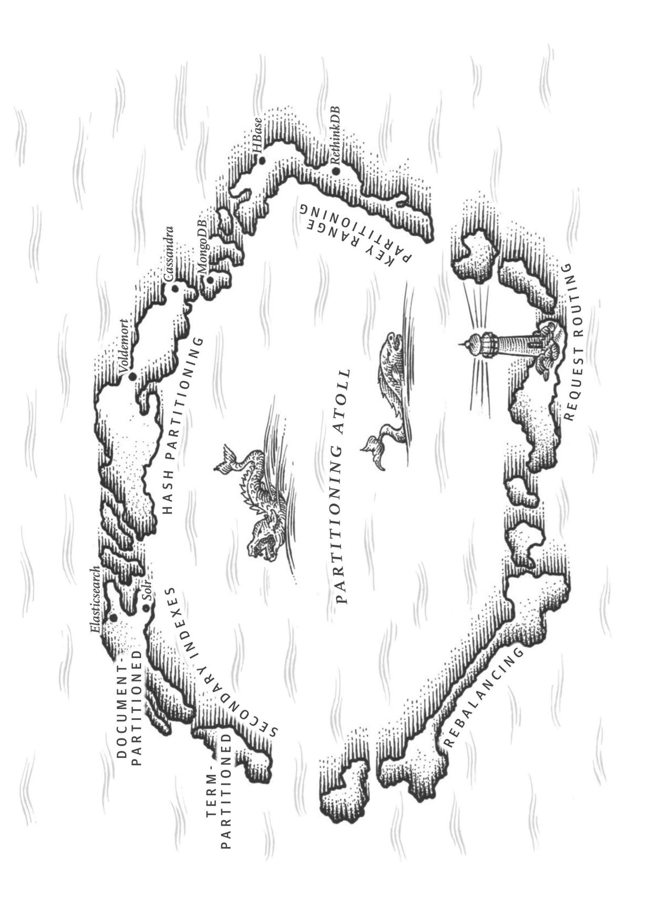

# **Partitioning**

<span id="page-220-0"></span>*Clearly, we must break away from the sequential and not limit the computers. We must state definitions and provide for priorities and descriptions of data. We must state relation‐ ships, not procedures.*

—Grace Murray Hopper, *Management and the Computer of the Future* (1962)

In [Chapter 5](#page-172-0) we discussed replication—that is, having multiple copies of the same data on different nodes. For very large datasets, or very high query throughput, that is not sufficient: we need to break the data up into *partitions*, also known as *sharding*. i


#### **Terminological confusion**

What we call a *partition* here is called a *shard* in MongoDB, Elas‐ ticsearch, and SolrCloud; it's known as a *region* in HBase, a *tablet* in Bigtable, a *vnode* in Cassandra and Riak, and a *vBucket* in Couchbase. However, *partitioning* is the most established term, so we'll stick with that.

Normally, partitions are defined in such a way that each piece of data (each record, row, or document) belongs to exactly one partition. There are various ways of achiev‐ ing this, which we discuss in depth in this chapter. In effect, each partition is a small database of its own, although the database may support operations that touch multi‐ ple partitions at the same time.

The main reason for wanting to partition data is *scalability*. Different partitions can be placed on different nodes in a shared-nothing cluster (see the introduction to

i. Partitioning, as discussed in this chapter, is a way of intentionally breaking a large database down into smaller ones. It has nothing to do with *network partitions* (netsplits), a type of fault in the network between nodes. We will discuss such faults in [Chapter 8.](#page-294-0)

<span id="page-221-0"></span>[Part II](#page-166-0) for a definition of *shared nothing*). Thus, a large dataset can be distributed across many disks, and the query load can be distributed across many processors.

For queries that operate on a single partition, each node can independently execute the queries for its own partition, so query throughput can be scaled by adding more nodes. Large, complex queries can potentially be parallelized across many nodes, although this gets significantly harder.

Partitioned databases were pioneered in the 1980s by products such as Teradata and Tandem NonStop SQL [[1\]](#page-239-0), and more recently rediscovered by NoSQL databases and Hadoop-based data warehouses. Some systems are designed for transactional work‐ loads, and others for analytics (see ["Transaction Processing or Analytics?" on page](#page-111-0) [90](#page-111-0)): this difference affects how the system is tuned, but the fundamentals of partition‐ ing apply to both kinds of workloads.

In this chapter we will first look at different approaches for partitioning large datasets and observe how the indexing of data interacts with partitioning. We'll then talk about rebalancing, which is necessary if you want to add or remove nodes in your cluster. Finally, we'll get an overview of how databases route requests to the right par‐ titions and execute queries.

## **Partitioning and Replication**

Partitioning is usually combined with replication so that copies of each partition are stored on multiple nodes. This means that, even though each record belongs to exactly one partition, it may still be stored on several different nodes for fault toler‐ ance.

A node may store more than one partition. If a leader–follower replication model is used, the combination of partitioning and replication can look like [Figure 6-1.](#page-222-0) Each partition's leader is assigned to one node, and its followers are assigned to other nodes. Each node may be the leader for some partitions and a follower for other par‐ titions.

Everything we discussed in [Chapter 5](#page-172-0) about replication of databases applies equally to replication of partitions. The choice of partitioning scheme is mostly independent of the choice of replication scheme, so we will keep things simple and ignore replica‐ tion in this chapter.

<span id="page-222-0"></span>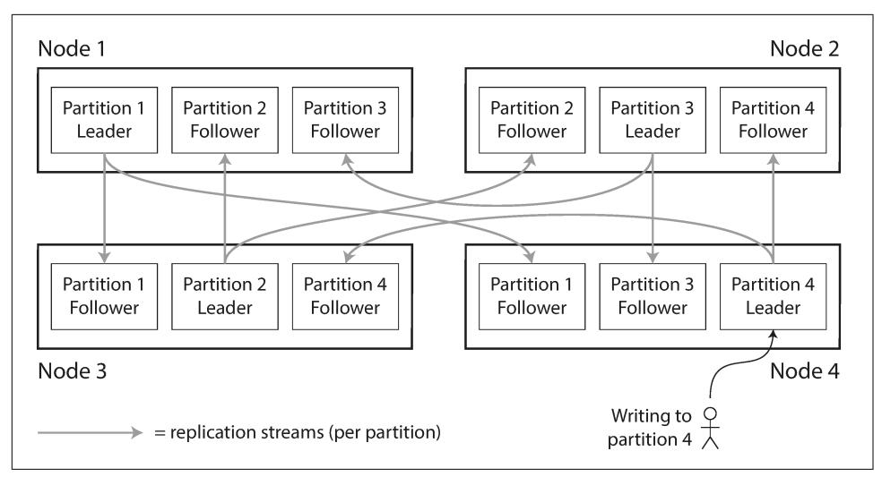

*Figure 6-1. Combining replication and partitioning: each node acts as leader for some partitions and follower for other partitions.*

## **Partitioning of Key-Value Data**

Say you have a large amount of data, and you want to partition it. How do you decide which records to store on which nodes?

Our goal with partitioning is to spread the data and the query load evenly across nodes. If every node takes a fair share, then—in theory—10 nodes should be able to handle 10 times as much data and 10 times the read and write throughput of a single node (ignoring replication for now).

If the partitioning is unfair, so that some partitions have more data or queries than others, we call it *skewed*. The presence of skew makes partitioning much less effective. In an extreme case, all the load could end up on one partition, so 9 out of 10 nodes are idle and your bottleneck is the single busy node. A partition with disproportion‐ ately high load is called a *hot spot*.

The simplest approach for avoiding hot spots would be to assign records to nodes randomly. That would distribute the data quite evenly across the nodes, but it has a big disadvantage: when you're trying to read a particular item, you have no way of knowing which node it is on, so you have to query all nodes in parallel.

We can do better. Let's assume for now that you have a simple key-value data model, in which you always access a record by its primary key. For example, in an oldfashioned paper encyclopedia, you look up an entry by its title; since all the entries are alphabetically sorted by title, you can quickly find the one you're looking for.

## <span id="page-223-0"></span>**Partitioning by Key Range**

One way of partitioning is to assign a continuous range of keys (from some mini‐ mum to some maximum) to each partition, like the volumes of a paper encyclopedia (Figure 6-2). If you know the boundaries between the ranges, you can easily deter‐ mine which partition contains a given key. If you also know which partition is assigned to which node, then you can make your request directly to the appropriate node (or, in the case of the encyclopedia, pick the correct book off the shelf).


*Figure 6-2. A print encyclopedia is partitioned by key range.*

The ranges of keys are not necessarily evenly spaced, because your data may not be evenly distributed. For example, in Figure 6-2, volume 1 contains words starting with A and B, but volume 12 contains words starting with T, U, V, X, Y, and Z. Simply having one volume per two letters of the alphabet would lead to some volumes being much bigger than others. In order to distribute the data evenly, the partition bound‐ aries need to adapt to the data.

The partition boundaries might be chosen manually by an administrator, or the data‐ base can choose them automatically (we will discuss choices of partition boundaries in more detail in ["Rebalancing Partitions" on page 209](#page-230-0)). This partitioning strategy is used by Bigtable, its open source equivalent HBase [\[2,](#page-239-0) [3\]](#page-239-0), RethinkDB, and MongoDB before version 2.4 [[4\]](#page-239-0).

Within each partition, we can keep keys in sorted order (see ["SSTables and LSM-](#page-97-0)[Trees" on page 76](#page-97-0)). This has the advantage that range scans are easy, and you can treat the key as a concatenated index in order to fetch several related records in one query (see ["Multi-column indexes" on page 87\)](#page-108-0). For example, consider an application that stores data from a network of sensors, where the key is the timestamp of the measurement (*year-month-day-hour-minute-second*). Range scans are very useful in this case, because they let you easily fetch, say, all the readings from a particular month.

<span id="page-224-0"></span>However, the downside of key range partitioning is that certain access patterns can lead to hot spots. If the key is a timestamp, then the partitions correspond to ranges of time—e.g., one partition per day. Unfortunately, because we write data from the sensors to the database as the measurements happen, all the writes end up going to the same partition (the one for today), so that partition can be overloaded with writes while others sit idle [[5\]](#page-239-0).

To avoid this problem in the sensor database, you need to use something other than the timestamp as the first element of the key. For example, you could prefix each timestamp with the sensor name so that the partitioning is first by sensor name and then by time. Assuming you have many sensors active at the same time, the write load will end up more evenly spread across the partitions. Now, when you want to fetch the values of multiple sensors within a time range, you need to perform a sepa‐ rate range query for each sensor name.

## **Partitioning by Hash of Key**

Because of this risk of skew and hot spots, many distributed datastores use a hash function to determine the partition for a given key.

A good hash function takes skewed data and makes it uniformly distributed. Say you have a 32-bit hash function that takes a string. Whenever you give it a new string, it returns a seemingly random number between 0 and 2<sup>32</sup> − 1. Even if the input strings are very similar, their hashes are evenly distributed across that range of numbers.

For partitioning purposes, the hash function need not be cryptographically strong: for example, Cassandra and MongoDB use MD5, and Voldemort uses the Fowler– Noll–Vo function. Many programming languages have simple hash functions built in (as they are used for hash tables), but they may not be suitable for partitioning: for example, in Java's Object.hashCode() and Ruby's Object#hash, the same key may have a different hash value in different processes [[6\]](#page-239-0).

Once you have a suitable hash function for keys, you can assign each partition a range of hashes (rather than a range of keys), and every key whose hash falls within a partition's range will be stored in that partition. This is illustrated in [Figure 6-3.](#page-225-0)

<span id="page-225-0"></span>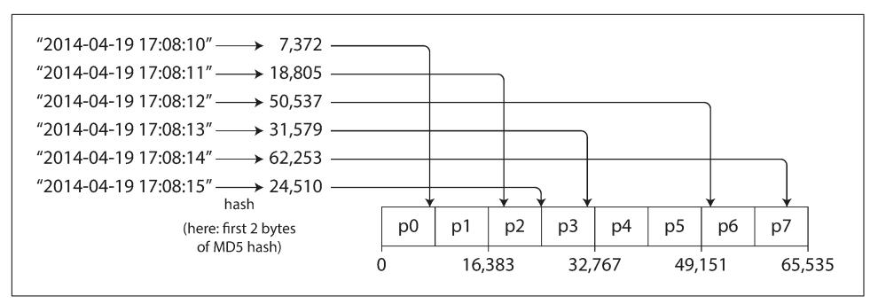

*Figure 6-3. Partitioning by hash of key.*

This technique is good at distributing keys fairly among the partitions. The partition boundaries can be evenly spaced, or they can be chosen pseudorandomly (in which case the technique is sometimes known as *consistent hashing*).

## **Consistent Hashing**

Consistent hashing, as defined by Karger et al. [[7](#page-239-0)], is a way of evenly distributing load across an internet-wide system of caches such as a content delivery network (CDN). It uses randomly chosen partition boundaries to avoid the need for central control or distributed consensus. Note that *consistent* here has nothing to do with replica consis‐ tency (see [Chapter 5\)](#page-172-0) or ACID consistency (see [Chapter 7](#page-242-0)), but rather describes a particular approach to rebalancing.

As we shall see in ["Rebalancing Partitions" on page 209,](#page-230-0) this particular approach actually doesn't work very well for databases [[8](#page-239-0)], so it is rarely used in practice (the documentation of some databases still refers to consistent hashing, but it is often inaccurate). Because this is so confusing, it's best to avoid the term *consistent hashing* and just call it *hash partitioning* instead.

Unfortunately however, by using the hash of the key for partitioning we lose a nice property of key-range partitioning: the ability to do efficient range queries. Keys that were once adjacent are now scattered across all the partitions, so their sort order is lost. In MongoDB, if you have enabled hash-based sharding mode, any range query has to be sent to all partitions [\[4](#page-239-0)]. Range queries on the primary key are not sup‐ ported by Riak [\[9](#page-239-0)], Couchbase [[10\]](#page-239-0), or Voldemort.

Cassandra achieves a compromise between the two partitioning strategies [[11,](#page-239-0) [12,](#page-239-0) [13](#page-239-0)]. A table in Cassandra can be declared with a *compound primary key* consisting of several columns. Only the first part of that key is hashed to determine the partition, but the other columns are used as a concatenated index for sorting the data in Cas‐ sandra's SSTables. A query therefore cannot search for a range of values within the

<span id="page-226-0"></span>first column of a compound key, but if it specifies a fixed value for the first column, it can perform an efficient range scan over the other columns of the key.

The concatenated index approach enables an elegant data model for one-to-many relationships. For example, on a social media site, one user may post many updates. If the primary key for updates is chosen to be (user\_id, update\_timestamp), then you can efficiently retrieve all updates made by a particular user within some time inter‐ val, sorted by timestamp. Different users may be stored on different partitions, but within each user, the updates are stored ordered by timestamp on a single partition.

## **Skewed Workloads and Relieving Hot Spots**

As discussed, hashing a key to determine its partition can help reduce hot spots. However, it can't avoid them entirely: in the extreme case where all reads and writes are for the same key, you still end up with all requests being routed to the same parti‐ tion.

This kind of workload is perhaps unusual, but not unheard of: for example, on a social media site, a celebrity user with millions of followers may cause a storm of activity when they do something [\[14](#page-239-0)]. This event can result in a large volume of writes to the same key (where the key is perhaps the user ID of the celebrity, or the ID of the action that people are commenting on). Hashing the key doesn't help, as the hash of two identical IDs is still the same.

Today, most data systems are not able to automatically compensate for such a highly skewed workload, so it's the responsibility of the application to reduce the skew. For example, if one key is known to be very hot, a simple technique is to add a random number to the beginning or end of the key. Just a two-digit decimal random number would split the writes to the key evenly across 100 different keys, allowing those keys to be distributed to different partitions.

However, having split the writes across different keys, any reads now have to do addi‐ tional work, as they have to read the data from all 100 keys and combine it. This tech‐ nique also requires additional bookkeeping: it only makes sense to append the random number for the small number of hot keys; for the vast majority of keys with low write throughput this would be unnecessary overhead. Thus, you also need some way of keeping track of which keys are being split.

Perhaps in the future, data systems will be able to automatically detect and compen‐ sate for skewed workloads; but for now, you need to think through the trade-offs for your own application.

## <span id="page-227-0"></span>**Partitioning and Secondary Indexes**

The partitioning schemes we have discussed so far rely on a key-value data model. If records are only ever accessed via their primary key, we can determine the partition from that key and use it to route read and write requests to the partition responsible for that key.

The situation becomes more complicated if secondary indexes are involved (see also ["Other Indexing Structures" on page 85\)](#page-106-0). A secondary index usually doesn't identify a record uniquely but rather is a way of searching for occurrences of a particular value: find all actions by user 123, find all articles containing the word hogwash, find all cars whose color is red, and so on.

Secondary indexes are the bread and butter of relational databases, and they are com‐ mon in document databases too. Many key-value stores (such as HBase and Volde‐ mort) have avoided secondary indexes because of their added implementation complexity, but some (such as Riak) have started adding them because they are so useful for data modeling. And finally, secondary indexes are the *raison d'être* of search servers such as Solr and Elasticsearch.

The problem with secondary indexes is that they don't map neatly to partitions. There are two main approaches to partitioning a database with secondary indexes: document-based partitioning and term-based partitioning.

## **Partitioning Secondary Indexes by Document**

For example, imagine you are operating a website for selling used cars (illustrated in [Figure 6-4\)](#page-228-0). Each listing has a unique ID—call it the *document ID*—and you partition the database by the document ID (for example, IDs 0 to 499 in partition 0, IDs 500 to 999 in partition 1, etc.).

You want to let users search for cars, allowing them to filter by color and by make, so you need a secondary index on color and make (in a document database these would be fields; in a relational database they would be columns). If you have declared the index, the database can perform the indexing automatically.ii For example, whenever a red car is added to the database, the database partition automatically adds it to the list of document IDs for the index entry color:red.

ii. If your database only supports a key-value model, you might be tempted to implement a secondary index yourself by creating a mapping from values to document IDs in application code. If you go down this route, you need to take great care to ensure your indexes remain consistent with the underlying data. Race condi‐ tions and intermittent write failures (where some changes were saved but others weren't) can very easily cause the data to go out of sync—see ["The need for multi-object transactions" on page 231.](#page-252-0)

<span id="page-228-0"></span>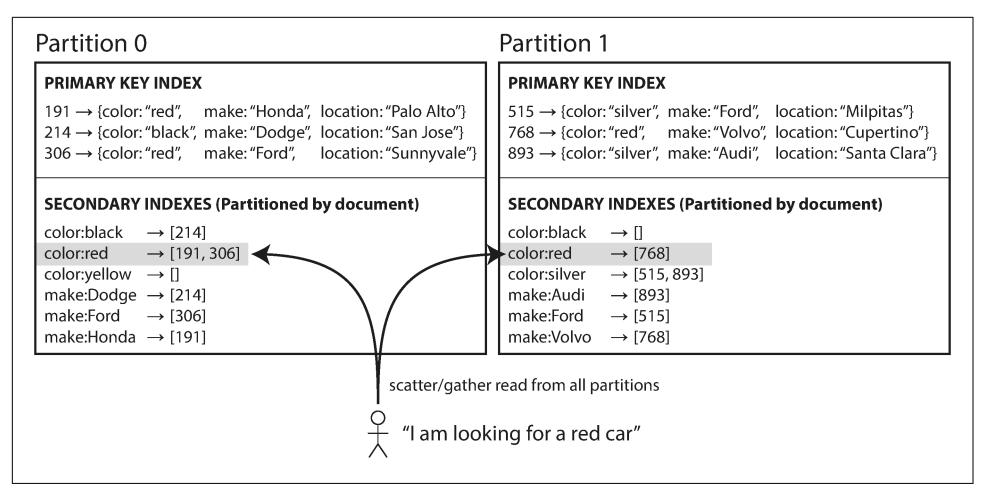

*Figure 6-4. Partitioning secondary indexes by document.*

In this indexing approach, each partition is completely separate: each partition main‐ tains its own secondary indexes, covering only the documents in that partition. It doesn't care what data is stored in other partitions. Whenever you need to write to the database—to add, remove, or update a document—you only need to deal with the partition that contains the document ID that you are writing. For that reason, a document-partitioned index is also known as a *local index* (as opposed to a *global index*, described in the next section).

However, reading from a document-partitioned index requires care: unless you have done something special with the document IDs, there is no reason why all the cars with a particular color or a particular make would be in the same partition. In Figure 6-4, red cars appear in both partition 0 and partition 1. Thus, if you want to search for red cars, you need to send the query to *all* partitions, and combine all the results you get back.

This approach to querying a partitioned database is sometimes known as *scatter/ gather*, and it can make read queries on secondary indexes quite expensive. Even if you query the partitions in parallel, scatter/gather is prone to tail latency amplifica‐ tion (see ["Percentiles in Practice" on page 16\)](#page-37-0). Nevertheless, it is widely used: Mon‐ goDB, Riak [[15\]](#page-239-0), Cassandra [\[16](#page-240-0)], Elasticsearch [\[17\]](#page-240-0), SolrCloud [\[18](#page-240-0)], and VoltDB [\[19](#page-240-0)] all use document-partitioned secondary indexes. Most database vendors recommend that you structure your partitioning scheme so that secondary index queries can be served from a single partition, but that is not always possible, especially when you're using multiple secondary indexes in a single query (such as filtering cars by color and by make at the same time).

<span id="page-229-0"></span>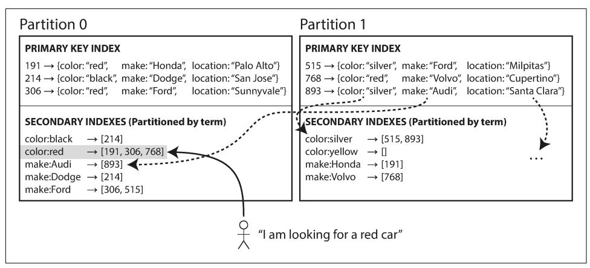

*Figure 6-5. Partitioning secondary indexes by term.*

## **Partitioning Secondary Indexes by Term**

Rather than each partition having its own secondary index (a *local index*), we can construct a *global index* that covers data in all partitions. However, we can't just store that index on one node, since it would likely become a bottleneck and defeat the pur‐ pose of partitioning. A global index must also be partitioned, but it can be partitioned differently from the primary key index.

Figure 6-5 illustrates what this could look like: red cars from all partitions appear under color:red in the index, but the index is partitioned so that colors starting with the letters *a* to *r* appear in partition 0 and colors starting with *s* to *z* appear in parti‐ tion 1. The index on the make of car is partitioned similarly (with the partition boundary being between *f* and *h*).

We call this kind of index *term-partitioned*, because the term we're looking for deter‐ mines the partition of the index. Here, a term would be color:red, for example. The name *term* comes from full-text indexes (a particular kind of secondary index), where the terms are all the words that occur in a document.

As before, we can partition the index by the term itself, or using a hash of the term. Partitioning by the term itself can be useful for range scans (e.g., on a numeric prop‐ erty, such as the asking price of the car), whereas partitioning on a hash of the term gives a more even distribution of load.

The advantage of a global (term-partitioned) index over a document-partitioned index is that it can make reads more efficient: rather than doing scatter/gather over all partitions, a client only needs to make a request to the partition containing the term that it wants. However, the downside of a global index is that writes are slower and more complicated, because a write to a single document may now affect multiple <span id="page-230-0"></span>partitions of the index (every term in the document might be on a different partition, on a different node).

In an ideal world, the index would always be up to date, and every document written to the database would immediately be reflected in the index. However, in a termpartitioned index, that would require a distributed transaction across all partitions affected by a write, which is not supported in all databases (see [Chapter 7](#page-242-0) and [Chap‐](#page-342-0) [ter 9\)](#page-342-0).

In practice, updates to global secondary indexes are often asynchronous (that is, if you read the index shortly after a write, the change you just made may not yet be reflected in the index). For example, Amazon DynamoDB states that its global secon‐ dary indexes are updated within a fraction of a second in normal circumstances, but may experience longer propagation delays in cases of faults in the infrastructure [\[20](#page-240-0)].

Other uses of global term-partitioned indexes include Riak's search feature [\[21](#page-240-0)] and the Oracle data warehouse, which lets you choose between local and global indexing [[22\]](#page-240-0). We will return to the topic of implementing term-partitioned secondary indexes in [Chapter 12.](#page-510-0)

## **Rebalancing Partitions**

Over time, things change in a database:

- The query throughput increases, so you want to add more CPUs to handle the load.
- The dataset size increases, so you want to add more disks and RAM to store it.
- A machine fails, and other machines need to take over the failed machine's responsibilities.

All of these changes call for data and requests to be moved from one node to another. The process of moving load from one node in the cluster to another is called *reba‐ lancing*.

No matter which partitioning scheme is used, rebalancing is usually expected to meet some minimum requirements:

- After rebalancing, the load (data storage, read and write requests) should be shared fairly between the nodes in the cluster.
- While rebalancing is happening, the database should continue accepting reads and writes.
- No more data than necessary should be moved between nodes, to make rebalanc‐ ing fast and to minimize the network and disk I/O load.

## <span id="page-231-0"></span>**Strategies for Rebalancing**

There are a few different ways of assigning partitions to nodes [\[23\]](#page-240-0). Let's briefly dis‐ cuss each in turn.

## **How not to do it: hash mod N**

When partitioning by the hash of a key, we said earlier ([Figure 6-3\)](#page-225-0) that it's best to divide the possible hashes into ranges and assign each range to a partition (e.g., assign *key* to partition 0 if 0 ≤ *hash*(*key*) < *b*<sup>0</sup> , to partition 1 if *b*<sup>0</sup> ≤ *hash*(*key*) < *b*<sup>1</sup> , etc.).

Perhaps you wondered why we don't just use *mod* (the % operator in many program‐ ming languages). For example, *hash*(*key*) *mod* 10 would return a number between 0 and 9 (if we write the hash as a decimal number, the hash *mod* 10 would be the last digit). If we have 10 nodes, numbered 0 to 9, that seems like an easy way of assigning each key to a node.

The problem with the *mod N* approach is that if the number of nodes *N* changes, most of the keys will need to be moved from one node to another. For example, say *hash*(*key*) = 123456. If you initially have 10 nodes, that key starts out on node 6 (because 123456 *mod* 10 = 6). When you grow to 11 nodes, the key needs to move to node 3 (123456 *mod* 11 = 3), and when you grow to 12 nodes, it needs to move to node 0 (123456 *mod* 12 = 0). Such frequent moves make rebalancing excessively expensive.

We need an approach that doesn't move data around more than necessary.

## **Fixed number of partitions**

Fortunately, there is a fairly simple solution: create many more partitions than there are nodes, and assign several partitions to each node. For example, a database run‐ ning on a cluster of 10 nodes may be split into 1,000 partitions from the outset so that approximately 100 partitions are assigned to each node.

Now, if a node is added to the cluster, the new node can *steal* a few partitions from every existing node until partitions are fairly distributed once again. This process is illustrated in [Figure 6-6](#page-232-0). If a node is removed from the cluster, the same happens in reverse.

Only entire partitions are moved between nodes. The number of partitions does not change, nor does the assignment of keys to partitions. The only thing that changes is the assignment of partitions to nodes. This change of assignment is not immediate it takes some time to transfer a large amount of data over the network—so the old assignment of partitions is used for any reads and writes that happen while the trans‐ fer is in progress.

<span id="page-232-0"></span>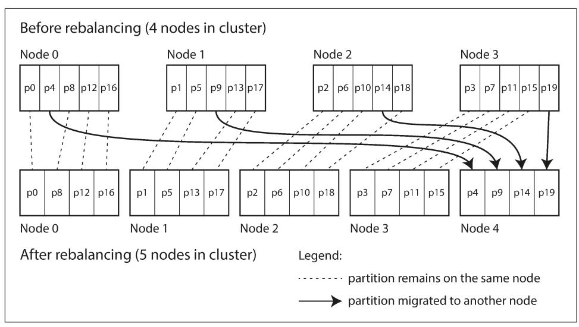

*Figure 6-6. Adding a new node to a database cluster with multiple partitions per node.*

In principle, you can even account for mismatched hardware in your cluster: by assigning more partitions to nodes that are more powerful, you can force those nodes to take a greater share of the load.

This approach to rebalancing is used in Riak [[15\]](#page-239-0), Elasticsearch [[24\]](#page-240-0), Couchbase [[10\]](#page-239-0), and Voldemort [[25\]](#page-240-0).

In this configuration, the number of partitions is usually fixed when the database is first set up and not changed afterward. Although in principle it's possible to split and merge partitions (see the next section), a fixed number of partitions is operationally simpler, and so many fixed-partition databases choose not to implement partition splitting. Thus, the number of partitions configured at the outset is the maximum number of nodes you can have, so you need to choose it high enough to accommo‐ date future growth. However, each partition also has management overhead, so it's counterproductive to choose too high a number.

Choosing the right number of partitions is difficult if the total size of the dataset is highly variable (for example, if it starts small but may grow much larger over time). Since each partition contains a fixed fraction of the total data, the size of each parti‐ tion grows proportionally to the total amount of data in the cluster. If partitions are very large, rebalancing and recovery from node failures become expensive. But if par‐ titions are too small, they incur too much overhead. The best performance is achieved when the size of partitions is "just right," neither too big nor too small, which can be hard to achieve if the number of partitions is fixed but the dataset size varies.

## <span id="page-233-0"></span>**Dynamic partitioning**

For databases that use key range partitioning (see ["Partitioning by Key Range" on](#page-223-0) [page 202\)](#page-223-0), a fixed number of partitions with fixed boundaries would be very incon‐ venient: if you got the boundaries wrong, you could end up with all of the data in one partition and all of the other partitions empty. Reconfiguring the partition bound‐ aries manually would be very tedious.

For that reason, key range–partitioned databases such as HBase and RethinkDB cre‐ ate partitions dynamically. When a partition grows to exceed a configured size (on HBase, the default is 10 GB), it is split into two partitions so that approximately half of the data ends up on each side of the split [[26\]](#page-240-0). Conversely, if lots of data is deleted and a partition shrinks below some threshold, it can be merged with an adjacent par‐ tition. This process is similar to what happens at the top level of a B-tree (see ["B-](#page-100-0)[Trees" on page 79](#page-100-0)).

Each partition is assigned to one node, and each node can handle multiple partitions, like in the case of a fixed number of partitions. After a large partition has been split, one of its two halves can be transferred to another node in order to balance the load. In the case of HBase, the transfer of partition files happens through HDFS, the underlying distributed filesystem [\[3](#page-239-0)].

An advantage of dynamic partitioning is that the number of partitions adapts to the total data volume. If there is only a small amount of data, a small number of parti‐ tions is sufficient, so overheads are small; if there is a huge amount of data, the size of each individual partition is limited to a configurable maximum [[23\]](#page-240-0).

However, a caveat is that an empty database starts off with a single partition, since there is no *a priori* information about where to draw the partition boundaries. While the dataset is small—until it hits the point at which the first partition is split—all writes have to be processed by a single node while the other nodes sit idle. To miti‐ gate this issue, HBase and MongoDB allow an initial set of partitions to be configured on an empty database (this is called *pre-splitting*). In the case of key-range partition‐ ing, pre-splitting requires that you already know what the key distribution is going to look like [\[4](#page-239-0), [26\]](#page-240-0).

Dynamic partitioning is not only suitable for key range–partitioned data, but can equally well be used with hash-partitioned data. MongoDB since version 2.4 supports both key-range and hash partitioning, and it splits partitions dynamically in either case.

## **Partitioning proportionally to nodes**

With dynamic partitioning, the number of partitions is proportional to the size of the dataset, since the splitting and merging processes keep the size of each partition between some fixed minimum and maximum. On the other hand, with a fixed num‐

<span id="page-234-0"></span>ber of partitions, the size of each partition is proportional to the size of the dataset. In both of these cases, the number of partitions is independent of the number of nodes.

A third option, used by Cassandra and Ketama, is to make the number of partitions proportional to the number of nodes—in other words, to have a fixed number of par‐ titions *per node* [\[23](#page-240-0), [27](#page-240-0), [28\]](#page-240-0). In this case, the size of each partition grows proportion‐ ally to the dataset size while the number of nodes remains unchanged, but when you increase the number of nodes, the partitions become smaller again. Since a larger data volume generally requires a larger number of nodes to store, this approach also keeps the size of each partition fairly stable.

When a new node joins the cluster, it randomly chooses a fixed number of existing partitions to split, and then takes ownership of one half of each of those split parti‐ tions while leaving the other half of each partition in place. The randomization can produce unfair splits, but when averaged over a larger number of partitions (in Cas‐ sandra, 256 partitions per node by default), the new node ends up taking a fair share of the load from the existing nodes. Cassandra 3.0 introduced an alternative rebalanc‐ ing algorithm that avoids unfair splits [\[29](#page-240-0)].

Picking partition boundaries randomly requires that hash-based partitioning is used (so the boundaries can be picked from the range of numbers produced by the hash function). Indeed, this approach corresponds most closely to the original definition of consistent hashing [[7\]](#page-239-0) (see ["Consistent Hashing" on page 204\)](#page-225-0). Newer hash func‐ tions can achieve a similar effect with lower metadata overhead [\[8](#page-239-0)].

## **Operations: Automatic or Manual Rebalancing**

There is one important question with regard to rebalancing that we have glossed over: does the rebalancing happen automatically or manually?

There is a gradient between fully automatic rebalancing (the system decides automat‐ ically when to move partitions from one node to another, without any administrator interaction) and fully manual (the assignment of partitions to nodes is explicitly con‐ figured by an administrator, and only changes when the administrator explicitly reconfigures it). For example, Couchbase, Riak, and Voldemort generate a suggested partition assignment automatically, but require an administrator to commit it before it takes effect.

Fully automated rebalancing can be convenient, because there is less operational work to do for normal maintenance. However, it can be unpredictable. Rebalancing is an expensive operation, because it requires rerouting requests and moving a large amount of data from one node to another. If it is not done carefully, this process can overload the network or the nodes and harm the performance of other requests while the rebalancing is in progress.

<span id="page-235-0"></span>Such automation can be dangerous in combination with automatic failure detection. For example, say one node is overloaded and is temporarily slow to respond to requests. The other nodes conclude that the overloaded node is dead, and automati‐ cally rebalance the cluster to move load away from it. This puts additional load on the overloaded node, other nodes, and the network—making the situation worse and potentially causing a cascading failure.

For that reason, it can be a good thing to have a human in the loop for rebalancing. It's slower than a fully automatic process, but it can help prevent operational surprises.

## **Request Routing**

We have now partitioned our dataset across multiple nodes running on multiple machines. But there remains an open question: when a client wants to make a request, how does it know which node to connect to? As partitions are rebalanced, the assignment of partitions to nodes changes. Somebody needs to stay on top of those changes in order to answer the question: if I want to read or write the key "foo", which IP address and port number do I need to connect to?

This is an instance of a more general problem called *service discovery*, which isn't limited to just databases. Any piece of software that is accessible over a network has this problem, especially if it is aiming for high availability (running in a redundant configuration on multiple machines). Many companies have written their own inhouse service discovery tools, and many of these have been released as open source [[30\]](#page-240-0).

On a high level, there are a few different approaches to this problem (illustrated in [Figure 6-7](#page-236-0)):

- 1. Allow clients to contact any node (e.g., via a round-robin load balancer). If that node coincidentally owns the partition to which the request applies, it can handle the request directly; otherwise, it forwards the request to the appropriate node, receives the reply, and passes the reply along to the client.
- 2. Send all requests from clients to a routing tier first, which determines the node that should handle each request and forwards it accordingly. This routing tier does not itself handle any requests; it only acts as a partition-aware load balancer.
- 3. Require that clients be aware of the partitioning and the assignment of partitions to nodes. In this case, a client can connect directly to the appropriate node, without any intermediary.

In all cases, the key problem is: how does the component making the routing decision (which may be one of the nodes, or the routing tier, or the client) learn about changes in the assignment of partitions to nodes?

<span id="page-236-0"></span>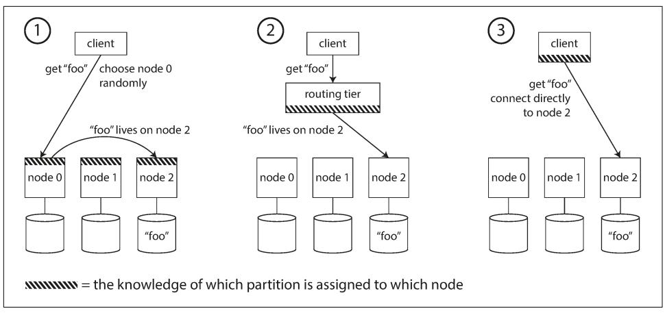

*Figure 6-7. Three different ways of routing a request to the right node.*

This is a challenging problem, because it is important that all participants agree otherwise requests would be sent to the wrong nodes and not handled correctly. There are protocols for achieving consensus in a distributed system, but they are hard to implement correctly (see [Chapter 9](#page-342-0)).

Many distributed data systems rely on a separate coordination service such as Zoo‐ Keeper to keep track of this cluster metadata, as illustrated in Figure 6-8. Each node registers itself in ZooKeeper, and ZooKeeper maintains the authoritative mapping of partitions to nodes. Other actors, such as the routing tier or the partitioning-aware client, can subscribe to this information in ZooKeeper. Whenever a partition changes ownership, or a node is added or removed, ZooKeeper notifies the routing tier so that it can keep its routing information up to date.

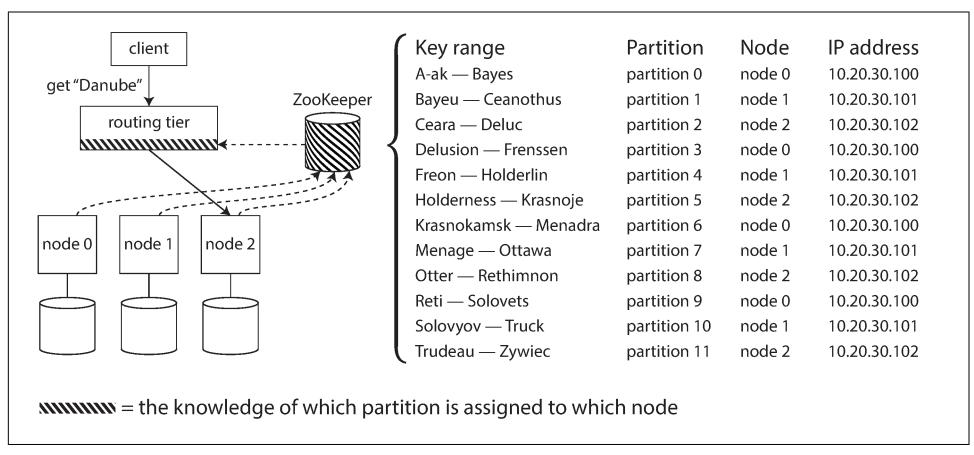

*Figure 6-8. Using ZooKeeper to keep track of assignment of partitions to nodes.*

<span id="page-237-0"></span>For example, LinkedIn's Espresso uses Helix [\[31](#page-240-0)] for cluster management (which in turn relies on ZooKeeper), implementing a routing tier as shown in [Figure 6-8.](#page-236-0) HBase, SolrCloud, and Kafka also use ZooKeeper to track partition assignment. MongoDB has a similar architecture, but it relies on its own *config server* implemen‐ tation and *mongos* daemons as the routing tier.

Cassandra and Riak take a different approach: they use a *gossip protocol* among the nodes to disseminate any changes in cluster state. Requests can be sent to any node, and that node forwards them to the appropriate node for the requested partition (approach 1 in [Figure 6-7](#page-236-0)). This model puts more complexity in the database nodes but avoids the dependency on an external coordination service such as ZooKeeper.

Couchbase does not rebalance automatically, which simplifies the design. Normally it is configured with a routing tier called *moxi*, which learns about routing changes from the cluster nodes [\[32\]](#page-240-0).

When using a routing tier or when sending requests to a random node, clients still need to find the IP addresses to connect to. These are not as fast-changing as the assignment of partitions to nodes, so it is often sufficient to use DNS for this purpose.

## **Parallel Query Execution**

So far we have focused on very simple queries that read or write a single key (plus scatter/gather queries in the case of document-partitioned secondary indexes). This is about the level of access supported by most NoSQL distributed datastores.

However, *massively parallel processing* (MPP) relational database products, often used for analytics, are much more sophisticated in the types of queries they support. A typical data warehouse query contains several join, filtering, grouping, and aggre‐ gation operations. The MPP query optimizer breaks this complex query into a num‐ ber of execution stages and partitions, many of which can be executed in parallel on different nodes of the database cluster. Queries that involve scanning over large parts of the dataset particularly benefit from such parallel execution.

Fast parallel execution of data warehouse queries is a specialized topic, and given the business importance of analytics, it receives a lot of commercial interest. We will dis‐ cuss some techniques for parallel query execution in [Chapter 10.](#page-410-0) For a more detailed overview of techniques used in parallel databases, please see the references [[1,](#page-239-0) [33\]](#page-240-0).

## **Summary**

In this chapter we explored different ways of partitioning a large dataset into smaller subsets. Partitioning is necessary when you have so much data that storing and pro‐ cessing it on a single machine is no longer feasible.

<span id="page-238-0"></span>The goal of partitioning is to spread the data and query load evenly across multiple machines, avoiding hot spots (nodes with disproportionately high load). This requires choosing a partitioning scheme that is appropriate to your data, and reba‐ lancing the partitions when nodes are added to or removed from the cluster.

We discussed two main approaches to partitioning:

- *Key range partitioning*, where keys are sorted, and a partition owns all the keys from some minimum up to some maximum. Sorting has the advantage that effi‐ cient range queries are possible, but there is a risk of hot spots if the application often accesses keys that are close together in the sorted order.
  - In this approach, partitions are typically rebalanced dynamically by splitting the range into two subranges when a partition gets too big.
- *Hash partitioning*, where a hash function is applied to each key, and a partition owns a range of hashes. This method destroys the ordering of keys, making range queries inefficient, but may distribute load more evenly.
  - When partitioning by hash, it is common to create a fixed number of partitions in advance, to assign several partitions to each node, and to move entire parti‐ tions from one node to another when nodes are added or removed. Dynamic partitioning can also be used.

Hybrid approaches are also possible, for example with a compound key: using one part of the key to identify the partition and another part for the sort order.

We also discussed the interaction between partitioning and secondary indexes. A sec‐ ondary index also needs to be partitioned, and there are two methods:

- *Document-partitioned indexes* (local indexes), where the secondary indexes are stored in the same partition as the primary key and value. This means that only a single partition needs to be updated on write, but a read of the secondary index requires a scatter/gather across all partitions.
- *Term-partitioned indexes* (global indexes), where the secondary indexes are parti‐ tioned separately, using the indexed values. An entry in the secondary index may include records from all partitions of the primary key. When a document is writ‐ ten, several partitions of the secondary index need to be updated; however, a read can be served from a single partition.

Finally, we discussed techniques for routing queries to the appropriate partition, which range from simple partition-aware load balancing to sophisticated parallel query execution engines.

By design, every partition operates mostly independently—that's what allows a parti‐ tioned database to scale to multiple machines. However, operations that need to write <span id="page-239-0"></span>to several partitions can be difficult to reason about: for example, what happens if the write to one partition succeeds, but another fails? We will address that question in the following chapters.

## **References**

- [[1\]](#page-221-0) David J. DeWitt and Jim N. Gray: ["Parallel Database Systems: The Future of High](http://www.cs.cmu.edu/~pavlo/courses/fall2013/static/papers/dewittgray92.pdf) [Performance Database Systems,](http://www.cs.cmu.edu/~pavlo/courses/fall2013/static/papers/dewittgray92.pdf)" *Communications of the ACM*, volume 35, number 6, pages 85–98, June 1992. [doi:10.1145/129888.129894](http://dx.doi.org/10.1145/129888.129894)
- [[2\]](#page-223-0) Lars George: "[HBase vs. BigTable Comparison](http://www.larsgeorge.com/2009/11/hbase-vs-bigtable-comparison.html)," *larsgeorge.com*, November 2009.
- [[3\]](#page-223-0) "[The Apache HBase Reference Guide](https://hbase.apache.org/book/book.html)," Apache Software Foundation, *hbase.apache.org*, 2014.
- [[4\]](#page-223-0) MongoDB, Inc.: ["New Hash-Based Sharding Feature in MongoDB 2.4](http://blog.mongodb.org/post/47633823714/new-hash-based-sharding-feature-in-mongodb-24)," *blog.mon‐ godb.org*, April 10, 2013.
- [[5\]](#page-224-0) Ikai Lan: ["App Engine Datastore Tip: Monotonically Increasing Values Are Bad](http://ikaisays.com/2011/01/25/app-engine-datastore-tip-monotonically-increasing-values-are-bad/)," *ikaisays.com*, January 25, 2011.
- [[6\]](#page-224-0) Martin Kleppmann: ["Java's hashCode Is Not Safe for Distributed Systems,](http://martin.kleppmann.com/2012/06/18/java-hashcode-unsafe-for-distributed-systems.html)" *mar‐ tin.kleppmann.com*, June 18, 2012.
- [[7\]](#page-225-0) David Karger, Eric Lehman, Tom Leighton, et al.: "[Consistent Hashing and Ran‐](http://www.akamai.com/dl/technical_publications/ConsistenHashingandRandomTreesDistributedCachingprotocolsforrelievingHotSpotsontheworldwideweb.pdf) [dom Trees: Distributed Caching Protocols for Relieving Hot Spots on the World](http://www.akamai.com/dl/technical_publications/ConsistenHashingandRandomTreesDistributedCachingprotocolsforrelievingHotSpotsontheworldwideweb.pdf) [Wide Web,](http://www.akamai.com/dl/technical_publications/ConsistenHashingandRandomTreesDistributedCachingprotocolsforrelievingHotSpotsontheworldwideweb.pdf)" at *29th Annual ACM Symposium on Theory of Computing* (STOC), pages 654–663, 1997. [doi:10.1145/258533.258660](http://dx.doi.org/10.1145/258533.258660)
- [[8\]](#page-225-0) John Lamping and Eric Veach: ["A Fast, Minimal Memory, Consistent Hash Algo‐](http://arxiv.org/pdf/1406.2294v1.pdf) [rithm](http://arxiv.org/pdf/1406.2294v1.pdf)," *arxiv.org*, June 2014.
- [[9\]](#page-225-0) Eric Redmond: "[A Little Riak Book,](http://littleriakbook.com/)" Version 1.4.0, Basho Technologies, Septem‐ ber 2013.
- [[10\]](#page-225-0) "[Couchbase 2.5 Administrator Guide](http://docs.couchbase.com/couchbase-manual-2.5/cb-admin/)," Couchbase, Inc., 2014.
- [[11\]](#page-225-0) Avinash Lakshman and Prashant Malik: "[Cassandra A Decentralized Struc‐](http://www.cs.cornell.edu/Projects/ladis2009/papers/Lakshman-ladis2009.PDF) [tured Storage System,](http://www.cs.cornell.edu/Projects/ladis2009/papers/Lakshman-ladis2009.PDF)" at *3rd ACM SIGOPS International Workshop on Large Scale Distributed Systems and Middleware* (LADIS), October 2009.
- [[12\]](#page-225-0) Jonathan Ellis: ["Facebook's Cassandra Paper, Annotated and Compared to](http://www.datastax.com/documentation/articles/cassandra/cassandrathenandnow.html) [Apache Cassandra 2.0,](http://www.datastax.com/documentation/articles/cassandra/cassandrathenandnow.html)" *datastax.com*, September 12, 2013.
- [[13\]](#page-225-0) "[Introduction to Cassandra Query Language](http://www.datastax.com/documentation/cql/3.1/cql/cql_intro_c.html)," DataStax, Inc., 2014.
- [[14\]](#page-226-0) Samuel Axon: ["3% of Twitter's Servers Dedicated to Justin Bieber,](http://mashable.com/2010/09/07/justin-bieber-twitter/)" *masha‐ ble.com*, September 7, 2010.
- [[15\]](#page-228-0) "[Riak 1.4.8 Docs](http://docs.basho.com/riak/1.4.8/)," Basho Technologies, Inc., 2014.

- <span id="page-240-0"></span>[[16\]](#page-228-0) Richard Low: ["The Sweet Spot for Cassandra Secondary Indexing,](http://www.wentnet.com/blog/?p=77)" *wentnet.com*, October 21, 2013.
- [[17\]](#page-228-0) Zachary Tong: ["Customizing Your Document Routing](http://www.elasticsearch.org/blog/customizing-your-document-routing/)," *elasticsearch.org*, June 3, 2013.
- [[18\]](#page-228-0) "[Apache Solr Reference Guide](https://cwiki.apache.org/confluence/display/solr/Apache+Solr+Reference+Guide)," Apache Software Foundation, 2014.
- [[19\]](#page-228-0) Andrew Pavlo: ["H-Store Frequently Asked Questions,](http://hstore.cs.brown.edu/documentation/faq/)" *hstore.cs.brown.edu*, October 2013.
- [[20\]](#page-230-0) "[Amazon DynamoDB Developer Guide](http://docs.aws.amazon.com/amazondynamodb/latest/developerguide/)," Amazon Web Services, Inc., 2014.
- [[21\]](#page-230-0) Rusty Klophaus: "[Difference Between 2I and Search](http://lists.basho.com/pipermail/riak-users_lists.basho.com/2011-October/006220.html)," email to *riak-users* mailing list, *lists.basho.com*, October 25, 2011.
- [[22\]](#page-230-0) Donald K. Burleson: "[Object Partitioning in Oracle](http://www.dba-oracle.com/art_partit.htm)," *dba-oracle.com*, November 8, 2000.
- [[23\]](#page-231-0) Eric Evans: "[Rethinking Topology in Cassandra,](http://www.slideshare.net/jericevans/virtual-nodes-rethinking-topology-in-cassandra)" at *ApacheCon Europe*, Novem‐ ber 2012.
- [[24\]](#page-232-0) Rafał Kuć: ["Reroute API Explained](http://elasticsearchserverbook.com/reroute-api-explained/)," *elasticsearchserverbook.com*, September 30, 2013.
- [[25\]](#page-232-0) "[Project Voldemort Documentation,](http://www.project-voldemort.com/voldemort/)" *project-voldemort.com*.
- [[26\]](#page-233-0) Enis Soztutar: "[Apache HBase Region Splitting and Merging](http://hortonworks.com/blog/apache-hbase-region-splitting-and-merging/)," *hortonworks.com*, February 1, 2013.
- [[27\]](#page-234-0) Brandon Williams: "[Virtual Nodes in Cassandra 1.2](http://www.datastax.com/dev/blog/virtual-nodes-in-cassandra-1-2)," *datastax.com*, December 4, 2012.
- [[28\]](#page-234-0) Richard Jones: ["libketama: Consistent Hashing Library for Memcached Clients](https://www.metabrew.com/article/libketama-consistent-hashing-algo-memcached-clients)," *metabrew.com*, April 10, 2007.
- [[29\]](#page-234-0) Branimir Lambov: ["New Token Allocation Algorithm in Cassandra 3.0,](http://www.datastax.com/dev/blog/token-allocation-algorithm)" *data‐ stax.com*, January 28, 2016.
- [[30\]](#page-235-0) Jason Wilder: "[Open-Source Service Discovery,](http://jasonwilder.com/blog/2014/02/04/service-discovery-in-the-cloud/)" *jasonwilder.com*, February 2014.
- [[31\]](#page-237-0) Kishore Gopalakrishna, Shi Lu, Zhen Zhang, et al.: "[Untangling Cluster Manage‐](http://www.socc2012.org/helix_onecol.pdf?attredirects=0) [ment with Helix,](http://www.socc2012.org/helix_onecol.pdf?attredirects=0)" at *ACM Symposium on Cloud Computing* (SoCC), October 2012. [doi:10.1145/2391229.2391248](http://dx.doi.org/10.1145/2391229.2391248)
- [[32\]](#page-237-0) "[Moxi 1.8 Manual](http://docs.couchbase.com/moxi-manual-1.8/)," Couchbase, Inc., 2014.
- [[33\]](#page-237-0) Shivnath Babu and Herodotos Herodotou: ["Massively Parallel Databases and](http://research.microsoft.com/pubs/206464/db-mr-survey-final.pdf) [MapReduce Systems](http://research.microsoft.com/pubs/206464/db-mr-survey-final.pdf)," *Foundations and Trends in Databases*, volume 5, number 1, pages 1–104, November 2013. [doi:10.1561/1900000036](http://dx.doi.org/10.1561/1900000036)

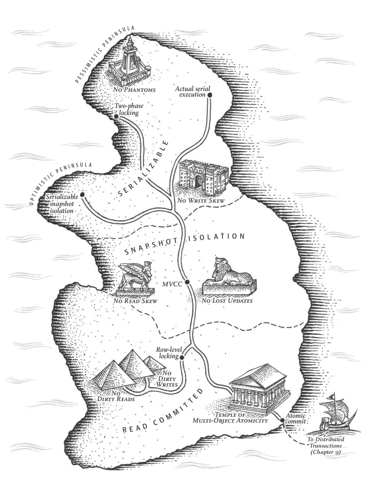

# **Transactions**

<span id="page-242-0"></span>*Some authors have claimed that general two-phase commit is too expensive to support, because of the performance or availability problems that it brings. We believe it is better to have application programmers deal with performance problems due to overuse of transac‐ tions as bottlenecks arise, rather than always coding around the lack of transactions.*

—James Corbett et al., *Spanner: Google's Globally-Distributed Database* (2012)

In the harsh reality of data systems, many things can go wrong:

- The database software or hardware may fail at any time (including in the middle of a write operation).
- The application may crash at any time (including halfway through a series of operations).
- Interruptions in the network can unexpectedly cut off the application from the database, or one database node from another.
- Several clients may write to the database at the same time, overwriting each other's changes.
- A client may read data that doesn't make sense because it has only partially been updated.
- Race conditions between clients can cause surprising bugs.

In order to be reliable, a system has to deal with these faults and ensure that they don't cause catastrophic failure of the entire system. However, implementing faulttolerance mechanisms is a lot of work. It requires a lot of careful thinking about all the things that can go wrong, and a lot of testing to ensure that the solution actually works.

<span id="page-243-0"></span>For decades, *transactions* have been the mechanism of choice for simplifying these issues. A transaction is a way for an application to group several reads and writes together into a logical unit. Conceptually, all the reads and writes in a transaction are executed as one operation: either the entire transaction succeeds (*commit*) or it fails (*abort*, *rollback*). If it fails, the application can safely retry. With transactions, error handling becomes much simpler for an application, because it doesn't need to worry about partial failure—i.e., the case where some operations succeed and some fail (for whatever reason).

If you have spent years working with transactions, they may seem obvious, but we shouldn't take them for granted. Transactions are not a law of nature; they were cre‐ ated with a purpose, namely to *simplify the programming model* for applications accessing a database. By using transactions, the application is free to ignore certain potential error scenarios and concurrency issues, because the database takes care of them instead (we call these *safety guarantees*).

Not every application needs transactions, and sometimes there are advantages to weakening transactional guarantees or abandoning them entirely (for example, to achieve higher performance or higher availability). Some safety properties can be achieved without transactions.

How do you figure out whether you need transactions? In order to answer that ques‐ tion, we first need to understand exactly what safety guarantees transactions can pro‐ vide, and what costs are associated with them. Although transactions seem straightforward at first glance, there are actually many subtle but important details that come into play.

In this chapter, we will examine many examples of things that can go wrong, and explore the algorithms that databases use to guard against those issues. We will go especially deep in the area of concurrency control, discussing various kinds of race conditions that can occur and how databases implement isolation levels such as *read committed*, *snapshot isolation*, and *serializability*.

This chapter applies to both single-node and distributed databases; in [Chapter 8](#page-294-0) we will focus the discussion on the particular challenges that arise only in distributed systems.

## **The Slippery Concept of a Transaction**

Almost all relational databases today, and some nonrelational databases, support transactions. Most of them follow the style that was introduced in 1975 by IBM Sys‐ tem R, the first SQL database [[1,](#page-289-0) [2,](#page-289-0) [3](#page-289-0)]. Although some implementation details have changed, the general idea has remained virtually the same for 40 years: the transac‐ tion support in MySQL, PostgreSQL, Oracle, SQL Server, etc., is uncannily similar to that of System R.

<span id="page-244-0"></span>In the late 2000s, nonrelational (NoSQL) databases started gaining popularity. They aimed to improve upon the relational status quo by offering a choice of new data models (see [Chapter 2\)](#page-48-0), and by including replication ([Chapter 5](#page-172-0)) and partitioning ([Chapter 6\)](#page-220-0) by default. Transactions were the main casualty of this movement: many of this new generation of databases abandoned transactions entirely, or redefined the word to describe a much weaker set of guarantees than had previously been under‐ stood [\[4](#page-289-0)].

With the hype around this new crop of distributed databases, there emerged a popu‐ lar belief that transactions were the antithesis of scalability, and that any large-scale system would have to abandon transactions in order to maintain good performance and high availability [\[5,](#page-289-0) [6\]](#page-289-0). On the other hand, transactional guarantees are some‐ times presented by database vendors as an essential requirement for "serious applica‐ tions" with "valuable data." Both viewpoints are pure hyperbole.

The truth is not that simple: like every other technical design choice, transactions have advantages and limitations. In order to understand those trade-offs, let's go into the details of the guarantees that transactions can provide—both in normal operation and in various extreme (but realistic) circumstances.

## **The Meaning of ACID**

The safety guarantees provided by transactions are often described by the wellknown acronym *ACID*, which stands for *Atomicity*, *Consistency*, *Isolation*, and *Dura‐ bility*. It was coined in 1983 by Theo Härder and Andreas Reuter [[7\]](#page-289-0) in an effort to establish precise terminology for fault-tolerance mechanisms in databases.

However, in practice, one database's implementation of ACID does not equal another's implementation. For example, as we shall see, there is a lot of ambiguity around the meaning of *isolation* [\[8](#page-289-0)]. The high-level idea is sound, but the devil is in the details. Today, when a system claims to be "ACID compliant," it's unclear what guarantees you can actually expect. ACID has unfortunately become mostly a mar‐ keting term.

(Systems that do not meet the ACID criteria are sometimes called *BASE*, which stands for *Basically Available*, *Soft state*, and *Eventual consistency* [\[9](#page-289-0)]. This is even more vague than the definition of ACID. It seems that the only sensible definition of BASE is "not ACID"; i.e., it can mean almost anything you want.)

Let's dig into the definitions of atomicity, consistency, isolation, and durability, as this will let us refine our idea of transactions.

## **Atomicity**

In general, *atomic* refers to something that cannot be broken down into smaller parts. The word means similar but subtly different things in different branches of comput‐ <span id="page-245-0"></span>ing. For example, in multi-threaded programming, if one thread executes an atomic operation, that means there is no way that another thread could see the half-finished result of the operation. The system can only be in the state it was before the operation or after the operation, not something in between.

By contrast, in the context of ACID, atomicity is *not* about concurrency. It does not describe what happens if several processes try to access the same data at the same time, because that is covered under the letter *I*, for *isolation* (see ["Isolation"](#page-246-0) on page [225](#page-246-0)).

Rather, ACID atomicity describes what happens if a client wants to make several writes, but a fault occurs after some of the writes have been processed—for example, a process crashes, a network connection is interrupted, a disk becomes full, or some integrity constraint is violated. If the writes are grouped together into an atomic transaction, and the transaction cannot be completed (*committed*) due to a fault, then the transaction is *aborted* and the database must discard or undo any writes it has made so far in that transaction.

Without atomicity, if an error occurs partway through making multiple changes, it's difficult to know which changes have taken effect and which haven't. The application could try again, but that risks making the same change twice, leading to duplicate or incorrect data. Atomicity simplifies this problem: if a transaction was aborted, the application can be sure that it didn't change anything, so it can safely be retried.

The ability to abort a transaction on error and have all writes from that transaction discarded is the defining feature of ACID atomicity. Perhaps *abortability* would have been a better term than *atomicity*, but we will stick with *atomicity* since that's the usual word.

#### **Consistency**

The word *consistency* is terribly overloaded:

- In [Chapter 5](#page-172-0) we discussed *replica consistency* and the issue of *eventual consis‐ tency* that arises in asynchronously replicated systems (see ["Problems with Repli‐](#page-182-0) [cation Lag" on page 161\)](#page-182-0).
- *Consistent hashing* is an approach to partitioning that some systems use for reba‐ lancing (see ["Consistent Hashing" on page 204\)](#page-225-0).
- In the CAP theorem (see [Chapter 9\)](#page-342-0), the word *consistency* is used to mean *linear‐ izability* (see ["Linearizability" on page 324\)](#page-345-0).
- In the context of ACID, *consistency* refers to an application-specific notion of the database being in a "good state."

It's unfortunate that the same word is used with at least four different meanings.

<span id="page-246-0"></span>The idea of ACID consistency is that you have certain statements about your data (*invariants*) that must always be true—for example, in an accounting system, credits and debits across all accounts must always be balanced. If a transaction starts with a database that is valid according to these invariants, and any writes during the transac‐ tion preserve the validity, then you can be sure that the invariants are always satisfied.

However, this idea of consistency depends on the application's notion of invariants, and it's the application's responsibility to define its transactions correctly so that they preserve consistency. This is not something that the database can guarantee: if you write bad data that violates your invariants, the database can't stop you. (Some spe‐ cific kinds of invariants can be checked by the database, for example using foreign key constraints or uniqueness constraints. However, in general, the application defines what data is valid or invalid—the database only stores it.)

Atomicity, isolation, and durability are properties of the database, whereas consis‐ tency (in the ACID sense) is a property of the application. The application may rely on the database's atomicity and isolation properties in order to achieve consistency, but it's not up to the database alone. Thus, the letter C doesn't really belong in ACID.<sup>i</sup>

#### **Isolation**

Most databases are accessed by several clients at the same time. That is no problem if they are reading and writing different parts of the database, but if they are accessing the same database records, you can run into concurrency problems (race conditions).

[Figure 7-1](#page-247-0) is a simple example of this kind of problem. Say you have two clients simultaneously incrementing a counter that is stored in a database. Each client needs to read the current value, add 1, and write the new value back (assuming there is no increment operation built into the database). In [Figure 7-1](#page-247-0) the counter should have increased from 42 to 44, because two increments happened, but it actually only went to 43 because of the race condition.

*Isolation* in the sense of ACID means that concurrently executing transactions are isolated from each other: they cannot step on each other's toes. The classic database textbooks formalize isolation as *serializability*, which means that each transaction can pretend that it is the only transaction running on the entire database. The database ensures that when the transactions have committed, the result is the same as if they had run *serially* (one after another), even though in reality they may have run con‐ currently [[10\]](#page-289-0).

i. Joe Hellerstein has remarked that the C in ACID was "tossed in to make the acronym work" in Härder and Reuter's paper [[7\]](#page-289-0), and that it wasn't considered important at the time.

<span id="page-247-0"></span>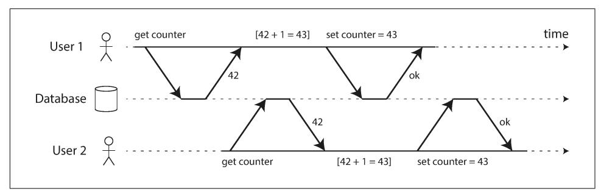

*Figure 7-1. A race condition between two clients concurrently incrementing a counter.*

However, in practice, serializable isolation is rarely used, because it carries a perfor‐ mance penalty. Some popular databases, such as Oracle 11g, don't even implement it. In Oracle there is an isolation level called "serializable," but it actually implements something called *snapshot isolation*, which is a weaker guarantee than serializability [[8,](#page-289-0) [11\]](#page-289-0). We will explore snapshot isolation and other forms of isolation in ["Weak Iso‐](#page-254-0) [lation Levels" on page 233.](#page-254-0)

## **Durability**

The purpose of a database system is to provide a safe place where data can be stored without fear of losing it. *Durability* is the promise that once a transaction has com‐ mitted successfully, any data it has written will not be forgotten, even if there is a hardware fault or the database crashes.

In a single-node database, durability typically means that the data has been written to nonvolatile storage such as a hard drive or SSD. It usually also involves a write-ahead log or similar (see ["Making B-trees reliable" on page 82\)](#page-103-0), which allows recovery in the event that the data structures on disk are corrupted. In a replicated database, durabil‐ ity may mean that the data has been successfully copied to some number of nodes. In order to provide a durability guarantee, a database must wait until these writes or replications are complete before reporting a transaction as successfully committed.

As discussed in ["Reliability" on page 6,](#page-27-0) perfect durability does not exist: if all your hard disks and all your backups are destroyed at the same time, there's obviously nothing your database can do to save you.

## **Replication and Durability**

<span id="page-248-0"></span>Historically, durability meant writing to an archive tape. Then it was understood as writing to a disk or SSD. More recently, it has been adapted to mean replication. Which implementation is better?

The truth is, nothing is perfect:

- If you write to disk and the machine dies, even though your data isn't lost, it is inaccessible until you either fix the machine or transfer the disk to another machine. Replicated systems can remain available.
- A correlated fault—a power outage or a bug that crashes every node on a particu‐ lar input—can knock out all replicas at once (see ["Reliability" on page 6](#page-27-0)), losing any data that is only in memory. Writing to disk is therefore still relevant for inmemory databases.
- In an asynchronously replicated system, recent writes may be lost when the leader becomes unavailable (see ["Handling Node Outages" on page 156\)](#page-177-0).
- When the power is suddenly cut, SSDs in particular have been shown to some‐ times violate the guarantees they are supposed to provide: even fsync isn't guar‐ anteed to work correctly [[12](#page-290-0)]. Disk firmware can have bugs, just like any other kind of software [[13](#page-290-0), [14](#page-290-0)].
- Subtle interactions between the storage engine and the filesystem implementa‐ tion can lead to bugs that are hard to track down, and may cause files on disk to be corrupted after a crash [[15](#page-290-0), [16](#page-290-0)].
- Data on disk can gradually become corrupted without this being detected [[17](#page-290-0)]. If data has been corrupted for some time, replicas and recent backups may also be corrupted. In this case, you will need to try to restore the data from a historical backup.
- One study of SSDs found that between 30% and 80% of drives develop at least one bad block during the first four years of operation [[18](#page-290-0)]. Magnetic hard drives have a lower rate of bad sectors, but a higher rate of complete failure than SSDs.
- If an SSD is disconnected from power, it can start losing data within a few weeks, depending on the temperature [[19](#page-290-0)].

In practice, there is no one technique that can provide absolute guarantees. There are only various risk-reduction techniques, including writing to disk, replicating to remote machines, and backups—and they can and should be used together. As always, it's wise to take any theoretical "guarantees" with a healthy grain of salt.

## <span id="page-249-0"></span>**Single-Object and Multi-Object Operations**

To recap, in ACID, atomicity and isolation describe what the database should do if a client makes several writes within the same transaction:

## *Atomicity*

If an error occurs halfway through a sequence of writes, the transaction should be aborted, and the writes made up to that point should be discarded. In other words, the database saves you from having to worry about partial failure, by giv‐ ing an all-or-nothing guarantee.

## *Isolation*

Concurrently running transactions shouldn't interfere with each other. For example, if one transaction makes several writes, then another transaction should see either all or none of those writes, but not some subset.

These definitions assume that you want to modify several objects (rows, documents, records) at once. Such *multi-object transactions* are often needed if several pieces of data need to be kept in sync. [Figure 7-2](#page-250-0) shows an example from an email application. To display the number of unread messages for a user, you could query something like:

```
SELECT COUNT(*) FROM emails WHERE recipient_id = 2 AND unread_flag = true
```

However, you might find this query to be too slow if there are many emails, and decide to store the number of unread messages in a separate field (a kind of denorm‐ alization). Now, whenever a new message comes in, you have to increment the unread counter as well, and whenever a message is marked as read, you also have to decrement the unread counter.

In [Figure 7-2,](#page-250-0) user 2 experiences an anomaly: the mailbox listing shows an unread message, but the counter shows zero unread messages because the counter increment has not yet happened.ii Isolation would have prevented this issue by ensuring that user 2 sees either both the inserted email and the updated counter, or neither, but not an inconsistent halfway point.

ii. Arguably, an incorrect counter in an email application is not a particularly critical problem. Alternatively, think of a customer account balance instead of an unread counter, and a payment transaction instead of an email.

<span id="page-250-0"></span>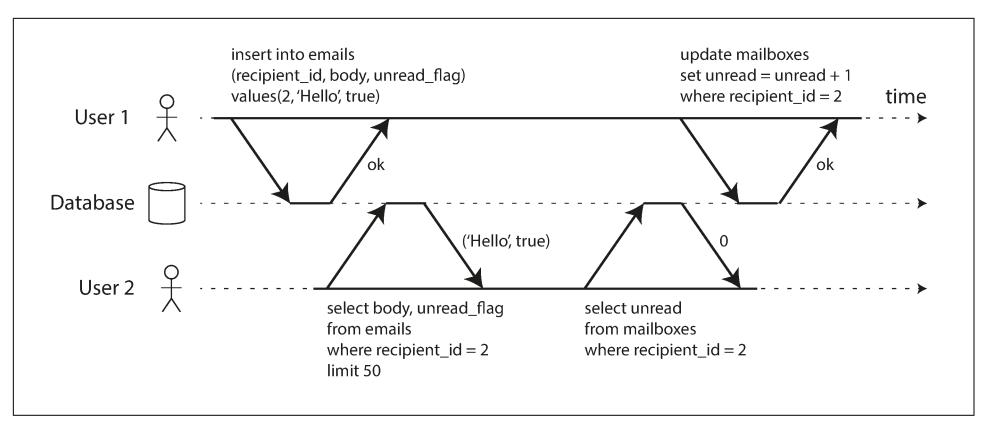

*Figure 7-2. Violating isolation: one transaction reads another transaction's uncommit‐ ted writes (a "dirty read").*

Figure 7-3 illustrates the need for atomicity: if an error occurs somewhere over the course of the transaction, the contents of the mailbox and the unread counter might become out of sync. In an atomic transaction, if the update to the counter fails, the transaction is aborted and the inserted email is rolled back.

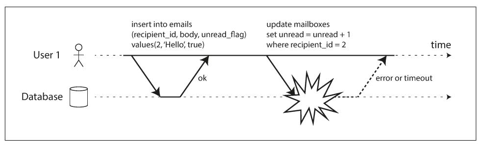

*Figure 7-3. Atomicity ensures that if an error occurs any prior writes from that transac‐ tion are undone, to avoid an inconsistent state.*

Multi-object transactions require some way of determining which read and write operations belong to the same transaction. In relational databases, that is typically done based on the client's TCP connection to the database server: on any particular connection, everything between a BEGIN TRANSACTION and a COMMIT statement is considered to be part of the same transaction.iii

iii. This is not ideal. If the TCP connection is interrupted, the transaction must be aborted. If the interruption happens after the client has requested a commit but before the server acknowledges that the commit hap‐ pened, the client doesn't know whether the transaction was committed or not. To solve this issue, a transac‐ tion manager can group operations by a unique transaction identifier that is not bound to a particular TCP connection. We will return to this topic in ["The End-to-End Argument for Databases" on page 516.](#page-537-0)

<span id="page-251-0"></span>On the other hand, many nonrelational databases don't have such a way of grouping operations together. Even if there is a multi-object API (for example, a key-value store may have a *multi-put* operation that updates several keys in one operation), that doesn't necessarily mean it has transaction semantics: the command may succeed for some keys and fail for others, leaving the database in a partially updated state.

## **Single-object writes**

Atomicity and isolation also apply when a single object is being changed. For exam‐ ple, imagine you are writing a 20 KB JSON document to a database:

- If the network connection is interrupted after the first 10 KB have been sent, does the database store that unparseable 10 KB fragment of JSON?
- If the power fails while the database is in the middle of overwriting the previous value on disk, do you end up with the old and new values spliced together?
- If another client reads that document while the write is in progress, will it see a partially updated value?

Those issues would be incredibly confusing, so storage engines almost universally aim to provide atomicity and isolation on the level of a single object (such as a keyvalue pair) on one node. Atomicity can be implemented using a log for crash recov‐ ery (see ["Making B-trees reliable" on page 82\)](#page-103-0), and isolation can be implemented using a lock on each object (allowing only one thread to access an object at any one time).

Some databases also provide more complex atomic operations,iv such as an increment operation, which removes the need for a read-modify-write cycle like that in [Figure 7-1.](#page-247-0) Similarly popular is a compare-and-set operation, which allows a write to happen only if the value has not been concurrently changed by someone else (see ["Compare-and-set" on page 245\)](#page-266-0).

These single-object operations are useful, as they can prevent lost updates when sev‐ eral clients try to write to the same object concurrently (see ["Preventing Lost](#page-263-0) [Updates" on page 242](#page-263-0)). However, they are not transactions in the usual sense of the word. Compare-and-set and other single-object operations have been dubbed "light‐ weight transactions" or even "ACID" for marketing purposes [\[20,](#page-290-0) [21,](#page-290-0) [22\]](#page-290-0), but that terminology is misleading. A transaction is usually understood as a mechanism for grouping multiple operations on multiple objects into one unit of execution.

iv. Strictly speaking, the term *atomic increment* uses the word *atomic* in the sense of multi-threaded pro‐ gramming. In the context of ACID, it should actually be called *isolated* or *serializable* increment. But that's getting nitpicky.

## <span id="page-252-0"></span>**The need for multi-object transactions**

Many distributed datastores have abandoned multi-object transactions because they are difficult to implement across partitions, and they can get in the way in some sce‐ narios where very high availability or performance is required. However, there is nothing that fundamentally prevents transactions in a distributed database, and we will discuss implementations of distributed transactions in [Chapter 9.](#page-342-0)

But do we need multi-object transactions at all? Would it be possible to implement any application with only a key-value data model and single-object operations?

There are some use cases in which single-object inserts, updates, and deletes are suffi‐ cient. However, in many other cases writes to several different objects need to be coordinated:

- In a relational data model, a row in one table often has a foreign key reference to a row in another table. (Similarly, in a graph-like data model, a vertex has edges to other vertices.) Multi-object transactions allow you to ensure that these refer‐ ences remain valid: when inserting several records that refer to one another, the foreign keys have to be correct and up to date, or the data becomes nonsensical.
- In a document data model, the fields that need to be updated together are often within the same document, which is treated as a single object—no multi-object transactions are needed when updating a single document. However, document databases lacking join functionality also encourage denormalization (see ["Rela‐](#page-59-0) [tional Versus Document Databases Today" on page 38](#page-59-0)). When denormalized information needs to be updated, like in the example of [Figure 7-2,](#page-250-0) you need to update several documents in one go. Transactions are very useful in this situation to prevent denormalized data from going out of sync.
- In databases with secondary indexes (almost everything except pure key-value stores), the indexes also need to be updated every time you change a value. These indexes are different database objects from a transaction point of view: for exam‐ ple, without transaction isolation, it's possible for a record to appear in one index but not another, because the update to the second index hasn't happened yet.

Such applications can still be implemented without transactions. However, error han‐ dling becomes much more complicated without atomicity, and the lack of isolation can cause concurrency problems. We will discuss those in ["Weak Isolation Levels" on](#page-254-0) [page 233,](#page-254-0) and explore alternative approaches in [Chapter 12.](#page-510-0)

#### **Handling errors and aborts**

A key feature of a transaction is that it can be aborted and safely retried if an error occurred. ACID databases are based on this philosophy: if the database is in danger

<span id="page-253-0"></span>of violating its guarantee of atomicity, isolation, or durability, it would rather aban‐ don the transaction entirely than allow it to remain half-finished.

Not all systems follow that philosophy, though. In particular, datastores with leader‐ less replication (see ["Leaderless Replication" on page 177\)](#page-198-0) work much more on a "best effort" basis, which could be summarized as "the database will do as much as it can, and if it runs into an error, it won't undo something it has already done"—so it's the application's responsibility to recover from errors.

Errors will inevitably happen, but many software developers prefer to think only about the happy path rather than the intricacies of error handling. For example, pop‐ ular object-relational mapping (ORM) frameworks such as Rails's ActiveRecord and Django don't retry aborted transactions—the error usually results in an exception bubbling up the stack, so any user input is thrown away and the user gets an error message. This is a shame, because the whole point of aborts is to enable safe retries.

Although retrying an aborted transaction is a simple and effective error handling mechanism, it isn't perfect:

- If the transaction actually succeeded, but the network failed while the server tried to acknowledge the successful commit to the client (so the client thinks it failed), then retrying the transaction causes it to be performed twice—unless you have an additional application-level deduplication mechanism in place.
- If the error is due to overload, retrying the transaction will make the problem worse, not better. To avoid such feedback cycles, you can limit the number of retries, use exponential backoff, and handle overload-related errors differently from other errors (if possible).
- It is only worth retrying after transient errors (for example due to deadlock, iso‐ lation violation, temporary network interruptions, and failover); after a perma‐ nent error (e.g., constraint violation) a retry would be pointless.
- If the transaction also has side effects outside of the database, those side effects may happen even if the transaction is aborted. For example, if you're sending an email, you wouldn't want to send the email again every time you retry the trans‐ action. If you want to make sure that several different systems either commit or abort together, two-phase commit can help (we will discuss this in ["Atomic](#page-375-0) [Commit and Two-Phase Commit \(2PC\)" on page 354](#page-375-0)).
- If the client process fails while retrying, any data it was trying to write to the database is lost.

## <span id="page-254-0"></span>**Weak Isolation Levels**

If two transactions don't touch the same data, they can safely be run in parallel, because neither depends on the other. Concurrency issues (race conditions) only come into play when one transaction reads data that is concurrently modified by another transaction, or when two transactions try to simultaneously modify the same data.

Concurrency bugs are hard to find by testing, because such bugs are only triggered when you get unlucky with the timing. Such timing issues might occur very rarely, and are usually difficult to reproduce. Concurrency is also very difficult to reason about, especially in a large application where you don't necessarily know which other pieces of code are accessing the database. Application development is difficult enough if you just have one user at a time; having many concurrent users makes it much harder still, because any piece of data could unexpectedly change at any time.

For that reason, databases have long tried to hide concurrency issues from applica‐ tion developers by providing *transaction isolation*. In theory, isolation should make your life easier by letting you pretend that no concurrency is happening: *serializable* isolation means that the database guarantees that transactions have the same effect as if they ran *serially* (i.e., one at a time, without any concurrency).

In practice, isolation is unfortunately not that simple. Serializable isolation has a per‐ formance cost, and many databases don't want to pay that price [[8\]](#page-289-0). It's therefore common for systems to use weaker levels of isolation, which protect against *some* concurrency issues, but not all. Those levels of isolation are much harder to under‐ stand, and they can lead to subtle bugs, but they are nevertheless used in practice [[23\]](#page-290-0).

Concurrency bugs caused by weak transaction isolation are not just a theoretical problem. They have caused substantial loss of money [[24,](#page-290-0) [25](#page-290-0)], led to investigation by financial auditors [[26\]](#page-290-0), and caused customer data to be corrupted [[27\]](#page-290-0). A popular comment on revelations of such problems is "Use an ACID database if you're han‐ dling financial data!"—but that misses the point. Even many popular relational data‐ base systems (which are usually considered "ACID") use weak isolation, so they wouldn't necessarily have prevented these bugs from occurring.

Rather than blindly relying on tools, we need to develop a good understanding of the kinds of concurrency problems that exist, and how to prevent them. Then we can build applications that are reliable and correct, using the tools at our disposal.

In this section we will look at several weak (nonserializable) isolation levels that are used in practice, and discuss in detail what kinds of race conditions can and cannot occur, so that you can decide what level is appropriate to your application. Once we've done that, we will discuss serializability in detail (see ["Serializability"](#page-272-0) on page <span id="page-255-0"></span>[251](#page-272-0)). Our discussion of isolation levels will be informal, using examples. If you want rigorous definitions and analyses of their properties, you can find them in the aca‐ demic literature [\[28](#page-291-0), [29,](#page-291-0) [30\]](#page-291-0).

## **Read Committed**

The most basic level of transaction isolation is *read committed*. v It makes two guaran‐ tees:

- 1. When reading from the database, you will only see data that has been committed (no *dirty reads*).
- 2. When writing to the database, you will only overwrite data that has been com‐ mitted (no *dirty writes*).

Let's discuss these two guarantees in more detail.

## **No dirty reads**

Imagine a transaction has written some data to the database, but the transaction has not yet committed or aborted. Can another transaction see that uncommitted data? If yes, that is called a *dirty read* [[2\]](#page-289-0).

Transactions running at the read committed isolation level must prevent dirty reads. This means that any writes by a transaction only become visible to others when that transaction commits (and then all of its writes become visible at once). This is illus‐ trated in Figure 7-4, where user 1 has set *x* = 3, but user 2's *get x* still returns the old value, 2, while user 1 has not yet committed.

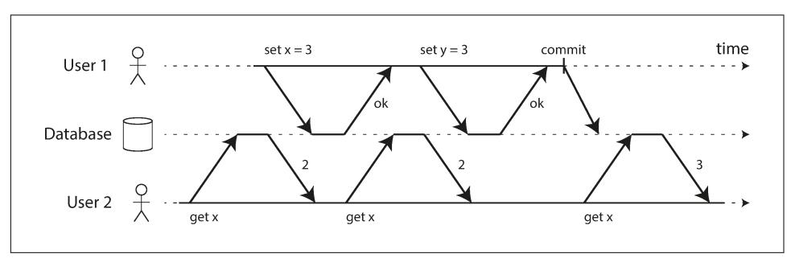

*Figure 7-4. No dirty reads: user 2 sees the new value for x only after user 1's transaction has committed.*

v. Some databases support an even weaker isolation level called *read uncommitted*. It prevents dirty writes, but does not prevent dirty reads.

<span id="page-256-0"></span>There are a few reasons why it's useful to prevent dirty reads:

- If a transaction needs to update several objects, a dirty read means that another transaction may see some of the updates but not others. For example, in [Figure 7-2,](#page-250-0) the user sees the new unread email but not the updated counter. This is a dirty read of the email. Seeing the database in a partially updated state is con‐ fusing to users and may cause other transactions to take incorrect decisions.
- If a transaction aborts, any writes it has made need to be rolled back (like in [Figure 7-3](#page-250-0)). If the database allows dirty reads, that means a transaction may see data that is later rolled back—i.e., which is never actually committed to the data‐ base. Reasoning about the consequences quickly becomes mind-bending.

#### **No dirty writes**

What happens if two transactions concurrently try to update the same object in a database? We don't know in which order the writes will happen, but we normally assume that the later write overwrites the earlier write.

However, what happens if the earlier write is part of a transaction that has not yet committed, so the later write overwrites an uncommitted value? This is called a *dirty write* [\[28](#page-291-0)]. Transactions running at the read committed isolation level must prevent dirty writes, usually by delaying the second write until the first write's transaction has committed or aborted.

By preventing dirty writes, this isolation level avoids some kinds of concurrency problems:

- If transactions update multiple objects, dirty writes can lead to a bad outcome. For example, consider [Figure 7-5](#page-257-0), which illustrates a used car sales website on which two people, Alice and Bob, are simultaneously trying to buy the same car. Buying a car requires two database writes: the listing on the website needs to be updated to reflect the buyer, and the sales invoice needs to be sent to the buyer. In the case of [Figure 7-5,](#page-257-0) the sale is awarded to Bob (because he performs the winning update to the listings table), but the invoice is sent to Alice (because she performs the winning update to the invoices table). Read committed pre‐ vents such mishaps.
- However, read committed does *not* prevent the race condition between two counter increments in [Figure 7-1.](#page-247-0) In this case, the second write happens after the first transaction has committed, so it's not a dirty write. It's still incorrect, but for a different reason—in ["Preventing Lost Updates" on page 242](#page-263-0) we will discuss how to make such counter increments safe.

<span id="page-257-0"></span>

*Figure 7-5. With dirty writes, conflicting writes from different transactions can be mixed up.*

## **Implementing read committed**

Read committed is a very popular isolation level. It is the default setting in Oracle 11g, PostgreSQL, SQL Server 2012, MemSQL, and many other databases [\[8](#page-289-0)].

Most commonly, databases prevent dirty writes by using row-level locks: when a transaction wants to modify a particular object (row or document), it must first acquire a lock on that object. It must then hold that lock until the transaction is com‐ mitted or aborted. Only one transaction can hold the lock for any given object; if another transaction wants to write to the same object, it must wait until the first transaction is committed or aborted before it can acquire the lock and continue. This locking is done automatically by databases in read committed mode (or stronger iso‐ lation levels).

How do we prevent dirty reads? One option would be to use the same lock, and to require any transaction that wants to read an object to briefly acquire the lock and then release it again immediately after reading. This would ensure that a read couldn't happen while an object has a dirty, uncommitted value (because during that time the lock would be held by the transaction that has made the write).

However, the approach of requiring read locks does not work well in practice, because one long-running write transaction can force many read-only transactions to wait until the long-running transaction has completed. This harms the response time of read-only transactions and is bad for operability: a slowdown in one part of an application can have a knock-on effect in a completely different part of the applica‐ tion, due to waiting for locks.

<span id="page-258-0"></span>For that reason, most databasesvi prevent dirty reads using the approach illustrated in [Figure 7-4](#page-255-0): for every object that is written, the database remembers both the old com‐ mitted value and the new value set by the transaction that currently holds the write lock. While the transaction is ongoing, any other transactions that read the object are simply given the old value. Only when the new value is committed do transactions switch over to reading the new value.

## **Snapshot Isolation and Repeatable Read**

If you look superficially at read committed isolation, you could be forgiven for think‐ ing that it does everything that a transaction needs to do: it allows aborts (required for atomicity), it prevents reading the incomplete results of transactions, and it pre‐ vents concurrent writes from getting intermingled. Indeed, those are useful features, and much stronger guarantees than you can get from a system that has no transac‐ tions.

However, there are still plenty of ways in which you can have concurrency bugs when using this isolation level. For example, Figure 7-6 illustrates a problem that can occur with read committed.

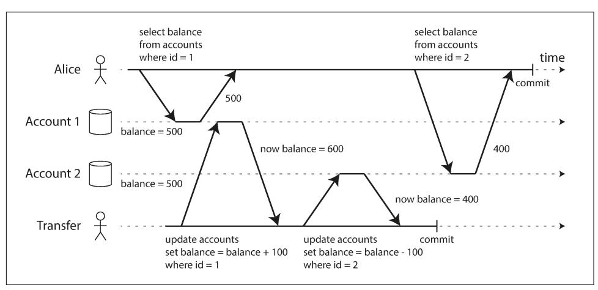

*Figure 7-6. Read skew: Alice observes the database in an inconsistent state.*

Say Alice has \$1,000 of savings at a bank, split across two accounts with \$500 each. Now a transaction transfers \$100 from one of her accounts to the other. If she is unlucky enough to look at her list of account balances in the same moment as that transaction is being processed, she may see one account balance at a time before the

vi. At the time of writing, the only mainstream databases that use locks for read committed isolation are IBM DB2 and Microsoft SQL Server in the read\_committed\_snapshot=off configuration [[23](#page-290-0), [36\]](#page-291-0).

<span id="page-259-0"></span>incoming payment has arrived (with a balance of \$500), and the other account after the outgoing transfer has been made (the new balance being \$400). To Alice it now appears as though she only has a total of \$900 in her accounts—it seems that \$100 has vanished into thin air.

This anomaly is called a *nonrepeatable read* or *read skew*: if Alice were to read the balance of account 1 again at the end of the transaction, she would see a different value (\$600) than she saw in her previous query. Read skew is considered acceptable under read committed isolation: the account balances that Alice saw were indeed committed at the time when she read them.


The term *skew* is unfortunately overloaded: we previously used it in the sense of an *unbalanced workload with hot spots* (see ["Skewed](#page-226-0) [Workloads and Relieving Hot Spots" on page 205](#page-226-0)), whereas here it means *timing anomaly*.

In Alice's case, this is not a lasting problem, because she will most likely see consis‐ tent account balances if she reloads the online banking website a few seconds later. However, some situations cannot tolerate such temporary inconsistency:

#### *Backups*

Taking a backup requires making a copy of the entire database, which may take hours on a large database. During the time that the backup process is running, writes will continue to be made to the database. Thus, you could end up with some parts of the backup containing an older version of the data, and other parts containing a newer version. If you need to restore from such a backup, the inconsistencies (such as disappearing money) become permanent.

## *Analytic queries and integrity checks*

Sometimes, you may want to run a query that scans over large parts of the data‐ base. Such queries are common in analytics (see ["Transaction Processing or Ana‐](#page-111-0) [lytics?" on page 90\)](#page-111-0), or may be part of a periodic integrity check that everything is in order (monitoring for data corruption). These queries are likely to return nonsensical results if they observe parts of the database at different points in time.

*Snapshot isolation* [\[28](#page-291-0)] is the most common solution to this problem. The idea is that each transaction reads from a *consistent snapshot* of the database—that is, the trans‐ action sees all the data that was committed in the database at the start of the transac‐ tion. Even if the data is subsequently changed by another transaction, each transaction sees only the old data from that particular point in time.

Snapshot isolation is a boon for long-running, read-only queries such as backups and analytics. It is very hard to reason about the meaning of a query if the data on which <span id="page-260-0"></span>it operates is changing at the same time as the query is executing. When a transaction can see a consistent snapshot of the database, frozen at a particular point in time, it is much easier to understand.

Snapshot isolation is a popular feature: it is supported by PostgreSQL, MySQL with the InnoDB storage engine, Oracle, SQL Server, and others [\[23,](#page-290-0) [31](#page-291-0), [32](#page-291-0)].

#### **Implementing snapshot isolation**

Like read committed isolation, implementations of snapshot isolation typically use write locks to prevent dirty writes (see ["Implementing read committed" on page 236\)](#page-257-0), which means that a transaction that makes a write can block the progress of another transaction that writes to the same object. However, reads do not require any locks. From a performance point of view, a key principle of snapshot isolation is *readers never block writers, and writers never block readers*. This allows a database to handle long-running read queries on a consistent snapshot at the same time as processing writes normally, without any lock contention between the two.

To implement snapshot isolation, databases use a generalization of the mechanism we saw for preventing dirty reads in [Figure 7-4](#page-255-0). The database must potentially keep several different committed versions of an object, because various in-progress trans‐ actions may need to see the state of the database at different points in time. Because it maintains several versions of an object side by side, this technique is known as *multiversion concurrency control* (MVCC).

If a database only needed to provide read committed isolation, but not snapshot iso‐ lation, it would be sufficient to keep two versions of an object: the committed version and the overwritten-but-not-yet-committed version. However, storage engines that support snapshot isolation typically use MVCC for their read committed isolation level as well. A typical approach is that read committed uses a separate snapshot for each query, while snapshot isolation uses the same snapshot for an entire transaction.

[Figure 7-7](#page-261-0) illustrates how MVCC-based snapshot isolation is implemented in Post‐ greSQL [\[31](#page-291-0)] (other implementations are similar). When a transaction is started, it is given a unique, always-increasingvii transaction ID (txid). Whenever a transaction writes anything to the database, the data it writes is tagged with the transaction ID of the writer.

vii. To be precise, transaction IDs are 32-bit integers, so they overflow after approximately 4 billion transac‐ tions. PostgreSQL's vacuum process performs cleanup which ensures that overflow does not affect the data.

<span id="page-261-0"></span>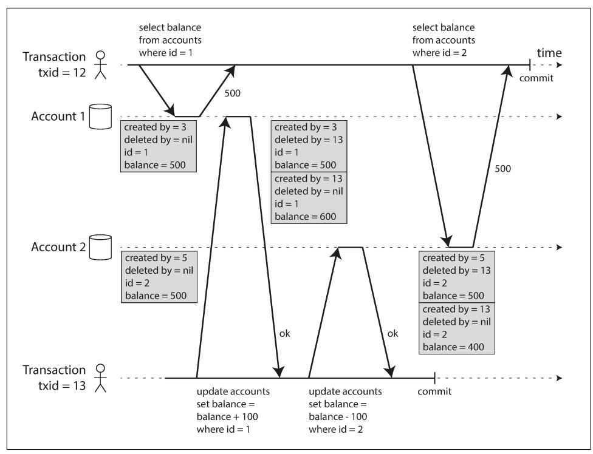

*Figure 7-7. Implementing snapshot isolation using multi-version objects.*

Each row in a table has a created\_by field, containing the ID of the transaction that inserted this row into the table. Moreover, each row has a deleted\_by field, which is initially empty. If a transaction deletes a row, the row isn't actually deleted from the database, but it is marked for deletion by setting the deleted\_by field to the ID of the transaction that requested the deletion. At some later time, when it is certain that no transaction can any longer access the deleted data, a garbage collection process in the database removes any rows marked for deletion and frees their space.

An update is internally translated into a delete and a create. For example, in Figure 7-7, transaction 13 deducts \$100 from account 2, changing the balance from \$500 to \$400. The accounts table now actually contains two rows for account 2: a row with a balance of \$500 which was marked as deleted by transaction 13, and a row with a balance of \$400 which was created by transaction 13.

## **Visibility rules for observing a consistent snapshot**

When a transaction reads from the database, transaction IDs are used to decide which objects it can see and which are invisible. By carefully defining visibility rules, <span id="page-262-0"></span>the database can present a consistent snapshot of the database to the application. This works as follows:

- 1. At the start of each transaction, the database makes a list of all the other transac‐ tions that are in progress (not yet committed or aborted) at that time. Any writes that those transactions have made are ignored, even if the transactions subse‐ quently commit.
- 2. Any writes made by aborted transactions are ignored.
- 3. Any writes made by transactions with a later transaction ID (i.e., which started after the current transaction started) are ignored, regardless of whether those transactions have committed.
- 4. All other writes are visible to the application's queries.

These rules apply to both creation and deletion of objects. In [Figure 7-7](#page-261-0), when trans‐ action 12 reads from account 2, it sees a balance of \$500 because the deletion of the \$500 balance was made by transaction 13 (according to rule 3, transaction 12 cannot see a deletion made by transaction 13), and the creation of the \$400 balance is not yet visible (by the same rule).

Put another way, an object is visible if both of the following conditions are true:

- At the time when the reader's transaction started, the transaction that created the object had already committed.
- The object is not marked for deletion, or if it is, the transaction that requested deletion had not yet committed at the time when the reader's transaction started.

A long-running transaction may continue using a snapshot for a long time, continu‐ ing to read values that (from other transactions' point of view) have long been over‐ written or deleted. By never updating values in place but instead creating a new version every time a value is changed, the database can provide a consistent snapshot while incurring only a small overhead.

## **Indexes and snapshot isolation**

How do indexes work in a multi-version database? One option is to have the index simply point to all versions of an object and require an index query to filter out any object versions that are not visible to the current transaction. When garbage collec‐ tion removes old object versions that are no longer visible to any transaction, the cor‐ responding index entries can also be removed.

In practice, many implementation details determine the performance of multiversion concurrency control. For example, PostgreSQL has optimizations for avoid‐ ing index updates if different versions of the same object can fit on the same page [[31\]](#page-291-0).

<span id="page-263-0"></span>Another approach is used in CouchDB, Datomic, and LMDB. Although they also use B-trees (see ["B-Trees" on page 79\)](#page-100-0), they use an *append-only/copy-on-write* variant that does not overwrite pages of the tree when they are updated, but instead creates a new copy of each modified page. Parent pages, up to the root of the tree, are copied and updated to point to the new versions of their child pages. Any pages that are not affected by a write do not need to be copied, and remain immutable [\[33](#page-291-0), [34,](#page-291-0) [35\]](#page-291-0).

With append-only B-trees, every write transaction (or batch of transactions) creates a new B-tree root, and a particular root is a consistent snapshot of the database at the point in time when it was created. There is no need to filter out objects based on transaction IDs because subsequent writes cannot modify an existing B-tree; they can only create new tree roots. However, this approach also requires a background pro‐ cess for compaction and garbage collection.

## **Repeatable read and naming confusion**

Snapshot isolation is a useful isolation level, especially for read-only transactions. However, many databases that implement it call it by different names. In Oracle it is called *serializable*, and in PostgreSQL and MySQL it is called *repeatable read* [[23\]](#page-290-0).

The reason for this naming confusion is that the SQL standard doesn't have the con‐ cept of snapshot isolation, because the standard is based on System R's 1975 defini‐ tion of isolation levels [[2\]](#page-289-0) and snapshot isolation hadn't yet been invented then. Instead, it defines repeatable read, which looks superficially similar to snapshot isola‐ tion. PostgreSQL and MySQL call their snapshot isolation level repeatable read because it meets the requirements of the standard, and so they can claim standards compliance.

Unfortunately, the SQL standard's definition of isolation levels is flawed—it is ambig‐ uous, imprecise, and not as implementation-independent as a standard should be [[28\]](#page-291-0). Even though several databases implement repeatable read, there are big differ‐ ences in the guarantees they actually provide, despite being ostensibly standardized [[23\]](#page-290-0). There has been a formal definition of repeatable read in the research literature [[29,](#page-291-0) [30\]](#page-291-0), but most implementations don't satisfy that formal definition. And to top it off, IBM DB2 uses "repeatable read" to refer to serializability [\[8](#page-289-0)].

As a result, nobody really knows what repeatable read means.

## **Preventing Lost Updates**

The read committed and snapshot isolation levels we've discussed so far have been primarily about the guarantees of what a read-only transaction can see in the pres‐ ence of concurrent writes. We have mostly ignored the issue of two transactions writ‐ ing concurrently—we have only discussed dirty writes (see ["No dirty writes" on page](#page-256-0) [235](#page-256-0)), one particular type of write-write conflict that can occur.

<span id="page-264-0"></span>There are several other interesting kinds of conflicts that can occur between concur‐ rently writing transactions. The best known of these is the *lost update* problem, illus‐ trated in [Figure 7-1](#page-247-0) with the example of two concurrent counter increments.

The lost update problem can occur if an application reads some value from the data‐ base, modifies it, and writes back the modified value (a *read-modify-write cycle*). If two transactions do this concurrently, one of the modifications can be lost, because the second write does not include the first modification. (We sometimes say that the later write *clobbers* the earlier write.) This pattern occurs in various different scenarios:

- Incrementing a counter or updating an account balance (requires reading the current value, calculating the new value, and writing back the updated value)
- Making a local change to a complex value, e.g., adding an element to a list within a JSON document (requires parsing the document, making the change, and writ‐ ing back the modified document)
- Two users editing a wiki page at the same time, where each user saves their changes by sending the entire page contents to the server, overwriting whatever is currently in the database

Because this is such a common problem, a variety of solutions have been developed.

## **Atomic write operations**

Many databases provide atomic update operations, which remove the need to imple‐ ment read-modify-write cycles in application code. They are usually the best solution if your code can be expressed in terms of those operations. For example, the follow‐ ing instruction is concurrency-safe in most relational databases:

```
UPDATE counters SET value = value + 1 WHERE key = 'foo';
```

Similarly, document databases such as MongoDB provide atomic operations for making local modifications to a part of a JSON document, and Redis provides atomic operations for modifying data structures such as priority queues. Not all writes can easily be expressed in terms of atomic operations—for example, updates to a wiki page involve arbitrary text editingviii—but in situations where atomic operations can be used, they are usually the best choice.

Atomic operations are usually implemented by taking an exclusive lock on the object when it is read so that no other transaction can read it until the update has been

viii. It is possible, albeit fairly complicated, to express the editing of a text document as a stream of atomic mutations. See ["Automatic Conflict Resolution" on page 174](#page-195-0) for some pointers.

<span id="page-265-0"></span>applied. This technique is sometimes known as *cursor stability* [[36,](#page-291-0) [37\]](#page-291-0). Another option is to simply force all atomic operations to be executed on a single thread.

Unfortunately, object-relational mapping frameworks make it easy to accidentally write code that performs unsafe read-modify-write cycles instead of using atomic operations provided by the database [[38\]](#page-291-0). That's not a problem if you know what you are doing, but it is potentially a source of subtle bugs that are difficult to find by testing.

## **Explicit locking**

Another option for preventing lost updates, if the database's built-in atomic opera‐ tions don't provide the necessary functionality, is for the application to explicitly lock objects that are going to be updated. Then the application can perform a readmodify-write cycle, and if any other transaction tries to concurrently read the same object, it is forced to wait until the first read-modify-write cycle has completed.

For example, consider a multiplayer game in which several players can move the same figure concurrently. In this case, an atomic operation may not be sufficient, because the application also needs to ensure that a player's move abides by the rules of the game, which involves some logic that you cannot sensibly implement as a data‐ base query. Instead, you may use a lock to prevent two players from concurrently moving the same piece, as illustrated in Example 7-1.

*Example 7-1. Explicitly locking rows to prevent lost updates*

```
BEGIN TRANSACTION;
SELECT * FROM figures
 WHERE name = 'robot' AND game_id = 222
 FOR UPDATE;
-- Check whether move is valid, then update the position
-- of the piece that was returned by the previous SELECT.
UPDATE figures SET position = 'c4' WHERE id = 1234;
COMMIT;
```

The FOR UPDATE clause indicates that the database should take a lock on all rows returned by this query.

This works, but to get it right, you need to carefully think about your application logic. It's easy to forget to add a necessary lock somewhere in the code, and thus introduce a race condition.

## <span id="page-266-0"></span>**Automatically detecting lost updates**

Atomic operations and locks are ways of preventing lost updates by forcing the readmodify-write cycles to happen sequentially. An alternative is to allow them to execute in parallel and, if the transaction manager detects a lost update, abort the transaction and force it to retry its read-modify-write cycle.

An advantage of this approach is that databases can perform this check efficiently in conjunction with snapshot isolation. Indeed, PostgreSQL's repeatable read, Oracle's serializable, and SQL Server's snapshot isolation levels automatically detect when a lost update has occurred and abort the offending transaction. However, MySQL/ InnoDB's repeatable read does not detect lost updates [\[23](#page-290-0)]. Some authors [[28](#page-291-0), [30](#page-291-0)] argue that a database must prevent lost updates in order to qualify as providing snap‐ shot isolation, so MySQL does not provide snapshot isolation under this definition.

Lost update detection is a great feature, because it doesn't require application code to use any special database features—you may forget to use a lock or an atomic opera‐ tion and thus introduce a bug, but lost update detection happens automatically and is thus less error-prone.

## **Compare-and-set**

In databases that don't provide transactions, you sometimes find an atomic compareand-set operation (previously mentioned in ["Single-object writes" on page 230\)](#page-251-0). The purpose of this operation is to avoid lost updates by allowing an update to happen only if the value has not changed since you last read it. If the current value does not match what you previously read, the update has no effect, and the read-modify-write cycle must be retried.

For example, to prevent two users concurrently updating the same wiki page, you might try something like this, expecting the update to occur only if the content of the page hasn't changed since the user started editing it:

```
-- This may or may not be safe, depending on the database implementation
UPDATE wiki_pages SET content = 'new content'
 WHERE id = 1234 AND content = 'old content';
```

If the content has changed and no longer matches 'old content', this update will have no effect, so you need to check whether the update took effect and retry if neces‐ sary. However, if the database allows the WHERE clause to read from an old snapshot, this statement may not prevent lost updates, because the condition may be true even though another concurrent write is occurring. Check whether your database's compare-and-set operation is safe before relying on it.

## <span id="page-267-0"></span>**Conflict resolution and replication**

In replicated databases (see [Chapter 5\)](#page-172-0), preventing lost updates takes on another dimension: since they have copies of the data on multiple nodes, and the data can potentially be modified concurrently on different nodes, some additional steps need to be taken to prevent lost updates.

Locks and compare-and-set operations assume that there is a single up-to-date copy of the data. However, databases with multi-leader or leaderless replication usually allow several writes to happen concurrently and replicate them asynchronously, so they cannot guarantee that there is a single up-to-date copy of the data. Thus, techni‐ ques based on locks or compare-and-set do not apply in this context. (We will revisit this issue in more detail in ["Linearizability" on page 324.](#page-345-0))

Instead, as discussed in ["Detecting Concurrent Writes" on page 184](#page-205-0), a common approach in such replicated databases is to allow concurrent writes to create several conflicting versions of a value (also known as *siblings*), and to use application code or special data structures to resolve and merge these versions after the fact.

Atomic operations can work well in a replicated context, especially if they are com‐ mutative (i.e., you can apply them in a different order on different replicas, and still get the same result). For example, incrementing a counter or adding an element to a set are commutative operations. That is the idea behind Riak 2.0 datatypes, which prevent lost updates across replicas. When a value is concurrently updated by differ‐ ent clients, Riak automatically merges together the updates in such a way that no updates are lost [[39\]](#page-291-0).

On the other hand, the *last write wins* (LWW) conflict resolution method is prone to lost updates, as discussed in ["Last write wins \(discarding concurrent writes\)" on page](#page-207-0) [186](#page-207-0). Unfortunately, LWW is the default in many replicated databases.

## **Write Skew and Phantoms**

In the previous sections we saw *dirty writes* and *lost updates*, two kinds of race condi‐ tions that can occur when different transactions concurrently try to write to the same objects. In order to avoid data corruption, those race conditions need to be prevented —either automatically by the database, or by manual safeguards such as using locks or atomic write operations.

However, that is not the end of the list of potential race conditions that can occur between concurrent writes. In this section we will see some subtler examples of conflicts.

To begin, imagine this example: you are writing an application for doctors to manage their on-call shifts at a hospital. The hospital usually tries to have several doctors on call at any one time, but it absolutely must have at least one doctor on call. Doctors <span id="page-268-0"></span>can give up their shifts (e.g., if they are sick themselves), provided that at least one colleague remains on call in that shift [[40,](#page-291-0) [41\]](#page-291-0).

Now imagine that Alice and Bob are the two on-call doctors for a particular shift. Both are feeling unwell, so they both decide to request leave. Unfortunately, they happen to click the button to go off call at approximately the same time. What hap‐ pens next is illustrated in Figure 7-8.

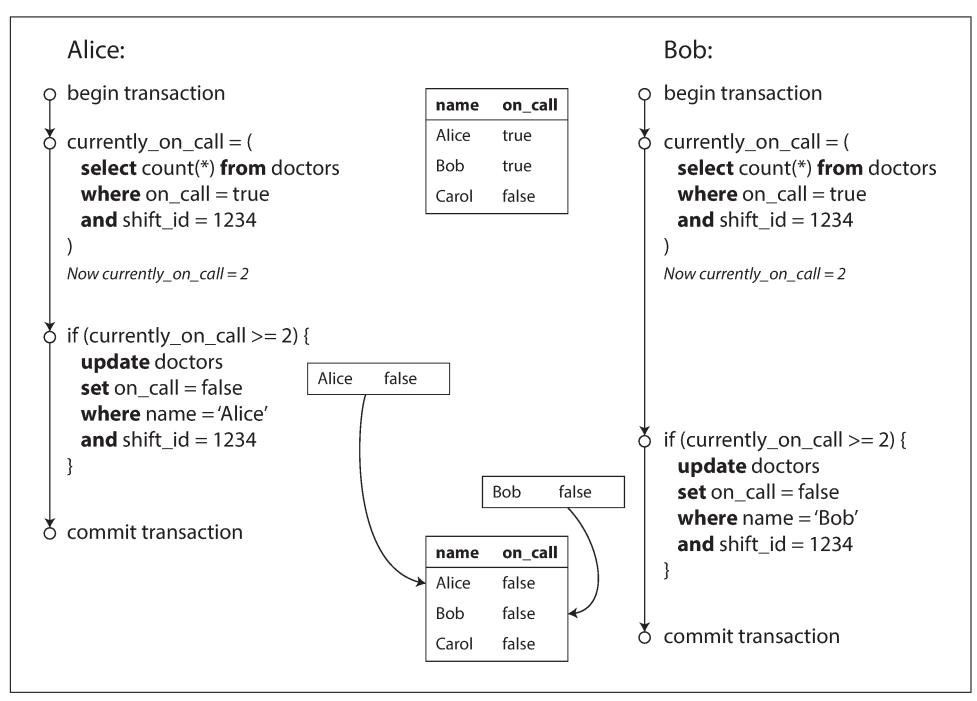

*Figure 7-8. Example of write skew causing an application bug.*

In each transaction, your application first checks that two or more doctors are cur‐ rently on call; if yes, it assumes it's safe for one doctor to go off call. Since the data‐ base is using snapshot isolation, both checks return 2, so both transactions proceed to the next stage. Alice updates her own record to take herself off call, and Bob updates his own record likewise. Both transactions commit, and now no doctor is on call. Your requirement of having at least one doctor on call has been violated.

## **Characterizing write skew**

This anomaly is called *write skew* [\[28](#page-291-0)]. It is neither a dirty write nor a lost update, because the two transactions are updating two different objects (Alice's and Bob's oncall records, respectively). It is less obvious that a conflict occurred here, but it's defi‐ nitely a race condition: if the two transactions had run one after another, the second

<span id="page-269-0"></span>doctor would have been prevented from going off call. The anomalous behavior was only possible because the transactions ran concurrently.

You can think of write skew as a generalization of the lost update problem. Write skew can occur if two transactions read the same objects, and then update some of those objects (different transactions may update different objects). In the special case where different transactions update the same object, you get a dirty write or lost update anomaly (depending on the timing).

We saw that there are various different ways of preventing lost updates. With write skew, our options are more restricted:

- Atomic single-object operations don't help, as multiple objects are involved.
- The automatic detection of lost updates that you find in some implementations of snapshot isolation unfortunately doesn't help either: write skew is not auto‐ matically detected in PostgreSQL's repeatable read, MySQL/InnoDB's repeatable read, Oracle's serializable, or SQL Server's snapshot isolation level [[23\]](#page-290-0). Auto‐ matically preventing write skew requires true serializable isolation (see ["Serializa‐](#page-272-0) [bility" on page 251\)](#page-272-0).
- Some databases allow you to configure constraints, which are then enforced by the database (e.g., uniqueness, foreign key constraints, or restrictions on a partic‐ ular value). However, in order to specify that at least one doctor must be on call, you would need a constraint that involves multiple objects. Most databases do not have built-in support for such constraints, but you may be able to implement them with triggers or materialized views, depending on the database [\[42](#page-291-0)].
- If you can't use a serializable isolation level, the second-best option in this case is probably to explicitly lock the rows that the transaction depends on. In the doc‐ tors example, you could write something like the following:

```
BEGIN TRANSACTION;
SELECT * FROM doctors
 WHERE on_call = true
 AND shift_id = 1234 FOR UPDATE;
UPDATE doctors
 SET on_call = false
 WHERE name = 'Alice'
 AND shift_id = 1234;
COMMIT;
```

As before, FOR UPDATE tells the database to lock all rows returned by this query.

## <span id="page-270-0"></span>**More examples of write skew**

Write skew may seem like an esoteric issue at first, but once you're aware of it, you may notice more situations in which it can occur. Here are some more examples:

#### *Meeting room booking system*

Say you want to enforce that there cannot be two bookings for the same meeting room at the same time [[43](#page-291-0)]. When someone wants to make a booking, you first check for any conflicting bookings (i.e., bookings for the same room with an overlapping time range), and if none are found, you create the meeting (see Example 7-2).ix

*Example 7-2. A meeting room booking system tries to avoid double-booking (not safe under snapshot isolation)*

#### **BEGIN** TRANSACTION;

```
-- Check for any existing bookings that overlap with the period of noon-1pm
SELECT COUNT(*) FROM bookings
 WHERE room_id = 123 AND
 end_time > '2015-01-01 12:00' AND start_time < '2015-01-01 13:00';
-- If the previous query returned zero:
INSERT INTO bookings
 (room_id, start_time, end_time, user_id)
 VALUES (123, '2015-01-01 12:00', '2015-01-01 13:00', 666);
COMMIT;
```

Unfortunately, snapshot isolation does not prevent another user from concur‐ rently inserting a conflicting meeting. In order to guarantee you won't get sched‐ uling conflicts, you once again need serializable isolation.

#### *Multiplayer game*

In [Example 7-1,](#page-265-0) we used a lock to prevent lost updates (that is, making sure that two players can't move the same figure at the same time). However, the lock doesn't prevent players from moving two different figures to the same position on the board or potentially making some other move that violates the rules of the game. Depending on the kind of rule you are enforcing, you might be able to use a unique constraint, but otherwise you're vulnerable to write skew.

ix. In PostgreSQL you can do this more elegantly using range types, but they are not widely supported in other databases.

#### <span id="page-271-0"></span>*Claiming a username*

On a website where each user has a unique username, two users may try to create accounts with the same username at the same time. You may use a transaction to check whether a name is taken and, if not, create an account with that name. However, like in the previous examples, that is not safe under snapshot isolation. Fortunately, a unique constraint is a simple solution here (the second transaction that tries to register the username will be aborted due to violating the constraint).

#### *Preventing double-spending*

A service that allows users to spend money or points needs to check that a user doesn't spend more than they have. You might implement this by inserting a ten‐ tative spending item into a user's account, listing all the items in the account, and checking that the sum is positive [[44\]](#page-292-0). With write skew, it could happen that two spending items are inserted concurrently that together cause the balance to go negative, but that neither transaction notices the other.

## **Phantoms causing write skew**

All of these examples follow a similar pattern:

- 1. A SELECT query checks whether some requirement is satisfied by searching for rows that match some search condition (there are at least two doctors on call, there are no existing bookings for that room at that time, the position on the board doesn't already have another figure on it, the username isn't already taken, there is still money in the account).
- 2. Depending on the result of the first query, the application code decides how to continue (perhaps to go ahead with the operation, or perhaps to report an error to the user and abort).
- 3. If the application decides to go ahead, it makes a write (INSERT, UPDATE, or DELETE) to the database and commits the transaction.

The effect of this write changes the precondition of the decision of step 2. In other words, if you were to repeat the SELECT query from step 1 after commiting the write, you would get a different result, because the write changed the set of rows matching the search condition (there is now one fewer doctor on call, the meeting room is now booked for that time, the position on the board is now taken by the figure that was moved, the username is now taken, there is now less money in the account).

The steps may occur in a different order. For example, you could first make the write, then the SELECT query, and finally decide whether to abort or commit based on the result of the query.

<span id="page-272-0"></span>In the case of the doctor on call example, the row being modified in step 3 was one of the rows returned in step 1, so we could make the transaction safe and avoid write skew by locking the rows in step 1 (SELECT FOR UPDATE). However, the other four examples are different: they check for the *absence* of rows matching some search con‐ dition, and the write *adds* a row matching the same condition. If the query in step 1 doesn't return any rows, SELECT FOR UPDATE can't attach locks to anything.

This effect, where a write in one transaction changes the result of a search query in another transaction, is called a *phantom* [\[3](#page-289-0)]. Snapshot isolation avoids phantoms in read-only queries, but in read-write transactions like the examples we discussed, phantoms can lead to particularly tricky cases of write skew.

## **Materializing conflicts**

If the problem of phantoms is that there is no object to which we can attach the locks, perhaps we can artificially introduce a lock object into the database?

For example, in the meeting room booking case you could imagine creating a table of time slots and rooms. Each row in this table corresponds to a particular room for a particular time period (say, 15 minutes). You create rows for all possible combina‐ tions of rooms and time periods ahead of time, e.g. for the next six months.

Now a transaction that wants to create a booking can lock (SELECT FOR UPDATE) the rows in the table that correspond to the desired room and time period. After it has acquired the locks, it can check for overlapping bookings and insert a new booking as before. Note that the additional table isn't used to store information about the book‐ ing—it's purely a collection of locks which is used to prevent bookings on the same room and time range from being modified concurrently.

This approach is called *materializing conflicts*, because it takes a phantom and turns it into a lock conflict on a concrete set of rows that exist in the database [[11\]](#page-289-0). Unfortu‐ nately, it can be hard and error-prone to figure out how to materialize conflicts, and it's ugly to let a concurrency control mechanism leak into the application data model. For those reasons, materializing conflicts should be considered a last resort if no alternative is possible. A serializable isolation level is much preferable in most cases.

## **Serializability**

In this chapter we have seen several examples of transactions that are prone to race conditions. Some race conditions are prevented by the read committed and snapshot isolation levels, but others are not. We encountered some particularly tricky exam‐ ples with write skew and phantoms. It's a sad situation:

• Isolation levels are hard to understand, and inconsistently implemented in differ‐ ent databases (e.g., the meaning of "repeatable read" varies significantly).

- <span id="page-273-0"></span>• If you look at your application code, it's difficult to tell whether it is safe to run at a particular isolation level—especially in a large application, where you might not be aware of all the things that may be happening concurrently.
- There are no good tools to help us detect race conditions. In principle, static analysis may help [\[26](#page-290-0)], but research techniques have not yet found their way into practical use. Testing for concurrency issues is hard, because they are usually nondeterministic—problems only occur if you get unlucky with the timing.

This is not a new problem—it has been like this since the 1970s, when weak isolation levels were first introduced [\[2](#page-289-0)]. All along, the answer from researchers has been sim‐ ple: use *serializable* isolation!

Serializable isolation is usually regarded as the strongest isolation level. It guarantees that even though transactions may execute in parallel, the end result is the same as if they had executed one at a time, *serially*, without any concurrency. Thus, the database guarantees that if the transactions behave correctly when run individually, they con‐ tinue to be correct when run concurrently—in other words, the database prevents *all* possible race conditions.

But if serializable isolation is so much better than the mess of weak isolation levels, then why isn't everyone using it? To answer this question, we need to look at the options for implementing serializability, and how they perform. Most databases that provide serializability today use one of three techniques, which we will explore in the rest of this chapter:

- Literally executing transactions in a serial order (see "Actual Serial Execution" on page 252)
- Two-phase locking (see ["Two-Phase Locking \(2PL\)" on page 257\)](#page-278-0), which for sev‐ eral decades was the only viable option
- Optimistic concurrency control techniques such as serializable snapshot isolation (see ["Serializable Snapshot Isolation \(SSI\)" on page 261\)](#page-282-0)

For now, we will discuss these techniques primarily in the context of single-node databases; in [Chapter 9](#page-342-0) we will examine how they can be generalized to transactions that involve multiple nodes in a distributed system.

## **Actual Serial Execution**

The simplest way of avoiding concurrency problems is to remove the concurrency entirely: to execute only one transaction at a time, in serial order, on a single thread. By doing so, we completely sidestep the problem of detecting and preventing con‐ flicts between transactions: the resulting isolation is by definition serializable.

<span id="page-274-0"></span>Even though this seems like an obvious idea, database designers only fairly recently around 2007—decided that a single-threaded loop for executing transactions was fea‐ sible [\[45\]](#page-292-0). If multi-threaded concurrency was considered essential for getting good performance during the previous 30 years, what changed to make single-threaded execution possible?

Two developments caused this rethink:

- RAM became cheap enough that for many use cases is now feasible to keep the entire active dataset in memory (see ["Keeping everything in memory" on page](#page-109-0) [88](#page-109-0)). When all data that a transaction needs to access is in memory, transactions can execute much faster than if they have to wait for data to be loaded from disk.
- Database designers realized that OLTP transactions are usually short and only make a small number of reads and writes (see ["Transaction Processing or Ana‐](#page-111-0) [lytics?" on page 90\)](#page-111-0). By contrast, long-running analytic queries are typically readonly, so they can be run on a consistent snapshot (using snapshot isolation) outside of the serial execution loop.

The approach of executing transactions serially is implemented in VoltDB/H-Store, Redis, and Datomic [\[46](#page-292-0), [47](#page-292-0), [48](#page-292-0)]. A system designed for single-threaded execution can sometimes perform better than a system that supports concurrency, because it can avoid the coordination overhead of locking. However, its throughput is limited to that of a single CPU core. In order to make the most of that single thread, transac‐ tions need to be structured differently from their traditional form.

## **Encapsulating transactions in stored procedures**

In the early days of databases, the intention was that a database transaction could encompass an entire flow of user activity. For example, booking an airline ticket is a multi-stage process (searching for routes, fares, and available seats; deciding on an itinerary; booking seats on each of the flights of the itinerary; entering passenger details; making payment). Database designers thought that it would be neat if that entire process was one transaction so that it could be committed atomically.

Unfortunately, humans are very slow to make up their minds and respond. If a data‐ base transaction needs to wait for input from a user, the database needs to support a potentially huge number of concurrent transactions, most of them idle. Most data‐ bases cannot do that efficiently, and so almost all OLTP applications keep transac‐ tions short by avoiding interactively waiting for a user within a transaction. On the web, this means that a transaction is committed within the same HTTP request—a transaction does not span multiple requests. A new HTTP request starts a new trans‐ action.

Even though the human has been taken out of the critical path, transactions have continued to be executed in an interactive client/server style, one statement at a time.

An application makes a query, reads the result, perhaps makes another query depending on the result of the first query, and so on. The queries and results are sent back and forth between the application code (running on one machine) and the data‐ base server (on another machine).

In this interactive style of transaction, a lot of time is spent in network communica‐ tion between the application and the database. If you were to disallow concurrency in the database and only process one transaction at a time, the throughput would be dreadful because the database would spend most of its time waiting for the applica‐ tion to issue the next query for the current transaction. In this kind of database, it's necessary to process multiple transactions concurrently in order to get reasonable performance.

For this reason, systems with single-threaded serial transaction processing don't allow interactive multi-statement transactions. Instead, the application must submit the entire transaction code to the database ahead of time, as a *stored procedure*. The differences between these approaches is illustrated in Figure 7-9. Provided that all data required by a transaction is in memory, the stored procedure can execute very fast, without waiting for any network or disk I/O.

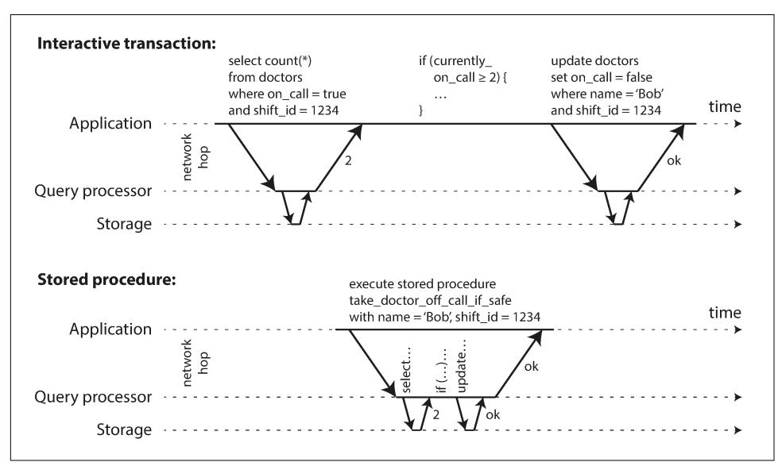

*Figure 7-9. The difference between an interactive transaction and a stored procedure (using the example transaction of [Figure 7-8](#page-268-0)).*

## <span id="page-276-0"></span>**Pros and cons of stored procedures**

Stored procedures have existed for some time in relational databases, and they have been part of the SQL standard (SQL/PSM) since 1999. They have gained a somewhat bad reputation, for various reasons:

- Each database vendor has its own language for stored procedures (Oracle has PL/ SQL, SQL Server has T-SQL, PostgreSQL has PL/pgSQL, etc.). These languages haven't kept up with developments in general-purpose programming languages, so they look quite ugly and archaic from today's point of view, and they lack the ecosystem of libraries that you find with most programming languages.
- Code running in a database is difficult to manage: compared to an application server, it's harder to debug, more awkward to keep in version control and deploy, trickier to test, and difficult to integrate with a metrics collection system for monitoring.
- A database is often much more performance-sensitive than an application server, because a single database instance is often shared by many application servers. A badly written stored procedure (e.g., using a lot of memory or CPU time) in a database can cause much more trouble than equivalent badly written code in an application server.

However, those issues can be overcome. Modern implementations of stored proce‐ dures have abandoned PL/SQL and use existing general-purpose programming lan‐ guages instead: VoltDB uses Java or Groovy, Datomic uses Java or Clojure, and Redis uses Lua.

With stored procedures and in-memory data, executing all transactions on a single thread becomes feasible. As they don't need to wait for I/O and they avoid the over‐ head of other concurrency control mechanisms, they can achieve quite good throughput on a single thread.

VoltDB also uses stored procedures for replication: instead of copying a transaction's writes from one node to another, it executes the same stored procedure on each rep‐ lica. VoltDB therefore requires that stored procedures are *deterministic* (when run on different nodes, they must produce the same result). If a transaction needs to use the current date and time, for example, it must do so through special deterministic APIs.

## **Partitioning**

Executing all transactions serially makes concurrency control much simpler, but lim‐ its the transaction throughput of the database to the speed of a single CPU core on a single machine. Read-only transactions may execute elsewhere, using snapshot isola‐ tion, but for applications with high write throughput, the single-threaded transaction processor can become a serious bottleneck.

<span id="page-277-0"></span>In order to scale to multiple CPU cores, and multiple nodes, you can potentially par‐ tition your data (see [Chapter 6\)](#page-220-0), which is supported in VoltDB. If you can find a way of partitioning your dataset so that each transaction only needs to read and write data within a single partition, then each partition can have its own transaction processing thread running independently from the others. In this case, you can give each CPU core its own partition, which allows your transaction throughput to scale linearly with the number of CPU cores [[47\]](#page-292-0).

However, for any transaction that needs to access multiple partitions, the database must coordinate the transaction across all the partitions that it touches. The stored procedure needs to be performed in lock-step across all partitions to ensure serializa‐ bility across the whole system.

Since cross-partition transactions have additional coordination overhead, they are vastly slower than single-partition transactions. VoltDB reports a throughput of about 1,000 cross-partition writes per second, which is orders of magnitude below its single-partition throughput and cannot be increased by adding more machines [[49\]](#page-292-0).

Whether transactions can be single-partition depends very much on the structure of the data used by the application. Simple key-value data can often be partitioned very easily, but data with multiple secondary indexes is likely to require a lot of crosspartition coordination (see ["Partitioning and Secondary Indexes" on page 206](#page-227-0)).

## **Summary of serial execution**

Serial execution of transactions has become a viable way of achieving serializable iso‐ lation within certain constraints:

- Every transaction must be small and fast, because it takes only one slow transac‐ tion to stall all transaction processing.
- It is limited to use cases where the active dataset can fit in memory. Rarely accessed data could potentially be moved to disk, but if it needed to be accessed in a single-threaded transaction, the system would get very slow.<sup>x</sup>
- Write throughput must be low enough to be handled on a single CPU core, or else transactions need to be partitioned without requiring cross-partition coordi‐ nation.
- Cross-partition transactions are possible, but there is a hard limit to the extent to which they can be used.

x. If a transaction needs to access data that's not in memory, the best solution may be to abort the transac‐ tion, asynchronously fetch the data into memory while continuing to process other transactions, and then restart the transaction when the data has been loaded. This approach is known as *anti-caching*, as previously mentioned in ["Keeping everything in memory" on page 88.](#page-109-0)

## <span id="page-278-0"></span>**Two-Phase Locking (2PL)**

For around 30 years, there was only one widely used algorithm for serializability in databases: *two-phase locking* (2PL).xi


## **2PL is not 2PC**

Note that while two-phase *locking* (2PL) sounds very similar to two-phase *commit* (2PC), they are completely different things. We will discuss 2PC in [Chapter 9](#page-342-0).

We saw previously that locks are often used to prevent dirty writes (see ["No dirty](#page-256-0) [writes" on page 235\)](#page-256-0): if two transactions concurrently try to write to the same object, the lock ensures that the second writer must wait until the first one has finished its transaction (aborted or committed) before it may continue.

Two-phase locking is similar, but makes the lock requirements much stronger. Sev‐ eral transactions are allowed to concurrently read the same object as long as nobody is writing to it. But as soon as anyone wants to write (modify or delete) an object, exclusive access is required:

- If transaction A has read an object and transaction B wants to write to that object, B must wait until A commits or aborts before it can continue. (This ensures that B can't change the object unexpectedly behind A's back.)
- If transaction A has written an object and transaction B wants to read that object, B must wait until A commits or aborts before it can continue. (Reading an old version of the object, like in [Figure 7-1](#page-247-0), is not acceptable under 2PL.)

In 2PL, writers don't just block other writers; they also block readers and vice versa. Snapshot isolation has the mantra *readers never block writers, and writers never block readers* (see ["Implementing snapshot isolation" on page 239\)](#page-260-0), which captures this key difference between snapshot isolation and two-phase locking. On the other hand, because 2PL provides serializability, it protects against all the race conditions dis‐ cussed earlier, including lost updates and write skew.

## **Implementation of two-phase locking**

2PL is used by the serializable isolation level in MySQL (InnoDB) and SQL Server, and the repeatable read isolation level in DB2 [[23,](#page-290-0) [36](#page-291-0)].

xi. Sometimes called *strong strict two-phase locking* (SS2PL) to distinguish it from other variants of 2PL.

<span id="page-279-0"></span>The blocking of readers and writers is implemented by a having a lock on each object in the database. The lock can either be in *shared mode* or in *exclusive mode*. The lock is used as follows:

- If a transaction wants to read an object, it must first acquire the lock in shared mode. Several transactions are allowed to hold the lock in shared mode simulta‐ neously, but if another transaction already has an exclusive lock on the object, these transactions must wait.
- If a transaction wants to write to an object, it must first acquire the lock in exclu‐ sive mode. No other transaction may hold the lock at the same time (either in shared or in exclusive mode), so if there is any existing lock on the object, the transaction must wait.
- If a transaction first reads and then writes an object, it may upgrade its shared lock to an exclusive lock. The upgrade works the same as getting an exclusive lock directly.
- After a transaction has acquired the lock, it must continue to hold the lock until the end of the transaction (commit or abort). This is where the name "twophase" comes from: the first phase (while the transaction is executing) is when the locks are acquired, and the second phase (at the end of the transaction) is when all the locks are released.

Since so many locks are in use, it can happen quite easily that transaction A is stuck waiting for transaction B to release its lock, and vice versa. This situation is called *deadlock*. The database automatically detects deadlocks between transactions and aborts one of them so that the others can make progress. The aborted transaction needs to be retried by the application.

## **Performance of two-phase locking**

The big downside of two-phase locking, and the reason why it hasn't been used by everybody since the 1970s, is performance: transaction throughput and response times of queries are significantly worse under two-phase locking than under weak isolation.

This is partly due to the overhead of acquiring and releasing all those locks, but more importantly due to reduced concurrency. By design, if two concurrent transactions try to do anything that may in any way result in a race condition, one has to wait for the other to complete.

Traditional relational databases don't limit the duration of a transaction, because they are designed for interactive applications that wait for human input. Conse‐ quently, when one transaction has to wait on another, there is no limit on how long it may have to wait. Even if you make sure that you keep all your transactions short, a

<span id="page-280-0"></span>queue may form if several transactions want to access the same object, so a transac‐ tion may have to wait for several others to complete before it can do anything.

For this reason, databases running 2PL can have quite unstable latencies, and they can be very slow at high percentiles (see ["Describing Performance" on page 13\)](#page-34-0) if there is contention in the workload. It may take just one slow transaction, or one transaction that accesses a lot of data and acquires many locks, to cause the rest of the system to grind to a halt. This instability is problematic when robust operation is required.

Although deadlocks can happen with the lock-based read committed isolation level, they occur much more frequently under 2PL serializable isolation (depending on the access patterns of your transaction). This can be an additional performance problem: when a transaction is aborted due to deadlock and is retried, it needs to do its work all over again. If deadlocks are frequent, this can mean significant wasted effort.

## **Predicate locks**

In the preceding description of locks, we glossed over a subtle but important detail. In ["Phantoms causing write skew" on page 250](#page-271-0) we discussed the problem of *phan‐ toms*—that is, one transaction changing the results of another transaction's search query. A database with serializable isolation must prevent phantoms.

In the meeting room booking example this means that if one transaction has searched for existing bookings for a room within a certain time window (see [Example 7-2\)](#page-270-0), another transaction is not allowed to concurrently insert or update another booking for the same room and time range. (It's okay to concurrently insert bookings for other rooms, or for the same room at a different time that doesn't affect the proposed booking.)

How do we implement this? Conceptually, we need a *predicate lock* [[3\]](#page-289-0). It works sim‐ ilarly to the shared/exclusive lock described earlier, but rather than belonging to a particular object (e.g., one row in a table), it belongs to all objects that match some search condition, such as:

```
SELECT * FROM bookings
 WHERE room_id = 123 AND
 end_time > '2018-01-01 12:00' AND
 start_time < '2018-01-01 13:00';
```

A predicate lock restricts access as follows:

• If transaction A wants to read objects matching some condition, like in that SELECT query, it must acquire a shared-mode predicate lock on the conditions of the query. If another transaction B currently has an exclusive lock on any object matching those conditions, A must wait until B releases its lock before it is allowed to make its query.

<span id="page-281-0"></span>• If transaction A wants to insert, update, or delete any object, it must first check whether either the old or the new value matches any existing predicate lock. If there is a matching predicate lock held by transaction B, then A must wait until B has committed or aborted before it can continue.

The key idea here is that a predicate lock applies even to objects that do not yet exist in the database, but which might be added in the future (phantoms). If two-phase locking includes predicate locks, the database prevents all forms of write skew and other race conditions, and so its isolation becomes serializable.

## **Index-range locks**

Unfortunately, predicate locks do not perform well: if there are many locks by active transactions, checking for matching locks becomes time-consuming. For that reason, most databases with 2PL actually implement *index-range locking* (also known as *nextkey locking*), which is a simplified approximation of predicate locking [\[41](#page-291-0), [50](#page-292-0)].

It's safe to simplify a predicate by making it match a greater set of objects. For exam‐ ple, if you have a predicate lock for bookings of room 123 between noon and 1 p.m., you can approximate it by locking bookings for room 123 at any time, or you can approximate it by locking all rooms (not just room 123) between noon and 1 p.m. This is safe, because any write that matches the original predicate will definitely also match the approximations.

In the room bookings database you would probably have an index on the room\_id column, and/or indexes on start\_time and end\_time (otherwise the preceding query would be very slow on a large database):

- Say your index is on room\_id, and the database uses this index to find existing bookings for room 123. Now the database can simply attach a shared lock to this index entry, indicating that a transaction has searched for bookings of room 123.
- Alternatively, if the database uses a time-based index to find existing bookings, it can attach a shared lock to a range of values in that index, indicating that a trans‐ action has searched for bookings that overlap with the time period of noon to 1 p.m. on January 1, 2018.

Either way, an approximation of the search condition is attached to one of the indexes. Now, if another transaction wants to insert, update, or delete a booking for the same room and/or an overlapping time period, it will have to update the same part of the index. In the process of doing so, it will encounter the shared lock, and it will be forced to wait until the lock is released.

This provides effective protection against phantoms and write skew. Index-range locks are not as precise as predicate locks would be (they may lock a bigger range of

<span id="page-282-0"></span>objects than is strictly necessary to maintain serializability), but since they have much lower overheads, they are a good compromise.

If there is no suitable index where a range lock can be attached, the database can fall back to a shared lock on the entire table. This will not be good for performance, since it will stop all other transactions writing to the table, but it's a safe fallback position.

## **Serializable Snapshot Isolation (SSI)**

This chapter has painted a bleak picture of concurrency control in databases. On the one hand, we have implementations of serializability that don't perform well (twophase locking) or don't scale well (serial execution). On the other hand, we have weak isolation levels that have good performance, but are prone to various race conditions (lost updates, write skew, phantoms, etc.). Are serializable isolation and good perfor‐ mance fundamentally at odds with each other?

Perhaps not: an algorithm called *serializable snapshot isolation* (SSI) is very promis‐ ing. It provides full serializability, but has only a small performance penalty com‐ pared to snapshot isolation. SSI is fairly new: it was first described in 2008 [[40\]](#page-291-0) and is the subject of Michael Cahill's PhD thesis [\[51](#page-292-0)].

Today SSI is used both in single-node databases (the serializable isolation level in PostgreSQL since version 9.1 [\[41\]](#page-291-0)) and distributed databases (FoundationDB uses a similar algorithm). As SSI is so young compared to other concurrency control mech‐ anisms, it is still proving its performance in practice, but it has the possibility of being fast enough to become the new default in the future.

## **Pessimistic versus optimistic concurrency control**

Two-phase locking is a so-called *pessimistic* concurrency control mechanism: it is based on the principle that if anything might possibly go wrong (as indicated by a lock held by another transaction), it's better to wait until the situation is safe again before doing anything. It is like *mutual exclusion*, which is used to protect data struc‐ tures in multi-threaded programming.

Serial execution is, in a sense, pessimistic to the extreme: it is essentially equivalent to each transaction having an exclusive lock on the entire database (or one partition of the database) for the duration of the transaction. We compensate for the pessimism by making each transaction very fast to execute, so it only needs to hold the "lock" for a short time.

By contrast, serializable snapshot isolation is an *optimistic* concurrency control tech‐ nique. Optimistic in this context means that instead of blocking if something poten‐ tially dangerous happens, transactions continue anyway, in the hope that everything will turn out all right. When a transaction wants to commit, the database checks whether anything bad happened (i.e., whether isolation was violated); if so, the trans‐

<span id="page-283-0"></span>action is aborted and has to be retried. Only transactions that executed serializably are allowed to commit.

Optimistic concurrency control is an old idea [\[52](#page-292-0)], and its advantages and disadvan‐ tages have been debated for a long time [[53\]](#page-292-0). It performs badly if there is high con‐ tention (many transactions trying to access the same objects), as this leads to a high proportion of transactions needing to abort. If the system is already close to its maxi‐ mum throughput, the additional transaction load from retried transactions can make performance worse.

However, if there is enough spare capacity, and if contention between transactions is not too high, optimistic concurrency control techniques tend to perform better than pessimistic ones. Contention can be reduced with commutative atomic operations: for example, if several transactions concurrently want to increment a counter, it doesn't matter in which order the increments are applied (as long as the counter isn't read in the same transaction), so the concurrent increments can all be applied without conflicting.

As the name suggests, SSI is based on snapshot isolation—that is, all reads within a transaction are made from a consistent snapshot of the database (see ["Snapshot Isola‐](#page-258-0) [tion and Repeatable Read" on page 237](#page-258-0)). This is the main difference compared to ear‐ lier optimistic concurrency control techniques. On top of snapshot isolation, SSI adds an algorithm for detecting serialization conflicts among writes and determining which transactions to abort.

## **Decisions based on an outdated premise**

When we previously discussed write skew in snapshot isolation (see ["Write Skew and](#page-267-0) [Phantoms" on page 246](#page-267-0)), we observed a recurring pattern: a transaction reads some data from the database, examines the result of the query, and decides to take some action (write to the database) based on the result that it saw. However, under snap‐ shot isolation, the result from the original query may no longer be up-to-date by the time the transaction commits, because the data may have been modified in the mean‐ time.

Put another way, the transaction is taking an action based on a *premise* (a fact that was true at the beginning of the transaction, e.g., "There are currently two doctors on call"). Later, when the transaction wants to commit, the original data may have changed—the premise may no longer be true.

When the application makes a query (e.g., "How many doctors are currently on call?"), the database doesn't know how the application logic uses the result of that query. To be safe, the database needs to assume that any change in the query result (the premise) means that writes in that transaction may be invalid. In other words, there may be a causal dependency between the queries and the writes in the transac‐ tion. In order to provide serializable isolation, the database must detect situations in

<span id="page-284-0"></span>which a transaction may have acted on an outdated premise and abort the transac‐ tion in that case.

How does the database know if a query result might have changed? There are two cases to consider:

- Detecting reads of a stale MVCC object version (uncommitted write occurred before the read)
- Detecting writes that affect prior reads (the write occurs after the read)

## **Detecting stale MVCC reads**

Recall that snapshot isolation is usually implemented by multi-version concurrency control (MVCC; see Figure 7-10). When a transaction reads from a consistent snap‐ shot in an MVCC database, it ignores writes that were made by any other transac‐ tions that hadn't yet committed at the time when the snapshot was taken. In Figure 7-10, transaction 43 sees Alice as having on\_call = true, because transaction 42 (which modified Alice's on-call status) is uncommitted. However, by the time transaction 43 wants to commit, transaction 42 has already committed. This means that the write that was ignored when reading from the consistent snapshot has now taken effect, and transaction 43's premise is no longer true.


*Figure 7-10. Detecting when a transaction reads outdated values from an MVCC snapshot.*

<span id="page-285-0"></span>In order to prevent this anomaly, the database needs to track when a transaction ignores another transaction's writes due to MVCC visibility rules. When the transac‐ tion wants to commit, the database checks whether any of the ignored writes have now been committed. If so, the transaction must be aborted.

Why wait until committing? Why not abort transaction 43 immediately when the stale read is detected? Well, if transaction 43 was a read-only transaction, it wouldn't need to be aborted, because there is no risk of write skew. At the time when transac‐ tion 43 makes its read, the database doesn't yet know whether that transaction is going to later perform a write. Moreover, transaction 42 may yet abort or may still be uncommitted at the time when transaction 43 is committed, and so the read may turn out not to have been stale after all. By avoiding unnecessary aborts, SSI preserves snapshot isolation's support for long-running reads from a consistent snapshot.

## **Detecting writes that affect prior reads**

The second case to consider is when another transaction modifies data after it has been read. This case is illustrated in Figure 7-11.

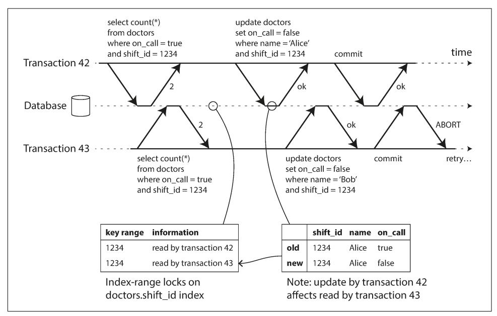

*Figure 7-11. In serializable snapshot isolation, detecting when one transaction modifies another transaction's reads.*

In the context of two-phase locking we discussed index-range locks (see ["Index-range](#page-281-0) [locks" on page 260](#page-281-0)), which allow the database to lock access to all rows matching some search query, such as WHERE shift\_id = 1234. We can use a similar technique here, except that SSI locks don't block other transactions.

<span id="page-286-0"></span>In [Figure 7-11,](#page-285-0) transactions 42 and 43 both search for on-call doctors during shift 1234. If there is an index on shift\_id, the database can use the index entry 1234 to record the fact that transactions 42 and 43 read this data. (If there is no index, this information can be tracked at the table level.) This information only needs to be kept for a while: after a transaction has finished (committed or aborted), and all concur‐ rent transactions have finished, the database can forget what data it read.

When a transaction writes to the database, it must look in the indexes for any other transactions that have recently read the affected data. This process is similar to acquiring a write lock on the affected key range, but rather than blocking until the readers have committed, the lock acts as a tripwire: it simply notifies the transactions that the data they read may no longer be up to date.

In [Figure 7-11,](#page-285-0) transaction 43 notifies transaction 42 that its prior read is outdated, and vice versa. Transaction 42 is first to commit, and it is successful: although trans‐ action 43's write affected 42, 43 hasn't yet committed, so the write has not yet taken effect. However, when transaction 43 wants to commit, the conflicting write from 42 has already been committed, so 43 must abort.

## **Performance of serializable snapshot isolation**

As always, many engineering details affect how well an algorithm works in practice. For example, one trade-off is the granularity at which transactions' reads and writes are tracked. If the database keeps track of each transaction's activity in great detail, it can be precise about which transactions need to abort, but the bookkeeping overhead can become significant. Less detailed tracking is faster, but may lead to more transac‐ tions being aborted than strictly necessary.

In some cases, it's okay for a transaction to read information that was overwritten by another transaction: depending on what else happened, it's sometimes possible to prove that the result of the execution is nevertheless serializable. PostgreSQL uses this theory to reduce the number of unnecessary aborts [\[11](#page-289-0), [41\]](#page-291-0).

Compared to two-phase locking, the big advantage of serializable snapshot isolation is that one transaction doesn't need to block waiting for locks held by another trans‐ action. Like under snapshot isolation, writers don't block readers, and vice versa. This design principle makes query latency much more predictable and less variable. In particular, read-only queries can run on a consistent snapshot without requiring any locks, which is very appealing for read-heavy workloads.

Compared to serial execution, serializable snapshot isolation is not limited to the throughput of a single CPU core: FoundationDB distributes the detection of seriali‐ zation conflicts across multiple machines, allowing it to scale to very high through‐ put. Even though data may be partitioned across multiple machines, transactions can read and write data in multiple partitions while ensuring serializable isolation [[54\]](#page-292-0).

<span id="page-287-0"></span>The rate of aborts significantly affects the overall performance of SSI. For example, a transaction that reads and writes data over a long period of time is likely to run into conflicts and abort, so SSI requires that read-write transactions be fairly short (longrunning read-only transactions may be okay). However, SSI is probably less sensitive to slow transactions than two-phase locking or serial execution.

## **Summary**

Transactions are an abstraction layer that allows an application to pretend that cer‐ tain concurrency problems and certain kinds of hardware and software faults don't exist. A large class of errors is reduced down to a simple *transaction abort*, and the application just needs to try again.

In this chapter we saw many examples of problems that transactions help prevent. Not all applications are susceptible to all those problems: an application with very simple access patterns, such as reading and writing only a single record, can probably manage without transactions. However, for more complex access patterns, transac‐ tions can hugely reduce the number of potential error cases you need to think about.

Without transactions, various error scenarios (processes crashing, network interrup‐ tions, power outages, disk full, unexpected concurrency, etc.) mean that data can become inconsistent in various ways. For example, denormalized data can easily go out of sync with the source data. Without transactions, it becomes very difficult to reason about the effects that complex interacting accesses can have on the database.

In this chapter, we went particularly deep into the topic of concurrency control. We discussed several widely used isolation levels, in particular *read committed*, *snapshot isolation* (sometimes called *repeatable read*), and *serializable*. We characterized those isolation levels by discussing various examples of race conditions:

## *Dirty reads*

One client reads another client's writes before they have been committed. The read committed isolation level and stronger levels prevent dirty reads.

## *Dirty writes*

One client overwrites data that another client has written, but not yet committed. Almost all transaction implementations prevent dirty writes.

## *Read skew (nonrepeatable reads)*

A client sees different parts of the database at different points in time. This issue is most commonly prevented with snapshot isolation, which allows a transaction to read from a consistent snapshot at one point in time. It is usually implemented with *multi-version concurrency control* (MVCC).

#### <span id="page-288-0"></span>*Lost updates*

Two clients concurrently perform a read-modify-write cycle. One overwrites the other's write without incorporating its changes, so data is lost. Some implemen‐ tations of snapshot isolation prevent this anomaly automatically, while others require a manual lock (SELECT FOR UPDATE).

## *Write skew*

A transaction reads something, makes a decision based on the value it saw, and writes the decision to the database. However, by the time the write is made, the premise of the decision is no longer true. Only serializable isolation prevents this anomaly.

## *Phantom reads*

A transaction reads objects that match some search condition. Another client makes a write that affects the results of that search. Snapshot isolation prevents straightforward phantom reads, but phantoms in the context of write skew require special treatment, such as index-range locks.

Weak isolation levels protect against some of those anomalies but leave you, the application developer, to handle others manually (e.g., using explicit locking). Only serializable isolation protects against all of these issues. We discussed three different approaches to implementing serializable transactions:

## *Literally executing transactions in a serial order*

If you can make each transaction very fast to execute, and the transaction throughput is low enough to process on a single CPU core, this is a simple and effective option.

## *Two-phase locking*

For decades this has been the standard way of implementing serializability, but many applications avoid using it because of its performance characteristics.

## *Serializable snapshot isolation (SSI)*

A fairly new algorithm that avoids most of the downsides of the previous approaches. It uses an optimistic approach, allowing transactions to proceed without blocking. When a transaction wants to commit, it is checked, and it is aborted if the execution was not serializable.

The examples in this chapter used a relational data model. However, as discussed in ["The need for multi-object transactions" on page 231,](#page-252-0) transactions are a valuable database feature, no matter which data model is used.

In this chapter, we explored ideas and algorithms mostly in the context of a database running on a single machine. Transactions in distributed databases open a new set of difficult challenges, which we'll discuss in the next two chapters.

## <span id="page-289-0"></span>**References**

- [[1\]](#page-243-0) Donald D. Chamberlin, Morton M. Astrahan, Michael W. Blasgen, et al.: "[A His‐](http://citeseerx.ist.psu.edu/viewdoc/download?doi=10.1.1.84.348&rep=rep1&type=pdf) [tory and Evaluation of System R](http://citeseerx.ist.psu.edu/viewdoc/download?doi=10.1.1.84.348&rep=rep1&type=pdf)," *Communications of the ACM*, volume 24, number 10, pages 632–646, October 1981. [doi:10.1145/358769.358784](http://dx.doi.org/10.1145/358769.358784)
- [[2\]](#page-243-0) Jim N. Gray, Raymond A. Lorie, Gianfranco R. Putzolu, and Irving L. Traiger: ["Granularity of Locks and Degrees of Consistency in a Shared Data Base](http://citeseer.ist.psu.edu/viewdoc/download?doi=10.1.1.92.8248&rep=rep1&type=pdf)," in *Model‐ ling in Data Base Management Systems: Proceedings of the IFIP Working Conference on Modelling in Data Base Management Systems*, edited by G. M. Nijssen, pages 364– 394, Elsevier/North Holland Publishing, 1976. Also in *Readings in Database Systems*, 4th edition, edited by Joseph M. Hellerstein and Michael Stonebraker, MIT Press, 2005. ISBN: 978-0-262-69314-1
- [[3\]](#page-243-0) Kapali P. Eswaran, Jim N. Gray, Raymond A. Lorie, and Irving L. Traiger: ["The](http://research.microsoft.com/en-us/um/people/gray/papers/On%20the%20Notions%20of%20Consistency%20and%20Predicate%20Locks%20in%20a%20Database%20System%20CACM.pdf) [Notions of Consistency and Predicate Locks in a Database System](http://research.microsoft.com/en-us/um/people/gray/papers/On%20the%20Notions%20of%20Consistency%20and%20Predicate%20Locks%20in%20a%20Database%20System%20CACM.pdf)," *Communications of the ACM*, volume 19, number 11, pages 624–633, November 1976.
- [[4\]](#page-244-0) "[ACID Transactions Are Incredibly Helpful](http://web.archive.org/web/20150320053809/https://foundationdb.com/acid-claims)," FoundationDB, LLC, 2013.
- [[5\]](#page-244-0) John D. Cook: "[ACID Versus BASE for Database Transactions](http://www.johndcook.com/blog/2009/07/06/brewer-cap-theorem-base/)," *johndcook.com*, July 6, 2009.
- [[6\]](#page-244-0) Gavin Clarke: ["NoSQL's CAP Theorem Busters: We Don't Drop ACID,](http://www.theregister.co.uk/2012/11/22/foundationdb_fear_of_cap_theorem/)" *theregis‐ ter.co.uk*, November 22, 2012.
- [[7\]](#page-244-0) Theo Härder and Andreas Reuter: ["Principles of Transaction-Oriented Database](http://citeseerx.ist.psu.edu/viewdoc/download?doi=10.1.1.87.2812&rep=rep1&type=pdf) [Recovery,](http://citeseerx.ist.psu.edu/viewdoc/download?doi=10.1.1.87.2812&rep=rep1&type=pdf)" *ACM Computing Surveys*, volume 15, number 4, pages 287–317, Decem‐ ber 1983. [doi:10.1145/289.291](http://dx.doi.org/10.1145/289.291)
- [[8\]](#page-244-0) Peter Bailis, Alan Fekete, Ali Ghodsi, et al.: "[HAT, not CAP: Towards Highly](http://www.bailis.org/papers/hat-hotos2013.pdf) [Available Transactions,](http://www.bailis.org/papers/hat-hotos2013.pdf)" at *14th USENIX Workshop on Hot Topics in Operating Sys‐ tems* (HotOS), May 2013.
- [[9\]](#page-244-0) Armando Fox, Steven D. Gribble, Yatin Chawathe, et al.: ["Cluster-Based Scalable](http://www.cs.berkeley.edu/~brewer/cs262b/TACC.pdf) [Network Services,](http://www.cs.berkeley.edu/~brewer/cs262b/TACC.pdf)" at *16th ACM Symposium on Operating Systems Principles* (SOSP), October 1997.
- [[10\]](#page-246-0) Philip A. Bernstein, Vassos Hadzilacos, and Nathan Goodman: *[Concurrency](http://research.microsoft.com/en-us/people/philbe/ccontrol.aspx) [Control and Recovery in Database Systems](http://research.microsoft.com/en-us/people/philbe/ccontrol.aspx)*. Addison-Wesley, 1987. ISBN: 978-0-201-10715-9, available online at *research.microsoft.com*.
- [[11\]](#page-247-0) Alan Fekete, Dimitrios Liarokapis, Elizabeth O'Neil, et al.: ["Making Snapshot](https://www.cse.iitb.ac.in/infolab/Data/Courses/CS632/2009/Papers/p492-fekete.pdf) [Isolation Serializable](https://www.cse.iitb.ac.in/infolab/Data/Courses/CS632/2009/Papers/p492-fekete.pdf)," *ACM Transactions on Database Systems*, volume 30, number 2, pages 492–528, June 2005. [doi:10.1145/1071610.1071615](http://dx.doi.org/10.1145/1071610.1071615)

- <span id="page-290-0"></span>[[12\]](#page-248-0) Mai Zheng, Joseph Tucek, Feng Qin, and Mark Lillibridge: "[Understanding the](https://www.usenix.org/system/files/conference/fast13/fast13-final80.pdf) [Robustness of SSDs Under Power Fault](https://www.usenix.org/system/files/conference/fast13/fast13-final80.pdf)," at *11th USENIX Conference on File and Storage Technologies* (FAST), February 2013.
- [[13\]](#page-248-0) Laurie Denness: "[SSDs: A Gift and a Curse,](https://laur.ie/blog/2015/06/ssds-a-gift-and-a-curse/)" *laur.ie*, June 2, 2015.
- [[14\]](#page-248-0) Adam Surak: ["When Solid State Drives Are Not That Solid](https://blog.algolia.com/when-solid-state-drives-are-not-that-solid/)," *blog.algolia.com*, June 15, 2015.
- [[15\]](#page-248-0) Thanumalayan Sankaranarayana Pillai, Vijay Chidambaram, Ramnatthan Ala‐ gappan, et al.: "[All File Systems Are Not Created Equal: On the Complexity of Craft‐](http://research.cs.wisc.edu/wind/Publications/alice-osdi14.pdf) [ing Crash-Consistent Applications](http://research.cs.wisc.edu/wind/Publications/alice-osdi14.pdf)," at *11th USENIX Symposium on Operating Systems Design and Implementation* (OSDI), October 2014.
- [[16\]](#page-248-0) Chris Siebenmann: "[Unix's File Durability Problem](https://utcc.utoronto.ca/~cks/space/blog/unix/FileSyncProblem)," *utcc.utoronto.ca*, April 14, 2016.
- [[17\]](#page-248-0) Lakshmi N. Bairavasundaram, Garth R. Goodson, Bianca Schroeder, et al.: ["An](http://research.cs.wisc.edu/adsl/Publications/corruption-fast08.pdf) [Analysis of Data Corruption in the Storage Stack,](http://research.cs.wisc.edu/adsl/Publications/corruption-fast08.pdf)" at *6th USENIX Conference on File and Storage Technologies* (FAST), February 2008.
- [[18\]](#page-248-0) Bianca Schroeder, Raghav Lagisetty, and Arif Merchant: "[Flash Reliability in](https://www.usenix.org/conference/fast16/technical-sessions/presentation/schroeder) [Production: The Expected and the Unexpected,](https://www.usenix.org/conference/fast16/technical-sessions/presentation/schroeder)" at *14th USENIX Conference on File and Storage Technologies* (FAST), February 2016.
- [[19\]](#page-248-0) Don Allison: "[SSD Storage Ignorance of Technology Is No Excuse,](https://blog.korelogic.com/blog/2015/03/24)" *blog.kore‐ logic.com*, March 24, 2015.
- [[20\]](#page-251-0) Dave Scherer: ["Those Are Not Transactions \(Cassandra 2.0\),](http://web.archive.org/web/20150526065247/http://blog.foundationdb.com/those-are-not-transactions-cassandra-2-0)" *blog.founda‐ tiondb.com*, September 6, 2013.
- [[21\]](#page-251-0) Kyle Kingsbury: ["Call Me Maybe: Cassandra,](http://aphyr.com/posts/294-call-me-maybe-cassandra/)" *aphyr.com*, September 24, 2013.
- [[22\]](#page-251-0) "[ACID Support in Aerospike,](http://www.aerospike.com/docs/architecture/assets/AerospikeACIDSupport.pdf)" Aerospike, Inc., June 2014.
- [[23\]](#page-254-0) Martin Kleppmann: "[Hermitage: Testing the 'I' in ACID](http://martin.kleppmann.com/2014/11/25/hermitage-testing-the-i-in-acid.html)," *martin.klepp‐ mann.com*, November 25, 2014.
- [[24\]](#page-254-0) Tristan D'Agosta: "[BTC Stolen from Poloniex](https://bitcointalk.org/index.php?topic=499580)," *bitcointalk.org*, March 4, 2014.
- [[25\]](#page-254-0) bitcointhief2: ["How I Stole Roughly 100 BTC from an Exchange and How I](http://www.reddit.com/r/Bitcoin/comments/1wtbiu/how_i_stole_roughly_100_btc_from_an_exchange_and/) [Could Have Stolen More!,](http://www.reddit.com/r/Bitcoin/comments/1wtbiu/how_i_stole_roughly_100_btc_from_an_exchange_and/)" *reddit.com*, February 2, 2014.
- [[26\]](#page-254-0) Sudhir Jorwekar, Alan Fekete, Krithi Ramamritham, and S. Sudarshan: "[Auto‐](http://www.vldb.org/conf/2007/papers/industrial/p1263-jorwekar.pdf) [mating the Detection of Snapshot Isolation Anomalies](http://www.vldb.org/conf/2007/papers/industrial/p1263-jorwekar.pdf)," at *33rd International Confer‐ ence on Very Large Data Bases* (VLDB), September 2007.
- [[27\]](#page-254-0) Michael Melanson: "[Transactions: The Limits of Isolation,](http://www.michaelmelanson.net/2014/03/20/transactions/)" *michaelmelan‐ son.net*, March 20, 2014.

- <span id="page-291-0"></span>[[28\]](#page-255-0) Hal Berenson, Philip A. Bernstein, Jim N. Gray, et al.: "[A Critique of ANSI SQL](http://research.microsoft.com/pubs/69541/tr-95-51.pdf) [Isolation Levels](http://research.microsoft.com/pubs/69541/tr-95-51.pdf)," at *ACM International Conference on Management of Data* (SIG‐ MOD), May 1995.
- [[29\]](#page-255-0) Atul Adya: "[Weak Consistency: A Generalized Theory and Optimistic Imple‐](http://pmg.csail.mit.edu/papers/adya-phd.pdf) [mentations for Distributed Transactions,](http://pmg.csail.mit.edu/papers/adya-phd.pdf)" PhD Thesis, Massachusetts Institute of Technology, March 1999.
- [[30\]](#page-255-0) Peter Bailis, Aaron Davidson, Alan Fekete, et al.: ["Highly Available Transactions:](http://arxiv.org/pdf/1302.0309.pdf) [Virtues and Limitations \(Extended Version\)](http://arxiv.org/pdf/1302.0309.pdf)," at *40th International Conference on Very Large Data Bases* (VLDB), September 2014.
- [[31\]](#page-260-0) Bruce Momjian: "[MVCC Unmasked,](http://momjian.us/main/presentations/internals.html#mvcc)" *momjian.us*, July 2014.
- [[32\]](#page-260-0) Annamalai Gurusami: ["Repeatable Read Isolation Level in InnoDB How Con‐](https://blogs.oracle.com/mysqlinnodb/entry/repeatable_read_isolation_level_in) [sistent Read View Works,](https://blogs.oracle.com/mysqlinnodb/entry/repeatable_read_isolation_level_in)" *blogs.oracle.com*, January 15, 2013.
- [[33\]](#page-263-0) Nikita Prokopov: "[Unofficial Guide to Datomic Internals](http://tonsky.me/blog/unofficial-guide-to-datomic-internals/)," *tonsky.me*, May 6, 2014.
- [[34\]](#page-263-0) Baron Schwartz: ["Immutability, MVCC, and Garbage Collection](http://www.xaprb.com/blog/2013/12/28/immutability-mvcc-and-garbage-collection/)," *xaprb.com*, December 28, 2013.
- [[35\]](#page-263-0) J. Chris Anderson, Jan Lehnardt, and Noah Slater: *CouchDB: The Definitive Guide*. O'Reilly Media, 2010. ISBN: 978-0-596-15589-6
- [[36\]](#page-265-0) Rikdeb Mukherjee: ["Isolation in DB2 \(Repeatable Read, Read Stability, Cursor](http://mframes.blogspot.co.uk/2013/07/isolation-in-cursor.html) [Stability, Uncommitted Read\) with Examples](http://mframes.blogspot.co.uk/2013/07/isolation-in-cursor.html)," *mframes.blogspot.co.uk*, July 4, 2013.
- [[37\]](#page-265-0) Steve Hilker: ["Cursor Stability \(CS\) IBM DB2 Community](http://www.toadworld.com/platforms/ibmdb2/w/wiki/6661.cursor-stability-cs.aspx)," *toadworld.com*, March 14, 2013.
- [[38\]](#page-265-0) Nate Wiger: ["An Atomic Rant,](http://www.nateware.com/an-atomic-rant.html)" *nateware.com*, February 18, 2010.
- [[39\]](#page-267-0) Joel Jacobson: ["Riak 2.0: Data Types,](http://blog.joeljacobson.com/riak-2-0-data-types/)" *blog.joeljacobson.com*, March 23, 2014.
- [[40\]](#page-268-0) Michael J. Cahill, Uwe Röhm, and Alan Fekete: ["Serializable Isolation for Snap‐](http://www.cs.nyu.edu/courses/fall12/CSCI-GA.2434-001/p729-cahill.pdf) [shot Databases,](http://www.cs.nyu.edu/courses/fall12/CSCI-GA.2434-001/p729-cahill.pdf)" at *ACM International Conference on Management of Data* (SIG‐ MOD), June 2008. [doi:10.1145/1376616.1376690](http://dx.doi.org/10.1145/1376616.1376690)
- [[41\]](#page-268-0) Dan R. K. Ports and Kevin Grittner: "[Serializable Snapshot Isolation in Post‐](http://drkp.net/papers/ssi-vldb12.pdf) [greSQL,](http://drkp.net/papers/ssi-vldb12.pdf)" at *38th International Conference on Very Large Databases* (VLDB), August 2012.
- [[42\]](#page-269-0) Tony Andrews: ["Enforcing Complex Constraints in Oracle,](http://tonyandrews.blogspot.co.uk/2004/10/enforcing-complex-constraints-in.html)" *tonyandrews.blog‐ spot.co.uk*, October 15, 2004.
- [[43\]](#page-270-0) Douglas B. Terry, Marvin M. Theimer, Karin Petersen, et al.: "[Managing Update](http://citeseerx.ist.psu.edu/viewdoc/download?doi=10.1.1.141.7889&rep=rep1&type=pdf) [Conflicts in Bayou, a Weakly Connected Replicated Storage System](http://citeseerx.ist.psu.edu/viewdoc/download?doi=10.1.1.141.7889&rep=rep1&type=pdf)," at *15th ACM*

- <span id="page-292-0"></span>*Symposium on Operating Systems Principles* (SOSP), December 1995. [doi:](http://dx.doi.org/10.1145/224056.224070) [10.1145/224056.224070](http://dx.doi.org/10.1145/224056.224070)
- [[44\]](#page-271-0) Gary Fredericks: ["Postgres Serializability Bug,](https://github.com/gfredericks/pg-serializability-bug)" *github.com*, September 2015.
- [[45\]](#page-274-0) Michael Stonebraker, Samuel Madden, Daniel J. Abadi, et al.: ["The End of an](http://citeseerx.ist.psu.edu/viewdoc/download?doi=10.1.1.137.3697&rep=rep1&type=pdf) [Architectural Era \(It's Time for a Complete Rewrite\)](http://citeseerx.ist.psu.edu/viewdoc/download?doi=10.1.1.137.3697&rep=rep1&type=pdf)," at *33rd International Confer‐ ence on Very Large Data Bases* (VLDB), September 2007.
- [[46\]](#page-274-0) John Hugg: ["H-Store/VoltDB Architecture vs. CEP Systems and Newer Stream‐](https://www.youtube.com/watch?v=hD5M4a1UVz8) [ing Architectures,](https://www.youtube.com/watch?v=hD5M4a1UVz8)" at *Data @Scale Boston*, November 2014.
- [[47\]](#page-274-0) Robert Kallman, Hideaki Kimura, Jonathan Natkins, et al.: ["H-Store: A High-](http://www.vldb.org/pvldb/1/1454211.pdf)[Performance, Distributed Main Memory Transaction Processing System,](http://www.vldb.org/pvldb/1/1454211.pdf)" *Proceed‐ ings of the VLDB Endowment*, volume 1, number 2, pages 1496–1499, August 2008.
- [[48\]](#page-274-0) Rich Hickey: ["The Architecture of Datomic](http://www.infoq.com/articles/Architecture-Datomic)," *infoq.com*, November 2, 2012.
- [[49\]](#page-277-0) John Hugg: "[Debunking Myths About the VoltDB In-Memory Database](http://voltdb.com/blog/debunking-myths-about-voltdb-memory-database)," *voltdb.com*, May 12, 2014.
- [[50\]](#page-281-0) Joseph M. Hellerstein, Michael Stonebraker, and James Hamilton: "[Architecture](http://db.cs.berkeley.edu/papers/fntdb07-architecture.pdf) [of a Database System,](http://db.cs.berkeley.edu/papers/fntdb07-architecture.pdf)" *Foundations and Trends in Databases*, volume 1, number 2, pages 141–259, November 2007. [doi:10.1561/1900000002](http://dx.doi.org/10.1561/1900000002)
- [[51\]](#page-282-0) Michael J. Cahill: "[Serializable Isolation for Snapshot Databases](http://cahill.net.au/wp-content/uploads/2010/02/cahill-thesis.pdf)," PhD Thesis, University of Sydney, July 2009.
- [[52\]](#page-283-0) D. Z. Badal: "[Correctness of Concurrency Control and Implications in Dis‐](http://ieeexplore.ieee.org/abstract/document/762563/) [tributed Databases,](http://ieeexplore.ieee.org/abstract/document/762563/)" at *3rd International IEEE Computer Software and Applications Conference* (COMPSAC), November 1979.
- [[53\]](#page-283-0) Rakesh Agrawal, Michael J. Carey, and Miron Livny: ["Concurrency Control Per‐](http://www.eecs.berkeley.edu/~brewer/cs262/ConcControl.pdf) [formance Modeling: Alternatives and Implications](http://www.eecs.berkeley.edu/~brewer/cs262/ConcControl.pdf)," *ACM Transactions on Database Systems* (TODS), volume 12, number 4, pages 609–654, December 1987. [doi:](http://dx.doi.org/10.1145/32204.32220) [10.1145/32204.32220](http://dx.doi.org/10.1145/32204.32220)
- [[54\]](#page-286-0) Dave Rosenthal: ["Databases at 14.4MHz](http://web.archive.org/web/20150427041746/http://blog.foundationdb.com/databases-at-14.4mhz)," *blog.foundationdb.com*, December 10, 2014.

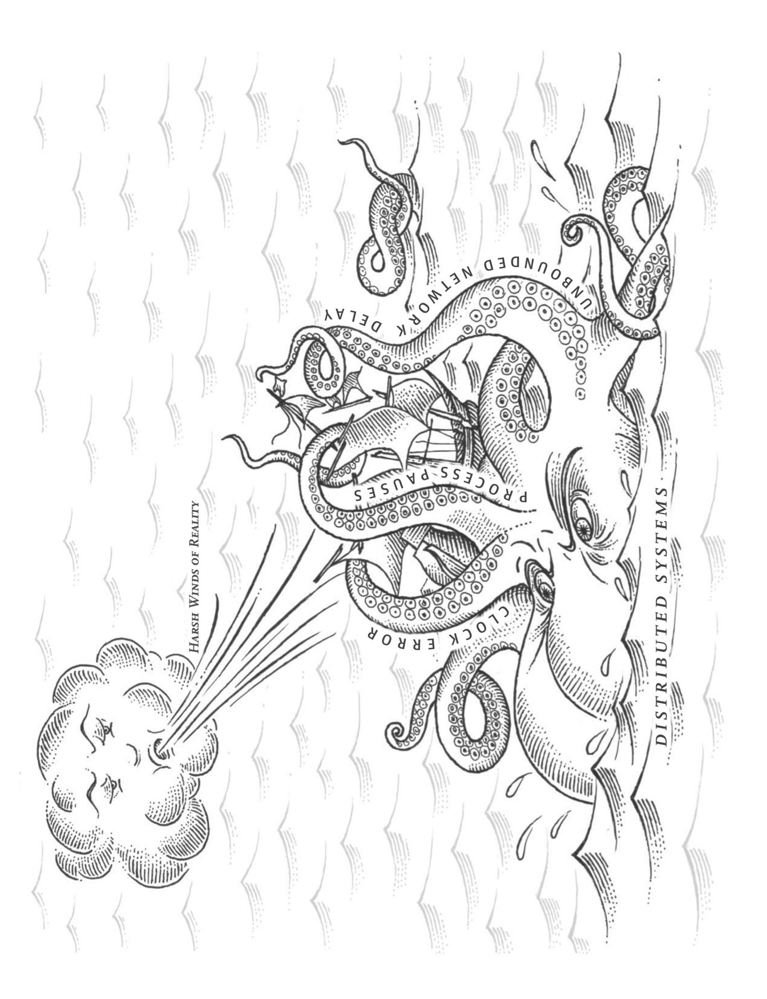

# <span id="page-294-0"></span>**The Trouble with Distributed Systems**

*Hey I just met you The network's laggy But here's my data So store it maybe*

—Kyle Kingsbury, *Carly Rae Jepsen and the Perils of Network Partitions* (2013)

A recurring theme in the last few chapters has been how systems handle things going wrong. For example, we discussed replica failover [\("Handling Node Outages" on](#page-177-0) [page 156\)](#page-177-0), replication lag [\("Problems with Replication Lag" on page 161](#page-182-0)), and con‐ currency control for transactions (["Weak Isolation Levels"](#page-254-0) on page 233). As we come to understand various edge cases that can occur in real systems, we get better at han‐ dling them.

However, even though we have talked a lot about faults, the last few chapters have still been too optimistic. The reality is even darker. We will now turn our pessimism to the maximum and assume that anything that *can* go wrong *will* go wrong.<sup>i</sup> (Expe‐ rienced systems operators will tell you that is a reasonable assumption. If you ask nicely, they might tell you some frightening stories while nursing their scars of past battles.)

Working with distributed systems is fundamentally different from writing software on a single computer—and the main difference is that there are lots of new and excit‐ ing ways for things to go wrong [[1](#page-333-0), [2](#page-333-0)]. In this chapter, we will get a taste of the prob‐ lems that arise in practice, and an understanding of the things we can and cannot rely on.

i. With one exception: we will assume that faults are *non-Byzantine* (see ["Byzantine Faults" on page 304\)](#page-325-0).

<span id="page-295-0"></span>In the end, our task as engineers is to build systems that do their job (i.e., meet the guarantees that users are expecting), in spite of everything going wrong. In [Chapter 9,](#page-342-0) we will look at some examples of algorithms that can provide such guarantees in a distributed system. But first, in this chapter, we must understand what challenges we are up against.

This chapter is a thoroughly pessimistic and depressing overview of things that may go wrong in a distributed system. We will look into problems with networks [\("Unre‐](#page-298-0) [liable Networks" on page 277\)](#page-298-0); clocks and timing issues [\("Unreliable Clocks" on page](#page-308-0) [287](#page-308-0)); and we'll discuss to what degree they are avoidable. The consequences of all these issues are disorienting, so we'll explore how to think about the state of a dis‐ tributed system and how to reason about things that have happened [\("Knowledge,](#page-321-0) [Truth, and Lies" on page 300\)](#page-321-0).

## **Faults and Partial Failures**

When you are writing a program on a single computer, it normally behaves in a fairly predictable way: either it works or it doesn't. Buggy software may give the appearance that the computer is sometimes "having a bad day" (a problem that is often fixed by a reboot), but that is mostly just a consequence of badly written software.

There is no fundamental reason why software on a single computer should be flaky: when the hardware is working correctly, the same operation always produces the same result (it is *deterministic*). If there is a hardware problem (e.g., memory corrup‐ tion or a loose connector), the consequence is usually a total system failure (e.g., ker‐ nel panic, "blue screen of death," failure to start up). An individual computer with good software is usually either fully functional or entirely broken, but not something in between.

This is a deliberate choice in the design of computers: if an internal fault occurs, we prefer a computer to crash completely rather than returning a wrong result, because wrong results are difficult and confusing to deal with. Thus, computers hide the fuzzy physical reality on which they are implemented and present an idealized system model that operates with mathematical perfection. A CPU instruction always does the same thing; if you write some data to memory or disk, that data remains intact and doesn't get randomly corrupted. This design goal of always-correct computation goes all the way back to the very first digital computer [\[3](#page-333-0)].

When you are writing software that runs on several computers, connected by a net‐ work, the situation is fundamentally different. In distributed systems, we are no longer operating in an idealized system model—we have no choice but to confront the messy reality of the physical world. And in the physical world, a remarkably wide range of things can go wrong, as illustrated by this anecdote [\[4](#page-333-0)]:

<span id="page-296-0"></span>In my limited experience I've dealt with long-lived network partitions in a single data center (DC), PDU [power distribution unit] failures, switch failures, accidental power cycles of whole racks, whole-DC backbone failures, whole-DC power failures, and a hypoglycemic driver smashing his Ford pickup truck into a DC's HVAC [heating, ven‐ tilation, and air conditioning] system. And I'm not even an ops guy.

—Coda Hale

In a distributed system, there may well be some parts of the system that are broken in some unpredictable way, even though other parts of the system are working fine. This is known as a *partial failure*. The difficulty is that partial failures are *nondeterministic*: if you try to do anything involving multiple nodes and the network, it may sometimes work and sometimes unpredictably fail. As we shall see, you may not even *know* whether something succeeded or not, as the time it takes for a message to travel across a network is also nondeterministic!

This nondeterminism and possibility of partial failures is what makes distributed sys‐ tems hard to work with [\[5](#page-333-0)].

## **Cloud Computing and Supercomputing**

There is a spectrum of philosophies on how to build large-scale computing systems:

- At one end of the scale is the field of *high-performance computing* (HPC). Super‐ computers with thousands of CPUs are typically used for computationally inten‐ sive scientific computing tasks, such as weather forecasting or molecular dynamics (simulating the movement of atoms and molecules).
- At the other extreme is *cloud computing*, which is not very well defined [\[6](#page-333-0)] but is often associated with multi-tenant datacenters, commodity computers connected with an IP network (often Ethernet), elastic/on-demand resource allocation, and metered billing.
- Traditional enterprise datacenters lie somewhere between these extremes.

With these philosophies come very different approaches to handling faults. In a supercomputer, a job typically checkpoints the state of its computation to durable storage from time to time. If one node fails, a common solution is to simply stop the entire cluster workload. After the faulty node is repaired, the computation is restarted from the last checkpoint [[7,](#page-333-0) [8](#page-333-0)]. Thus, a supercomputer is more like a single-node computer than a distributed system: it deals with partial failure by letting it escalate into total failure—if any part of the system fails, just let everything crash (like a kernel panic on a single machine).

In this book we focus on systems for implementing internet services, which usually look very different from supercomputers:

- <span id="page-297-0"></span>• Many internet-related applications are *online*, in the sense that they need to be able to serve users with low latency at any time. Making the service unavailable for example, stopping the cluster for repair—is not acceptable. In contrast, off‐ line (batch) jobs like weather simulations can be stopped and restarted with fairly low impact.
- Supercomputers are typically built from specialized hardware, where each node is quite reliable, and nodes communicate through shared memory and remote direct memory access (RDMA). On the other hand, nodes in cloud services are built from commodity machines, which can provide equivalent performance at lower cost due to economies of scale, but also have higher failure rates.
- Large datacenter networks are often based on IP and Ethernet, arranged in Clos topologies to provide high bisection bandwidth [\[9](#page-333-0)]. Supercomputers often use specialized network topologies, such as multi-dimensional meshes and toruses [[10\]](#page-333-0), which yield better performance for HPC workloads with known communi‐ cation patterns.
- The bigger a system gets, the more likely it is that one of its components is bro‐ ken. Over time, broken things get fixed and new things break, but in a system with thousands of nodes, it is reasonable to assume that *something* is always bro‐ ken [[7\]](#page-333-0). When the error handling strategy consists of simply giving up, a large system can end up spending a lot of its time recovering from faults rather than doing useful work [\[8](#page-333-0)].
- If the system can tolerate failed nodes and still keep working as a whole, that is a very useful feature for operations and maintenance: for example, you can per‐ form a rolling upgrade (see [Chapter 4](#page-132-0)), restarting one node at a time, while the service continues serving users without interruption. In cloud environments, if one virtual machine is not performing well, you can just kill it and request a new one (hoping that the new one will be faster).
- In a geographically distributed deployment (keeping data geographically close to your users to reduce access latency), communication most likely goes over the internet, which is slow and unreliable compared to local networks. Supercom‐ puters generally assume that all of their nodes are close together.

If we want to make distributed systems work, we must accept the possibility of partial failure and build fault-tolerance mechanisms into the software. In other words, we need to build a reliable system from unreliable components. (As discussed in ["Relia‐](#page-27-0) [bility" on page 6,](#page-27-0) there is no such thing as perfect reliability, so we'll need to under‐ stand the limits of what we can realistically promise.)

Even in smaller systems consisting of only a few nodes, it's important to think about partial failure. In a small system, it's quite likely that most of the components are working correctly most of the time. However, sooner or later, some part of the system

<span id="page-298-0"></span>*will* become faulty, and the software will have to somehow handle it. The fault han‐ dling must be part of the software design, and you (as operator of the software) need to know what behavior to expect from the software in the case of a fault.

It would be unwise to assume that faults are rare and simply hope for the best. It is important to consider a wide range of possible faults—even fairly unlikely ones—and to artificially create such situations in your testing environment to see what happens. In distributed systems, suspicion, pessimism, and paranoia pay off.

## **Building a Reliable System from Unreliable Components**

You may wonder whether this makes any sense—intuitively it may seem like a system can only be as reliable as its least reliable component (its *weakest link*). This is not the case: in fact, it is an old idea in computing to construct a more reliable system from a less reliable underlying base [[11](#page-334-0)]. For example:

- Error-correcting codes allow digital data to be transmitted accurately across a communication channel that occasionally gets some bits wrong, for example due to radio interference on a wireless network [[12](#page-334-0)].
- IP (the Internet Protocol) is unreliable: it may drop, delay, duplicate, or reorder packets. TCP (the Transmission Control Protocol) provides a more reliable transport layer on top of IP: it ensures that missing packets are retransmitted, duplicates are eliminated, and packets are reassembled into the order in which they were sent.

Although the system can be more reliable than its underlying parts, there is always a limit to how much more reliable it can be. For example, error-correcting codes can deal with a small number of single-bit errors, but if your signal is swamped by inter‐ ference, there is a fundamental limit to how much data you can get through your communication channel [[13](#page-334-0)]. TCP can hide packet loss, duplication, and reordering from you, but it cannot magically remove delays in the network.

Although the more reliable higher-level system is not perfect, it's still useful because it takes care of some of the tricky low-level faults, and so the remaining faults are usu‐ ally easier to reason about and deal with. We will explore this matter further in ["The](#page-540-0) [end-to-end argument" on page 519](#page-540-0).

## **Unreliable Networks**

As discussed in the introduction to [Part II,](#page-166-0) the distributed systems we focus on in this book are *shared-nothing systems*: i.e., a bunch of machines connected by a network. The network is the only way those machines can communicate—we assume that each <span id="page-299-0"></span>machine has its own memory and disk, and one machine cannot access another machine's memory or disk (except by making requests to a service over the network).

Shared-nothing is not the only way of building systems, but it has become the domi‐ nant approach for building internet services, for several reasons: it's comparatively cheap because it requires no special hardware, it can make use of commoditized cloud computing services, and it can achieve high reliability through redundancy across multiple geographically distributed datacenters.

The internet and most internal networks in datacenters (often Ethernet) are *asyn‐ chronous packet networks*. In this kind of network, one node can send a message (a packet) to another node, but the network gives no guarantees as to when it will arrive, or whether it will arrive at all. If you send a request and expect a response, many things could go wrong (some of which are illustrated in Figure 8-1):

- 1. Your request may have been lost (perhaps someone unplugged a network cable).
- 2. Your request may be waiting in a queue and will be delivered later (perhaps the network or the recipient is overloaded).
- 3. The remote node may have failed (perhaps it crashed or it was powered down).
- 4. The remote node may have temporarily stopped responding (perhaps it is expe‐ riencing a long garbage collection pause; see ["Process Pauses" on page 295\)](#page-316-0), but it will start responding again later.
- 5. The remote node may have processed your request, but the response has been lost on the network (perhaps a network switch has been misconfigured).
- 6. The remote node may have processed your request, but the response has been delayed and will be delivered later (perhaps the network or your own machine is overloaded).

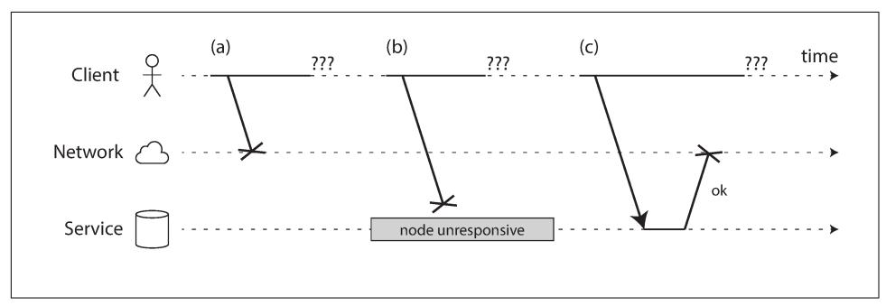

*Figure 8-1. If you send a request and don't get a response, it's not possible to distinguish whether (a) the request was lost, (b) the remote node is down, or (c) the response was lost.*

<span id="page-300-0"></span>The sender can't even tell whether the packet was delivered: the only option is for the recipient to send a response message, which may in turn be lost or delayed. These issues are indistinguishable in an asynchronous network: the only information you have is that you haven't received a response yet. If you send a request to another node and don't receive a response, it is *impossible* to tell why.

The usual way of handling this issue is a *timeout*: after some time you give up waiting and assume that the response is not going to arrive. However, when a timeout occurs, you still don't know whether the remote node got your request or not (and if the request is still queued somewhere, it may still be delivered to the recipient, even if the sender has given up on it).

## **Network Faults in Practice**

We have been building computer networks for decades—one might hope that by now we would have figured out how to make them reliable. However, it seems that we have not yet succeeded.

There are some systematic studies, and plenty of anecdotal evidence, showing that network problems can be surprisingly common, even in controlled environments like a datacenter operated by one company [[14\]](#page-334-0). One study in a medium-sized datacenter found about 12 network faults per month, of which half disconnected a single machine, and half disconnected an entire rack [\[15](#page-334-0)]. Another study measured the fail‐ ure rates of components like top-of-rack switches, aggregation switches, and load bal‐ ancers [\[16\]](#page-334-0). It found that adding redundant networking gear doesn't reduce faults as much as you might hope, since it doesn't guard against human error (e.g., misconfig‐ ured switches), which is a major cause of outages.

Public cloud services such as EC2 are notorious for having frequent transient net‐ work glitches [[14\]](#page-334-0), and well-managed private datacenter networks can be stabler environments. Nevertheless, nobody is immune from network problems: for exam‐ ple, a problem during a software upgrade for a switch could trigger a network topol‐ ogy reconfiguration, during which network packets could be delayed for more than a minute [\[17\]](#page-334-0). Sharks might bite undersea cables and damage them [[18](#page-334-0)]. Other surpris‐ ing faults include a network interface that sometimes drops all inbound packets but sends outbound packets successfully [[19](#page-334-0)]: just because a network link works in one direction doesn't guarantee it's also working in the opposite direction.


## **Network partitions**

When one part of the network is cut off from the rest due to a net‐ work fault, that is sometimes called a *network partition* or *netsplit*. In this book we'll generally stick with the more general term *net‐ work fault*, to avoid confusion with partitions (shards) of a storage system, as discussed in [Chapter 6](#page-220-0).

<span id="page-301-0"></span>Even if network faults are rare in your environment, the fact that faults *can* occur means that your software needs to be able to handle them. Whenever any communi‐ cation happens over a network, it may fail—there is no way around it.

If the error handling of network faults is not defined and tested, arbitrarily bad things could happen: for example, the cluster could become deadlocked and permanently unable to serve requests, even when the network recovers [\[20](#page-334-0)], or it could even delete all of your data [[21\]](#page-334-0). If software is put in an unanticipated situation, it may do arbi‐ trary unexpected things.

Handling network faults doesn't necessarily mean *tolerating* them: if your network is normally fairly reliable, a valid approach may be to simply show an error message to users while your network is experiencing problems. However, you do need to know how your software reacts to network problems and ensure that the system can recover from them. It may make sense to deliberately trigger network problems and test the system's response (this is the idea behind Chaos Monkey; see ["Reliability" on](#page-27-0) [page 6\)](#page-27-0).

## **Detecting Faults**

Many systems need to automatically detect faulty nodes. For example:

- A load balancer needs to stop sending requests to a node that is dead (i.e., take it *out of rotation*).
- In a distributed database with single-leader replication, if the leader fails, one of the followers needs to be promoted to be the new leader (see ["Handling Node](#page-177-0) [Outages" on page 156\)](#page-177-0).

Unfortunately, the uncertainty about the network makes it difficult to tell whether a node is working or not. In some specific circumstances you might get some feedback to explicitly tell you that something is not working:

- If you can reach the machine on which the node should be running, but no pro‐ cess is listening on the destination port (e.g., because the process crashed), the operating system will helpfully close or refuse TCP connections by sending a RST or FIN packet in reply. However, if the node crashed while it was handling your request, you have no way of knowing how much data was actually processed by the remote node [\[22](#page-334-0)].
- If a node process crashed (or was killed by an administrator) but the node's oper‐ ating system is still running, a script can notify other nodes about the crash so that another node can take over quickly without having to wait for a timeout to expire. For example, HBase does this [[23\]](#page-334-0).

- <span id="page-302-0"></span>• If you have access to the management interface of the network switches in your datacenter, you can query them to detect link failures at a hardware level (e.g., if the remote machine is powered down). This option is ruled out if you're con‐ necting via the internet, or if you're in a shared datacenter with no access to the switches themselves, or if you can't reach the management interface due to a net‐ work problem.
- If a router is sure that the IP address you're trying to connect to is unreachable, it may reply to you with an ICMP Destination Unreachable packet. However, the router doesn't have a magic failure detection capability either—it is subject to the same limitations as other participants of the network.

Rapid feedback about a remote node being down is useful, but you can't count on it. Even if TCP acknowledges that a packet was delivered, the application may have crashed before handling it. If you want to be sure that a request was successful, you need a positive response from the application itself [\[24](#page-334-0)].

Conversely, if something has gone wrong, you may get an error response at some level of the stack, but in general you have to assume that you will get no response at all. You can retry a few times (TCP retries transparently, but you may also retry at the application level), wait for a timeout to elapse, and eventually declare the node dead if you don't hear back within the timeout.

## **Timeouts and Unbounded Delays**

If a timeout is the only sure way of detecting a fault, then how long should the time‐ out be? There is unfortunately no simple answer.

A long timeout means a long wait until a node is declared dead (and during this time, users may have to wait or see error messages). A short timeout detects faults faster, but carries a higher risk of incorrectly declaring a node dead when in fact it has only suffered a temporary slowdown (e.g., due to a load spike on the node or the network).

Prematurely declaring a node dead is problematic: if the node is actually alive and in the middle of performing some action (for example, sending an email), and another node takes over, the action may end up being performed twice. We will discuss this issue in more detail in ["Knowledge, Truth, and Lies" on page 300,](#page-321-0) and in Chapters [9](#page-342-0) and [11](#page-460-0).

When a node is declared dead, its responsibilities need to be transferred to other nodes, which places additional load on other nodes and the network. If the system is already struggling with high load, declaring nodes dead prematurely can make the problem worse. In particular, it could happen that the node actually wasn't dead but only slow to respond due to overload; transferring its load to other nodes can cause a cascading failure (in the extreme case, all nodes declare each other dead, and every‐ thing stops working).

<span id="page-303-0"></span>Imagine a fictitious system with a network that guaranteed a maximum delay for packets—every packet is either delivered within some time *d*, or it is lost, but delivery never takes longer than *d*. Furthermore, assume that you can guarantee that a nonfailed node always handles a request within some time *r*. In this case, you could guar‐ antee that every successful request receives a response within time 2*d* + *r*—and if you don't receive a response within that time, you know that either the network or the remote node is not working. If this was true, 2*d* + *r* would be a reasonable timeout to use.

Unfortunately, most systems we work with have neither of those guarantees: asyn‐ chronous networks have *unbounded delays* (that is, they try to deliver packets as quickly as possible, but there is no upper limit on the time it may take for a packet to arrive), and most server implementations cannot guarantee that they can handle requests within some maximum time (see ["Response time guarantees"](#page-319-0) on page 298). For failure detection, it's not sufficient for the system to be fast most of the time: if your timeout is low, it only takes a transient spike in round-trip times to throw the system off-balance.

## **Network congestion and queueing**

When driving a car, travel times on road networks often vary most due to traffic con‐ gestion. Similarly, the variability of packet delays on computer networks is most often due to queueing [[25\]](#page-334-0):

- If several different nodes simultaneously try to send packets to the same destina‐ tion, the network switch must queue them up and feed them into the destination network link one by one (as illustrated in [Figure 8-2\)](#page-304-0). On a busy network link, a packet may have to wait a while until it can get a slot (this is called *network con‐ gestion*). If there is so much incoming data that the switch queue fills up, the packet is dropped, so it needs to be resent—even though the network is function‐ ing fine.
- When a packet reaches the destination machine, if all CPU cores are currently busy, the incoming request from the network is queued by the operating system until the application is ready to handle it. Depending on the load on the machine, this may take an arbitrary length of time.
- In virtualized environments, a running operating system is often paused for tens of milliseconds while another virtual machine uses a CPU core. During this time, the VM cannot consume any data from the network, so the incoming data is queued (buffered) by the virtual machine monitor [[26\]](#page-335-0), further increasing the variability of network delays.
- TCP performs *flow control* (also known as *congestion avoidance* or *backpressure*), in which a node limits its own rate of sending in order to avoid overloading a

<span id="page-304-0"></span>network link or the receiving node [\[27](#page-335-0)]. This means additional queueing at the sender before the data even enters the network.

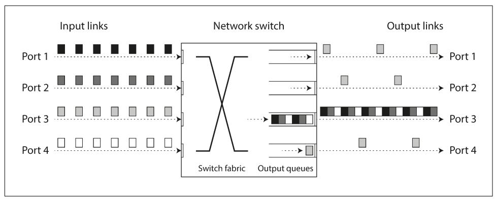

*Figure 8-2. If several machines send network traffic to the same destination, its switch queue can fill up. Here, ports 1, 2, and 4 are all trying to send packets to port 3.*

Moreover, TCP considers a packet to be lost if it is not acknowledged within some timeout (which is calculated from observed round-trip times), and lost packets are automatically retransmitted. Although the application does not see the packet loss and retransmission, it does see the resulting delay (waiting for the timeout to expire, and then waiting for the retransmitted packet to be acknowledged).

## **TCP Versus UDP**

Some latency-sensitive applications, such as videoconferencing and Voice over IP (VoIP), use UDP rather than TCP. It's a trade-off between reliability and variability of delays: as UDP does not perform flow control and does not retransmit lost packets, it avoids some of the reasons for variable network delays (although it is still suscepti‐ ble to switch queues and scheduling delays).

UDP is a good choice in situations where delayed data is worthless. For example, in a VoIP phone call, there probably isn't enough time to retransmit a lost packet before its data is due to be played over the loudspeakers. In this case, there's no point in retransmitting the packet—the application must instead fill the missing packet's time slot with silence (causing a brief interruption in the sound) and move on in the stream. The retry happens at the human layer instead. ("Could you repeat that please? The sound just cut out for a moment.")

All of these factors contribute to the variability of network delays. Queueing delays have an especially wide range when a system is close to its maximum capacity: a sys‐ <span id="page-305-0"></span>tem with plenty of spare capacity can easily drain queues, whereas in a highly utilized system, long queues can build up very quickly.

In public clouds and multi-tenant datacenters, resources are shared among many customers: the network links and switches, and even each machine's network inter‐ face and CPUs (when running on virtual machines), are shared. Batch workloads such as MapReduce (see [Chapter 10](#page-410-0)) can easily saturate network links. As you have no control over or insight into other customers' usage of the shared resources, net‐ work delays can be highly variable if someone near you (a *noisy neighbor*) is using a lot of resources [\[28](#page-335-0), [29](#page-335-0)].

In such environments, you can only choose timeouts experimentally: measure the distribution of network round-trip times over an extended period, and over many machines, to determine the expected variability of delays. Then, taking into account your application's characteristics, you can determine an appropriate trade-off between failure detection delay and risk of premature timeouts.

Even better, rather than using configured constant timeouts, systems can continually measure response times and their variability (*jitter*), and automatically adjust time‐ outs according to the observed response time distribution. This can be done with a Phi Accrual failure detector [\[30](#page-335-0)], which is used for example in Akka and Cassandra [[31\]](#page-335-0). TCP retransmission timeouts also work similarly [\[27](#page-335-0)].

## **Synchronous Versus Asynchronous Networks**

Distributed systems would be a lot simpler if we could rely on the network to deliver packets with some fixed maximum delay, and not to drop packets. Why can't we solve this at the hardware level and make the network reliable so that the software doesn't need to worry about it?

To answer this question, it's interesting to compare datacenter networks to the tradi‐ tional fixed-line telephone network (non-cellular, non-VoIP), which is extremely reliable: delayed audio frames and dropped calls are very rare. A phone call requires a constantly low end-to-end latency and enough bandwidth to transfer the audio sam‐ ples of your voice. Wouldn't it be nice to have similar reliability and predictability in computer networks?

When you make a call over the telephone network, it establishes a *circuit*: a fixed, guaranteed amount of bandwidth is allocated for the call, along the entire route between the two callers. This circuit remains in place until the call ends [\[32](#page-335-0)]. For example, an ISDN network runs at a fixed rate of 4,000 frames per second. When a call is established, it is allocated 16 bits of space within each frame (in each direction). Thus, for the duration of the call, each side is guaranteed to be able to send exactly 16 bits of audio data every 250 microseconds [[33,](#page-335-0) [34\]](#page-335-0).

<span id="page-306-0"></span>This kind of network is *synchronous*: even as data passes through several routers, it does not suffer from queueing, because the 16 bits of space for the call have already been reserved in the next hop of the network. And because there is no queueing, the maximum end-to-end latency of the network is fixed. We call this a *bounded delay*.

#### **Can we not simply make network delays predictable?**

Note that a circuit in a telephone network is very different from a TCP connection: a circuit is a fixed amount of reserved bandwidth which nobody else can use while the circuit is established, whereas the packets of a TCP connection opportunistically use whatever network bandwidth is available. You can give TCP a variable-sized block of data (e.g., an email or a web page), and it will try to transfer it in the shortest time possible. While a TCP connection is idle, it doesn't use any bandwidth.ii

If datacenter networks and the internet were circuit-switched networks, it would be possible to establish a guaranteed maximum round-trip time when a circuit was set up. However, they are not: Ethernet and IP are packet-switched protocols, which suf‐ fer from queueing and thus unbounded delays in the network. These protocols do not have the concept of a circuit.

Why do datacenter networks and the internet use packet switching? The answer is that they are optimized for *bursty traffic*. A circuit is good for an audio or video call, which needs to transfer a fairly constant number of bits per second for the duration of the call. On the other hand, requesting a web page, sending an email, or transfer‐ ring a file doesn't have any particular bandwidth requirement—we just want it to complete as quickly as possible.

If you wanted to transfer a file over a circuit, you would have to guess a bandwidth allocation. If you guess too low, the transfer is unnecessarily slow, leaving network capacity unused. If you guess too high, the circuit cannot be set up (because the net‐ work cannot allow a circuit to be created if its bandwidth allocation cannot be guar‐ anteed). Thus, using circuits for bursty data transfers wastes network capacity and makes transfers unnecessarily slow. By contrast, TCP dynamically adapts the rate of data transfer to the available network capacity.

There have been some attempts to build hybrid networks that support both circuit switching and packet switching, such as ATM.iii InfiniBand has some similarities [[35\]](#page-335-0): it implements end-to-end flow control at the link layer, which reduces the need for

ii. Except perhaps for an occasional keepalive packet, if TCP keepalive is enabled.

iii. *Asynchronous Transfer Mode* (ATM) was a competitor to Ethernet in the 1980s [[32\]](#page-335-0), but it didn't gain much adoption outside of telephone network core switches. It has nothing to do with automatic teller machines (also known as cash machines), despite sharing an acronym. Perhaps, in some parallel universe, the internet is based on something like ATM—in that universe, internet video calls are probably a lot more relia‐ ble than they are in ours, because they don't suffer from dropped and delayed packets.

<span id="page-307-0"></span>queueing in the network, although it can still suffer from delays due to link conges‐ tion [\[36\]](#page-335-0). With careful use of *quality of service* (QoS, prioritization and scheduling of packets) and *admission control* (rate-limiting senders), it is possible to emulate circuit switching on packet networks, or provide statistically bounded delay [[25,](#page-334-0) [32](#page-335-0)].

## **Latency and Resource Utilization**

More generally, you can think of variable delays as a consequence of dynamic resource partitioning.

Say you have a wire between two telephone switches that can carry up to 10,000 simultaneous calls. Each circuit that is switched over this wire occupies one of those call slots. Thus, you can think of the wire as a resource that can be shared by up to 10,000 simultaneous users. The resource is divided up in a *static* way: even if you're the only call on the wire right now, and all other 9,999 slots are unused, your circuit is still allocated the same fixed amount of bandwidth as when the wire is fully utilized.

By contrast, the internet shares network bandwidth *dynamically*. Senders push and jostle with each other to get their packets over the wire as quickly as possible, and the network switches decide which packet to send (i.e., the bandwidth allocation) from one moment to the next. This approach has the downside of queueing, but the advan‐ tage is that it maximizes utilization of the wire. The wire has a fixed cost, so if you utilize it better, each byte you send over the wire is cheaper.

A similar situation arises with CPUs: if you share each CPU core dynamically between several threads, one thread sometimes has to wait in the operating system's run queue while another thread is running, so a thread can be paused for varying lengths of time. However, this utilizes the hardware better than if you allocated a static number of CPU cycles to each thread (see ["Response time guarantees" on page](#page-319-0) [298\)](#page-319-0). Better hardware utilization is also a significant motivation for using virtual machines.

Latency guarantees are achievable in certain environments, if resources are statically partitioned (e.g., dedicated hardware and exclusive bandwidth allocations). However, it comes at the cost of reduced utilization—in other words, it is more expensive. On the other hand, multi-tenancy with dynamic resource partitioning provides better utilization, so it is cheaper, but it has the downside of variable delays.

Variable delays in networks are not a law of nature, but simply the result of a cost/ benefit trade-off.

<span id="page-308-0"></span>However, such quality of service is currently not enabled in multi-tenant datacenters and public clouds, or when communicating via the internet.iv Currently deployed technology does not allow us to make any guarantees about delays or reliability of the network: we have to assume that network congestion, queueing, and unbounded delays will happen. Consequently, there's no "correct" value for timeouts—they need to be determined experimentally.

## **Unreliable Clocks**

Clocks and time are important. Applications depend on clocks in various ways to answer questions like the following:

- 1. Has this request timed out yet?
- 2. What's the 99th percentile response time of this service?
- 3. How many queries per second did this service handle on average in the last five minutes?
- 4. How long did the user spend on our site?
- 5. When was this article published?
- 6. At what date and time should the reminder email be sent?
- 7. When does this cache entry expire?
- 8. What is the timestamp on this error message in the log file?

Examples 1–4 measure *durations* (e.g., the time interval between a request being sent and a response being received), whereas examples 5–8 describe *points in time* (events that occur on a particular date, at a particular time).

In a distributed system, time is a tricky business, because communication is not instantaneous: it takes time for a message to travel across the network from one machine to another. The time when a message is received is always later than the time when it is sent, but due to variable delays in the network, we don't know how much later. This fact sometimes makes it difficult to determine the order in which things happened when multiple machines are involved.

Moreover, each machine on the network has its own clock, which is an actual hard‐ ware device: usually a quartz crystal oscillator. These devices are not perfectly accu‐ rate, so each machine has its own notion of time, which may be slightly faster or

iv. Peering agreements between internet service providers and the establishment of routes through the Bor‐ der Gateway Protocol (BGP), bear closer resemblance to circuit switching than IP itself. At this level, it is pos‐ sible to buy dedicated bandwidth. However, internet routing operates at the level of networks, not individual connections between hosts, and at a much longer timescale.

<span id="page-309-0"></span>slower than on other machines. It is possible to synchronize clocks to some degree: the most commonly used mechanism is the Network Time Protocol (NTP), which allows the computer clock to be adjusted according to the time reported by a group of servers [[37\]](#page-335-0). The servers in turn get their time from a more accurate time source, such as a GPS receiver.

## **Monotonic Versus Time-of-Day Clocks**

Modern computers have at least two different kinds of clocks: a *time-of-day clock* and a *monotonic clock*. Although they both measure time, it is important to distinguish the two, since they serve different purposes.

## **Time-of-day clocks**

A time-of-day clock does what you intuitively expect of a clock: it returns the current date and time according to some calendar (also known as *wall-clock time*). For exam‐ ple, clock\_gettime(CLOCK\_REALTIME) on Linux<sup>v</sup> and System.currentTimeMillis() in Java return the number of seconds (or milliseconds) since the *epoch*: midnight UTC on January 1, 1970, according to the Gregorian calendar, not counting leap sec‐ onds. Some systems use other dates as their reference point.

Time-of-day clocks are usually synchronized with NTP, which means that a time‐ stamp from one machine (ideally) means the same as a timestamp on another machine. However, time-of-day clocks also have various oddities, as described in the next section. In particular, if the local clock is too far ahead of the NTP server, it may be forcibly reset and appear to jump back to a previous point in time. These jumps, as well as the fact that they often ignore leap seconds, make time-of-day clocks unsuita‐ ble for measuring elapsed time [[38](#page-335-0)].

Time-of-day clocks have also historically had quite a coarse-grained resolution, e.g., moving forward in steps of 10 ms on older Windows systems [[39\]](#page-335-0). On recent sys‐ tems, this is less of a problem.

#### **Monotonic clocks**

A monotonic clock is suitable for measuring a duration (time interval), such as a timeout or a service's response time: clock\_gettime(CLOCK\_MONOTONIC) on Linux and System.nanoTime() in Java are monotonic clocks, for example. The name comes from the fact that they are guaranteed to always move forward (whereas a time-ofday clock may jump back in time).

v. Although the clock is called *real-time*, it has nothing to do with real-time operating systems, as discussed in ["Response time guarantees" on page 298.](#page-319-0)

<span id="page-310-0"></span>You can check the value of the monotonic clock at one point in time, do something, and then check the clock again at a later time. The *difference* between the two values tells you how much time elapsed between the two checks. However, the *absolute* value of the clock is meaningless: it might be the number of nanoseconds since the computer was started, or something similarly arbitrary. In particular, it makes no sense to compare monotonic clock values from two different computers, because they don't mean the same thing.

On a server with multiple CPU sockets, there may be a separate timer per CPU, which is not necessarily synchronized with other CPUs. Operating systems compen‐ sate for any discrepancy and try to present a monotonic view of the clock to applica‐ tion threads, even as they are scheduled across different CPUs. However, it is wise to take this guarantee of monotonicity with a pinch of salt [\[40](#page-335-0)].

NTP may adjust the frequency at which the monotonic clock moves forward (this is known as *slewing* the clock) if it detects that the computer's local quartz is moving faster or slower than the NTP server. By default, NTP allows the clock rate to be spee‐ ded up or slowed down by up to 0.05%, but NTP cannot cause the monotonic clock to jump forward or backward. The resolution of monotonic clocks is usually quite good: on most systems they can measure time intervals in microseconds or less.

In a distributed system, using a monotonic clock for measuring elapsed time (e.g., timeouts) is usually fine, because it doesn't assume any synchronization between dif‐ ferent nodes' clocks and is not sensitive to slight inaccuracies of measurement.

## **Clock Synchronization and Accuracy**

Monotonic clocks don't need synchronization, but time-of-day clocks need to be set according to an NTP server or other external time source in order to be useful. Unfortunately, our methods for getting a clock to tell the correct time aren't nearly as reliable or accurate as you might hope—hardware clocks and NTP can be fickle beasts. To give just a few examples:

- The quartz clock in a computer is not very accurate: it *drifts* (runs faster or slower than it should). Clock drift varies depending on the temperature of the machine. Google assumes a clock drift of 200 ppm (parts per million) for its servers [\[41](#page-336-0)], which is equivalent to 6 ms drift for a clock that is resynchronized with a server every 30 seconds, or 17 seconds drift for a clock that is resynchron‐ ized once a day. This drift limits the best possible accuracy you can achieve, even if everything is working correctly.
- If a computer's clock differs too much from an NTP server, it may refuse to syn‐ chronize, or the local clock will be forcibly reset [[37](#page-335-0)]. Any applications observing the time before and after this reset may see time go backward or suddenly jump forward.

- <span id="page-311-0"></span>• If a node is accidentally firewalled off from NTP servers, the misconfiguration may go unnoticed for some time. Anecdotal evidence suggests that this does hap‐ pen in practice.
- NTP synchronization can only be as good as the network delay, so there is a limit to its accuracy when you're on a congested network with variable packet delays. One experiment showed that a minimum error of 35 ms is achievable when syn‐ chronizing over the internet [\[42](#page-336-0)], though occasional spikes in network delay lead to errors of around a second. Depending on the configuration, large network delays can cause the NTP client to give up entirely.
- Some NTP servers are wrong or misconfigured, reporting time that is off by hours [\[43](#page-336-0), [44](#page-336-0)]. NTP clients are quite robust, because they query several servers and ignore outliers. Nevertheless, it's somewhat worrying to bet the correctness of your systems on the time that you were told by a stranger on the internet.
- Leap seconds result in a minute that is 59 seconds or 61 seconds long, which messes up timing assumptions in systems that are not designed with leap seconds in mind [\[45](#page-336-0)]. The fact that leap seconds have crashed many large systems [[38,](#page-335-0) [46](#page-336-0)] shows how easy it is for incorrect assumptions about clocks to sneak into a system. The best way of handling leap seconds may be to make NTP servers "lie," by performing the leap second adjustment gradually over the course of a day (this is known as *smearing*) [\[47](#page-336-0), [48\]](#page-336-0), although actual NTP server behavior varies in practice [\[49](#page-336-0)].
- In virtual machines, the hardware clock is virtualized, which raises additional challenges for applications that need accurate timekeeping [[50\]](#page-336-0). When a CPU core is shared between virtual machines, each VM is paused for tens of milli‐ seconds while another VM is running. From an application's point of view, this pause manifests itself as the clock suddenly jumping forward [[26\]](#page-335-0).
- If you run software on devices that you don't fully control (e.g., mobile or embedded devices), you probably cannot trust the device's hardware clock at all. Some users deliberately set their hardware clock to an incorrect date and time, for example to circumvent timing limitations in games. As a result, the clock might be set to a time wildly in the past or the future.

It is possible to achieve very good clock accuracy if you care about it sufficiently to invest significant resources. For example, the MiFID II draft European regulation for financial institutions requires all high-frequency trading funds to synchronize their clocks to within 100 microseconds of UTC, in order to help debug market anomalies such as "flash crashes" and to help detect market manipulation [[51\]](#page-336-0).

Such accuracy can be achieved using GPS receivers, the Precision Time Protocol (PTP) [[52](#page-336-0)], and careful deployment and monitoring. However, it requires significant effort and expertise, and there are plenty of ways clock synchronization can go <span id="page-312-0"></span>wrong. If your NTP daemon is misconfigured, or a firewall is blocking NTP traffic, the clock error due to drift can quickly become large.

## **Relying on Synchronized Clocks**

The problem with clocks is that while they seem simple and easy to use, they have a surprising number of pitfalls: a day may not have exactly 86,400 seconds, time-of-day clocks may move backward in time, and the time on one node may be quite different from the time on another node.

Earlier in this chapter we discussed networks dropping and arbitrarily delaying pack‐ ets. Even though networks are well behaved most of the time, software must be designed on the assumption that the network will occasionally be faulty, and the soft‐ ware must handle such faults gracefully. The same is true with clocks: although they work quite well most of the time, robust software needs to be prepared to deal with incorrect clocks.

Part of the problem is that incorrect clocks easily go unnoticed. If a machine's CPU is defective or its network is misconfigured, it most likely won't work at all, so it will quickly be noticed and fixed. On the other hand, if its quartz clock is defective or its NTP client is misconfigured, most things will seem to work fine, even though its clock gradually drifts further and further away from reality. If some piece of software is relying on an accurately synchronized clock, the result is more likely to be silent and subtle data loss than a dramatic crash [\[53](#page-336-0), [54](#page-336-0)].

Thus, if you use software that requires synchronized clocks, it is essential that you also carefully monitor the clock offsets between all the machines. Any node whose clock drifts too far from the others should be declared dead and removed from the cluster. Such monitoring ensures that you notice the broken clocks before they can cause too much damage.

## **Timestamps for ordering events**

Let's consider one particular situation in which it is tempting, but dangerous, to rely on clocks: ordering of events across multiple nodes. For example, if two clients write to a distributed database, who got there first? Which write is the more recent one?

[Figure 8-3](#page-313-0) illustrates a dangerous use of time-of-day clocks in a database with multileader replication (the example is similar to [Figure 5-9\)](#page-197-0). Client A writes *x* = 1 on node 1; the write is replicated to node 3; client B increments *x* on node 3 (we now have *x* = 2); and finally, both writes are replicated to node 2.

<span id="page-313-0"></span>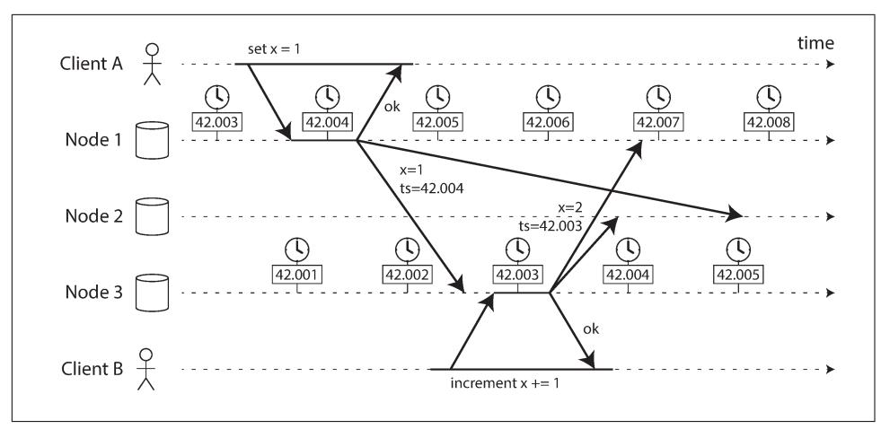

*Figure 8-3. The write by client B is causally later than the write by client A, but B's write has an earlier timestamp.*

In Figure 8-3, when a write is replicated to other nodes, it is tagged with a timestamp according to the time-of-day clock on the node where the write originated. The clock synchronization is very good in this example: the skew between node 1 and node 3 is less than 3 ms, which is probably better than you can expect in practice.

Nevertheless, the timestamps in Figure 8-3 fail to order the events correctly: the write *x* = 1 has a timestamp of 42.004 seconds, but the write *x* = 2 has a timestamp of 42.003 seconds, even though *x* = 2 occurred unambiguously later. When node 2 receives these two events, it will incorrectly conclude that *x* = 1 is the more recent value and drop the write *x* = 2. In effect, client B's increment operation will be lost.

This conflict resolution strategy is called *last write wins* (LWW), and it is widely used in both multi-leader replication and leaderless databases such as Cassandra [\[53](#page-336-0)] and Riak [\[54](#page-336-0)] (see ["Last write wins \(discarding concurrent writes\)" on page 186](#page-207-0)). Some implementations generate timestamps on the client rather than the server, but this doesn't change the fundamental problems with LWW:

- Database writes can mysteriously disappear: a node with a lagging clock is unable to overwrite values previously written by a node with a fast clock until the clock skew between the nodes has elapsed [[54,](#page-336-0) [55\]](#page-336-0). This scenario can cause arbitrary amounts of data to be silently dropped without any error being reported to the application.
- LWW cannot distinguish between writes that occurred sequentially in quick suc‐ cession (in Figure 8-3, client B's increment definitely occurs *after* client A's write) and writes that were truly concurrent (neither writer was aware of the other). Additional causality tracking mechanisms, such as version vectors, are

<span id="page-314-0"></span>needed in order to prevent violations of causality (see ["Detecting Concurrent](#page-205-0) [Writes" on page 184](#page-205-0)).

• It is possible for two nodes to independently generate writes with the same time‐ stamp, especially when the clock only has millisecond resolution. An additional tiebreaker value (which can simply be a large random number) is required to resolve such conflicts, but this approach can also lead to violations of causality [[53\]](#page-336-0).

Thus, even though it is tempting to resolve conflicts by keeping the most "recent" value and discarding others, it's important to be aware that the definition of "recent" depends on a local time-of-day clock, which may well be incorrect. Even with tightly NTP-synchronized clocks, you could send a packet at timestamp 100 ms (according to the sender's clock) and have it arrive at timestamp 99 ms (according to the recipi‐ ent's clock)—so it appears as though the packet arrived before it was sent, which is impossible.

Could NTP synchronization be made accurate enough that such incorrect orderings cannot occur? Probably not, because NTP's synchronization accuracy is itself limited by the network round-trip time, in addition to other sources of error such as quartz drift. For correct ordering, you would need the clock source to be significantly more accurate than the thing you are measuring (namely network delay).

So-called *logical clocks* [\[56](#page-337-0), [57](#page-337-0)], which are based on incrementing counters rather than an oscillating quartz crystal, are a safer alternative for ordering events (see ["Detecting Concurrent Writes"](#page-205-0) on page 184). Logical clocks do not measure the time of day or the number of seconds elapsed, only the relative ordering of events (whether one event happened before or after another). In contrast, time-of-day and monotonic clocks, which measure actual elapsed time, are also known as *physical clocks*. We'll look at ordering a bit more in ["Ordering Guarantees" on page 339.](#page-360-0)

## **Clock readings have a confidence interval**

You may be able to read a machine's time-of-day clock with microsecond or even nanosecond resolution. But even if you can get such a fine-grained measurement, that doesn't mean the value is actually accurate to such precision. In fact, it most likely is not—as mentioned previously, the drift in an imprecise quartz clock can easily be several milliseconds, even if you synchronize with an NTP server on the local network every minute. With an NTP server on the public internet, the best pos‐ sible accuracy is probably to the tens of milliseconds, and the error may easily spike to over 100 ms when there is network congestion [\[57](#page-337-0)].

Thus, it doesn't make sense to think of a clock reading as a point in time—it is more like a range of times, within a confidence interval: for example, a system may be 95% confident that the time now is between 10.3 and 10.5 seconds past the minute, but it <span id="page-315-0"></span>doesn't know any more precisely than that [[58\]](#page-337-0). If we only know the time +/– 100 ms, the microsecond digits in the timestamp are essentially meaningless.

The uncertainty bound can be calculated based on your time source. If you have a GPS receiver or atomic (caesium) clock directly attached to your computer, the expected error range is reported by the manufacturer. If you're getting the time from a server, the uncertainty is based on the expected quartz drift since your last sync with the server, plus the NTP server's uncertainty, plus the network round-trip time to the server (to a first approximation, and assuming you trust the server).

Unfortunately, most systems don't expose this uncertainty: for example, when you call clock\_gettime(), the return value doesn't tell you the expected error of the timestamp, so you don't know if its confidence interval is five milliseconds or five years.

An interesting exception is Google's *TrueTime* API in Spanner [\[41](#page-336-0)], which explicitly reports the confidence interval on the local clock. When you ask it for the current time, you get back two values: [*earliest*, *latest*], which are the *earliest possible* and the *latest possible* timestamp. Based on its uncertainty calculations, the clock knows that the actual current time is somewhere within that interval. The width of the interval depends, among other things, on how long it has been since the local quartz clock was last synchronized with a more accurate clock source.

## **Synchronized clocks for global snapshots**

In ["Snapshot Isolation and Repeatable Read" on page 237](#page-258-0) we discussed *snapshot iso‐ lation*, which is a very useful feature in databases that need to support both small, fast read-write transactions and large, long-running read-only transactions (e.g., for backups or analytics). It allows read-only transactions to see the database in a consis‐ tent state at a particular point in time, without locking and interfering with readwrite transactions.

The most common implementation of snapshot isolation requires a monotonically increasing transaction ID. If a write happened later than the snapshot (i.e., the write has a greater transaction ID than the snapshot), that write is invisible to the snapshot transaction. On a single-node database, a simple counter is sufficient for generating transaction IDs.

However, when a database is distributed across many machines, potentially in multi‐ ple datacenters, a global, monotonically increasing transaction ID (across all parti‐ tions) is difficult to generate, because it requires coordination. The transaction ID must reflect causality: if transaction B reads a value that was written by transaction A, then B must have a higher transaction ID than A—otherwise, the snapshot would not <span id="page-316-0"></span>be consistent. With lots of small, rapid transactions, creating transaction IDs in a dis‐ tributed system becomes an untenable bottleneck.vi

Can we use the timestamps from synchronized time-of-day clocks as transaction IDs? If we could get the synchronization good enough, they would have the right proper‐ ties: later transactions have a higher timestamp. The problem, of course, is the uncer‐ tainty about clock accuracy.

Spanner implements snapshot isolation across datacenters in this way [\[59, 60\]](#page-337-0). It uses the clock's confidence interval as reported by the TrueTime API, and is based on the following observation: if you have two confidence intervals, each consisting of an ear‐ liest and latest possible timestamp (*A* = [*Aearliest*, *Alatest*] and *B* = [*Bearliest*, *Blatest*]), and those two intervals do not overlap (i.e., *Aearliest* < *Alatest* < *Bearliest* < *Blatest*), then B defi‐ nitely happened after A—there can be no doubt. Only if the intervals overlap are we unsure in which order A and B happened.

In order to ensure that transaction timestamps reflect causality, Spanner deliberately waits for the length of the confidence interval before committing a read-write trans‐ action. By doing so, it ensures that any transaction that may read the data is at a suffi‐ ciently later time, so their confidence intervals do not overlap. In order to keep the wait time as short as possible, Spanner needs to keep the clock uncertainty as small as possible; for this purpose, Google deploys a GPS receiver or atomic clock in each datacenter, allowing clocks to be synchronized to within about 7 ms [[41\]](#page-336-0).

Using clock synchronization for distributed transaction semantics is an area of active research [\[57](#page-337-0), [61](#page-337-0), [62\]](#page-337-0). These ideas are interesting, but they have not yet been imple‐ mented in mainstream databases outside of Google.

## **Process Pauses**

Let's consider another example of dangerous clock use in a distributed system. Say you have a database with a single leader per partition. Only the leader is allowed to accept writes. How does a node know that it is still leader (that it hasn't been declared dead by the others), and that it may safely accept writes?

One option is for the leader to obtain a *lease* from the other nodes, which is similar to a lock with a timeout [[63\]](#page-337-0). Only one node can hold the lease at any one time—thus, when a node obtains a lease, it knows that it is the leader for some amount of time, until the lease expires. In order to remain leader, the node must periodically renew

vi. There are distributed sequence number generators, such as Twitter's Snowflake, that generate *approxi‐ mately* monotonically increasing unique IDs in a scalable way (e.g., by allocating blocks of the ID space to different nodes). However, they typically cannot guarantee an ordering that is consistent with causality, because the timescale at which blocks of IDs are assigned is longer than the timescale of database reads and writes. See also ["Ordering Guarantees" on page 339.](#page-360-0)

<span id="page-317-0"></span>the lease before it expires. If the node fails, it stops renewing the lease, so another node can take over when it expires.

You can imagine the request-handling loop looking something like this:

```
while (true) {
 request = getIncomingRequest();
 // Ensure that the lease always has at least 10 seconds remaining
 if (lease.expiryTimeMillis - System.currentTimeMillis() < 10000) {
 lease = lease.renew();
 }
 if (lease.isValid()) {
 process(request);
 }
}
```

What's wrong with this code? Firstly, it's relying on synchronized clocks: the expiry time on the lease is set by a different machine (where the expiry may be calculated as the current time plus 30 seconds, for example), and it's being compared to the local system clock. If the clocks are out of sync by more than a few seconds, this code will start doing strange things.

Secondly, even if we change the protocol to only use the local monotonic clock, there is another problem: the code assumes that very little time passes between the point that it checks the time (System.currentTimeMillis()) and the time when the request is processed (process(request)). Normally this code runs very quickly, so the 10 second buffer is more than enough to ensure that the lease doesn't expire in the middle of processing a request.

However, what if there is an unexpected pause in the execution of the program? For example, imagine the thread stops for 15 seconds around the line lease.isValid() before finally continuing. In that case, it's likely that the lease will have expired by the time the request is processed, and another node has already taken over as leader. However, there is nothing to tell this thread that it was paused for so long, so this code won't notice that the lease has expired until the next iteration of the loop—by which time it may have already done something unsafe by processing the request.

Is it crazy to assume that a thread might be paused for so long? Unfortunately not. There are various reasons why this could happen:

• Many programming language runtimes (such as the Java Virtual Machine) have a *garbage collector* (GC) that occasionally needs to stop all running threads. These *"stop-the-world" GC pauses* have sometimes been known to last for several minutes [[64](#page-337-0)]! Even so-called "concurrent" garbage collectors like the HotSpot JVM's CMS cannot fully run in parallel with the application code—even they need to stop the world from time to time [\[65](#page-337-0)]. Although the pauses can often be

- <span id="page-318-0"></span>reduced by changing allocation patterns or tuning GC settings [[66\]](#page-337-0), we must assume the worst if we want to offer robust guarantees.
- In virtualized environments, a virtual machine can be *suspended* (pausing the execution of all processes and saving the contents of memory to disk) and *resumed* (restoring the contents of memory and continuing execution). This pause can occur at any time in a process's execution and can last for an arbitrary length of time. This feature is sometimes used for *live migration* of virtual machines from one host to another without a reboot, in which case the length of the pause depends on the rate at which processes are writing to memory [[67\]](#page-337-0).
- On end-user devices such as laptops, execution may also be suspended and resumed arbitrarily, e.g., when the user closes the lid of their laptop.
- When the operating system context-switches to another thread, or when the hypervisor switches to a different virtual machine (when running in a virtual machine), the currently running thread can be paused at any arbitrary point in the code. In the case of a virtual machine, the CPU time spent in other virtual machines is known as *steal time*. If the machine is under heavy load—i.e., if there is a long queue of threads waiting to run—it may take some time before the paused thread gets to run again.
- If the application performs synchronous disk access, a thread may be paused waiting for a slow disk I/O operation to complete [\[68](#page-337-0)]. In many languages, disk access can happen surprisingly, even if the code doesn't explicitly mention file access—for example, the Java classloader lazily loads class files when they are first used, which could happen at any time in the program execution. I/O pauses and GC pauses may even conspire to combine their delays [[69\]](#page-337-0). If the disk is actually a network filesystem or network block device (such as Amazon's EBS), the I/O latency is further subject to the variability of network delays [\[29](#page-335-0)].
- If the operating system is configured to allow *swapping to disk* (*paging*), a simple memory access may result in a page fault that requires a page from disk to be loaded into memory. The thread is paused while this slow I/O operation takes place. If memory pressure is high, this may in turn require a different page to be swapped out to disk. In extreme circumstances, the operating system may spend most of its time swapping pages in and out of memory and getting little actual work done (this is known as *thrashing*). To avoid this problem, paging is often disabled on server machines (if you would rather kill a process to free up mem‐ ory than risk thrashing).
- A Unix process can be paused by sending it the SIGSTOP signal, for example by pressing Ctrl-Z in a shell. This signal immediately stops the process from getting any more CPU cycles until it is resumed with SIGCONT, at which point it contin‐ ues running where it left off. Even if your environment does not normally use SIGSTOP, it might be sent accidentally by an operations engineer.

<span id="page-319-0"></span>All of these occurrences can *preempt* the running thread at any point and resume it at some later time, without the thread even noticing. The problem is similar to making multi-threaded code on a single machine thread-safe: you can't assume anything about timing, because arbitrary context switches and parallelism may occur.

When writing multi-threaded code on a single machine, we have fairly good tools for making it thread-safe: mutexes, semaphores, atomic counters, lock-free data struc‐ tures, blocking queues, and so on. Unfortunately, these tools don't directly translate to distributed systems, because a distributed system has no shared memory—only messages sent over an unreliable network.

A node in a distributed system must assume that its execution can be paused for a significant length of time at any point, even in the middle of a function. During the pause, the rest of the world keeps moving and may even declare the paused node dead because it's not responding. Eventually, the paused node may continue running, without even noticing that it was asleep until it checks its clock sometime later.

## **Response time guarantees**

In many programming languages and operating systems, threads and processes may pause for an unbounded amount of time, as discussed. Those reasons for pausing *can* be eliminated if you try hard enough.

Some software runs in environments where a failure to respond within a specified time can cause serious damage: computers that control aircraft, rockets, robots, cars, and other physical objects must respond quickly and predictably to their sensor inputs. In these systems, there is a specified *deadline* by which the software must respond; if it doesn't meet the deadline, that may cause a failure of the entire system. These are so-called *hard real-time* systems.


#### **Is real-time really real?**

In embedded systems, *real-time* means that a system is carefully designed and tested to meet specified timing guarantees in all cir‐ cumstances. This meaning is in contrast to the more vague use of the term *real-time* on the web, where it describes servers pushing data to clients and stream processing without hard response time constraints (see [Chapter 11\)](#page-460-0).

For example, if your car's onboard sensors detect that you are currently experiencing a crash, you wouldn't want the release of the airbag to be delayed due to an inoppor‐ tune GC pause in the airbag release system.

Providing real-time guarantees in a system requires support from all levels of the software stack: a *real-time operating system* (RTOS) that allows processes to be sched‐ uled with a guaranteed allocation of CPU time in specified intervals is needed; library

<span id="page-320-0"></span>functions must document their worst-case execution times; dynamic memory alloca‐ tion may be restricted or disallowed entirely (real-time garbage collectors exist, but the application must still ensure that it doesn't give the GC too much work to do); and an enormous amount of testing and measurement must be done to ensure that guarantees are being met.

All of this requires a large amount of additional work and severely restricts the range of programming languages, libraries, and tools that can be used (since most lan‐ guages and tools do not provide real-time guarantees). For these reasons, developing real-time systems is very expensive, and they are most commonly used in safetycritical embedded devices. Moreover, "real-time" is not the same as "highperformance"—in fact, real-time systems may have lower throughput, since they have to prioritize timely responses above all else (see also ["Latency and Resource Uti‐](#page-307-0) [lization" on page 286\)](#page-307-0).

For most server-side data processing systems, real-time guarantees are simply not economical or appropriate. Consequently, these systems must suffer the pauses and clock instability that come from operating in a non-real-time environment.

## **Limiting the impact of garbage collection**

The negative effects of process pauses can be mitigated without resorting to expen‐ sive real-time scheduling guarantees. Language runtimes have some flexibility around when they schedule garbage collections, because they can track the rate of object allocation and the remaining free memory over time.

An emerging idea is to treat GC pauses like brief planned outages of a node, and to let other nodes handle requests from clients while one node is collecting its garbage. If the runtime can warn the application that a node soon requires a GC pause, the application can stop sending new requests to that node, wait for it to finish process‐ ing outstanding requests, and then perform the GC while no requests are in progress. This trick hides GC pauses from clients and reduces the high percentiles of response time [\[70](#page-338-0), [71](#page-338-0)]. Some latency-sensitive financial trading systems [\[72](#page-338-0)] use this approach.

A variant of this idea is to use the garbage collector only for short-lived objects (which are fast to collect) and to restart processes periodically, before they accumu‐ late enough long-lived objects to require a full GC of long-lived objects [[65,](#page-337-0) [73](#page-338-0)]. One node can be restarted at a time, and traffic can be shifted away from the node before the planned restart, like in a rolling upgrade (see [Chapter 4](#page-132-0)).

These measures cannot fully prevent garbage collection pauses, but they can usefully reduce their impact on the application.

## <span id="page-321-0"></span>**Knowledge, Truth, and Lies**

So far in this chapter we have explored the ways in which distributed systems are dif‐ ferent from programs running on a single computer: there is no shared memory, only message passing via an unreliable network with variable delays, and the systems may suffer from partial failures, unreliable clocks, and processing pauses.

The consequences of these issues are profoundly disorienting if you're not used to distributed systems. A node in the network cannot *know* anything for sure—it can only make guesses based on the messages it receives (or doesn't receive) via the net‐ work. A node can only find out what state another node is in (what data it has stored, whether it is correctly functioning, etc.) by exchanging messages with it. If a remote node doesn't respond, there is no way of knowing what state it is in, because prob‐ lems in the network cannot reliably be distinguished from problems at a node.

Discussions of these systems border on the philosophical: What do we know to be true or false in our system? How sure can we be of that knowledge, if the mechanisms for perception and measurement are unreliable? Should software systems obey the laws that we expect of the physical world, such as cause and effect?

Fortunately, we don't need to go as far as figuring out the meaning of life. In a dis‐ tributed system, we can state the assumptions we are making about the behavior (the *system model*) and design the actual system in such a way that it meets those assump‐ tions. Algorithms can be proved to function correctly within a certain system model. This means that reliable behavior is achievable, even if the underlying system model provides very few guarantees.

However, although it is possible to make software well behaved in an unreliable sys‐ tem model, it is not straightforward to do so. In the rest of this chapter we will further explore the notions of knowledge and truth in distributed systems, which will help us think about the kinds of assumptions we can make and the guarantees we may want to provide. In [Chapter 9](#page-342-0) we will proceed to look at some examples of distributed sys‐ tems, algorithms that provide particular guarantees under particular assumptions.

## **The Truth Is Defined by the Majority**

Imagine a network with an asymmetric fault: a node is able to receive all messages sent to it, but any outgoing messages from that node are dropped or delayed [[19\]](#page-334-0). Even though that node is working perfectly well, and is receiving requests from other nodes, the other nodes cannot hear its responses. After some timeout, the other nodes declare it dead, because they haven't heard from the node. The situation unfolds like a nightmare: the semi-disconnected node is dragged to the graveyard, kicking and screaming "I'm not dead!"—but since nobody can hear its screaming, the funeral procession continues with stoic determination.

<span id="page-322-0"></span>In a slightly less nightmarish scenario, the semi-disconnected node may notice that the messages it is sending are not being acknowledged by other nodes, and so realize that there must be a fault in the network. Nevertheless, the node is wrongly declared dead by the other nodes, and the semi-disconnected node cannot do anything about it.

As a third scenario, imagine a node that experiences a long stop-the-world garbage collection pause. All of the node's threads are preempted by the GC and paused for one minute, and consequently, no requests are processed and no responses are sent. The other nodes wait, retry, grow impatient, and eventually declare the node dead and load it onto the hearse. Finally, the GC finishes and the node's threads continue as if nothing had happened. The other nodes are surprised as the supposedly dead node suddenly raises its head out of the coffin, in full health, and starts cheerfully chatting with bystanders. At first, the GCing node doesn't even realize that an entire minute has passed and that it was declared dead—from its perspective, hardly any time has passed since it was last talking to the other nodes.

The moral of these stories is that a node cannot necessarily trust its own judgment of a situation. A distributed system cannot exclusively rely on a single node, because a node may fail at any time, potentially leaving the system stuck and unable to recover. Instead, many distributed algorithms rely on a *quorum*, that is, voting among the nodes (see ["Quorums for reading and writing" on page 179\)](#page-200-0): decisions require some minimum number of votes from several nodes in order to reduce the dependence on any one particular node.

That includes decisions about declaring nodes dead. If a quorum of nodes declares another node dead, then it must be considered dead, even if that node still very much feels alive. The individual node must abide by the quorum decision and step down.

Most commonly, the quorum is an absolute majority of more than half the nodes (although other kinds of quorums are possible). A majority quorum allows the sys‐ tem to continue working if individual nodes have failed (with three nodes, one failure can be tolerated; with five nodes, two failures can be tolerated). However, it is still safe, because there can only be only one majority in the system—there cannot be two majorities with conflicting decisions at the same time. We will discuss the use of quo‐ rums in more detail when we get to *consensus algorithms* in [Chapter 9](#page-342-0).

## **The leader and the lock**

Frequently, a system requires there to be only one of some thing. For example:

- Only one node is allowed to be the leader for a database partition, to avoid split brain (see ["Handling Node Outages" on page 156](#page-177-0)).
- Only one transaction or client is allowed to hold the lock for a particular resource or object, to prevent concurrently writing to it and corrupting it.

<span id="page-323-0"></span>• Only one user is allowed to register a particular username, because a username must uniquely identify a user.

Implementing this in a distributed system requires care: even if a node believes that it is "the chosen one" (the leader of the partition, the holder of the lock, the request handler of the user who successfully grabbed the username), that doesn't necessarily mean a quorum of nodes agrees! A node may have formerly been the leader, but if the other nodes declared it dead in the meantime (e.g., due to a network interruption or GC pause), it may have been demoted and another leader may have already been elected.

If a node continues acting as the chosen one, even though the majority of nodes have declared it dead, it could cause problems in a system that is not carefully designed. Such a node could send messages to other nodes in its self-appointed capacity, and if other nodes believe it, the system as a whole may do something incorrect.

For example, Figure 8-4 shows a data corruption bug due to an incorrect implemen‐ tation of locking. (The bug is not theoretical: HBase used to have this problem [[74,](#page-338-0) [75](#page-338-0)].) Say you want to ensure that a file in a storage service can only be accessed by one client at a time, because if multiple clients tried to write to it, the file would become corrupted. You try to implement this by requiring a client to obtain a lease from a lock service before accessing the file.

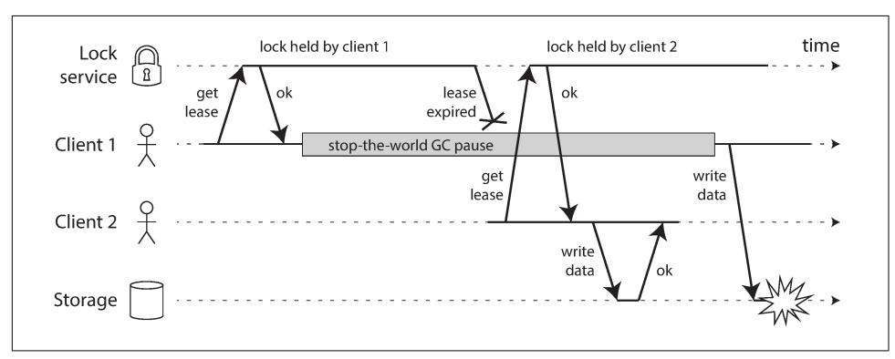

*Figure 8-4. Incorrect implementation of a distributed lock: client 1 believes that it still has a valid lease, even though it has expired, and thus corrupts a file in storage.*

The problem is an example of what we discussed in ["Process Pauses" on page 295:](#page-316-0) if the client holding the lease is paused for too long, its lease expires. Another client can obtain a lease for the same file, and start writing to the file. When the paused client comes back, it believes (incorrectly) that it still has a valid lease and proceeds to also write to the file. As a result, the clients' writes clash and corrupt the file.

## <span id="page-324-0"></span>**Fencing tokens**

When using a lock or lease to protect access to some resource, such as the file storage in [Figure 8-4,](#page-323-0) we need to ensure that a node that is under a false belief of being "the chosen one" cannot disrupt the rest of the system. A fairly simple technique that ach‐ ieves this goal is called *fencing*, and is illustrated in Figure 8-5.

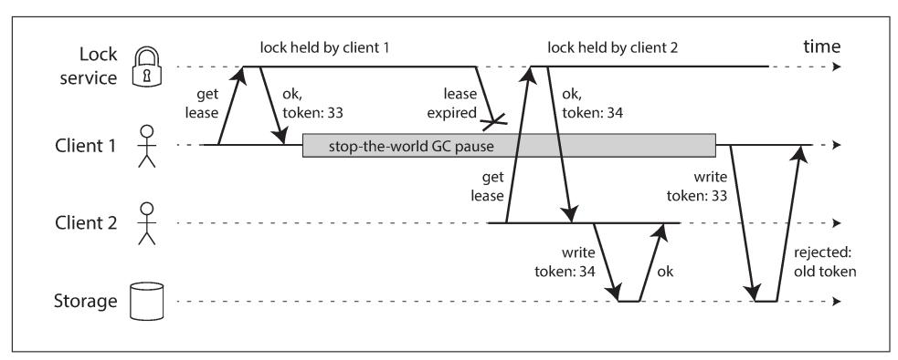

*Figure 8-5. Making access to storage safe by allowing writes only in the order of increas‐ ing fencing tokens.*

Let's assume that every time the lock server grants a lock or lease, it also returns a *fencing token*, which is a number that increases every time a lock is granted (e.g., incremented by the lock service). We can then require that every time a client sends a write request to the storage service, it must include its current fencing token.

In Figure 8-5, client 1 acquires the lease with a token of 33, but then it goes into a long pause and the lease expires. Client 2 acquires the lease with a token of 34 (the number always increases) and then sends its write request to the storage service, including the token of 34. Later, client 1 comes back to life and sends its write to the storage service, including its token value 33. However, the storage server remembers that it has already processed a write with a higher token number (34), and so it rejects the request with token 33.

If ZooKeeper is used as lock service, the transaction ID zxid or the node version cversion can be used as fencing token. Since they are guaranteed to be monotoni‐ cally increasing, they have the required properties [\[74](#page-338-0)].

Note that this mechanism requires the resource itself to take an active role in check‐ ing tokens by rejecting any writes with an older token than one that has already been processed—it is not sufficient to rely on clients checking their lock status themselves. For resources that do not explicitly support fencing tokens, you might still be able work around the limitation (for example, in the case of a file storage service you could include the fencing token in the filename). However, some kind of check is necessary to avoid processing requests outside of the lock's protection.

<span id="page-325-0"></span>Checking a token on the server side may seem like a downside, but it is arguably a good thing: it is unwise for a service to assume that its clients will always be well behaved, because the clients are often run by people whose priorities are very differ‐ ent from the priorities of the people running the service [\[76](#page-338-0)]. Thus, it is a good idea for any service to protect itself from accidentally abusive clients.

## **Byzantine Faults**

Fencing tokens can detect and block a node that is *inadvertently* acting in error (e.g., because it hasn't yet found out that its lease has expired). However, if the node delib‐ erately wanted to subvert the system's guarantees, it could easily do so by sending messages with a fake fencing token.

In this book we assume that nodes are unreliable but honest: they may be slow or never respond (due to a fault), and their state may be outdated (due to a GC pause or network delays), but we assume that if a node *does* respond, it is telling the "truth": to the best of its knowledge, it is playing by the rules of the protocol.

Distributed systems problems become much harder if there is a risk that nodes may "lie" (send arbitrary faulty or corrupted responses)—for example, if a node may claim to have received a particular message when in fact it didn't. Such behavior is known as a *Byzantine fault*, and the problem of reaching consensus in this untrusting envi‐ ronment is known as the *Byzantine Generals Problem* [\[77](#page-338-0)].

## **The Byzantine Generals Problem**

The Byzantine Generals Problem is a generalization of the so-called *Two Generals Problem* [[78](#page-338-0)], which imagines a situation in which two army generals need to agree on a battle plan. As they have set up camp on two different sites, they can only com‐ municate by messenger, and the messengers sometimes get delayed or lost (like pack‐ ets in a network). We will discuss this problem of *consensus* in [Chapter 9.](#page-342-0)

In the Byzantine version of the problem, there are *n* generals who need to agree, and their endeavor is hampered by the fact that there are some traitors in their midst. Most of the generals are loyal, and thus send truthful messages, but the traitors may try to deceive and confuse the others by sending fake or untrue messages (while try‐ ing to remain undiscovered). It is not known in advance who the traitors are.

Byzantium was an ancient Greek city that later became Constantinople, in the place which is now Istanbul in Turkey. There isn't any historic evidence that the generals of Byzantium were any more prone to intrigue and conspiracy than those elsewhere. Rather, the name is derived from *Byzantine* in the sense of *excessively complicated, bureaucratic, devious*, which was used in politics long before computers [[79](#page-338-0)]. Lamp‐ ort wanted to choose a nationality that would not offend any readers, and he was advised that calling it *The Albanian Generals Problem* was not such a good idea [[80](#page-338-0)].

<span id="page-326-0"></span>A system is *Byzantine fault-tolerant* if it continues to operate correctly even if some of the nodes are malfunctioning and not obeying the protocol, or if malicious attack‐ ers are interfering with the network. This concern is relevant in certain specific cir‐ cumstances. For example:

- In aerospace environments, the data in a computer's memory or CPU register could become corrupted by radiation, leading it to respond to other nodes in arbitrarily unpredictable ways. Since a system failure would be very expensive (e.g., an aircraft crashing and killing everyone on board, or a rocket colliding with the International Space Station), flight control systems must tolerate Byzan‐ tine faults [[81, 82\]](#page-338-0).
- In a system with multiple participating organizations, some participants may attempt to cheat or defraud others. In such circumstances, it is not safe for a node to simply trust another node's messages, since they may be sent with mali‐ cious intent. For example, peer-to-peer networks like Bitcoin and other block‐ chains can be considered to be a way of getting mutually untrusting parties to agree whether a transaction happened or not, without relying on a central authority [\[83](#page-338-0)].

However, in the kinds of systems we discuss in this book, we can usually safely assume that there are no Byzantine faults. In your datacenter, all the nodes are con‐ trolled by your organization (so they can hopefully be trusted) and radiation levels are low enough that memory corruption is not a major problem. Protocols for mak‐ ing systems Byzantine fault-tolerant are quite complicated [\[84\]](#page-338-0), and fault-tolerant embedded systems rely on support from the hardware level [\[81](#page-338-0)]. In most server-side data systems, the cost of deploying Byzantine fault-tolerant solutions makes them impractical.

Web applications do need to expect arbitrary and malicious behavior of clients that are under end-user control, such as web browsers. This is why input validation, sani‐ tization, and output escaping are so important: to prevent SQL injection and crosssite scripting, for example. However, we typically don't use Byzantine fault-tolerant protocols here, but simply make the server the authority on deciding what client behavior is and isn't allowed. In peer-to-peer networks, where there is no such cen‐ tral authority, Byzantine fault tolerance is more relevant.

A bug in the software could be regarded as a Byzantine fault, but if you deploy the same software to all nodes, then a Byzantine fault-tolerant algorithm cannot save you. Most Byzantine fault-tolerant algorithms require a supermajority of more than twothirds of the nodes to be functioning correctly (i.e., if you have four nodes, at most one may malfunction). To use this approach against bugs, you would have to have four independent implementations of the same software and hope that a bug only appears in one of the four implementations.

<span id="page-327-0"></span>Similarly, it would be appealing if a protocol could protect us from vulnerabilities, security compromises, and malicious attacks. Unfortunately, this is not realistic either: in most systems, if an attacker can compromise one node, they can probably compromise all of them, because they are probably running the same software. Thus, traditional mechanisms (authentication, access control, encryption, firewalls, and so on) continue to be the main protection against attackers.

## **Weak forms of lying**

Although we assume that nodes are generally honest, it can be worth adding mecha‐ nisms to software that guard against weak forms of "lying"—for example, invalid messages due to hardware issues, software bugs, and misconfiguration. Such protec‐ tion mechanisms are not full-blown Byzantine fault tolerance, as they would not withstand a determined adversary, but they are nevertheless simple and pragmatic steps toward better reliability. For example:

- Network packets do sometimes get corrupted due to hardware issues or bugs in operating systems, drivers, routers, etc. Usually, corrupted packets are caught by the checksums built into TCP and UDP, but sometimes they evade detection [[85,](#page-338-0) [86](#page-339-0), [87](#page-339-0)]. Simple measures are usually sufficient protection against such corrup‐ tion, such as checksums in the application-level protocol.
- A publicly accessible application must carefully sanitize any inputs from users, for example checking that a value is within a reasonable range and limiting the size of strings to prevent denial of service through large memory allocations. An internal service behind a firewall may be able to get away with less strict checks on inputs, but some basic sanity-checking of values (e.g., in protocol parsing [[85\]](#page-338-0)) is a good idea.
- NTP clients can be configured with multiple server addresses. When synchroniz‐ ing, the client contacts all of them, estimates their errors, and checks that a majority of servers agree on some time range. As long as most of the servers are okay, a misconfigured NTP server that is reporting an incorrect time is detected as an outlier and is excluded from synchronization [\[37](#page-335-0)]. The use of multiple servers makes NTP more robust than if it only uses a single server.

## **System Model and Reality**

Many algorithms have been designed to solve distributed systems problems—for example, we will examine solutions for the consensus problem in [Chapter 9.](#page-342-0) In order to be useful, these algorithms need to tolerate the various faults of distributed systems that we discussed in this chapter.

Algorithms need to be written in a way that does not depend too heavily on the details of the hardware and software configuration on which they are run. This in <span id="page-328-0"></span>turn requires that we somehow formalize the kinds of faults that we expect to happen in a system. We do this by defining a *system model*, which is an abstraction that describes what things an algorithm may assume.

With regard to timing assumptions, three system models are in common use:

## *Synchronous model*

The synchronous model assumes bounded network delay, bounded process pau‐ ses, and bounded clock error. This does not imply exactly synchronized clocks or zero network delay; it just means you know that network delay, pauses, and clock drift will never exceed some fixed upper bound [[88\]](#page-339-0). The synchronous model is not a realistic model of most practical systems, because (as discussed in this chapter) unbounded delays and pauses do occur.

## *Partially synchronous model*

Partial synchrony means that a system behaves like a synchronous system *most of the time*, but it sometimes exceeds the bounds for network delay, process pauses, and clock drift [\[88](#page-339-0)]. This is a realistic model of many systems: most of the time, networks and processes are quite well behaved—otherwise we would never be able to get anything done—but we have to reckon with the fact that any timing assumptions may be shattered occasionally. When this happens, network delay, pauses, and clock error may become arbitrarily large.

## *Asynchronous model*

In this model, an algorithm is not allowed to make any timing assumptions—in fact, it does not even have a clock (so it cannot use timeouts). Some algorithms can be designed for the asynchronous model, but it is very restrictive.

Moreover, besides timing issues, we have to consider node failures. The three most common system models for nodes are:

## *Crash-stop faults*

In the crash-stop model, an algorithm may assume that a node can fail in only one way, namely by crashing. This means that the node may suddenly stop responding at any moment, and thereafter that node is gone forever—it never comes back.

## *Crash-recovery faults*

We assume that nodes may crash at any moment, and perhaps start responding again after some unknown time. In the crash-recovery model, nodes are assumed to have stable storage (i.e., nonvolatile disk storage) that is preserved across crashes, while the in-memory state is assumed to be lost.

## *Byzantine (arbitrary) faults*

Nodes may do absolutely anything, including trying to trick and deceive other nodes, as described in the last section.

<span id="page-329-0"></span>For modeling real systems, the partially synchronous model with crash-recovery faults is generally the most useful model. But how do distributed algorithms cope with that model?

#### **Correctness of an algorithm**

To define what it means for an algorithm to be *correct*, we can describe its *properties*. For example, the output of a sorting algorithm has the property that for any two dis‐ tinct elements of the output list, the element further to the left is smaller than the ele‐ ment further to the right. That is simply a formal way of defining what it means for a list to be sorted.

Similarly, we can write down the properties we want of a distributed algorithm to define what it means to be correct. For example, if we are generating fencing tokens for a lock (see ["Fencing tokens" on page 303](#page-324-0)), we may require the algorithm to have the following properties:

#### *Uniqueness*

No two requests for a fencing token return the same value.

#### *Monotonic sequence*

If request *x* returned token *t<sup>x</sup>* , and request *y* returned token *t<sup>y</sup>* , and *x* completed before *y* began, then *t<sup>x</sup>* < *t<sup>y</sup>* .

## *Availability*

A node that requests a fencing token and does not crash eventually receives a response.

An algorithm is correct in some system model if it always satisfies its properties in all situations that we assume may occur in that system model. But how does this make sense? If all nodes crash, or all network delays suddenly become infinitely long, then no algorithm will be able to get anything done.

## **Safety and liveness**

To clarify the situation, it is worth distinguishing between two different kinds of properties: *safety* and *liveness* properties. In the example just given, *uniqueness* and *monotonic sequence* are safety properties, but *availability* is a liveness property.

What distinguishes the two kinds of properties? A giveaway is that liveness properties often include the word "eventually" in their definition. (And yes, you guessed it *eventual consistency* is a liveness property [[89](#page-339-0)].)

Safety is often informally defined as *nothing bad happens*, and liveness as *something good eventually happens*. However, it's best to not read too much into those informal definitions, because the meaning of good and bad is subjective. The actual definitions of safety and liveness are precise and mathematical [[90\]](#page-339-0):

- <span id="page-330-0"></span>• If a safety property is violated, we can point at a particular point in time at which it was broken (for example, if the uniqueness property was violated, we can iden‐ tify the particular operation in which a duplicate fencing token was returned). After a safety property has been violated, the violation cannot be undone—the damage is already done.
- A liveness property works the other way round: it may not hold at some point in time (for example, a node may have sent a request but not yet received a response), but there is always hope that it may be satisfied in the future (namely by receiving a response).

An advantage of distinguishing between safety and liveness properties is that it helps us deal with difficult system models. For distributed algorithms, it is common to require that safety properties *always* hold, in all possible situations of a system model [[88\]](#page-339-0). That is, even if all nodes crash, or the entire network fails, the algorithm must nevertheless ensure that it does not return a wrong result (i.e., that the safety proper‐ ties remain satisfied).

However, with liveness properties we are allowed to make caveats: for example, we could say that a request needs to receive a response only if a majority of nodes have not crashed, and only if the network eventually recovers from an outage. The defini‐ tion of the partially synchronous model requires that eventually the system returns to a synchronous state—that is, any period of network interruption lasts only for a finite duration and is then repaired.

## **Mapping system models to the real world**

Safety and liveness properties and system models are very useful for reasoning about the correctness of a distributed algorithm. However, when implementing an algo‐ rithm in practice, the messy facts of reality come back to bite you again, and it becomes clear that the system model is a simplified abstraction of reality.

For example, algorithms in the crash-recovery model generally assume that data in stable storage survives crashes. However, what happens if the data on disk is corrup‐ ted, or the data is wiped out due to hardware error or misconfiguration [\[91\]](#page-339-0)? What happens if a server has a firmware bug and fails to recognize its hard drives on reboot, even though the drives are correctly attached to the server [\[92](#page-339-0)]?

Quorum algorithms (see ["Quorums for reading and writing" on page 179](#page-200-0)) rely on a node remembering the data that it claims to have stored. If a node may suffer from amnesia and forget previously stored data, that breaks the quorum condition, and thus breaks the correctness of the algorithm. Perhaps a new system model is needed, in which we assume that stable storage mostly survives crashes, but may sometimes be lost. But that model then becomes harder to reason about.

<span id="page-331-0"></span>The theoretical description of an algorithm can declare that certain things are simply assumed not to happen—and in non-Byzantine systems, we do have to make some assumptions about faults that can and cannot happen. However, a real implementa‐ tion may still have to include code to handle the case where something happens that was assumed to be impossible, even if that handling boils down to printf("Sucks to be you") and exit(666)—i.e., letting a human operator clean up the mess [[93\]](#page-339-0). (This is arguably the difference between computer science and software engineering.)

That is not to say that theoretical, abstract system models are worthless—quite the opposite. They are incredibly helpful for distilling down the complexity of real sys‐ tems to a manageable set of faults that we can reason about, so that we can under‐ stand the problem and try to solve it systematically. We can prove algorithms correct by showing that their properties always hold in some system model.

Proving an algorithm correct does not mean its *implementation* on a real system will necessarily always behave correctly. But it's a very good first step, because the theo‐ retical analysis can uncover problems in an algorithm that might remain hidden for a long time in a real system, and that only come to bite you when your assumptions (e.g., about timing) are defeated due to unusual circumstances. Theoretical analysis and empirical testing are equally important.

## **Summary**

In this chapter we have discussed a wide range of problems that can occur in dis‐ tributed systems, including:

- Whenever you try to send a packet over the network, it may be lost or arbitrarily delayed. Likewise, the reply may be lost or delayed, so if you don't get a reply, you have no idea whether the message got through.
- A node's clock may be significantly out of sync with other nodes (despite your best efforts to set up NTP), it may suddenly jump forward or back in time, and relying on it is dangerous because you most likely don't have a good measure of your clock's error interval.
- A process may pause for a substantial amount of time at any point in its execu‐ tion (perhaps due to a stop-the-world garbage collector), be declared dead by other nodes, and then come back to life again without realizing that it was paused.

The fact that such *partial failures* can occur is the defining characteristic of dis‐ tributed systems. Whenever software tries to do anything involving other nodes, there is the possibility that it may occasionally fail, or randomly go slow, or not respond at all (and eventually time out). In distributed systems, we try to build toler‐ <span id="page-332-0"></span>ance of partial failures into software, so that the system as a whole may continue functioning even when some of its constituent parts are broken.

To tolerate faults, the first step is to *detect* them, but even that is hard. Most systems don't have an accurate mechanism of detecting whether a node has failed, so most distributed algorithms rely on timeouts to determine whether a remote node is still available. However, timeouts can't distinguish between network and node failures, and variable network delay sometimes causes a node to be falsely suspected of crash‐ ing. Moreover, sometimes a node can be in a degraded state: for example, a Gigabit network interface could suddenly drop to 1 Kb/s throughput due to a driver bug [[94\]](#page-339-0). Such a node that is "limping" but not dead can be even more difficult to deal with than a cleanly failed node.

Once a fault is detected, making a system tolerate it is not easy either: there is no global variable, no shared memory, no common knowledge or any other kind of shared state between the machines. Nodes can't even agree on what time it is, let alone on anything more profound. The only way information can flow from one node to another is by sending it over the unreliable network. Major decisions cannot be safely made by a single node, so we require protocols that enlist help from other nodes and try to get a quorum to agree.

If you're used to writing software in the idealized mathematical perfection of a single computer, where the same operation always deterministically returns the same result, then moving to the messy physical reality of distributed systems can be a bit of a shock. Conversely, distributed systems engineers will often regard a problem as triv‐ ial if it can be solved on a single computer [[5\]](#page-333-0), and indeed a single computer can do a lot nowadays [\[95](#page-339-0)]. If you can avoid opening Pandora's box and simply keep things on a single machine, it is generally worth doing so.

However, as discussed in the introduction to [Part II](#page-166-0), scalability is not the only reason for wanting to use a distributed system. Fault tolerance and low latency (by placing data geographically close to users) are equally important goals, and those things can‐ not be achieved with a single node.

In this chapter we also went on some tangents to explore whether the unreliability of networks, clocks, and processes is an inevitable law of nature. We saw that it isn't: it is possible to give hard real-time response guarantees and bounded delays in net‐ works, but doing so is very expensive and results in lower utilization of hardware resources. Most non-safety-critical systems choose cheap and unreliable over expen‐ sive and reliable.

We also touched on supercomputers, which assume reliable components and thus have to be stopped and restarted entirely when a component does fail. By contrast, distributed systems can run forever without being interrupted at the service level, because all faults and maintenance can be handled at the node level—at least in <span id="page-333-0"></span>theory. (In practice, if a bad configuration change is rolled out to all nodes, that will still bring a distributed system to its knees.)

This chapter has been all about problems, and has given us a bleak outlook. In the next chapter we will move on to solutions, and discuss some algorithms that have been designed to cope with all the problems in distributed systems.

## **References**

- [[1\]](#page-294-0) Mark Cavage: ["There's Just No Getting Around It: You're Building a Distributed](http://queue.acm.org/detail.cfm?id=2482856) [System,](http://queue.acm.org/detail.cfm?id=2482856)" *ACM Queue*, volume 11, number 4, pages 80-89, April 2013. [doi:](http://dx.doi.org/10.1145/2466486.2482856) [10.1145/2466486.2482856](http://dx.doi.org/10.1145/2466486.2482856)
- [[2\]](#page-294-0) Jay Kreps: "[Getting Real About Distributed System Reliability,](http://blog.empathybox.com/post/19574936361/getting-real-about-distributed-system-reliability)" *blog.empathy‐ box.com*, March 19, 2012.
- [[3\]](#page-295-0) Sydney Padua: *The Thrilling Adventures of Lovelace and Babbage: The (Mostly) True Story of the First Computer*. Particular Books, April 2015. ISBN: 978-0-141-98151-2
- [[4\]](#page-295-0) Coda Hale: "[You Can't Sacrifice Partition Tolerance,](http://codahale.com/you-cant-sacrifice-partition-tolerance/)" *codahale.com*, October 7, 2010.
- [[5\]](#page-296-0) Jeff Hodges: ["Notes on Distributed Systems for Young Bloods](http://www.somethingsimilar.com/2013/01/14/notes-on-distributed-systems-for-young-bloods/)," *somethingsimi‐ lar.com*, January 14, 2013.
- [[6\]](#page-296-0) Antonio Regalado: "[Who Coined 'Cloud Computing'?,](http://www.technologyreview.com/news/425970/who-coined-cloud-computing/)" *technologyreview.com*, October 31, 2011.
- [[7\]](#page-296-0) Luiz André Barroso, Jimmy Clidaras, and Urs Hölzle: "[The Datacenter as a Com‐](http://www.morganclaypool.com/doi/abs/10.2200/S00516ED2V01Y201306CAC024) [puter: An Introduction to the Design of Warehouse-Scale Machines, Second Edi‐](http://www.morganclaypool.com/doi/abs/10.2200/S00516ED2V01Y201306CAC024) [tion](http://www.morganclaypool.com/doi/abs/10.2200/S00516ED2V01Y201306CAC024)," *Synthesis Lectures on Computer Architecture*, volume 8, number 3, Morgan & Claypool Publishers, July 2013. [doi:10.2200/S00516ED2V01Y201306CAC024](http://dx.doi.org/10.2200/S00516ED2V01Y201306CAC024), ISBN: 978-1-627-05010-4
- [[8\]](#page-296-0) David Fiala, Frank Mueller, Christian Engelmann, et al.: "[Detection and Correc‐](http://moss.csc.ncsu.edu/~mueller/ftp/pub/mueller/papers/sc12.pdf) [tion of Silent Data Corruption for Large-Scale High-Performance Computing](http://moss.csc.ncsu.edu/~mueller/ftp/pub/mueller/papers/sc12.pdf)," at *International Conference for High Performance Computing, Networking, Storage and Analysis* (SC12), November 2012.
- [[9\]](#page-297-0) Arjun Singh, Joon Ong, Amit Agarwal, et al.: ["Jupiter Rising: A Decade of Clos](http://conferences.sigcomm.org/sigcomm/2015/pdf/papers/p183.pdf) [Topologies and Centralized Control in Google's Datacenter Network,](http://conferences.sigcomm.org/sigcomm/2015/pdf/papers/p183.pdf)" at *Annual Conference of the ACM Special Interest Group on Data Communication* (SIGCOMM), August 2015. [doi:10.1145/2785956.2787508](http://dx.doi.org/10.1145/2785956.2787508)
- [[10\]](#page-297-0) Glenn K. Lockwood: "[Hadoop's Uncomfortable Fit in HPC,](http://glennklockwood.blogspot.co.uk/2014/05/hadoops-uncomfortable-fit-in-hpc.html)" *glennklock‐ wood.blogspot.co.uk*, May 16, 2014.

- <span id="page-334-0"></span>[[11\]](#page-298-0) John von Neumann: "[Probabilistic Logics and the Synthesis of Reliable Organ‐](https://ece.uwaterloo.ca/~ssundara/courses/prob_logics.pdf) [isms from Unreliable Components,](https://ece.uwaterloo.ca/~ssundara/courses/prob_logics.pdf)" in *Automata Studies (AM-34)*, edited by Claude E. Shannon and John McCarthy, Princeton University Press, 1956. ISBN: 978-0-691-07916-5
- [[12\]](#page-298-0) Richard W. Hamming: *The Art of Doing Science and Engineering*. Taylor & Fran‐ cis, 1997. ISBN: 978-9-056-99500-3
- [[13\]](#page-298-0) Claude E. Shannon: ["A Mathematical Theory of Communication,](http://cs.brynmawr.edu/Courses/cs380/fall2012/shannon1948.pdf)" *The Bell Sys‐ tem Technical Journal*, volume 27, number 3, pages 379–423 and 623–656, July 1948.
- [[14\]](#page-300-0) Peter Bailis and Kyle Kingsbury: "[The Network Is Reliable,](https://queue.acm.org/detail.cfm?id=2655736)" *ACM Queue*, vol‐ ume 12, number 7, pages 48-55, July 2014. [doi:10.1145/2639988.2639988](http://dx.doi.org/10.1145/2639988.2639988)
- [[15\]](#page-300-0) Joshua B. Leners, Trinabh Gupta, Marcos K. Aguilera, and Michael Walfish: ["Taming Uncertainty in Distributed Systems with Help from the Network](http://www.cs.nyu.edu/~mwalfish/papers/albatross-eurosys15.pdf)," at *10th European Conference on Computer Systems* (EuroSys), April 2015. [doi:](http://dx.doi.org/10.1145/2741948.2741976) [10.1145/2741948.2741976](http://dx.doi.org/10.1145/2741948.2741976)
- [[16\]](#page-300-0) Phillipa Gill, Navendu Jain, and Nachiappan Nagappan: ["Understanding Net‐](http://conferences.sigcomm.org/sigcomm/2011/papers/sigcomm/p350.pdf) [work Failures in Data Centers: Measurement, Analysis, and Implications](http://conferences.sigcomm.org/sigcomm/2011/papers/sigcomm/p350.pdf)," at *ACM SIGCOMM Conference*, August 2011. [doi:10.1145/2018436.2018477](http://dx.doi.org/10.1145/2018436.2018477)
- [[17\]](#page-300-0) Mark Imbriaco: "[Downtime Last Saturday](https://github.com/blog/1364-downtime-last-saturday)," *github.com*, December 26, 2012.
- [[18\]](#page-300-0) Will Oremus: ["The Global Internet Is Being Attacked by Sharks, Google Con‐](http://www.slate.com/blogs/future_tense/2014/08/15/shark_attacks_threaten_google_s_undersea_internet_cables_video.html) [firms](http://www.slate.com/blogs/future_tense/2014/08/15/shark_attacks_threaten_google_s_undersea_internet_cables_video.html)," *slate.com*, August 15, 2014.
- [[19\]](#page-300-0) Marc A. Donges: "[Re: bnx2 cards Intermittantly Going Offline](http://www.spinics.net/lists/netdev/msg210485.html)," Message to Linux *netdev* mailing list, *spinics.net*, September 13, 2012.
- [[20\]](#page-301-0) Kyle Kingsbury: ["Call Me Maybe: Elasticsearch](https://aphyr.com/posts/317-call-me-maybe-elasticsearch)," *aphyr.com*, June 15, 2014.
- [[21\]](#page-301-0) Salvatore Sanfilippo: ["A Few Arguments About Redis Sentinel Properties and](http://antirez.com/news/80) [Fail Scenarios](http://antirez.com/news/80)," *antirez.com*, October 21, 2014.
- [[22\]](#page-301-0) Bert Hubert: "[The Ultimate SO\\_LINGER Page, or: Why Is My TCP Not Relia‐](http://blog.netherlabs.nl/articles/2009/01/18/the-ultimate-so_linger-page-or-why-is-my-tcp-not-reliable) [ble](http://blog.netherlabs.nl/articles/2009/01/18/the-ultimate-so_linger-page-or-why-is-my-tcp-not-reliable)," *blog.netherlabs.nl*, January 18, 2009.
- [[23\]](#page-301-0) Nicolas Liochon: "[CAP: If All You Have Is a Timeout, Everything Looks Like a](http://blog.thislongrun.com/2015/05/CAP-theorem-partition-timeout-zookeeper.html) [Partition,](http://blog.thislongrun.com/2015/05/CAP-theorem-partition-timeout-zookeeper.html)" *blog.thislongrun.com*, May 25, 2015.
- [[24\]](#page-302-0) Jerome H. Saltzer, David P. Reed, and David D. Clark: ["End-To-End Arguments](http://www.ece.drexel.edu/courses/ECE-C631-501/SalRee1984.pdf) [in System Design,](http://www.ece.drexel.edu/courses/ECE-C631-501/SalRee1984.pdf)" *ACM Transactions on Computer Systems*, volume 2, number 4, pages 277–288, November 1984. [doi:10.1145/357401.357402](http://dx.doi.org/10.1145/357401.357402)
- [[25\]](#page-303-0) Matthew P. Grosvenor, Malte Schwarzkopf, Ionel Gog, et al.: "[Queues Don't](https://www.usenix.org/system/files/conference/nsdi15/nsdi15-paper-grosvenor_update.pdf) [Matter When You Can JUMP Them!,](https://www.usenix.org/system/files/conference/nsdi15/nsdi15-paper-grosvenor_update.pdf)" at *12th USENIX Symposium on Networked Systems Design and Implementation* (NSDI), May 2015.

- <span id="page-335-0"></span>[[26\]](#page-303-0) Guohui Wang and T. S. Eugene Ng: ["The Impact of Virtualization on Network](http://www.cs.rice.edu/~eugeneng/papers/INFOCOM10-ec2.pdf) [Performance of Amazon EC2 Data Center](http://www.cs.rice.edu/~eugeneng/papers/INFOCOM10-ec2.pdf)," at *29th IEEE International Conference on Computer Communications* (INFOCOM), March 2010. [doi:10.1109/INFCOM.](http://dx.doi.org/10.1109/INFCOM.2010.5461931) [2010.5461931](http://dx.doi.org/10.1109/INFCOM.2010.5461931)
- [[27\]](#page-304-0) Van Jacobson: ["Congestion Avoidance and Control](http://www.cs.usask.ca/ftp/pub/discus/seminars2002-2003/p314-jacobson.pdf)," at *ACM Symposium on Communications Architectures and Protocols* (SIGCOMM), August 1988. [doi:](http://dx.doi.org/10.1145/52324.52356) [10.1145/52324.52356](http://dx.doi.org/10.1145/52324.52356)
- [[28\]](#page-305-0) Brandon Philips: ["etcd: Distributed Locking and Service Discovery,](https://www.youtube.com/watch?v=HJIjTTHWYnE)" at *Strange Loop*, September 2014.
- [[29\]](#page-305-0) Steve Newman: "[A Systematic Look at EC2 I/O](http://blog.scalyr.com/2012/10/a-systematic-look-at-ec2-io/)," *blog.scalyr.com*, October 16, 2012.
- [[30\]](#page-305-0) Naohiro Hayashibara, Xavier Défago, Rami Yared, and Takuya Katayama: ["The](http://hdl.handle.net/10119/4784) [ϕ Accrual Failure Detector,](http://hdl.handle.net/10119/4784)" Japan Advanced Institute of Science and Technology, School of Information Science, Technical Report IS-RR-2004-010, May 2004.
- [[31\]](#page-305-0) Jeffrey Wang: ["Phi Accrual Failure Detector](http://ternarysearch.blogspot.co.uk/2013/08/phi-accrual-failure-detector.html)," *ternarysearch.blogspot.co.uk*, August 11, 2013.
- [[32\]](#page-305-0) Srinivasan Keshav: *An Engineering Approach to Computer Networking: ATM Networks, the Internet, and the Telephone Network*. Addison-Wesley Professional, May 1997. ISBN: 978-0-201-63442-6
- [[33\]](#page-305-0) Cisco, ["Integrated Services Digital Network](http://docwiki.cisco.com/wiki/Integrated_Services_Digital_Network)," *docwiki.cisco.com*.
- [[34\]](#page-305-0) Othmar Kyas: *ATM Networks*. International Thomson Publishing, 1995. ISBN: 978-1-850-32128-6
- [[35\]](#page-306-0) "[InfiniBand FAQ,](http://www.mellanox.com/related-docs/whitepapers/InfiniBandFAQ_FQ_100.pdf)" Mellanox Technologies, December 22, 2014.
- [[36\]](#page-307-0) Jose Renato Santos, Yoshio Turner, and G. (John) Janakiraman: ["End-to-End](http://www.hpl.hp.com/techreports/2002/HPL-2002-359.pdf) [Congestion Control for InfiniBand](http://www.hpl.hp.com/techreports/2002/HPL-2002-359.pdf)," at *22nd Annual Joint Conference of the IEEE Computer and Communications Societies* (INFOCOM), April 2003. Also published by HP Laboratories Palo Alto, Tech Report HPL-2002-359. [doi:10.1109/INFCOM.](http://dx.doi.org/10.1109/INFCOM.2003.1208949) [2003.1208949](http://dx.doi.org/10.1109/INFCOM.2003.1208949)
- [[37\]](#page-309-0) Ulrich Windl, David Dalton, Marc Martinec, and Dale R. Worley: ["The NTP](http://www.ntp.org/ntpfaq/NTP-a-faq.htm) [FAQ and HOWTO,](http://www.ntp.org/ntpfaq/NTP-a-faq.htm)" *ntp.org*, November 2006.
- [[38\]](#page-309-0) John Graham-Cumming: "[How and why the leap second affected Cloudflare](https://blog.cloudflare.com/how-and-why-the-leap-second-affected-cloudflare-dns/) [DNS](https://blog.cloudflare.com/how-and-why-the-leap-second-affected-cloudflare-dns/)," *blog.cloudflare.com*, January 1, 2017.
- [[39\]](#page-309-0) David Holmes: ["Inside the Hotspot VM: Clocks, Timers and Scheduling Events](https://blogs.oracle.com/dholmes/entry/inside_the_hotspot_vm_clocks) [– Part I – Windows](https://blogs.oracle.com/dholmes/entry/inside_the_hotspot_vm_clocks)," *blogs.oracle.com*, October 2, 2006.
- [[40\]](#page-310-0) Steve Loughran: ["Time on Multi-Core, Multi-Socket Servers,](http://steveloughran.blogspot.co.uk/2015/09/time-on-multi-core-multi-socket-servers.html)" *stevelough‐ ran.blogspot.co.uk*, September 17, 2015.

- <span id="page-336-0"></span>[[41\]](#page-310-0) James C. Corbett, Jeffrey Dean, Michael Epstein, et al.: ["Spanner: Google's](http://research.google.com/archive/spanner.html) [Globally-Distributed Database,](http://research.google.com/archive/spanner.html)" at *10th USENIX Symposium on Operating System Design and Implementation* (OSDI), October 2012.
- [[42\]](#page-311-0) M. Caporaloni and R. Ambrosini: "[How Closely Can a Personal Computer](https://iopscience.iop.org/0143-0807/23/4/103/) [Clock Track the UTC Timescale Via the Internet?,](https://iopscience.iop.org/0143-0807/23/4/103/)" *European Journal of Physics*, vol‐ ume 23, number 4, pages L17–L21, June 2012. [doi:10.1088/0143-0807/23/4/103](http://dx.doi.org/10.1088/0143-0807/23/4/103)
- [[43\]](#page-311-0) Nelson Minar: ["A Survey of the NTP Network,](http://alumni.media.mit.edu/~nelson/research/ntp-survey99/)" *alumni.media.mit.edu*, Decem‐ ber 1999.
- [[44\]](#page-311-0) Viliam Holub: ["Synchronizing Clocks in a Cassandra Cluster Pt. 1 The Prob‐](https://blog.logentries.com/2014/03/synchronizing-clocks-in-a-cassandra-cluster-pt-1-the-problem/) [lem,](https://blog.logentries.com/2014/03/synchronizing-clocks-in-a-cassandra-cluster-pt-1-the-problem/)" *blog.logentries.com*, March 14, 2014.
- [[45\]](#page-311-0) Poul-Henning Kamp: "[The One-Second War \(What Time Will You Die?\)](http://queue.acm.org/detail.cfm?id=1967009)," *ACM Queue*, volume 9, number 4, pages 44–48, April 2011. [doi:](http://dx.doi.org/10.1145/1966989.1967009) [10.1145/1966989.1967009](http://dx.doi.org/10.1145/1966989.1967009)
- [[46\]](#page-311-0) Nelson Minar: "[Leap Second Crashes Half the Internet](http://www.somebits.com/weblog/tech/bad/leap-second-2012.html)," *somebits.com*, July 3, 2012.
- [[47\]](#page-311-0) Christopher Pascoe: ["Time, Technology and Leaping Seconds,](http://googleblog.blogspot.co.uk/2011/09/time-technology-and-leaping-seconds.html)" *googleblog.blog‐ spot.co.uk*, September 15, 2011.
- [[48\]](#page-311-0) Mingxue Zhao and Jeff Barr: "[Look Before You Leap The Coming Leap Second](https://aws.amazon.com/blogs/aws/look-before-you-leap-the-coming-leap-second-and-aws/) [and AWS,](https://aws.amazon.com/blogs/aws/look-before-you-leap-the-coming-leap-second-and-aws/)" *aws.amazon.com*, May 18, 2015.
- [[49\]](#page-311-0) Darryl Veitch and Kanthaiah Vijayalayan: "[Network Timing and the 2015 Leap](http://crin.eng.uts.edu.au/~darryl/Publications/LeapSecond_camera.pdf) [Second,](http://crin.eng.uts.edu.au/~darryl/Publications/LeapSecond_camera.pdf)" at *17th International Conference on Passive and Active Measurement* (PAM), April 2016. [doi:10.1007/978-3-319-30505-9\\_29](http://dx.doi.org/10.1007/978-3-319-30505-9_29)
- [[50\]](#page-311-0) "[Timekeeping in VMware Virtual Machines,](http://www.vmware.com/resources/techresources/238)" Information Guide, VMware, Inc., December 2011.
- [[51\]](#page-311-0) "[MiFID II / MiFIR: Regulatory Technical and Implementing Standards Annex](https://www.esma.europa.eu/sites/default/files/library/2015/11/2015-esma-1464_annex_i_-_draft_rts_and_its_on_mifid_ii_and_mifir.pdf) [I \(Draft\)](https://www.esma.europa.eu/sites/default/files/library/2015/11/2015-esma-1464_annex_i_-_draft_rts_and_its_on_mifid_ii_and_mifir.pdf)," European Securities and Markets Authority, Report ESMA/2015/1464, September 2015.
- [[52\]](#page-311-0) Luke Bigum: ["Solving MiFID II Clock Synchronisation With Minimum Spend](https://www.lmax.com/blog/staff-blogs/2015/11/27/solving-mifid-ii-clock-synchronisation-minimum-spend-part-1/) [\(Part 1\)](https://www.lmax.com/blog/staff-blogs/2015/11/27/solving-mifid-ii-clock-synchronisation-minimum-spend-part-1/)," *lmax.com*, November 27, 2015.
- [[53\]](#page-312-0) Kyle Kingsbury: ["Call Me Maybe: Cassandra,](https://aphyr.com/posts/294-call-me-maybe-cassandra/)" *aphyr.com*, September 24, 2013.
- [[54\]](#page-312-0) John Daily: "[Clocks Are Bad, or, Welcome to the Wonderful World of Dis‐](http://basho.com/clocks-are-bad-or-welcome-to-distributed-systems/) [tributed Systems](http://basho.com/clocks-are-bad-or-welcome-to-distributed-systems/)," *basho.com*, November 12, 2013.
- [[55\]](#page-313-0) Kyle Kingsbury: ["The Trouble with Timestamps](https://aphyr.com/posts/299-the-trouble-with-timestamps)," *aphyr.com*, October 12, 2013.

- <span id="page-337-0"></span>[[56\]](#page-314-0) Leslie Lamport: "[Time, Clocks, and the Ordering of Events in a Distributed Sys‐](http://research.microsoft.com/en-US/um/people/Lamport/pubs/time-clocks.pdf) [tem](http://research.microsoft.com/en-US/um/people/Lamport/pubs/time-clocks.pdf)," *Communications of the ACM*, volume 21, number 7, pages 558–565, July 1978. [doi:10.1145/359545.359563](http://dx.doi.org/10.1145/359545.359563)
- [[57\]](#page-314-0) Sandeep Kulkarni, Murat Demirbas, Deepak Madeppa, et al.: ["Logical Physical](http://www.cse.buffalo.edu/tech-reports/2014-04.pdf) [Clocks and Consistent Snapshots in Globally Distributed Databases,](http://www.cse.buffalo.edu/tech-reports/2014-04.pdf)" State University of New York at Buffalo, Computer Science and Engineering Technical Report 2014-04, May 2014.
- [[58\]](#page-315-0) Justin Sheehy: "[There Is No Now: Problems With Simultaneity in Distributed](https://queue.acm.org/detail.cfm?id=2745385) [Systems,](https://queue.acm.org/detail.cfm?id=2745385)" *ACM Queue*, volume 13, number 3, pages 36–41, March 2015. [doi:](http://dx.doi.org/10.1145/2733108) [10.1145/2733108](http://dx.doi.org/10.1145/2733108)
- [[59\]](#page-316-0) Murat Demirbas: "[Spanner: Google's Globally-Distributed Database,](http://muratbuffalo.blogspot.co.uk/2013/07/spanner-googles-globally-distributed_4.html)" *muratbuf‐ falo.blogspot.co.uk*, July 4, 2013.
- [[60\]](#page-316-0) Dahlia Malkhi and Jean-Philippe Martin: ["Spanner's Concurrency Control](http://www.cs.cornell.edu/~ie53/publications/DC-col51-Sep13.pdf)," *ACM SIGACT News*, volume 44, number 3, pages 73–77, September 2013. [doi:](http://dx.doi.org/10.1145/2527748.2527767) [10.1145/2527748.2527767](http://dx.doi.org/10.1145/2527748.2527767)
- [[61\]](#page-316-0) Manuel Bravo, Nuno Diegues, Jingna Zeng, et al.: "[On the Use of Clocks to](http://sites.computer.org/debull/A15mar/p18.pdf) [Enforce Consistency in the Cloud,](http://sites.computer.org/debull/A15mar/p18.pdf)" *IEEE Data Engineering Bulletin*, volume 38, num‐ ber 1, pages 18–31, March 2015.
- [[62\]](#page-316-0) Spencer Kimball: ["Living Without Atomic Clocks](http://www.cockroachlabs.com/blog/living-without-atomic-clocks/)," *cockroachlabs.com*, February 17, 2016.
- [[63\]](#page-316-0) Cary G. Gray and David R. Cheriton: "[Leases: An Efficient Fault-Tolerant Mech‐](http://web.stanford.edu/class/cs240/readings/89-leases.pdf) [anism for Distributed File Cache Consistency,](http://web.stanford.edu/class/cs240/readings/89-leases.pdf)" at *12th ACM Symposium on Operat‐ ing Systems Principles* (SOSP), December 1989. [doi:10.1145/74850.74870](http://dx.doi.org/10.1145/74850.74870)
- [[64\]](#page-317-0) Todd Lipcon: "[Avoiding Full GCs in Apache HBase with MemStore-Local Allo‐](http://blog.cloudera.com/blog/2011/02/avoiding-full-gcs-in-hbase-with-memstore-local-allocation-buffers-part-1/) [cation Buffers: Part 1,](http://blog.cloudera.com/blog/2011/02/avoiding-full-gcs-in-hbase-with-memstore-local-allocation-buffers-part-1/)" *blog.cloudera.com*, February 24, 2011.
- [[65\]](#page-317-0) Martin Thompson: ["Java Garbage Collection Distilled,](http://mechanical-sympathy.blogspot.co.uk/2013/07/java-garbage-collection-distilled.html)" *mechanicalsympathy.blogspot.co.uk*, July 16, 2013.
- [[66\]](#page-318-0) Alexey Ragozin: ["How to Tame Java GC Pauses? Surviving 16GiB Heap and](http://java.dzone.com/articles/how-tame-java-gc-pauses) [Greater](http://java.dzone.com/articles/how-tame-java-gc-pauses)," *java.dzone.com*, June 28, 2011.
- [[67\]](#page-318-0) Christopher Clark, Keir Fraser, Steven Hand, et al.: ["Live Migration of Virtual](http://www.cl.cam.ac.uk/research/srg/netos/papers/2005-nsdi-migration.pdf) [Machines,](http://www.cl.cam.ac.uk/research/srg/netos/papers/2005-nsdi-migration.pdf)" at *2nd USENIX Symposium on Symposium on Networked Systems Design & Implementation* (NSDI), May 2005.
- [[68\]](#page-318-0) Mike Shaver: ["fsyncers and Curveballs](http://shaver.off.net/diary/2008/05/25/fsyncers-and-curveballs/)," *shaver.off.net*, May 25, 2008.
- [[69\]](#page-318-0) Zhenyun Zhuang and Cuong Tran: "[Eliminating Large JVM GC Pauses Caused](https://engineering.linkedin.com/blog/2016/02/eliminating-large-jvm-gc-pauses-caused-by-background-io-traffic) [by Background IO Traffic,](https://engineering.linkedin.com/blog/2016/02/eliminating-large-jvm-gc-pauses-caused-by-background-io-traffic)" *engineering.linkedin.com*, February 10, 2016.

- <span id="page-338-0"></span>[[70\]](#page-320-0) David Terei and Amit Levy: ["Blade: A Data Center Garbage Collector](http://arxiv.org/pdf/1504.02578.pdf)," arXiv: 1504.02578, April 13, 2015.
- [[71\]](#page-320-0) Martin Maas, Tim Harris, Krste Asanović, and John Kubiatowicz: "[Trash Day:](https://timharris.uk/papers/2015-hotos.pdf) [Coordinating Garbage Collection in Distributed Systems,](https://timharris.uk/papers/2015-hotos.pdf)" at *15th USENIX Workshop on Hot Topics in Operating Systems* (HotOS), May 2015.
- [[72\]](#page-320-0) ["Predictable Low Latency](http://cdn2.hubspot.net/hubfs/1624455/Website_2016/content/White%20papers/Cinnober%20on%20GC%20pause%20free%20Java%20applications.pdf)," Cinnober Financial Technology AB, *cinnober.com*, November 24, 2013.
- [[73\]](#page-320-0) Martin Fowler: "[The LMAX Architecture](http://martinfowler.com/articles/lmax.html)," *martinfowler.com*, July 12, 2011.
- [[74\]](#page-323-0) Flavio P. Junqueira and Benjamin Reed: *ZooKeeper: Distributed Process Coordi‐ nation*. O'Reilly Media, 2013. ISBN: 978-1-449-36130-3
- [[75\]](#page-323-0) Enis Söztutar: "[HBase and HDFS: Understanding Filesystem Usage in HBase](http://www.slideshare.net/enissoz/hbase-and-hdfs-understanding-filesystem-usage)," at *HBaseCon*, June 2013.
- [[76\]](#page-325-0) Caitie McCaffrey: ["Clients Are Jerks: AKA How Halo 4 DoSed the Services at](http://caitiem.com/2015/06/23/clients-are-jerks-aka-how-halo-4-dosed-the-services-at-launch-how-we-survived/) [Launch & How We Survived,](http://caitiem.com/2015/06/23/clients-are-jerks-aka-how-halo-4-dosed-the-services-at-launch-how-we-survived/)" *caitiem.com*, June 23, 2015.
- [[77\]](#page-325-0) Leslie Lamport, Robert Shostak, and Marshall Pease: "[The Byzantine Generals](http://research.microsoft.com/en-us/um/people/lamport/pubs/byz.pdf) [Problem](http://research.microsoft.com/en-us/um/people/lamport/pubs/byz.pdf)," *ACM Transactions on Programming Languages and Systems* (TOPLAS), volume 4, number 3, pages 382–401, July 1982. [doi:10.1145/357172.357176](http://dx.doi.org/10.1145/357172.357176)
- [[78\]](#page-325-0) Jim N. Gray: ["Notes on Data Base Operating Systems](http://research.microsoft.com/en-us/um/people/gray/papers/DBOS.pdf)," in *Operating Systems: An Advanced Course*, Lecture Notes in Computer Science, volume 60, edited by R. Bayer, R. M. Graham, and G. Seegmüller, pages 393–481, Springer-Verlag, 1978. ISBN: 978-3-540-08755-7
- [[79\]](#page-325-0) Brian Palmer: ["How Complicated Was the Byzantine Empire?,](http://www.slate.com/articles/news_and_politics/explainer/2011/10/the_byzantine_tax_code_how_complicated_was_byzantium_anyway_.html)" *slate.com*, Octo‐ ber 20, 2011.
- [[80\]](#page-325-0) Leslie Lamport: ["My Writings](http://research.microsoft.com/en-us/um/people/lamport/pubs/pubs.html)," *research.microsoft.com*, December 16, 2014. This page can be found by searching the web for the 23-character string obtained by removing the hyphens from the string allla-mport-spubso-ntheweb.
- [[81\]](#page-326-0) John Rushby: "[Bus Architectures for Safety-Critical Embedded Systems](http://www.csl.sri.com/papers/emsoft01/emsoft01.pdf)," at *1st International Workshop on Embedded Software* (EMSOFT), October 2001.
- [[82\]](#page-326-0) Jake Edge: "[ELC: SpaceX Lessons Learned,](http://lwn.net/Articles/540368/)" *lwn.net*, March 6, 2013.
- [[83\]](#page-326-0) Andrew Miller and Joseph J. LaViola, Jr.: ["Anonymous Byzantine Consensus](http://nakamotoinstitute.org/static/docs/anonymous-byzantine-consensus.pdf) [from Moderately-Hard Puzzles: A Model for Bitcoin](http://nakamotoinstitute.org/static/docs/anonymous-byzantine-consensus.pdf)," University of Central Florida, Technical Report CS-TR-14-01, April 2014.
- [[84\]](#page-326-0) James Mickens: "[The Saddest Moment](https://www.usenix.org/system/files/login-logout_1305_mickens.pdf)," *USENIX ;login: logout*, May 2013.
- [[85\]](#page-327-0) Evan Gilman: "[The Discovery of Apache ZooKeeper's Poison Packet](http://www.pagerduty.com/blog/the-discovery-of-apache-zookeepers-poison-packet/)," *pagerd‐ uty.com*, May 7, 2015.

- <span id="page-339-0"></span>[[86\]](#page-327-0) Jonathan Stone and Craig Partridge: "[When the CRC and TCP Checksum Disa‐](http://citeseerx.ist.psu.edu/viewdoc/download?doi=10.1.1.27.7611&rep=rep1&type=pdf) [gree,](http://citeseerx.ist.psu.edu/viewdoc/download?doi=10.1.1.27.7611&rep=rep1&type=pdf)" at *ACM Conference on Applications, Technologies, Architectures, and Protocols for Computer Communication* (SIGCOMM), August 2000. [doi:](http://dx.doi.org/10.1145/347059.347561) [10.1145/347059.347561](http://dx.doi.org/10.1145/347059.347561)
- [[87\]](#page-327-0) Evan Jones: "[How Both TCP and Ethernet Checksums Fail,](http://www.evanjones.ca/tcp-and-ethernet-checksums-fail.html)" *evanjones.ca*, Octo‐ ber 5, 2015.
- [[88\]](#page-328-0) Cynthia Dwork, Nancy Lynch, and Larry Stockmeyer: "[Consensus in the Pres‐](http://www.net.t-labs.tu-berlin.de/~petr/ADC-07/papers/DLS88.pdf) [ence of Partial Synchrony](http://www.net.t-labs.tu-berlin.de/~petr/ADC-07/papers/DLS88.pdf)," *Journal of the ACM*, volume 35, number 2, pages 288– 323, April 1988. [doi:10.1145/42282.42283](http://dx.doi.org/10.1145/42282.42283)
- [[89\]](#page-329-0) Peter Bailis and Ali Ghodsi: ["Eventual Consistency Today: Limitations, Exten‐](http://queue.acm.org/detail.cfm?id=2462076) [sions, and Beyond](http://queue.acm.org/detail.cfm?id=2462076)," *ACM Queue*, volume 11, number 3, pages 55-63, March 2013. [doi:10.1145/2460276.2462076](http://dx.doi.org/10.1145/2460276.2462076)
- [[90\]](#page-329-0) Bowen Alpern and Fred B. Schneider: "[Defining Liveness,](https://www.cs.cornell.edu/fbs/publications/DefLiveness.pdf)" *Information Process‐ ing Letters*, volume 21, number 4, pages 181–185, October 1985. [doi:](http://dx.doi.org/10.1016/0020-0190(85)90056-0) [10.1016/0020-0190\(85\)90056-0](http://dx.doi.org/10.1016/0020-0190(85)90056-0)
- [[91\]](#page-330-0) Flavio P. Junqueira: ["Dude, Where's My Metadata?](http://fpj.me/2015/05/28/dude-wheres-my-metadata/)," *fpj.me*, May 28, 2015.
- [[92\]](#page-330-0) Scott Sanders: ["January 28th Incident Report,](https://github.com/blog/2106-january-28th-incident-report)" *github.com*, February 3, 2016.
- [[93\]](#page-331-0) Jay Kreps: ["A Few Notes on Kafka and Jepsen](http://blog.empathybox.com/post/62279088548/a-few-notes-on-kafka-and-jepsen)," *blog.empathybox.com*, Septem‐ ber 25, 2013.
- [[94\]](#page-332-0) Thanh Do, Mingzhe Hao, Tanakorn Leesatapornwongsa, et al.: ["Limplock:](http://ucare.cs.uchicago.edu/pdf/socc13-limplock.pdf) [Understanding the Impact of Limpware on Scale-out Cloud Systems,](http://ucare.cs.uchicago.edu/pdf/socc13-limplock.pdf)" at *4th ACM Symposium on Cloud Computing* (SoCC), October 2013. [doi:](http://dx.doi.org/10.1145/2523616.2523627) [10.1145/2523616.2523627](http://dx.doi.org/10.1145/2523616.2523627)
- [[95\]](#page-332-0) Frank McSherry, Michael Isard, and Derek G. Murray: ["Scalability! But at What](http://www.frankmcsherry.org/assets/COST.pdf) [COST?](http://www.frankmcsherry.org/assets/COST.pdf)," at *15th USENIX Workshop on Hot Topics in Operating Systems* (HotOS), May 2015.

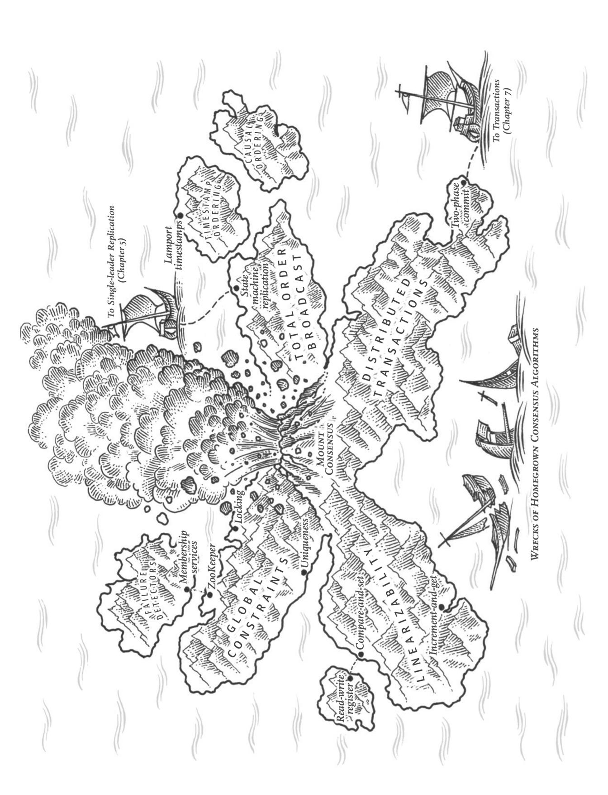

# <span id="page-342-0"></span>**Consistency and Consensus**

*Is it better to be alive and wrong or right and dead?* —Jay Kreps, *A Few Notes on Kafka and Jepsen* (2013)

Lots of things can go wrong in distributed systems, as discussed in [Chapter 8](#page-294-0). The simplest way of handling such faults is to simply let the entire service fail, and show the user an error message. If that solution is unacceptable, we need to find ways of *tolerating* faults—that is, of keeping the service functioning correctly, even if some internal component is faulty.

In this chapter, we will talk about some examples of algorithms and protocols for building fault-tolerant distributed systems. We will assume that all the problems from [Chapter 8](#page-294-0) can occur: packets can be lost, reordered, duplicated, or arbitrarily delayed in the network; clocks are approximate at best; and nodes can pause (e.g., due to garbage collection) or crash at any time.

The best way of building fault-tolerant systems is to find some general-purpose abstractions with useful guarantees, implement them once, and then let applications rely on those guarantees. This is the same approach as we used with transactions in [Chapter 7:](#page-242-0) by using a transaction, the application can pretend that there are no crashes (atomicity), that nobody else is concurrently accessing the database (isola‐ tion), and that storage devices are perfectly reliable (durability). Even though crashes, race conditions, and disk failures do occur, the transaction abstraction hides those problems so that the application doesn't need to worry about them.

We will now continue along the same lines, and seek abstractions that can allow an application to ignore some of the problems with distributed systems. For example, one of the most important abstractions for distributed systems is *consensus*: that is, getting all of the nodes to agree on something. As we shall see in this chapter, reliably <span id="page-343-0"></span>reaching consensus in spite of network faults and process failures is a surprisingly tricky problem.

Once you have an implementation of consensus, applications can use it for various purposes. For example, say you have a database with single-leader replication. If the leader dies and you need to fail over to another node, the remaining database nodes can use consensus to elect a new leader. As discussed in ["Handling Node Outages" on](#page-177-0) [page 156](#page-177-0), it's important that there is only one leader, and that all nodes agree who the leader is. If two nodes both believe that they are the leader, that situation is called *split brain*, and it often leads to data loss. Correct implementations of consensus help avoid such problems.

Later in this chapter, in ["Distributed Transactions and Consensus" on page 352,](#page-373-0) we will look into algorithms to solve consensus and related problems. But first we first need to explore the range of guarantees and abstractions that can be provided in a distributed system.

We need to understand the scope of what can and cannot be done: in some situa‐ tions, it's possible for the system to tolerate faults and continue working; in other sit‐ uations, that is not possible. The limits of what is and isn't possible have been explored in depth, both in theoretical proofs and in practical implementations. We will get an overview of those fundamental limits in this chapter.

Researchers in the field of distributed systems have been studying these topics for decades, so there is a lot of material—we'll only be able to scratch the surface. In this book we don't have space to go into details of the formal models and proofs, so we will stick with informal intuitions. The literature references offer plenty of additional depth if you're interested.

## **Consistency Guarantees**

In ["Problems with Replication Lag" on page 161](#page-182-0) we looked at some timing issues that occur in a replicated database. If you look at two database nodes at the same moment in time, you're likely to see different data on the two nodes, because write requests arrive on different nodes at different times. These inconsistencies occur no matter what replication method the database uses (single-leader, multi-leader, or leaderless replication).

Most replicated databases provide at least *eventual consistency*, which means that if you stop writing to the database and wait for some unspecified length of time, then eventually all read requests will return the same value [[1\]](#page-396-0). In other words, the incon‐ sistency is temporary, and it eventually resolves itself (assuming that any faults in the network are also eventually repaired). A better name for eventual consistency may be *convergence*, as we expect all replicas to eventually converge to the same value [\[2](#page-397-0)].

<span id="page-344-0"></span>However, this is a very weak guarantee—it doesn't say anything about *when* the repli‐ cas will converge. Until the time of convergence, reads could return anything or nothing [[1\]](#page-396-0). For example, if you write a value and then immediately read it again, there is no guarantee that you will see the value you just wrote, because the read may be routed to a different replica (see ["Reading Your Own Writes" on page 162\)](#page-183-0).

Eventual consistency is hard for application developers because it is so different from the behavior of variables in a normal single-threaded program. If you assign a value to a variable and then read it shortly afterward, you don't expect to read back the old value, or for the read to fail. A database looks superficially like a variable that you can read and write, but in fact it has much more complicated semantics [\[3](#page-397-0)].

When working with a database that provides only weak guarantees, you need to be constantly aware of its limitations and not accidentally assume too much. Bugs are often subtle and hard to find by testing, because the application may work well most of the time. The edge cases of eventual consistency only become apparent when there is a fault in the system (e.g., a network interruption) or at high concurrency.

In this chapter we will explore stronger consistency models that data systems may choose to provide. They don't come for free: systems with stronger guarantees may have worse performance or be less fault-tolerant than systems with weaker guaran‐ tees. Nevertheless, stronger guarantees can be appealing because they are easier to use correctly. Once you have seen a few different consistency models, you'll be in a better position to decide which one best fits your needs.

There is some similarity between distributed consistency models and the hierarchy of transaction isolation levels we discussed previously [\[4](#page-397-0), [5\]](#page-397-0) (see ["Weak Isolation Lev‐](#page-254-0) [els" on page 233](#page-254-0)). But while there is some overlap, they are mostly independent con‐ cerns: transaction isolation is primarily about avoiding race conditions due to concurrently executing transactions, whereas distributed consistency is mostly about coordinating the state of replicas in the face of delays and faults.

This chapter covers a broad range of topics, but as we shall see, these areas are in fact deeply linked:

- We will start by looking at one of the strongest consistency models in common use, *linearizability*, and examine its pros and cons.
- We'll then examine the issue of ordering events in a distributed system [\("Order‐](#page-360-0) [ing Guarantees" on page 339\)](#page-360-0), particularly around causality and total ordering.
- In the third section [\("Distributed Transactions and Consensus" on page 352\)](#page-373-0) we will explore how to atomically commit a distributed transaction, which will finally lead us toward solutions for the consensus problem.

## <span id="page-345-0"></span>**Linearizability**

In an eventually consistent database, if you ask two different replicas the same ques‐ tion at the same time, you may get two different answers. That's confusing. Wouldn't it be a lot simpler if the database could give the illusion that there is only one replica (i.e., only one copy of the data)? Then every client would have the same view of the data, and you wouldn't have to worry about replication lag.

This is the idea behind *linearizability* [[6\]](#page-397-0) (also known as *atomic consistency* [[7](#page-397-0)], *strong consistency*, *immediate consistency*, or *external consistency* [\[8](#page-397-0)]). The exact definition of linearizability is quite subtle, and we will explore it in the rest of this section. But the basic idea is to make a system appear as if there were only one copy of the data, and all operations on it are atomic. With this guarantee, even though there may be multiple replicas in reality, the application does not need to worry about them.

In a linearizable system, as soon as one client successfully completes a write, all cli‐ ents reading from the database must be able to see the value just written. Maintaining the illusion of a single copy of the data means guaranteeing that the value read is the most recent, up-to-date value, and doesn't come from a stale cache or replica. In other words, linearizability is a *recency guarantee*. To clarify this idea, let's look at an example of a system that is not linearizable.

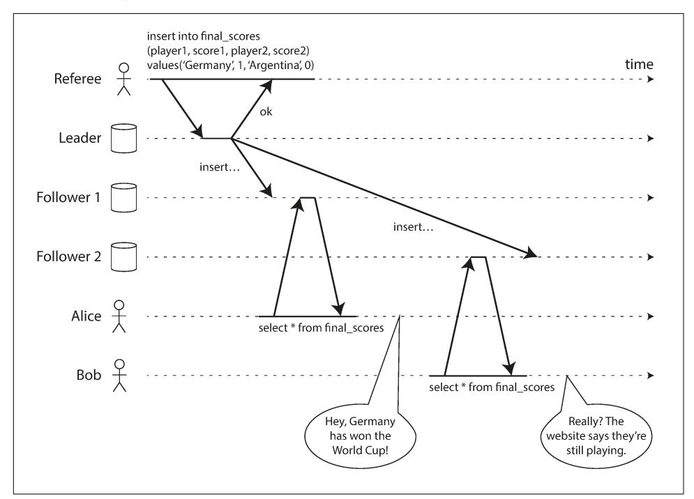

*Figure 9-1. This system is not linearizable, causing football fans to be confused.*

<span id="page-346-0"></span>[Figure 9-1](#page-345-0) shows an example of a nonlinearizable sports website [[9\]](#page-397-0). Alice and Bob are sitting in the same room, both checking their phones to see the outcome of the 2014 FIFA World Cup final. Just after the final score is announced, Alice refreshes the page, sees the winner announced, and excitedly tells Bob about it. Bob incredu‐ lously hits *reload* on his own phone, but his request goes to a database replica that is lagging, and so his phone shows that the game is still ongoing.

If Alice and Bob had hit reload at the same time, it would have been less surprising if they had gotten two different query results, because they wouldn't know at exactly what time their respective requests were processed by the server. However, Bob knows that he hit the reload button (initiated his query) *after* he heard Alice exclaim the final score, and therefore he expects his query result to be at least as recent as Alice's. The fact that his query returned a stale result is a violation of linearizability.

## **What Makes a System Linearizable?**

The basic idea behind linearizability is simple: to make a system appear as if there is only a single copy of the data. However, nailing down precisely what that means actually requires some care. In order to understand linearizability better, let's look at some more examples.

Figure 9-2 shows three clients concurrently reading and writing the same key *x* in a linearizable database. In the distributed systems literature, *x* is called a *register*—in practice, it could be one key in a key-value store, one row in a relational database, or one document in a document database, for example.

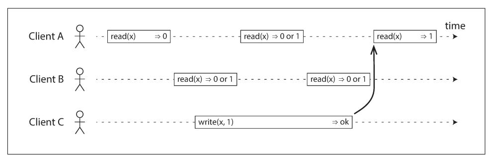

*Figure 9-2. If a read request is concurrent with a write request, it may return either the old or the new value.*

For simplicity, Figure 9-2 shows only the requests from the clients' point of view, not the internals of the database. Each bar is a request made by a client, where the start of a bar is the time when the request was sent, and the end of a bar is when the response was received by the client. Due to variable network delays, a client doesn't know

<span id="page-347-0"></span>exactly when the database processed its request—it only knows that it must have hap‐ pened sometime between the client sending the request and receiving the response.<sup>i</sup>

In this example, the register has two types of operations:

- *read*(*x*) ⇒ *v* means the client requested to read the value of register *x*, and the database returned the value *v*.
- *write*(*x*, *v*) ⇒ *r* means the client requested to set the register *x* to value *v*, and the database returned response *r* (which could be *ok* or *error*).

In [Figure 9-2,](#page-346-0) the value of *x* is initially 0, and client C performs a write request to set it to 1. While this is happening, clients A and B are repeatedly polling the database to read the latest value. What are the possible responses that A and B might get for their read requests?

- The first read operation by client A completes before the write begins, so it must definitely return the old value 0.
- The last read by client A begins after the write has completed, so it must defi‐ nitely return the new value 1 if the database is linearizable: we know that the write must have been processed sometime between the start and end of the write operation, and the read must have been processed sometime between the start and end of the read operation. If the read started after the write ended, then the read must have been processed after the write, and therefore it must see the new value that was written.
- Any read operations that overlap in time with the write operation might return either 0 or 1, because we don't know whether or not the write has taken effect at the time when the read operation is processed. These operations are *concurrent* with the write.

However, that is not yet sufficient to fully describe linearizability: if reads that are concurrent with a write can return either the old or the new value, then readers could see a value flip back and forth between the old and the new value several times while a write is going on. That is not what we expect of a system that emulates a "single copy of the data."ii

i. A subtle detail of this diagram is that it assumes the existence of a global clock, represented by the horizon‐ tal axis. Even though real systems typically don't have accurate clocks (see ["Unreliable Clocks" on page 287\)](#page-308-0), this assumption is okay: for the purposes of analyzing a distributed algorithm, we may pretend that an accu‐ rate global clock exists, as long as the algorithm doesn't have access to it [\[47\]](#page-400-0). Instead, the algorithm can only see a mangled approximation of real time, as produced by a quartz oscillator and NTP.

ii. A register in which reads may return either the old or the new value if they are concurrent with a write is known as a *regular register* [[7](#page-397-0), [25\]](#page-398-0).

<span id="page-348-0"></span>To make the system linearizable, we need to add another constraint, illustrated in Figure 9-3.

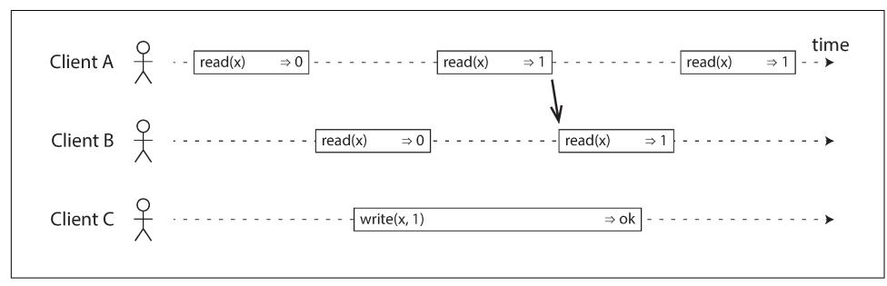

*Figure 9-3. After any one read has returned the new value, all following reads (on the same or other clients) must also return the new value.*

In a linearizable system we imagine that there must be some point in time (between the start and end of the write operation) at which the value of *x* atomically flips from 0 to 1. Thus, if one client's read returns the new value 1, all subsequent reads must also return the new value, even if the write operation has not yet completed.

This timing dependency is illustrated with an arrow in Figure 9-3. Client A is the first to read the new value, 1. Just after A's read returns, B begins a new read. Since B's read occurs strictly after A's read, it must also return 1, even though the write by C is still ongoing. (It's the same situation as with Alice and Bob in [Figure 9-1:](#page-345-0) after Alice has read the new value, Bob also expects to read the new value.)

We can further refine this timing diagram to visualize each operation taking effect atomically at some point in time. A more complex example is shown in [Figure 9-4](#page-349-0) [[10\]](#page-397-0).

In [Figure 9-4](#page-349-0) we add a third type of operation besides *read* and *write*:

• *cas*(*x*, *v*old, *v*new) ⇒ *r* means the client requested an atomic *compare-and-set* oper‐ ation (see ["Compare-and-set" on page 245](#page-266-0)). If the current value of the register *x* equals *v*old, it should be atomically set to *v*new. If *x* ≠ *v*old then the operation should leave the register unchanged and return an error. *r* is the database's response (*ok* or *error*).

Each operation in [Figure 9-4](#page-349-0) is marked with a vertical line (inside the bar for each operation) at the time when we think the operation was executed. Those markers are joined up in a sequential order, and the result must be a valid sequence of reads and writes for a register (every read must return the value set by the most recent write).

The requirement of linearizability is that the lines joining up the operation markers always move forward in time (from left to right), never backward. This requirement <span id="page-349-0"></span>ensures the recency guarantee we discussed earlier: once a new value has been written or read, all subsequent reads see the value that was written, until it is overwritten again.

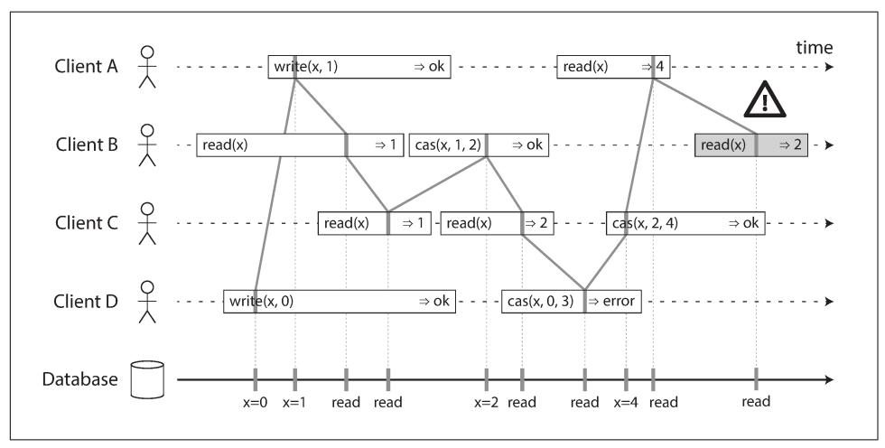

*Figure 9-4. Visualizing the points in time at which the reads and writes appear to have taken effect. The final read by B is not linearizable.*

There are a few interesting details to point out in Figure 9-4:

- First client B sent a request to read *x*, then client D sent a request to set *x* to 0, and then client A sent a request to set *x* to 1. Nevertheless, the value returned to B's read is 1 (the value written by A). This is okay: it means that the database first processed D's write, then A's write, and finally B's read. Although this is not the order in which the requests were sent, it's an acceptable order, because the three requests are concurrent. Perhaps B's read request was slightly delayed in the net‐ work, so it only reached the database after the two writes.
- Client B's read returned 1 before client A received its response from the database, saying that the write of the value 1 was successful. This is also okay: it doesn't mean the value was read before it was written, it just means the *ok* response from the database to client A was slightly delayed in the network.
- This model doesn't assume any transaction isolation: another client may change a value at any time. For example, C first reads 1 and then reads 2, because the value was changed by B between the two reads. An atomic compare-and-set (*cas*) operation can be used to check the value hasn't been concurrently changed by another client: B and C's *cas* requests succeed, but D's *cas* request fails (by the time the database processes it, the value of *x* is no longer 0).
- The final read by client B (in a shaded bar) is not linearizable. The operation is concurrent with C's *cas* write, which updates *x* from 2 to 4. In the absence of

<span id="page-350-0"></span>other requests, it would be okay for B's read to return 2. However, client A has already read the new value 4 before B's read started, so B is not allowed to read an older value than A. Again, it's the same situation as with Alice and Bob in [Figure 9-1](#page-345-0).

That is the intuition behind linearizability; the formal definition [[6\]](#page-397-0) describes it more precisely. It is possible (though computationally expensive) to test whether a system's behavior is linearizable by recording the timings of all requests and responses, and checking whether they can be arranged into a valid sequential order [\[11](#page-397-0)].

## **Linearizability Versus Serializability**

Linearizability is easily confused with serializability (see ["Serializability" on page 251](#page-272-0)), as both words seem to mean something like "can be arranged in a sequential order." However, they are two quite different guarantees, and it is important to distinguish between them:

## *Serializability*

Serializability is an isolation property of *transactions*, where every transaction may read and write multiple objects (rows, documents, records)—see ["Single-](#page-249-0)[Object and Multi-Object Operations" on page 228](#page-249-0). It guarantees that transac‐ tions behave the same as if they had executed in *some* serial order (each transaction running to completion before the next transaction starts). It is okay for that serial order to be different from the order in which transactions were actually run [[12](#page-397-0)].

#### *Linearizability*

Linearizability is a recency guarantee on reads and writes of a register (an *indi‐ vidual object*). It doesn't group operations together into transactions, so it does not prevent problems such as write skew (see ["Write Skew and Phantoms" on](#page-267-0) [page 246](#page-267-0)), unless you take additional measures such as materializing conflicts (see ["Materializing conflicts" on page 251](#page-272-0)).

A database may provide both serializability and linearizability, and this combination is known as *strict serializability* or *strong one-copy serializability* (*strong-1SR*) [[4](#page-397-0), [13](#page-397-0)]. Implementations of serializability based on two-phase locking (see ["Two-Phase Lock‐](#page-278-0) [ing \(2PL\)" on page 257\)](#page-278-0) or actual serial execution (see ["Actual Serial Execution"](#page-273-0) on [page 252](#page-273-0)) are typically linearizable.

However, serializable snapshot isolation (see ["Serializable Snapshot Isolation \(SSI\)"](#page-282-0) [on page 261\)](#page-282-0) is not linearizable: by design, it makes reads from a consistent snapshot, to avoid lock contention between readers and writers. The whole point of a consistent snapshot is that it does not include writes that are more recent than the snapshot, and thus reads from the snapshot are not linearizable.

## <span id="page-351-0"></span>**Relying on Linearizability**

In what circumstances is linearizability useful? Viewing the final score of a sporting match is perhaps a frivolous example: a result that is outdated by a few seconds is unlikely to cause any real harm in this situation. However, there a few areas in which linearizability is an important requirement for making a system work correctly.

## **Locking and leader election**

A system that uses single-leader replication needs to ensure that there is indeed only one leader, not several (split brain). One way of electing a leader is to use a lock: every node that starts up tries to acquire the lock, and the one that succeeds becomes the leader [[14\]](#page-397-0). No matter how this lock is implemented, it must be linearizable: all nodes must agree which node owns the lock; otherwise it is useless.

Coordination services like Apache ZooKeeper [\[15](#page-397-0)] and etcd [\[16\]](#page-397-0) are often used to implement distributed locks and leader election. They use consensus algorithms to implement linearizable operations in a fault-tolerant way (we discuss such algorithms later in this chapter, in ["Fault-Tolerant Consensus" on page 364\)](#page-385-0).iii There are still many subtle details to implementing locks and leader election correctly (see for example the fencing issue in ["The leader and the lock" on page 301](#page-322-0)), and libraries like Apache Curator [\[17](#page-398-0)] help by providing higher-level recipes on top of ZooKeeper. However, a linearizable storage service is the basic foundation for these coordination tasks.

Distributed locking is also used at a much more granular level in some distributed databases, such as Oracle Real Application Clusters (RAC) [\[18](#page-398-0)]. RAC uses a lock per disk page, with multiple nodes sharing access to the same disk storage system. Since these linearizable locks are on the critical path of transaction execution, RAC deploy‐ ments usually have a dedicated cluster interconnect network for communication between database nodes.

## **Constraints and uniqueness guarantees**

Uniqueness constraints are common in databases: for example, a username or email address must uniquely identify one user, and in a file storage service there cannot be two files with the same path and filename. If you want to enforce this constraint as the data is written (such that if two people try to concurrently create a user or a file with the same name, one of them will be returned an error), you need linearizability.

iii. Strictly speaking, ZooKeeper and etcd provide linearizable writes, but reads may be stale, since by default they can be served by any one of the replicas. You can optionally request a linearizable read: etcd calls this a *quorum read* [[16\]](#page-397-0), and in ZooKeeper you need to call sync() before the read [\[15\]](#page-397-0); see ["Implementing linear‐](#page-371-0) [izable storage using total order broadcast" on page 350.](#page-371-0)

<span id="page-352-0"></span>This situation is actually similar to a lock: when a user registers for your service, you can think of them acquiring a "lock" on their chosen username. The operation is also very similar to an atomic compare-and-set, setting the username to the ID of the user who claimed it, provided that the username is not already taken.

Similar issues arise if you want to ensure that a bank account balance never goes neg‐ ative, or that you don't sell more items than you have in stock in the warehouse, or that two people don't concurrently book the same seat on a flight or in a theater. These constraints all require there to be a single up-to-date value (the account bal‐ ance, the stock level, the seat occupancy) that all nodes agree on.

In real applications, it is sometimes acceptable to treat such constraints loosely (for example, if a flight is overbooked, you can move customers to a different flight and offer them compensation for the inconvenience). In such cases, linearizability may not be needed, and we will discuss such loosely interpreted constraints in ["Timeliness](#page-545-0) [and Integrity" on page 524.](#page-545-0)

However, a hard uniqueness constraint, such as the one you typically find in rela‐ tional databases, requires linearizability. Other kinds of constraints, such as foreign key or attribute constraints, can be implemented without requiring linearizability [[19\]](#page-398-0).

## **Cross-channel timing dependencies**

Notice a detail in [Figure 9-1](#page-345-0): if Alice hadn't exclaimed the score, Bob wouldn't have known that the result of his query was stale. He would have just refreshed the page again a few seconds later, and eventually seen the final score. The linearizability viola‐ tion was only noticed because there was an additional communication channel in the system (Alice's voice to Bob's ears).

Similar situations can arise in computer systems. For example, say you have a website where users can upload a photo, and a background process resizes the photos to lower resolution for faster download (thumbnails). The architecture and dataflow of this system is illustrated in [Figure 9-5](#page-353-0).

The image resizer needs to be explicitly instructed to perform a resizing job, and this instruction is sent from the web server to the resizer via a message queue (see [Chap‐](#page-460-0) [ter 11\)](#page-460-0). The web server doesn't place the entire photo on the queue, since most mes‐ sage brokers are designed for small messages, and a photo may be several megabytes in size. Instead, the photo is first written to a file storage service, and once the write is complete, the instruction to the resizer is placed on the queue.

<span id="page-353-0"></span>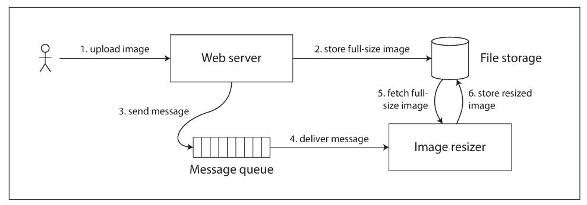

*Figure 9-5. The web server and image resizer communicate both through file storage and a message queue, opening the potential for race conditions.*

If the file storage service is linearizable, then this system should work fine. If it is not linearizable, there is the risk of a race condition: the message queue (steps 3 and 4 in Figure 9-5) might be faster than the internal replication inside the storage service. In this case, when the resizer fetches the image (step 5), it might see an old version of the image, or nothing at all. If it processes an old version of the image, the full-size and resized images in the file storage become permanently inconsistent.

This problem arises because there are two different communication channels between the web server and the resizer: the file storage and the message queue. Without the recency guarantee of linearizability, race conditions between these two channels are possible. This situation is analogous to [Figure 9-1,](#page-345-0) where there was also a race condition between two communication channels: the database replication and the real-life audio channel between Alice's mouth and Bob's ears.

Linearizability is not the only way of avoiding this race condition, but it's the simplest to understand. If you control the additional communication channel (like in the case of the message queue, but not in the case of Alice and Bob), you can use alternative approaches similar to what we discussed in ["Reading Your Own Writes" on page 162,](#page-183-0) at the cost of additional complexity.

## **Implementing Linearizable Systems**

Now that we've looked at a few examples in which linearizability is useful, let's think about how we might implement a system that offers linearizable semantics.

Since linearizability essentially means "behave as though there is only a single copy of the data, and all operations on it are atomic," the simplest answer would be to really only use a single copy of the data. However, that approach would not be able to toler‐ ate faults: if the node holding that one copy failed, the data would be lost, or at least inaccessible until the node was brought up again.

<span id="page-354-0"></span>The most common approach to making a system fault-tolerant is to use replication. Let's revisit the replication methods from [Chapter 5](#page-172-0), and compare whether they can be made linearizable:

#### *Single-leader replication (potentially linearizable)*

In a system with single-leader replication (see ["Leaders and Followers" on page](#page-173-0) [152](#page-173-0)), the leader has the primary copy of the data that is used for writes, and the followers maintain backup copies of the data on other nodes. If you make reads from the leader, or from synchronously updated followers, they have the *poten‐ tial* to be linearizable.iv However, not every single-leader database is actually line‐ arizable, either by design (e.g., because it uses snapshot isolation) or due to concurrency bugs [[10\]](#page-397-0).

Using the leader for reads relies on the assumption that you know for sure who the leader is. As discussed in ["The Truth Is Defined by the Majority" on page](#page-321-0) [300](#page-321-0), it is quite possible for a node to think that it is the leader, when in fact it is not—and if the delusional leader continues to serve requests, it is likely to violate linearizability [\[20\]](#page-398-0). With asynchronous replication, failover may even lose com‐ mitted writes (see ["Handling Node Outages" on page 156\)](#page-177-0), which violates both durability and linearizability.

## *Consensus algorithms (linearizable)*

Some consensus algorithms, which we will discuss later in this chapter, bear a resemblance to single-leader replication. However, consensus protocols contain measures to prevent split brain and stale replicas. Thanks to these details, con‐ sensus algorithms can implement linearizable storage safely. This is how Zoo‐ Keeper [[21\]](#page-398-0) and etcd [[22\]](#page-398-0) work, for example.

## *Multi-leader replication (not linearizable)*

Systems with multi-leader replication are generally not linearizable, because they concurrently process writes on multiple nodes and asynchronously replicate them to other nodes. For this reason, they can produce conflicting writes that require resolution (see ["Handling Write Conflicts" on page 171](#page-192-0)). Such conflicts are an artifact of the lack of a single copy of the data.

## *Leaderless replication (probably not linearizable)*

For systems with leaderless replication (Dynamo-style; see ["Leaderless Replica‐](#page-198-0) [tion" on page 177](#page-198-0)), people sometimes claim that you can obtain "strong consis‐ tency" by requiring quorum reads and writes (*w* + *r* > *n*). Depending on the exact

iv. Partitioning (sharding) a single-leader database, so that there is a separate leader per partition, does not affect linearizability, since it is only a single-object guarantee. Cross-partition transactions are a different mat‐ ter (see ["Distributed Transactions and Consensus" on page 352](#page-373-0)).

<span id="page-355-0"></span>configuration of the quorums, and depending on how you define strong consis‐ tency, this is not quite true.

"Last write wins" conflict resolution methods based on time-of-day clocks (e.g., in Cassandra; see ["Relying on Synchronized Clocks" on page 291](#page-312-0)) are almost cer‐ tainly nonlinearizable, because clock timestamps cannot be guaranteed to be consistent with actual event ordering due to clock skew. Sloppy quorums (["Sloppy Quorums and Hinted Handoff" on page 183](#page-204-0)) also ruin any chance of linearizability. Even with strict quorums, nonlinearizable behavior is possible, as demonstrated in the next section.

#### **Linearizability and quorums**

Intuitively, it seems as though strict quorum reads and writes should be linearizable in a Dynamo-style model. However, when we have variable network delays, it is pos‐ sible to have race conditions, as demonstrated in Figure 9-6.

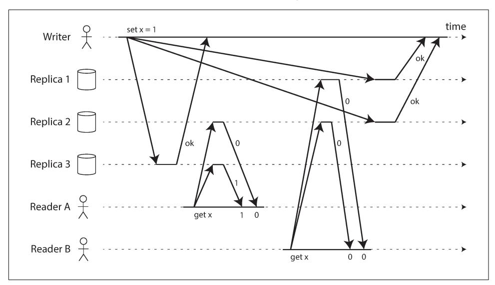

*Figure 9-6. A nonlinearizable execution, despite using a strict quorum.*

In Figure 9-6, the initial value of *x* is 0, and a writer client is updating *x* to 1 by send‐ ing the write to all three replicas (*n* = 3, *w* = 3). Concurrently, client A reads from a quorum of two nodes (*r* = 2) and sees the new value 1 on one of the nodes. Also con‐ currently with the write, client B reads from a different quorum of two nodes, and gets back the old value 0 from both.

The quorum condition is met (*w* + *r* > *n*), but this execution is nevertheless not line‐ arizable: B's request begins after A's request completes, but B returns the old value <span id="page-356-0"></span>while A returns the new value. (It's once again the Alice and Bob situation from [Figure 9-1](#page-345-0).)

Interestingly, it *is* possible to make Dynamo-style quorums linearizable at the cost of reduced performance: a reader must perform read repair (see ["Read repair and anti](#page-199-0)[entropy" on page 178\)](#page-199-0) synchronously, before returning results to the application [[23\]](#page-398-0), and a writer must read the latest state of a quorum of nodes before sending its writes [\[24](#page-398-0), [25\]](#page-398-0). However, Riak does not perform synchronous read repair due to the performance penalty [[26\]](#page-398-0). Cassandra *does* wait for read repair to complete on quo‐ rum reads [\[27](#page-398-0)], but it loses linearizability if there are multiple concurrent writes to the same key, due to its use of last-write-wins conflict resolution.

Moreover, only linearizable read and write operations can be implemented in this way; a linearizable compare-and-set operation cannot, because it requires a consen‐ sus algorithm [\[28](#page-398-0)].

In summary, it is safest to assume that a leaderless system with Dynamo-style replica‐ tion does not provide linearizability.

## **The Cost of Linearizability**

As some replication methods can provide linearizability and others cannot, it is inter‐ esting to explore the pros and cons of linearizability in more depth.

We already discussed some use cases for different replication methods in [Chapter 5;](#page-172-0) for example, we saw that multi-leader replication is often a good choice for multidatacenter replication (see ["Multi-datacenter operation" on page 168\)](#page-189-0). An example of such a deployment is illustrated in Figure 9-7.

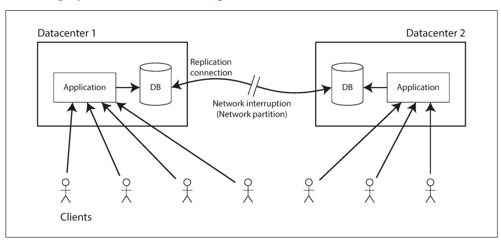

*Figure 9-7. A network interruption forcing a choice between linearizability and availa‐ bility.*

<span id="page-357-0"></span>Consider what happens if there is a network interruption between the two datacen‐ ters. Let's assume that the network within each datacenter is working, and clients can reach the datacenters, but the datacenters cannot connect to each other.

With a multi-leader database, each datacenter can continue operating normally: since writes from one datacenter are asynchronously replicated to the other, the writes are simply queued up and exchanged when network connectivity is restored.

On the other hand, if single-leader replication is used, then the leader must be in one of the datacenters. Any writes and any linearizable reads must be sent to the leader thus, for any clients connected to a follower datacenter, those read and write requests must be sent synchronously over the network to the leader datacenter.

If the network between datacenters is interrupted in a single-leader setup, clients con‐ nected to follower datacenters cannot contact the leader, so they cannot make any writes to the database, nor any linearizable reads. They can still make reads from the follower, but they might be stale (nonlinearizable). If the application requires linear‐ izable reads and writes, the network interruption causes the application to become unavailable in the datacenters that cannot contact the leader.

If clients can connect directly to the leader datacenter, this is not a problem, since the application continues to work normally there. But clients that can only reach a fol‐ lower datacenter will experience an outage until the network link is repaired.

#### **The CAP theorem**

This issue is not just a consequence of single-leader and multi-leader replication: any linearizable database has this problem, no matter how it is implemented. The issue also isn't specific to multi-datacenter deployments, but can occur on any unreliable network, even within one datacenter. The trade-off is as follows:<sup>v</sup>

- If your application *requires* linearizability, and some replicas are disconnected from the other replicas due to a network problem, then some replicas cannot process requests while they are disconnected: they must either wait until the net‐ work problem is fixed, or return an error (either way, they become *unavailable*).
- If your application *does not require* linearizability, then it can be written in a way that each replica can process requests independently, even if it is disconnected from other replicas (e.g., multi-leader). In this case, the application can remain *available* in the face of a network problem, but its behavior is not linearizable.

v. These two choices are sometimes known as CP (consistent but not available under network partitions) and AP (available but not consistent under network partitions), respectively. However, this classification scheme has several flaws [\[9](#page-397-0)], so it is best avoided.

<span id="page-358-0"></span>Thus, applications that don't require linearizability can be more tolerant of network problems. This insight is popularly known as the *CAP theorem* [\[29](#page-398-0), [30,](#page-399-0) [31,](#page-399-0) [32\]](#page-399-0), named by Eric Brewer in 2000, although the trade-off has been known to designers of distributed databases since the 1970s [\[33, 34](#page-399-0), [35](#page-399-0), [36](#page-399-0)].

CAP was originally proposed as a rule of thumb, without precise definitions, with the goal of starting a discussion about trade-offs in databases. At the time, many dis‐ tributed databases focused on providing linearizable semantics on a cluster of machines with shared storage [[18](#page-398-0)], and CAP encouraged database engineers to explore a wider design space of distributed shared-nothing systems, which were more suitable for implementing large-scale web services [[37\]](#page-399-0). CAP deserves credit for this culture shift—witness the explosion of new database technologies since the mid-2000s (known as NoSQL).

## **The Unhelpful CAP Theorem**

CAP is sometimes presented as *Consistency, Availability, Partition tolerance: pick 2 out of 3*. Unfortunately, putting it this way is misleading [[32](#page-399-0)] because network parti‐ tions are a kind of fault, so they aren't something about which you have a choice: they will happen whether you like it or not [[38](#page-399-0)].

At times when the network is working correctly, a system can provide both consis‐ tency (linearizability) and total availability. When a network fault occurs, you have to choose between either linearizability or total availability. Thus, a better way of phras‐ ing CAP would be *either Consistent or Available when Partitioned* [[39](#page-399-0)]. A more relia‐ ble network needs to make this choice less often, but at some point the choice is inevitable.

In discussions of CAP there are several contradictory definitions of the term *availa‐ bility*, and the formalization as a theorem [[30](#page-399-0)] does not match its usual meaning [[40](#page-399-0)]. Many so-called "highly available" (fault-tolerant) systems actually do not meet CAP's idiosyncratic definition of availability. All in all, there is a lot of misunderstanding and confusion around CAP, and it does not help us understand systems better, so CAP is best avoided.

The CAP theorem as formally defined [[30](#page-399-0)] is of very narrow scope: it only considers one consistency model (namely linearizability) and one kind of fault (*network parti‐ tions*, vi or nodes that are alive but disconnected from each other). It doesn't say any‐

vi. As discussed in ["Network Faults in Practice" on page 279,](#page-300-0) this book uses *partitioning* to refer to deliber‐ ately breaking down a large dataset into smaller ones (*sharding*; see [Chapter 6\)](#page-220-0). By contrast, a network parti‐ tion is a particular type of network fault, which we normally don't consider separately from other kinds of faults. However, since it's the P in CAP, we can't avoid the confusion in this case.

<span id="page-359-0"></span>thing about network delays, dead nodes, or other trade-offs. Thus, although CAP has been historically influential, it has little practical value for designing systems [[9,](#page-397-0) [40](#page-399-0)].

There are many more interesting impossibility results in distributed systems [[41\]](#page-399-0), and CAP has now been superseded by more precise results [\[2](#page-397-0), [42\]](#page-399-0), so it is of mostly historical interest today.

## **Linearizability and network delays**

Although linearizability is a useful guarantee, surprisingly few systems are actually linearizable in practice. For example, even RAM on a modern multi-core CPU is not linearizable [\[43](#page-399-0)]: if a thread running on one CPU core writes to a memory address, and a thread on another CPU core reads the same address shortly afterward, it is not guaranteed to read the value written by the first thread (unless a *memory barrier* or *fence* [[44\]](#page-400-0) is used).

The reason for this behavior is that every CPU core has its own memory cache and store buffer. Memory access first goes to the cache by default, and any changes are asynchronously written out to main memory. Since accessing data in the cache is much faster than going to main memory [[45\]](#page-400-0), this feature is essential for good per‐ formance on modern CPUs. However, there are now several copies of the data (one in main memory, and perhaps several more in various caches), and these copies are asynchronously updated, so linearizability is lost.

Why make this trade-off? It makes no sense to use the CAP theorem to justify the multi-core memory consistency model: within one computer we usually assume reli‐ able communication, and we don't expect one CPU core to be able to continue oper‐ ating normally if it is disconnected from the rest of the computer. The reason for dropping linearizability is *performance*, not fault tolerance.

The same is true of many distributed databases that choose not to provide lineariza‐ ble guarantees: they do so primarily to increase performance, not so much for fault tolerance [\[46](#page-400-0)]. Linearizability is slow—and this is true all the time, not only during a network fault.

Can't we maybe find a more efficient implementation of linearizable storage? It seems the answer is no: Attiya and Welch [\[47](#page-400-0)] prove that if you want linearizability, the response time of read and write requests is at least proportional to the uncertainty of delays in the network. In a network with highly variable delays, like most com‐ puter networks (see ["Timeouts and Unbounded Delays" on page 281](#page-302-0)), the response time of linearizable reads and writes is inevitably going to be high. A faster algorithm for linearizability does not exist, but weaker consistency models can be much faster, so this trade-off is important for latency-sensitive systems. In [Chapter 12](#page-510-0) we will dis‐ cuss some approaches for avoiding linearizability without sacrificing correctness.

## <span id="page-360-0"></span>**Ordering Guarantees**

We said previously that a linearizable register behaves as if there is only a single copy of the data, and that every operation appears to take effect atomically at one point in time. This definition implies that operations are executed in some well-defined order. We illustrated the ordering in [Figure 9-4](#page-349-0) by joining up the operations in the order in which they seem to have executed.

Ordering has been a recurring theme in this book, which suggests that it might be an important fundamental idea. Let's briefly recap some of the other contexts in which we have discussed ordering:

- In [Chapter 5](#page-172-0) we saw that the main purpose of the leader in single-leader replica‐ tion is to determine the *order of writes* in the replication log—that is, the order in which followers apply those writes. If there is no single leader, conflicts can occur due to concurrent operations (see ["Handling Write Conflicts" on page 171\)](#page-192-0).
- Serializability, which we discussed in [Chapter 7](#page-242-0), is about ensuring that transac‐ tions behave as if they were executed in *some sequential order*. It can be achieved by literally executing transactions in that serial order, or by allowing concurrent execution while preventing serialization conflicts (by locking or aborting).
- The use of timestamps and clocks in distributed systems that we discussed in [Chapter 8](#page-294-0) (see ["Relying on Synchronized Clocks" on page 291\)](#page-312-0) is another attempt to introduce order into a disorderly world, for example to determine which one of two writes happened later.

It turns out that there are deep connections between ordering, linearizability, and consensus. Although this notion is a bit more theoretical and abstract than the rest of this book, it is very helpful for clarifying our understanding of what systems can and cannot do. We will explore this topic in the next few sections.

## **Ordering and Causality**

There are several reasons why ordering keeps coming up, and one of the reasons is that it helps preserve *causality*. We have already seen several examples over the course of this book where causality has been important:

• In ["Consistent Prefix Reads" on page 165](#page-186-0) ([Figure 5-5\)](#page-187-0) we saw an example where the observer of a conversation saw first the answer to a question, and then the question being answered. This is confusing because it violates our intuition of cause and effect: if a question is answered, then clearly the question had to be there first, because the person giving the answer must have seen the question (assuming they are not psychic and cannot see into the future). We say that there is a *causal dependency* between the question and the answer.

- <span id="page-361-0"></span>• A similar pattern appeared in [Figure 5-9](#page-197-0), where we looked at the replication between three leaders and noticed that some writes could "overtake" others due to network delays. From the perspective of one of the replicas it would look as though there was an update to a row that did not exist. Causality here means that a row must first be created before it can be updated.
- In ["Detecting Concurrent Writes" on page 184](#page-205-0) we observed that if you have two operations A and B, there are three possibilities: either A happened before B, or B happened before A, or A and B are concurrent. This *happened before* relationship is another expression of causality: if A happened before B, that means B might have known about A, or built upon A, or depended on A. If A and B are concur‐ rent, there is no causal link between them; in other words, we are sure that nei‐ ther knew about the other.
- In the context of snapshot isolation for transactions [\("Snapshot Isolation and](#page-258-0) [Repeatable Read" on page 237\)](#page-258-0), we said that a transaction reads from a consistent snapshot. But what does "consistent" mean in this context? It means *consistent with causality*: if the snapshot contains an answer, it must also contain the ques‐ tion being answered [\[48](#page-400-0)]. Observing the entire database at a single point in time makes it consistent with causality: the effects of all operations that happened cau‐ sally before that point in time are visible, but no operations that happened cau‐ sally afterward can be seen. Read skew (non-repeatable reads, as illustrated in [Figure 7-6](#page-258-0)) means reading data in a state that violates causality.
- Our examples of write skew between transactions (see ["Write Skew and Phan‐](#page-267-0) [toms" on page 246](#page-267-0)) also demonstrated causal dependencies: in [Figure 7-8,](#page-268-0) Alice was allowed to go off call because the transaction thought that Bob was still on call, and vice versa. In this case, the action of going off call is causally dependent on the observation of who is currently on call. Serializable snapshot isolation (see ["Serializable Snapshot Isolation \(SSI\)" on page 261\)](#page-282-0) detects write skew by track‐ ing the causal dependencies between transactions.
- In the example of Alice and Bob watching football [\(Figure 9-1](#page-345-0)), the fact that Bob got a stale result from the server after hearing Alice exclaim the result is a causal‐ ity violation: Alice's exclamation is causally dependent on the announcement of the score, so Bob should also be able to see the score after hearing Alice. The same pattern appeared again in ["Cross-channel timing dependencies" on page](#page-352-0) [331](#page-352-0) in the guise of an image resizing service.

Causality imposes an ordering on events: cause comes before effect; a message is sent before that message is received; the question comes before the answer. And, like in real life, one thing leads to another: one node reads some data and then writes some‐ thing as a result, another node reads the thing that was written and writes something else in turn, and so on. These chains of causally dependent operations define the causal order in the system—i.e., what happened before what.

<span id="page-362-0"></span>If a system obeys the ordering imposed by causality, we say that it is *causally consis‐ tent*. For example, snapshot isolation provides causal consistency: when you read from the database, and you see some piece of data, then you must also be able to see any data that causally precedes it (assuming it has not been deleted in the meantime).

#### **The causal order is not a total order**

A *total order* allows any two elements to be compared, so if you have two elements, you can always say which one is greater and which one is smaller. For example, natu‐ ral numbers are totally ordered: if I give you any two numbers, say 5 and 13, you can tell me that 13 is greater than 5.

However, mathematical sets are not totally ordered: is {*a*, *b*} greater than {*b*, *c*}? Well, you can't really compare them, because neither is a subset of the other. We say they are *incomparable*, and therefore mathematical sets are *partially ordered*: in some cases one set is greater than another (if one set contains all the elements of another), but in other cases they are incomparable.

The difference between a total order and a partial order is reflected in different data‐ base consistency models:

#### *Linearizability*

In a linearizable system, we have a *total order* of operations: if the system behaves as if there is only a single copy of the data, and every operation is atomic, this means that for any two operations we can always say which one happened first. This total ordering is illustrated as a timeline in [Figure 9-4.](#page-349-0)

#### *Causality*

We said that two operations are concurrent if neither happened before the other (see ["The "happens-before" relationship and concurrency" on page 186\)](#page-207-0). Put another way, two events are ordered if they are causally related (one happened before the other), but they are incomparable if they are concurrent. This means that causality defines a *partial order*, not a total order: some operations are ordered with respect to each other, but some are incomparable.

Therefore, according to this definition, there are no concurrent operations in a line‐ arizable datastore: there must be a single timeline along which all operations are totally ordered. There might be several requests waiting to be handled, but the data‐ store ensures that every request is handled atomically at a single point in time, acting on a single copy of the data, along a single timeline, without any concurrency.

Concurrency would mean that the timeline branches and merges again—and in this case, operations on different branches are incomparable (i.e., concurrent). We saw this phenomenon in [Chapter 5:](#page-172-0) for example, [Figure 5-14](#page-210-0) is not a straight-line total order, but rather a jumble of different operations going on concurrently. The arrows in the diagram indicate causal dependencies—the partial ordering of operations.

<span id="page-363-0"></span>If you are familiar with distributed version control systems such as Git, their version histories are very much like the graph of causal dependencies. Often one commit happens after another, in a straight line, but sometimes you get branches (when sev‐ eral people concurrently work on a project), and merges are created when those con‐ currently created commits are combined.

## **Linearizability is stronger than causal consistency**

So what is the relationship between the causal order and linearizability? The answer is that linearizability *implies* causality: any system that is linearizable will preserve cau‐ sality correctly [\[7](#page-397-0)]. In particular, if there are multiple communication channels in a system (such as the message queue and the file storage service in [Figure 9-5](#page-353-0)), lineariz‐ ability ensures that causality is automatically preserved without the system having to do anything special (such as passing around timestamps between different compo‐ nents).

The fact that linearizability ensures causality is what makes linearizable systems sim‐ ple to understand and appealing. However, as discussed in ["The Cost of Linearizabil‐](#page-356-0) [ity" on page 335](#page-356-0), making a system linearizable can harm its performance and availability, especially if the system has significant network delays (for example, if it's geographically distributed). For this reason, some distributed data systems have abandoned linearizability, which allows them to achieve better performance but can make them difficult to work with.

The good news is that a middle ground is possible. Linearizability is not the only way of preserving causality—there are other ways too. A system can be causally consistent without incurring the performance hit of making it linearizable (in particular, the CAP theorem does not apply). In fact, causal consistency is the strongest possible consistency model that does not slow down due to network delays, and remains available in the face of network failures [[2,](#page-397-0) [42\]](#page-399-0).

In many cases, systems that appear to require linearizability in fact only really require causal consistency, which can be implemented more efficiently. Based on this obser‐ vation, researchers are exploring new kinds of databases that preserve causality, with performance and availability characteristics that are similar to those of eventually consistent systems [[49,](#page-400-0) [50, 51\]](#page-400-0).

As this research is quite recent, not much of it has yet made its way into production systems, and there are still challenges to be overcome [[52,](#page-400-0) [53\]](#page-400-0). However, it is a prom‐ ising direction for future systems.

## **Capturing causal dependencies**

We won't go into all the nitty-gritty details of how nonlinearizable systems can main‐ tain causal consistency here, but just briefly explore some of the key ideas.

<span id="page-364-0"></span>In order to maintain causality, you need to know which operation *happened before* which other operation. This is a partial order: concurrent operations may be pro‐ cessed in any order, but if one operation happened before another, then they must be processed in that order on every replica. Thus, when a replica processes an operation, it must ensure that all causally preceding operations (all operations that happened before) have already been processed; if some preceding operation is missing, the later operation must wait until the preceding operation has been processed.

In order to determine causal dependencies, we need some way of describing the "knowledge" of a node in the system. If a node had already seen the value X when it issued the write Y, then X and Y may be causally related. The analysis uses the kinds of questions you would expect in a criminal investigation of fraud charges: did the CEO *know* about X at the time when they made decision Y?

The techniques for determining which operation happened before which other oper‐ ation are similar to what we discussed in ["Detecting Concurrent Writes" on page 184.](#page-205-0) That section discussed causality in a leaderless datastore, where we need to detect concurrent writes to the same key in order to prevent lost updates. Causal consis‐ tency goes further: it needs to track causal dependencies across the entire database, not just for a single key. Version vectors can be generalized to do this [[54](#page-400-0)].

In order to determine the causal ordering, the database needs to know which version of the data was read by the application. This is why, in [Figure 5-13,](#page-210-0) the version num‐ ber from the prior operation is passed back to the database on a write. A similar idea appears in the conflict detection of SSI, as discussed in ["Serializable Snapshot Isola‐](#page-282-0) [tion \(SSI\)" on page 261:](#page-282-0) when a transaction wants to commit, the database checks whether the version of the data that it read is still up to date. To this end, the database keeps track of which data has been read by which transaction.

## **Sequence Number Ordering**

Although causality is an important theoretical concept, actually keeping track of all causal dependencies can become impractical. In many applications, clients read lots of data before writing something, and then it is not clear whether the write is causally dependent on all or only some of those prior reads. Explicitly tracking all the data that has been read would mean a large overhead.

However, there is a better way: we can use *sequence numbers* or *timestamps* to order events. A timestamp need not come from a time-of-day clock (or physical clock, which have many problems, as discussed in ["Unreliable Clocks" on page 287\)](#page-308-0). It can instead come from a *logical clock*, which is an algorithm to generate a sequence of numbers to identify operations, typically using counters that are incremented for every operation.

<span id="page-365-0"></span>Such sequence numbers or timestamps are compact (only a few bytes in size), and they provide a *total order*: that is, every operation has a unique sequence number, and you can always compare two sequence numbers to determine which is greater (i.e., which operation happened later).

In particular, we can create sequence numbers in a total order that is *consistent with causality*: vii we promise that if operation A causally happened before B, then A occurs before B in the total order (A has a lower sequence number than B). Concurrent operations may be ordered arbitrarily. Such a total order captures all the causality information, but also imposes more ordering than strictly required by causality.

In a database with single-leader replication (see ["Leaders and Followers" on page](#page-173-0) [152](#page-173-0)), the replication log defines a total order of write operations that is consistent with causality. The leader can simply increment a counter for each operation, and thus assign a monotonically increasing sequence number to each operation in the replication log. If a follower applies the writes in the order they appear in the replica‐ tion log, the state of the follower is always causally consistent (even if it is lagging behind the leader).

## **Noncausal sequence number generators**

If there is not a single leader (perhaps because you are using a multi-leader or leader‐ less database, or because the database is partitioned), it is less clear how to generate sequence numbers for operations. Various methods are used in practice:

- Each node can generate its own independent set of sequence numbers. For exam‐ ple, if you have two nodes, one node can generate only odd numbers and the other only even numbers. In general, you could reserve some bits in the binary representation of the sequence number to contain a unique node identifier, and this would ensure that two different nodes can never generate the same sequence number.
- You can attach a timestamp from a time-of-day clock (physical clock) to each operation [[55\]](#page-400-0). Such timestamps are not sequential, but if they have sufficiently high resolution, they might be sufficient to totally order operations. This fact is used in the last write wins conflict resolution method (see ["Timestamps for](#page-312-0) [ordering events" on page 291\)](#page-312-0).
- You can preallocate blocks of sequence numbers. For example, node A might claim the block of sequence numbers from 1 to 1,000, and node B might claim

vii. A total order that is *inconsistent* with causality is easy to create, but not very useful. For example, you can generate a random UUID for each operation, and compare UUIDs lexicographically to define the total order‐ ing of operations. This is a valid total order, but the random UUIDs tell you nothing about which operation actually happened first, or whether the operations were concurrent.

<span id="page-366-0"></span>the block from 1,001 to 2,000. Then each node can independently assign sequence numbers from its block, and allocate a new block when its supply of sequence numbers begins to run low.

These three options all perform better and are more scalable than pushing all opera‐ tions through a single leader that increments a counter. They generate a unique, approximately increasing sequence number for each operation. However, they all have a problem: the sequence numbers they generate are *not consistent with causality*.

The causality problems occur because these sequence number generators do not cor‐ rectly capture the ordering of operations across different nodes:

- Each node may process a different number of operations per second. Thus, if one node generates even numbers and the other generates odd numbers, the counter for even numbers may lag behind the counter for odd numbers, or vice versa. If you have an odd-numbered operation and an even-numbered operation, you cannot accurately tell which one causally happened first.
- Timestamps from physical clocks are subject to clock skew, which can make them inconsistent with causality. For example, see [Figure 8-3](#page-313-0), which shows a sce‐ nario in which an operation that happened causally later was actually assigned a lower timestamp.viii
- In the case of the block allocator, one operation may be given a sequence number in the range from 1,001 to 2,000, and a causally later operation may be given a number in the range from 1 to 1,000. Here, again, the sequence number is incon‐ sistent with causality.

## **Lamport timestamps**

Although the three sequence number generators just described are inconsistent with causality, there is actually a simple method for generating sequence numbers that *is* consistent with causality. It is called a *Lamport timestamp*, proposed in 1978 by Leslie Lamport [\[56](#page-400-0)], in what is now one of the most-cited papers in the field of distributed systems.

The use of Lamport timestamps is illustrated in [Figure 9-8.](#page-367-0) Each node has a unique identifier, and each node keeps a counter of the number of operations it has pro‐ cessed. The Lamport timestamp is then simply a pair of (*counter*, *node ID*). Two

viii. It is possible to make physical clock timestamps consistent with causality: in ["Synchronized clocks for](#page-315-0) [global snapshots" on page 294](#page-315-0) we discussed Google's Spanner, which estimates the expected clock skew and waits out the uncertainty interval before committing a write. This method ensures that a causally later trans‐ action is given a greater timestamp. However, most clocks cannot provide the required uncertainty metric.

<span id="page-367-0"></span>nodes may sometimes have the same counter value, but by including the node ID in the timestamp, each timestamp is made unique.

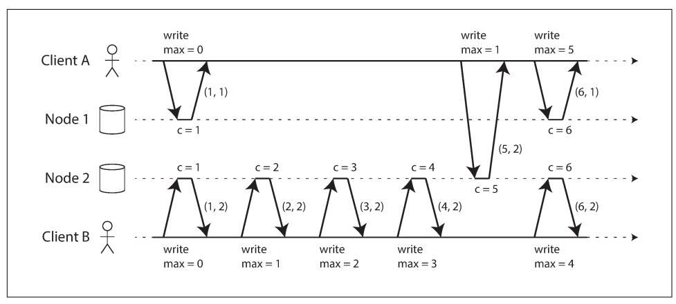

*Figure 9-8. Lamport timestamps provide a total ordering consistent with causality.*

A Lamport timestamp bears no relationship to a physical time-of-day clock, but it provides total ordering: if you have two timestamps, the one with a greater counter value is the greater timestamp; if the counter values are the same, the one with the greater node ID is the greater timestamp.

So far this description is essentially the same as the even/odd counters described in the last section. The key idea about Lamport timestamps, which makes them consis‐ tent with causality, is the following: every node and every client keeps track of the *maximum* counter value it has seen so far, and includes that maximum on every request. When a node receives a request or response with a maximum counter value greater than its own counter value, it immediately increases its own counter to that maximum.

This is shown in Figure 9-8, where client A receives a counter value of 5 from node 2, and then sends that maximum of 5 to node 1. At that time, node 1's counter was only 1, but it was immediately moved forward to 5, so the next operation had an incre‐ mented counter value of 6.

As long as the maximum counter value is carried along with every operation, this scheme ensures that the ordering from the Lamport timestamps is consistent with causality, because every causal dependency results in an increased timestamp.

Lamport timestamps are sometimes confused with version vectors, which we saw in ["Detecting Concurrent Writes" on page 184](#page-205-0). Although there are some similarities, they have a different purpose: version vectors can distinguish whether two operations are concurrent or whether one is causally dependent on the other, whereas Lamport timestamps always enforce a total ordering. From the total ordering of Lamport time‐ <span id="page-368-0"></span>stamps, you cannot tell whether two operations are concurrent or whether they are causally dependent. The advantage of Lamport timestamps over version vectors is that they are more compact.

#### **Timestamp ordering is not sufficient**

Although Lamport timestamps define a total order of operations that is consistent with causality, they are not quite sufficient to solve many common problems in dis‐ tributed systems.

For example, consider a system that needs to ensure that a username uniquely identi‐ fies a user account. If two users concurrently try to create an account with the same username, one of the two should succeed and the other should fail. (We touched on this problem previously in ["The leader and the lock" on page 301.](#page-322-0))

At first glance, it seems as though a total ordering of operations (e.g., using Lamport timestamps) should be sufficient to solve this problem: if two accounts with the same username are created, pick the one with the lower timestamp as the winner (the one who grabbed the username first), and let the one with the greater timestamp fail. Since timestamps are totally ordered, this comparison is always valid.

This approach works for determining the winner after the fact: once you have collec‐ ted all the username creation operations in the system, you can compare their time‐ stamps. However, it is not sufficient when a node has just received a request from a user to create a username, and needs to decide *right now* whether the request should succeed or fail. At that moment, the node does not know whether another node is concurrently in the process of creating an account with the same username, and what timestamp that other node may assign to the operation.

In order to be sure that no other node is in the process of concurrently creating an account with the same username and a lower timestamp, you would have to check with every other node to see what it is doing [\[56](#page-400-0)]. If one of the other nodes has failed or cannot be reached due to a network problem, this system would grind to a halt. This is not the kind of fault-tolerant system that we need.

The problem here is that the total order of operations only emerges after you have collected all of the operations. If another node has generated some operations, but you don't yet know what they are, you cannot construct the final ordering of opera‐ tions: the unknown operations from the other node may need to be inserted at vari‐ ous positions in the total order.

To conclude: in order to implement something like a uniqueness constraint for user‐ names, it's not sufficient to have a total ordering of operations—you also need to know when that order is finalized. If you have an operation to create a username, and you are sure that no other node can insert a claim for the same username ahead of your operation in the total order, then you can safely declare the operation successful.

<span id="page-369-0"></span>This idea of knowing when your total order is finalized is captured in the topic of *total order broadcast*.

## **Total Order Broadcast**

If your program runs only on a single CPU core, it is easy to define a total ordering of operations: it is simply the order in which they were executed by the CPU. However, in a distributed system, getting all nodes to agree on the same total ordering of opera‐ tions is tricky. In the last section we discussed ordering by timestamps or sequence numbers, but found that it is not as powerful as single-leader replication (if you use timestamp ordering to implement a uniqueness constraint, you cannot tolerate any faults).

As discussed, single-leader replication determines a total order of operations by choosing one node as the leader and sequencing all operations on a single CPU core on the leader. The challenge then is how to scale the system if the throughput is greater than a single leader can handle, and also how to handle failover if the leader fails (see ["Handling Node Outages" on page 156\)](#page-177-0). In the distributed systems litera‐ ture, this problem is known as *total order broadcast* or *atomic broadcast* [\[25](#page-398-0), [57,](#page-401-0) [58\]](#page-401-0).ix


#### **Scope of ordering guarantee**

Partitioned databases with a single leader per partition often main‐ tain ordering only per partition, which means they cannot offer consistency guarantees (e.g., consistent snapshots, foreign key ref‐ erences) across partitions. Total ordering across all partitions is possible, but requires additional coordination [[59](#page-401-0)].

Total order broadcast is usually described as a protocol for exchanging messages between nodes. Informally, it requires that two safety properties always be satisfied:

## *Reliable delivery*

No messages are lost: if a message is delivered to one node, it is delivered to all nodes.

## *Totally ordered delivery*

Messages are delivered to every node in the same order.

A correct algorithm for total order broadcast must ensure that the reliability and ordering properties are always satisfied, even if a node or the network is faulty. Of

ix. The term *atomic broadcast* is traditional, but it is very confusing as it's inconsistent with other uses of the word *atomic*: it has nothing to do with atomicity in ACID transactions and is only indirectly related to atomic operations (in the sense of multi-threaded programming) or atomic registers (linearizable storage). The term *total order multicast* is another synonym.

<span id="page-370-0"></span>course, messages will not be delivered while the network is interrupted, but an algo‐ rithm can keep retrying so that the messages get through when the network is even‐ tually repaired (and then they must still be delivered in the correct order).

#### **Using total order broadcast**

Consensus services such as ZooKeeper and etcd actually implement total order broadcast. This fact is a hint that there is a strong connection between total order broadcast and consensus, which we will explore later in this chapter.

Total order broadcast is exactly what you need for database replication: if every mes‐ sage represents a write to the database, and every replica processes the same writes in the same order, then the replicas will remain consistent with each other (aside from any temporary replication lag). This principle is known as *state machine replication* [[60\]](#page-401-0), and we will return to it in [Chapter 11](#page-460-0).

Similarly, total order broadcast can be used to implement serializable transactions: as discussed in ["Actual Serial Execution" on page 252,](#page-273-0) if every message represents a deterministic transaction to be executed as a stored procedure, and if every node pro‐ cesses those messages in the same order, then the partitions and replicas of the data‐ base are kept consistent with each other [\[61](#page-401-0)].

An important aspect of total order broadcast is that the order is fixed at the time the messages are delivered: a node is not allowed to retroactively insert a message into an earlier position in the order if subsequent messages have already been delivered. This fact makes total order broadcast stronger than timestamp ordering.

Another way of looking at total order broadcast is that it is a way of creating a *log* (as in a replication log, transaction log, or write-ahead log): delivering a message is like appending to the log. Since all nodes must deliver the same messages in the same order, all nodes can read the log and see the same sequence of messages.

Total order broadcast is also useful for implementing a lock service that provides fencing tokens (see ["Fencing tokens" on page 303](#page-324-0)). Every request to acquire the lock is appended as a message to the log, and all messages are sequentially numbered in the order they appear in the log. The sequence number can then serve as a fencing token, because it is monotonically increasing. In ZooKeeper, this sequence number is called zxid [[15\]](#page-397-0).

## <span id="page-371-0"></span>**Implementing linearizable storage using total order broadcast**

As illustrated in [Figure 9-4](#page-349-0), in a linearizable system there is a total order of opera‐ tions. Does that mean linearizability is the same as total order broadcast? Not quite, but there are close links between the two.<sup>x</sup>

Total order broadcast is asynchronous: messages are guaranteed to be delivered relia‐ bly in a fixed order, but there is no guarantee about *when* a message will be delivered (so one recipient may lag behind the others). By contrast, linearizability is a recency guarantee: a read is guaranteed to see the latest value written.

However, if you have total order broadcast, you can build linearizable storage on top of it. For example, you can ensure that usernames uniquely identify user accounts.

Imagine that for every possible username, you can have a linearizable register with an atomic compare-and-set operation. Every register initially has the value null (indi‐ cating that the username is not taken). When a user wants to create a username, you execute a compare-and-set operation on the register for that username, setting it to the user account ID, under the condition that the previous register value is null. If multiple users try to concurrently grab the same username, only one of the compareand-set operations will succeed, because the others will see a value other than null (due to linearizability).

You can implement such a linearizable compare-and-set operation as follows by using total order broadcast as an append-only log [\[62](#page-401-0), [63\]](#page-401-0):

- 1. Append a message to the log, tentatively indicating the username you want to claim.
- 2. Read the log, and wait for the message you appended to be delivered back to you.xi
- 3. Check for any messages claiming the username that you want. If the first message for your desired username is your own message, then you are successful: you can commit the username claim (perhaps by appending another message to the log) and acknowledge it to the client. If the first message for your desired username is from another user, you abort the operation.

x. In a formal sense, a linearizable read-write register is an "easier" problem. Total order broadcast is equiva‐ lent to consensus [[67](#page-401-0)], which has no deterministic solution in the asynchronous crash-stop model [[68](#page-401-0)], whereas a linearizable read-write register *can* be implemented in the same system model [[23](#page-398-0), [24, 25](#page-398-0)]. How‐ ever, supporting atomic operations such as compare-and-set or increment-and-get in a register makes it equivalent to consensus [[28](#page-398-0)]. Thus, the problems of consensus and a linearizable register are closely related.

xi. If you don't wait, but acknowledge the write immediately after it has been enqueued, you get something similar to the memory consistency model of multi-core x86 processors [\[43](#page-399-0)]. That model is neither lineariza‐ ble nor sequentially consistent.

<span id="page-372-0"></span>Because log entries are delivered to all nodes in the same order, if there are several concurrent writes, all nodes will agree on which one came first. Choosing the first of the conflicting writes as the winner and aborting later ones ensures that all nodes agree on whether a write was committed or aborted. A similar approach can be used to implement serializable multi-object transactions on top of a log [\[62](#page-401-0)].

While this procedure ensures linearizable writes, it doesn't guarantee linearizable reads—if you read from a store that is asynchronously updated from the log, it may be stale. (To be precise, the procedure described here provides *sequential consistency* [[47,](#page-400-0) [64](#page-401-0)], sometimes also known as *timeline consistency* [\[65](#page-401-0), [66](#page-401-0)], a slightly weaker guarantee than linearizability.) To make reads linearizable, there are a few options:

- You can sequence reads through the log by appending a message, reading the log, and performing the actual read when the message is delivered back to you. The message's position in the log thus defines the point in time at which the read happens. (Quorum reads in etcd work somewhat like this [[16](#page-397-0)].)
- If the log allows you to fetch the position of the latest log message in a lineariza‐ ble way, you can query that position, wait for all entries up to that position to be delivered to you, and then perform the read. (This is the idea behind Zoo‐ Keeper's sync() operation [[15\]](#page-397-0).)
- You can make your read from a replica that is synchronously updated on writes, and is thus sure to be up to date. (This technique is used in chain replication [[63\]](#page-401-0); see also ["Research on Replication" on page 155](#page-176-0).)

## **Implementing total order broadcast using linearizable storage**

The last section showed how to build a linearizable compare-and-set operation from total order broadcast. We can also turn it around, assume that we have linearizable storage, and show how to build total order broadcast from it.

The easiest way is to assume you have a linearizable register that stores an integer and that has an atomic increment-and-get operation [[28\]](#page-398-0). Alternatively, an atomic compare-and-set operation would also do the job.

The algorithm is simple: for every message you want to send through total order broadcast, you increment-and-get the linearizable integer, and then attach the value you got from the register as a sequence number to the message. You can then send the message to all nodes (resending any lost messages), and the recipients will deliver the messages consecutively by sequence number.

Note that unlike Lamport timestamps, the numbers you get from incrementing the linearizable register form a sequence with no gaps. Thus, if a node has delivered mes‐ sage 4 and receives an incoming message with a sequence number of 6, it knows that it must wait for message 5 before it can deliver message 6. The same is not the case <span id="page-373-0"></span>with Lamport timestamps—in fact, this is the key difference between total order broadcast and timestamp ordering.

How hard could it be to make a linearizable integer with an atomic increment-andget operation? As usual, if things never failed, it would be easy: you could just keep it in a variable on one node. The problem lies in handling the situation when network connections to that node are interrupted, and restoring the value when that node fails [[59\]](#page-401-0). In general, if you think hard enough about linearizable sequence number gener‐ ators, you inevitably end up with a consensus algorithm.

This is no coincidence: it can be proved that a linearizable compare-and-set (or increment-and-get) register and total order broadcast are both *equivalent to consen‐ sus* [[28](#page-398-0), [67](#page-401-0)]. That is, if you can solve one of these problems, you can transform it into a solution for the others. This is quite a profound and surprising insight!

It is time to finally tackle the consensus problem head-on, which we will do in the rest of this chapter.

## **Distributed Transactions and Consensus**

Consensus is one of the most important and fundamental problems in distributed computing. On the surface, it seems simple: informally, the goal is simply to *get sev‐ eral nodes to agree on something*. You might think that this shouldn't be too hard. Unfortunately, many broken systems have been built in the mistaken belief that this problem is easy to solve.

Although consensus is very important, the section about it appears late in this book because the topic is quite subtle, and appreciating the subtleties requires some pre‐ requisite knowledge. Even in the academic research community, the understanding of consensus only gradually crystallized over the course of decades, with many mis‐ understandings along the way. Now that we have discussed replication [\(Chapter 5\)](#page-172-0), transactions [\(Chapter 7\)](#page-242-0), system models ([Chapter 8\)](#page-294-0), linearizability, and total order broadcast (this chapter), we are finally ready to tackle the consensus problem.

There are a number of situations in which it is important for nodes to agree. For example:

#### *Leader election*

In a database with single-leader replication, all nodes need to agree on which node is the leader. The leadership position might become contested if some nodes can't communicate with others due to a network fault. In this case, con‐ sensus is important to avoid a bad failover, resulting in a split brain situation in which two nodes both believe themselves to be the leader (see ["Handling Node](#page-177-0) [Outages" on page 156\)](#page-177-0). If there were two leaders, they would both accept writes and their data would diverge, leading to inconsistency and data loss.

#### <span id="page-374-0"></span>*Atomic commit*

In a database that supports transactions spanning several nodes or partitions, we have the problem that a transaction may fail on some nodes but succeed on oth‐ ers. If we want to maintain transaction atomicity (in the sense of ACID; see ["Atomicity" on page 223\)](#page-244-0), we have to get all nodes to agree on the outcome of the transaction: either they all abort/roll back (if anything goes wrong) or they all commit (if nothing goes wrong). This instance of consensus is known as the *atomic commit* problem.xii

## **The Impossibility of Consensus**

You may have heard about the FLP result [[68](#page-401-0)]—named after the authors Fischer, Lynch, and Paterson—which proves that there is no algorithm that is always able to reach consensus if there is a risk that a node may crash. In a distributed system, we must assume that nodes may crash, so reliable consensus is impossible. Yet, here we are, discussing algorithms for achieving consensus. What is going on here?

The answer is that the FLP result is proved in the asynchronous system model (see ["System Model and Reality" on page 306\)](#page-327-0), a very restrictive model that assumes a deterministic algorithm that cannot use any clocks or timeouts. If the algorithm is allowed to use timeouts, or some other way of identifying suspected crashed nodes (even if the suspicion is sometimes wrong), then consensus becomes solvable [[67](#page-401-0)]. Even just allowing the algorithm to use random numbers is sufficient to get around the impossibility result [[69](#page-402-0)].

Thus, although the FLP result about the impossibility of consensus is of great theoret‐ ical importance, distributed systems can usually achieve consensus in practice.

In this section we will first examine the atomic commit problem in more detail. In particular, we will discuss the *two-phase commit* (2PC) algorithm, which is the most common way of solving atomic commit and which is implemented in various data‐ bases, messaging systems, and application servers. It turns out that 2PC is a kind of consensus algorithm—but not a very good one [\[70](#page-402-0), [71](#page-402-0)].

By learning from 2PC we will then work our way toward better consensus algorithms, such as those used in ZooKeeper (Zab) and etcd (Raft).

xii. Atomic commit is formalized slightly differently from consensus: an atomic transaction can commit only if *all* participants vote to commit, and must abort if any participant needs to abort. Consensus is allowed to decide on *any* value that is proposed by one of the participants. However, atomic commit and consensus are reducible to each other [\[70, 71](#page-402-0)]. *Nonblocking* atomic commit is harder than consensus—see ["Three-phase](#page-380-0) [commit" on page 359.](#page-380-0)

## <span id="page-375-0"></span>**Atomic Commit and Two-Phase Commit (2PC)**

In [Chapter 7](#page-242-0) we learned that the purpose of transaction atomicity is to provide sim‐ ple semantics in the case where something goes wrong in the middle of making sev‐ eral writes. The outcome of a transaction is either a successful *commit*, in which case all of the transaction's writes are made durable, or an *abort*, in which case all of the transaction's writes are rolled back (i.e., undone or discarded).

Atomicity prevents failed transactions from littering the database with half-finished results and half-updated state. This is especially important for multi-object transac‐ tions (see ["Single-Object and Multi-Object Operations" on page 228\)](#page-249-0) and databases that maintain secondary indexes. Each secondary index is a separate data structure from the primary data—thus, if you modify some data, the corresponding change needs to also be made in the secondary index. Atomicity ensures that the secondary index stays consistent with the primary data (if the index became inconsistent with the primary data, it would not be very useful).

## **From single-node to distributed atomic commit**

For transactions that execute at a single database node, atomicity is commonly imple‐ mented by the storage engine. When the client asks the database node to commit the transaction, the database makes the transaction's writes durable (typically in a writeahead log; see ["Making B-trees reliable" on page 82](#page-103-0)) and then appends a commit record to the log on disk. If the database crashes in the middle of this process, the transaction is recovered from the log when the node restarts: if the commit record was successfully written to disk before the crash, the transaction is considered com‐ mitted; if not, any writes from that transaction are rolled back.

Thus, on a single node, transaction commitment crucially depends on the *order* in which data is durably written to disk: first the data, then the commit record [[72\]](#page-402-0). The key deciding moment for whether the transaction commits or aborts is the moment at which the disk finishes writing the commit record: before that moment, it is still possible to abort (due to a crash), but after that moment, the transaction is commit‐ ted (even if the database crashes). Thus, it is a single device (the controller of one par‐ ticular disk drive, attached to one particular node) that makes the commit atomic.

However, what if multiple nodes are involved in a transaction? For example, perhaps you have a multi-object transaction in a partitioned database, or a term-partitioned secondary index (in which the index entry may be on a different node from the pri‐ mary data; see ["Partitioning and Secondary Indexes" on page 206\)](#page-227-0). Most "NoSQL" distributed datastores do not support such distributed transactions, but various clus‐ tered relational systems do (see ["Distributed Transactions in Practice" on page 360](#page-381-0)).

In these cases, it is not sufficient to simply send a commit request to all of the nodes and independently commit the transaction on each one. In doing so, it could easily

<span id="page-376-0"></span>happen that the commit succeeds on some nodes and fails on other nodes, which would violate the atomicity guarantee:

- Some nodes may detect a constraint violation or conflict, making an abort neces‐ sary, while other nodes are successfully able to commit.
- Some of the commit requests might be lost in the network, eventually aborting due to a timeout, while other commit requests get through.
- Some nodes may crash before the commit record is fully written and roll back on recovery, while others successfully commit.

If some nodes commit the transaction but others abort it, the nodes become inconsis‐ tent with each other (like in [Figure 7-3](#page-250-0)). And once a transaction has been committed on one node, it cannot be retracted again if it later turns out that it was aborted on another node. For this reason, a node must only commit once it is certain that all other nodes in the transaction are also going to commit.

A transaction commit must be irrevocable—you are not allowed to change your mind and retroactively abort a transaction after it has been committed. The reason for this rule is that once data has been committed, it becomes visible to other transac‐ tions, and thus other clients may start relying on that data; this principle forms the basis of *read committed* isolation, discussed in ["Read Committed" on page 234.](#page-255-0) If a transaction was allowed to abort after committing, any transactions that read the committed data would be based on data that was retroactively declared not to have existed—so they would have to be reverted as well.

(It is possible for the effects of a committed transaction to later be undone by another, *compensating transaction* [[73](#page-402-0), [74](#page-402-0)]. However, from the database's point of view this is a separate transaction, and thus any cross-transaction correctness requirements are the application's problem.)

## **Introduction to two-phase commit**

Two-phase commit is an algorithm for achieving atomic transaction commit across multiple nodes—i.e., to ensure that either all nodes commit or all nodes abort. It is a classic algorithm in distributed databases [[13](#page-397-0), [35](#page-399-0), [75\]](#page-402-0). 2PC is used internally in some databases and also made available to applications in the form of *XA transactions* [[76,](#page-402-0) [77](#page-402-0)] (which are supported by the Java Transaction API, for example) or via WS-AtomicTransaction for SOAP web services [[78](#page-402-0), [79\]](#page-402-0).

The basic flow of 2PC is illustrated in [Figure 9-9](#page-377-0). Instead of a single commit request, as with a single-node transaction, the commit/abort process in 2PC is split into two phases (hence the name).

<span id="page-377-0"></span>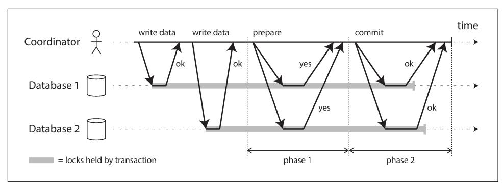

*Figure 9-9. A successful execution of two-phase commit (2PC).*


#### **Don't confuse 2PC and 2PL**

Two-phase *commit* (2PC) and two-phase *locking* (see ["Two-Phase](#page-278-0) [Locking \(2PL\)" on page 257\)](#page-278-0) are two very different things. 2PC provides atomic commit in a distributed database, whereas 2PL provides serializable isolation. To avoid confusion, it's best to think of them as entirely separate concepts and to ignore the unfortunate similarity in the names.

2PC uses a new component that does not normally appear in single-node transac‐ tions: a *coordinator* (also known as *transaction manager*). The coordinator is often implemented as a library within the same application process that is requesting the transaction (e.g., embedded in a Java EE container), but it can also be a separate pro‐ cess or service. Examples of such coordinators include Narayana, JOTM, BTM, or MSDTC.

A 2PC transaction begins with the application reading and writing data on multiple database nodes, as normal. We call these database nodes *participants* in the transac‐ tion. When the application is ready to commit, the coordinator begins phase 1: it sends a *prepare* request to each of the nodes, asking them whether they are able to commit. The coordinator then tracks the responses from the participants:

- If all participants reply "yes," indicating they are ready to commit, then the coor‐ dinator sends out a *commit* request in phase 2, and the commit actually takes place.
- If any of the participants replies "no," the coordinator sends an *abort* request to all nodes in phase 2.

This process is somewhat like the traditional marriage ceremony in Western cultures: the minister asks the bride and groom individually whether each wants to marry the other, and typically receives the answer "I do" from both. After receiving both

<span id="page-378-0"></span>acknowledgments, the minister pronounces the couple husband and wife: the trans‐ action is committed, and the happy fact is broadcast to all attendees. If either bride or groom does not say "yes," the ceremony is aborted [\[73](#page-402-0)].

#### **A system of promises**

From this short description it might not be clear why two-phase commit ensures atomicity, while one-phase commit across several nodes does not. Surely the prepare and commit requests can just as easily be lost in the two-phase case. What makes 2PC different?

To understand why it works, we have to break down the process in a bit more detail:

- 1. When the application wants to begin a distributed transaction, it requests a transaction ID from the coordinator. This transaction ID is globally unique.
- 2. The application begins a single-node transaction on each of the participants, and attaches the globally unique transaction ID to the single-node transaction. All reads and writes are done in one of these single-node transactions. If anything goes wrong at this stage (for example, a node crashes or a request times out), the coordinator or any of the participants can abort.
- 3. When the application is ready to commit, the coordinator sends a prepare request to all participants, tagged with the global transaction ID. If any of these requests fails or times out, the coordinator sends an abort request for that trans‐ action ID to all participants.
- 4. When a participant receives the prepare request, it makes sure that it can defi‐ nitely commit the transaction under all circumstances. This includes writing all transaction data to disk (a crash, a power failure, or running out of disk space is not an acceptable excuse for refusing to commit later), and checking for any con‐ flicts or constraint violations. By replying "yes" to the coordinator, the node promises to commit the transaction without error if requested. In other words, the participant surrenders the right to abort the transaction, but without actually committing it.
- 5. When the coordinator has received responses to all prepare requests, it makes a definitive decision on whether to commit or abort the transaction (committing only if all participants voted "yes"). The coordinator must write that decision to its transaction log on disk so that it knows which way it decided in case it subse‐ quently crashes. This is called the *commit point*.
- 6. Once the coordinator's decision has been written to disk, the commit or abort request is sent to all participants. If this request fails or times out, the coordinator must retry forever until it succeeds. There is no more going back: if the decision was to commit, that decision must be enforced, no matter how many retries it takes. If a participant has crashed in the meantime, the transaction will be com‐

<span id="page-379-0"></span>mitted when it recovers—since the participant voted "yes," it cannot refuse to commit when it recovers.

Thus, the protocol contains two crucial "points of no return": when a participant votes "yes," it promises that it will definitely be able to commit later (although the coordinator may still choose to abort); and once the coordinator decides, that deci‐ sion is irrevocable. Those promises ensure the atomicity of 2PC. (Single-node atomic commit lumps these two events into one: writing the commit record to the transac‐ tion log.)

Returning to the marriage analogy, before saying "I do," you and your bride/groom have the freedom to abort the transaction by saying "No way!" (or something to that effect). However, after saying "I do," you cannot retract that statement. If you faint after saying "I do" and you don't hear the minister speak the words "You are now husband and wife," that doesn't change the fact that the transaction was committed. When you recover consciousness later, you can find out whether you are married or not by querying the minister for the status of your global transaction ID, or you can wait for the minister's next retry of the commit request (since the retries will have continued throughout your period of unconsciousness).

## **Coordinator failure**

We have discussed what happens if one of the participants or the network fails during 2PC: if any of the prepare requests fail or time out, the coordinator aborts the trans‐ action; if any of the commit or abort requests fail, the coordinator retries them indefi‐ nitely. However, it is less clear what happens if the coordinator crashes.

If the coordinator fails before sending the prepare requests, a participant can safely abort the transaction. But once the participant has received a prepare request and voted "yes," it can no longer abort unilaterally—it must wait to hear back from the coordinator whether the transaction was committed or aborted. If the coordinator crashes or the network fails at this point, the participant can do nothing but wait. A participant's transaction in this state is called *in doubt* or *uncertain*.

The situation is illustrated in [Figure 9-10.](#page-380-0) In this particular example, the coordinator actually decided to commit, and database 2 received the commit request. However, the coordinator crashed before it could send the commit request to database 1, and so database 1 does not know whether to commit or abort. Even a timeout does not help here: if database 1 unilaterally aborts after a timeout, it will end up inconsistent with database 2, which has committed. Similarly, it is not safe to unilaterally commit, because another participant may have aborted.

<span id="page-380-0"></span>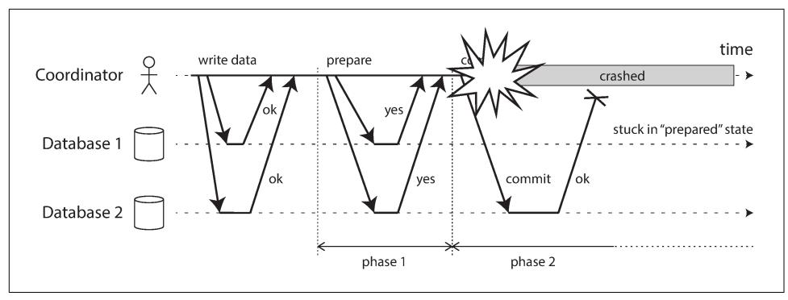

*Figure 9-10. The coordinator crashes after participants vote "yes." Database 1 does not know whether to commit or abort.*

Without hearing from the coordinator, the participant has no way of knowing whether to commit or abort. In principle, the participants could communicate among themselves to find out how each participant voted and come to some agreement, but that is not part of the 2PC protocol.

The only way 2PC can complete is by waiting for the coordinator to recover. This is why the coordinator must write its commit or abort decision to a transaction log on disk before sending commit or abort requests to participants: when the coordinator recovers, it determines the status of all in-doubt transactions by reading its transac‐ tion log. Any transactions that don't have a commit record in the coordinator's log are aborted. Thus, the commit point of 2PC comes down to a regular single-node atomic commit on the coordinator.

## **Three-phase commit**

Two-phase commit is called a *blocking* atomic commit protocol due to the fact that 2PC can become stuck waiting for the coordinator to recover. In theory, it is possible to make an atomic commit protocol *nonblocking*, so that it does not get stuck if a node fails. However, making this work in practice is not so straightforward.

As an alternative to 2PC, an algorithm called *three-phase commit* (3PC) has been pro‐ posed [[13,](#page-397-0) [80\]](#page-402-0). However, 3PC assumes a network with bounded delay and nodes with bounded response times; in most practical systems with unbounded network delay and process pauses (see [Chapter 8\)](#page-294-0), it cannot guarantee atomicity.

In general, nonblocking atomic commit requires a *perfect failure detector* [[67,](#page-401-0) [71\]](#page-402-0) i.e., a reliable mechanism for telling whether a node has crashed or not. In a network with unbounded delay a timeout is not a reliable failure detector, because a request may time out due to a network problem even if no node has crashed. For this reason, 2PC continues to be used, despite the known problem with coordinator failure.

## <span id="page-381-0"></span>**Distributed Transactions in Practice**

Distributed transactions, especially those implemented with two-phase commit, have a mixed reputation. On the one hand, they are seen as providing an important safety guarantee that would be hard to achieve otherwise; on the other hand, they are criti‐ cized for causing operational problems, killing performance, and promising more than they can deliver [[81,](#page-402-0) [82](#page-403-0), [83,](#page-403-0) [84\]](#page-403-0). Many cloud services choose not to implement distributed transactions due to the operational problems they engender [\[85](#page-403-0), [86](#page-403-0)].

Some implementations of distributed transactions carry a heavy performance penalty —for example, distributed transactions in MySQL are reported to be over 10 times slower than single-node transactions [\[87](#page-403-0)], so it is not surprising when people advise against using them. Much of the performance cost inherent in two-phase commit is due to the additional disk forcing (fsync) that is required for crash recovery [[88\]](#page-403-0), and the additional network round-trips.

However, rather than dismissing distributed transactions outright, we should exam‐ ine them in some more detail, because there are important lessons to be learned from them. To begin, we should be precise about what we mean by "distributed transac‐ tions." Two quite different types of distributed transactions are often conflated:

## *Database-internal distributed transactions*

Some distributed databases (i.e., databases that use replication and partitioning in their standard configuration) support internal transactions among the nodes of that database. For example, VoltDB and MySQL Cluster's NDB storage engine have such internal transaction support. In this case, all the nodes participating in the transaction are running the same database software.

#### *Heterogeneous distributed transactions*

In a *heterogeneous* transaction, the participants are two or more different tech‐ nologies: for example, two databases from different vendors, or even nondatabase systems such as message brokers. A distributed transaction across these systems must ensure atomic commit, even though the systems may be entirely different under the hood.

Database-internal transactions do not have to be compatible with any other system, so they can use any protocol and apply optimizations specific to that particular tech‐ nology. For that reason, database-internal distributed transactions can often work quite well. On the other hand, transactions spanning heterogeneous technologies are a lot more challenging.

## **Exactly-once message processing**

Heterogeneous distributed transactions allow diverse systems to be integrated in powerful ways. For example, a message from a message queue can be acknowledged as processed if and only if the database transaction for processing the message was

<span id="page-382-0"></span>successfully committed. This is implemented by atomically committing the message acknowledgment and the database writes in a single transaction. With distributed transaction support, this is possible, even if the message broker and the database are two unrelated technologies running on different machines.

If either the message delivery or the database transaction fails, both are aborted, and so the message broker may safely redeliver the message later. Thus, by atomically committing the message and the side effects of its processing, we can ensure that the message is *effectively* processed exactly once, even if it required a few retries before it succeeded. The abort discards any side effects of the partially completed transaction.

Such a distributed transaction is only possible if all systems affected by the transac‐ tion are able to use the same atomic commit protocol, however. For example, say a side effect of processing a message is to send an email, and the email server does not support two-phase commit: it could happen that the email is sent two or more times if message processing fails and is retried. But if all side effects of processing a message are rolled back on transaction abort, then the processing step can safely be retried as if nothing had happened.

We will return to the topic of exactly-once message processing in [Chapter 11.](#page-460-0) Let's look first at the atomic commit protocol that allows such heterogeneous distributed transactions.

#### **XA transactions**

*X/Open XA* (short for *eXtended Architecture*) is a standard for implementing twophase commit across heterogeneous technologies [[76,](#page-402-0) [77](#page-402-0)]. It was introduced in 1991 and has been widely implemented: XA is supported by many traditional relational databases (including PostgreSQL, MySQL, DB2, SQL Server, and Oracle) and mes‐ sage brokers (including ActiveMQ, HornetQ, MSMQ, and IBM MQ).

XA is not a network protocol—it is merely a C API for interfacing with a transaction coordinator. Bindings for this API exist in other languages; for example, in the world of Java EE applications, XA transactions are implemented using the Java Transaction API (JTA), which in turn is supported by many drivers for databases using Java Data‐ base Connectivity (JDBC) and drivers for message brokers using the Java Message Service (JMS) APIs.

XA assumes that your application uses a network driver or client library to commu‐ nicate with the participant databases or messaging services. If the driver supports XA, that means it calls the XA API to find out whether an operation should be part of a distributed transaction—and if so, it sends the necessary information to the database server. The driver also exposes callbacks through which the coordinator can ask the participant to prepare, commit, or abort.

<span id="page-383-0"></span>The transaction coordinator implements the XA API. The standard does not specify how it should be implemented, but in practice the coordinator is often simply a library that is loaded into the same process as the application issuing the transaction (not a separate service). It keeps track of the participants in a transaction, collects partipants' responses after asking them to prepare (via a callback into the driver), and uses a log on the local disk to keep track of the commit/abort decision for each trans‐ action.

If the application process crashes, or the machine on which the application is running dies, the coordinator goes with it. Any participants with prepared but uncommitted transactions are then stuck in doubt. Since the coordinator's log is on the application server's local disk, that server must be restarted, and the coordinator library must read the log to recover the commit/abort outcome of each transaction. Only then can the coordinator use the database driver's XA callbacks to ask participants to commit or abort, as appropriate. The database server cannot contact the coordinator directly, since all communication must go via its client library.

## **Holding locks while in doubt**

Why do we care so much about a transaction being stuck in doubt? Can't the rest of the system just get on with its work, and ignore the in-doubt transaction that will be cleaned up eventually?

The problem is with *locking*. As discussed in ["Read Committed" on page 234,](#page-255-0) data‐ base transactions usually take a row-level exclusive lock on any rows they modify, to prevent dirty writes. In addition, if you want serializable isolation, a database using two-phase locking would also have to take a shared lock on any rows *read* by the transaction (see ["Two-Phase Locking \(2PL\)" on page 257\)](#page-278-0).

The database cannot release those locks until the transaction commits or aborts (illustrated as a shaded area in [Figure 9-9\)](#page-377-0). Therefore, when using two-phase commit, a transaction must hold onto the locks throughout the time it is in doubt. If the coor‐ dinator has crashed and takes 20 minutes to start up again, those locks will be held for 20 minutes. If the coordinator's log is entirely lost for some reason, those locks will be held forever—or at least until the situation is manually resolved by an admin‐ istrator.

While those locks are held, no other transaction can modify those rows. Depending on the database, other transactions may even be blocked from reading those rows. Thus, other transactions cannot simply continue with their business—if they want to access that same data, they will be blocked. This can cause large parts of your applica‐ tion to become unavailable until the in-doubt transaction is resolved.

## <span id="page-384-0"></span>**Recovering from coordinator failure**

In theory, if the coordinator crashes and is restarted, it should cleanly recover its state from the log and resolve any in-doubt transactions. However, in practice, *orphaned* in-doubt transactions do occur [[89,](#page-403-0) [90\]](#page-403-0)—that is, transactions for which the coordina‐ tor cannot decide the outcome for whatever reason (e.g., because the transaction log has been lost or corrupted due to a software bug). These transactions cannot be resolved automatically, so they sit forever in the database, holding locks and blocking other transactions.

Even rebooting your database servers will not fix this problem, since a correct imple‐ mentation of 2PC must preserve the locks of an in-doubt transaction even across restarts (otherwise it would risk violating the atomicity guarantee). It's a sticky situation.

The only way out is for an administrator to manually decide whether to commit or roll back the transactions. The administrator must examine the participants of each in-doubt transaction, determine whether any participant has committed or aborted already, and then apply the same outcome to the other participants. Resolving the problem potentially requires a lot of manual effort, and most likely needs to be done under high stress and time pressure during a serious production outage (otherwise, why would the coordinator be in such a bad state?).

Many XA implementations have an emergency escape hatch called *heuristic decisions*: allowing a participant to unilaterally decide to abort or commit an in-doubt transac‐ tion without a definitive decision from the coordinator [[76,](#page-402-0) [77,](#page-402-0) [91](#page-403-0)]. To be clear, *heu‐ ristic* here is a euphemism for *probably breaking atomicity*, since it violates the system of promises in two-phase commit. Thus, heuristic decisions are intended only for getting out of catastrophic situations, and not for regular use.

#### **Limitations of distributed transactions**

XA transactions solve the real and important problem of keeping several participant data systems consistent with each other, but as we have seen, they also introduce major operational problems. In particular, the key realization is that the transaction coordinator is itself a kind of database (in which transaction outcomes are stored), and so it needs to be approached with the same care as any other important database:

- If the coordinator is not replicated but runs only on a single machine, it is a sin‐ gle point of failure for the entire system (since its failure causes other application servers to block on locks held by in-doubt transactions). Surprisingly, many coordinator implementations are not highly available by default, or have only rudimentary replication support.
- Many server-side applications are developed in a stateless model (as favored by HTTP), with all persistent state stored in a database, which has the advantage

<span id="page-385-0"></span>that application servers can be added and removed at will. However, when the coordinator is part of the application server, it changes the nature of the deploy‐ ment. Suddenly, the coordinator's logs become a crucial part of the durable sys‐ tem state—as important as the databases themselves, since the coordinator logs are required in order to recover in-doubt transactions after a crash. Such applica‐ tion servers are no longer stateless.

- Since XA needs to be compatible with a wide range of data systems, it is necessar‐ ily a lowest common denominator. For example, it cannot detect deadlocks across different systems (since that would require a standardized protocol for systems to exchange information on the locks that each transaction is waiting for), and it does not work with SSI (see ["Serializable Snapshot Isolation \(SSI\)" on](#page-282-0) [page 261](#page-282-0)), since that would require a protocol for identifying conflicts across dif‐ ferent systems.
- For database-internal distributed transactions (not XA), the limitations are not so great—for example, a distributed version of SSI is possible. However, there remains the problem that for 2PC to successfully commit a transaction, *all* par‐ ticipants must respond. Consequently, if *any* part of the system is broken, the transaction also fails. Distributed transactions thus have a tendency of *amplifying failures*, which runs counter to our goal of building fault-tolerant systems.

Do these facts mean we should give up all hope of keeping several systems consistent with each other? Not quite—there are alternative methods that allow us to achieve the same thing without the pain of heterogeneous distributed transactions. We will return to these in Chapters [11](#page-460-0) and [12](#page-510-0). But first, we should wrap up the topic of consensus.

## **Fault-Tolerant Consensus**

Informally, consensus means getting several nodes to agree on something. For exam‐ ple, if several people concurrently try to book the last seat on an airplane, or the same seat in a theater, or try to register an account with the same username, then a consen‐ sus algorithm could be used to determine which one of these mutually incompatible operations should be the winner.

The consensus problem is normally formalized as follows: one or more nodes may *propose* values, and the consensus algorithm *decides* on one of those values. In the seat-booking example, when several customers are concurrently trying to buy the last seat, each node handling a customer request may propose the ID of the customer it is serving, and the decision indicates which one of those customers got the seat.

<span id="page-386-0"></span>In this formalism, a consensus algorithm must satisfy the following properties [\[25](#page-398-0)]:xiii

*Uniform agreement*

No two nodes decide differently.

*Integrity*

No node decides twice.

*Validity*

If a node decides value *v*, then *v* was proposed by some node.

*Termination*

Every node that does not crash eventually decides some value.

The uniform agreement and integrity properties define the core idea of consensus: everyone decides on the same outcome, and once you have decided, you cannot change your mind. The validity property exists mostly to rule out trivial solutions: for example, you could have an algorithm that always decides null, no matter what was proposed; this algorithm would satisfy the agreement and integrity properties, but not the validity property.

If you don't care about fault tolerance, then satisfying the first three properties is easy: you can just hardcode one node to be the "dictator," and let that node make all of the decisions. However, if that one node fails, then the system can no longer make any decisions. This is, in fact, what we saw in the case of two-phase commit: if the coordinator fails, in-doubt participants cannot decide whether to commit or abort.

The termination property formalizes the idea of fault tolerance. It essentially says that a consensus algorithm cannot simply sit around and do nothing forever—in other words, it must make progress. Even if some nodes fail, the other nodes must still reach a decision. (Termination is a liveness property, whereas the other three are safety properties—see ["Safety and liveness" on page 308](#page-329-0).)

The system model of consensus assumes that when a node "crashes," it suddenly dis‐ appears and never comes back. (Instead of a software crash, imagine that there is an earthquake, and the datacenter containing your node is destroyed by a landslide. You must assume that your node is buried under 30 feet of mud and is never going to come back online.) In this system model, any algorithm that has to wait for a node to recover is not going to be able to satisfy the termination property. In particular, 2PC does not meet the requirements for termination.

xiii. This particular variant of consensus is called *uniform consensus*, which is equivalent to regular consensus in asynchronous systems with unreliable failure detectors [\[71\]](#page-402-0). The academic literature usually refers to *pro‐ cesses* rather than *nodes*, but we use *nodes* here for consistency with the rest of this book.

<span id="page-387-0"></span>Of course, if *all* nodes crash and none of them are running, then it is not possible for any algorithm to decide anything. There is a limit to the number of failures that an algorithm can tolerate: in fact, it can be proved that any consensus algorithm requires at least a majority of nodes to be functioning correctly in order to assure termination [[67\]](#page-401-0). That majority can safely form a quorum (see ["Quorums for reading and writ‐](#page-200-0) [ing" on page 179\)](#page-200-0).

Thus, the termination property is subject to the assumption that fewer than half of the nodes are crashed or unreachable. However, most implementations of consensus ensure that the safety properties—agreement, integrity, and validity—are always met, even if a majority of nodes fail or there is a severe network problem [[92\]](#page-403-0). Thus, a large-scale outage can stop the system from being able to process requests, but it can‐ not corrupt the consensus system by causing it to make invalid decisions.

Most consensus algorithms assume that there are no Byzantine faults, as discussed in ["Byzantine Faults" on page 304.](#page-325-0) That is, if a node does not correctly follow the proto‐ col (for example, if it sends contradictory messages to different nodes), it may break the safety properties of the protocol. It is possible to make consensus robust against Byzantine faults as long as fewer than one-third of the nodes are Byzantine-faulty [[25,](#page-398-0) [93](#page-403-0)], but we don't have space to discuss those algorithms in detail in this book.

## **Consensus algorithms and total order broadcast**

The best-known fault-tolerant consensus algorithms are Viewstamped Replication (VSR) [\[94](#page-403-0), [95](#page-403-0)], Paxos [\[96](#page-403-0), [97](#page-404-0), [98](#page-404-0), [99\]](#page-404-0), Raft [[22,](#page-398-0) [100,](#page-404-0) [101\]](#page-404-0), and Zab [[15,](#page-397-0) [21,](#page-398-0) [102\]](#page-404-0). There are quite a few similarities between these algorithms, but they are not the same [[103\]](#page-404-0). In this book we won't go into full details of the different algorithms: it's sufficient to be aware of some of the high-level ideas that they have in common, unless you're implementing a consensus system yourself (which is probably not advisable—it's hard [[98,](#page-404-0) [104\]](#page-404-0)).

Most of these algorithms actually don't directly use the formal model described here (proposing and deciding on a single value, while satisfying the agreement, integrity, validity, and termination properties). Instead, they decide on a *sequence* of values, which makes them *total order broadcast* algorithms, as discussed previously in this chapter (see ["Total Order Broadcast" on page 348\)](#page-369-0).

Remember that total order broadcast requires messages to be delivered exactly once, in the same order, to all nodes. If you think about it, this is equivalent to performing several rounds of consensus: in each round, nodes propose the message that they want to send next, and then decide on the next message to be delivered in the total order [\[67](#page-401-0)].

So, total order broadcast is equivalent to repeated rounds of consensus (each consen‐ sus decision corresponding to one message delivery):

- <span id="page-388-0"></span>• Due to the agreement property of consensus, all nodes decide to deliver the same messages in the same order.
- Due to the integrity property, messages are not duplicated.
- Due to the validity property, messages are not corrupted and not fabricated out of thin air.
- Due to the termination property, messages are not lost.

Viewstamped Replication, Raft, and Zab implement total order broadcast directly, because that is more efficient than doing repeated rounds of one-value-at-a-time consensus. In the case of Paxos, this optimization is known as Multi-Paxos.

## **Single-leader replication and consensus**

In [Chapter 5](#page-172-0) we discussed single-leader replication (see ["Leaders and Followers" on](#page-173-0) [page 152](#page-173-0)), which takes all the writes to the leader and applies them to the followers in the same order, thus keeping replicas up to date. Isn't this essentially total order broadcast? How come we didn't have to worry about consensus in [Chapter 5?](#page-172-0)

The answer comes down to how the leader is chosen. If the leader is manually chosen and configured by the humans in your operations team, you essentially have a "con‐ sensus algorithm" of the dictatorial variety: only one node is allowed to accept writes (i.e., make decisions about the order of writes in the replication log), and if that node goes down, the system becomes unavailable for writes until the operators manually configure a different node to be the leader. Such a system can work well in practice, but it does not satisfy the termination property of consensus because it requires human intervention in order to make progress.

Some databases perform automatic leader election and failover, promoting a follower to be the new leader if the old leader fails (see ["Handling Node Outages"](#page-177-0) on page [156](#page-177-0)). This brings us closer to fault-tolerant total order broadcast, and thus to solving consensus.

However, there is a problem. We previously discussed the problem of split brain, and said that all nodes need to agree who the leader is—otherwise two different nodes could each believe themselves to be the leader, and consequently get the database into an inconsistent state. Thus, we need consensus in order to elect a leader. But if the consensus algorithms described here are actually total order broadcast algorithms, and total order broadcast is like single-leader replication, and single-leader replica‐ tion requires a leader, then…

It seems that in order to elect a leader, we first need a leader. In order to solve con‐ sensus, we must first solve consensus. How do we break out of this conundrum?

#### <span id="page-389-0"></span>**Epoch numbering and quorums**

All of the consensus protocols discussed so far internally use a leader in some form or another, but they don't guarantee that the leader is unique. Instead, they can make a weaker guarantee: the protocols define an *epoch number* (called the *ballot number* in Paxos, *view number* in Viewstamped Replication, and *term number* in Raft) and guarantee that within each epoch, the leader is unique.

Every time the current leader is thought to be dead, a vote is started among the nodes to elect a new leader. This election is given an incremented epoch number, and thus epoch numbers are totally ordered and monotonically increasing. If there is a conflict between two different leaders in two different epochs (perhaps because the previous leader actually wasn't dead after all), then the leader with the higher epoch number prevails.

Before a leader is allowed to decide anything, it must first check that there isn't some other leader with a higher epoch number which might take a conflicting decision. How does a leader know that it hasn't been ousted by another node? Recall ["The](#page-321-0) [Truth Is Defined by the Majority" on page 300:](#page-321-0) a node cannot necessarily trust its own judgment—just because a node thinks that it is the leader, that does not neces‐ sarily mean the other nodes accept it as their leader.

Instead, it must collect votes from a *quorum* of nodes (see ["Quorums for reading and](#page-200-0) [writing" on page 179](#page-200-0)). For every decision that a leader wants to make, it must send the proposed value to the other nodes and wait for a quorum of nodes to respond in favor of the proposal. The quorum typically, but not always, consists of a majority of nodes [[105\]](#page-404-0). A node votes in favor of a proposal only if it is not aware of any other leader with a higher epoch.

Thus, we have two rounds of voting: once to choose a leader, and a second time to vote on a leader's proposal. The key insight is that the quorums for those two votes must overlap: if a vote on a proposal succeeds, at least one of the nodes that voted for it must have also participated in the most recent leader election [[105](#page-404-0)]. Thus, if the vote on a proposal does not reveal any higher-numbered epoch, the current leader can conclude that no leader election with a higher epoch number has happened, and therefore be sure that it still holds the leadership. It can then safely decide the pro‐ posed value.

This voting process looks superficially similar to two-phase commit. The biggest dif‐ ferences are that in 2PC the coordinator is not elected, and that fault-tolerant consen‐ sus algorithms only require votes from a majority of nodes, whereas 2PC requires a "yes" vote from *every* participant. Moreover, consensus algorithms define a recovery process by which nodes can get into a consistent state after a new leader is elected, ensuring that the safety properties are always met. These differences are key to the correctness and fault tolerance of a consensus algorithm.

#### <span id="page-390-0"></span>**Limitations of consensus**

Consensus algorithms are a huge breakthrough for distributed systems: they bring concrete safety properties (agreement, integrity, and validity) to systems where every‐ thing else is uncertain, and they nevertheless remain fault-tolerant (able to make pro‐ gress as long as a majority of nodes are working and reachable). They provide total order broadcast, and therefore they can also implement linearizable atomic opera‐ tions in a fault-tolerant way (see ["Implementing linearizable storage using total order](#page-371-0) [broadcast" on page 350\)](#page-371-0).

Nevertheless, they are not used everywhere, because the benefits come at a cost.

The process by which nodes vote on proposals before they are decided is a kind of synchronous replication. As discussed in ["Synchronous Versus Asynchronous Repli‐](#page-174-0) [cation" on page 153,](#page-174-0) databases are often configured to use asynchronous replication. In this configuration, some committed data can potentially be lost on failover—but many people choose to accept this risk for the sake of better performance.

Consensus systems always require a strict majority to operate. This means you need a minimum of three nodes in order to tolerate one failure (the remaining two out of three form a majority), or a minimum of five nodes to tolerate two failures (the remaining three out of five form a majority). If a network failure cuts off some nodes from the rest, only the majority portion of the network can make progress, and the rest is blocked (see also ["The Cost of Linearizability" on page 335](#page-356-0)).

Most consensus algorithms assume a fixed set of nodes that participate in voting, which means that you can't just add or remove nodes in the cluster. *Dynamic mem‐ bership* extensions to consensus algorithms allow the set of nodes in the cluster to change over time, but they are much less well understood than static membership algorithms.

Consensus systems generally rely on timeouts to detect failed nodes. In environments with highly variable network delays, especially geographically distributed systems, it often happens that a node falsely believes the leader to have failed due to a transient network issue. Although this error does not harm the safety properties, frequent leader elections result in terrible performance because the system can end up spend‐ ing more time choosing a leader than doing any useful work.

Sometimes, consensus algorithms are particularly sensitive to network problems. For example, Raft has been shown to have unpleasant edge cases [[106\]](#page-404-0): if the entire net‐ work is working correctly except for one particular network link that is consistently unreliable, Raft can get into situations where leadership continually bounces between two nodes, or the current leader is continually forced to resign, so the system effec‐ tively never makes progress. Other consensus algorithms have similar problems, and designing algorithms that are more robust to unreliable networks is still an open research problem.

## <span id="page-391-0"></span>**Membership and Coordination Services**

Projects like ZooKeeper or etcd are often described as "distributed key-value stores" or "coordination and configuration services." The API of such a service looks pretty much like that of a database: you can read and write the value for a given key, and iterate over keys. So if they're basically databases, why do they go to all the effort of implementing a consensus algorithm? What makes them different from any other kind of database?

To understand this, it is helpful to briefly explore how a service like ZooKeeper is used. As an application developer, you will rarely need to use ZooKeeper directly, because it is actually not well suited as a general-purpose database. It is more likely that you will end up relying on it indirectly via some other project: for example, HBase, Hadoop YARN, OpenStack Nova, and Kafka all rely on ZooKeeper running in the background. What is it that these projects get from it?

ZooKeeper and etcd are designed to hold small amounts of data that can fit entirely in memory (although they still write to disk for durability)—so you wouldn't want to store all of your application's data here. That small amount of data is replicated across all the nodes using a fault-tolerant total order broadcast algorithm. As dis‐ cussed previously, total order broadcast is just what you need for database replica‐ tion: if each message represents a write to the database, applying the same writes in the same order keeps replicas consistent with each other.

ZooKeeper is modeled after Google's Chubby lock service [[14](#page-397-0), [98](#page-404-0)], implementing not only total order broadcast (and hence consensus), but also an interesting set of other features that turn out to be particularly useful when building distributed systems:

## *Linearizable atomic operations*

Using an atomic compare-and-set operation, you can implement a lock: if several nodes concurrently try to perform the same operation, only one of them will suc‐ ceed. The consensus protocol guarantees that the operation will be atomic and linearizable, even if a node fails or the network is interrupted at any point. A dis‐ tributed lock is usually implemented as a *lease*, which has an expiry time so that it is eventually released in case the client fails (see ["Process Pauses" on page 295](#page-316-0)).

## *Total ordering of operations*

As discussed in ["The leader and the lock" on page 301,](#page-322-0) when some resource is protected by a lock or lease, you need a *fencing token* to prevent clients from con‐ flicting with each other in the case of a process pause. The fencing token is some number that monotonically increases every time the lock is acquired. ZooKeeper provides this by totally ordering all operations and giving each operation a monotonically increasing transaction ID (zxid) and version number (cversion) [[15\]](#page-397-0).

## <span id="page-392-0"></span>*Failure detection*

Clients maintain a long-lived session on ZooKeeper servers, and the client and server periodically exchange heartbeats to check that the other node is still alive. Even if the connection is temporarily interrupted, or a ZooKeeper node fails, the session remains active. However, if the heartbeats cease for a duration that is longer than the session timeout, ZooKeeper declares the session to be dead. Any locks held by a session can be configured to be automatically released when the session times out (ZooKeeper calls these *ephemeral nodes*).

## *Change notifications*

Not only can one client read locks and values that were created by another client, but it can also watch them for changes. Thus, a client can find out when another client joins the cluster (based on the value it writes to ZooKeeper), or if another client fails (because its session times out and its ephemeral nodes disappear). By subscribing to notifications, a client avoids having to frequently poll to find out about changes.

Of these features, only the linearizable atomic operations really require consensus. However, it is the combination of these features that makes systems like ZooKeeper so useful for distributed coordination.

## **Allocating work to nodes**

One example in which the ZooKeeper/Chubby model works well is if you have sev‐ eral instances of a process or service, and one of them needs to be chosen as leader or primary. If the leader fails, one of the other nodes should take over. This is of course useful for single-leader databases, but it's also useful for job schedulers and similar stateful systems.

Another example arises when you have some partitioned resource (database, message streams, file storage, distributed actor system, etc.) and need to decide which parti‐ tion to assign to which node. As new nodes join the cluster, some of the partitions need to be moved from existing nodes to the new nodes in order to rebalance the load (see ["Rebalancing Partitions" on page 209\)](#page-230-0). As nodes are removed or fail, other nodes need to take over the failed nodes' work.

These kinds of tasks can be achieved by judicious use of atomic operations, ephem‐ eral nodes, and notifications in ZooKeeper. If done correctly, this approach allows the application to automatically recover from faults without human intervention. It's not easy, despite the appearance of libraries such as Apache Curator [\[17](#page-398-0)] that have sprung up to provide higher-level tools on top of the ZooKeeper client API—but it is still much better than attempting to implement the necessary consensus algorithms from scratch, which has a poor success record [[107\]](#page-404-0).

<span id="page-393-0"></span>An application may initially run only on a single node, but eventually may grow to thousands of nodes. Trying to perform majority votes over so many nodes would be terribly inefficient. Instead, ZooKeeper runs on a fixed number of nodes (usually three or five) and performs its majority votes among those nodes while supporting a potentially large number of clients. Thus, ZooKeeper provides a way of "outsourcing" some of the work of coordinating nodes (consensus, operation ordering, and failure detection) to an external service.

Normally, the kind of data managed by ZooKeeper is quite slow-changing: it repre‐ sents information like "the node running on 10.1.1.23 is the leader for partition 7," which may change on a timescale of minutes or hours. It is not intended for storing the runtime state of the application, which may change thousands or even millions of times per second. If application state needs to be replicated from one node to another, other tools (such as Apache BookKeeper [[108](#page-404-0)]) can be used.

## **Service discovery**

ZooKeeper, etcd, and Consul are also often used for *service discovery*—that is, to find out which IP address you need to connect to in order to reach a particular service. In cloud datacenter environments, where it is common for virtual machines to continu‐ ally come and go, you often don't know the IP addresses of your services ahead of time. Instead, you can configure your services such that when they start up they reg‐ ister their network endpoints in a service registry, where they can then be found by other services.

However, it is less clear whether service discovery actually requires consensus. DNS is the traditional way of looking up the IP address for a service name, and it uses multi‐ ple layers of caching to achieve good performance and availability. Reads from DNS are absolutely not linearizable, and it is usually not considered problematic if the results from a DNS query are a little stale [[109](#page-404-0)]. It is more important that DNS is reli‐ ably available and robust to network interruptions.

Although service discovery does not require consensus, leader election does. Thus, if your consensus system already knows who the leader is, then it can make sense to also use that information to help other services discover who the leader is. For this purpose, some consensus systems support read-only caching replicas. These replicas asynchronously receive the log of all decisions of the consensus algorithm, but do not actively participate in voting. They are therefore able to serve read requests that do not need to be linearizable.

## **Membership services**

ZooKeeper and friends can be seen as part of a long history of research into *member‐ ship services*, which goes back to the 1980s and has been important for building highly reliable systems, e.g., for air traffic control [\[110](#page-404-0)].

<span id="page-394-0"></span>A membership service determines which nodes are currently active and live members of a cluster. As we saw throughout [Chapter 8](#page-294-0), due to unbounded network delays it's not possible to reliably detect whether another node has failed. However, if you cou‐ ple failure detection with consensus, nodes can come to an agreement about which nodes should be considered alive or not.

It could still happen that a node is incorrectly declared dead by consensus, even though it is actually alive. But it is nevertheless very useful for a system to have agree‐ ment on which nodes constitute the current membership. For example, choosing a leader could mean simply choosing the lowest-numbered among the current mem‐ bers, but this approach would not work if different nodes have divergent opinions on who the current members are.

## **Summary**

In this chapter we examined the topics of consistency and consensus from several dif‐ ferent angles. We looked in depth at linearizability, a popular consistency model: its goal is to make replicated data appear as though there were only a single copy, and to make all operations act on it atomically. Although linearizability is appealing because it is easy to understand—it makes a database behave like a variable in a singlethreaded program—it has the downside of being slow, especially in environments with large network delays.

We also explored causality, which imposes an ordering on events in a system (what happened before what, based on cause and effect). Unlike linearizability, which puts all operations in a single, totally ordered timeline, causality provides us with a weaker consistency model: some things can be concurrent, so the version history is like a timeline with branching and merging. Causal consistency does not have the coordi‐ nation overhead of linearizability and is much less sensitive to network problems.

However, even if we capture the causal ordering (for example using Lamport time‐ stamps), we saw that some things cannot be implemented this way: in ["Timestamp](#page-368-0) [ordering is not sufficient" on page 347](#page-368-0) we considered the example of ensuring that a username is unique and rejecting concurrent registrations for the same username. If one node is going to accept a registration, it needs to somehow know that another node isn't concurrently in the process of registering the same name. This problem led us toward *consensus*.

We saw that achieving consensus means deciding something in such a way that all nodes agree on what was decided, and such that the decision is irrevocable. With some digging, it turns out that a wide range of problems are actually reducible to consensus and are equivalent to each other (in the sense that if you have a solution for one of them, you can easily transform it into a solution for one of the others). Such equivalent problems include:

#### <span id="page-395-0"></span>*Linearizable compare-and-set registers*

The register needs to atomically *decide* whether to set its value, based on whether its current value equals the parameter given in the operation.

## *Atomic transaction commit*

A database must *decide* whether to commit or abort a distributed transaction.

## *Total order broadcast*

The messaging system must *decide* on the order in which to deliver messages.

## *Locks and leases*

When several clients are racing to grab a lock or lease, the lock *decides* which one successfully acquired it.

#### *Membership/coordination service*

Given a failure detector (e.g., timeouts), the system must *decide* which nodes are alive, and which should be considered dead because their sessions timed out.

#### *Uniqueness constraint*

When several transactions concurrently try to create conflicting records with the same key, the constraint must *decide* which one to allow and which should fail with a constraint violation.

All of these are straightforward if you only have a single node, or if you are willing to assign the decision-making capability to a single node. This is what happens in a single-leader database: all the power to make decisions is vested in the leader, which is why such databases are able to provide linearizable operations, uniqueness con‐ straints, a totally ordered replication log, and more.

However, if that single leader fails, or if a network interruption makes the leader unreachable, such a system becomes unable to make any progress. There are three ways of handling that situation:

- 1. Wait for the leader to recover, and accept that the system will be blocked in the meantime. Many XA/JTA transaction coordinators choose this option. This approach does not fully solve consensus because it does not satisfy the termina‐ tion property: if the leader does not recover, the system can be blocked forever.
- 2. Manually fail over by getting humans to choose a new leader node and reconfig‐ ure the system to use it. Many relational databases take this approach. It is a kind of consensus by "act of God"—the human operator, outside of the computer sys‐ tem, makes the decision. The speed of failover is limited by the speed at which humans can act, which is generally slower than computers.

<span id="page-396-0"></span>3. Use an algorithm to automatically choose a new leader. This approach requires a consensus algorithm, and it is advisable to use a proven algorithm that correctly handles adverse network conditions [\[107](#page-404-0)].

Although a single-leader database can provide linearizability without executing a consensus algorithm on every write, it still requires consensus to maintain its leader‐ ship and for leadership changes. Thus, in some sense, having a leader only "kicks the can down the road": consensus is still required, only in a different place, and less fre‐ quently. The good news is that fault-tolerant algorithms and systems for consensus exist, and we briefly discussed them in this chapter.

Tools like ZooKeeper play an important role in providing an "outsourced" consen‐ sus, failure detection, and membership service that applications can use. It's not easy to use, but it is much better than trying to develop your own algorithms that can withstand all the problems discussed in [Chapter 8](#page-294-0). If you find yourself wanting to do one of those things that is reducible to consensus, and you want it to be fault-tolerant, then it is advisable to use something like ZooKeeper.

Nevertheless, not every system necessarily requires consensus: for example, leaderless and multi-leader replication systems typically do not use global consensus. The con‐ flicts that occur in these systems (see ["Handling Write Conflicts" on page 171\)](#page-192-0) are a consequence of not having consensus across different leaders, but maybe that's okay: maybe we simply need to cope without linearizability and learn to work better with data that has branching and merging version histories.

This chapter referenced a large body of research on the theory of distributed systems. Although the theoretical papers and proofs are not always easy to understand, and sometimes make unrealistic assumptions, they are incredibly valuable for informing practical work in this field: they help us reason about what can and cannot be done, and help us find the counterintuitive ways in which distributed systems are often flawed. If you have the time, the references are well worth exploring.

This brings us to the end of [Part II](#page-166-0) of this book, in which we covered replication ([Chapter 5\)](#page-172-0), partitioning [\(Chapter 6\)](#page-220-0), transactions ([Chapter 7\)](#page-242-0), distributed system failure models [\(Chapter 8\)](#page-294-0), and finally consistency and consensus [\(Chapter 9\)](#page-342-0). Now that we have laid a firm foundation of theory, in [Part III](#page-406-0) we will turn once again to more practical systems, and discuss how to build powerful applications from hetero‐ geneous building blocks.

## **References**

[[1\]](#page-343-0) Peter Bailis and Ali Ghodsi: ["Eventual Consistency Today: Limitations, Exten‐](http://queue.acm.org/detail.cfm?id=2462076) [sions, and Beyond](http://queue.acm.org/detail.cfm?id=2462076)," *ACM Queue*, volume 11, number 3, pages 55-63, March 2013. [doi:10.1145/2460276.2462076](http://dx.doi.org/10.1145/2460276.2462076)

- <span id="page-397-0"></span>[[2\]](#page-343-0) Prince Mahajan, Lorenzo Alvisi, and Mike Dahlin: "[Consistency, Availability, and](http://apps.cs.utexas.edu/tech_reports/reports/tr/TR-2036.pdf) [Convergence](http://apps.cs.utexas.edu/tech_reports/reports/tr/TR-2036.pdf)," University of Texas at Austin, Department of Computer Science, Tech Report UTCS TR-11-22, May 2011.
- [[3\]](#page-344-0) Alex Scotti: "[Adventures in Building Your Own Database,](http://www.slideshare.net/AlexScotti1/allyourbase-55212398)" at *All Your Base*, November 2015.
- [[4\]](#page-344-0) Peter Bailis, Aaron Davidson, Alan Fekete, et al.: ["Highly Available Transactions:](http://arxiv.org/pdf/1302.0309.pdf) [Virtues and Limitations,](http://arxiv.org/pdf/1302.0309.pdf)" at *40th International Conference on Very Large Data Bases* (VLDB), September 2014. Extended version published as pre-print arXiv:1302.0309 [cs.DB].
- [[5\]](#page-344-0) Paolo Viotti and Marko Vukolić: ["Consistency in Non-Transactional Distributed](http://arxiv.org/abs/1512.00168) [Storage Systems,](http://arxiv.org/abs/1512.00168)" arXiv:1512.00168, 12 April 2016.
- [[6\]](#page-345-0) Maurice P. Herlihy and Jeannette M. Wing: "[Linearizability: A Correctness Con‐](http://cs.brown.edu/~mph/HerlihyW90/p463-herlihy.pdf) [dition for Concurrent Objects](http://cs.brown.edu/~mph/HerlihyW90/p463-herlihy.pdf)," *ACM Transactions on Programming Languages and Systems* (TOPLAS), volume 12, number 3, pages 463–492, July 1990. [doi:](http://dx.doi.org/10.1145/78969.78972) [10.1145/78969.78972](http://dx.doi.org/10.1145/78969.78972)
- [[7\]](#page-345-0) Leslie Lamport: ["On interprocess communication,](http://research.microsoft.com/en-us/um/people/lamport/pubs/interprocess.pdf)" *Distributed Computing*, vol‐ ume 1, number 2, pages 77–101, June 1986. [doi:10.1007/BF01786228](http://dx.doi.org/10.1007/BF01786228)
- [[8\]](#page-345-0) David K. Gifford: ["Information Storage in a Decentralized Computer System](http://www.mirrorservice.org/sites/www.bitsavers.org/pdf/xerox/parc/techReports/CSL-81-8_Information_Storage_in_a_Decentralized_Computer_System.pdf)," Xerox Palo Alto Research Centers, CSL-81-8, June 1981.
- [[9\]](#page-346-0) Martin Kleppmann: "[Please Stop Calling Databases CP or AP](http://martin.kleppmann.com/2015/05/11/please-stop-calling-databases-cp-or-ap.html)," *martin.klepp‐ mann.com*, May 11, 2015.
- [[10\]](#page-348-0) Kyle Kingsbury: ["Call Me Maybe: MongoDB Stale Reads](https://aphyr.com/posts/322-call-me-maybe-mongodb-stale-reads)," *aphyr.com*, April 20, 2015.
- [[11\]](#page-350-0) Kyle Kingsbury: "[Computational Techniques in Knossos](https://aphyr.com/posts/314-computational-techniques-in-knossos)," *aphyr.com*, May 17, 2014.
- [[12\]](#page-350-0) Peter Bailis: "[Linearizability Versus Serializability,](http://www.bailis.org/blog/linearizability-versus-serializability/)" *bailis.org*, September 24, 2014.
- [[13\]](#page-350-0) Philip A. Bernstein, Vassos Hadzilacos, and Nathan Goodman: *[Concurrency](http://research.microsoft.com/en-us/people/philbe/ccontrol.aspx) [Control and Recovery in Database Systems](http://research.microsoft.com/en-us/people/philbe/ccontrol.aspx)*. Addison-Wesley, 1987. ISBN: 978-0-201-10715-9, available online at *research.microsoft.com*.
- [[14\]](#page-351-0) Mike Burrows: "[The Chubby Lock Service for Loosely-Coupled Distributed Sys‐](http://research.google.com/archive/chubby.html) [tems](http://research.google.com/archive/chubby.html)," at *7th USENIX Symposium on Operating System Design and Implementation* (OSDI), November 2006.
- [[15\]](#page-351-0) Flavio P. Junqueira and Benjamin Reed: *ZooKeeper: Distributed Process Coordi‐ nation*. O'Reilly Media, 2013. ISBN: 978-1-449-36130-3
- [[16\]](#page-351-0) "[etcd 2.0.12 Documentation](https://coreos.com/etcd/docs/2.0.12/)," CoreOS, Inc., 2015.

- <span id="page-398-0"></span>[[17\]](#page-351-0) "[Apache Curator,](http://curator.apache.org/)" Apache Software Foundation, *curator.apache.org*, 2015.
- [[18\]](#page-351-0) Morali Vallath: *Oracle 10g RAC Grid, Services & Clustering*. Elsevier Digital Press, 2006. ISBN: 978-1-555-58321-7
- [[19\]](#page-352-0) Peter Bailis, Alan Fekete, Michael J Franklin, et al.: "[Coordination-Avoiding](http://arxiv.org/pdf/1402.2237.pdf) [Database Systems,](http://arxiv.org/pdf/1402.2237.pdf)" *Proceedings of the VLDB Endowment*, volume 8, number 3, pages 185–196, November 2014.
- [[20\]](#page-354-0) Kyle Kingsbury: ["Call Me Maybe: etcd and Consul](https://aphyr.com/posts/316-call-me-maybe-etcd-and-consul)," *aphyr.com*, June 9, 2014.
- [[21\]](#page-354-0) Flavio P. Junqueira, Benjamin C. Reed, and Marco Serafini: ["Zab: High-](https://pdfs.semanticscholar.org/b02c/6b00bd5dbdbd951fddb00b906c82fa80f0b3.pdf)[Performance Broadcast for Primary-Backup Systems](https://pdfs.semanticscholar.org/b02c/6b00bd5dbdbd951fddb00b906c82fa80f0b3.pdf)," at *41st IEEE International Conference on Dependable Systems and Networks* (DSN), June 2011. [doi:10.1109/](http://dx.doi.org/10.1109/DSN.2011.5958223) [DSN.2011.5958223](http://dx.doi.org/10.1109/DSN.2011.5958223)
- [[22\]](#page-354-0) Diego Ongaro and John K. Ousterhout: ["In Search of an Understandable Con‐](http://ramcloud.stanford.edu/raft.pdf) [sensus Algorithm \(Extended Version\)](http://ramcloud.stanford.edu/raft.pdf)," at *USENIX Annual Technical Conference* (ATC), June 2014.
- [[23\]](#page-356-0) Hagit Attiya, Amotz Bar-Noy, and Danny Dolev: ["Sharing Memory Robustly in](http://www.cse.huji.ac.il/course/2004/dist/p124-attiya.pdf) [Message-Passing Systems,](http://www.cse.huji.ac.il/course/2004/dist/p124-attiya.pdf)" *Journal of the ACM*, volume 42, number 1, pages 124– 142, January 1995. [doi:10.1145/200836.200869](http://dx.doi.org/10.1145/200836.200869)
- [[24\]](#page-356-0) Nancy Lynch and Alex Shvartsman: ["Robust Emulation of Shared Memory](http://groups.csail.mit.edu/tds/papers/Lynch/FTCS97.pdf) [Using Dynamic Quorum-Acknowledged Broadcasts](http://groups.csail.mit.edu/tds/papers/Lynch/FTCS97.pdf)," at *27th Annual International Symposium on Fault-Tolerant Computing* (FTCS), June 1997. [doi:10.1109/FTCS.](http://dx.doi.org/10.1109/FTCS.1997.614100) [1997.614100](http://dx.doi.org/10.1109/FTCS.1997.614100)
- [[25\]](#page-356-0) Christian Cachin, Rachid Guerraoui, and Luís Rodrigues: *[Introduction to Relia‐](http://www.distributedprogramming.net/) [ble and Secure Distributed Programming](http://www.distributedprogramming.net/)*, 2nd edition. Springer, 2011. ISBN: 978-3-642-15259-7, [doi:10.1007/978-3-642-15260-3](http://dx.doi.org/10.1007/978-3-642-15260-3)
- [[26\]](#page-356-0) Sam Elliott, Mark Allen, and Martin Kleppmann: [personal communication,](https://twitter.com/lenary/status/654761711933648896) thread on *twitter.com*, October 15, 2015.
- [[27\]](#page-356-0) Niklas Ekström, Mikhail Panchenko, and Jonathan Ellis: ["Possible Issue with](http://mail-archives.apache.org/mod_mbox/cassandra-dev/201210.mbox/%3CFA480D1DC3964E2C8B0A14E0880094C9%40Robotech%3E) [Read Repair?](http://mail-archives.apache.org/mod_mbox/cassandra-dev/201210.mbox/%3CFA480D1DC3964E2C8B0A14E0880094C9%40Robotech%3E)," email thread on *cassandra-dev* mailing list, October 2012.
- [[28\]](#page-356-0) Maurice P. Herlihy: "[Wait-Free Synchronization](https://cs.brown.edu/~mph/Herlihy91/p124-herlihy.pdf)," *ACM Transactions on Pro‐ gramming Languages and Systems* (TOPLAS), volume 13, number 1, pages 124–149, January 1991. [doi:10.1145/114005.102808](http://dx.doi.org/10.1145/114005.102808)
- [[29\]](#page-358-0) Armando Fox and Eric A. Brewer: "[Harvest, Yield, and Scalable Tolerant Sys‐](http://radlab.cs.berkeley.edu/people/fox/static/pubs/pdf/c18.pdf) [tems](http://radlab.cs.berkeley.edu/people/fox/static/pubs/pdf/c18.pdf)," at *7th Workshop on Hot Topics in Operating Systems* (HotOS), March 1999. [doi:10.1109/HOTOS.1999.798396](http://dx.doi.org/10.1109/HOTOS.1999.798396)

- <span id="page-399-0"></span>[[30\]](#page-358-0) Seth Gilbert and Nancy Lynch: ["Brewer's Conjecture and the Feasibility of Con‐](http://www.comp.nus.edu.sg/~gilbert/pubs/BrewersConjecture-SigAct.pdf) [sistent, Available, Partition-Tolerant Web Services](http://www.comp.nus.edu.sg/~gilbert/pubs/BrewersConjecture-SigAct.pdf)," *ACM SIGACT News*, volume 33, number 2, pages 51–59, June 2002. [doi:10.1145/564585.564601](http://dx.doi.org/10.1145/564585.564601)
- [[31\]](#page-358-0) Seth Gilbert and Nancy Lynch: "[Perspectives on the CAP Theorem,](http://groups.csail.mit.edu/tds/papers/Gilbert/Brewer2.pdf)" *IEEE Com‐ puter Magazine*, volume 45, number 2, pages 30–36, February 2012. [doi:10.1109/MC.](http://dx.doi.org/10.1109/MC.2011.389) [2011.389](http://dx.doi.org/10.1109/MC.2011.389)
- [[32\]](#page-358-0) Eric A. Brewer: "[CAP Twelve Years Later: How the 'Rules' Have Changed,](http://cs609.cs.ua.edu/CAP12.pdf)" *IEEE Computer Magazine*, volume 45, number 2, pages 23–29, February 2012. [doi:](http://dx.doi.org/10.1109/MC.2012.37) [10.1109/MC.2012.37](http://dx.doi.org/10.1109/MC.2012.37)
- [[33\]](#page-358-0) Susan B. Davidson, Hector Garcia-Molina, and Dale Skeen: "[Consistency in Par‐](http://delab.csd.auth.gr/~dimitris/courses/mpc_fall05/papers/invalidation/acm_csur85_partitioned_network_consistency.pdf) [titioned Networks](http://delab.csd.auth.gr/~dimitris/courses/mpc_fall05/papers/invalidation/acm_csur85_partitioned_network_consistency.pdf)," *ACM Computing Surveys*, volume 17, number 3, pages 341–370, September 1985. [doi:10.1145/5505.5508](http://dx.doi.org/10.1145/5505.5508)
- [[34\]](#page-358-0) Paul R. Johnson and Robert H. Thomas: ["RFC 677: The Maintenance of Dupli‐](https://tools.ietf.org/html/rfc677) [cate Databases](https://tools.ietf.org/html/rfc677)," Network Working Group, January 27, 1975.
- [[35\]](#page-358-0) Bruce G. Lindsay, Patricia Griffiths Selinger, C. Galtieri, et al.: "[Notes on Dis‐](http://domino.research.ibm.com/library/cyberdig.nsf/papers/A776EC17FC2FCE73852579F100578964/$File/RJ2571.pdf) [tributed Databases,](http://domino.research.ibm.com/library/cyberdig.nsf/papers/A776EC17FC2FCE73852579F100578964/$File/RJ2571.pdf)" IBM Research, Research Report RJ2571(33471), July 1979.
- [[36\]](#page-358-0) Michael J. Fischer and Alan Michael: ["Sacrificing Serializability to Attain High](http://www.cs.ucsb.edu/~agrawal/spring2011/ugrad/p70-fischer.pdf) [Availability of Data in an Unreliable Network,](http://www.cs.ucsb.edu/~agrawal/spring2011/ugrad/p70-fischer.pdf)" at *1st ACM Symposium on Principles of Database Systems* (PODS), March 1982. [doi:10.1145/588111.588124](http://dx.doi.org/10.1145/588111.588124)
- [[37\]](#page-358-0) Eric A. Brewer: ["NoSQL: Past, Present, Future](http://www.infoq.com/presentations/NoSQL-History)," at *QCon San Francisco*, Novem‐ ber 2012.
- [[38\]](#page-358-0) Henry Robinson: "[CAP Confusion: Problems with 'Partition Tolerance,'"](http://blog.cloudera.com/blog/2010/04/cap-confusion-problems-with-partition-tolerance/) *blog.cloudera.com*, April 26, 2010.
- [[39\]](#page-358-0) Adrian Cockcroft: "[Migrating to Microservices,](http://www.infoq.com/presentations/migration-cloud-native)" at *QCon London*, March 2014.
- [[40\]](#page-359-0) Martin Kleppmann: ["A Critique of the CAP Theorem,](http://arxiv.org/abs/1509.05393)" arXiv:1509.05393, Sep‐ tember 17, 2015.
- [[41\]](#page-359-0) Nancy A. Lynch: ["A Hundred Impossibility Proofs for Distributed Computing](http://groups.csail.mit.edu/tds/papers/Lynch/podc89.pdf)," at *8th ACM Symposium on Principles of Distributed Computing* (PODC), August 1989. [doi:10.1145/72981.72982](http://dx.doi.org/10.1145/72981.72982)
- [[42\]](#page-359-0) Hagit Attiya, Faith Ellen, and Adam Morrison: "[Limitations of Highly-Available](http://www.cs.technion.ac.il/people/mad/online-publications/podc2015-replds.pdf) [Eventually-Consistent Data Stores,](http://www.cs.technion.ac.il/people/mad/online-publications/podc2015-replds.pdf)" at *ACM Symposium on Principles of Distributed Computing* (PODC), July 2015. [doi:10.1145/2767386.2767419](http://dx.doi.org/10.1145/2767386.2767419)
- [[43\]](#page-359-0) Peter Sewell, Susmit Sarkar, Scott Owens, et al.: ["x86-TSO: A Rigorous and Usa‐](http://www.cl.cam.ac.uk/~pes20/weakmemory/cacm.pdf) [ble Programmer's Model for x86 Multiprocessors](http://www.cl.cam.ac.uk/~pes20/weakmemory/cacm.pdf)," *Communications of the ACM*, volume 53, number 7, pages 89–97, July 2010. [doi:10.1145/1785414.1785443](http://dx.doi.org/10.1145/1785414.1785443)

- <span id="page-400-0"></span>[[44\]](#page-359-0) Martin Thompson: ["Memory Barriers/Fences,](http://mechanical-sympathy.blogspot.co.uk/2011/07/memory-barriersfences.html)" *mechanicalsympathy.blogspot.co.uk*, July 24, 2011.
- [[45\]](#page-359-0) Ulrich Drepper: ["What Every Programmer Should Know About Memory](http://www.akkadia.org/drepper/cpumemory.pdf)," *akkadia.org*, November 21, 2007.
- [[46\]](#page-359-0) Daniel J. Abadi: ["Consistency Tradeoffs in Modern Distributed Database System](http://cs-www.cs.yale.edu/homes/dna/papers/abadi-pacelc.pdf) [Design,](http://cs-www.cs.yale.edu/homes/dna/papers/abadi-pacelc.pdf)" *IEEE Computer Magazine*, volume 45, number 2, pages 37–42, February 2012. [doi:10.1109/MC.2012.33](http://dx.doi.org/10.1109/MC.2012.33)
- [[47\]](#page-359-0) Hagit Attiya and Jennifer L. Welch: ["Sequential Consistency Versus Linearizabil‐](http://courses.csail.mit.edu/6.852/01/papers/p91-attiya.pdf) [ity,](http://courses.csail.mit.edu/6.852/01/papers/p91-attiya.pdf)" *ACM Transactions on Computer Systems* (TOCS), volume 12, number 2, pages 91–122, May 1994. [doi:10.1145/176575.176576](http://dx.doi.org/10.1145/176575.176576)
- [[48\]](#page-361-0) Mustaque Ahamad, Gil Neiger, James E. Burns, et al.: ["Causal Memory: Defini‐](http://www-i2.informatik.rwth-aachen.de/i2/fileadmin/user_upload/documents/Seminar_MCMM11/Causal_memory_1996.pdf) [tions, Implementation, and Programming,](http://www-i2.informatik.rwth-aachen.de/i2/fileadmin/user_upload/documents/Seminar_MCMM11/Causal_memory_1996.pdf)" *Distributed Computing*, volume 9, num‐ ber 1, pages 37–49, March 1995. [doi:10.1007/BF01784241](http://dx.doi.org/10.1007/BF01784241)
- [[49\]](#page-363-0) Wyatt Lloyd, Michael J. Freedman, Michael Kaminsky, and David G. Andersen: ["Stronger Semantics for Low-Latency Geo-Replicated Storage,](https://www.usenix.org/system/files/conference/nsdi13/nsdi13-final149.pdf)" at *10th USENIX Sym‐ posium on Networked Systems Design and Implementation* (NSDI), April 2013.
- [[50\]](#page-363-0) Marek Zawirski, Annette Bieniusa, Valter Balegas, et al.: ["SwiftCloud: Fault-](http://arxiv.org/abs/1310.3107)[Tolerant Geo-Replication Integrated All the Way to the Client Machine](http://arxiv.org/abs/1310.3107)," INRIA Research Report 8347, August 2013.
- [[51\]](#page-363-0) Peter Bailis, Ali Ghodsi, Joseph M Hellerstein, and Ion Stoica: ["Bolt-on Causal](http://db.cs.berkeley.edu/papers/sigmod13-bolton.pdf) [Consistency](http://db.cs.berkeley.edu/papers/sigmod13-bolton.pdf)," at *ACM International Conference on Management of Data* (SIGMOD), June 2013.
- [[52\]](#page-363-0) Philippe Ajoux, Nathan Bronson, Sanjeev Kumar, et al.: ["Challenges to Adopting](https://www.usenix.org/system/files/conference/hotos15/hotos15-paper-ajoux.pdf) [Stronger Consistency at Scale](https://www.usenix.org/system/files/conference/hotos15/hotos15-paper-ajoux.pdf)," at *15th USENIX Workshop on Hot Topics in Operat‐ ing Systems* (HotOS), May 2015.
- [[53\]](#page-363-0) Peter Bailis: "[Causality Is Expensive \(and What to Do About It\),](http://www.bailis.org/blog/causality-is-expensive-and-what-to-do-about-it/)" *bailis.org*, Feb‐ ruary 5, 2014.
- [[54\]](#page-364-0) Ricardo Gonçalves, Paulo Sérgio Almeida, Carlos Baquero, and Victor Fonte: ["Concise Server-Wide Causality Management for Eventually Consistent Data Stores](http://haslab.uminho.pt/tome/files/global_logical_clocks.pdf)," at *15th IFIP International Conference on Distributed Applications and Interoperable Systems* (DAIS), June 2015. [doi:10.1007/978-3-319-19129-4\\_6](http://dx.doi.org/10.1007/978-3-319-19129-4_6)
- [[55\]](#page-365-0) Rob Conery: ["A Better ID Generator for PostgreSQL,](http://rob.conery.io/2014/05/29/a-better-id-generator-for-postgresql/)" *rob.conery.io*, May 29, 2014.
- [[56\]](#page-366-0) Leslie Lamport: "[Time, Clocks, and the Ordering of Events in a Distributed Sys‐](http://research.microsoft.com/en-US/um/people/Lamport/pubs/time-clocks.pdf) [tem](http://research.microsoft.com/en-US/um/people/Lamport/pubs/time-clocks.pdf)," *Communications of the ACM*, volume 21, number 7, pages 558–565, July 1978. [doi:10.1145/359545.359563](http://dx.doi.org/10.1145/359545.359563)

- <span id="page-401-0"></span>[[57\]](#page-369-0) Xavier Défago, André Schiper, and Péter Urbán: ["Total Order Broadcast and](https://dspace.jaist.ac.jp/dspace/bitstream/10119/4883/1/defago_et_al.pdf) [Multicast Algorithms: Taxonomy and Survey,](https://dspace.jaist.ac.jp/dspace/bitstream/10119/4883/1/defago_et_al.pdf)" *ACM Computing Surveys*, volume 36, number 4, pages 372–421, December 2004. [doi:10.1145/1041680.1041682](http://dx.doi.org/10.1145/1041680.1041682)
- [[58\]](#page-369-0) Hagit Attiya and Jennifer Welch: *Distributed Computing: Fundamentals, Simula‐ tions and Advanced Topics*, 2nd edition. John Wiley & Sons, 2004. ISBN: 978-0-471-45324-6, [doi:10.1002/0471478210](http://dx.doi.org/10.1002/0471478210)
- [[59\]](#page-369-0) Mahesh Balakrishnan, Dahlia Malkhi, Vijayan Prabhakaran, et al.: ["CORFU: A](https://www.usenix.org/system/files/conference/nsdi12/nsdi12-final30.pdf) [Shared Log Design for Flash Clusters,](https://www.usenix.org/system/files/conference/nsdi12/nsdi12-final30.pdf)" at *9th USENIX Symposium on Networked Sys‐ tems Design and Implementation* (NSDI), April 2012.
- [[60\]](#page-370-0) Fred B. Schneider: "[Implementing Fault-Tolerant Services Using the State](http://www.cs.cornell.edu/fbs/publications/smsurvey.pdf) [Machine Approach: A Tutorial,](http://www.cs.cornell.edu/fbs/publications/smsurvey.pdf)" *ACM Computing Surveys*, volume 22, number 4, pages 299–319, December 1990.
- [[61\]](#page-370-0) Alexander Thomson, Thaddeus Diamond, Shu-Chun Weng, et al.: "[Calvin: Fast](http://cs.yale.edu/homes/thomson/publications/calvin-sigmod12.pdf) [Distributed Transactions for Partitioned Database Systems](http://cs.yale.edu/homes/thomson/publications/calvin-sigmod12.pdf)," at *ACM International Conference on Management of Data* (SIGMOD), May 2012.
- [[62\]](#page-371-0) Mahesh Balakrishnan, Dahlia Malkhi, Ted Wobber, et al.: "[Tango: Distributed](http://research.microsoft.com/pubs/199947/Tango.pdf) [Data Structures over a Shared Log](http://research.microsoft.com/pubs/199947/Tango.pdf)," at *24th ACM Symposium on Operating Systems Principles* (SOSP), November 2013. [doi:10.1145/2517349.2522732](http://dx.doi.org/10.1145/2517349.2522732)
- [[63\]](#page-371-0) Robbert van Renesse and Fred B. Schneider: ["Chain Replication for Supporting](http://static.usenix.org/legacy/events/osdi04/tech/full_papers/renesse/renesse.pdf) [High Throughput and Availability](http://static.usenix.org/legacy/events/osdi04/tech/full_papers/renesse/renesse.pdf)," at *6th USENIX Symposium on Operating System Design and Implementation* (OSDI), December 2004.
- [[64\]](#page-372-0) Leslie Lamport: ["How to Make a Multiprocessor Computer That Correctly Exe‐](http://research-srv.microsoft.com/en-us/um/people/lamport/pubs/multi.pdf) [cutes Multiprocess Programs](http://research-srv.microsoft.com/en-us/um/people/lamport/pubs/multi.pdf)," *IEEE Transactions on Computers*, volume 28, number 9, pages 690–691, September 1979. [doi:10.1109/TC.1979.1675439](http://dx.doi.org/10.1109/TC.1979.1675439)
- [[65\]](#page-372-0) Enis Söztutar, Devaraj Das, and Carter Shanklin: "[Apache HBase High Availabil‐](http://hortonworks.com/blog/apache-hbase-high-availability-next-level/) [ity at the Next Level,](http://hortonworks.com/blog/apache-hbase-high-availability-next-level/)" *hortonworks.com*, January 22, 2015.
- [[66\]](#page-372-0) Brian F Cooper, Raghu Ramakrishnan, Utkarsh Srivastava, et al.: "[PNUTS:](http://www.mpi-sws.org/~druschel/courses/ds/papers/cooper-pnuts.pdf) [Yahoo!'s Hosted Data Serving Platform,](http://www.mpi-sws.org/~druschel/courses/ds/papers/cooper-pnuts.pdf)" at *34th International Conference on Very Large Data Bases* (VLDB), August 2008. [doi:10.14778/1454159.1454167](http://dx.doi.org/10.14778/1454159.1454167)
- [[67\]](#page-373-0) Tushar Deepak Chandra and Sam Toueg: ["Unreliable Failure Detectors for Reli‐](http://courses.csail.mit.edu/6.852/08/papers/CT96-JACM.pdf) [able Distributed Systems](http://courses.csail.mit.edu/6.852/08/papers/CT96-JACM.pdf)," *Journal of the ACM*, volume 43, number 2, pages 225–267, March 1996. [doi:10.1145/226643.226647](http://dx.doi.org/10.1145/226643.226647)
- [[68\]](#page-374-0) Michael J. Fischer, Nancy Lynch, and Michael S. Paterson: ["Impossibility of Dis‐](https://groups.csail.mit.edu/tds/papers/Lynch/jacm85.pdf) [tributed Consensus with One Faulty Process,](https://groups.csail.mit.edu/tds/papers/Lynch/jacm85.pdf)" *Journal of the ACM*, volume 32, num‐ ber 2, pages 374–382, April 1985. [doi:10.1145/3149.214121](http://dx.doi.org/10.1145/3149.214121)

- <span id="page-402-0"></span>[[69\]](#page-374-0) Michael Ben-Or: "Another Advantage of Free Choice: Completely Asynchro‐ nous Agreement Protocols," at *2nd ACM Symposium on Principles of Distributed Computing* (PODC), August 1983. [doi:10.1145/800221.806707](http://dl.acm.org/citation.cfm?id=806707)
- [[70\]](#page-374-0) Jim N. Gray and Leslie Lamport: "[Consensus on Transaction Commit,](http://db.cs.berkeley.edu/cs286/papers/paxoscommit-tods2006.pdf)" *ACM Transactions on Database Systems* (TODS), volume 31, number 1, pages 133–160, March 2006. [doi:10.1145/1132863.1132867](http://dx.doi.org/10.1145/1132863.1132867)
- [[71\]](#page-374-0) Rachid Guerraoui: ["Revisiting the Relationship Between Non-Blocking Atomic](https://pdfs.semanticscholar.org/5d06/489503b6f791aa56d2d7942359c2592e44b0.pdf) [Commitment and Consensus,](https://pdfs.semanticscholar.org/5d06/489503b6f791aa56d2d7942359c2592e44b0.pdf)" at *9th International Workshop on Distributed Algo‐ rithms* (WDAG), September 1995. [doi:10.1007/BFb0022140](http://dx.doi.org/10.1007/BFb0022140)
- [[72\]](#page-375-0) Thanumalayan Sankaranarayana Pillai, Vijay Chidambaram, Ramnatthan Ala‐ gappan, et al.: "[All File Systems Are Not Created Equal: On the Complexity of Craft‐](http://research.cs.wisc.edu/wind/Publications/alice-osdi14.pdf) [ing Crash-Consistent Applications](http://research.cs.wisc.edu/wind/Publications/alice-osdi14.pdf)," at *11th USENIX Symposium on Operating Systems Design and Implementation* (OSDI), October 2014.
- [[73\]](#page-376-0) Jim Gray: "[The Transaction Concept: Virtues and Limitations](http://research.microsoft.com/en-us/um/people/gray/papers/theTransactionConcept.pdf)," at *7th Interna‐ tional Conference on Very Large Data Bases* (VLDB), September 1981.
- [[74\]](#page-376-0) Hector Garcia-Molina and Kenneth Salem: ["Sagas](http://www.cs.cornell.edu/andru/cs711/2002fa/reading/sagas.pdf)," at *ACM International Con‐ ference on Management of Data* (SIGMOD), May 1987. [doi:10.1145/38713.38742](http://dx.doi.org/10.1145/38713.38742)
- [[75\]](#page-376-0) C. Mohan, Bruce G. Lindsay, and Ron Obermarck: ["Transaction Management in](https://cs.brown.edu/courses/csci2270/archives/2012/papers/dtxn/p378-mohan.pdf) [the R\\* Distributed Database Management System,](https://cs.brown.edu/courses/csci2270/archives/2012/papers/dtxn/p378-mohan.pdf)" *ACM Transactions on Database Systems*, volume 11, number 4, pages 378–396, December 1986. [doi:](http://dx.doi.org/10.1145/7239.7266) [10.1145/7239.7266](http://dx.doi.org/10.1145/7239.7266)
- [[76\]](#page-376-0) "[Distributed Transaction Processing: The XA Specification,](http://pubs.opengroup.org/onlinepubs/009680699/toc.pdf)" X/Open Company Ltd., Technical Standard XO/CAE/91/300, December 1991. ISBN: 978-1-872-63024-3
- [[77\]](#page-376-0) Mike Spille: "[XA Exposed, Part II](http://www.jroller.com/pyrasun/entry/xa_exposed_part_ii_schwartz)," *jroller.com*, April 3, 2004.
- [[78\]](#page-376-0) Ivan Silva Neto and Francisco Reverbel: ["Lessons Learned from Implementing](http://www.ime.usp.br/~reverbel/papers/icis2008.pdf) [WS-Coordination and WS-AtomicTransaction,](http://www.ime.usp.br/~reverbel/papers/icis2008.pdf)" at *7th IEEE/ACIS International Conference on Computer and Information Science* (ICIS), May 2008. [doi:10.1109/](http://dx.doi.org/10.1109/ICIS.2008.75) [ICIS.2008.75](http://dx.doi.org/10.1109/ICIS.2008.75)
- [[79\]](#page-376-0) James E. Johnson, David E. Langworthy, Leslie Lamport, and Friedrich H. Vogt: ["Formal Specification of a Web Services Protocol](http://research.microsoft.com/en-us/um/people/lamport/pubs/wsfm-web.pdf)," at *1st International Workshop on Web Services and Formal Methods* (WS-FM), February 2004. [doi:10.1016/j.entcs.](http://dx.doi.org/10.1016/j.entcs.2004.02.022) [2004.02.022](http://dx.doi.org/10.1016/j.entcs.2004.02.022)
- [[80\]](#page-380-0) Dale Skeen: "[Nonblocking Commit Protocols](http://www.cs.utexas.edu/~lorenzo/corsi/cs380d/papers/Ske81.pdf)," at *ACM International Conference on Management of Data* (SIGMOD), April 1981. [doi:10.1145/582318.582339](http://dx.doi.org/10.1145/582318.582339)
- [[81\]](#page-381-0) Gregor Hohpe: "[Your Coffee Shop Doesn't Use Two-Phase Commit,](http://www.martinfowler.com/ieeeSoftware/coffeeShop.pdf)" *IEEE Soft‐ ware*, volume 22, number 2, pages 64–66, March 2005. [doi:10.1109/MS.2005.52](http://dx.doi.org/10.1109/MS.2005.52)

- <span id="page-403-0"></span>[[82\]](#page-381-0) Pat Helland: "[Life Beyond Distributed Transactions: An Apostate's Opinion,](http://www-db.cs.wisc.edu/cidr/cidr2007/papers/cidr07p15.pdf)" at *3rd Biennial Conference on Innovative Data Systems Research* (CIDR), January 2007.
- [[83\]](#page-381-0) Jonathan Oliver: "[My Beef with MSDTC and Two-Phase Commits,](http://blog.jonathanoliver.com/my-beef-with-msdtc-and-two-phase-commits/)" *blog.jona‐ thanoliver.com*, April 4, 2011.
- [[84\]](#page-381-0) Oren Eini (Ahende Rahien): ["The Fallacy of Distributed Transactions](http://ayende.com/blog/167362/the-fallacy-of-distributed-transactions)," *ayende.com*, July 17, 2014.
- [[85\]](#page-381-0) Clemens Vasters: ["Transactions in Windows Azure \(with Service Bus\) An](https://blogs.msdn.microsoft.com/clemensv/2012/07/30/transactions-in-windows-azure-with-service-bus-an-email-discussion/) [Email Discussion](https://blogs.msdn.microsoft.com/clemensv/2012/07/30/transactions-in-windows-azure-with-service-bus-an-email-discussion/)," *vasters.com*, July 30, 2012.
- [[86\]](#page-381-0) "[Understanding Transactionality in Azure](https://docs.particular.net/nservicebus/azure/understanding-transactionality-in-azure)," NServiceBus Documentation, Par‐ ticular Software, 2015.
- [[87\]](#page-381-0) Randy Wigginton, Ryan Lowe, Marcos Albe, and Fernando Ipar: "[Distributed](https://www.percona.com/live/mysql-conference-2013/sites/default/files/slides/XA_final.pdf) [Transactions in MySQL,](https://www.percona.com/live/mysql-conference-2013/sites/default/files/slides/XA_final.pdf)" at *MySQL Conference and Expo*, April 2013.
- [[88\]](#page-381-0) Mike Spille: "[XA Exposed, Part I](http://www.jroller.com/pyrasun/entry/xa_exposed)," *jroller.com*, April 3, 2004.
- [[89\]](#page-384-0) Ajmer Dhariwal: ["Orphaned MSDTC Transactions \(-2 spids\),](http://www.eraofdata.com/orphaned-msdtc-transactions-2-spids/)" *eraofdata.com*, December 12, 2008.
- [[90\]](#page-384-0) Paul Randal: "[Real World Story of DBCC PAGE Saving the Day,](http://www.sqlskills.com/blogs/paul/real-world-story-of-dbcc-page-saving-the-day/)" *sqlskills.com*, June 19, 2013.
- [[91\]](#page-384-0) ["in-doubt xact resolution Server Configuration Option,](https://msdn.microsoft.com/en-us/library/ms179586.aspx)" SQL Server 2016 docu‐ mentation, Microsoft, Inc., 2016.
- [[92\]](#page-387-0) Cynthia Dwork, Nancy Lynch, and Larry Stockmeyer: "[Consensus in the Pres‐](http://www.net.t-labs.tu-berlin.de/~petr/ADC-07/papers/DLS88.pdf) [ence of Partial Synchrony](http://www.net.t-labs.tu-berlin.de/~petr/ADC-07/papers/DLS88.pdf)," *Journal of the ACM*, volume 35, number 2, pages 288– 323, April 1988. [doi:10.1145/42282.42283](http://dx.doi.org/10.1145/42282.42283)
- [[93\]](#page-387-0) Miguel Castro and Barbara H. Liskov: "[Practical Byzantine Fault Tolerance and](http://zoo.cs.yale.edu/classes/cs426/2012/bib/castro02practical.pdf) [Proactive Recovery,](http://zoo.cs.yale.edu/classes/cs426/2012/bib/castro02practical.pdf)" *ACM Transactions on Computer Systems*, volume 20, number 4, pages 396–461, November 2002. [doi:10.1145/571637.571640](http://dx.doi.org/10.1145/571637.571640)
- [[94\]](#page-387-0) Brian M. Oki and Barbara H. Liskov: ["Viewstamped Replication: A New Primary](http://www.cs.princeton.edu/courses/archive/fall11/cos518/papers/viewstamped.pdf) [Copy Method to Support Highly-Available Distributed Systems,](http://www.cs.princeton.edu/courses/archive/fall11/cos518/papers/viewstamped.pdf)" at *7th ACM Sympo‐ sium on Principles of Distributed Computing* (PODC), August 1988. [doi:](http://dx.doi.org/10.1145/62546.62549) [10.1145/62546.62549](http://dx.doi.org/10.1145/62546.62549)
- [[95\]](#page-387-0) Barbara H. Liskov and James Cowling: "[Viewstamped Replication Revisited](http://pmg.csail.mit.edu/papers/vr-revisited.pdf)," Massachusetts Institute of Technology, Tech Report MIT-CSAIL-TR-2012-021, July 2012.
- [[96\]](#page-387-0) Leslie Lamport: "[The Part-Time Parliament,](http://research.microsoft.com/en-us/um/people/lamport/pubs/lamport-paxos.pdf)" *ACM Transactions on Computer Systems*, volume 16, number 2, pages 133–169, May 1998. [doi:10.1145/279227.279229](http://dx.doi.org/10.1145/279227.279229)

- <span id="page-404-0"></span>[[97\]](#page-387-0) Leslie Lamport: "[Paxos Made Simple](http://research.microsoft.com/en-us/um/people/lamport/pubs/paxos-simple.pdf)," *ACM SIGACT News*, volume 32, number 4, pages 51–58, December 2001.
- [[98\]](#page-387-0) Tushar Deepak Chandra, Robert Griesemer, and Joshua Redstone: "[Paxos Made](http://www.read.seas.harvard.edu/~kohler/class/08w-dsi/chandra07paxos.pdf) [Live – An Engineering Perspective](http://www.read.seas.harvard.edu/~kohler/class/08w-dsi/chandra07paxos.pdf)," at *26th ACM Symposium on Principles of Dis‐ tributed Computing* (PODC), June 2007.
- [[99\]](#page-387-0) Robbert van Renesse: "[Paxos Made Moderately Complex,](http://www.cs.cornell.edu/home/rvr/Paxos/paxos.pdf)" *cs.cornell.edu*, March 2011.
- [[100\]](#page-387-0) Diego Ongaro: "[Consensus: Bridging Theory and Practice](https://github.com/ongardie/dissertation)," PhD Thesis, Stan‐ ford University, August 2014.
- [[101\]](#page-387-0) Heidi Howard, Malte Schwarzkopf, Anil Madhavapeddy, and Jon Crowcroft: ["Raft Refloated: Do We Have Consensus?,](http://www.cl.cam.ac.uk/~ms705/pub/papers/2015-osr-raft.pdf)" *ACM SIGOPS Operating Systems Review*, volume 49, number 1, pages 12–21, January 2015. [doi:10.1145/2723872.2723876](http://dx.doi.org/10.1145/2723872.2723876)
- [[102\]](#page-387-0) André Medeiros: "[ZooKeeper's Atomic Broadcast Protocol: Theory and Prac‐](http://www.tcs.hut.fi/Studies/T-79.5001/reports/2012-deSouzaMedeiros.pdf) [tice,](http://www.tcs.hut.fi/Studies/T-79.5001/reports/2012-deSouzaMedeiros.pdf)" Aalto University School of Science, March 20, 2012.
- [[103\]](#page-387-0) Robbert van Renesse, Nicolas Schiper, and Fred B. Schneider: ["Vive La Différ‐](http://arxiv.org/abs/1309.5671) [ence: Paxos vs. Viewstamped Replication vs. Zab,](http://arxiv.org/abs/1309.5671)" *IEEE Transactions on Dependable and Secure Computing*, volume 12, number 4, pages 472–484, September 2014. [doi:](http://dx.doi.org/10.1109/TDSC.2014.2355848) [10.1109/TDSC.2014.2355848](http://dx.doi.org/10.1109/TDSC.2014.2355848)
- [[104\]](#page-387-0) Will Portnoy: "[Lessons Learned from Implementing Paxos,](http://blog.willportnoy.com/2012/06/lessons-learned-from-paxos.html)" *blog.willport‐ noy.com*, June 14, 2012.
- [[105\]](#page-389-0) Heidi Howard, Dahlia Malkhi, and Alexander Spiegelman: ["Flexible Paxos:](https://arxiv.org/abs/1608.06696) [Quorum Intersection Revisited,](https://arxiv.org/abs/1608.06696)" *arXiv:1608.06696*, August 24, 2016.
- [[106\]](#page-390-0) Heidi Howard and Jon Crowcroft: ["Coracle: Evaluating Consensus at the Inter‐](http://www.sigcomm.org/sites/default/files/ccr/papers/2015/August/2829988-2790010.pdf) [net Edge,](http://www.sigcomm.org/sites/default/files/ccr/papers/2015/August/2829988-2790010.pdf)" at *Annual Conference of the ACM Special Interest Group on Data Commu‐ nication* (SIGCOMM), August 2015. [doi:10.1145/2829988.2790010](http://dx.doi.org/10.1145/2829988.2790010)
- [[107\]](#page-392-0) Kyle Kingsbury: ["Call Me Maybe: Elasticsearch 1.5.0](https://aphyr.com/posts/323-call-me-maybe-elasticsearch-1-5-0)," *aphyr.com*, April 27, 2015.
- [[108\]](#page-393-0) Ivan Kelly: "[BookKeeper Tutorial](https://github.com/ivankelly/bookkeeper-tutorial)," *github.com*, October 2014.
- [[109\]](#page-393-0) Camille Fournier: "[Consensus Systems for the Skeptical Architect](http://www.ustream.tv/recorded/61483409)," at *Craft Conference*, Budapest, Hungary, April 2015.
- [[110\]](#page-393-0) Kenneth P. Birman: ["A History of the Virtual Synchrony Replication Model](https://www.truststc.org/pubs/713.html)," in *Replication: Theory and Practice*, Springer LNCS volume 5959, chapter 6, pages 91–120, 2010. ISBN: 978-3-642-11293-5, [doi:10.1007/978-3-642-11294-2\\_6](http://dx.doi.org/10.1007/978-3-642-11294-2_6)

# **Derived Data**

<span id="page-406-0"></span>In Parts [I](#page-22-0) and [II](#page-166-0) of this book, we assembled from the ground up all the major consid‐ erations that go into a distributed database, from the layout of data on disk all the way to the limits of distributed consistency in the presence of faults. However, this discussion assumed that there was only one database in the application.

In reality, data systems are often more complex. In a large application you often need to be able to access and process data in many different ways, and there is no one data‐ base that can satisfy all those different needs simultaneously. Applications thus com‐ monly use a combination of several different datastores, indexes, caches, analytics systems, etc. and implement mechanisms for moving data from one store to another.

In this final part of the book, we will examine the issues around integrating multiple different data systems, potentially with different data models and optimized for dif‐ ferent access patterns, into one coherent application architecture. This aspect of system-building is often overlooked by vendors who claim that their product can sat‐ isfy all your needs. In reality, integrating disparate systems is one of the most impor‐ tant things that needs to be done in a nontrivial application.

## <span id="page-407-0"></span>**Systems of Record and Derived Data**

On a high level, systems that store and process data can be grouped into two broad categories:

#### *Systems of record*

A system of record, also known as *source of truth*, holds the authoritative version of your data. When new data comes in, e.g., as user input, it is first written here. Each fact is represented exactly once (the representation is typically *normalized*). If there is any discrepancy between another system and the system of record, then the value in the system of record is (by definition) the correct one.

## *Derived data systems*

Data in a derived system is the result of taking some existing data from another system and transforming or processing it in some way. If you lose derived data, you can recreate it from the original source. A classic example is a cache: data can be served from the cache if present, but if the cache doesn't contain what you need, you can fall back to the underlying database. Denormalized values, indexes, and materialized views also fall into this category. In recommendation systems, predictive summary data is often derived from usage logs.

Technically speaking, derived data is *redundant*, in the sense that it duplicates exist‐ ing information. However, it is often essential for getting good performance on read queries. It is commonly *denormalized*. You can derive several different datasets from a single source, enabling you to look at the data from different "points of view."

Not all systems make a clear distinction between systems of record and derived data in their architecture, but it's a very helpful distinction to make, because it clarifies the dataflow through your system: it makes explicit which parts of the system have which inputs and which outputs, and how they depend on each other.

Most databases, storage engines, and query languages are not inherently either a sys‐ tem of record or a derived system. A database is just a tool: how you use it is up to you. The distinction between system of record and derived data system depends not on the tool, but on how you use it in your application.

By being clear about which data is derived from which other data, you can bring clarity to an otherwise confusing system architecture. This point will be a running theme throughout this part of the book.

## **Overview of Chapters**

We will start in [Chapter 10](#page-410-0) by examining batch-oriented dataflow systems such as MapReduce, and see how they give us good tools and principles for building largescale data systems. In [Chapter 11](#page-460-0) we will take those ideas and apply them to data streams, which allow us to do the same kinds of things with lower delays. [Chapter 12](#page-510-0) concludes the book by exploring ideas about how we might use these tools to build reliable, scalable, and maintainable applications in the future.

SEA OF DERIVED DATA Mahout To Stream Processing
(Chapter 11) LEARNING Terrapin To Kingdom of Analytics (Chapter 3) and Data Integration Voldemort RECOMMENDATION ENGINES Flink Spark (Chapter 12) STEMS PROCESSING **GraphX** Impala TER ATTUE MapReduce workflows ETL Harbor M S WODEN GraphChi Unix tools

# **Batch Processing**

<span id="page-410-0"></span>*A system cannot be successful if it is too strongly influenced by a single person. Once the initial design is complete and fairly robust, the real test begins as people with many different viewpoints undertake their own experiments.*

—Donald Knuth

In the first two parts of this book we talked a lot about *requests* and *queries*, and the corresponding *responses* or *results*. This style of data processing is assumed in many modern data systems: you ask for something, or you send an instruction, and some time later the system (hopefully) gives you an answer. Databases, caches, search indexes, web servers, and many other systems work this way.

In such *online* systems, whether it's a web browser requesting a page or a service call‐ ing a remote API, we generally assume that the request is triggered by a human user, and that the user is waiting for the response. They shouldn't have to wait too long, so we pay a lot of attention to the *response time* of these systems (see ["Describing Perfor‐](#page-34-0) [mance" on page 13\)](#page-34-0).

The web, and increasing numbers of HTTP/REST-based APIs, has made the request/ response style of interaction so common that it's easy to take it for granted. But we should remember that it's not the only way of building systems, and that other approaches have their merits too. Let's distinguish three different types of systems:

*Services (online systems)*

A service waits for a request or instruction from a client to arrive. When one is received, the service tries to handle it as quickly as possible and sends a response back. Response time is usually the primary measure of performance of a service, and availability is often very important (if the client can't reach the service, the user will probably get an error message).

#### <span id="page-411-0"></span>*Batch processing systems (offline systems)*

A batch processing system takes a large amount of input data, runs a *job* to pro‐ cess it, and produces some output data. Jobs often take a while (from a few minutes to several days), so there normally isn't a user waiting for the job to fin‐ ish. Instead, batch jobs are often scheduled to run periodically (for example, once a day). The primary performance measure of a batch job is usually *throughput* (the time it takes to crunch through an input dataset of a certain size). We dis‐ cuss batch processing in this chapter.

## *Stream processing systems (near-real-time systems)*

Stream processing is somewhere between online and offline/batch processing (so it is sometimes called *near-real-time* or *nearline* processing). Like a batch pro‐ cessing system, a stream processor consumes inputs and produces outputs (rather than responding to requests). However, a stream job operates on events shortly after they happen, whereas a batch job operates on a fixed set of input data. This difference allows stream processing systems to have lower latency than the equivalent batch systems. As stream processing builds upon batch process‐ ing, we discuss it in [Chapter 11.](#page-460-0)

As we shall see in this chapter, batch processing is an important building block in our quest to build reliable, scalable, and maintainable applications. For example, Map‐ Reduce, a batch processing algorithm published in 2004 [[1\]](#page-452-0), was (perhaps overenthusiastically) called "the algorithm that makes Google so massively scalable" [[2\]](#page-452-0). It was subsequently implemented in various open source data systems, including Hadoop, CouchDB, and MongoDB.

MapReduce is a fairly low-level programming model compared to the parallel pro‐ cessing systems that were developed for data warehouses many years previously [[3,](#page-452-0) [4](#page-452-0)], but it was a major step forward in terms of the scale of processing that could be achieved on commodity hardware. Although the importance of MapReduce is now declining [[5\]](#page-452-0), it is still worth understanding, because it provides a clear picture of why and how batch processing is useful.

In fact, batch processing is a very old form of computing. Long before programmable digital computers were invented, punch card tabulating machines—such as the Hol‐ lerith machines used in the 1890 US Census [[6\]](#page-452-0)—implemented a semi-mechanized form of batch processing to compute aggregate statistics from large inputs. And Map‐ Reduce bears an uncanny resemblance to the electromechanical IBM card-sorting machines that were widely used for business data processing in the 1940s and 1950s [[7\]](#page-452-0). As usual, history has a tendency of repeating itself.

In this chapter, we will look at MapReduce and several other batch processing algo‐ rithms and frameworks, and explore how they are used in modern data systems. But first, to get started, we will look at data processing using standard Unix tools. Even if you are already familiar with them, a reminder about the Unix philosophy is worth‐

<span id="page-412-0"></span>while because the ideas and lessons from Unix carry over to large-scale, heterogene‐ ous distributed data systems.

## **Batch Processing with Unix Tools**

Let's start with a simple example. Say you have a web server that appends a line to a log file every time it serves a request. For example, using the nginx default access log format, one line of the log might look like this:

```
216.58.210.78 - - [27/Feb/2015:17:55:11 +0000] "GET /css/typography.css HTTP/1.1"
200 3377 "http://martin.kleppmann.com/" "Mozilla/5.0 (Macintosh; Intel Mac OS X
10_9_5) AppleWebKit/537.36 (KHTML, like Gecko) Chrome/40.0.2214.115
Safari/537.36"
```

(That is actually one line; it's only broken onto multiple lines here for readability.) There's a lot of information in that line. In order to interpret it, you need to look at the definition of the log format, which is as follows:

```
$remote_addr - $remote_user [$time_local] "$request"
$status $body_bytes_sent "$http_referer" "$http_user_agent"
```

So, this one line of the log indicates that on February 27, 2015, at 17:55:11 UTC, the server received a request for the file */css/typography.css* from the client IP address 216.58.210.78. The user was not authenticated, so \$remote\_user is set to a hyphen (-). The response status was 200 (i.e., the request was successful), and the response was 3,377 bytes in size. The web browser was Chrome 40, and it loaded the file because it was referenced in the page at the URL *<http://martin.kleppmann.com/>*.

## **Simple Log Analysis**

Various tools can take these log files and produce pretty reports about your website traffic, but for the sake of exercise, let's build our own, using basic Unix tools. For example, say you want to find the five most popular pages on your website. You can do this in a Unix shell as follows:<sup>i</sup>

```
cat /var/log/nginx/access.log |
 awk '{print $7}' |
 sort |
 uniq -c |
 sort -r -n |
 head -n 5
```

Read the log file.

i. Some people love to point out that cat is unnecessary here, as the input file could be given directly as an argument to awk. However, the linear pipeline is more apparent when written like this.

- <span id="page-413-0"></span>Split each line into fields by whitespace, and output only the seventh such field from each line, which happens to be the requested URL. In our example line, this request URL is */css/typography.css*.
- Alphabetically sort the list of requested URLs. If some URL has been requested *n* times, then after sorting, the file contains the same URL repeated *n* times in a row.
- The uniq command filters out repeated lines in its input by checking whether two adjacent lines are the same. The -c option tells it to also output a counter: for every distinct URL, it reports how many times that URL appeared in the input.
- The second sort sorts by the number (-n) at the start of each line, which is the number of times the URL was requested. It then returns the results in reverse (-r) order, i.e. with the largest number first.
- Finally, head outputs just the first five lines (-n 5) of input, and discards the rest.

The output of that series of commands looks something like this:

```
4189 /favicon.ico
3631 /2013/05/24/improving-security-of-ssh-private-keys.html
2124 /2012/12/05/schema-evolution-in-avro-protocol-buffers-thrift.html
1369 /
 915 /css/typography.css
```

Although the preceding command line likely looks a bit obscure if you're unfamiliar with Unix tools, it is incredibly powerful. It will process gigabytes of log files in a matter of seconds, and you can easily modify the analysis to suit your needs. For example, if you want to omit CSS files from the report, change the awk argument to '\$7 !~ /\.css\$/ {print \$7}'. If you want to count top client IP addresses instead of top pages, change the awk argument to '{print \$1}'. And so on.

We don't have space in this book to explore Unix tools in detail, but they are very much worth learning about. Surprisingly many data analyses can be done in a few minutes using some combination of awk, sed, grep, sort, uniq, and xargs, and they perform surprisingly well [[8\]](#page-452-0).

## **Chain of commands versus custom program**

Instead of the chain of Unix commands, you could write a simple program to do the same thing. For example, in Ruby, it might look something like this:

```
counts = Hash.new(0)
File.open('/var/log/nginx/access.log') do |file|
 file.each do |line|
 url = line.split[6]
 counts[url] += 1
 end
end
top5 = counts.map{|url, count| [count, url] }.sort.reverse[0...5]
top5.each{|count, url| puts "#{count} #{url}" }
```

- counts is a hash table that keeps a counter for the number of times we've seen each URL. A counter is zero by default.
- From each line of the log, we take the URL to be the seventh whitespaceseparated field (the array index here is 6 because Ruby's arrays are zero-indexed).
- Increment the counter for the URL in the current line of the log.
- Sort the hash table contents by counter value (descending), and take the top five entries.
- Print out those top five entries.

This program is not as concise as the chain of Unix pipes, but it's fairly readable, and which of the two you prefer is partly a matter of taste. However, besides the superfi‐ cial syntactic differences between the two, there is a big difference in the execution flow, which becomes apparent if you run this analysis on a large file.

## **Sorting versus in-memory aggregation**

The Ruby script keeps an in-memory hash table of URLs, where each URL is mapped to the number of times it has been seen. The Unix pipeline example does not have such a hash table, but instead relies on sorting a list of URLs in which multiple occur‐ rences of the same URL are simply repeated.

Which approach is better? It depends how many different URLs you have. For most small to mid-sized websites, you can probably fit all distinct URLs, and a counter for each URL, in (say) 1 GB of memory. In this example, the *working set* of the job (the amount of memory to which the job needs random access) depends only on the number of distinct URLs: if there are a million log entries for a single URL, the space required in the hash table is still just one URL plus the size of the counter. If this working set is small enough, an in-memory hash table works fine—even on a laptop.

On the other hand, if the job's working set is larger than the available memory, the sorting approach has the advantage that it can make efficient use of disks. It's the <span id="page-415-0"></span>same principle as we discussed in ["SSTables and LSM-Trees" on page 76](#page-97-0): chunks of data can be sorted in memory and written out to disk as segment files, and then mul‐ tiple sorted segments can be merged into a larger sorted file. Mergesort has sequential access patterns that perform well on disks. (Remember that optimizing for sequential I/O was a recurring theme in [Chapter 3.](#page-90-0) The same pattern reappears here.)

The sort utility in GNU Coreutils (Linux) automatically handles larger-thanmemory datasets by spilling to disk, and automatically parallelizes sorting across multiple CPU cores [[9\]](#page-452-0). This means that the simple chain of Unix commands we saw earlier easily scales to large datasets, without running out of memory. The bottleneck is likely to be the rate at which the input file can be read from disk.

## **The Unix Philosophy**

It's no coincidence that we were able to analyze a log file quite easily, using a chain of commands like in the previous example: this was in fact one of the key design ideas of Unix, and it remains astonishingly relevant today. Let's look at it in some more depth so that we can borrow some ideas from Unix [\[10](#page-452-0)].

Doug McIlroy, the inventor of Unix pipes, first described them like this in 1964 [[11\]](#page-452-0): "We should have some ways of connecting programs like [a] garden hose—screw in another segment when it becomes necessary to massage data in another way. This is the way of I/O also." The plumbing analogy stuck, and the idea of connecting pro‐ grams with pipes became part of what is now known as the *Unix philosophy*—a set of design principles that became popular among the developers and users of Unix. The philosophy was described in 1978 as follows [[12,](#page-452-0) [13\]](#page-452-0):

- 1. Make each program do one thing well. To do a new job, build afresh rather than complicate old programs by adding new "features".
- 2. Expect the output of every program to become the input to another, as yet unknown, program. Don't clutter output with extraneous information. Avoid stringently columnar or binary input formats. Don't insist on interactive input.
- 3. Design and build software, even operating systems, to be tried early, ideally within weeks. Don't hesitate to throw away the clumsy parts and rebuild them.
- 4. Use tools in preference to unskilled help to lighten a programming task, even if you have to detour to build the tools and expect to throw some of them out after you've finished using them.

This approach—automation, rapid prototyping, incremental iteration, being friendly to experimentation, and breaking down large projects into manageable chunks sounds remarkably like the Agile and DevOps movements of today. Surprisingly little has changed in four decades.

<span id="page-416-0"></span>The sort tool is a great example of a program that does one thing well. It is arguably a better sorting implementation than most programming languages have in their standard libraries (which do not spill to disk and do not use multiple threads, even when that would be beneficial). And yet, sort is barely useful in isolation. It only becomes powerful in combination with the other Unix tools, such as uniq.

A Unix shell like bash lets us easily *compose* these small programs into surprisingly powerful data processing jobs. Even though many of these programs are written by different groups of people, they can be joined together in flexible ways. What does Unix do to enable this composability?

## **A uniform interface**

If you expect the output of one program to become the input to another program, that means those programs must use the same data format—in other words, a com‐ patible interface. If you want to be able to connect *any* program's output to *any* pro‐ gram's input, that means that *all* programs must use the same input/output interface.

In Unix, that interface is a file (or, more precisely, a file descriptor). A file is just an ordered sequence of bytes. Because that is such a simple interface, many different things can be represented using the same interface: an actual file on the filesystem, a communication channel to another process (Unix socket, stdin, stdout), a device driver (say /dev/audio or /dev/lp0), a socket representing a TCP connection, and so on. It's easy to take this for granted, but it's actually quite remarkable that these very different things can share a uniform interface, so they can easily be plugged together.ii

By convention, many (but not all) Unix programs treat this sequence of bytes as ASCII text. Our log analysis example used this fact: awk, sort, uniq, and head all treat their input file as a list of records separated by the \n (newline, ASCII 0x0A) charac‐ ter. The choice of \n is arbitrary—arguably, the ASCII record separator 0x1E would have been a better choice, since it's intended for this purpose [[14\]](#page-452-0)—but in any case, the fact that all these programs have standardized on using the same record separator allows them to interoperate.

ii. Another example of a uniform interface is URLs and HTTP, the foundations of the web. A URL identifies a particular thing (resource) on a website, and you can link to any URL from any other website. A user with a web browser can thus seamlessly jump between websites by following links, even though the servers may be operated by entirely unrelated organizations. This principle seems obvious today, but it was a key insight in making the web the success that it is today. Prior systems were not so uniform: for example, in the era of bulletin board systems (BBSs), each system had its own phone number and baud rate configuration. A refer‐ ence from one BBS to another would have to be in the form of a phone number and modem settings; the user would have to hang up, dial the other BBS, and then manually find the information they were looking for. It wasn't possible to link directly to some piece of content inside another BBS.

<span id="page-417-0"></span>The parsing of each record (i.e., a line of input) is more vague. Unix tools commonly split a line into fields by whitespace or tab characters, but CSV (comma-separated), pipe-separated, and other encodings are also used. Even a fairly simple tool like xargs has half a dozen command-line options for specifying how its input should be parsed.

The uniform interface of ASCII text mostly works, but it's not exactly beautiful: our log analysis example used {print \$7} to extract the URL, which is not very readable. In an ideal world this could have perhaps been {print \$request\_url} or something of that sort. We will return to this idea later.

Although it's not perfect, even decades later, the uniform interface of Unix is still something remarkable. Not many pieces of software interoperate and compose as well as Unix tools do: you can't easily pipe the contents of your email account and your online shopping history through a custom analysis tool into a spreadsheet and post the results to a social network or a wiki. Today it's an exception, not the norm, to have programs that work together as smoothly as Unix tools do.

Even databases with the *same data model* often don't make it easy to get data out of one and into the other. This lack of integration leads to Balkanization of data.

## **Separation of logic and wiring**

Another characteristic feature of Unix tools is their use of standard input (stdin) and standard output (stdout). If you run a program and don't specify anything else, stdin comes from the keyboard and stdout goes to the screen. However, you can also take input from a file and/or redirect output to a file. Pipes let you attach the stdout of one process to the stdin of another process (with a small in-memory buffer, and without writing the entire intermediate data stream to disk).

A program can still read and write files directly if it needs to, but the Unix approach works best if a program doesn't worry about particular file paths and simply uses stdin and stdout. This allows a shell user to wire up the input and output in what‐ ever way they want; the program doesn't know or care where the input is coming from and where the output is going to. (One could say this is a form of *loose coupling*, *late binding* [[15\]](#page-452-0), or *inversion of control* [[16\]](#page-453-0).) Separating the input/output wiring from the program logic makes it easier to compose small tools into bigger systems.

You can even write your own programs and combine them with the tools provided by the operating system. Your program just needs to read input from stdin and write output to stdout, and it can participate in data processing pipelines. In the log analy‐ sis example, you could write a tool that translates user-agent strings into more sensi‐ ble browser identifiers, or a tool that translates IP addresses into country codes, and simply plug it into the pipeline. The sort program doesn't care whether it's commu‐ nicating with another part of the operating system or with a program written by you.

<span id="page-418-0"></span>However, there are limits to what you can do with stdin and stdout. Programs that need multiple inputs or outputs are possible but tricky. You can't pipe a program's output into a network connection [\[17](#page-453-0), [18](#page-453-0)].iii If a program directly opens files for read‐ ing and writing, or starts another program as a subprocess, or opens a network con‐ nection, then that I/O is wired up by the program itself. It can still be configurable (through command-line options, for example), but the flexibility of wiring up inputs and outputs in a shell is reduced.

#### **Transparency and experimentation**

Part of what makes Unix tools so successful is that they make it quite easy to see what is going on:

- The input files to Unix commands are normally treated as immutable. This means you can run the commands as often as you want, trying various command-line options, without damaging the input files.
- You can end the pipeline at any point, pipe the output into less, and look at it to see if it has the expected form. This ability to inspect is great for debugging.
- You can write the output of one pipeline stage to a file and use that file as input to the next stage. This allows you to restart the later stage without rerunning the entire pipeline.

Thus, even though Unix tools are quite blunt, simple tools compared to a query opti‐ mizer of a relational database, they remain amazingly useful, especially for experi‐ mentation.

However, the biggest limitation of Unix tools is that they run only on a single machine—and that's where tools like Hadoop come in.

## **MapReduce and Distributed Filesystems**

MapReduce is a bit like Unix tools, but distributed across potentially thousands of machines. Like Unix tools, it is a fairly blunt, brute-force, but surprisingly effective tool. A single MapReduce job is comparable to a single Unix process: it takes one or more inputs and produces one or more outputs.

As with most Unix tools, running a MapReduce job normally does not modify the input and does not have any side effects other than producing the output. The output

iii. Except by using a separate tool, such as netcat or curl. Unix started out trying to represent everything as files, but the BSD sockets API deviated from that convention [[17](#page-453-0)]. The research operating systems *Plan 9* and *Inferno* are more consistent in their use of files: they represent a TCP connection as a file in /net/tcp [\[18](#page-453-0)].

<span id="page-419-0"></span>files are written once, in a sequential fashion (not modifying any existing part of a file once it has been written).

While Unix tools use stdin and stdout as input and output, MapReduce jobs read and write files on a distributed filesystem. In Hadoop's implementation of Map‐ Reduce, that filesystem is called HDFS (Hadoop Distributed File System), an open source reimplementation of the Google File System (GFS) [\[19](#page-453-0)].

Various other distributed filesystems besides HDFS exist, such as GlusterFS and the Quantcast File System (QFS) [[20\]](#page-453-0). Object storage services such as Amazon S3, Azure Blob Storage, and OpenStack Swift [[21](#page-453-0)] are similar in many ways.iv In this chapter we will mostly use HDFS as a running example, but the principles apply to any dis‐ tributed filesystem.

HDFS is based on the *shared-nothing* principle (see the introduction to [Part II\)](#page-166-0), in contrast to the shared-disk approach of *Network Attached Storage* (NAS) and *Storage Area Network* (SAN) architectures. Shared-disk storage is implemented by a central‐ ized storage appliance, often using custom hardware and special network infrastruc‐ ture such as Fibre Channel. On the other hand, the shared-nothing approach requires no special hardware, only computers connected by a conventional datacenter net‐ work.

HDFS consists of a daemon process running on each machine, exposing a network service that allows other nodes to access files stored on that machine (assuming that every general-purpose machine in a datacenter has some disks attached to it). A cen‐ tral server called the *NameNode* keeps track of which file blocks are stored on which machine. Thus, HDFS conceptually creates one big filesystem that can use the space on the disks of all machines running the daemon.

In order to tolerate machine and disk failures, file blocks are replicated on multiple machines. Replication may mean simply several copies of the same data on multiple machines, as in [Chapter 5,](#page-172-0) or an *erasure coding* scheme such as Reed–Solomon codes, which allows lost data to be recovered with lower storage overhead than full replica‐ tion [\[20](#page-453-0), [22\]](#page-453-0). The techniques are similar to RAID, which provides redundancy across several disks attached to the same machine; the difference is that in a distributed file‐ system, file access and replication are done over a conventional datacenter network without special hardware.

iv. One difference is that with HDFS, computing tasks can be scheduled to run on the machine that stores a copy of a particular file, whereas object stores usually keep storage and computation separate. Reading from a local disk has a performance advantage if network bandwidth is a bottleneck. Note however that if erasure coding is used, the locality advantage is lost, because the data from several machines must be combined in order to reconstitute the original file [\[20\]](#page-453-0).

<span id="page-420-0"></span>HDFS has scaled well: at the time of writing, the biggest HDFS deployments run on tens of thousands of machines, with combined storage capacity of hundreds of peta‐ bytes [[23\]](#page-453-0). Such large scale has become viable because the cost of data storage and access on HDFS, using commodity hardware and open source software, is much lower than that of the equivalent capacity on a dedicated storage appliance [\[24\]](#page-453-0).

## **MapReduce Job Execution**

MapReduce is a programming framework with which you can write code to process large datasets in a distributed filesystem like HDFS. The easiest way of understanding it is by referring back to the web server log analysis example in ["Simple Log Analysis"](#page-412-0) [on page 391.](#page-412-0) The pattern of data processing in MapReduce is very similar to this example:

- 1. Read a set of input files, and break it up into *records*. In the web server log exam‐ ple, each record is one line in the log (that is, \n is the record separator).
- 2. Call the mapper function to extract a key and value from each input record. In the preceding example, the mapper function is awk '{print \$7}': it extracts the URL (\$7) as the key, and leaves the value empty.
- 3. Sort all of the key-value pairs by key. In the log example, this is done by the first sort command.
- 4. Call the reducer function to iterate over the sorted key-value pairs. If there are multiple occurrences of the same key, the sorting has made them adjacent in the list, so it is easy to combine those values without having to keep a lot of state in memory. In the preceding example, the reducer is implemented by the command uniq -c, which counts the number of adjacent records with the same key.

Those four steps can be performed by one MapReduce job. Steps 2 (map) and 4 (reduce) are where you write your custom data processing code. Step 1 (breaking files into records) is handled by the input format parser. Step 3, the sort step, is implicit in MapReduce—you don't have to write it, because the output from the mapper is always sorted before it is given to the reducer.

To create a MapReduce job, you need to implement two callback functions, the map‐ per and reducer, which behave as follows (see also ["MapReduce Querying"](#page-67-0) on page [46](#page-67-0)):

## *Mapper*

The mapper is called once for every input record, and its job is to extract the key and value from the input record. For each input, it may generate any number of key-value pairs (including none). It does not keep any state from one input record to the next, so each record is handled independently.

#### <span id="page-421-0"></span>*Reducer*

The MapReduce framework takes the key-value pairs produced by the mappers, collects all the values belonging to the same key, and calls the reducer with an iterator over that collection of values. The reducer can produce output records (such as the number of occurrences of the same URL).

In the web server log example, we had a second sort command in step 5, which ranked URLs by number of requests. In MapReduce, if you need a second sorting stage, you can implement it by writing a second MapReduce job and using the output of the first job as input to the second job. Viewed like this, the role of the mapper is to prepare the data by putting it into a form that is suitable for sorting, and the role of the reducer is to process the data that has been sorted.

## **Distributed execution of MapReduce**

The main difference from pipelines of Unix commands is that MapReduce can paral‐ lelize a computation across many machines, without you having to write code to explicitly handle the parallelism. The mapper and reducer only operate on one record at a time; they don't need to know where their input is coming from or their output is going to, so the framework can handle the complexities of moving data between machines.

It is possible to use standard Unix tools as mappers and reducers in a distributed computation [\[25](#page-453-0)], but more commonly they are implemented as functions in a con‐ ventional programming language. In Hadoop MapReduce, the mapper and reducer are each a Java class that implements a particular interface. In MongoDB and CouchDB, mappers and reducers are JavaScript functions (see ["MapReduce Query‐](#page-67-0) [ing" on page 46](#page-67-0)).

[Figure 10-1](#page-422-0) shows the dataflow in a Hadoop MapReduce job. Its parallelization is based on partitioning (see [Chapter 6\)](#page-220-0): the input to a job is typically a directory in HDFS, and each file or file block within the input directory is considered to be a sepa‐ rate partition that can be processed by a separate map task (marked by *m 1*, *m 2*, and *m 3* in [Figure 10-1](#page-422-0)).

Each input file is typically hundreds of megabytes in size. The MapReduce scheduler (not shown in the diagram) tries to run each mapper on one of the machines that stores a replica of the input file, provided that machine has enough spare RAM and CPU resources to run the map task [[26\]](#page-453-0). This principle is known as *putting the com‐ putation near the data* [\[27](#page-453-0)]: it saves copying the input file over the network, reducing network load and increasing locality.

<span id="page-422-0"></span>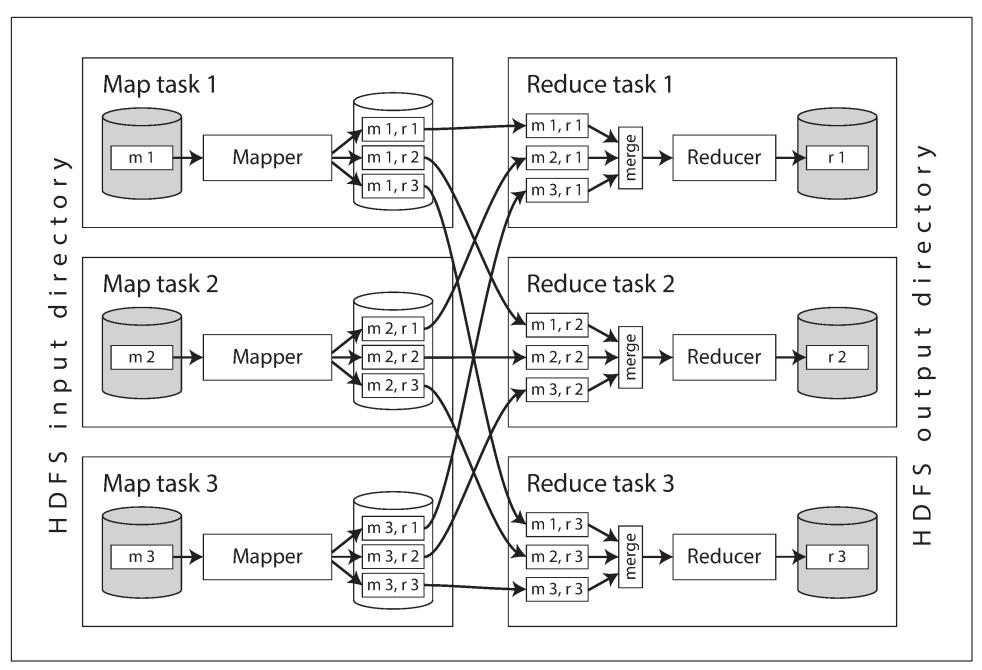

*Figure 10-1. A MapReduce job with three mappers and three reducers.*

In most cases, the application code that should run in the map task is not yet present on the machine that is assigned the task of running it, so the MapReduce framework first copies the code (e.g., JAR files in the case of a Java program) to the appropriate machines. It then starts the map task and begins reading the input file, passing one record at a time to the mapper callback. The output of the mapper consists of keyvalue pairs.

The reduce side of the computation is also partitioned. While the number of map tasks is determined by the number of input file blocks, the number of reduce tasks is configured by the job author (it can be different from the number of map tasks). To ensure that all key-value pairs with the same key end up at the same reducer, the framework uses a hash of the key to determine which reduce task should receive a particular key-value pair (see ["Partitioning by Hash of Key" on page 203](#page-224-0)).

The key-value pairs must be sorted, but the dataset is likely too large to be sorted with a conventional sorting algorithm on a single machine. Instead, the sorting is per‐ formed in stages. First, each map task partitions its output by reducer, based on the hash of the key. Each of these partitions is written to a sorted file on the mapper's local disk, using a technique similar to what we discussed in ["SSTables and LSM-](#page-97-0)[Trees" on page 76](#page-97-0).

<span id="page-423-0"></span>Whenever a mapper finishes reading its input file and writing its sorted output files, the MapReduce scheduler notifies the reducers that they can start fetching the output files from that mapper. The reducers connect to each of the mappers and download the files of sorted key-value pairs for their partition. The process of partitioning by reducer, sorting, and copying data partitions from mappers to reducers is known as the *shuffle* [\[26](#page-453-0)] (a confusing term—unlike shuffling a deck of cards, there is no ran‐ domness in MapReduce).

The reduce task takes the files from the mappers and merges them together, preserv‐ ing the sort order. Thus, if different mappers produced records with the same key, they will be adjacent in the merged reducer input.

The reducer is called with a key and an iterator that incrementally scans over all records with the same key (which may in some cases not all fit in memory). The reducer can use arbitrary logic to process these records, and can generate any number of output records. These output records are written to a file on the distributed filesys‐ tem (usually, one copy on the local disk of the machine running the reducer, with replicas on other machines).

#### **MapReduce workflows**

The range of problems you can solve with a single MapReduce job is limited. Refer‐ ring back to the log analysis example, a single MapReduce job could determine the number of page views per URL, but not the most popular URLs, since that requires a second round of sorting.

Thus, it is very common for MapReduce jobs to be chained together into *workflows*, such that the output of one job becomes the input to the next job. The Hadoop Map‐ Reduce framework does not have any particular support for workflows, so this chain‐ ing is done implicitly by directory name: the first job must be configured to write its output to a designated directory in HDFS, and the second job must be configured to read that same directory name as its input. From the MapReduce framework's point of view, they are two independent jobs.

Chained MapReduce jobs are therefore less like pipelines of Unix commands (which pass the output of one process as input to another process directly, using only a small in-memory buffer) and more like a sequence of commands where each command's output is written to a temporary file, and the next command reads from the tempo‐ rary file. This design has advantages and disadvantages, which we will discuss in ["Materialization of Intermediate State" on page 419](#page-440-0).

A batch job's output is only considered valid when the job has completed successfully (MapReduce discards the partial output of a failed job). Therefore, one job in a work‐ flow can only start when the prior jobs—that is, the jobs that produce its input direc‐ tories—have completed successfully. To handle these dependencies between job

<span id="page-424-0"></span>executions, various workflow schedulers for Hadoop have been developed, including Oozie, Azkaban, Luigi, Airflow, and Pinball [\[28](#page-453-0)].

These schedulers also have management features that are useful when maintaining a large collection of batch jobs. Workflows consisting of 50 to 100 MapReduce jobs are common when building recommendation systems [\[29](#page-453-0)], and in a large organization, many different teams may be running different jobs that read each other's output. Tool support is important for managing such complex dataflows.

Various higher-level tools for Hadoop, such as Pig [[30\]](#page-453-0), Hive [[31\]](#page-453-0), Cascading [[32\]](#page-453-0), Crunch [\[33\]](#page-454-0), and FlumeJava [\[34](#page-454-0)], also set up workflows of multiple MapReduce stages that are automatically wired together appropriately.

## **Reduce-Side Joins and Grouping**

We discussed joins in [Chapter 2](#page-48-0) in the context of data models and query languages, but we have not delved into how joins are actually implemented. It is time that we pick up that thread again.

In many datasets it is common for one record to have an association with another record: a *foreign key* in a relational model, a *document reference* in a document model, or an *edge* in a graph model. A join is necessary whenever you have some code that needs to access records on both sides of that association (both the record that holds the reference and the record being referenced). As discussed in [Chapter 2,](#page-48-0) denormalization can reduce the need for joins but generally not remove it entirely.<sup>v</sup>

In a database, if you execute a query that involves only a small number of records, the database will typically use an *index* to quickly locate the records of interest (see [Chap‐](#page-90-0) [ter 3](#page-90-0)). If the query involves joins, it may require multiple index lookups. However, MapReduce has no concept of indexes—at least not in the usual sense.

When a MapReduce job is given a set of files as input, it reads the entire content of all of those files; a database would call this operation a *full table scan*. If you only want to read a small number of records, a full table scan is outrageously expensive compared to an index lookup. However, in analytic queries (see ["Transaction Processing or](#page-111-0) [Analytics?" on page 90](#page-111-0)) it is common to want to calculate aggregates over a large number of records. In this case, scanning the entire input might be quite a reasonable thing to do, especially if you can parallelize the processing across multiple machines.

v. The joins we talk about in this book are generally *equi-joins*, the most common type of join, in which a record is associated with other records that have *an identical value* in a particular field (such as an ID). Some databases support more general types of joins, for example using a less-than operator instead of an equality operator, but we do not have space to cover them here.

<span id="page-425-0"></span>When we talk about joins in the context of batch processing, we mean resolving all occurrences of some association within a dataset. For example, we assume that a job is processing the data for all users simultaneously, not merely looking up the data for one particular user (which would be done far more efficiently with an index).

#### **Example: analysis of user activity events**

A typical example of a join in a batch job is illustrated in Figure 10-2. On the left is a log of events describing the things that logged-in users did on a website (known as *activity events* or *clickstream data*), and on the right is a database of users. You can think of this example as being part of a star schema (see ["Stars and Snowflakes: Sche‐](#page-114-0) [mas for Analytics" on page 93](#page-114-0)): the log of events is the fact table, and the user data‐ base is one of the dimensions.

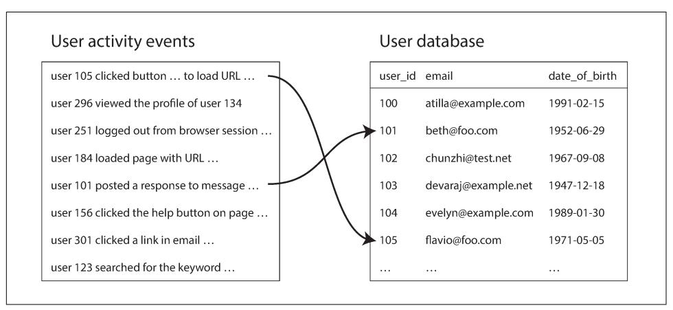

*Figure 10-2. A join between a log of user activity events and a database of user profiles.*

An analytics task may need to correlate user activity with user profile information: for example, if the profile contains the user's age or date of birth, the system could determine which pages are most popular with which age groups. However, the activ‐ ity events contain only the user ID, not the full user profile information. Embedding that profile information in every single activity event would most likely be too waste‐ ful. Therefore, the activity events need to be joined with the user profile database.

The simplest implementation of this join would go over the activity events one by one and query the user database (on a remote server) for every user ID it encounters. This is possible, but it would most likely suffer from very poor performance: the pro‐ cessing throughput would be limited by the round-trip time to the database server, the effectiveness of a local cache would depend very much on the distribution of data, and running a large number of queries in parallel could easily overwhelm the data‐ base [\[35](#page-454-0)].

<span id="page-426-0"></span>In order to achieve good throughput in a batch process, the computation must be (as much as possible) local to one machine. Making random-access requests over the network for every record you want to process is too slow. Moreover, querying a remote database would mean that the batch job becomes nondeterministic, because the data in the remote database might change.

Thus, a better approach would be to take a copy of the user database (for example, extracted from a database backup using an ETL process—see ["Data Warehousing" on](#page-112-0) [page 91](#page-112-0)) and to put it in the same distributed filesystem as the log of user activity events. You would then have the user database in one set of files in HDFS and the user activity records in another set of files, and could use MapReduce to bring together all of the relevant records in the same place and process them efficiently.

## **Sort-merge joins**

Recall that the purpose of the mapper is to extract a key and value from each input record. In the case of [Figure 10-2](#page-425-0), this key would be the user ID: one set of mappers would go over the activity events (extracting the user ID as the key and the activity event as the value), while another set of mappers would go over the user database (extracting the user ID as the key and the user's date of birth as the value). This pro‐ cess is illustrated in Figure 10-3.

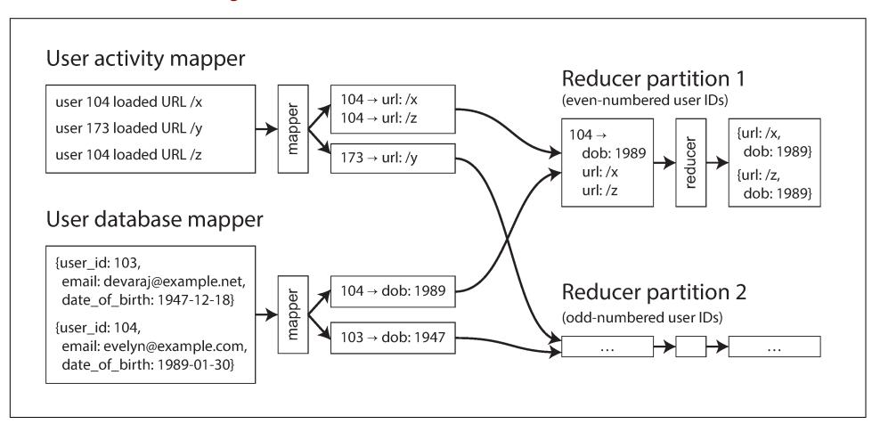

*Figure 10-3. A reduce-side sort-merge join on user ID. If the input datasets are parti‐ tioned into multiple files, each could be processed with multiple mappers in parallel.*

When the MapReduce framework partitions the mapper output by key and then sorts the key-value pairs, the effect is that all the activity events and the user record with the same user ID become adjacent to each other in the reducer input. The Map‐ Reduce job can even arrange the records to be sorted such that the reducer always <span id="page-427-0"></span>sees the record from the user database first, followed by the activity events in time‐ stamp order—this technique is known as a *secondary sort* [[26\]](#page-453-0).

The reducer can then perform the actual join logic easily: the reducer function is called once for every user ID, and thanks to the secondary sort, the first value is expected to be the date-of-birth record from the user database. The reducer stores the date of birth in a local variable and then iterates over the activity events with the same user ID, outputting pairs of *viewed-url* and *viewer-age-in-years*. Subsequent Map‐ Reduce jobs could then calculate the distribution of viewer ages for each URL, and cluster by age group.

Since the reducer processes all of the records for a particular user ID in one go, it only needs to keep one user record in memory at any one time, and it never needs to make any requests over the network. This algorithm is known as a *sort-merge join*, since mapper output is sorted by key, and the reducers then merge together the sorted lists of records from both sides of the join.

## **Bringing related data together in the same place**

In a sort-merge join, the mappers and the sorting process make sure that all the nec‐ essary data to perform the join operation for a particular user ID is brought together in the same place: a single call to the reducer. Having lined up all the required data in advance, the reducer can be a fairly simple, single-threaded piece of code that can churn through records with high throughput and low memory overhead.

One way of looking at this architecture is that mappers "send messages" to the reduc‐ ers. When a mapper emits a key-value pair, the key acts like the destination address to which the value should be delivered. Even though the key is just an arbitrary string (not an actual network address like an IP address and port number), it behaves like an address: all key-value pairs with the same key will be delivered to the same desti‐ nation (a call to the reducer).

Using the MapReduce programming model has separated the physical network com‐ munication aspects of the computation (getting the data to the right machine) from the application logic (processing the data once you have it). This separation contrasts with the typical use of databases, where a request to fetch data from a database often occurs somewhere deep inside a piece of application code [[36\]](#page-454-0). Since MapReduce handles all network communication, it also shields the application code from having to worry about partial failures, such as the crash of another node: MapReduce trans‐ parently retries failed tasks without affecting the application logic.

#### **GROUP BY**

Besides joins, another common use of the "bringing related data to the same place" pattern is grouping records by some key (as in the GROUP BY clause in SQL). All

<span id="page-428-0"></span>records with the same key form a group, and the next step is often to perform some kind of aggregation within each group—for example:

- Counting the number of records in each group (like in our example of counting page views, which you would express as a COUNT(\*) aggregation in SQL)
- Adding up the values in one particular field (SUM(fieldname)) in SQL
- Picking the top *k* records according to some ranking function

The simplest way of implementing such a grouping operation with MapReduce is to set up the mappers so that the key-value pairs they produce use the desired grouping key. The partitioning and sorting process then brings together all the records with the same key in the same reducer. Thus, grouping and joining look quite similar when implemented on top of MapReduce.

Another common use for grouping is collating all the activity events for a particular user session, in order to find out the sequence of actions that the user took—a pro‐ cess called *sessionization* [\[37](#page-454-0)]. For example, such analysis could be used to work out whether users who were shown a new version of your website are more likely to make a purchase than those who were shown the old version (A/B testing), or to calculate whether some marketing activity is worthwhile.

If you have multiple web servers handling user requests, the activity events for a par‐ ticular user are most likely scattered across various different servers' log files. You can implement sessionization by using a session cookie, user ID, or similar identifier as the grouping key and bringing all the activity events for a particular user together in one place, while distributing different users' events across different partitions.

## **Handling skew**

The pattern of "bringing all records with the same key to the same place" breaks down if there is a very large amount of data related to a single key. For example, in a social network, most users might be connected to a few hundred people, but a small number of celebrities may have many millions of followers. Such disproportionately active database records are known as *linchpin objects* [\[38](#page-454-0)] or *hot keys*.

Collecting all activity related to a celebrity (e.g., replies to something they posted) in a single reducer can lead to significant *skew* (also known as *hot spots*)—that is, one reducer that must process significantly more records than the others (see ["Skewed](#page-226-0) [Workloads and Relieving Hot Spots" on page 205](#page-226-0)). Since a MapReduce job is only complete when all of its mappers and reducers have completed, any subsequent jobs must wait for the slowest reducer to complete before they can start.

If a join input has hot keys, there are a few algorithms you can use to compensate. For example, the *skewed join* method in Pig first runs a sampling job to determine which keys are hot [\[39](#page-454-0)]. When performing the actual join, the mappers send any

<span id="page-429-0"></span>records relating to a hot key to one of several reducers, chosen at random (in contrast to conventional MapReduce, which chooses a reducer deterministically based on a hash of the key). For the other input to the join, records relating to the hot key need to be replicated to *all* reducers handling that key [[40\]](#page-454-0).

This technique spreads the work of handling the hot key over several reducers, which allows it to be parallelized better, at the cost of having to replicate the other join input to multiple reducers. The *sharded join* method in Crunch is similar, but requires the hot keys to be specified explicitly rather than using a sampling job. This technique is also very similar to one we discussed in ["Skewed Workloads and Relieving Hot](#page-226-0) [Spots" on page 205,](#page-226-0) using randomization to alleviate hot spots in a partitioned data‐ base.

Hive's skewed join optimization takes an alternative approach. It requires hot keys to be specified explicitly in the table metadata, and it stores records related to those keys in separate files from the rest. When performing a join on that table, it uses a mapside join (see the next section) for the hot keys.

When grouping records by a hot key and aggregating them, you can perform the grouping in two stages. The first MapReduce stage sends records to a random reducer, so that each reducer performs the grouping on a subset of records for the hot key and outputs a more compact aggregated value per key. The second Map‐ Reduce job then combines the values from all of the first-stage reducers into a single value per key.

## **Map-Side Joins**

The join algorithms described in the last section perform the actual join logic in the reducers, and are hence known as *reduce-side joins*. The mappers take the role of pre‐ paring the input data: extracting the key and value from each input record, assigning the key-value pairs to a reducer partition, and sorting by key.

The reduce-side approach has the advantage that you do not need to make any assumptions about the input data: whatever its properties and structure, the mappers can prepare the data to be ready for joining. However, the downside is that all that sorting, copying to reducers, and merging of reducer inputs can be quite expensive. Depending on the available memory buffers, data may be written to disk several times as it passes through the stages of MapReduce [[37\]](#page-454-0).

On the other hand, if you *can* make certain assumptions about your input data, it is possible to make joins faster by using a so-called *map-side join*. This approach uses a cut-down MapReduce job in which there are no reducers and no sorting. Instead, each mapper simply reads one input file block from the distributed filesystem and writes one output file to the filesystem—that is all.

## <span id="page-430-0"></span>**Broadcast hash joins**

The simplest way of performing a map-side join applies in the case where a large dataset is joined with a small dataset. In particular, the small dataset needs to be small enough that it can be loaded entirely into memory in each of the mappers.

For example, imagine in the case of [Figure 10-2](#page-425-0) that the user database is small enough to fit in memory. In this case, when a mapper starts up, it can first read the user database from the distributed filesystem into an in-memory hash table. Once this is done, the mapper can scan over the user activity events and simply look up the user ID for each event in the hash table.vi

There can still be several map tasks: one for each file block of the large input to the join (in the example of [Figure 10-2](#page-425-0), the activity events are the large input). Each of these mappers loads the small input entirely into memory.

This simple but effective algorithm is called a *broadcast hash join*: the word *broadcast* reflects the fact that each mapper for a partition of the large input reads the entirety of the small input (so the small input is effectively "broadcast" to all partitions of the large input), and the word *hash* reflects its use of a hash table. This join method is supported by Pig (under the name "replicated join"), Hive ("MapJoin"), Cascading, and Crunch. It is also used in data warehouse query engines such as Impala [\[41](#page-454-0)].

Instead of loading the small join input into an in-memory hash table, an alternative is to store the small join input in a read-only index on the local disk [\[42](#page-454-0)]. The fre‐ quently used parts of this index will remain in the operating system's page cache, so this approach can provide random-access lookups almost as fast as an in-memory hash table, but without actually requiring the dataset to fit in memory.

## **Partitioned hash joins**

If the inputs to the map-side join are partitioned in the same way, then the hash join approach can be applied to each partition independently. In the case of [Figure 10-2,](#page-425-0) you might arrange for the activity events and the user database to each be partitioned based on the last decimal digit of the user ID (so there are 10 partitions on either side). For example, mapper 3 first loads all users with an ID ending in 3 into a hash table, and then scans over all the activity events for each user whose ID ends in 3.

If the partitioning is done correctly, you can be sure that all the records you might want to join are located in the same numbered partition, and so it is sufficient for each mapper to only read one partition from each of the input datasets. This has the advantage that each mapper can load a smaller amount of data into its hash table.

vi. This example assumes that there is exactly one entry for each key in the hash table, which is probably true with a user database (a user ID uniquely identifies a user). In general, the hash table may need to contain several entries with the same key, and the join operator will output all matches for a key.

<span id="page-431-0"></span>This approach only works if both of the join's inputs have the same number of parti‐ tions, with records assigned to partitions based on the same key and the same hash function. If the inputs are generated by prior MapReduce jobs that already perform this grouping, then this can be a reasonable assumption to make.

Partitioned hash joins are known as *bucketed map joins* in Hive [[37\]](#page-454-0).

## **Map-side merge joins**

Another variant of a map-side join applies if the input datasets are not only parti‐ tioned in the same way, but also *sorted* based on the same key. In this case, it does not matter whether the inputs are small enough to fit in memory, because a mapper can perform the same merging operation that would normally be done by a reducer: reading both input files incrementally, in order of ascending key, and matching records with the same key.

If a map-side merge join is possible, it probably means that prior MapReduce jobs brought the input datasets into this partitioned and sorted form in the first place. In principle, this join could have been performed in the reduce stage of the prior job. However, it may still be appropriate to perform the merge join in a separate maponly job, for example if the partitioned and sorted datasets are also needed for other purposes besides this particular join.

## **MapReduce workflows with map-side joins**

When the output of a MapReduce join is consumed by downstream jobs, the choice of map-side or reduce-side join affects the structure of the output. The output of a reduce-side join is partitioned and sorted by the join key, whereas the output of a map-side join is partitioned and sorted in the same way as the large input (since one map task is started for each file block of the join's large input, regardless of whether a partitioned or broadcast join is used).

As discussed, map-side joins also make more assumptions about the size, sorting, and partitioning of their input datasets. Knowing about the physical layout of datasets in the distributed filesystem becomes important when optimizing join strategies: it is not sufficient to just know the encoding format and the name of the directory in which the data is stored; you must also know the number of partitions and the keys by which the data is partitioned and sorted.

In the Hadoop ecosystem, this kind of metadata about the partitioning of datasets is often maintained in HCatalog and the Hive metastore [[37\]](#page-454-0).

## <span id="page-432-0"></span>**The Output of Batch Workflows**

We have talked a lot about the various algorithms for implementing workflows of MapReduce jobs, but we neglected an important question: what is the result of all of that processing, once it is done? Why are we running all these jobs in the first place?

In the case of database queries, we distinguished transaction processing (OLTP) pur‐ poses from analytic purposes (see ["Transaction Processing or Analytics?" on page](#page-111-0) [90](#page-111-0)). We saw that OLTP queries generally look up a small number of records by key, using indexes, in order to present them to a user (for example, on a web page). On the other hand, analytic queries often scan over a large number of records, perform‐ ing groupings and aggregations, and the output often has the form of a report: a graph showing the change in a metric over time, or the top 10 items according to some ranking, or a breakdown of some quantity into subcategories. The consumer of such a report is often an analyst or a manager who needs to make business decisions.

Where does batch processing fit in? It is not transaction processing, nor is it analyt‐ ics. It is closer to analytics, in that a batch process typically scans over large portions of an input dataset. However, a workflow of MapReduce jobs is not the same as a SQL query used for analytic purposes (see ["Comparing Hadoop to Distributed Data‐](#page-435-0) [bases" on page 414\)](#page-435-0). The output of a batch process is often not a report, but some other kind of structure.

## **Building search indexes**

Google's original use of MapReduce was to build indexes for its search engine, which was implemented as a workflow of 5 to 10 MapReduce jobs [[1\]](#page-452-0). Although Google later moved away from using MapReduce for this purpose [\[43](#page-454-0)], it helps to under‐ stand MapReduce if you look at it through the lens of building a search index. (Even today, Hadoop MapReduce remains a good way of building indexes for Lucene/Solr [[44\]](#page-454-0).)

We saw briefly in ["Full-text search and fuzzy indexes" on page 88](#page-109-0) how a full-text search index such as Lucene works: it is a file (the term dictionary) in which you can efficiently look up a particular keyword and find the list of all the document IDs con‐ taining that keyword (the postings list). This is a very simplified view of a search index—in reality it requires various additional data, in order to rank search results by relevance, correct misspellings, resolve synonyms, and so on—but the principle holds.

If you need to perform a full-text search over a fixed set of documents, then a batch process is a very effective way of building the indexes: the mappers partition the set of documents as needed, each reducer builds the index for its partition, and the index files are written to the distributed filesystem. Building such document-partitioned indexes (see ["Partitioning and Secondary Indexes" on page 206](#page-227-0)) parallelizes very well.

<span id="page-433-0"></span>Since querying a search index by keyword is a read-only operation, these index files are immutable once they have been created.

If the indexed set of documents changes, one option is to periodically rerun the entire indexing workflow for the entire set of documents, and replace the previous index files wholesale with the new index files when it is done. This approach can be compu‐ tationally expensive if only a small number of documents have changed, but it has the advantage that the indexing process is very easy to reason about: documents in, indexes out.

Alternatively, it is possible to build indexes incrementally. As discussed in [Chapter 3,](#page-90-0) if you want to add, remove, or update documents in an index, Lucene writes out new segment files and asynchronously merges and compacts segment files in the back‐ ground. We will see more on such incremental processing in [Chapter 11.](#page-460-0)

## **Key-value stores as batch process output**

Search indexes are just one example of the possible outputs of a batch processing workflow. Another common use for batch processing is to build machine learning systems such as classifiers (e.g., spam filters, anomaly detection, image recognition) and recommendation systems (e.g., people you may know, products you may be interested in, or related searches [\[29](#page-453-0)]).

The output of those batch jobs is often some kind of database: for example, a data‐ base that can be queried by user ID to obtain suggested friends for that user, or a database that can be queried by product ID to get a list of related products [[45\]](#page-454-0).

These databases need to be queried from the web application that handles user requests, which is usually separate from the Hadoop infrastructure. So how does the output from the batch process get back into a database where the web application can query it?

The most obvious choice might be to use the client library for your favorite database directly within a mapper or reducer, and to write from the batch job directly to the database server, one record at a time. This will work (assuming your firewall rules allow direct access from your Hadoop environment to your production databases), but it is a bad idea for several reasons:

- As discussed previously in the context of joins, making a network request for every single record is orders of magnitude slower than the normal throughput of a batch task. Even if the client library supports batching, performance is likely to be poor.
- MapReduce jobs often run many tasks in parallel. If all the mappers or reducers concurrently write to the same output database, with a rate expected of a batch process, that database can easily be overwhelmed, and its performance for quer‐

<span id="page-434-0"></span>ies is likely to suffer. This can in turn cause operational problems in other parts of the system [\[35](#page-454-0)].

• Normally, MapReduce provides a clean all-or-nothing guarantee for job output: if a job succeeds, the result is the output of running every task exactly once, even if some tasks failed and had to be retried along the way; if the entire job fails, no output is produced. However, writing to an external system from inside a job produces externally visible side effects that cannot be hidden in this way. Thus, you have to worry about the results from partially completed jobs being visible to other systems, and the complexities of Hadoop task attempts and speculative execution.

A much better solution is to build a brand-new database *inside* the batch job and write it as files to the job's output directory in the distributed filesystem, just like the search indexes in the last section. Those data files are then immutable once written, and can be loaded in bulk into servers that handle read-only queries. Various keyvalue stores support building database files in MapReduce jobs, including Voldemort [[46\]](#page-454-0), Terrapin [[47\]](#page-454-0), ElephantDB [[48\]](#page-455-0), and HBase bulk loading [[49\]](#page-455-0).

Building these database files is a good use of MapReduce: using a mapper to extract a key and then sorting by that key is already a lot of the work required to build an index. Since most of these key-value stores are read-only (the files can only be written once by a batch job and are then immutable), the data structures are quite simple. For example, they do not require a WAL (see ["Making B-trees reliable" on page 82\)](#page-103-0).

When loading data into Voldemort, the server continues serving requests to the old data files while the new data files are copied from the distributed filesystem to the server's local disk. Once the copying is complete, the server atomically switches over to querying the new files. If anything goes wrong in this process, it can easily switch back to the old files again, since they are still there and immutable [[46\]](#page-454-0).

## **Philosophy of batch process outputs**

The Unix philosophy that we discussed earlier in this chapter [\("The Unix Philoso‐](#page-415-0) [phy" on page 394\)](#page-415-0) encourages experimentation by being very explicit about dataflow: a program reads its input and writes its output. In the process, the input is left unchanged, any previous output is completely replaced with the new output, and there are no other side effects. This means that you can rerun a command as often as you like, tweaking or debugging it, without messing up the state of your system.

The handling of output from MapReduce jobs follows the same philosophy. By treat‐ ing inputs as immutable and avoiding side effects (such as writing to external data‐ bases), batch jobs not only achieve good performance but also become much easier to maintain:

- <span id="page-435-0"></span>• If you introduce a bug into the code and the output is wrong or corrupted, you can simply roll back to a previous version of the code and rerun the job, and the output will be correct again. Or, even simpler, you can keep the old output in a different directory and simply switch back to it. Databases with read-write trans‐ actions do not have this property: if you deploy buggy code that writes bad data to the database, then rolling back the code will do nothing to fix the data in the database. (The idea of being able to recover from buggy code has been called *human fault tolerance* [[50](#page-455-0)].)
- As a consequence of this ease of rolling back, feature development can proceed more quickly than in an environment where mistakes could mean irreversible damage. This principle of *minimizing irreversibility* is beneficial for Agile soft‐ ware development [\[51](#page-455-0)].
- If a map or reduce task fails, the MapReduce framework automatically reschedules it and runs it again on the same input. If the failure is due to a bug in the code, it will keep crashing and eventually cause the job to fail after a few attempts; but if the failure is due to a transient issue, the fault is tolerated. This automatic retry is only safe because inputs are immutable and outputs from failed tasks are discarded by the MapReduce framework.
- The same set of files can be used as input for various different jobs, including monitoring jobs that calculate metrics and evaluate whether a job's output has the expected characteristics (for example, by comparing it to the output from the previous run and measuring discrepancies).
- Like Unix tools, MapReduce jobs separate logic from wiring (configuring the input and output directories), which provides a separation of concerns and ena‐ bles potential reuse of code: one team can focus on implementing a job that does one thing well, while other teams can decide where and when to run that job.

In these areas, the design principles that worked well for Unix also seem to be work‐ ing well for Hadoop—but Unix and Hadoop also differ in some ways. For example, because most Unix tools assume untyped text files, they have to do a lot of input parsing (our log analysis example at the beginning of the chapter used {print \$7} to extract the URL). On Hadoop, some of those low-value syntactic conversions are eliminated by using more structured file formats: Avro (see ["Avro" on page 122\)](#page-143-0) and Parquet (see ["Column-Oriented Storage" on page 95\)](#page-116-0) are often used, as they provide efficient schema-based encoding and allow evolution of their schemas over time (see [Chapter 4\)](#page-132-0).

## **Comparing Hadoop to Distributed Databases**

As we have seen, Hadoop is somewhat like a distributed version of Unix, where HDFS is the filesystem and MapReduce is a quirky implementation of a Unix process

<span id="page-436-0"></span>(which happens to always run the sort utility between the map phase and the reduce phase). We saw how you can implement various join and grouping operations on top of these primitives.

When the MapReduce paper [\[1](#page-452-0)] was published, it was—in some sense—not at all new. All of the processing and parallel join algorithms that we discussed in the last few sections had already been implemented in so-called *massively parallel processing* (MPP) databases more than a decade previously [[3,](#page-452-0) [40](#page-454-0)]. For example, the Gamma database machine, Teradata, and Tandem NonStop SQL were pioneers in this area [[52\]](#page-455-0).

The biggest difference is that MPP databases focus on parallel execution of analytic SQL queries on a cluster of machines, while the combination of MapReduce and a distributed filesystem [\[19](#page-453-0)] provides something much more like a general-purpose operating system that can run arbitrary programs.

#### **Diversity of storage**

Databases require you to structure data according to a particular model (e.g., rela‐ tional or documents), whereas files in a distributed filesystem are just byte sequences, which can be written using any data model and encoding. They might be collections of database records, but they can equally well be text, images, videos, sensor readings, sparse matrices, feature vectors, genome sequences, or any other kind of data.

To put it bluntly, Hadoop opened up the possibility of indiscriminately dumping data into HDFS, and only later figuring out how to process it further [[53\]](#page-455-0). By contrast, MPP databases typically require careful up-front modeling of the data and query pat‐ terns before importing the data into the database's proprietary storage format.

From a purist's point of view, it may seem that this careful modeling and import is desirable, because it means users of the database have better-quality data to work with. However, in practice, it appears that simply making data available quickly even if it is in a quirky, difficult-to-use, raw format—is often more valuable than try‐ ing to decide on the ideal data model up front [\[54](#page-455-0)].

The idea is similar to a data warehouse (see ["Data Warehousing" on page 91](#page-112-0)): simply bringing data from various parts of a large organization together in one place is val‐ uable, because it enables joins across datasets that were previously disparate. The careful schema design required by an MPP database slows down that centralized data collection; collecting data in its raw form, and worrying about schema design later, allows the data collection to be speeded up (a concept sometimes known as a "data lake" or "enterprise data hub" [\[55](#page-455-0)]).

Indiscriminate data dumping shifts the burden of interpreting the data: instead of forcing the producer of a dataset to bring it into a standardized format, the interpre‐ tation of the data becomes the consumer's problem (the schema-on-read approach <span id="page-437-0"></span>[[56\]](#page-455-0); see ["Schema flexibility in the document model" on page 39\)](#page-60-0). This can be an advantage if the producer and consumers are different teams with different priorities. There may not even be one ideal data model, but rather different views onto the data that are suitable for different purposes. Simply dumping data in its raw form allows for several such transformations. This approach has been dubbed the *sushi principle*: "raw data is better" [\[57\]](#page-455-0).

Thus, Hadoop has often been used for implementing ETL processes (see ["Data Ware‐](#page-112-0) [housing" on page 91\)](#page-112-0): data from transaction processing systems is dumped into the distributed filesystem in some raw form, and then MapReduce jobs are written to clean up that data, transform it into a relational form, and import it into an MPP data warehouse for analytic purposes. Data modeling still happens, but it is in a separate step, decoupled from the data collection. This decoupling is possible because a dis‐ tributed filesystem supports data encoded in any format.

## **Diversity of processing models**

MPP databases are monolithic, tightly integrated pieces of software that take care of storage layout on disk, query planning, scheduling, and execution. Since these com‐ ponents can all be tuned and optimized for the specific needs of the database, the sys‐ tem as a whole can achieve very good performance on the types of queries for which it is designed. Moreover, the SQL query language allows expressive queries and ele‐ gant semantics without the need to write code, making it accessible to graphical tools used by business analysts (such as Tableau).

On the other hand, not all kinds of processing can be sensibly expressed as SQL quer‐ ies. For example, if you are building machine learning and recommendation systems, or full-text search indexes with relevance ranking models, or performing image anal‐ ysis, you most likely need a more general model of data processing. These kinds of processing are often very specific to a particular application (e.g., feature engineering for machine learning, natural language models for machine translation, risk estima‐ tion functions for fraud prediction), so they inevitably require writing code, not just queries.

MapReduce gave engineers the ability to easily run their own code over large data‐ sets. If you have HDFS and MapReduce, you *can* build a SQL query execution engine on top of it, and indeed this is what the Hive project did [\[31](#page-453-0)]. However, you can also write many other forms of batch processes that do not lend themselves to being expressed as a SQL query.

Subsequently, people found that MapReduce was too limiting and performed too badly for some types of processing, so various other processing models were devel‐ oped on top of Hadoop (we will see some of them in ["Beyond MapReduce"](#page-440-0) on page [419](#page-440-0)). Having two processing models, SQL and MapReduce, was not enough: even more different models were needed! And due to the openness of the Hadoop plat‐

<span id="page-438-0"></span>form, it was feasible to implement a whole range of approaches, which would not have been possible within the confines of a monolithic MPP database [\[58\]](#page-455-0).

Crucially, those various processing models can all be run on a single shared-use clus‐ ter of machines, all accessing the same files on the distributed filesystem. In the Hadoop approach, there is no need to import the data into several different special‐ ized systems for different kinds of processing: the system is flexible enough to sup‐ port a diverse set of workloads within the same cluster. Not having to move data around makes it a lot easier to derive value from the data, and a lot easier to experi‐ ment with new processing models.

The Hadoop ecosystem includes both random-access OLTP databases such as HBase (see ["SSTables and LSM-Trees" on page 76\)](#page-97-0) and MPP-style analytic databases such as Impala [\[41](#page-454-0)]. Neither HBase nor Impala uses MapReduce, but both use HDFS for storage. They are very different approaches to accessing and processing data, but they can nevertheless coexist and be integrated in the same system.

#### **Designing for frequent faults**

When comparing MapReduce to MPP databases, two more differences in design approach stand out: the handling of faults and the use of memory and disk. Batch processes are less sensitive to faults than online systems, because they do not immedi‐ ately affect users if they fail and they can always be run again.

If a node crashes while a query is executing, most MPP databases abort the entire query, and either let the user resubmit the query or automatically run it again [\[3](#page-452-0)]. As queries normally run for a few seconds or a few minutes at most, this way of handling errors is acceptable, since the cost of retrying is not too great. MPP databases also prefer to keep as much data as possible in memory (e.g., using hash joins) to avoid the cost of reading from disk.

On the other hand, MapReduce can tolerate the failure of a map or reduce task without it affecting the job as a whole by retrying work at the granularity of an indi‐ vidual task. It is also very eager to write data to disk, partly for fault tolerance, and partly on the assumption that the dataset will be too big to fit in memory anyway.

The MapReduce approach is more appropriate for larger jobs: jobs that process so much data and run for such a long time that they are likely to experience at least one task failure along the way. In that case, rerunning the entire job due to a single task failure would be wasteful. Even if recovery at the granularity of an individual task introduces overheads that make fault-free processing slower, it can still be a reason‐ able trade-off if the rate of task failures is high enough.

But how realistic are these assumptions? In most clusters, machine failures do occur, but they are not very frequent—probably rare enough that most jobs will not experi‐ <span id="page-439-0"></span>ence a machine failure. Is it really worth incurring significant overheads for the sake of fault tolerance?

To understand the reasons for MapReduce's sparing use of memory and task-level recovery, it is helpful to look at the environment for which MapReduce was originally designed. Google has mixed-use datacenters, in which online production services and offline batch jobs run on the same machines. Every task has a resource allocation (CPU cores, RAM, disk space, etc.) that is enforced using containers. Every task also has a priority, and if a higher-priority task needs more resources, lower-priority tasks on the same machine can be terminated (preempted) in order to free up resources. Priority also determines pricing of the computing resources: teams must pay for the resources they use, and higher-priority processes cost more [[59](#page-455-0)].

This architecture allows non-production (low-priority) computing resources to be overcommitted, because the system knows that it can reclaim the resources if neces‐ sary. Overcommitting resources in turn allows better utilization of machines and greater efficiency compared to systems that segregate production and nonproduction tasks. However, as MapReduce jobs run at low priority, they run the risk of being preempted at any time because a higher-priority process requires their resources. Batch jobs effectively "pick up the scraps under the table," using any com‐ puting resources that remain after the high-priority processes have taken what they need.

At Google, a MapReduce task that runs for an hour has an approximately 5% risk of being terminated to make space for a higher-priority process. This rate is more than an order of magnitude higher than the rate of failures due to hardware issues, machine reboot, or other reasons [\[59\]](#page-455-0). At this rate of preemptions, if a job has 100 tasks that each run for 10 minutes, there is a risk greater than 50% that at least one task will be terminated before it is finished.

And this is why MapReduce is designed to tolerate frequent unexpected task termina‐ tion: it's not because the hardware is particularly unreliable, it's because the freedom to arbitrarily terminate processes enables better resource utilization in a computing cluster.

Among open source cluster schedulers, preemption is less widely used. YARN's CapacityScheduler supports preemption for balancing the resource allocation of dif‐ ferent queues [\[58](#page-455-0)], but general priority preemption is not supported in YARN, Mesos, or Kubernetes at the time of writing [[60\]](#page-455-0). In an environment where tasks are not so often terminated, the design decisions of MapReduce make less sense. In the next section, we will look at some alternatives to MapReduce that make different design decisions.

## <span id="page-440-0"></span>**Beyond MapReduce**

Although MapReduce became very popular and received a lot of hype in the late 2000s, it is just one among many possible programming models for distributed sys‐ tems. Depending on the volume of data, the structure of the data, and the type of pro‐ cessing being done with it, other tools may be more appropriate for expressing a computation.

We nevertheless spent a lot of time in this chapter discussing MapReduce because it is a useful learning tool, as it is a fairly clear and simple abstraction on top of a dis‐ tributed filesystem. That is, *simple* in the sense of being able to understand what it is doing, not in the sense of being easy to use. Quite the opposite: implementing a com‐ plex processing job using the raw MapReduce APIs is actually quite hard and labori‐ ous—for instance, you would need to implement any join algorithms from scratch [[37\]](#page-454-0).

In response to the difficulty of using MapReduce directly, various higher-level pro‐ gramming models (Pig, Hive, Cascading, Crunch) were created as abstractions on top of MapReduce. If you understand how MapReduce works, they are fairly easy to learn, and their higher-level constructs make many common batch processing tasks significantly easier to implement.

However, there are also problems with the MapReduce execution model itself, which are not fixed by adding another level of abstraction and which manifest themselves as poor performance for some kinds of processing. On the one hand, MapReduce is very robust: you can use it to process almost arbitrarily large quantities of data on an unreliable multi-tenant system with frequent task terminations, and it will still get the job done (albeit slowly). On the other hand, other tools are sometimes orders of mag‐ nitude faster for some kinds of processing.

In the rest of this chapter, we will look at some of those alternatives for batch process‐ ing. In [Chapter 11](#page-460-0) we will move to stream processing, which can be regarded as another way of speeding up batch processing.

## **Materialization of Intermediate State**

As discussed previously, every MapReduce job is independent from every other job. The main contact points of a job with the rest of the world are its input and output directories on the distributed filesystem. If you want the output of one job to become the input to a second job, you need to configure the second job's input directory to be the same as the first job's output directory, and an external workflow scheduler must start the second job only once the first job has completed.

This setup is reasonable if the output from the first job is a dataset that you want to publish widely within your organization. In that case, you need to be able to refer to it

<span id="page-441-0"></span>by name and reuse it as input to several different jobs (including jobs developed by other teams). Publishing data to a well-known location in the distributed filesystem allows loose coupling so that jobs don't need to know who is producing their input or consuming their output (see ["Separation of logic and wiring" on page 396](#page-417-0)).

However, in many cases, you know that the output of one job is only ever used as input to one other job, which is maintained by the same team. In this case, the files on the distributed filesystem are simply *intermediate state*: a means of passing data from one job to the next. In the complex workflows used to build recommendation systems consisting of 50 or 100 MapReduce jobs [\[29](#page-453-0)], there is a lot of such intermedi‐ ate state.

The process of writing out this intermediate state to files is called *materialization*. (We came across the term previously in the context of materialized views, in ["Aggre‐](#page-122-0) [gation: Data Cubes and Materialized Views" on page 101](#page-122-0). It means to eagerly com‐ pute the result of some operation and write it out, rather than computing it on demand when requested.)

By contrast, the log analysis example at the beginning of the chapter used Unix pipes to connect the output of one command with the input of another. Pipes do not fully materialize the intermediate state, but instead *stream* the output to the input incre‐ mentally, using only a small in-memory buffer.

MapReduce's approach of fully materializing intermediate state has downsides com‐ pared to Unix pipes:

- A MapReduce job can only start when all tasks in the preceding jobs (that gener‐ ate its inputs) have completed, whereas processes connected by a Unix pipe are started at the same time, with output being consumed as soon as it is produced. Skew or varying load on different machines means that a job often has a few straggler tasks that take much longer to complete than the others. Having to wait until all of the preceding job's tasks have completed slows down the execution of the workflow as a whole.
- Mappers are often redundant: they just read back the same file that was just writ‐ ten by a reducer, and prepare it for the next stage of partitioning and sorting. In many cases, the mapper code could be part of the previous reducer: if the reducer output was partitioned and sorted in the same way as mapper output, then reducers could be chained together directly, without interleaving with mapper stages.
- Storing intermediate state in a distributed filesystem means those files are repli‐ cated across several nodes, which is often overkill for such temporary data.

## <span id="page-442-0"></span>**Dataflow engines**

In order to fix these problems with MapReduce, several new execution engines for distributed batch computations were developed, the most well known of which are Spark [\[61](#page-455-0), [62\]](#page-455-0), Tez [[63,](#page-456-0) [64](#page-456-0)], and Flink [[65,](#page-456-0) [66\]](#page-456-0). There are various differences in the way they are designed, but they have one thing in common: they handle an entire workflow as one job, rather than breaking it up into independent subjobs.

Since they explicitly model the flow of data through several processing stages, these systems are known as *dataflow engines*. Like MapReduce, they work by repeatedly calling a user-defined function to process one record at a time on a single thread. They parallelize work by partitioning inputs, and they copy the output of one func‐ tion over the network to become the input to another function.

Unlike in MapReduce, these functions need not take the strict roles of alternating map and reduce, but instead can be assembled in more flexible ways. We call these functions *operators*, and the dataflow engine provides several different options for connecting one operator's output to another's input:

- One option is to repartition and sort records by key, like in the shuffle stage of MapReduce (see ["Distributed execution of MapReduce" on page 400\)](#page-421-0). This fea‐ ture enables sort-merge joins and grouping in the same way as in MapReduce.
- Another possibility is to take several inputs and to partition them in the same way, but skip the sorting. This saves effort on partitioned hash joins, where the partitioning of records is important but the order is irrelevant because building the hash table randomizes the order anyway.
- For broadcast hash joins, the same output from one operator can be sent to all partitions of the join operator.

This style of processing engine is based on research systems like Dryad [\[67](#page-456-0)] and Nephele [[68](#page-456-0)], and it offers several advantages compared to the MapReduce model:

- Expensive work such as sorting need only be performed in places where it is actually required, rather than always happening by default between every map and reduce stage.
- There are no unnecessary map tasks, since the work done by a mapper can often be incorporated into the preceding reduce operator (because a mapper does not change the partitioning of a dataset).
- Because all joins and data dependencies in a workflow are explicitly declared, the scheduler has an overview of what data is required where, so it can make locality optimizations. For example, it can try to place the task that consumes some data on the same machine as the task that produces it, so that the data can be

<span id="page-443-0"></span>exchanged through a shared memory buffer rather than having to copy it over the network.

- It is usually sufficient for intermediate state between operators to be kept in memory or written to local disk, which requires less I/O than writing it to HDFS (where it must be replicated to several machines and written to disk on each rep‐ lica). MapReduce already uses this optimization for mapper output, but dataflow engines generalize the idea to all intermediate state.
- Operators can start executing as soon as their input is ready; there is no need to wait for the entire preceding stage to finish before the next one starts.
- Existing Java Virtual Machine (JVM) processes can be reused to run new opera‐ tors, reducing startup overheads compared to MapReduce (which launches a new JVM for each task).

You can use dataflow engines to implement the same computations as MapReduce workflows, and they usually execute significantly faster due to the optimizations described here. Since operators are a generalization of map and reduce, the same pro‐ cessing code can run on either execution engine: workflows implemented in Pig, Hive, or Cascading can be switched from MapReduce to Tez or Spark with a simple configuration change, without modifying code [[64\]](#page-456-0).

Tez is a fairly thin library that relies on the YARN shuffle service for the actual copy‐ ing of data between nodes [\[58](#page-455-0)], whereas Spark and Flink are big frameworks that include their own network communication layer, scheduler, and user-facing APIs. We will discuss those high-level APIs shortly.

#### **Fault tolerance**

An advantage of fully materializing intermediate state to a distributed filesystem is that it is durable, which makes fault tolerance fairly easy in MapReduce: if a task fails, it can just be restarted on another machine and read the same input again from the filesystem.

Spark, Flink, and Tez avoid writing intermediate state to HDFS, so they take a differ‐ ent approach to tolerating faults: if a machine fails and the intermediate state on that machine is lost, it is recomputed from other data that is still available (a prior inter‐ mediary stage if possible, or otherwise the original input data, which is normally on HDFS).

To enable this recomputation, the framework must keep track of how a given piece of data was computed—which input partitions it used, and which operators were applied to it. Spark uses the resilient distributed dataset (RDD) abstraction for track‐ ing the ancestry of data [\[61](#page-455-0)], while Flink checkpoints operator state, allowing it to resume running an operator that ran into a fault during its execution [\[66](#page-456-0)].

<span id="page-444-0"></span>When recomputing data, it is important to know whether the computation is *deter‐ ministic*: that is, given the same input data, do the operators always produce the same output? This question matters if some of the lost data has already been sent to down‐ stream operators. If the operator is restarted and the recomputed data is not the same as the original lost data, it becomes very hard for downstream operators to resolve the contradictions between the old and new data. The solution in the case of nondeter‐ ministic operators is normally to kill the downstream operators as well, and run them again on the new data.

In order to avoid such cascading faults, it is better to make operators deterministic. Note however that it is easy for nondeterministic behavior to accidentally creep in: for example, many programming languages do not guarantee any particular order when iterating over elements of a hash table, many probabilistic and statistical algorithms explicitly rely on using random numbers, and any use of the system clock or external data sources is nondeterministic. Such causes of nondeterminism need to be removed in order to reliably recover from faults, for example by generating pseudorandom numbers using a fixed seed.

Recovering from faults by recomputing data is not always the right answer: if the intermediate data is much smaller than the source data, or if the computation is very CPU-intensive, it is probably cheaper to materialize the intermediate data to files than to recompute it.

## **Discussion of materialization**

Returning to the Unix analogy, we saw that MapReduce is like writing the output of each command to a temporary file, whereas dataflow engines look much more like Unix pipes. Flink especially is built around the idea of pipelined execution: that is, incrementally passing the output of an operator to other operators, and not waiting for the input to be complete before starting to process it.

A sorting operation inevitably needs to consume its entire input before it can pro‐ duce any output, because it's possible that the very last input record is the one with the lowest key and thus needs to be the very first output record. Any operator that requires sorting will thus need to accumulate state, at least temporarily. But many other parts of a workflow can be executed in a pipelined manner.

When the job completes, its output needs to go somewhere durable so that users can find it and use it—most likely, it is written to the distributed filesystem again. Thus, when using a dataflow engine, materialized datasets on HDFS are still usually the inputs and the final outputs of a job. Like with MapReduce, the inputs are immutable and the output is completely replaced. The improvement over MapReduce is that you save yourself writing all the intermediate state to the filesystem as well.

## <span id="page-445-0"></span>**Graphs and Iterative Processing**

In ["Graph-Like Data Models" on page 49](#page-70-0) we discussed using graphs for modeling data, and using graph query languages to traverse the edges and vertices in a graph. The discussion in [Chapter 2](#page-48-0) was focused around OLTP-style use: quickly executing queries to find a small number of vertices matching certain criteria.

It is also interesting to look at graphs in a batch processing context, where the goal is to perform some kind of offline processing or analysis on an entire graph. This need often arises in machine learning applications such as recommendation engines, or in ranking systems. For example, one of the most famous graph analysis algorithms is PageRank [\[69](#page-456-0)], which tries to estimate the popularity of a web page based on what other web pages link to it. It is used as part of the formula that determines the order in which web search engines present their results.


Dataflow engines like Spark, Flink, and Tez (see ["Materialization of](#page-440-0) [Intermediate State" on page 419](#page-440-0)) typically arrange the operators in a job as a directed acyclic graph (DAG). This is not the same as graph processing: in dataflow engines, the *flow of data from one operator to another* is structured as a graph, while the data itself typically consists of relational-style tuples. In graph processing, the *data itself* has the form of a graph. Another unfortunate naming confusion!

Many graph algorithms are expressed by traversing one edge at a time, joining one vertex with an adjacent vertex in order to propagate some information, and repeating until some condition is met—for example, until there are no more edges to follow, or until some metric converges. We saw an example in [Figure 2-6,](#page-83-0) which made a list of all the locations in North America contained in a database by repeatedly following edges indicating which location is within which other location (this kind of algorithm is called a *transitive closure*).

It is possible to store a graph in a distributed filesystem (in files containing lists of vertices and edges), but this idea of "repeating until done" cannot be expressed in plain MapReduce, since it only performs a single pass over the data. This kind of algorithm is thus often implemented in an *iterative* style:

- 1. An external scheduler runs a batch process to calculate one step of the algorithm.
- 2. When the batch process completes, the scheduler checks whether it has finished (based on the completion condition—e.g., there are no more edges to follow, or the change compared to the last iteration is below some threshold).
- 3. If it has not yet finished, the scheduler goes back to step 1 and runs another round of the batch process.

<span id="page-446-0"></span>This approach works, but implementing it with MapReduce is often very inefficient, because MapReduce does not account for the iterative nature of the algorithm: it will always read the entire input dataset and produce a completely new output dataset, even if only a small part of the graph has changed compared to the last iteration.

#### **The Pregel processing model**

As an optimization for batch processing graphs, the *bulk synchronous parallel* (BSP) model of computation [[70](#page-456-0)] has become popular. Among others, it is implemented by Apache Giraph [\[37](#page-454-0)], Spark's GraphX API, and Flink's Gelly API [[71\]](#page-456-0). It is also known as the *Pregel* model, as Google's Pregel paper popularized this approach for processing graphs [[72\]](#page-456-0).

Recall that in MapReduce, mappers conceptually "send a message" to a particular call of the reducer because the framework collects together all the mapper outputs with the same key. A similar idea is behind Pregel: one vertex can "send a message" to another vertex, and typically those messages are sent along the edges in a graph.

In each iteration, a function is called for each vertex, passing it all the messages that were sent to it—much like a call to the reducer. The difference from MapReduce is that in the Pregel model, a vertex remembers its state in memory from one iteration to the next, so the function only needs to process new incoming messages. If no mes‐ sages are being sent in some part of the graph, no work needs to be done.

It's a bit similar to the actor model (see ["Distributed actor frameworks" on page 138\)](#page-159-0), if you think of each vertex as an actor, except that vertex state and messages between vertices are fault-tolerant and durable, and communication proceeds in fixed rounds: at every iteration, the framework delivers all messages sent in the previous iteration. Actors normally have no such timing guarantee.

#### **Fault tolerance**

The fact that vertices can only communicate by message passing (not by querying each other directly) helps improve the performance of Pregel jobs, since messages can be batched and there is less waiting for communication. The only waiting is between iterations: since the Pregel model guarantees that all messages sent in one iteration are delivered in the next iteration, the prior iteration must completely finish, and all of its messages must be copied over the network, before the next one can start.

Even though the underlying network may drop, duplicate, or arbitrarily delay mes‐ sages (see ["Unreliable Networks" on page 277](#page-298-0)), Pregel implementations guarantee that messages are processed exactly once at their destination vertex in the following iteration. Like MapReduce, the framework transparently recovers from faults in order to simplify the programming model for algorithms on top of Pregel.

<span id="page-447-0"></span>This fault tolerance is achieved by periodically checkpointing the state of all vertices at the end of an iteration—i.e., writing their full state to durable storage. If a node fails and its in-memory state is lost, the simplest solution is to roll back the entire graph computation to the last checkpoint and restart the computation. If the algo‐ rithm is deterministic and messages are logged, it is also possible to selectively recover only the partition that was lost (like we previously discussed for dataflow engines) [[72\]](#page-456-0).

## **Parallel execution**

A vertex does not need to know on which physical machine it is executing; when it sends messages to other vertices, it simply sends them to a vertex ID. It is up to the framework to partition the graph—i.e., to decide which vertex runs on which machine, and how to route messages over the network so that they end up in the right place.

Because the programming model deals with just one vertex at a time (sometimes called "thinking like a vertex"), the framework may partition the graph in arbitrary ways. Ideally it would be partitioned such that vertices are colocated on the same machine if they need to communicate a lot. However, finding such an optimized par‐ titioning is hard—in practice, the graph is often simply partitioned by an arbitrarily assigned vertex ID, making no attempt to group related vertices together.

As a result, graph algorithms often have a lot of cross-machine communication over‐ head, and the intermediate state (messages sent between nodes) is often bigger than the original graph. The overhead of sending messages over the network can signifi‐ cantly slow down distributed graph algorithms.

For this reason, if your graph can fit in memory on a single computer, it's quite likely that a single-machine (maybe even single-threaded) algorithm will outperform a dis‐ tributed batch process [\[73](#page-456-0), [74\]](#page-456-0). Even if the graph is bigger than memory, it can fit on the disks of a single computer, single-machine processing using a framework such as GraphChi is a viable option [\[75](#page-457-0)]. If the graph is too big to fit on a single machine, a distributed approach such as Pregel is unavoidable; efficiently parallelizing graph algorithms is an area of ongoing research [[76](#page-457-0)].

## **High-Level APIs and Languages**

Over the years since MapReduce first became popular, the execution engines for dis‐ tributed batch processing have matured. By now, the infrastructure has become robust enough to store and process many petabytes of data on clusters of over 10,000 machines. As the problem of physically operating batch processes at such scale has been considered more or less solved, attention has turned to other areas: improving the programming model, improving the efficiency of processing, and broadening the set of problems that these technologies can solve.

<span id="page-448-0"></span>As discussed previously, higher-level languages and APIs such as Hive, Pig, Cascad‐ ing, and Crunch became popular because programming MapReduce jobs by hand is quite laborious. As Tez emerged, these high-level languages had the additional bene‐ fit of being able to move to the new dataflow execution engine without the need to rewrite job code. Spark and Flink also include their own high-level dataflow APIs, often taking inspiration from FlumeJava [[34\]](#page-454-0).

These dataflow APIs generally use relational-style building blocks to express a com‐ putation: joining datasets on the value of some field; grouping tuples by key; filtering by some condition; and aggregating tuples by counting, summing, or other functions. Internally, these operations are implemented using the various join and grouping algorithms that we discussed earlier in this chapter.

Besides the obvious advantage of requiring less code, these high-level interfaces also allow interactive use, in which you write analysis code incrementally in a shell and run it frequently to observe what it is doing. This style of development is very helpful when exploring a dataset and experimenting with approaches for processing it. It is also reminiscent of the Unix philosophy, which we discussed in ["The Unix Philoso‐](#page-415-0) [phy" on page 394.](#page-415-0)

Moreover, these high-level interfaces not only make the humans using the system more productive, but they also improve the job execution efficiency at a machine level.

## **The move toward declarative query languages**

An advantage of specifying joins as relational operators, compared to spelling out the code that performs the join, is that the framework can analyze the properties of the join inputs and automatically decide which of the aforementioned join algorithms would be most suitable for the task at hand. Hive, Spark, and Flink have cost-based query optimizers that can do this, and even change the order of joins so that the amount of intermediate state is minimized [\[66](#page-456-0), [77](#page-457-0), [78,](#page-457-0) [79\]](#page-457-0).

The choice of join algorithm can make a big difference to the performance of a batch job, and it is nice not to have to understand and remember all the various join algo‐ rithms we discussed in this chapter. This is possible if joins are specified in a *declara‐ tive* way: the application simply states which joins are required, and the query optimizer decides how they can best be executed. We previously came across this idea in ["Query Languages for Data" on page 42.](#page-63-0)

However, in other ways, MapReduce and its dataflow successors are very different from the fully declarative query model of SQL. MapReduce was built around the idea of function callbacks: for each record or group of records, a user-defined function (the mapper or reducer) is called, and that function is free to call arbitrary code in order to decide what to output. This approach has the advantage that you can draw

<span id="page-449-0"></span>upon a large ecosystem of existing libraries to do things like parsing, natural language analysis, image analysis, and running numerical or statistical algorithms.

The freedom to easily run arbitrary code is what has long distinguished batch pro‐ cessing systems of MapReduce heritage from MPP databases (see ["Comparing](#page-435-0) [Hadoop to Distributed Databases" on page 414\)](#page-435-0); although databases have facilities for writing user-defined functions, they are often cumbersome to use and not well integrated with the package managers and dependency management systems that are widely used in most programming languages (such as Maven for Java, npm for Java‐ Script, and Rubygems for Ruby).

However, dataflow engines have found that there are also advantages to incorporat‐ ing more declarative features in areas besides joins. For example, if a callback func‐ tion contains only a simple filtering condition, or it just selects some fields from a record, then there is significant CPU overhead in calling the function on every record. If such simple filtering and mapping operations are expressed in a declarative way, the query optimizer can take advantage of column-oriented storage layouts (see ["Column-Oriented Storage" on page 95\)](#page-116-0) and read only the required columns from disk. Hive, Spark DataFrames, and Impala also use vectorized execution (see ["Mem‐](#page-120-0) [ory bandwidth and vectorized processing" on page 99](#page-120-0)): iterating over data in a tight inner loop that is friendly to CPU caches, and avoiding function calls. Spark gener‐ ates JVM bytecode [[79](#page-457-0)] and Impala uses LLVM to generate native code for these inner loops [[41\]](#page-454-0).

By incorporating declarative aspects in their high-level APIs, and having query opti‐ mizers that can take advantage of them during execution, batch processing frame‐ works begin to look more like MPP databases (and can achieve comparable performance). At the same time, by having the extensibility of being able to run arbi‐ trary code and read data in arbitrary formats, they retain their flexibility advantage.

## **Specialization for different domains**

While the extensibility of being able to run arbitrary code is useful, there are also many common cases where standard processing patterns keep reoccurring, and so it is worth having reusable implementations of the common building blocks. Tradition‐ ally, MPP databases have served the needs of business intelligence analysts and busi‐ ness reporting, but that is just one among many domains in which batch processing is used.

Another domain of increasing importance is statistical and numerical algorithms, which are needed for machine learning applications such as classification and recom‐ mendation systems. Reusable implementations are emerging: for example, Mahout implements various algorithms for machine learning on top of MapReduce, Spark, and Flink, while MADlib implements similar functionality inside a relational MPP database (Apache HAWQ) [\[54\]](#page-455-0).

<span id="page-450-0"></span>Also useful are spatial algorithms such as *k-nearest neighbors* [[80](#page-457-0)], which searches for items that are close to a given item in some multi-dimensional space—a kind of simi‐ larity search. Approximate search is also important for genome analysis algorithms, which need to find strings that are similar but not identical [\[81](#page-457-0)].

Batch processing engines are being used for distributed execution of algorithms from an increasingly wide range of domains. As batch processing systems gain built-in functionality and high-level declarative operators, and as MPP databases become more programmable and flexible, the two are beginning to look more alike: in the end, they are all just systems for storing and processing data.

## **Summary**

In this chapter we explored the topic of batch processing. We started by looking at Unix tools such as awk, grep, and sort, and we saw how the design philosophy of those tools is carried forward into MapReduce and more recent dataflow engines. Some of those design principles are that inputs are immutable, outputs are intended to become the input to another (as yet unknown) program, and complex problems are solved by composing small tools that "do one thing well."

In the Unix world, the uniform interface that allows one program to be composed with another is files and pipes; in MapReduce, that interface is a distributed filesys‐ tem. We saw that dataflow engines add their own pipe-like data transport mecha‐ nisms to avoid materializing intermediate state to the distributed filesystem, but the initial input and final output of a job is still usually HDFS.

The two main problems that distributed batch processing frameworks need to solve are:

#### *Partitioning*

In MapReduce, mappers are partitioned according to input file blocks. The out‐ put of mappers is repartitioned, sorted, and merged into a configurable number of reducer partitions. The purpose of this process is to bring all the related data e.g., all the records with the same key—together in the same place.

Post-MapReduce dataflow engines try to avoid sorting unless it is required, but they otherwise take a broadly similar approach to partitioning.

#### *Fault tolerance*

MapReduce frequently writes to disk, which makes it easy to recover from an individual failed task without restarting the entire job but slows down execution in the failure-free case. Dataflow engines perform less materialization of inter‐ mediate state and keep more in memory, which means that they need to recom‐ pute more data if a node fails. Deterministic operators reduce the amount of data that needs to be recomputed.

<span id="page-451-0"></span>We discussed several join algorithms for MapReduce, most of which are also inter‐ nally used in MPP databases and dataflow engines. They also provide a good illustra‐ tion of how partitioned algorithms work:

## *Sort-merge joins*

Each of the inputs being joined goes through a mapper that extracts the join key. By partitioning, sorting, and merging, all the records with the same key end up going to the same call of the reducer. This function can then output the joined records.

#### *Broadcast hash joins*

One of the two join inputs is small, so it is not partitioned and it can be entirely loaded into a hash table. Thus, you can start a mapper for each partition of the large join input, load the hash table for the small input into each mapper, and then scan over the large input one record at a time, querying the hash table for each record.

## *Partitioned hash joins*

If the two join inputs are partitioned in the same way (using the same key, same hash function, and same number of partitions), then the hash table approach can be used independently for each partition.

Distributed batch processing engines have a deliberately restricted programming model: callback functions (such as mappers and reducers) are assumed to be stateless and to have no externally visible side effects besides their designated output. This restriction allows the framework to hide some of the hard distributed systems prob‐ lems behind its abstraction: in the face of crashes and network issues, tasks can be retried safely, and the output from any failed tasks is discarded. If several tasks for a partition succeed, only one of them actually makes its output visible.

Thanks to the framework, your code in a batch processing job does not need to worry about implementing fault-tolerance mechanisms: the framework can guarantee that the final output of a job is the same as if no faults had occurred, even though in real‐ ity various tasks perhaps had to be retried. These reliable semantics are much stron‐ ger than what you usually have in online services that handle user requests and that write to databases as a side effect of processing a request.

The distinguishing feature of a batch processing job is that it reads some input data and produces some output data, without modifying the input—in other words, the output is derived from the input. Crucially, the input data is *bounded*: it has a known, fixed size (for example, it consists of a set of log files at some point in time, or a snap‐ shot of a database's contents). Because it is bounded, a job knows when it has finished reading the entire input, and so a job eventually completes when it is done.

In the next chapter, we will turn to stream processing, in which the input is *unboun‐ ded*—that is, you still have a job, but its inputs are never-ending streams of data. In

<span id="page-452-0"></span>this case, a job is never complete, because at any time there may still be more work coming in. We shall see that stream and batch processing are similar in some respects, but the assumption of unbounded streams also changes a lot about how we build systems.

## **References**

- [[1\]](#page-411-0) Jeffrey Dean and Sanjay Ghemawat: "[MapReduce: Simplified Data Processing on](http://research.google.com/archive/mapreduce.html) [Large Clusters](http://research.google.com/archive/mapreduce.html)," at *6th USENIX Symposium on Operating System Design and Imple‐ mentation* (OSDI), December 2004.
- [[2\]](#page-411-0) Joel Spolsky: ["The Perils of JavaSchools,](http://www.joelonsoftware.com/articles/ThePerilsofJavaSchools.html)" *joelonsoftware.com*, December 25, 2005.
- [[3\]](#page-411-0) Shivnath Babu and Herodotos Herodotou: "[Massively Parallel Databases and](http://research.microsoft.com/pubs/206464/db-mr-survey-final.pdf) [MapReduce Systems](http://research.microsoft.com/pubs/206464/db-mr-survey-final.pdf)," *Foundations and Trends in Databases*, volume 5, number 1, pages 1–104, November 2013. [doi:10.1561/1900000036](http://dx.doi.org/10.1561/1900000036)
- [[4\]](#page-411-0) David J. DeWitt and Michael Stonebraker: "[MapReduce: A Major Step Back‐](https://homes.cs.washington.edu/~billhowe/mapreduce_a_major_step_backwards.html) [wards](https://homes.cs.washington.edu/~billhowe/mapreduce_a_major_step_backwards.html)," originally published at *databasecolumn.vertica.com*, January 17, 2008.
- [[5\]](#page-411-0) Henry Robinson: ["The Elephant Was a Trojan Horse: On the Death of Map-](http://the-paper-trail.org/blog/the-elephant-was-a-trojan-horse-on-the-death-of-map-reduce-at-google/)[Reduce at Google,](http://the-paper-trail.org/blog/the-elephant-was-a-trojan-horse-on-the-death-of-map-reduce-at-google/)" *the-paper-trail.org*, June 25, 2014.
- [[6\]](#page-411-0) "[The Hollerith Machine,](https://www.census.gov/history/www/innovations/technology/the_hollerith_tabulator.html)" United States Census Bureau, *census.gov*.
- [[7\]](#page-411-0) ["IBM 82, 83, and 84 Sorters Reference Manual](http://www.textfiles.com/bitsavers/pdf/ibm/punchedCard/Sorter/A24-1034-1_82-83-84_sorters.pdf)," Edition A24-1034-1, Interna‐ tional Business Machines Corporation, July 1962.
- [[8\]](#page-413-0) Adam Drake: ["Command-Line Tools Can Be 235x Faster than Your Hadoop](http://aadrake.com/command-line-tools-can-be-235x-faster-than-your-hadoop-cluster.html) [Cluster,](http://aadrake.com/command-line-tools-can-be-235x-faster-than-your-hadoop-cluster.html)" *aadrake.com*, January 25, 2014.
- [[9\]](#page-415-0) "[GNU Coreutils 8.23 Documentation](http://www.gnu.org/software/coreutils/manual/html_node/index.html)," Free Software Foundation, Inc., 2014.
- [[10\]](#page-415-0) Martin Kleppmann: "[Kafka, Samza, and the Unix Philosophy of Distributed](http://martin.kleppmann.com/2015/08/05/kafka-samza-unix-philosophy-distributed-data.html) [Data](http://martin.kleppmann.com/2015/08/05/kafka-samza-unix-philosophy-distributed-data.html)," *martin.kleppmann.com*, August 5, 2015.
- [[11\]](#page-415-0) Doug McIlroy: [Internal Bell Labs memo](http://cm.bell-labs.com/cm/cs/who/dmr/mdmpipe.pdf), October 1964. Cited in: Dennis M. Richie: "[Advice from Doug McIlroy,](https://www.bell-labs.com/usr/dmr/www/mdmpipe.html)" *cm.bell-labs.com*.
- [[12\]](#page-415-0) M. D. McIlroy, E. N. Pinson, and B. A. Tague: ["UNIX Time-Sharing System:](https://archive.org/details/bstj57-6-1899) [Foreword](https://archive.org/details/bstj57-6-1899)," *The Bell System Technical Journal*, volume 57, number 6, pages 1899– 1904, July 1978.
- [[13\]](#page-415-0) Eric S. Raymond: *[The Art of UNIX Programming](http://www.catb.org/~esr/writings/taoup/html/)*. Addison-Wesley, 2003. ISBN: 978-0-13-142901-7
- [[14\]](#page-416-0) Ronald Duncan: ["Text File Formats ASCII Delimited Text Not CSV or TAB](https://ronaldduncan.wordpress.com/2009/10/31/text-file-formats-ascii-delimited-text-not-csv-or-tab-delimited-text/) [Delimited Text,](https://ronaldduncan.wordpress.com/2009/10/31/text-file-formats-ascii-delimited-text-not-csv-or-tab-delimited-text/)" *ronaldduncan.wordpress.com*, October 31, 2009.
- [[15\]](#page-417-0) Alan Kay: "[Is 'Software Engineering' an Oxymoron?,](http://tinlizzie.org/~takashi/IsSoftwareEngineeringAnOxymoron.pdf)" *tinlizzie.org*.

- <span id="page-453-0"></span>[[16\]](#page-417-0) Martin Fowler: "[InversionOfControl](http://martinfowler.com/bliki/InversionOfControl.html)," *martinfowler.com*, June 26, 2005.
- [[17\]](#page-418-0) Daniel J. Bernstein: "[Two File Descriptors for Sockets,](http://cr.yp.to/tcpip/twofd.html)" *cr.yp.to*.
- [[18\]](#page-418-0) Rob Pike and Dennis M. Ritchie: "[The Styx Architecture for Distributed Sys‐](http://doc.cat-v.org/inferno/4th_edition/styx) [tems](http://doc.cat-v.org/inferno/4th_edition/styx)," *Bell Labs Technical Journal*, volume 4, number 2, pages 146–152, April 1999.
- [[19\]](#page-419-0) Sanjay Ghemawat, Howard Gobioff, and Shun-Tak Leung: "[The Google File Sys‐](http://research.google.com/archive/gfs-sosp2003.pdf) [tem](http://research.google.com/archive/gfs-sosp2003.pdf)," at *19th ACM Symposium on Operating Systems Principles* (SOSP), October 2003. [doi:10.1145/945445.945450](http://dx.doi.org/10.1145/945445.945450)
- [[20\]](#page-419-0) Michael Ovsiannikov, Silvius Rus, Damian Reeves, et al.: ["The Quantcast File](http://db.disi.unitn.eu/pages/VLDBProgram/pdf/industry/p808-ovsiannikov.pdf) [System,](http://db.disi.unitn.eu/pages/VLDBProgram/pdf/industry/p808-ovsiannikov.pdf)" *Proceedings of the VLDB Endowment*, volume 6, number 11, pages 1092– 1101, August 2013. [doi:10.14778/2536222.2536234](http://dx.doi.org/10.14778/2536222.2536234)
- [[21\]](#page-419-0) "[OpenStack Swift 2.6.1 Developer Documentation](http://docs.openstack.org/developer/swift/)," OpenStack Foundation, *docs.openstack.org*, March 2016.
- [[22\]](#page-419-0) Zhe Zhang, Andrew Wang, Kai Zheng, et al.: ["Introduction to HDFS Erasure](http://blog.cloudera.com/blog/2015/09/introduction-to-hdfs-erasure-coding-in-apache-hadoop/) [Coding in Apache Hadoop](http://blog.cloudera.com/blog/2015/09/introduction-to-hdfs-erasure-coding-in-apache-hadoop/)," *blog.cloudera.com*, September 23, 2015.
- [[23\]](#page-420-0) Peter Cnudde: "[Hadoop Turns 10,](http://yahoohadoop.tumblr.com/post/138739227316/hadoop-turns-10)" *yahoohadoop.tumblr.com*, February 5, 2016.
- [[24\]](#page-420-0) Eric Baldeschwieler: "[Thinking About the HDFS vs. Other Storage Technolo‐](http://hortonworks.com/blog/thinking-about-the-hdfs-vs-other-storage-technologies/) [gies](http://hortonworks.com/blog/thinking-about-the-hdfs-vs-other-storage-technologies/)," *hortonworks.com*, July 25, 2012.
- [[25\]](#page-421-0) Brendan Gregg: "[Manta: Unix Meets Map Reduce](http://dtrace.org/blogs/brendan/2013/06/25/manta-unix-meets-map-reduce/)," *dtrace.org*, June 25, 2013.
- [[26\]](#page-421-0) Tom White: *Hadoop: The Definitive Guide*, 4th edition. O'Reilly Media, 2015. ISBN: 978-1-491-90163-2
- [[27\]](#page-421-0) Jim N. Gray: ["Distributed Computing Economics,](http://arxiv.org/pdf/cs/0403019.pdf)" Microsoft Research Tech Report MSR-TR-2003-24, March 2003.
- [[28\]](#page-424-0) Márton Trencséni: "[Luigi vs Airflow vs Pinball,](http://bytepawn.com/luigi-airflow-pinball.html)" *bytepawn.com*, February 6, 2016.
- [[29\]](#page-424-0) Roshan Sumbaly, Jay Kreps, and Sam Shah: ["The 'Big Data' Ecosystem at](http://www.slideshare.net/s_shah/the-big-data-ecosystem-at-linkedin-23512853) [LinkedIn,](http://www.slideshare.net/s_shah/the-big-data-ecosystem-at-linkedin-23512853)" at *ACM International Conference on Management of Data* (SIGMOD), July 2013. [doi:10.1145/2463676.2463707](http://dx.doi.org/10.1145/2463676.2463707)
- [[30\]](#page-424-0) Alan F. Gates, Olga Natkovich, Shubham Chopra, et al.: ["Building a High-Level](http://www.vldb.org/pvldb/2/vldb09-1074.pdf) [Dataflow System on Top of Map-Reduce: The Pig Experience,](http://www.vldb.org/pvldb/2/vldb09-1074.pdf)" at *35th International Conference on Very Large Data Bases* (VLDB), August 2009.
- [[31\]](#page-424-0) Ashish Thusoo, Joydeep Sen Sarma, Namit Jain, et al.: ["Hive A Petabyte Scale](http://i.stanford.edu/~ragho/hive-icde2010.pdf) [Data Warehouse Using Hadoop](http://i.stanford.edu/~ragho/hive-icde2010.pdf)," at *26th IEEE International Conference on Data Engineering* (ICDE), March 2010. [doi:10.1109/ICDE.2010.5447738](http://dx.doi.org/10.1109/ICDE.2010.5447738)
- [[32\]](#page-424-0) "[Cascading 3.0 User Guide,](http://docs.cascading.org/cascading/3.0/userguide/)" Concurrent, Inc., *docs.cascading.org*, January 2016.

- <span id="page-454-0"></span>[[33\]](#page-424-0) "[Apache Crunch User Guide](https://crunch.apache.org/user-guide.html)," Apache Software Foundation, *crunch.apache.org*.
- [[34\]](#page-424-0) Craig Chambers, Ashish Raniwala, Frances Perry, et al.: "[FlumeJava: Easy, Effi‐](https://research.google.com/pubs/archive/35650.pdf) [cient Data-Parallel Pipelines](https://research.google.com/pubs/archive/35650.pdf)," at *31st ACM SIGPLAN Conference on Programming Language Design and Implementation* (PLDI), June 2010. [doi:](http://dx.doi.org/10.1145/1806596.1806638) [10.1145/1806596.1806638](http://dx.doi.org/10.1145/1806596.1806638)
- [[35\]](#page-425-0) Jay Kreps: "[Why Local State is a Fundamental Primitive in Stream Processing](https://www.oreilly.com/ideas/why-local-state-is-a-fundamental-primitive-in-stream-processing)," *oreilly.com*, July 31, 2014.
- [[36\]](#page-427-0) Martin Kleppmann: ["Rethinking Caching in Web Apps,](http://martin.kleppmann.com/2012/10/01/rethinking-caching-in-web-apps.html)" *martin.klepp‐ mann.com*, October 1, 2012.
- [[37\]](#page-428-0) Mark Grover, Ted Malaska, Jonathan Seidman, and Gwen Shapira: *[Hadoop](http://shop.oreilly.com/product/0636920033196.do) [Application Architectures](http://shop.oreilly.com/product/0636920033196.do)*. O'Reilly Media, 2015. ISBN: 978-1-491-90004-8
- [[38\]](#page-428-0) Philippe Ajoux, Nathan Bronson, Sanjeev Kumar, et al.: ["Challenges to Adopting](https://www.usenix.org/system/files/conference/hotos15/hotos15-paper-ajoux.pdf) [Stronger Consistency at Scale](https://www.usenix.org/system/files/conference/hotos15/hotos15-paper-ajoux.pdf)," at *15th USENIX Workshop on Hot Topics in Operat‐ ing Systems* (HotOS), May 2015.
- [[39\]](#page-428-0) Sriranjan Manjunath: ["Skewed Join,](https://wiki.apache.org/pig/PigSkewedJoinSpec)" *wiki.apache.org*, 2009.
- [[40\]](#page-429-0) David J. DeWitt, Jeffrey F. Naughton, Donovan A. Schneider, and S. Seshadri: ["Practical Skew Handling in Parallel Joins](http://www.vldb.org/conf/1992/P027.PDF)," at *18th International Conference on Very Large Data Bases* (VLDB), August 1992.
- [[41\]](#page-430-0) Marcel Kornacker, Alexander Behm, Victor Bittorf, et al.: ["Impala: A Modern,](http://pandis.net/resources/cidr15impala.pdf) [Open-Source SQL Engine for Hadoop,](http://pandis.net/resources/cidr15impala.pdf)" at *7th Biennial Conference on Innovative Data Systems Research* (CIDR), January 2015.
- [[42\]](#page-430-0) Matthieu Monsch: "[Open-Sourcing PalDB, a Lightweight Companion for Stor‐](https://engineering.linkedin.com/blog/2015/10/open-sourcing-paldb--a-lightweight-companion-for-storing-side-da) [ing Side Data](https://engineering.linkedin.com/blog/2015/10/open-sourcing-paldb--a-lightweight-companion-for-storing-side-da)," *engineering.linkedin.com*, October 26, 2015.
- [[43\]](#page-432-0) Daniel Peng and Frank Dabek: "[Large-Scale Incremental Processing Using Dis‐](https://www.usenix.org/legacy/event/osdi10/tech/full_papers/Peng.pdf) [tributed Transactions and Notifications,](https://www.usenix.org/legacy/event/osdi10/tech/full_papers/Peng.pdf)" at *9th USENIX conference on Operating Sys‐ tems Design and Implementation* (OSDI), October 2010.
- [[44\]](#page-432-0) "["Cloudera Search User Guide,"](http://www.cloudera.com/documentation/cdh/5-1-x/Search/Cloudera-Search-User-Guide/Cloudera-Search-User-Guide.html) Cloudera, Inc., September 2015.
- [[45\]](#page-433-0) Lili Wu, Sam Shah, Sean Choi, et al.: ["The Browsemaps: Collaborative Filtering](http://ls13-www.cs.uni-dortmund.de/homepage/rsweb2014/papers/rsweb2014_submission_3.pdf) [at LinkedIn,](http://ls13-www.cs.uni-dortmund.de/homepage/rsweb2014/papers/rsweb2014_submission_3.pdf)" at *6th Workshop on Recommender Systems and the Social Web* (RSWeb), October 2014.
- [[46\]](#page-434-0) Roshan Sumbaly, Jay Kreps, Lei Gao, et al.: ["Serving Large-Scale Batch Compu‐](http://static.usenix.org/events/fast12/tech/full_papers/Sumbaly.pdf) [ted Data with Project Voldemort](http://static.usenix.org/events/fast12/tech/full_papers/Sumbaly.pdf)," at *10th USENIX Conference on File and Storage Technologies* (FAST), February 2012.
- [[47\]](#page-434-0) Varun Sharma: ["Open-Sourcing Terrapin: A Serving System for Batch Gener‐](https://engineering.pinterest.com/blog/open-sourcing-terrapin-serving-system-batch-generated-data-0) [ated Data](https://engineering.pinterest.com/blog/open-sourcing-terrapin-serving-system-batch-generated-data-0)," *engineering.pinterest.com*, September 14, 2015.

- <span id="page-455-0"></span>[[48\]](#page-434-0) Nathan Marz: "[ElephantDB,](http://www.slideshare.net/nathanmarz/elephantdb)" *slideshare.net*, May 30, 2011.
- [[49\]](#page-434-0) Jean-Daniel (JD) Cryans: ["How-to: Use HBase Bulk Loading, and Why](http://blog.cloudera.com/blog/2013/09/how-to-use-hbase-bulk-loading-and-why/)," *blog.cloudera.com*, September 27, 2013.
- [[50\]](#page-435-0) Nathan Marz: ["How to Beat the CAP Theorem](http://nathanmarz.com/blog/how-to-beat-the-cap-theorem.html)," *nathanmarz.com*, October 13, 2011.
- [[51\]](#page-435-0) Molly Bartlett Dishman and Martin Fowler: ["Agile Architecture,](http://conferences.oreilly.com/software-architecture/sa2015/public/schedule/detail/40388)" at *O'Reilly Software Architecture Conference*, March 2015.
- [[52\]](#page-436-0) David J. DeWitt and Jim N. Gray: "[Parallel Database Systems: The Future of](http://www.cs.cmu.edu/~pavlo/courses/fall2013/static/papers/dewittgray92.pdf) [High Performance Database Systems,](http://www.cs.cmu.edu/~pavlo/courses/fall2013/static/papers/dewittgray92.pdf)" *Communications of the ACM*, volume 35, number 6, pages 85–98, June 1992. [doi:10.1145/129888.129894](http://dx.doi.org/10.1145/129888.129894)
- [[53\]](#page-436-0) Jay Kreps: ["But the multi-tenancy thing is actually really really hard,](https://twitter.com/jaykreps/status/528235702480142336)" tweet‐ storm, *twitter.com*, October 31, 2014.
- [[54\]](#page-436-0) Jeffrey Cohen, Brian Dolan, Mark Dunlap, et al.: ["MAD Skills: New Analysis](http://www.vldb.org/pvldb/2/vldb09-219.pdf) [Practices for Big Data](http://www.vldb.org/pvldb/2/vldb09-219.pdf)," *Proceedings of the VLDB Endowment*, volume 2, number 2, pages 1481–1492, August 2009. [doi:10.14778/1687553.1687576](http://dx.doi.org/10.14778/1687553.1687576)
- [[55\]](#page-436-0) Ignacio Terrizzano, Peter Schwarz, Mary Roth, and John E. Colino: ["Data Wran‐](http://cidrdb.org/cidr2015/Papers/CIDR15_Paper2.pdf) [gling: The Challenging Journey from the Wild to the Lake,](http://cidrdb.org/cidr2015/Papers/CIDR15_Paper2.pdf)" at *7th Biennial Confer‐ ence on Innovative Data Systems Research* (CIDR), January 2015.
- [[56\]](#page-437-0) Paige Roberts: ["To Schema on Read or to Schema on Write, That Is the Hadoop](http://adaptivesystemsinc.com/blog/to-schema-on-read-or-to-schema-on-write-that-is-the-hadoop-data-lake-question/) [Data Lake Question,](http://adaptivesystemsinc.com/blog/to-schema-on-read-or-to-schema-on-write-that-is-the-hadoop-data-lake-question/)" *adaptivesystemsinc.com*, July 2, 2015.
- [[57\]](#page-437-0) Bobby Johnson and Joseph Adler: "[The Sushi Principle: Raw Data Is Better](https://vimeo.com/123985284)," at *Strata+Hadoop World*, February 2015.
- [[58\]](#page-438-0) Vinod Kumar Vavilapalli, Arun C. Murthy, Chris Douglas, et al.: ["Apache](http://www.socc2013.org/home/program/a5-vavilapalli.pdf) [Hadoop YARN: Yet Another Resource Negotiator,](http://www.socc2013.org/home/program/a5-vavilapalli.pdf)" at *4th ACM Symposium on Cloud Computing* (SoCC), October 2013. [doi:10.1145/2523616.2523633](http://dx.doi.org/10.1145/2523616.2523633)
- [[59\]](#page-439-0) Abhishek Verma, Luis Pedrosa, Madhukar Korupolu, et al.: ["Large-Scale Cluster](http://research.google.com/pubs/pub43438.html) [Management at Google with Borg,](http://research.google.com/pubs/pub43438.html)" at *10th European Conference on Computer Sys‐ tems* (EuroSys), April 2015. [doi:10.1145/2741948.2741964](http://dx.doi.org/10.1145/2741948.2741964)
- [[60\]](#page-439-0) Malte Schwarzkopf: ["The Evolution of Cluster Scheduler Architectures,](http://www.firmament.io/blog/scheduler-architectures.html)" *firma‐ ment.io*, March 9, 2016.
- [[61\]](#page-442-0) Matei Zaharia, Mosharaf Chowdhury, Tathagata Das, et al.: ["Resilient Dis‐](https://www.usenix.org/system/files/conference/nsdi12/nsdi12-final138.pdf) [tributed Datasets: A Fault-Tolerant Abstraction for In-Memory Cluster Computing](https://www.usenix.org/system/files/conference/nsdi12/nsdi12-final138.pdf)," at *9th USENIX Symposium on Networked Systems Design and Implementation* (NSDI), April 2012.
- [[62\]](#page-442-0) Holden Karau, Andy Konwinski, Patrick Wendell, and Matei Zaharia: *Learning Spark*. O'Reilly Media, 2015. ISBN: 978-1-449-35904-1

- <span id="page-456-0"></span>[[63\]](#page-442-0) Bikas Saha and Hitesh Shah: ["Apache Tez: Accelerating Hadoop Query Process‐](http://www.slideshare.net/Hadoop_Summit/w-1205phall1saha) [ing](http://www.slideshare.net/Hadoop_Summit/w-1205phall1saha)," at *Hadoop Summit*, June 2014.
- [[64\]](#page-442-0) Bikas Saha, Hitesh Shah, Siddharth Seth, et al.: "[Apache Tez: A Unifying Frame‐](http://home.cse.ust.hk/~weiwa/teaching/Fall15-COMP6611B/reading_list/Tez.pdf) [work for Modeling and Building Data Processing Applications,](http://home.cse.ust.hk/~weiwa/teaching/Fall15-COMP6611B/reading_list/Tez.pdf)" at *ACM Interna‐ tional Conference on Management of Data* (SIGMOD), June 2015. [doi:](http://dx.doi.org/10.1145/2723372.2742790) [10.1145/2723372.2742790](http://dx.doi.org/10.1145/2723372.2742790)
- [[65\]](#page-442-0) Kostas Tzoumas: "[Apache Flink: API, Runtime, and Project Roadmap](http://www.slideshare.net/KostasTzoumas/apache-flink-api-runtime-and-project-roadmap)," *slide‐ share.net*, January 14, 2015.
- [[66\]](#page-442-0) Alexander Alexandrov, Rico Bergmann, Stephan Ewen, et al.: "[The Stratosphere](https://ssc.io/pdf/2014-VLDBJ_Stratosphere_Overview.pdf) [Platform for Big Data Analytics,](https://ssc.io/pdf/2014-VLDBJ_Stratosphere_Overview.pdf)" *The VLDB Journal*, volume 23, number 6, pages 939–964, May 2014. [doi:10.1007/s00778-014-0357-y](http://dx.doi.org/10.1007/s00778-014-0357-y)
- [[67\]](#page-442-0) Michael Isard, Mihai Budiu, Yuan Yu, et al.: ["Dryad: Distributed Data-Parallel](http://research.microsoft.com/en-us/projects/dryad/eurosys07.pdf) [Programs from Sequential Building Blocks](http://research.microsoft.com/en-us/projects/dryad/eurosys07.pdf)," at *European Conference on Computer Systems* (EuroSys), March 2007. [doi:10.1145/1272996.1273005](http://dx.doi.org/10.1145/1272996.1273005)
- [[68\]](#page-442-0) Daniel Warneke and Odej Kao: ["Nephele: Efficient Parallel Data Processing in](https://stratosphere2.dima.tu-berlin.de/assets/papers/Nephele_09.pdf) [the Cloud,](https://stratosphere2.dima.tu-berlin.de/assets/papers/Nephele_09.pdf)" at *2nd Workshop on Many-Task Computing on Grids and Supercomputers* (MTAGS), November 2009. [doi:10.1145/1646468.1646476](http://dx.doi.org/10.1145/1646468.1646476)
- [[69\]](#page-445-0) Lawrence Page, Sergey Brin, Rajeev Motwani, and Terry Winograd: ["The](http://ilpubs.stanford.edu:8090/422/) [PageRank Citation Ranking: Bringing Order to the Web,](http://ilpubs.stanford.edu:8090/422/)" Stanford InfoLab Techni‐ cal Report 422, 1999.
- [[70\]](#page-446-0) Leslie G. Valiant: "[A Bridging Model for Parallel Computation,](http://dl.acm.org/citation.cfm?id=79181)" *Communica‐ tions of the ACM*, volume 33, number 8, pages 103–111, August 1990. [doi:](http://dx.doi.org/10.1145/79173.79181) [10.1145/79173.79181](http://dx.doi.org/10.1145/79173.79181)
- [[71\]](#page-446-0) Stephan Ewen, Kostas Tzoumas, Moritz Kaufmann, and Volker Markl: ["Spin‐](http://vldb.org/pvldb/vol5/p1268_stephanewen_vldb2012.pdf) [ning Fast Iterative Data Flows,](http://vldb.org/pvldb/vol5/p1268_stephanewen_vldb2012.pdf)" *Proceedings of the VLDB Endowment*, volume 5, number 11, pages 1268-1279, July 2012. [doi:10.14778/2350229.2350245](http://dx.doi.org/10.14778/2350229.2350245)
- [[72\]](#page-446-0) Grzegorz Malewicz, Matthew H. Austern, Aart J. C. Bik, et al.: "[Pregel: A System](https://kowshik.github.io/JPregel/pregel_paper.pdf) [for Large-Scale Graph Processing,](https://kowshik.github.io/JPregel/pregel_paper.pdf)" at *ACM International Conference on Management of Data* (SIGMOD), June 2010. [doi:10.1145/1807167.1807184](http://dx.doi.org/10.1145/1807167.1807184)
- [[73\]](#page-447-0) Frank McSherry, Michael Isard, and Derek G. Murray: ["Scalability! But at What](http://www.frankmcsherry.org/assets/COST.pdf) [COST?](http://www.frankmcsherry.org/assets/COST.pdf)," at *15th USENIX Workshop on Hot Topics in Operating Systems* (HotOS), May 2015.
- [[74\]](#page-447-0) Ionel Gog, Malte Schwarzkopf, Natacha Crooks, et al.: "[Musketeer: All for One,](http://www.cl.cam.ac.uk/research/srg/netos/camsas/pubs/eurosys15-musketeer.pdf) [One for All in Data Processing Systems](http://www.cl.cam.ac.uk/research/srg/netos/camsas/pubs/eurosys15-musketeer.pdf)," at *10th European Conference on Computer Systems* (EuroSys), April 2015. [doi:10.1145/2741948.2741968](http://dx.doi.org/10.1145/2741948.2741968)

- <span id="page-457-0"></span>[[75\]](#page-447-0) Aapo Kyrola, Guy Blelloch, and Carlos Guestrin: ["GraphChi: Large-Scale Graph](https://www.usenix.org/system/files/conference/osdi12/osdi12-final-126.pdf) [Computation on Just a PC](https://www.usenix.org/system/files/conference/osdi12/osdi12-final-126.pdf)," at *10th USENIX Symposium on Operating Systems Design and Implementation* (OSDI), October 2012.
- [[76\]](#page-447-0) Andrew Lenharth, Donald Nguyen, and Keshav Pingali: "[Parallel Graph Analyt‐](http://cacm.acm.org/magazines/2016/5/201591-parallel-graph-analytics/fulltext) [ics](http://cacm.acm.org/magazines/2016/5/201591-parallel-graph-analytics/fulltext)," *Communications of the ACM*, volume 59, number 5, pages 78–87, May 2016. [doi:](http://dx.doi.org/10.1145/2901919) [10.1145/2901919](http://dx.doi.org/10.1145/2901919)
- [[77\]](#page-448-0) Fabian Hüske: "[Peeking into Apache Flink's Engine Room,](http://flink.apache.org/news/2015/03/13/peeking-into-Apache-Flinks-Engine-Room.html)" *flink.apache.org*, March 13, 2015.
- [[78\]](#page-448-0) Mostafa Mokhtar: "[Hive 0.14 Cost Based Optimizer \(CBO\) Technical Over‐](http://hortonworks.com/blog/hive-0-14-cost-based-optimizer-cbo-technical-overview/) [view](http://hortonworks.com/blog/hive-0-14-cost-based-optimizer-cbo-technical-overview/)," *hortonworks.com*, March 2, 2015.
- [[79\]](#page-448-0) Michael Armbrust, Reynold S Xin, Cheng Lian, et al.: "[Spark SQL: Relational](http://people.csail.mit.edu/matei/papers/2015/sigmod_spark_sql.pdf) [Data Processing in Spark,](http://people.csail.mit.edu/matei/papers/2015/sigmod_spark_sql.pdf)" at *ACM International Conference on Management of Data* (SIGMOD), June 2015. [doi:10.1145/2723372.2742797](http://dx.doi.org/10.1145/2723372.2742797)
- [[80\]](#page-450-0) Daniel Blazevski: "[Planting Quadtrees for Apache Flink](http://insightdataengineering.com/blog/flink-knn/)," *insightdataengineer‐ ing.com*, March 25, 2016.
- [[81\]](#page-450-0) Tom White: ["Genome Analysis Toolkit: Now Using Apache Spark for Data Pro‐](http://blog.cloudera.com/blog/2016/04/genome-analysis-toolkit-now-using-apache-spark-for-data-processing/) [cessing](http://blog.cloudera.com/blog/2016/04/genome-analysis-toolkit-now-using-apache-spark-for-data-processing/)," *blog.cloudera.com*, April 6, 2016.

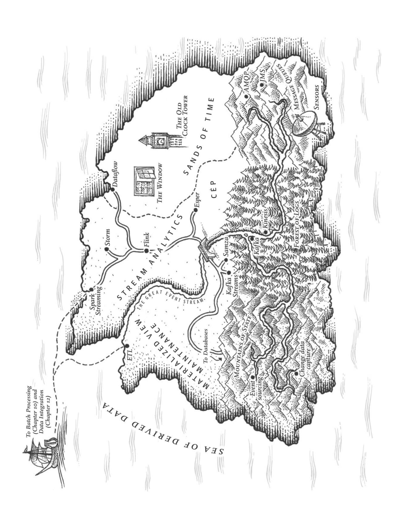

# **Stream Processing**

<span id="page-460-0"></span>*A complex system that works is invariably found to have evolved from a simple system that works. The inverse proposition also appears to be true: A complex system designed from scratch never works and cannot be made to work.*

—John Gall, *Systemantics* (1975)

In [Chapter 10](#page-410-0) we discussed batch processing—techniques that read a set of files as input and produce a new set of output files. The output is a form of *derived data*; that is, a dataset that can be recreated by running the batch process again if necessary. We saw how this simple but powerful idea can be used to create search indexes, recom‐ mendation systems, analytics, and more.

However, one big assumption remained throughout [Chapter 10](#page-410-0): namely, that the input is bounded—i.e., of a known and finite size—so the batch process knows when it has finished reading its input. For example, the sorting operation that is central to MapReduce must read its entire input before it can start producing output: it could happen that the very last input record is the one with the lowest key, and thus needs to be the very first output record, so starting the output early is not an option.

In reality, a lot of data is unbounded because it arrives gradually over time: your users produced data yesterday and today, and they will continue to produce more data tomorrow. Unless you go out of business, this process never ends, and so the dataset is never "complete" in any meaningful way [\[1](#page-502-0)]. Thus, batch processors must artifi‐ cially divide the data into chunks of fixed duration: for example, processing a day's worth of data at the end of every day, or processing an hour's worth of data at the end of every hour.

The problem with daily batch processes is that changes in the input are only reflected in the output a day later, which is too slow for many impatient users. To reduce the delay, we can run the processing more frequently—say, processing a second's worth of data at the end of every second—or even continuously, abandoning the fixed time <span id="page-461-0"></span>slices entirely and simply processing every event as it happens. That is the idea behind *stream processing*.

In general, a "stream" refers to data that is incrementally made available over time. The concept appears in many places: in the stdin and stdout of Unix, programming languages (lazy lists) [\[2](#page-502-0)], filesystem APIs (such as Java's FileInputStream), TCP con‐ nections, delivering audio and video over the internet, and so on.

In this chapter we will look at *event streams* as a data management mechanism: the unbounded, incrementally processed counterpart to the batch data we saw in the last chapter. We will first discuss how streams are represented, stored, and transmit‐ ted over a network. In ["Databases and Streams" on page 451](#page-472-0) we will investigate the relationship between streams and databases. And finally, in ["Processing Streams"](#page-485-0) [on page 464](#page-485-0) we will explore approaches and tools for processing those streams continually, and ways that they can be used to build applications.

## **Transmitting Event Streams**

In the batch processing world, the inputs and outputs of a job are files (perhaps on a distributed filesystem). What does the streaming equivalent look like?

When the input is a file (a sequence of bytes), the first processing step is usually to parse it into a sequence of records. In a stream processing context, a record is more commonly known as an *event*, but it is essentially the same thing: a small, selfcontained, immutable object containing the details of something that happened at some point in time. An event usually contains a timestamp indicating when it hap‐ pened according to a time-of-day clock (see ["Monotonic Versus Time-of-Day](#page-309-0) [Clocks" on page 288\)](#page-309-0).

For example, the thing that happened might be an action that a user took, such as viewing a page or making a purchase. It might also originate from a machine, such as a periodic measurement from a temperature sensor, or a CPU utilization metric. In the example of ["Batch Processing with Unix Tools"](#page-412-0) on page 391, each line of the web server log is an event.

An event may be encoded as a text string, or JSON, or perhaps in some binary form, as discussed in [Chapter 4.](#page-132-0) This encoding allows you to store an event, for example by appending it to a file, inserting it into a relational table, or writing it to a document database. It also allows you to send the event over the network to another node in order to process it.

In batch processing, a file is written once and then potentially read by multiple jobs. Analogously, in streaming terminology, an event is generated once by a *producer* (also known as a *publisher* or *sender*), and then potentially processed by multiple *con‐ sumers* (*subscribers* or *recipients*) [[3\]](#page-502-0). In a filesystem, a filename identifies a set of <span id="page-462-0"></span>related records; in a streaming system, related events are usually grouped together into a *topic* or *stream*.

In principle, a file or database is sufficient to connect producers and consumers: a producer writes every event that it generates to the datastore, and each consumer periodically polls the datastore to check for events that have appeared since it last ran. This is essentially what a batch process does when it processes a day's worth of data at the end of every day.

However, when moving toward continual processing with low delays, polling becomes expensive if the datastore is not designed for this kind of usage. The more often you poll, the lower the percentage of requests that return new events, and thus the higher the overheads become. Instead, it is better for consumers to be notified when new events appear.

Databases have traditionally not supported this kind of notification mechanism very well: relational databases commonly have *triggers*, which can react to a change (e.g., a row being inserted into a table), but they are very limited in what they can do and have been somewhat of an afterthought in database design [\[4](#page-502-0), [5\]](#page-502-0). Instead, specialized tools have been developed for the purpose of delivering event notifications.

## **Messaging Systems**

A common approach for notifying consumers about new events is to use a *messaging system*: a producer sends a message containing the event, which is then pushed to consumers. We touched on these systems previously in ["Message-Passing Dataflow"](#page-157-0) [on page 136](#page-157-0), but we will now go into more detail.

A direct communication channel like a Unix pipe or TCP connection between pro‐ ducer and consumer would be a simple way of implementing a messaging system. However, most messaging systems expand on this basic model. In particular, Unix pipes and TCP connect exactly one sender with one recipient, whereas a messaging system allows multiple producer nodes to send messages to the same topic and allows multiple consumer nodes to receive messages in a topic.

Within this *publish/subscribe* model, different systems take a wide range of approaches, and there is no one right answer for all purposes. To differentiate the systems, it is particularly helpful to ask the following two questions:

1. *What happens if the producers send messages faster than the consumers can pro‐ cess them?* Broadly speaking, there are three options: the system can drop mes‐ sages, buffer messages in a queue, or apply *backpressure* (also known as *flow control*; i.e., blocking the producer from sending more messages). For example, Unix pipes and TCP use backpressure: they have a small fixed-size buffer, and if <span id="page-463-0"></span>it fills up, the sender is blocked until the recipient takes data out of the buffer (see ["Network congestion and queueing" on page 282](#page-303-0)).

If messages are buffered in a queue, it is important to understand what happens as that queue grows. Does the system crash if the queue no longer fits in mem‐ ory, or does it write messages to disk? If so, how does the disk access affect the performance of the messaging system [[6\]](#page-502-0)?

2. *What happens if nodes crash or temporarily go offline—are any messages lost?* As with databases, durability may require some combination of writing to disk and/or replication (see the sidebar ["Replication and Durability" on page 227\)](#page-248-0), which has a cost. If you can afford to sometimes lose messages, you can probably get higher throughput and lower latency on the same hardware.

Whether message loss is acceptable depends very much on the application. For exam‐ ple, with sensor readings and metrics that are transmitted periodically, an occasional missing data point is perhaps not important, since an updated value will be sent a short time later anyway. However, beware that if a large number of messages are dropped, it may not be immediately apparent that the metrics are incorrect [[7\]](#page-503-0). If you are counting events, it is more important that they are delivered reliably, since every lost message means incorrect counters.

A nice property of the batch processing systems we explored in [Chapter 10](#page-410-0) is that they provide a strong reliability guarantee: failed tasks are automatically retried, and partial output from failed tasks is automatically discarded. This means the output is the same as if no failures had occurred, which helps simplify the programming model. Later in this chapter we will examine how we can provide similar guarantees in a streaming context.

#### **Direct messaging from producers to consumers**

A number of messaging systems use direct network communication between produc‐ ers and consumers without going via intermediary nodes:

- UDP multicast is widely used in the financial industry for streams such as stock market feeds, where low latency is important [\[8](#page-503-0)]. Although UDP itself is unrelia‐ ble, application-level protocols can recover lost packets (the producer must remember packets it has sent so that it can retransmit them on demand).
- Brokerless messaging libraries such as ZeroMQ [[9\]](#page-503-0) and nanomsg take a similar approach, implementing publish/subscribe messaging over TCP or IP multicast.
- StatsD [[10\]](#page-503-0) and Brubeck [[7\]](#page-503-0) use unreliable UDP messaging for collecting metrics from all machines on the network and monitoring them. (In the StatsD protocol, counter metrics are only correct if all messages are received; using UDP makes the metrics at best approximate [\[11](#page-503-0)]. See also ["TCP Versus UDP" on page 283.](#page-304-0))

<span id="page-464-0"></span>• If the consumer exposes a service on the network, producers can make a direct HTTP or RPC request (see ["Dataflow Through Services: REST and RPC" on page](#page-152-0) [131](#page-152-0)) to push messages to the consumer. This is the idea behind webhooks [[12\]](#page-503-0), a pattern in which a callback URL of one service is registered with another service, and it makes a request to that URL whenever an event occurs.

Although these direct messaging systems work well in the situations for which they are designed, they generally require the application code to be aware of the possibility of message loss. The faults they can tolerate are quite limited: even if the protocols detect and retransmit packets that are lost in the network, they generally assume that producers and consumers are constantly online.

If a consumer is offline, it may miss messages that were sent while it is unreachable. Some protocols allow the producer to retry failed message deliveries, but this approach may break down if the producer crashes, losing the buffer of messages that it was supposed to retry.

## **Message brokers**

A widely used alternative is to send messages via a *message broker* (also known as a *message queue*), which is essentially a kind of database that is optimized for handling message streams [[13](#page-503-0)]. It runs as a server, with producers and consumers connecting to it as clients. Producers write messages to the broker, and consumers receive them by reading them from the broker.

By centralizing the data in the broker, these systems can more easily tolerate clients that come and go (connect, disconnect, and crash), and the question of durability is moved to the broker instead. Some message brokers only keep messages in memory, while others (depending on configuration) write them to disk so that they are not lost in case of a broker crash. Faced with slow consumers, they generally allow unboun‐ ded queueing (as opposed to dropping messages or backpressure), although this choice may also depend on the configuration.

A consequence of queueing is also that consumers are generally *asynchronous*: when a producer sends a message, it normally only waits for the broker to confirm that it has buffered the message and does not wait for the message to be processed by con‐ sumers. The delivery to consumers will happen at some undetermined future point in time—often within a fraction of a second, but sometimes significantly later if there is a queue backlog.

## **Message brokers compared to databases**

Some message brokers can even participate in two-phase commit protocols using XA or JTA (see ["Distributed Transactions in Practice" on page 360\)](#page-381-0). This feature makes <span id="page-465-0"></span>them quite similar in nature to databases, although there are still important practical differences between message brokers and databases:

- Databases usually keep data until it is explicitly deleted, whereas most message brokers automatically delete a message when it has been successfully delivered to its consumers. Such message brokers are not suitable for long-term data storage.
- Since they quickly delete messages, most message brokers assume that their working set is fairly small—i.e., the queues are short. If the broker needs to buffer a lot of messages because the consumers are slow (perhaps spilling messages to disk if they no longer fit in memory), each individual message takes longer to process, and the overall throughput may degrade [[6\]](#page-502-0).
- Databases often support secondary indexes and various ways of searching for data, while message brokers often support some way of subscribing to a subset of topics matching some pattern. The mechanisms are different, but both are essen‐ tially ways for a client to select the portion of the data that it wants to know about.
- When querying a database, the result is typically based on a point-in-time snap‐ shot of the data; if another client subsequently writes something to the database that changes the query result, the first client does not find out that its prior result is now outdated (unless it repeats the query, or polls for changes). By contrast, message brokers do not support arbitrary queries, but they do notify clients when data changes (i.e., when new messages become available).

This is the traditional view of message brokers, which is encapsulated in standards like JMS [[14\]](#page-503-0) and AMQP [[15\]](#page-503-0) and implemented in software like RabbitMQ, ActiveMQ, HornetQ, Qpid, TIBCO Enterprise Message Service, IBM MQ, Azure Ser‐ vice Bus, and Google Cloud Pub/Sub [[16](#page-503-0)].

## **Multiple consumers**

When multiple consumers read messages in the same topic, two main patterns of messaging are used, as illustrated in [Figure 11-1:](#page-466-0)

## *Load balancing*

Each message is delivered to *one* of the consumers, so the consumers can share the work of processing the messages in the topic. The broker may assign mes‐ sages to consumers arbitrarily. This pattern is useful when the messages are expensive to process, and so you want to be able to add consumers to parallelize the processing. (In AMQP, you can implement load balancing by having multi‐ ple clients consuming from the same queue, and in JMS it is called a *shared subscription*.)

#### <span id="page-466-0"></span>*Fan-out*

Each message is delivered to *all* of the consumers. Fan-out allows several inde‐ pendent consumers to each "tune in" to the same broadcast of messages, without affecting each other—the streaming equivalent of having several different batch jobs that read the same input file. (This feature is provided by topic subscriptions in JMS, and exchange bindings in AMQP.)

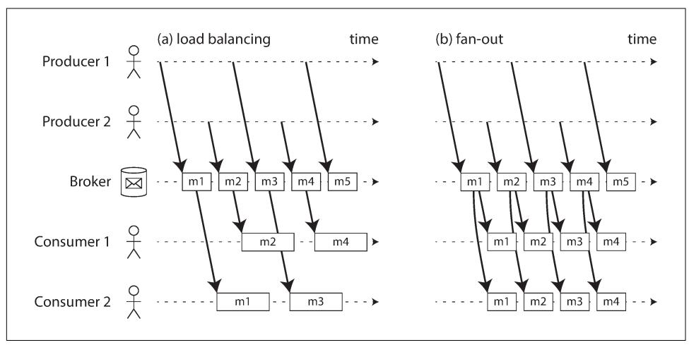

*Figure 11-1. (a) Load balancing: sharing the work of consuming a topic among con‐ sumers; (b) fan-out: delivering each message to multiple consumers.*

The two patterns can be combined: for example, two separate groups of consumers may each subscribe to a topic, such that each group collectively receives all messages, but within each group only one of the nodes receives each message.

## **Acknowledgments and redelivery**

Consumers may crash at any time, so it could happen that a broker delivers a mes‐ sage to a consumer but the consumer never processes it, or only partially processes it before crashing. In order to ensure that the message is not lost, message brokers use *acknowledgments*: a client must explicitly tell the broker when it has finished process‐ ing a message so that the broker can remove it from the queue.

If the connection to a client is closed or times out without the broker receiving an acknowledgment, it assumes that the message was not processed, and therefore it delivers the message again to another consumer. (Note that it could happen that the message actually *was* fully processed, but the acknowledgment was lost in the net‐ work. Handling this case requires an atomic commit protocol, as discussed in ["Dis‐](#page-381-0) [tributed Transactions in Practice" on page 360](#page-381-0).)

<span id="page-467-0"></span>When combined with load balancing, this redelivery behavior has an interesting effect on the ordering of messages. In Figure 11-2, the consumers generally process messages in the order they were sent by producers. However, consumer 2 crashes while processing message *m3*, at the same time as consumer 1 is processing message *m4*. The unacknowledged message *m3* is subsequently redelivered to consumer 1, with the result that consumer 1 processes messages in the order *m4*, *m3*, *m5*. Thus, *m3* and *m4* are not delivered in the same order as they were sent by producer 1.

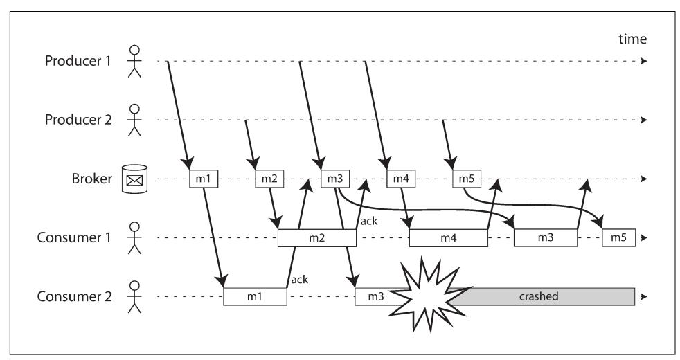

*Figure 11-2. Consumer 2 crashes while processing m3, so it is redelivered to consumer 1 at a later time.*

Even if the message broker otherwise tries to preserve the order of messages (as required by both the JMS and AMQP standards), the combination of load balancing with redelivery inevitably leads to messages being reordered. To avoid this issue, you can use a separate queue per consumer (i.e., not use the load balancing feature). Mes‐ sage reordering is not a problem if messages are completely independent of each other, but it can be important if there are causal dependencies between messages, as we shall see later in the chapter.

## **Partitioned Logs**

Sending a packet over a network or making a request to a network service is normally a transient operation that leaves no permanent trace. Although it is possible to record it permanently (using packet capture and logging), we normally don't think of it that way. Even message brokers that durably write messages to disk quickly delete them again after they have been delivered to consumers, because they are built around a transient messaging mindset.

<span id="page-468-0"></span>Databases and filesystems take the opposite approach: everything that is written to a database or file is normally expected to be permanently recorded, at least until some‐ one explicitly chooses to delete it again.

This difference in mindset has a big impact on how derived data is created. A key feature of batch processes, as discussed in [Chapter 10,](#page-410-0) is that you can run them repeatedly, experimenting with the processing steps, without risk of damaging the input (since the input is read-only). This is not the case with AMQP/JMS-style mes‐ saging: receiving a message is destructive if the acknowledgment causes it to be deleted from the broker, so you cannot run the same consumer again and expect to get the same result.

If you add a new consumer to a messaging system, it typically only starts receiving messages sent after the time it was registered; any prior messages are already gone and cannot be recovered. Contrast this with files and databases, where you can add a new client at any time, and it can read data written arbitrarily far in the past (as long as it has not been explicitly overwritten or deleted by the application).

Why can we not have a hybrid, combining the durable storage approach of databases with the low-latency notification facilities of messaging? This is the idea behind *logbased message brokers*.

#### **Using logs for message storage**

A log is simply an append-only sequence of records on disk. We previously discussed logs in the context of log-structured storage engines and write-ahead logs in [Chap‐](#page-90-0) [ter 3,](#page-90-0) and in the context of replication in [Chapter 5.](#page-172-0)

The same structure can be used to implement a message broker: a producer sends a message by appending it to the end of the log, and a consumer receives messages by reading the log sequentially. If a consumer reaches the end of the log, it waits for a notification that a new message has been appended. The Unix tool tail -f, which watches a file for data being appended, essentially works like this.

In order to scale to higher throughput than a single disk can offer, the log can be *partitioned* (in the sense of [Chapter 6\)](#page-220-0). Different partitions can then be hosted on dif‐ ferent machines, making each partition a separate log that can be read and written independently from other partitions. A topic can then be defined as a group of parti‐ tions that all carry messages of the same type. This approach is illustrated in [Figure 11-3](#page-469-0).

Within each partition, the broker assigns a monotonically increasing sequence num‐ ber, or *offset*, to every message (in [Figure 11-3,](#page-469-0) the numbers in boxes are message off‐ sets). Such a sequence number makes sense because a partition is append-only, so the messages within a partition are totally ordered. There is no ordering guarantee across different partitions.

<span id="page-469-0"></span>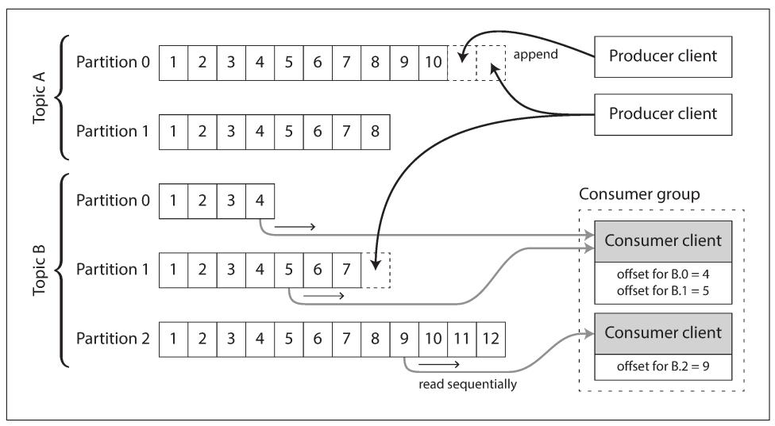

*Figure 11-3. Producers send messages by appending them to a topic-partition file, and consumers read these files sequentially.*

Apache Kafka [[17,](#page-503-0) [18\]](#page-503-0), Amazon Kinesis Streams [\[19](#page-503-0)], and Twitter's DistributedLog [[20,](#page-503-0) [21](#page-503-0)] are log-based message brokers that work like this. Google Cloud Pub/Sub is architecturally similar but exposes a JMS-style API rather than a log abstraction [[16\]](#page-503-0). Even though these message brokers write all messages to disk, they are able to achieve throughput of millions of messages per second by partitioning across multiple machines, and fault tolerance by replicating messages [[22, 23](#page-503-0)].

## **Logs compared to traditional messaging**

The log-based approach trivially supports fan-out messaging, because several con‐ sumers can independently read the log without affecting each other—reading a mes‐ sage does not delete it from the log. To achieve load balancing across a group of consumers, instead of assigning individual messages to consumer clients, the broker can assign entire partitions to nodes in the consumer group.

Each client then consumes *all* the messages in the partitions it has been assigned. Typically, when a consumer has been assigned a log partition, it reads the messages in the partition sequentially, in a straightforward single-threaded manner. This coarsegrained load balancing approach has some downsides:

- <span id="page-470-0"></span>• The number of nodes sharing the work of consuming a topic can be at most the number of log partitions in that topic, because messages within the same parti‐ tion are delivered to the same node.<sup>i</sup>
- If a single message is slow to process, it holds up the processing of subsequent messages in that partition (a form of head-of-line blocking; see ["Describing Per‐](#page-34-0) [formance" on page 13](#page-34-0)).

Thus, in situations where messages may be expensive to process and you want to par‐ allelize processing on a message-by-message basis, and where message ordering is not so important, the JMS/AMQP style of message broker is preferable. On the other hand, in situations with high message throughput, where each message is fast to pro‐ cess and where message ordering is important, the log-based approach works very well.

## **Consumer offsets**

Consuming a partition sequentially makes it easy to tell which messages have been processed: all messages with an offset less than a consumer's current offset have already been processed, and all messages with a greater offset have not yet been seen. Thus, the broker does not need to track acknowledgments for every single message it only needs to periodically record the consumer offsets. The reduced bookkeeping overhead and the opportunities for batching and pipelining in this approach help increase the throughput of log-based systems.

This offset is in fact very similar to the *log sequence number* that is commonly found in single-leader database replication, and which we discussed in ["Setting Up New](#page-176-0) [Followers" on page 155.](#page-176-0) In database replication, the log sequence number allows a follower to reconnect to a leader after it has become disconnected, and resume repli‐ cation without skipping any writes. Exactly the same principle is used here: the mes‐ sage broker behaves like a leader database, and the consumer like a follower.

If a consumer node fails, another node in the consumer group is assigned the failed consumer's partitions, and it starts consuming messages at the last recorded offset. If the consumer had processed subsequent messages but not yet recorded their offset, those messages will be processed a second time upon restart. We will discuss ways of dealing with this issue later in the chapter.

i. It's possible to create a load balancing scheme in which two consumers share the work of processing a par‐ tition by having both read the full set of messages, but one of them only considers messages with evennumbered offsets while the other deals with the odd-numbered offsets. Alternatively, you could spread message processing over a thread pool, but that approach complicates consumer offset management. In gen‐ eral, single-threaded processing of a partition is preferable, and parallelism can be increased by using more partitions.

## <span id="page-471-0"></span>**Disk space usage**

If you only ever append to the log, you will eventually run out of disk space. To reclaim disk space, the log is actually divided into segments, and from time to time old segments are deleted or moved to archive storage. (We'll discuss a more sophisti‐ cated way of freeing disk space later.)

This means that if a slow consumer cannot keep up with the rate of messages, and it falls so far behind that its consumer offset points to a deleted segment, it will miss some of the messages. Effectively, the log implements a bounded-size buffer that dis‐ cards old messages when it gets full, also known as a *circular buffer* or *ring buffer*. However, since that buffer is on disk, it can be quite large.

Let's do a back-of-the-envelope calculation. At the time of writing, a typical large hard drive has a capacity of 6 TB and a sequential write throughput of 150 MB/s. If you are writing messages at the fastest possible rate, it takes about 11 hours to fill the drive. Thus, the disk can buffer 11 hours' worth of messages, after which it will start overwriting old messages. This ratio remains the same, even if you use many hard drives and machines. In practice, deployments rarely use the full write bandwidth of the disk, so the log can typically keep a buffer of several days' or even weeks' worth of messages.

Regardless of how long you retain messages, the throughput of a log remains more or less constant, since every message is written to disk anyway [[18\]](#page-503-0). This behavior is in contrast to messaging systems that keep messages in memory by default and only write them to disk if the queue grows too large: such systems are fast when queues are short and become much slower when they start writing to disk, so the throughput depends on the amount of history retained.

## **When consumers cannot keep up with producers**

At the beginning of ["Messaging Systems" on page 441](#page-462-0) we discussed three choices of what to do if a consumer cannot keep up with the rate at which producers are send‐ ing messages: dropping messages, buffering, or applying backpressure. In this taxon‐ omy, the log-based approach is a form of buffering with a large but fixed-size buffer (limited by the available disk space).

If a consumer falls so far behind that the messages it requires are older than what is retained on disk, it will not be able to read those messages—so the broker effectively drops old messages that go back further than the size of the buffer can accommodate. You can monitor how far a consumer is behind the head of the log, and raise an alert if it falls behind significantly. As the buffer is large, there is enough time for a human operator to fix the slow consumer and allow it to catch up before it starts missing messages.

<span id="page-472-0"></span>Even if a consumer does fall too far behind and starts missing messages, only that consumer is affected; it does not disrupt the service for other consumers. This fact is a big operational advantage: you can experimentally consume a production log for development, testing, or debugging purposes, without having to worry much about disrupting production services. When a consumer is shut down or crashes, it stops consuming resources—the only thing that remains is its consumer offset.

This behavior also contrasts with traditional message brokers, where you need to be careful to delete any queues whose consumers have been shut down—otherwise they continue unnecessarily accumulating messages and taking away memory from con‐ sumers that are still active.

#### **Replaying old messages**

We noted previously that with AMQP- and JMS-style message brokers, processing and acknowledging messages is a destructive operation, since it causes the messages to be deleted on the broker. On the other hand, in a log-based message broker, con‐ suming messages is more like reading from a file: it is a read-only operation that does not change the log.

The only side effect of processing, besides any output of the consumer, is that the consumer offset moves forward. But the offset is under the consumer's control, so it can easily be manipulated if necessary: for example, you can start a copy of a con‐ sumer with yesterday's offsets and write the output to a different location, in order to reprocess the last day's worth of messages. You can repeat this any number of times, varying the processing code.

This aspect makes log-based messaging more like the batch processes of the last chapter, where derived data is clearly separated from input data through a repeatable transformation process. It allows more experimentation and easier recovery from errors and bugs, making it a good tool for integrating dataflows within an organiza‐ tion [\[24](#page-503-0)].

## **Databases and Streams**

We have drawn some comparisons between message brokers and databases. Even though they have traditionally been considered separate categories of tools, we saw that log-based message brokers have been successful in taking ideas from databases and applying them to messaging. We can also go in reverse: take ideas from messag‐ ing and streams, and apply them to databases.

We said previously that an event is a record of something that happened at some point in time. The thing that happened may be a user action (e.g., typing a search query), or a sensor reading, but it may also be a *write to a database*. The fact that something was written to a database is an event that can be captured, stored, and pro‐

<span id="page-473-0"></span>cessed. This observation suggests that the connection between databases and streams runs deeper than just the physical storage of logs on disk—it is quite fundamental.

In fact, a replication log (see ["Implementation of Replication Logs"](#page-179-0) on page 158) is a stream of database write events, produced by the leader as it processes transactions. The followers apply that stream of writes to their own copy of the database and thus end up with an accurate copy of the same data. The events in the replication log describe the data changes that occurred.

We also came across the *state machine replication* principle in ["Total Order Broad‐](#page-369-0) [cast" on page 348,](#page-369-0) which states: if every event represents a write to the database, and every replica processes the same events in the same order, then the replicas will all end up in the same final state. (Processing an event is assumed to be a deterministic operation.) It's just another case of event streams!

In this section we will first look at a problem that arises in heterogeneous data sys‐ tems, and then explore how we can solve it by bringing ideas from event streams to databases.

## **Keeping Systems in Sync**

As we have seen throughout this book, there is no single system that can satisfy all data storage, querying, and processing needs. In practice, most nontrivial applica‐ tions need to combine several different technologies in order to satisfy their require‐ ments: for example, using an OLTP database to serve user requests, a cache to speed up common requests, a full-text index to handle search queries, and a data warehouse for analytics. Each of these has its own copy of the data, stored in its own representa‐ tion that is optimized for its own purposes.

As the same or related data appears in several different places, they need to be kept in sync with one another: if an item is updated in the database, it also needs to be upda‐ ted in the cache, search indexes, and data warehouse. With data warehouses this syn‐ chronization is usually performed by ETL processes (see ["Data Warehousing" on](#page-112-0) [page 91\)](#page-112-0), often by taking a full copy of a database, transforming it, and bulk-loading it into the data warehouse—in other words, a batch process. Similarly, we saw in ["The Output of Batch Workflows" on page 411](#page-432-0) how search indexes, recommendation systems, and other derived data systems might be created using batch processes.

If periodic full database dumps are too slow, an alternative that is sometimes used is *dual writes*, in which the application code explicitly writes to each of the systems when data changes: for example, first writing to the database, then updating the search index, then invalidating the cache entries (or even performing those writes concurrently).

However, dual writes have some serious problems, one of which is a race condition illustrated in [Figure 11-4.](#page-474-0) In this example, two clients concurrently want to update an <span id="page-474-0"></span>item X: client 1 wants to set the value to A, and client 2 wants to set it to B. Both clients first write the new value to the database, then write it to the search index. Due to unlucky timing, the requests are interleaved: the database first sees the write from client 1 setting the value to A, then the write from client 2 setting the value to B, so the final value in the database is B. The search index first sees the write from client 2, then client 1, so the final value in the search index is A. The two systems are now permanently inconsistent with each other, even though no error occurred.

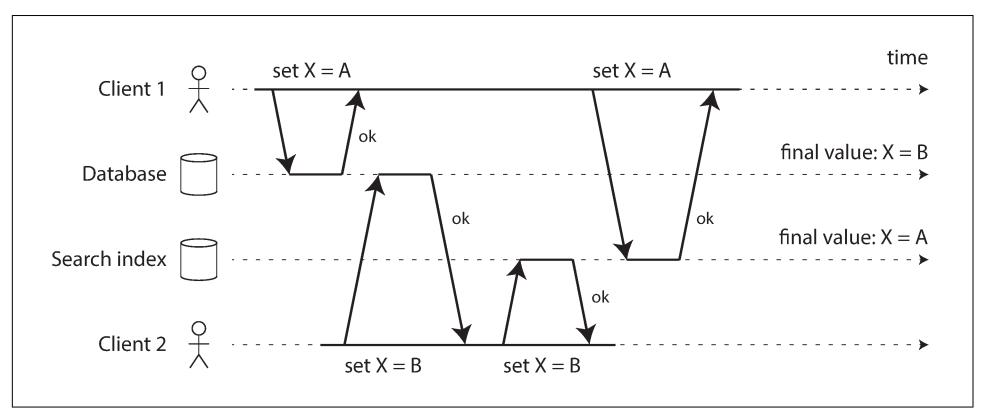

*Figure 11-4. In the database, X is first set to A and then to B, while at the search index the writes arrive in the opposite order.*

Unless you have some additional concurrency detection mechanism, such as the ver‐ sion vectors we discussed in ["Detecting Concurrent Writes" on page 184,](#page-205-0) you will not even notice that concurrent writes occurred—one value will simply silently overwrite another value.

Another problem with dual writes is that one of the writes may fail while the other succeeds. This is a fault-tolerance problem rather than a concurrency problem, but it also has the effect of the two systems becoming inconsistent with each other. Ensur‐ ing that they either both succeed or both fail is a case of the atomic commit problem, which is expensive to solve (see ["Atomic Commit and Two-Phase Commit \(2PC\)" on](#page-375-0) [page 354\)](#page-375-0).

If you only have one replicated database with a single leader, then that leader deter‐ mines the order of writes, so the state machine replication approach works among replicas of the database. However, in Figure 11-4 there isn't a single leader: the data‐ base may have a leader and the search index may have a leader, but neither follows the other, and so conflicts can occur (see ["Multi-Leader Replication" on page 168\)](#page-189-0).

The situation would be better if there really was only one leader—for example, the database—and if we could make the search index a follower of the database. But is this possible in practice?

## <span id="page-475-0"></span>**Change Data Capture**

The problem with most databases' replication logs is that they have long been consid‐ ered to be an internal implementation detail of the database, not a public API. Clients are supposed to query the database through its data model and query language, not parse the replication logs and try to extract data from them.

For decades, many databases simply did not have a documented way of getting the log of changes written to them. For this reason it was difficult to take all the changes made in a database and replicate them to a different storage technology such as a search index, cache, or data warehouse.

More recently, there has been growing interest in *change data capture* (CDC), which is the process of observing all data changes written to a database and extracting them in a form in which they can be replicated to other systems. CDC is especially interest‐ ing if changes are made available as a stream, immediately as they are written.

For example, you can capture the changes in a database and continually apply the same changes to a search index. If the log of changes is applied in the same order, you can expect the data in the search index to match the data in the database. The search index and any other derived data systems are just consumers of the change stream, as illustrated in Figure 11-5.

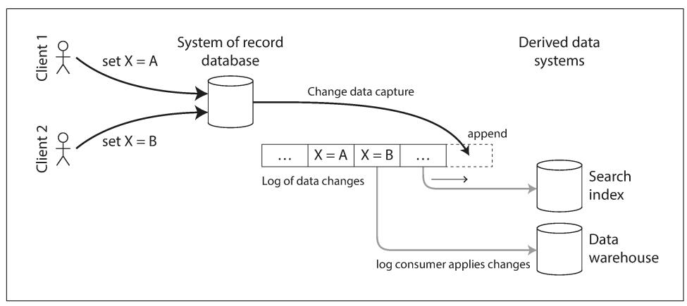

*Figure 11-5. Taking data in the order it was written to one database, and applying the changes to other systems in the same order.*

## **Implementing change data capture**

We can call the log consumers *derived data systems*, as discussed in the introduction to [Part III](#page-406-0): the data stored in the search index and the data warehouse is just another view onto the data in the system of record. Change data capture is a mechanism for ensuring that all changes made to the system of record are also reflected in the derived data systems so that the derived systems have an accurate copy of the data.

<span id="page-476-0"></span>Essentially, change data capture makes one database the leader (the one from which the changes are captured), and turns the others into followers. A log-based message broker is well suited for transporting the change events from the source database, since it preserves the ordering of messages (avoiding the reordering issue of [Figure 11-2](#page-467-0)).

Database triggers can be used to implement change data capture (see ["Trigger-based](#page-182-0) [replication" on page 161](#page-182-0)) by registering triggers that observe all changes to data tables and add corresponding entries to a changelog table. However, they tend to be fragile and have significant performance overheads. Parsing the replication log can be a more robust approach, although it also comes with challenges, such as handling schema changes.

LinkedIn's Databus [[25\]](#page-504-0), Facebook's Wormhole [\[26\]](#page-504-0), and Yahoo!'s Sherpa [[27\]](#page-504-0) use this idea at large scale. Bottled Water implements CDC for PostgreSQL using an API that decodes the write-ahead log [[28\]](#page-504-0), Maxwell and Debezium do something similar for MySQL by parsing the binlog [[29,](#page-504-0) [30](#page-504-0), [31](#page-504-0)], Mongoriver reads the MongoDB oplog [[32, 33\]](#page-504-0), and GoldenGate provides similar facilities for Oracle [[34,](#page-504-0) [35\]](#page-504-0).

Like message brokers, change data capture is usually asynchronous: the system of record database does not wait for the change to be applied to consumers before com‐ mitting it. This design has the operational advantage that adding a slow consumer does not affect the system of record too much, but it has the downside that all the issues of replication lag apply (see ["Problems with Replication Lag" on page 161\)](#page-182-0).

#### **Initial snapshot**

If you have the log of all changes that were ever made to a database, you can recon‐ struct the entire state of the database by replaying the log. However, in many cases, keeping all changes forever would require too much disk space, and replaying it would take too long, so the log needs to be truncated.

Building a new full-text index, for example, requires a full copy of the entire database —it is not sufficient to only apply a log of recent changes, since it would be missing items that were not recently updated. Thus, if you don't have the entire log history, you need to start with a consistent snapshot, as previously discussed in ["Setting Up](#page-176-0) [New Followers" on page 155.](#page-176-0)

The snapshot of the database must correspond to a known position or offset in the change log, so that you know at which point to start applying changes after the snap‐ shot has been processed. Some CDC tools integrate this snapshot facility, while oth‐ ers leave it as a manual operation.

## <span id="page-477-0"></span>**Log compaction**

If you can only keep a limited amount of log history, you need to go through the snapshot process every time you want to add a new derived data system. However, *log compaction* provides a good alternative.

We discussed log compaction previously in ["Hash Indexes" on page 72,](#page-93-0) in the con‐ text of log-structured storage engines (see [Figure 3-2](#page-94-0) for an example). The principle is simple: the storage engine periodically looks for log records with the same key, throws away any duplicates, and keeps only the most recent update for each key. This compaction and merging process runs in the background.

In a log-structured storage engine, an update with a special null value (a *tombstone*) indicates that a key was deleted, and causes it to be removed during log compaction. But as long as a key is not overwritten or deleted, it stays in the log forever. The disk space required for such a compacted log depends only on the current contents of the database, not the number of writes that have ever occurred in the database. If the same key is frequently overwritten, previous values will eventually be garbagecollected, and only the latest value will be retained.

The same idea works in the context of log-based message brokers and change data capture. If the CDC system is set up such that every change has a primary key, and every update for a key replaces the previous value for that key, then it's sufficient to keep just the most recent write for a particular key.

Now, whenever you want to rebuild a derived data system such as a search index, you can start a new consumer from offset 0 of the log-compacted topic, and sequentially scan over all messages in the log. The log is guaranteed to contain the most recent value for every key in the database (and maybe some older values)—in other words, you can use it to obtain a full copy of the database contents without having to take another snapshot of the CDC source database.

This log compaction feature is supported by Apache Kafka. As we shall see later in this chapter, it allows the message broker to be used for durable storage, not just for transient messaging.

## **API support for change streams**

Increasingly, databases are beginning to support change streams as a first-class inter‐ face, rather than the typical retrofitted and reverse-engineered CDC efforts. For example, RethinkDB allows queries to subscribe to notifications when the results of a query change [[36\]](#page-504-0), Firebase [\[37](#page-504-0)] and CouchDB [\[38\]](#page-504-0) provide data synchronization based on a change feed that is also made available to applications, and Meteor uses the MongoDB oplog to subscribe to data changes and update the user interface [\[39](#page-504-0)].

VoltDB allows transactions to continuously export data from a database in the form of a stream [\[40](#page-504-0)]. The database represents an output stream in the relational data <span id="page-478-0"></span>model as a table into which transactions can insert tuples, but which cannot be quer‐ ied. The stream then consists of the log of tuples that committed transactions have written to this special table, in the order they were committed. External consumers can asynchronously consume this log and use it to update derived data systems.

Kafka Connect [[41\]](#page-504-0) is an effort to integrate change data capture tools for a wide range of database systems with Kafka. Once the stream of change events is in Kafka, it can be used to update derived data systems such as search indexes, and also feed into stream processing systems as discussed later in this chapter.

## **Event Sourcing**

There are some parallels between the ideas we've discussed here and *event sourcing*, a technique that was developed in the domain-driven design (DDD) community [[42,](#page-504-0) [43](#page-504-0), [44](#page-505-0)]. We will discuss event sourcing briefly, because it incorporates some useful and relevant ideas for streaming systems.

Similarly to change data capture, event sourcing involves storing all changes to the application state as a log of change events. The biggest difference is that event sourc‐ ing applies the idea at a different level of abstraction:

- In change data capture, the application uses the database in a mutable way, updating and deleting records at will. The log of changes is extracted from the database at a low level (e.g., by parsing the replication log), which ensures that the order of writes extracted from the database matches the order in which they were actually written, avoiding the race condition in [Figure 11-4.](#page-474-0) The application writing to the database does not need to be aware that CDC is occurring.
- In event sourcing, the application logic is explicitly built on the basis of immuta‐ ble events that are written to an event log. In this case, the event store is appendonly, and updates or deletes are discouraged or prohibited. Events are designed to reflect things that happened at the application level, rather than low-level state changes.

Event sourcing is a powerful technique for data modeling: from an application point of view it is more meaningful to record the user's actions as immutable events, rather than recording the effect of those actions on a mutable database. Event sourcing makes it easier to evolve applications over time, helps with debugging by making it easier to understand after the fact why something happened, and guards against application bugs (see ["Advantages of immutable events" on page 460\)](#page-481-0).

For example, storing the event "student cancelled their course enrollment" clearly expresses the intent of a single action in a neutral fashion, whereas the side effects "one entry was deleted from the enrollments table, and one cancellation reason was added to the student feedback table" embed a lot of assumptions about the way the <span id="page-479-0"></span>data is later going to be used. If a new application feature is introduced—for example, "the place is offered to the next person on the waiting list"—the event sourcing approach allows that new side effect to easily be chained off the existing event.

Event sourcing is similar to the chronicle data model [[45\]](#page-505-0), and there are also similari‐ ties between an event log and the fact table that you find in a star schema (see ["Stars](#page-114-0) [and Snowflakes: Schemas for Analytics" on page 93](#page-114-0)).

Specialized databases such as Event Store [\[46](#page-505-0)] have been developed to support appli‐ cations using event sourcing, but in general the approach is independent of any par‐ ticular tool. A conventional database or a log-based message broker can also be used to build applications in this style.

## **Deriving current state from the event log**

An event log by itself is not very useful, because users generally expect to see the cur‐ rent state of a system, not the history of modifications. For example, on a shopping website, users expect to be able to see the current contents of their cart, not an append-only list of all the changes they have ever made to their cart.

Thus, applications that use event sourcing need to take the log of events (representing the data *written* to the system) and transform it into application state that is suitable for showing to a user (the way in which data is *read* from the system [\[47\]](#page-505-0)). This transformation can use arbitrary logic, but it should be deterministic so that you can run it again and derive the same application state from the event log.

Like with change data capture, replaying the event log allows you to reconstruct the current state of the system. However, log compaction needs to be handled differently:

- A CDC event for the update of a record typically contains the entire new version of the record, so the current value for a primary key is entirely determined by the most recent event for that primary key, and log compaction can discard previous events for the same key.
- On the other hand, with event sourcing, events are modeled at a higher level: an event typically expresses the intent of a user action, not the mechanics of the state update that occurred as a result of the action. In this case, later events typically do not override prior events, and so you need the full history of events to recon‐ struct the final state. Log compaction is not possible in the same way.

Applications that use event sourcing typically have some mechanism for storing snapshots of the current state that is derived from the log of events, so they don't need to repeatedly reprocess the full log. However, this is only a performance optimi‐ zation to speed up reads and recovery from crashes; the intention is that the system is able to store all raw events forever and reprocess the full event log whenever required. We discuss this assumption in ["Limitations of immutability" on page 463.](#page-484-0)

#### <span id="page-480-0"></span>**Commands and events**

The event sourcing philosophy is careful to distinguish between *events* and *com‐ mands* [\[48](#page-505-0)]. When a request from a user first arrives, it is initially a command: at this point it may still fail, for example because some integrity condition is violated. The application must first validate that it can execute the command. If the validation is successful and the command is accepted, it becomes an event, which is durable and immutable.

For example, if a user tries to register a particular username, or reserve a seat on an airplane or in a theater, then the application needs to check that the username or seat is not already taken. (We previously discussed this example in ["Fault-Tolerant Con‐](#page-385-0) [sensus" on page 364](#page-385-0).) When that check has succeeded, the application can generate an event to indicate that a particular username was registered by a particular user ID, or that a particular seat has been reserved for a particular customer.

At the point when the event is generated, it becomes a *fact*. Even if the customer later decides to change or cancel the reservation, the fact remains true that they formerly held a reservation for a particular seat, and the change or cancellation is a separate event that is added later.

A consumer of the event stream is not allowed to reject an event: by the time the con‐ sumer sees the event, it is already an immutable part of the log, and it may have already been seen by other consumers. Thus, any validation of a command needs to happen synchronously, before it becomes an event—for example, by using a serializa‐ ble transaction that atomically validates the command and publishes the event.

Alternatively, the user request to reserve a seat could be split into two events: first a tentative reservation, and then a separate confirmation event once the reservation has been validated (as discussed in ["Implementing linearizable storage using total order](#page-371-0) [broadcast" on page 350](#page-371-0)). This split allows the validation to take place in an asynchro‐ nous process.

## **State, Streams, and Immutability**

We saw in [Chapter 10](#page-410-0) that batch processing benefits from the immutability of its input files, so you can run experimental processing jobs on existing input files without fear of damaging them. This principle of immutability is also what makes event sourcing and change data capture so powerful.

We normally think of databases as storing the current state of the application—this representation is optimized for reads, and it is usually the most convenient for serv‐ ing queries. The nature of state is that it changes, so databases support updating and deleting data as well as inserting it. How does this fit with immutability?

<span id="page-481-0"></span>Whenever you have state that changes, that state is the result of the events that muta‐ ted it over time. For example, your list of currently available seats is the result of the reservations you have processed, the current account balance is the result of the cred‐ its and debits on the account, and the response time graph for your web server is an aggregation of the individual response times of all web requests that have occurred.

No matter how the state changes, there was always a sequence of events that caused those changes. Even as things are done and undone, the fact remains true that those events occurred. The key idea is that mutable state and an append-only log of immut‐ able events do not contradict each other: they are two sides of the same coin. The log of all changes, the *changelog*, represents the evolution of state over time.

If you are mathematically inclined, you might say that the application state is what you get when you integrate an event stream over time, and a change stream is what you get when you differentiate the state by time, as shown in Figure 11-6 [[49,](#page-505-0) [50,](#page-505-0) [51\]](#page-505-0). The analogy has limitations (for example, the second derivative of state does not seem to be meaningful), but it's a useful starting point for thinking about data.

$$state(now) = \int_{t=0}^{now} stream(t) dt$$
  $stream(t) = \frac{d state(t)}{dt}$ 

*Figure 11-6. The relationship between the current application state and an event stream.*

If you store the changelog durably, that simply has the effect of making the state reproducible. If you consider the log of events to be your system of record, and any mutable state as being derived from it, it becomes easier to reason about the flow of data through a system. As Pat Helland puts it [[52\]](#page-505-0):

Transaction logs record all the changes made to the database. High-speed appends are the only way to change the log. From this perspective, the contents of the database hold a caching of the latest record values in the logs. The truth is the log. The database is a cache of a subset of the log. That cached subset happens to be the latest value of each record and index value from the log.

Log compaction, as discussed in ["Log compaction" on page 456](#page-477-0), is one way of bridg‐ ing the distinction between log and database state: it retains only the latest version of each record, and discards overwritten versions.

## **Advantages of immutable events**

Immutability in databases is an old idea. For example, accountants have been using immutability for centuries in financial bookkeeping. When a transaction occurs, it is <span id="page-482-0"></span>recorded in an append-only *ledger*, which is essentially a log of events describing money, goods, or services that have changed hands. The accounts, such as profit and loss or the balance sheet, are derived from the transactions in the ledger by adding them up [\[53](#page-505-0)].

If a mistake is made, accountants don't erase or change the incorrect transaction in the ledger—instead, they add another transaction that compensates for the mistake, for example refunding an incorrect charge. The incorrect transaction still remains in the ledger forever, because it might be important for auditing reasons. If incorrect figures, derived from the incorrect ledger, have already been published, then the fig‐ ures for the next accounting period include a correction. This process is entirely nor‐ mal in accounting [\[54](#page-505-0)].

Although such auditability is particularly important in financial systems, it is also beneficial for many other systems that are not subject to such strict regulation. As discussed in ["Philosophy of batch process outputs" on page 413,](#page-434-0) if you accidentally deploy buggy code that writes bad data to a database, recovery is much harder if the code is able to destructively overwrite data. With an append-only log of immutable events, it is much easier to diagnose what happened and recover from the problem.

Immutable events also capture more information than just the current state. For example, on a shopping website, a customer may add an item to their cart and then remove it again. Although the second event cancels out the first event from the point of view of order fulfillment, it may be useful to know for analytics purposes that the customer was considering a particular item but then decided against it. Perhaps they will choose to buy it in the future, or perhaps they found a substitute. This informa‐ tion is recorded in an event log, but would be lost in a database that deletes items when they are removed from the cart [[42](#page-504-0)].

## **Deriving several views from the same event log**

Moreover, by separating mutable state from the immutable event log, you can derive several different read-oriented representations from the same log of events. This works just like having multiple consumers of a stream [\(Figure 11-5\)](#page-475-0): for example, the analytic database Druid ingests directly from Kafka using this approach [\[55](#page-505-0)], Pista‐ chio is a distributed key-value store that uses Kafka as a commit log [\[56](#page-505-0)], and Kafka Connect sinks can export data from Kafka to various different databases and indexes [[41\]](#page-504-0). It would make sense for many other storage and indexing systems, such as search servers, to similarly take their input from a distributed log (see ["Keeping Sys‐](#page-473-0) [tems in Sync" on page 452](#page-473-0)).

Having an explicit translation step from an event log to a database makes it easier to evolve your application over time: if you want to introduce a new feature that presents your existing data in some new way, you can use the event log to build a separate read-optimized view for the new feature, and run it alongside the existing <span id="page-483-0"></span>systems without having to modify them. Running old and new systems side by side is often easier than performing a complicated schema migration in an existing system. Once the old system is no longer needed, you can simply shut it down and reclaim its resources [[47,](#page-505-0) [57\]](#page-505-0).

Storing data is normally quite straightforward if you don't have to worry about how it is going to be queried and accessed; many of the complexities of schema design, indexing, and storage engines are the result of wanting to support certain query and access patterns (see [Chapter 3\)](#page-90-0). For this reason, you gain a lot of flexibility by sepa‐ rating the form in which data is written from the form it is read, and by allowing sev‐ eral different read views. This idea is sometimes known as *command query responsibility segregation* (CQRS) [[42,](#page-504-0) [58, 59](#page-505-0)].

The traditional approach to database and schema design is based on the fallacy that data must be written in the same form as it will be queried. Debates about normaliza‐ tion and denormalization (see ["Many-to-One and Many-to-Many Relationships"](#page-54-0) on [page 33](#page-54-0)) become largely irrelevant if you can translate data from a write-optimized event log to read-optimized application state: it is entirely reasonable to denormalize data in the read-optimized views, as the translation process gives you a mechanism for keeping it consistent with the event log.

In ["Describing Load" on page 11](#page-32-0) we discussed Twitter's home timelines, a cache of recently written tweets by the people a particular user is following (like a mailbox). This is another example of read-optimized state: home timelines are highly denor‐ malized, since your tweets are duplicated in all of the timelines of the people follow‐ ing you. However, the fan-out service keeps this duplicated state in sync with new tweets and new following relationships, which keeps the duplication manageable.

## **Concurrency control**

The biggest downside of event sourcing and change data capture is that the consum‐ ers of the event log are usually asynchronous, so there is a possibility that a user may make a write to the log, then read from a log-derived view and find that their write has not yet been reflected in the read view. We discussed this problem and potential solutions previously in ["Reading Your Own Writes" on page 162.](#page-183-0)

One solution would be to perform the updates of the read view synchronously with appending the event to the log. This requires a transaction to combine the writes into an atomic unit, so either you need to keep the event log and the read view in the same storage system, or you need a distributed transaction across the different systems. Alternatively, you could use the approach discussed in ["Implementing linearizable](#page-371-0) [storage using total order broadcast" on page 350.](#page-371-0)

On the other hand, deriving the current state from an event log also simplifies some aspects of concurrency control. Much of the need for multi-object transactions (see ["Single-Object and Multi-Object Operations" on page 228\)](#page-249-0) stems from a single user <span id="page-484-0"></span>action requiring data to be changed in several different places. With event sourcing, you can design an event such that it is a self-contained description of a user action. The user action then requires only a single write in one place—namely appending the events to the log—which is easy to make atomic.

If the event log and the application state are partitioned in the same way (for exam‐ ple, processing an event for a customer in partition 3 only requires updating partition 3 of the application state), then a straightforward single-threaded log consumer needs no concurrency control for writes—by construction, it only processes a single event at a time (see also ["Actual Serial Execution" on page 252\)](#page-273-0). The log removes the non‐ determinism of concurrency by defining a serial order of events in a partition [[24\]](#page-503-0). If an event touches multiple state partitions, a bit more work is required, which we will discuss in [Chapter 12.](#page-510-0)

## **Limitations of immutability**

Many systems that don't use an event-sourced model nevertheless rely on immutabil‐ ity: various databases internally use immutable data structures or multi-version data to support point-in-time snapshots (see ["Indexes and snapshot isolation" on page](#page-262-0) [241](#page-262-0)). Version control systems such as Git, Mercurial, and Fossil also rely on immuta‐ ble data to preserve version history of files.

To what extent is it feasible to keep an immutable history of all changes forever? The answer depends on the amount of churn in the dataset. Some workloads mostly add data and rarely update or delete; they are easy to make immutable. Other workloads have a high rate of updates and deletes on a comparatively small dataset; in these cases, the immutable history may grow prohibitively large, fragmentation may become an issue, and the performance of compaction and garbage collection becomes crucial for operational robustness [\[60](#page-505-0), [61](#page-506-0)].

Besides the performance reasons, there may also be circumstances in which you need data to be deleted for administrative reasons, in spite of all immutability. For exam‐ ple, privacy regulations may require deleting a user's personal information after they close their account, data protection legislation may require erroneous information to be removed, or an accidental leak of sensitive information may need to be contained.

In these circumstances, it's not sufficient to just append another event to the log to indicate that the prior data should be considered deleted—you actually want to rewrite history and pretend that the data was never written in the first place. For example, Datomic calls this feature *excision* [\[62](#page-506-0)], and the Fossil version control sys‐ tem has a similar concept called *shunning* [[63\]](#page-506-0).

Truly deleting data is surprisingly hard [[64](#page-506-0)], since copies can live in many places: for example, storage engines, filesystems, and SSDs often write to a new location rather than overwriting in place [\[52](#page-505-0)], and backups are often deliberately immutable to pre‐ vent accidental deletion or corruption. Deletion is more a matter of "making it harder

<span id="page-485-0"></span>to retrieve the data" than actually "making it impossible to retrieve the data." Never‐ theless, you sometimes have to try, as we shall see in ["Legislation and self-regulation"](#page-563-0) [on page 542](#page-563-0).

## **Processing Streams**

So far in this chapter we have talked about where streams come from (user activity events, sensors, and writes to databases), and we have talked about how streams are transported (through direct messaging, via message brokers, and in event logs).

What remains is to discuss what you can do with the stream once you have it namely, you can process it. Broadly, there are three options:

- 1. You can take the data in the events and write it to a database, cache, search index, or similar storage system, from where it can then be queried by other clients. As shown in [Figure 11-5](#page-475-0), this is a good way of keeping a database in sync with changes happening in other parts of the system—especially if the stream con‐ sumer is the only client writing to the database. Writing to a storage system is the streaming equivalent of what we discussed in ["The Output of Batch Workflows"](#page-432-0) [on page 411](#page-432-0).
- 2. You can push the events to users in some way, for example by sending email alerts or push notifications, or by streaming the events to a real-time dashboard where they are visualized. In this case, a human is the ultimate consumer of the stream.
- 3. You can process one or more input streams to produce one or more output streams. Streams may go through a pipeline consisting of several such processing stages before they eventually end up at an output (option 1 or 2).

In the rest of this chapter, we will discuss option 3: processing streams to produce other, derived streams. A piece of code that processes streams like this is known as an *operator* or a *job*. It is closely related to the Unix processes and MapReduce jobs we discussed in [Chapter 10,](#page-410-0) and the pattern of dataflow is similar: a stream processor consumes input streams in a read-only fashion and writes its output to a different location in an append-only fashion.

The patterns for partitioning and parallelization in stream processors are also very similar to those in MapReduce and the dataflow engines we saw in [Chapter 10](#page-410-0), so we won't repeat those topics here. Basic mapping operations such as transforming and filtering records also work the same.

The one crucial difference to batch jobs is that a stream never ends. This difference has many implications: as discussed at the start of this chapter, sorting does not make sense with an unbounded dataset, and so sort-merge joins (see ["Reduce-Side Joins](#page-424-0) [and Grouping" on page 403\)](#page-424-0) cannot be used. Fault-tolerance mechanisms must also <span id="page-486-0"></span>change: with a batch job that has been running for a few minutes, a failed task can simply be restarted from the beginning, but with a stream job that has been running for several years, restarting from the beginning after a crash may not be a viable option.

## **Uses of Stream Processing**

Stream processing has long been used for monitoring purposes, where an organiza‐ tion wants to be alerted if certain things happen. For example:

- Fraud detection systems need to determine if the usage patterns of a credit card have unexpectedly changed, and block the card if it is likely to have been stolen.
- Trading systems need to examine price changes in a financial market and execute trades according to specified rules.
- Manufacturing systems need to monitor the status of machines in a factory, and quickly identify the problem if there is a malfunction.
- Military and intelligence systems need to track the activities of a potential aggres‐ sor, and raise the alarm if there are signs of an attack.

These kinds of applications require quite sophisticated pattern matching and correla‐ tions. However, other uses of stream processing have also emerged over time. In this section we will briefly compare and contrast some of these applications.

## **Complex event processing**

*Complex event processing* (CEP) is an approach developed in the 1990s for analyzing event streams, especially geared toward the kind of application that requires search‐ ing for certain event patterns [\[65](#page-506-0), [66\]](#page-506-0). Similarly to the way that a regular expression allows you to search for certain patterns of characters in a string, CEP allows you to specify rules to search for certain patterns of events in a stream.

CEP systems often use a high-level declarative query language like SQL, or a graphi‐ cal user interface, to describe the patterns of events that should be detected. These queries are submitted to a processing engine that consumes the input streams and internally maintains a state machine that performs the required matching. When a match is found, the engine emits a *complex event* (hence the name) with the details of the event pattern that was detected [\[67](#page-506-0)].

In these systems, the relationship between queries and data is reversed compared to normal databases. Usually, a database stores data persistently and treats queries as transient: when a query comes in, the database searches for data matching the query, and then forgets about the query when it has finished. CEP engines reverse these roles: queries are stored long-term, and events from the input streams continuously flow past them in search of a query that matches an event pattern [[68\]](#page-506-0).

<span id="page-487-0"></span>Implementations of CEP include Esper [\[69](#page-506-0)], IBM InfoSphere Streams [[70\]](#page-506-0), Apama, TIBCO StreamBase, and SQLstream. Distributed stream processors like Samza are also gaining SQL support for declarative queries on streams [\[71](#page-506-0)].

## **Stream analytics**

Another area in which stream processing is used is for *analytics* on streams. The boundary between CEP and stream analytics is blurry, but as a general rule, analytics tends to be less interested in finding specific event sequences and is more oriented toward aggregations and statistical metrics over a large number of events—for exam‐ ple:

- Measuring the rate of some type of event (how often it occurs per time interval)
- Calculating the rolling average of a value over some time period
- Comparing current statistics to previous time intervals (e.g., to detect trends or to alert on metrics that are unusually high or low compared to the same time last week)

Such statistics are usually computed over fixed time intervals—for example, you might want to know the average number of queries per second to a service over the last 5 minutes, and their 99th percentile response time during that period. Averaging over a few minutes smoothes out irrelevant fluctuations from one second to the next, while still giving you a timely picture of any changes in traffic pattern. The time interval over which you aggregate is known as a *window*, and we will look into win‐ dowing in more detail in ["Reasoning About Time" on page 468](#page-489-0).

Stream analytics systems sometimes use probabilistic algorithms, such as Bloom fil‐ ters (which we encountered in ["Performance optimizations" on page 79\)](#page-100-0) for set membership, HyperLogLog [[72\]](#page-506-0) for cardinality estimation, and various percentile estimation algorithms (see ["Percentiles in Practice" on page 16\)](#page-37-0). Probabilistic algo‐ rithms produce approximate results, but have the advantage of requiring significantly less memory in the stream processor than exact algorithms. This use of approxima‐ tion algorithms sometimes leads people to believe that stream processing systems are always lossy and inexact, but that is wrong: there is nothing inherently approximate about stream processing, and probabilistic algorithms are merely an optimization [[73\]](#page-506-0).

Many open source distributed stream processing frameworks are designed with ana‐ lytics in mind: for example, Apache Storm, Spark Streaming, Flink, Concord, Samza, and Kafka Streams [\[74](#page-506-0)]. Hosted services include Google Cloud Dataflow and Azure Stream Analytics.

#### <span id="page-488-0"></span>**Maintaining materialized views**

We saw in ["Databases and Streams" on page 451](#page-472-0) that a stream of changes to a data‐ base can be used to keep derived data systems, such as caches, search indexes, and data warehouses, up to date with a source database. We can regard these examples as specific cases of maintaining *materialized views* (see ["Aggregation: Data Cubes and](#page-122-0) [Materialized Views" on page 101](#page-122-0)): deriving an alternative view onto some dataset so that you can query it efficiently, and updating that view whenever the underlying data changes [[50](#page-505-0)].

Similarly, in event sourcing, application state is maintained by applying a log of events; here the application state is also a kind of materialized view. Unlike stream analytics scenarios, it is usually not sufficient to consider only events within some time window: building the materialized view potentially requires *all* events over an arbitrary time period, apart from any obsolete events that may be discarded by log compaction (see ["Log compaction" on page 456\)](#page-477-0). In effect, you need a window that stretches all the way back to the beginning of time.

In principle, any stream processor could be used for materialized view maintenance, although the need to maintain events forever runs counter to the assumptions of some analytics-oriented frameworks that mostly operate on windows of a limited duration. Samza and Kafka Streams support this kind of usage, building upon Kafka's support for log compaction [\[75](#page-506-0)].

#### **Search on streams**

Besides CEP, which allows searching for patterns consisting of multiple events, there is also sometimes a need to search for individual events based on complex criteria, such as full-text search queries.

For example, media monitoring services subscribe to feeds of news articles and broadcasts from media outlets, and search for any news mentioning companies, products, or topics of interest. This is done by formulating a search query in advance, and then continually matching the stream of news items against this query. Similar features exist on some websites: for example, users of real estate websites can ask to be notified when a new property matching their search criteria appears on the mar‐ ket. The percolator feature of Elasticsearch [[76\]](#page-506-0) is one option for implementing this kind of stream search.

Conventional search engines first index the documents and then run queries over the index. By contrast, searching a stream turns the processing on its head: the queries are stored, and the documents run past the queries, like in CEP. In the simplest case, you can test every document against every query, although this can get slow if you have a large number of queries. To optimize the process, it is possible to index the queries as well as the documents, and thus narrow down the set of queries that may match [\[77\]](#page-506-0).

## <span id="page-489-0"></span>**Message passing and RPC**

In ["Message-Passing Dataflow" on page 136](#page-157-0) we discussed message-passing systems as an alternative to RPC—i.e., as a mechanism for services to communicate, as used for example in the actor model. Although these systems are also based on messages and events, we normally don't think of them as stream processors:

- Actor frameworks are primarily a mechanism for managing concurrency and distributed execution of communicating modules, whereas stream processing is primarily a data management technique.
- Communication between actors is often ephemeral and one-to-one, whereas event logs are durable and multi-subscriber.
- Actors can communicate in arbitrary ways (including cyclic request/response patterns), but stream processors are usually set up in acyclic pipelines where every stream is the output of one particular job, and derived from a well-defined set of input streams.

That said, there is some crossover area between RPC-like systems and stream pro‐ cessing. For example, Apache Storm has a feature called *distributed RPC*, which allows user queries to be farmed out to a set of nodes that also process event streams; these queries are then interleaved with events from the input streams, and results can be aggregated and sent back to the user [[78](#page-507-0)]. (See also ["Multi-partition data process‐](#page-535-0) [ing" on page 514.](#page-535-0))

It is also possible to process streams using actor frameworks. However, many such frameworks do not guarantee message delivery in the case of crashes, so the process‐ ing is not fault-tolerant unless you implement additional retry logic.

## **Reasoning About Time**

Stream processors often need to deal with time, especially when used for analytics purposes, which frequently use time windows such as "the average over the last five minutes." It might seem that the meaning of "the last five minutes" should be unam‐ biguous and clear, but unfortunately the notion is surprisingly tricky.

In a batch process, the processing tasks rapidly crunch through a large collection of historical events. If some kind of breakdown by time needs to happen, the batch pro‐ cess needs to look at the timestamp embedded in each event. There is no point in looking at the system clock of the machine running the batch process, because the time at which the process is run has nothing to do with the time at which the events actually occurred.

A batch process may read a year's worth of historical events within a few minutes; in most cases, the timeline of interest is the year of history, not the few minutes of pro‐ cessing. Moreover, using the timestamps in the events allows the processing to be

<span id="page-490-0"></span>deterministic: running the same process again on the same input yields the same result (see ["Fault tolerance" on page 422\)](#page-443-0).

On the other hand, many stream processing frameworks use the local system clock on the processing machine (the *processing time*) to determine windowing [[79\]](#page-507-0). This approach has the advantage of being simple, and it is reasonable if the delay between event creation and event processing is negligibly short. However, it breaks down if there is any significant processing lag—i.e., if the processing may happen noticeably later than the time at which the event actually occurred.

## **Event time versus processing time**

There are many reasons why processing may be delayed: queueing, network faults (see ["Unreliable Networks" on page 277](#page-298-0)), a performance issue leading to contention in the message broker or processor, a restart of the stream consumer, or reprocessing of past events (see ["Replaying old messages" on page 451\)](#page-472-0) while recovering from a fault or after fixing a bug in the code.

Moreover, message delays can also lead to unpredictable ordering of messages. For example, say a user first makes one web request (which is handled by web server A), and then a second request (which is handled by server B). A and B emit events describing the requests they handled, but B's event reaches the message broker before A's event does. Now stream processors will first see the B event and then the A event, even though they actually occurred in the opposite order.

If it helps to have an analogy, consider the *Star Wars* movies: Episode IV was released in 1977, Episode V in 1980, and Episode VI in 1983, followed by Episodes I, II, and III in 1999, 2002, and 2005, respectively, and Episode VII in 2015 [\[80\]](#page-507-0).ii If you watched the movies in the order they came out, the order in which you processed the movies is inconsistent with the order of their narrative. (The episode number is like the event timestamp, and the date when you watched the movie is the processing time.) As humans, we are able to cope with such discontinuities, but stream process‐ ing algorithms need to be specifically written to accommodate such timing and ordering issues.

Confusing event time and processing time leads to bad data. For example, say you have a stream processor that measures the rate of requests (counting the number of requests per second). If you redeploy the stream processor, it may be shut down for a minute and process the backlog of events when it comes back up. If you measure the rate based on the processing time, it will look as if there was a sudden anomalous spike of requests while processing the backlog, when in fact the real rate of requests was steady ([Figure 11-7](#page-491-0)).

ii. Thank you to Kostas Kloudas from the Flink community for coming up with this analogy.

<span id="page-491-0"></span>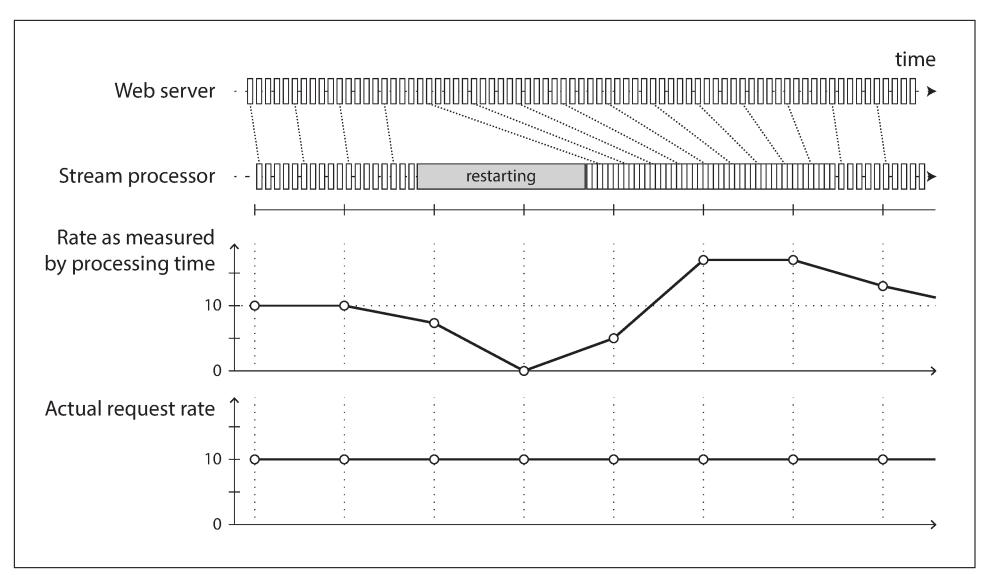

*Figure 11-7. Windowing by processing time introduces artifacts due to variations in processing rate.*

## **Knowing when you're ready**

A tricky problem when defining windows in terms of event time is that you can never be sure when you have received all of the events for a particular window, or whether there are some events still to come.

For example, say you're grouping events into one-minute windows so that you can count the number of requests per minute. You have counted some number of events with timestamps that fall in the 37th minute of the hour, and time has moved on; now most of the incoming events fall within the 38th and 39th minutes of the hour. When do you declare that you have finished the window for the 37th minute, and output its counter value?

You can time out and declare a window ready after you have not seen any new events for a while, but it could still happen that some events were buffered on another machine somewhere, delayed due to a network interruption. You need to be able to handle such *straggler* events that arrive after the window has already been declared complete. Broadly, you have two options [\[1](#page-502-0)]:

- 1. Ignore the straggler events, as they are probably a small percentage of events in normal circumstances. You can track the number of dropped events as a metric, and alert if you start dropping a significant amount of data.
- 2. Publish a *correction*, an updated value for the window with stragglers included. You may also need to retract the previous output.

<span id="page-492-0"></span>In some cases it is possible to use a special message to indicate, "From now on there will be no more messages with a timestamp earlier than *t*," which can be used by con‐ sumers to trigger windows [\[81](#page-507-0)]. However, if several producers on different machines are generating events, each with their own minimum timestamp thresholds, the con‐ sumers need to keep track of each producer individually. Adding and removing pro‐ ducers is trickier in this case.

## **Whose clock are you using, anyway?**

Assigning timestamps to events is even more difficult when events can be buffered at several points in the system. For example, consider a mobile app that reports events for usage metrics to a server. The app may be used while the device is offline, in which case it will buffer events locally on the device and send them to a server when an internet connection is next available (which may be hours or even days later). To any consumers of this stream, the events will appear as extremely delayed stragglers.

In this context, the timestamp on the events should really be the time at which the user interaction occurred, according to the mobile device's local clock. However, the clock on a user-controlled device often cannot be trusted, as it may be accidentally or deliberately set to the wrong time (see ["Clock Synchronization and Accuracy" on](#page-310-0) [page 289\)](#page-310-0). The time at which the event was received by the server (according to the server's clock) is more likely to be accurate, since the server is under your control, but less meaningful in terms of describing the user interaction.

To adjust for incorrect device clocks, one approach is to log three timestamps [\[82](#page-507-0)]:

- The time at which the event occurred, according to the device clock
- The time at which the event was sent to the server, according to the device clock
- The time at which the event was received by the server, according to the server clock

By subtracting the second timestamp from the third, you can estimate the offset between the device clock and the server clock (assuming the network delay is negligi‐ ble compared to the required timestamp accuracy). You can then apply that offset to the event timestamp, and thus estimate the true time at which the event actually occurred (assuming the device clock offset did not change between the time the event occurred and the time it was sent to the server).

This problem is not unique to stream processing—batch processing suffers from exactly the same issues of reasoning about time. It is just more noticeable in a stream‐ ing context, where we are more aware of the passage of time.

## <span id="page-493-0"></span>**Types of windows**

Once you know how the timestamp of an event should be determined, the next step is to decide how windows over time periods should be defined. The window can then be used for aggregations, for example to count events, or to calculate the average of values within the window. Several types of windows are in common use [[79, 83](#page-507-0)]:

## *Tumbling window*

A tumbling window has a fixed length, and every event belongs to exactly one window. For example, if you have a 1-minute tumbling window, all the events with timestamps between 10:03:00 and 10:03:59 are grouped into one window, events between 10:04:00 and 10:04:59 into the next window, and so on. You could implement a 1-minute tumbling window by taking each event timestamp and rounding it down to the nearest minute to determine the window that it belongs to.

## *Hopping window*

A hopping window also has a fixed length, but allows windows to overlap in order to provide some smoothing. For example, a 5-minute window with a hop size of 1 minute would contain the events between 10:03:00 and 10:07:59, then the next window would cover events between 10:04:00 and 10:08:59, and so on. You can implement this hopping window by first calculating 1-minute tumbling windows, and then aggregating over several adjacent windows.

## *Sliding window*

A sliding window contains all the events that occur within some interval of each other. For example, a 5-minute sliding window would cover events at 10:03:39 and 10:08:12, because they are less than 5 minutes apart (note that tumbling and hopping 5-minute windows would not have put these two events in the same window, as they use fixed boundaries). A sliding window can be implemented by keeping a buffer of events sorted by time and removing old events when they expire from the window.

#### *Session window*

Unlike the other window types, a session window has no fixed duration. Instead, it is defined by grouping together all events for the same user that occur closely together in time, and the window ends when the user has been inactive for some time (for example, if there have been no events for 30 minutes). Sessionization is a common requirement for website analytics (see ["GROUP BY" on page 406\)](#page-427-0).

## **Stream Joins**

In [Chapter 10](#page-410-0) we discussed how batch jobs can join datasets by key, and how such joins form an important part of data pipelines. Since stream processing generalizes <span id="page-494-0"></span>data pipelines to incremental processing of unbounded datasets, there is exactly the same need for joins on streams.

However, the fact that new events can appear anytime on a stream makes joins on streams more challenging than in batch jobs. To understand the situation better, let's distinguish three different types of joins: *stream-stream* joins, *stream-table* joins, and *table-table* joins [[84](#page-507-0)]. In the following sections we'll illustrate each by example.

#### **Stream-stream join (window join)**

Say you have a search feature on your website, and you want to detect recent trends in searched-for URLs. Every time someone types a search query, you log an event containing the query and the results returned. Every time someone clicks one of the search results, you log another event recording the click. In order to calculate the click-through rate for each URL in the search results, you need to bring together the events for the search action and the click action, which are connected by having the same session ID. Similar analyses are needed in advertising systems [[85\]](#page-507-0).

The click may never come if the user abandons their search, and even if it comes, the time between the search and the click may be highly variable: in many cases it might be a few seconds, but it could be as long as days or weeks (if a user runs a search, forgets about that browser tab, and then returns to the tab and clicks a result some‐ time later). Due to variable network delays, the click event may even arrive before the search event. You can choose a suitable window for the join—for example, you may choose to join a click with a search if they occur at most one hour apart.

Note that embedding the details of the search in the click event is not equivalent to joining the events: doing so would only tell you about the cases where the user clicked a search result, not about the searches where the user did not click any of the results. In order to measure search quality, you need accurate click-through rates, for which you need both the search events and the click events.

To implement this type of join, a stream processor needs to maintain *state*: for exam‐ ple, all the events that occurred in the last hour, indexed by session ID. Whenever a search event or click event occurs, it is added to the appropriate index, and the stream processor also checks the other index to see if another event for the same ses‐ sion ID has already arrived. If there is a matching event, you emit an event saying which search result was clicked. If the search event expires without you seeing a matching click event, you emit an event saying which search results were not clicked.

#### **Stream-table join (stream enrichment)**

In ["Example: analysis of user activity events" on page 404](#page-425-0) [\(Figure 10-2](#page-425-0)) we saw an example of a batch job joining two datasets: a set of user activity events and a data‐ base of user profiles. It is natural to think of the user activity events as a stream, and to perform the same join on a continuous basis in a stream processor: the input is a <span id="page-495-0"></span>stream of activity events containing a user ID, and the output is a stream of activity events in which the user ID has been augmented with profile information about the user. This process is sometimes known as *enriching* the activity events with informa‐ tion from the database.

To perform this join, the stream process needs to look at one activity event at a time, look up the event's user ID in the database, and add the profile information to the activity event. The database lookup could be implemented by querying a remote database; however, as discussed in ["Example: analysis of user activity events" on page](#page-425-0) [404](#page-425-0), such remote queries are likely to be slow and risk overloading the database [[75\]](#page-506-0).

Another approach is to load a copy of the database into the stream processor so that it can be queried locally without a network round-trip. This technique is very similar to the hash joins we discussed in ["Map-Side Joins" on page 408:](#page-429-0) the local copy of the database might be an in-memory hash table if it is small enough, or an index on the local disk.

The difference to batch jobs is that a batch job uses a point-in-time snapshot of the database as input, whereas a stream processor is long-running, and the contents of the database are likely to change over time, so the stream processor's local copy of the database needs to be kept up to date. This issue can be solved by change data capture: the stream processor can subscribe to a changelog of the user profile database as well as the stream of activity events. When a profile is created or modified, the stream processor updates its local copy. Thus, we obtain a join between two streams: the activity events and the profile updates.

A stream-table join is actually very similar to a stream-stream join; the biggest differ‐ ence is that for the table changelog stream, the join uses a window that reaches back to the "beginning of time" (a conceptually infinite window), with newer versions of records overwriting older ones. For the stream input, the join might not maintain a window at all.

## **Table-table join (materialized view maintenance)**

Consider the Twitter timeline example that we discussed in ["Describing Load"](#page-32-0) on [page 11](#page-32-0). We said that when a user wants to view their home timeline, it is too expen‐ sive to iterate over all the people the user is following, find their recent tweets, and merge them.

Instead, we want a timeline cache: a kind of per-user "inbox" to which tweets are written as they are sent, so that reading the timeline is a single lookup. Materializing and maintaining this cache requires the following event processing:

• When user *u* sends a new tweet, it is added to the timeline of every user who is following *u*.

- <span id="page-496-0"></span>• When a user deletes a tweet, it is removed from all users' timelines.
- When user *u*<sup>1</sup> starts following user *u*<sup>2</sup> , recent tweets by *u*<sup>2</sup> are added to *u*<sup>1</sup> 's timeline.
- When user *u*<sup>1</sup> unfollows user *u*<sup>2</sup> , tweets by *u*<sup>2</sup> are removed from *u*<sup>1</sup> 's timeline.

To implement this cache maintenance in a stream processor, you need streams of events for tweets (sending and deleting) and for follow relationships (following and unfollowing). The stream process needs to maintain a database containing the set of followers for each user so that it knows which timelines need to be updated when a new tweet arrives [\[86](#page-507-0)].

Another way of looking at this stream process is that it maintains a materialized view for a query that joins two tables (tweets and follows), something like the following:

```
SELECT follows.follower_id AS timeline_id,
 array_agg(tweets.* ORDER BY tweets.timestamp DESC)
FROM tweets
JOIN follows ON follows.followee_id = tweets.sender_id
GROUP BY follows.follower_id
```

The join of the streams corresponds directly to the join of the tables in that query. The timelines are effectively a cache of the result of this query, updated every time the underlying tables change.iii

## **Time-dependence of joins**

The three types of joins described here (stream-stream, stream-table, and table-table) have a lot in common: they all require the stream processor to maintain some state (search and click events, user profiles, or follower list) based on one join input, and query that state on messages from the other join input.

The order of the events that maintain the state is important (it matters whether you first follow and then unfollow, or the other way round). In a partitioned log, the ordering of events within a single partition is preserved, but there is typically no ordering guarantee across different streams or partitions.

This raises a question: if events on different streams happen around a similar time, in which order are they processed? In the stream-table join example, if a user updates their profile, which activity events are joined with the old profile (processed before the profile update), and which are joined with the new profile (processed after the

iii. If you regard a stream as the derivative of a table, as in [Figure 11-6](#page-481-0), and regard a join as a product of two tables *u·v*, something interesting happens: the stream of changes to the materialized join follows the product rule (*u·v*)′ = *u*′*v* + *uv*′. In words: any change of tweets is joined with the current followers, and any change of followers is joined with the current tweets [[49](#page-505-0), [50\]](#page-505-0).

<span id="page-497-0"></span>profile update)? Put another way: if state changes over time, and you join with some state, what point in time do you use for the join [\[45](#page-505-0)]?

Such time dependence can occur in many places. For example, if you sell things, you need to apply the right tax rate to invoices, which depends on the country or state, the type of product, and the date of sale (since tax rates change from time to time). When joining sales to a table of tax rates, you probably want to join with the tax rate at the time of the sale, which may be different from the current tax rate if you are reprocessing historical data.

If the ordering of events across streams is undetermined, the join becomes nondeter‐ ministic [[87\]](#page-507-0), which means you cannot rerun the same job on the same input and necessarily get the same result: the events on the input streams may be interleaved in a different way when you run the job again.

In data warehouses, this issue is known as a *slowly changing dimension* (SCD), and it is often addressed by using a unique identifier for a particular version of the joined record: for example, every time the tax rate changes, it is given a new identifier, and the invoice includes the identifier for the tax rate at the time of sale [\[88](#page-507-0), [89\]](#page-507-0). This change makes the join deterministic, but has the consequence that log compaction is not possible, since all versions of the records in the table need to be retained.

## **Fault Tolerance**

In the final section of this chapter, let's consider how stream processors can tolerate faults. We saw in [Chapter 10](#page-410-0) that batch processing frameworks can tolerate faults fairly easily: if a task in a MapReduce job fails, it can simply be started again on another machine, and the output of the failed task is discarded. This transparent retry is possible because input files are immutable, each task writes its output to a separate file on HDFS, and output is only made visible when a task completes successfully.

In particular, the batch approach to fault tolerance ensures that the output of the batch job is the same as if nothing had gone wrong, even if in fact some tasks did fail. It appears as though every input record was processed exactly once—no records are skipped, and none are processed twice. Although restarting tasks means that records may in fact be processed multiple times, the visible effect in the output is as if they had only been processed once. This principle is known as *exactly-once semantics*, although *effectively-once* would be a more descriptive term [[90\]](#page-507-0).

The same issue of fault tolerance arises in stream processing, but it is less straightfor‐ ward to handle: waiting until a task is finished before making its output visible is not an option, because a stream is infinite and so you can never finish processing it.

#### <span id="page-498-0"></span>**Microbatching and checkpointing**

One solution is to break the stream into small blocks, and treat each block like a min‐ iature batch process. This approach is called *microbatching*, and it is used in Spark Streaming [\[91\]](#page-507-0). The batch size is typically around one second, which is the result of a performance compromise: smaller batches incur greater scheduling and coordination overhead, while larger batches mean a longer delay before results of the stream pro‐ cessor become visible.

Microbatching also implicitly provides a tumbling window equal to the batch size (windowed by processing time, not event timestamps); any jobs that require larger windows need to explicitly carry over state from one microbatch to the next.

A variant approach, used in Apache Flink, is to periodically generate rolling check‐ points of state and write them to durable storage [\[92](#page-507-0), [93\]](#page-508-0). If a stream operator crashes, it can restart from its most recent checkpoint and discard any output gener‐ ated between the last checkpoint and the crash. The checkpoints are triggered by bar‐ riers in the message stream, similar to the boundaries between microbatches, but without forcing a particular window size.

Within the confines of the stream processing framework, the microbatching and checkpointing approaches provide the same exactly-once semantics as batch process‐ ing. However, as soon as output leaves the stream processor (for example, by writing to a database, sending messages to an external message broker, or sending emails), the framework is no longer able to discard the output of a failed batch. In this case, restarting a failed task causes the external side effect to happen twice, and micro‐ batching or checkpointing alone is not sufficient to prevent this problem.

## **Atomic commit revisited**

In order to give the appearance of exactly-once processing in the presence of faults, we need to ensure that all outputs and side effects of processing an event take effect *if and only if* the processing is successful. Those effects include any messages sent to downstream operators or external messaging systems (including email or push notifi‐ cations), any database writes, any changes to operator state, and any acknowledg‐ ment of input messages (including moving the consumer offset forward in a logbased message broker).

Those things either all need to happen atomically, or none of them must happen, but they should not go out of sync with each other. If this approach sounds familiar, it is because we discussed it in ["Exactly-once message processing" on page 360](#page-381-0) in the con‐ text of distributed transactions and two-phase commit.

In [Chapter 9](#page-342-0) we discussed the problems in the traditional implementations of dis‐ tributed transactions, such as XA. However, in more restricted environments it is possible to implement such an atomic commit facility efficiently. This approach is

<span id="page-499-0"></span>used in Google Cloud Dataflow [\[81,](#page-507-0) [92\]](#page-507-0) and VoltDB [[94\]](#page-508-0), and there are plans to add similar features to Apache Kafka [\[95](#page-508-0), [96](#page-508-0)]. Unlike XA, these implementations do not attempt to provide transactions across heterogeneous technologies, but instead keep them internal by managing both state changes and messaging within the stream pro‐ cessing framework. The overhead of the transaction protocol can be amortized by processing several input messages within a single transaction.

## **Idempotence**

Our goal is to discard the partial output of any failed tasks so that they can be safely retried without taking effect twice. Distributed transactions are one way of achieving that goal, but another way is to rely on *idempotence* [[97\]](#page-508-0).

An idempotent operation is one that you can perform multiple times, and it has the same effect as if you performed it only once. For example, setting a key in a key-value store to some fixed value is idempotent (writing the value again simply overwrites the value with an identical value), whereas incrementing a counter is not idempotent (performing the increment again means the value is incremented twice).

Even if an operation is not naturally idempotent, it can often be made idempotent with a bit of extra metadata. For example, when consuming messages from Kafka, every message has a persistent, monotonically increasing offset. When writing a value to an external database, you can include the offset of the message that triggered the last write with the value. Thus, you can tell whether an update has already been applied, and avoid performing the same update again.

The state handling in Storm's Trident is based on a similar idea [[78\]](#page-507-0). Relying on idempotence implies several assumptions: restarting a failed task must replay the same messages in the same order (a log-based message broker does this), the process‐ ing must be deterministic, and no other node may concurrently update the same value [\[98](#page-508-0), [99](#page-508-0)].

When failing over from one processing node to another, fencing may be required (see ["The leader and the lock" on page 301](#page-322-0)) to prevent interference from a node that is thought to be dead but is actually alive. Despite all those caveats, idempotent opera‐ tions can be an effective way of achieving exactly-once semantics with only a small overhead.

## **Rebuilding state after a failure**

Any stream process that requires state—for example, any windowed aggregations (such as counters, averages, and histograms) and any tables and indexes used for joins—must ensure that this state can be recovered after a failure.

One option is to keep the state in a remote datastore and replicate it, although having to query a remote database for each individual message can be slow, as discussed in <span id="page-500-0"></span>["Stream-table join \(stream enrichment\)" on page 473.](#page-494-0) An alternative is to keep state local to the stream processor, and replicate it periodically. Then, when the stream processor is recovering from a failure, the new task can read the replicated state and resume processing without data loss.

For example, Flink periodically captures snapshots of operator state and writes them to durable storage such as HDFS [[92](#page-507-0), [93](#page-508-0)]; Samza and Kafka Streams replicate state changes by sending them to a dedicated Kafka topic with log compaction, similar to change data capture [[84,](#page-507-0) [100\]](#page-508-0). VoltDB replicates state by redundantly processing each input message on several nodes (see ["Actual Serial Execution" on page 252](#page-273-0)).

In some cases, it may not even be necessary to replicate the state, because it can be rebuilt from the input streams. For example, if the state consists of aggregations over a fairly short window, it may be fast enough to simply replay the input events corre‐ sponding to that window. If the state is a local replica of a database, maintained by change data capture, the database can also be rebuilt from the log-compacted change stream (see ["Log compaction" on page 456](#page-477-0)).

However, all of these trade-offs depend on the performance characteristics of the underlying infrastructure: in some systems, network delay may be lower than disk access latency, and network bandwidth may be comparable to disk bandwidth. There is no universally ideal trade-off for all situations, and the merits of local versus remote state may also shift as storage and networking technologies evolve.

## **Summary**

In this chapter we have discussed event streams, what purposes they serve, and how to process them. In some ways, stream processing is very much like the batch pro‐ cessing we discussed in [Chapter 10,](#page-410-0) but done continuously on unbounded (neverending) streams rather than on a fixed-size input. From this perspective, message brokers and event logs serve as the streaming equivalent of a filesystem.

We spent some time comparing two types of message brokers:

## *AMQP/JMS-style message broker*

The broker assigns individual messages to consumers, and consumers acknowl‐ edge individual messages when they have been successfully processed. Messages are deleted from the broker once they have been acknowledged. This approach is appropriate as an asynchronous form of RPC (see also ["Message-Passing Data‐](#page-157-0) [flow" on page 136](#page-157-0)), for example in a task queue, where the exact order of mes‐ sage processing is not important and where there is no need to go back and read old messages again after they have been processed.

#### <span id="page-501-0"></span>*Log-based message broker*

The broker assigns all messages in a partition to the same consumer node, and always delivers messages in the same order. Parallelism is achieved through par‐ titioning, and consumers track their progress by checkpointing the offset of the last message they have processed. The broker retains messages on disk, so it is possible to jump back and reread old messages if necessary.

The log-based approach has similarities to the replication logs found in databases (see [Chapter 5\)](#page-172-0) and log-structured storage engines (see [Chapter 3\)](#page-90-0). We saw that this approach is especially appropriate for stream processing systems that consume input streams and generate derived state or derived output streams.

In terms of where streams come from, we discussed several possibilities: user activity events, sensors providing periodic readings, and data feeds (e.g., market data in finance) are naturally represented as streams. We saw that it can also be useful to think of the writes to a database as a stream: we can capture the changelog—i.e., the history of all changes made to a database—either implicitly through change data cap‐ ture or explicitly through event sourcing. Log compaction allows the stream to retain a full copy of the contents of a database.

Representing databases as streams opens up powerful opportunities for integrating systems. You can keep derived data systems such as search indexes, caches, and ana‐ lytics systems continually up to date by consuming the log of changes and applying them to the derived system. You can even build fresh views onto existing data by starting from scratch and consuming the log of changes from the beginning all the way to the present.

The facilities for maintaining state as streams and replaying messages are also the basis for the techniques that enable stream joins and fault tolerance in various stream processing frameworks. We discussed several purposes of stream processing, includ‐ ing searching for event patterns (complex event processing), computing windowed aggregations (stream analytics), and keeping derived data systems up to date (materi‐ alized views).

We then discussed the difficulties of reasoning about time in a stream processor, including the distinction between processing time and event timestamps, and the problem of dealing with straggler events that arrive after you thought your window was complete.

We distinguished three types of joins that may appear in stream processes:

#### *Stream-stream joins*

Both input streams consist of activity events, and the join operator searches for related events that occur within some window of time. For example, it may match two actions taken by the same user within 30 minutes of each other. The <span id="page-502-0"></span>two join inputs may in fact be the same stream (a *self-join*) if you want to find related events within that one stream.

#### *Stream-table joins*

One input stream consists of activity events, while the other is a database change‐ log. The changelog keeps a local copy of the database up to date. For each activity event, the join operator queries the database and outputs an enriched activity event.

#### *Table-table joins*

Both input streams are database changelogs. In this case, every change on one side is joined with the latest state of the other side. The result is a stream of changes to the materialized view of the join between the two tables.

Finally, we discussed techniques for achieving fault tolerance and exactly-once semantics in a stream processor. As with batch processing, we need to discard the partial output of any failed tasks. However, since a stream process is long-running and produces output continuously, we can't simply discard all output. Instead, a finer-grained recovery mechanism can be used, based on microbatching, checkpoint‐ ing, transactions, or idempotent writes.

## **References**

- [[1\]](#page-460-0) Tyler Akidau, Robert Bradshaw, Craig Chambers, et al.: ["The Dataflow Model: A](http://www.vldb.org/pvldb/vol8/p1792-Akidau.pdf) [Practical Approach to Balancing Correctness, Latency, and Cost in Massive-Scale,](http://www.vldb.org/pvldb/vol8/p1792-Akidau.pdf) [Unbounded, Out-of-Order Data Processing,](http://www.vldb.org/pvldb/vol8/p1792-Akidau.pdf)" *Proceedings of the VLDB Endowment*, volume 8, number 12, pages 1792–1803, August 2015. [doi:10.14778/2824032.2824076](http://dx.doi.org/10.14778/2824032.2824076)
- [[2\]](#page-461-0) Harold Abelson, Gerald Jay Sussman, and Julie Sussman: *[Structure and Interpre‐](https://mitpress.mit.edu/sicp/) [tation of Computer Programs](https://mitpress.mit.edu/sicp/)*, 2nd edition. MIT Press, 1996. ISBN: 978-0-262-51087-5, available online at *mitpress.mit.edu*
- [[3\]](#page-461-0) Patrick Th. Eugster, Pascal A. Felber, Rachid Guerraoui, and Anne-Marie Ker‐ marrec: ["The Many Faces of Publish/Subscribe,](http://www.cs.ru.nl/~pieter/oss/manyfaces.pdf)" *ACM Computing Surveys*, volume 35, number 2, pages 114–131, June 2003. [doi:10.1145/857076.857078](http://dx.doi.org/10.1145/857076.857078)
- [[4\]](#page-462-0) Joseph M. Hellerstein and Michael Stonebraker: *[Readings in Database Systems](http://redbook.cs.berkeley.edu/)*, 4th edition. MIT Press, 2005. ISBN: 978-0-262-69314-1, available online at *red‐ book.cs.berkeley.edu*
- [[5\]](#page-462-0) Don Carney, Uğur Çetintemel, Mitch Cherniack, et al.: ["Monitoring Streams A](http://www.vldb.org/conf/2002/S07P02.pdf) [New Class of Data Management Applications](http://www.vldb.org/conf/2002/S07P02.pdf)," at *28th International Conference on Very Large Data Bases* (VLDB), August 2002.
- [[6\]](#page-463-0) Matthew Sackman: "[Pushing Back](http://www.lshift.net/blog/2016/05/05/pushing-back/)," *lshift.net*, May 5, 2016.

- <span id="page-503-0"></span>[[7\]](#page-463-0) Vicent Martí: ["Brubeck, a statsd-Compatible Metrics Aggregator,](http://githubengineering.com/brubeck/)" *githubengin‐ eering.com*, June 15, 2015.
- [[8\]](#page-463-0) Seth Lowenberger: ["MoldUDP64 Protocol Specification V 1.00,](http://www.nasdaqtrader.com/content/technicalsupport/specifications/dataproducts/moldudp64.pdf)" *nasdaq‐ trader.com*, July 2009.
- [[9\]](#page-463-0) Pieter Hintjens: *[ZeroMQ The Guide](http://zguide.zeromq.org/page:all)*. O'Reilly Media, 2013. ISBN: 978-1-449-33404-8
- [[10\]](#page-463-0) Ian Malpass: "[Measure Anything, Measure Everything,](https://codeascraft.com/2011/02/15/measure-anything-measure-everything/)" *codeascraft.com*, Febru‐ ary 15, 2011.
- [[11\]](#page-463-0) Dieter Plaetinck: "[25 Graphite, Grafana and statsd Gotchas,](https://blog.raintank.io/25-graphite-grafana-and-statsd-gotchas/)" *blog.raintank.io*, March 3, 2016.
- [[12\]](#page-464-0) Jeff Lindsay: "[Web Hooks to Revolutionize the Web](http://progrium.com/blog/2007/05/03/web-hooks-to-revolutionize-the-web/)," *progrium.com*, May 3, 2007.
- [[13\]](#page-464-0) Jim N. Gray: "[Queues Are Databases](http://research.microsoft.com/pubs/69641/tr-95-56.pdf)," Microsoft Research Technical Report MSR-TR-95-56, December 1995.
- [[14\]](#page-465-0) Mark Hapner, Rich Burridge, Rahul Sharma, et al.: ["JSR-343 Java Message Ser‐](https://jcp.org/en/jsr/detail?id=343) [vice \(JMS\) 2.0 Specification,](https://jcp.org/en/jsr/detail?id=343)" *jms-spec.java.net*, March 2013.
- [[15\]](#page-465-0) Sanjay Aiyagari, Matthew Arrott, Mark Atwell, et al.: "[AMQP: Advanced Mes‐](http://www.rabbitmq.com/resources/specs/amqp0-9-1.pdf) [sage Queuing Protocol Specification](http://www.rabbitmq.com/resources/specs/amqp0-9-1.pdf)," Version 0-9-1, November 2008.
- [[16\]](#page-465-0) "[Google Cloud Pub/Sub: A Google-Scale Messaging Service](https://cloud.google.com/pubsub/architecture)," *cloud.google.com*, 2016.
- [[17\]](#page-469-0) "[Apache Kafka 0.9 Documentation,](http://kafka.apache.org/documentation.html)" *kafka.apache.org*, November 2015.
- [[18\]](#page-469-0) Jay Kreps, Neha Narkhede, and Jun Rao: "[Kafka: A Distributed Messaging Sys‐](http://www.longyu23.com/doc/Kafka.pdf) [tem for Log Processing,](http://www.longyu23.com/doc/Kafka.pdf)" at *6th International Workshop on Networking Meets Data‐ bases* (NetDB), June 2011.
- [[19\]](#page-469-0) "[Amazon Kinesis Streams Developer Guide,](http://docs.aws.amazon.com/streams/latest/dev/introduction.html)" *docs.aws.amazon.com*, April 2016.
- [[20\]](#page-469-0) Leigh Stewart and Sijie Guo: ["Building DistributedLog: Twitter's High-](https://blog.twitter.com/2015/building-distributedlog-twitter-s-high-performance-replicated-log-service)[Performance Replicated Log Service,](https://blog.twitter.com/2015/building-distributedlog-twitter-s-high-performance-replicated-log-service)" *blog.twitter.com*, September 16, 2015.
- [[21\]](#page-469-0) "[DistributedLog Documentation](http://distributedlog.incubator.apache.org/docs/latest/)," Twitter, Inc., *distributedlog.io*, May 2016.
- [[22\]](#page-469-0) Jay Kreps: ["Benchmarking Apache Kafka: 2 Million Writes Per Second \(On](https://engineering.linkedin.com/kafka/benchmarking-apache-kafka-2-million-writes-second-three-cheap-machines) [Three Cheap Machines\)](https://engineering.linkedin.com/kafka/benchmarking-apache-kafka-2-million-writes-second-three-cheap-machines)," *engineering.linkedin.com*, April 27, 2014.
- [[23\]](#page-469-0) Kartik Paramasivam: "[How We're Improving and Advancing Kafka at](https://engineering.linkedin.com/apache-kafka/how-we_re-improving-and-advancing-kafka-linkedin) [LinkedIn,](https://engineering.linkedin.com/apache-kafka/how-we_re-improving-and-advancing-kafka-linkedin)" *engineering.linkedin.com*, September 2, 2015.
- [[24\]](#page-472-0) Jay Kreps: "[The Log: What Every Software Engineer Should Know About Real-](http://engineering.linkedin.com/distributed-systems/log-what-every-software-engineer-should-know-about-real-time-datas-unifying)[Time Data's Unifying Abstraction](http://engineering.linkedin.com/distributed-systems/log-what-every-software-engineer-should-know-about-real-time-datas-unifying)," *engineering.linkedin.com*, December 16, 2013.

- <span id="page-504-0"></span>[[25\]](#page-476-0) Shirshanka Das, Chavdar Botev, Kapil Surlaker, et al.: ["All Aboard the Data‐](http://www.socc2012.org/s18-das.pdf) [bus!,](http://www.socc2012.org/s18-das.pdf)" at *3rd ACM Symposium on Cloud Computing* (SoCC), October 2012.
- [[26\]](#page-476-0) Yogeshwer Sharma, Philippe Ajoux, Petchean Ang, et al.: "[Wormhole: Reliable](https://www.usenix.org/system/files/conference/nsdi15/nsdi15-paper-sharma.pdf) [Pub-Sub to Support Geo-Replicated Internet Services](https://www.usenix.org/system/files/conference/nsdi15/nsdi15-paper-sharma.pdf)," at *12th USENIX Symposium on Networked Systems Design and Implementation* (NSDI), May 2015.
- [[27\]](#page-476-0) P. P. S. Narayan: "[Sherpa Update](http://web.archive.org/web/20160801221400/https://developer.yahoo.com/blogs/ydn/sherpa-7992.html)," *developer.yahoo.com*, June 8, .
- [[28\]](#page-476-0) Martin Kleppmann: "[Bottled Water: Real-Time Integration of PostgreSQL and](http://martin.kleppmann.com/2015/04/23/bottled-water-real-time-postgresql-kafka.html) [Kafka,](http://martin.kleppmann.com/2015/04/23/bottled-water-real-time-postgresql-kafka.html)" *martin.kleppmann.com*, April 23, 2015.
- [[29\]](#page-476-0) Ben Osheroff: "[Introducing Maxwell, a mysql-to-kafka Binlog Processor](https://developer.zendesk.com/blog/introducing-maxwell-a-mysql-to-kafka-binlog-processor)," *devel‐ oper.zendesk.com*, August 20, 2015.
- [[30\]](#page-476-0) Randall Hauch: "[Debezium 0.2.1 Released](http://debezium.io/blog/2016/06/10/Debezium-0/)," *debezium.io*, June 10, 2016.
- [[31\]](#page-476-0) Prem Santosh Udaya Shankar: "[Streaming MySQL Tables in Real-Time to](https://engineeringblog.yelp.com/2016/08/streaming-mysql-tables-in-real-time-to-kafka.html) [Kafka,](https://engineeringblog.yelp.com/2016/08/streaming-mysql-tables-in-real-time-to-kafka.html)" *engineeringblog.yelp.com*, August 1, 2016.
- [[32\]](#page-476-0) "[Mongoriver,](https://github.com/stripe/mongoriver)" Stripe, Inc., *github.com*, September 2014.
- [[33\]](#page-476-0) Dan Harvey: ["Change Data Capture with Mongo + Kafka](http://www.slideshare.net/danharvey/change-data-capture-with-mongodb-and-kafka)," at *Hadoop Users Group UK*, August 2015.
- [[34\]](#page-476-0) "[Oracle GoldenGate 12c: Real-Time Access to Real-Time Information](http://www.oracle.com/us/products/middleware/data-integration/oracle-goldengate-realtime-access-2031152.pdf)," Oracle White Paper, March 2015.
- [[35\]](#page-476-0) "[Oracle GoldenGate Fundamentals: How Oracle GoldenGate Works](https://www.youtube.com/watch?v=6H9NibIiPQE)," Oracle Corporation, *youtube.com*, November 2012.
- [[36\]](#page-477-0) Slava Akhmechet: ["Advancing the Realtime Web](http://rethinkdb.com/blog/realtime-web/)," *rethinkdb.com*, January 27, 2015.
- [[37\]](#page-477-0) "[Firebase Realtime Database Documentation](https://firebase.google.com/docs/database/)," Google, Inc., *firebase.google.com*, May 2016.
- [[38\]](#page-477-0) "[Apache CouchDB 1.6 Documentation](http://docs.couchdb.org/en/latest/)," *docs.couchdb.org*, 2014.
- [[39\]](#page-477-0) Matt DeBergalis: "[Meteor 0.7.0: Scalable Database Queries Using MongoDB](http://info.meteor.com/blog/meteor-070-scalable-database-queries-using-mongodb-oplog-instead-of-poll-and-diff) [Oplog Instead of Poll-and-Diff,](http://info.meteor.com/blog/meteor-070-scalable-database-queries-using-mongodb-oplog-instead-of-poll-and-diff)" *info.meteor.com*, December 17, 2013.
- [[40\]](#page-477-0) "[Chapter 15. Importing and Exporting Live Data,](https://docs.voltdb.com/UsingVoltDB/ChapExport.php)" VoltDB 6.4 User Manual, *docs.voltdb.com*, June 2016.
- [[41\]](#page-478-0) Neha Narkhede: ["Announcing Kafka Connect: Building Large-Scale Low-](http://www.confluent.io/blog/announcing-kafka-connect-building-large-scale-low-latency-data-pipelines)[Latency Data Pipelines](http://www.confluent.io/blog/announcing-kafka-connect-building-large-scale-low-latency-data-pipelines)," *confluent.io*, February 18, 2016.
- [[42\]](#page-478-0) Greg Young: ["CQRS and Event Sourcing](https://www.youtube.com/watch?v=JHGkaShoyNs)," at *Code on the Beach*, August 2014.
- [[43\]](#page-478-0) Martin Fowler: "[Event Sourcing](http://martinfowler.com/eaaDev/EventSourcing.html)," *martinfowler.com*, December 12, 2005.

- <span id="page-505-0"></span>[[44\]](#page-478-0) Vaughn Vernon: *[Implementing Domain-Driven Design](https://vaughnvernon.co/?page_id=168)*. Addison-Wesley Profes‐ sional, 2013. ISBN: 978-0-321-83457-7
- [[45\]](#page-479-0) H. V. Jagadish, Inderpal Singh Mumick, and Abraham Silberschatz: ["View](http://www.mathcs.emory.edu/~cheung/papers/StreamDB/Histogram/1995-Jagadish-Histo.pdf) [Maintenance Issues for the Chronicle Data Model](http://www.mathcs.emory.edu/~cheung/papers/StreamDB/Histogram/1995-Jagadish-Histo.pdf)," at *14th ACM SIGACT-SIGMOD-SIGART Symposium on Principles of Database Systems* (PODS), May 1995. [doi:](http://dx.doi.org/10.1145/212433.220201) [10.1145/212433.220201](http://dx.doi.org/10.1145/212433.220201)
- [[46\]](#page-479-0) ["Event Store 3.5.0 Documentation](http://docs.geteventstore.com/)," Event Store LLP, *docs.geteventstore.com*, February 2016.
- [[47\]](#page-479-0) Martin Kleppmann: *[Making Sense of Stream Processing](http://www.oreilly.com/data/free/stream-processing.csp)*. Report, O'Reilly Media, May 2016.
- [[48\]](#page-480-0) Sander Mak: ["Event-Sourced Architectures with Akka,](http://www.slideshare.net/SanderMak/eventsourced-architectures-with-akka)" at *JavaOne*, September 2014.
- [[49\]](#page-481-0) Julian Hyde: [personal communication](https://twitter.com/julianhyde/status/743374145006641153), June 2016.
- [[50\]](#page-481-0) Ashish Gupta and Inderpal Singh Mumick: *Materialized Views: Techniques, Implementations, and Applications*. MIT Press, 1999. ISBN: 978-0-262-57122-7
- [[51\]](#page-481-0) Timothy Griffin and Leonid Libkin: ["Incremental Maintenance of Views with](http://homepages.inf.ed.ac.uk/libkin/papers/sigmod95.pdf) [Duplicates,](http://homepages.inf.ed.ac.uk/libkin/papers/sigmod95.pdf)" at *ACM International Conference on Management of Data* (SIGMOD), May 1995. [doi:10.1145/223784.223849](http://dx.doi.org/10.1145/223784.223849)
- [[52\]](#page-481-0) Pat Helland: "[Immutability Changes Everything,](http://www.cidrdb.org/cidr2015/Papers/CIDR15_Paper16.pdf)" at *7th Biennial Conference on Innovative Data Systems Research* (CIDR), January 2015.
- [[53\]](#page-482-0) Martin Kleppmann: ["Accounting for Computer Scientists,](http://martin.kleppmann.com/2011/03/07/accounting-for-computer-scientists.html)" *martin.klepp‐ mann.com*, March 7, 2011.
- [[54\]](#page-482-0) Pat Helland: ["Accountants Don't Use Erasers,](https://blogs.msdn.microsoft.com/pathelland/2007/06/14/accountants-dont-use-erasers/)" *blogs.msdn.com*, June 14, 2007.
- [[55\]](#page-482-0) Fangjin Yang: ["Dogfooding with Druid, Samza, and Kafka: Metametrics at Met‐](https://metamarkets.com/2015/dogfooding-with-druid-samza-and-kafka-metametrics-at-metamarkets/) [amarkets](https://metamarkets.com/2015/dogfooding-with-druid-samza-and-kafka-metametrics-at-metamarkets/)," *metamarkets.com*, June 3, 2015.
- [[56\]](#page-482-0) Gavin Li, Jianqiu Lv, and Hang Qi: "[Pistachio: Co-Locate the Data and Compute](http://yahoohadoop.tumblr.com/post/116365275781/pistachio-co-locate-the-data-and-compute-for) [for Fastest Cloud Compute](http://yahoohadoop.tumblr.com/post/116365275781/pistachio-co-locate-the-data-and-compute-for)," *yahoohadoop.tumblr.com*, April 13, 2015.
- [[57\]](#page-483-0) Kartik Paramasivam: ["Stream Processing Hard Problems Part 1: Killing](https://engineering.linkedin.com/blog/2016/06/stream-processing-hard-problems-part-1-killing-lambda) [Lambda](https://engineering.linkedin.com/blog/2016/06/stream-processing-hard-problems-part-1-killing-lambda)," *engineering.linkedin.com*, June 27, 2016.
- [[58\]](#page-483-0) Martin Fowler: "[CQRS](http://martinfowler.com/bliki/CQRS.html)," *martinfowler.com*, July 14, 2011.
- [[59\]](#page-483-0) Greg Young: ["CQRS Documents,](https://cqrs.files.wordpress.com/2010/11/cqrs_documents.pdf)" *cqrs.files.wordpress.com*, November 2010.
- [[60\]](#page-484-0) Baron Schwartz: ["Immutability, MVCC, and Garbage Collection](http://www.xaprb.com/blog/2013/12/28/immutability-mvcc-and-garbage-collection/)," *xaprb.com*, December 28, 2013.

- <span id="page-506-0"></span>[[61\]](#page-484-0) Daniel Eloff, Slava Akhmechet, Jay Kreps, et al.: ["Re: Turning the Database](https://news.ycombinator.com/item?id=9145197) [Inside-out with Apache Samza](https://news.ycombinator.com/item?id=9145197)," Hacker News discussion, *news.ycombinator.com*, March 4, 2015.
- [[62\]](#page-484-0) "[Datomic Development Resources: Excision,](http://docs.datomic.com/excision.html)" Cognitect, Inc., *docs.datomic.com*.
- [[63\]](#page-484-0) "[Fossil Documentation: Deleting Content from Fossil,](http://fossil-scm.org/index.html/doc/trunk/www/shunning.wiki)" *fossil-scm.org*, 2016.
- [[64\]](#page-484-0) Jay Kreps: ["The irony of distributed systems is that data loss is really easy but](https://twitter.com/jaykreps/status/582580836425330688) [deleting data is surprisingly hard,](https://twitter.com/jaykreps/status/582580836425330688)" *twitter.com*, March 30, 2015.
- [[65\]](#page-486-0) David C. Luckham: ["What's the Difference Between ESP and CEP?](http://www.complexevents.com/2006/08/01/what%E2%80%99s-the-difference-between-esp-and-cep/)," *complexe‐ vents.com*, August 1, 2006.
- [[66\]](#page-486-0) Srinath Perera: ["How Is Stream Processing and Complex Event Processing](https://www.quora.com/How-is-stream-processing-and-complex-event-processing-CEP-different) [\(CEP\) Different?,](https://www.quora.com/How-is-stream-processing-and-complex-event-processing-CEP-different)" *quora.com*, December 3, 2015.
- [[67\]](#page-486-0) Arvind Arasu, Shivnath Babu, and Jennifer Widom: ["The CQL Continuous](http://research.microsoft.com/pubs/77607/cql.pdf) [Query Language: Semantic Foundations and Query Execution](http://research.microsoft.com/pubs/77607/cql.pdf)," *The VLDB Journal*, volume 15, number 2, pages 121–142, June 2006. [doi:10.1007/s00778-004-0147-z](http://dx.doi.org/10.1007/s00778-004-0147-z)
- [[68\]](#page-486-0) Julian Hyde: "[Data in Flight: How Streaming SQL Technology Can Help Solve](http://queue.acm.org/detail.cfm?id=1667562) [the Web 2.0 Data Crunch](http://queue.acm.org/detail.cfm?id=1667562)," *ACM Queue*, volume 7, number 11, December 2009. [doi:](http://dx.doi.org/10.1145/1661785.1667562) [10.1145/1661785.1667562](http://dx.doi.org/10.1145/1661785.1667562)
- [[69\]](#page-487-0) "[Esper Reference, Version 5.4.0](http://www.espertech.com/esper/release-5.4.0/esper-reference/html_single/index.html)," EsperTech, Inc., *espertech.com*, April 2016.
- [[70\]](#page-487-0) Zubair Nabi, Eric Bouillet, Andrew Bainbridge, and Chris Thomas: "[Of Streams](https://developer.ibm.com/streamsdev/wp-content/uploads/sites/15/2014/04/Streams-and-Storm-April-2014-Final.pdf) [and Storms](https://developer.ibm.com/streamsdev/wp-content/uploads/sites/15/2014/04/Streams-and-Storm-April-2014-Final.pdf)," IBM technical report, *developer.ibm.com*, April 2014.
- [[71\]](#page-487-0) Milinda Pathirage, Julian Hyde, Yi Pan, and Beth Plale: ["SamzaSQL: Scalable](https://github.com/milinda/samzasql-hpbdc2016/blob/master/samzasql-hpbdc2016.pdf) [Fast Data Management with Streaming SQL,](https://github.com/milinda/samzasql-hpbdc2016/blob/master/samzasql-hpbdc2016.pdf)" at *IEEE International Workshop on High-Performance Big Data Computing* (HPBDC), May 2016. [doi:10.1109/IPDPSW.](http://dx.doi.org/10.1109/IPDPSW.2016.141) [2016.141](http://dx.doi.org/10.1109/IPDPSW.2016.141)
- [[72\]](#page-487-0) Philippe Flajolet, Éric Fusy, Olivier Gandouet, and Frédéric Meunier: ["HyperLog](http://algo.inria.fr/flajolet/Publications/FlFuGaMe07.pdf) [Log: The Analysis of a Near-Optimal Cardinality Estimation Algorithm](http://algo.inria.fr/flajolet/Publications/FlFuGaMe07.pdf)," at *Confer‐ ence on Analysis of Algorithms* (AofA), June 2007.
- [[73\]](#page-487-0) Jay Kreps: "[Questioning the Lambda Architecture](https://www.oreilly.com/ideas/questioning-the-lambda-architecture)," *oreilly.com*, July 2, 2014.
- [[74\]](#page-487-0) Ian Hellström: "[An Overview of Apache Streaming Technologies,](https://databaseline.wordpress.com/2016/03/12/an-overview-of-apache-streaming-technologies/)" *database‐ line.wordpress.com*, March 12, 2016.
- [[75\]](#page-488-0) Jay Kreps: "[Why Local State Is a Fundamental Primitive in Stream Processing](https://www.oreilly.com/ideas/why-local-state-is-a-fundamental-primitive-in-stream-processing)," *oreilly.com*, July 31, 2014.
- [[76\]](#page-488-0) Shay Banon: "[Percolator](https://www.elastic.co/blog/percolator)," *elastic.co*, February 8, 2011.
- [[77\]](#page-488-0) Alan Woodward and Martin Kleppmann: ["Real-Time Full-Text Search with](http://martin.kleppmann.com/2015/04/13/real-time-full-text-search-luwak-samza.html) [Luwak and Samza](http://martin.kleppmann.com/2015/04/13/real-time-full-text-search-luwak-samza.html)," *martin.kleppmann.com*, April 13, 2015.

- <span id="page-507-0"></span>[[78\]](#page-489-0) "[Apache Storm 1.0.1 Documentation,](https://storm.apache.org/releases/1.0.1/index.html)" *storm.apache.org*, May 2016.
- [[79\]](#page-490-0) Tyler Akidau: "[The World Beyond Batch: Streaming 102,](https://www.oreilly.com/ideas/the-world-beyond-batch-streaming-102)" *oreilly.com*, January 20, 2016.
- [[80\]](#page-490-0) Stephan Ewen: "[Streaming Analytics with Apache Flink](http://www.confluent.io/kafka-summit-2016-systems-advanced-streaming-analytics-with-apache-flink-and-apache-kafka)," at *Kafka Summit*, April 2016.
- [[81\]](#page-492-0) Tyler Akidau, Alex Balikov, Kaya Bekiroğlu, et al.: ["MillWheel: Fault-Tolerant](http://research.google.com/pubs/pub41378.html) [Stream Processing at Internet Scale](http://research.google.com/pubs/pub41378.html)," at *39th International Conference on Very Large Data Bases* (VLDB), August 2013.
- [[82\]](#page-492-0) Alex Dean: "[Improving Snowplow's Understanding of Time](http://snowplowanalytics.com/blog/2015/09/15/improving-snowplows-understanding-of-time/)," *snowplowanalyt‐ ics.com*, September 15, 2015.
- [[83\]](#page-493-0) ["Windowing \(Azure Stream Analytics\)](https://msdn.microsoft.com/en-us/library/azure/dn835019.aspx)," Microsoft Azure Reference, *msdn.microsoft.com*, April 2016.
- [[84\]](#page-494-0) ["State Management](http://samza.apache.org/learn/documentation/0.10/container/state-management.html)," Apache Samza 0.10 Documentation, *samza.apache.org*, December 2015.
- [[85\]](#page-494-0) Rajagopal Ananthanarayanan, Venkatesh Basker, Sumit Das, et al.: ["Photon:](http://research.google.com/pubs/pub41318.html) [Fault-Tolerant and Scalable Joining of Continuous Data Streams](http://research.google.com/pubs/pub41318.html)," at *ACM Interna‐ tional Conference on Management of Data* (SIGMOD), June 2013. [doi:](http://dx.doi.org/10.1145/2463676.2465272) [10.1145/2463676.2465272](http://dx.doi.org/10.1145/2463676.2465272)
- [[86\]](#page-496-0) Martin Kleppmann: "[Samza Newsfeed Demo,](https://github.com/ept/newsfeed)" *github.com*, September 2014.
- [[87\]](#page-497-0) Ben Kirwin: "[Doing the Impossible: Exactly-Once Messaging Patterns in Kafka](http://ben.kirw.in/2014/11/28/kafka-patterns/)," *ben.kirw.in*, November 28, 2014.
- [[88\]](#page-497-0) Pat Helland: ["Data on the Outside Versus Data on the Inside,](http://cidrdb.org/cidr2005/papers/P12.pdf)" at *2nd Biennial Conference on Innovative Data Systems Research* (CIDR), January 2005.
- [[89\]](#page-497-0) Ralph Kimball and Margy Ross: *The Data Warehouse Toolkit: The Definitive Guide to Dimensional Modeling*, 3rd edition. John Wiley & Sons, 2013. ISBN: 978-1-118-53080-1
- [[90\]](#page-497-0) Viktor Klang: "[I'm coining the phrase 'effectively-once' for message processing](https://twitter.com/viktorklang/status/789036133434978304) [with at-least-once + idempotent operations](https://twitter.com/viktorklang/status/789036133434978304)," *twitter.com*, October 20, 2016.
- [[91\]](#page-498-0) Matei Zaharia, Tathagata Das, Haoyuan Li, et al.: ["Discretized Streams: An Effi‐](https://www.usenix.org/system/files/conference/hotcloud12/hotcloud12-final28.pdf) [cient and Fault-Tolerant Model for Stream Processing on Large Clusters,](https://www.usenix.org/system/files/conference/hotcloud12/hotcloud12-final28.pdf)" at *4th USENIX Conference in Hot Topics in Cloud Computing* (HotCloud), June 2012.
- [[92\]](#page-498-0) Kostas Tzoumas, Stephan Ewen, and Robert Metzger: "[High-Throughput, Low-](http://data-artisans.com/high-throughput-low-latency-and-exactly-once-stream-processing-with-apache-flink/)[Latency, and Exactly-Once Stream Processing with Apache Flink,](http://data-artisans.com/high-throughput-low-latency-and-exactly-once-stream-processing-with-apache-flink/)" *data-artisans.com*, August 5, 2015.

- <span id="page-508-0"></span>[[93\]](#page-498-0) Paris Carbone, Gyula Fóra, Stephan Ewen, et al.: ["Lightweight Asynchronous](http://arxiv.org/abs/1506.08603) [Snapshots for Distributed Dataflows,](http://arxiv.org/abs/1506.08603)" arXiv:1506.08603 [cs.DC], June 29, 2015.
- [[94\]](#page-499-0) Ryan Betts and John Hugg: *[Fast Data: Smart and at Scale](http://www.oreilly.com/data/free/fast-data-smart-and-at-scale.csp)*. Report, O'Reilly Media, October 2015.
- [[95\]](#page-499-0) Flavio Junqueira: "[Making Sense of Exactly-Once Semantics](http://conferences.oreilly.com/strata/hadoop-big-data-eu/public/schedule/detail/49690)," at *Strata+Hadoop World London*, June 2016.
- [[96\]](#page-499-0) Jason Gustafson, Flavio Junqueira, Apurva Mehta, Sriram Subramanian, and Guozhang Wang: ["KIP-98 – Exactly Once Delivery and Transactional Messaging](https://cwiki.apache.org/confluence/display/KAFKA/KIP-98+-+Exactly+Once+Delivery+and+Transactional+Messaging)," *cwiki.apache.org*, November 2016.
- [[97\]](#page-499-0) Pat Helland: ["Idempotence Is Not a Medical Condition](http://citeseerx.ist.psu.edu/viewdoc/download?doi=10.1.1.401.1539&rep=rep1&type=pdf)," *Communications of the ACM*, volume 55, number 5, page 56, May 2012. [doi:10.1145/2160718.2160734](http://dx.doi.org/10.1145/2160718.2160734)
- [[98\]](#page-499-0) Jay Kreps: ["Re: Trying to Achieve Deterministic Behavior on Recovery/Rewind](http://mail-archives.apache.org/mod_mbox/samza-dev/201409.mbox/%3CCAOeJiJg%2Bc7Ei%3DgzCuOz30DD3G5Hm9yFY%3DUJ6SafdNUFbvRgorg%40mail.gmail.com%3E)," email to *samza-dev* mailing list, September 9, 2014.
- [[99\]](#page-499-0) E. N. (Mootaz) Elnozahy, Lorenzo Alvisi, Yi-Min Wang, and David B. Johnson: ["A Survey of Rollback-Recovery Protocols in Message-Passing Systems](http://www.cs.utexas.edu/~lorenzo/papers/SurveyFinal.pdf)," *ACM Com‐ puting Surveys*, volume 34, number 3, pages 375–408, September 2002. [doi:](http://dx.doi.org/10.1145/568522.568525) [10.1145/568522.568525](http://dx.doi.org/10.1145/568522.568525)
- [[100\]](#page-500-0) Adam Warski: ["Kafka Streams How Does It Fit the Stream Processing Land‐](https://softwaremill.com/kafka-streams-how-does-it-fit-stream-landscape/) [scape?,](https://softwaremill.com/kafka-streams-how-does-it-fit-stream-landscape/)" *softwaremill.com*, June 1, 2016.

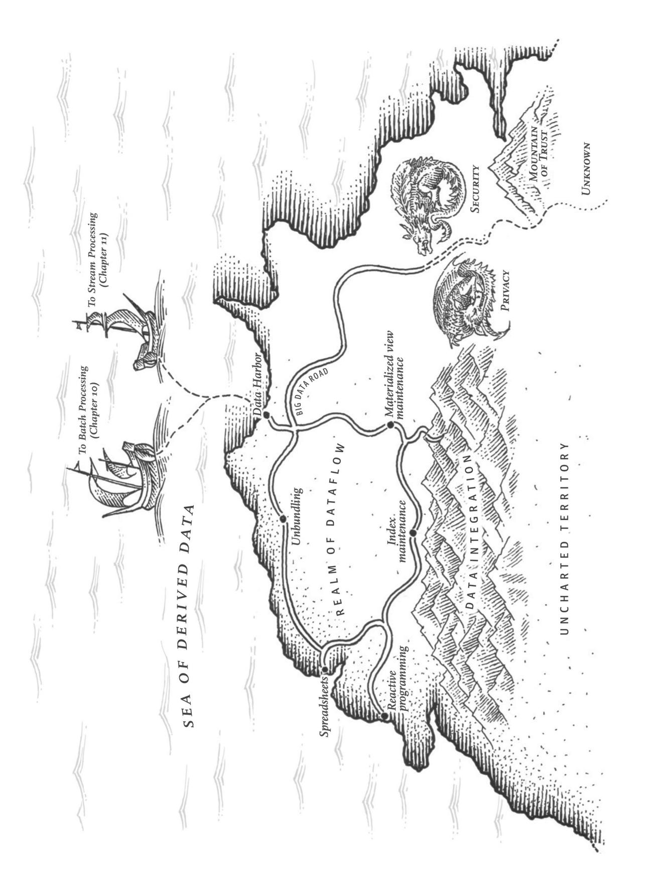

# <span id="page-510-0"></span>**The Future of Data Systems**

*If a thing be ordained to another as to its end, its last end cannot consist in the preservation of its being. Hence a captain does not intend as a last end, the preservation of the ship entrusted to him, since a ship is ordained to something else as its end, viz. to navigation. (Often quoted as: If the highest aim of a captain was the preserve his ship, he would keep it in port forever.)*

—St. Thomas Aquinas, *Summa Theologica* (1265–1274)

So far, this book has been mostly about describing things as they *are* at present. In this final chapter, we will shift our perspective toward the future and discuss how things *should be*: I will propose some ideas and approaches that, I believe, may funda‐ mentally improve the ways we design and build applications.

Opinions and speculation about the future are of course subjective, and so I will use the first person in this chapter when writing about my personal opinions. You are welcome to disagree with them and form your own opinions, but I hope that the ideas in this chapter will at least be a starting point for a productive discussion and bring some clarity to concepts that are often confused.

The goal of this book was outlined in [Chapter 1](#page-24-0): to explore how to create applications and systems that are *reliable*, *scalable*, and *maintainable*. These themes have run through all of the chapters: for example, we discussed many fault-tolerance algo‐ rithms that help improve reliability, partitioning to improve scalability, and mecha‐ nisms for evolution and abstraction that improve maintainability. In this chapter we will bring all of these ideas together, and build on them to envisage the future. Our goal is to discover how to design applications that are better than the ones of today robust, correct, evolvable, and ultimately beneficial to humanity.

## <span id="page-511-0"></span>**Data Integration**

A recurring theme in this book has been that for any given problem, there are several solutions, all of which have different pros, cons, and trade-offs. For example, when discussing storage engines in [Chapter 3,](#page-90-0) we saw log-structured storage, B-trees, and column-oriented storage. When discussing replication in [Chapter 5,](#page-172-0) we saw singleleader, multi-leader, and leaderless approaches.

If you have a problem such as "I want to store some data and look it up again later," there is no one right solution, but many different approaches that are each appropri‐ ate in different circumstances. A software implementation typically has to pick one particular approach. It's hard enough to get one code path robust and performing well—trying to do everything in one piece of software almost guarantees that the implementation will be poor.

Thus, the most appropriate choice of software tool also depends on the circumstan‐ ces. Every piece of software, even a so-called "general-purpose" database, is designed for a particular usage pattern.

Faced with this profusion of alternatives, the first challenge is then to figure out the mapping between the software products and the circumstances in which they are a good fit. Vendors are understandably reluctant to tell you about the kinds of work‐ loads for which their software is poorly suited, but hopefully the previous chapters have equipped you with some questions to ask in order to read between the lines and better understand the trade-offs.

However, even if you perfectly understand the mapping between tools and circum‐ stances for their use, there is another challenge: in complex applications, data is often used in several different ways. There is unlikely to be one piece of software that is suitable for *all* the different circumstances in which the data is used, so you inevitably end up having to cobble together several different pieces of software in order to pro‐ vide your application's functionality.

## **Combining Specialized Tools by Deriving Data**

For example, it is common to need to integrate an OLTP database with a full-text search index in order to handle queries for arbitrary keywords. Although some data‐ bases (such as PostgreSQL) include a full-text indexing feature, which can be suffi‐ cient for simple applications [[1\]](#page-566-0), more sophisticated search facilities require specialist information retrieval tools. Conversely, search indexes are generally not very suitable as a durable system of record, and so many applications need to combine two differ‐ ent tools in order to satisfy all of the requirements.

We touched on the issue of integrating data systems in ["Keeping Systems in Sync" on](#page-473-0) [page 452.](#page-473-0) As the number of different representations of the data increases, the inte‐ <span id="page-512-0"></span>gration problem becomes harder. Besides the database and the search index, perhaps you need to keep copies of the data in analytics systems (data warehouses, or batch and stream processing systems); maintain caches or denormalized versions of objects that were derived from the original data; pass the data through machine learning, classification, ranking, or recommendation systems; or send notifications based on changes to the data.

Surprisingly often I see software engineers make statements like, "In my experience, 99% of people only need X" or "…don't need X" (for various values of X). I think that such statements say more about the experience of the speaker than about the actual usefulness of a technology. The range of different things you might want to do with data is dizzyingly wide. What one person considers to be an obscure and pointless feature may well be a central requirement for someone else. The need for data inte‐ gration often only becomes apparent if you zoom out and consider the dataflows across an entire organization.

## **Reasoning about dataflows**

When copies of the same data need to be maintained in several storage systems in order to satisfy different access patterns, you need to be very clear about the inputs and outputs: where is data written first, and which representations are derived from which sources? How do you get data into all the right places, in the right formats?

For example, you might arrange for data to first be written to a system of record data‐ base, capturing the changes made to that database (see ["Change Data Capture" on](#page-475-0) [page 454](#page-475-0)) and then applying the changes to the search index in the same order. If change data capture (CDC) is the only way of updating the index, you can be confi‐ dent that the index is entirely derived from the system of record, and therefore con‐ sistent with it (barring bugs in the software). Writing to the database is the only way of supplying new input into this system.

Allowing the application to directly write to both the search index and the database introduces the problem shown in [Figure 11-4](#page-474-0), in which two clients concurrently send conflicting writes, and the two storage systems process them in a different order. In this case, neither the database nor the search index is "in charge" of determining the order of writes, and so they may make contradictory decisions and become perma‐ nently inconsistent with each other.

If it is possible for you to funnel all user input through a single system that decides on an ordering for all writes, it becomes much easier to derive other representations of the data by processing the writes in the same order. This is an application of the state machine replication approach that we saw in ["Total Order Broadcast" on page 348.](#page-369-0) Whether you use change data capture or an event sourcing log is less important than simply the principle of deciding on a total order.

<span id="page-513-0"></span>Updating a derived data system based on an event log can often be made determinis‐ tic and idempotent (see ["Idempotence" on page 478](#page-499-0)), making it quite easy to recover from faults.

## **Derived data versus distributed transactions**

The classic approach for keeping different data systems consistent with each other involves distributed transactions, as discussed in ["Atomic Commit and Two-Phase](#page-375-0) [Commit \(2PC\)" on page 354](#page-375-0). How does the approach of using derived data systems fare in comparison to distributed transactions?

At an abstract level, they achieve a similar goal by different means. Distributed trans‐ actions decide on an ordering of writes by using locks for mutual exclusion (see ["Two-Phase Locking \(2PL\)" on page 257](#page-278-0)), while CDC and event sourcing use a log for ordering. Distributed transactions use atomic commit to ensure that changes take effect exactly once, while log-based systems are often based on deterministic retry and idempotence.

The biggest difference is that transaction systems usually provide linearizability (see ["Linearizability" on page 324\)](#page-345-0), which implies useful guarantees such as reading your own writes (see ["Reading Your Own Writes" on page 162\)](#page-183-0). On the other hand, derived data systems are often updated asynchronously, and so they do not by default offer the same timing guarantees.

Within limited environments that are willing to pay the cost of distributed transac‐ tions, they have been used successfully. However, I think that XA has poor fault toler‐ ance and performance characteristics (see ["Distributed Transactions in Practice"](#page-381-0) on [page 360](#page-381-0)), which severely limit its usefulness. I believe that it might be possible to create a better protocol for distributed transactions, but getting such a protocol widely adopted and integrated with existing tools would be challenging, and unlikely to happen soon.

In the absence of widespread support for a good distributed transaction protocol, I believe that log-based derived data is the most promising approach for integrating different data systems. However, guarantees such as reading your own writes are use‐ ful, and I don't think that it is productive to tell everyone "eventual consistency is inevitable—suck it up and learn to deal with it" (at least not without good guidance on *how* to deal with it).

In ["Aiming for Correctness"](#page-536-0) on page 515 we will discuss some approaches for imple‐ menting stronger guarantees on top of asynchronously derived systems, and work toward a middle ground between distributed transactions and asynchronous logbased systems.

## <span id="page-514-0"></span>**The limits of total ordering**

With systems that are small enough, constructing a totally ordered event log is entirely feasible (as demonstrated by the popularity of databases with single-leader replication, which construct precisely such a log). However, as systems are scaled toward bigger and more complex workloads, limitations begin to emerge:

- In most cases, constructing a totally ordered log requires all events to pass through a *single leader node* that decides on the ordering. If the throughput of events is greater than a single machine can handle, you need to partition it across multiple machines (see ["Partitioned Logs" on page 446](#page-467-0)). The order of events in two different partitions is then ambiguous.
- If the servers are spread across multiple *geographically distributed* datacenters, for example in order to tolerate an entire datacenter going offline, you typically have a separate leader in each datacenter, because network delays make synchro‐ nous cross-datacenter coordination inefficient (see ["Multi-Leader Replication"](#page-189-0) [on page 168](#page-189-0)). This implies an undefined ordering of events that originate in two different datacenters.
- When applications are deployed as *microservices* (see ["Dataflow Through Serv‐](#page-152-0) [ices: REST and RPC" on page 131](#page-152-0)), a common design choice is to deploy each service and its durable state as an independent unit, with no durable state shared between services. When two events originate in different services, there is no defined order for those events.
- Some applications maintain client-side state that is updated immediately on user input (without waiting for confirmation from a server), and even continue to work offline (see ["Clients with offline operation" on page 170](#page-191-0)). With such appli‐ cations, clients and servers are very likely to see events in different orders.

In formal terms, deciding on a total order of events is known as *total order broadcast*, which is equivalent to consensus (see ["Consensus algorithms and total order broad‐](#page-387-0) [cast" on page 366\)](#page-387-0). Most consensus algorithms are designed for situations in which the throughput of a single node is sufficient to process the entire stream of events, and these algorithms do not provide a mechanism for multiple nodes to share the work of ordering the events. It is still an open research problem to design consensus algorithms that can scale beyond the throughput of a single node and that work well in a geographically distributed setting.

## **Ordering events to capture causality**

In cases where there is no causal link between events, the lack of a total order is not a big problem, since concurrent events can be ordered arbitrarily. Some other cases are easy to handle: for example, when there are multiple updates of the same object, they can be totally ordered by routing all updates for a particular object ID to the same log <span id="page-515-0"></span>partition. However, causal dependencies sometimes arise in more subtle ways (see also ["Ordering and Causality" on page 339](#page-360-0)).

For example, consider a social networking service, and two users who were in a rela‐ tionship but have just broken up. One of the users removes the other as a friend, and then sends a message to their remaining friends complaining about their ex-partner. The user's intention is that their ex-partner should not see the rude message, since the message was sent after the friend status was revoked.

However, in a system that stores friendship status in one place and messages in another place, that ordering dependency between the *unfriend* event and the *messagesend* event may be lost. If the causal dependency is not captured, a service that sends notifications about new messages may process the *message-send* event before the *unfriend* event, and thus incorrectly send a notification to the ex-partner.

In this example, the notifications are effectively a join between the messages and the friend list, making it related to the timing issues of joins that we discussed previously (see ["Time-dependence of joins" on page 475](#page-496-0)). Unfortunately, there does not seem to be a simple answer to this problem [\[2](#page-566-0), [3](#page-566-0)]. Starting points include:

- Logical timestamps can provide total ordering without coordination (see ["Sequence Number Ordering" on page 343\)](#page-364-0), so they may help in cases where total order broadcast is not feasible. However, they still require recipients to han‐ dle events that are delivered out of order, and they require additional metadata to be passed around.
- If you can log an event to record the state of the system that the user saw before making a decision, and give that event a unique identifier, then any later events can reference that event identifier in order to record the causal dependency [[4\]](#page-566-0). We will return to this idea in ["Reads are events too" on page 513](#page-534-0).
- Conflict resolution algorithms (see ["Automatic Conflict Resolution" on page](#page-195-0) [174](#page-195-0)) help with processing events that are delivered in an unexpected order. They are useful for maintaining state, but they do not help if actions have external side effects (such as sending a notification to a user).

Perhaps, over time, patterns for application development will emerge that allow causal dependencies to be captured efficiently, and derived state to be maintained correctly, without forcing all events to go through the bottleneck of total order broadcast.

## **Batch and Stream Processing**

I would say that the goal of data integration is to make sure that data ends up in the right form in all the right places. Doing so requires consuming inputs, transforming, joining, filtering, aggregating, training models, evaluating, and eventually writing to <span id="page-516-0"></span>the appropriate outputs. Batch and stream processors are the tools for achieving this goal.

The outputs of batch and stream processes are derived datasets such as search indexes, materialized views, recommendations to show to users, aggregate metrics, and so on (see ["The Output of Batch Workflows" on page 411](#page-432-0) and ["Uses of Stream](#page-486-0) [Processing" on page 465](#page-486-0)).

As we saw in [Chapter 10](#page-410-0) and [Chapter 11](#page-460-0), batch and stream processing have a lot of principles in common, and the main fundamental difference is that stream process‐ ors operate on unbounded datasets whereas batch process inputs are of a known, finite size. There are also many detailed differences in the ways the processing engines are implemented, but these distinctions are beginning to blur.

Spark performs stream processing on top of a batch processing engine by breaking the stream into *microbatches*, whereas Apache Flink performs batch processing on top of a stream processing engine [\[5](#page-566-0)]. In principle, one type of processing can be emulated on top of the other, although the performance characteristics vary: for example, microbatching may perform poorly on hopping or sliding windows [\[6](#page-566-0)].

## **Maintaining derived state**

Batch processing has a quite strong functional flavor (even if the code is not written in a functional programming language): it encourages deterministic, pure functions whose output depends only on the input and which have no side effects other than the explicit outputs, treating inputs as immutable and outputs as append-only. Stream processing is similar, but it extends operators to allow managed, fault-tolerant state (see ["Rebuilding state after a failure" on page 478](#page-499-0)).

The principle of deterministic functions with well-defined inputs and outputs is not only good for fault tolerance (see ["Idempotence" on page 478](#page-499-0)), but also simplifies reasoning about the dataflows in an organization [[7\]](#page-566-0). No matter whether the derived data is a search index, a statistical model, or a cache, it is helpful to think in terms of data pipelines that derive one thing from another, pushing state changes in one sys‐ tem through functional application code and applying the effects to derived systems.

In principle, derived data systems could be maintained synchronously, just like a relational database updates secondary indexes synchronously within the same trans‐ action as writes to the table being indexed. However, asynchrony is what makes sys‐ tems based on event logs robust: it allows a fault in one part of the system to be contained locally, whereas distributed transactions abort if any one participant fails, so they tend to amplify failures by spreading them to the rest of the system (see ["Lim‐](#page-384-0) [itations of distributed transactions" on page 363\)](#page-384-0).

We saw in ["Partitioning and Secondary Indexes"](#page-227-0) on page 206 that secondary indexes often cross partition boundaries. A partitioned system with secondary indexes either <span id="page-517-0"></span>needs to send writes to multiple partitions (if the index is term-partitioned) or send reads to all partitions (if the index is document-partitioned). Such cross-partition communication is also most reliable and scalable if the index is maintained asynchro‐ nously [\[8](#page-566-0)] (see also ["Multi-partition data processing" on page 514](#page-535-0)).

## **Reprocessing data for application evolution**

When maintaining derived data, batch and stream processing are both useful. Stream processing allows changes in the input to be reflected in derived views with low delay, whereas batch processing allows large amounts of accumulated historical data to be reprocessed in order to derive new views onto an existing dataset.

In particular, reprocessing existing data provides a good mechanism for maintaining a system, evolving it to support new features and changed requirements (see [Chap‐](#page-132-0) [ter 4](#page-132-0)). Without reprocessing, schema evolution is limited to simple changes like adding a new optional field to a record, or adding a new type of record. This is the case both in a schema-on-write and in a schema-on-read context (see ["Schema flexi‐](#page-60-0) [bility in the document model" on page 39\)](#page-60-0). On the other hand, with reprocessing it is possible to restructure a dataset into a completely different model in order to better serve new requirements.

## **Schema Migrations on Railways**

Large-scale "schema migrations" occur in noncomputer systems as well. For example, in the early days of railway building in 19th-century England there were various com‐ peting standards for the gauge (the distance between the two rails). Trains built for one gauge couldn't run on tracks of another gauge, which restricted the possible interconnections in the train network [[9](#page-566-0)].

After a single standard gauge was finally decided upon in 1846, tracks with other gauges had to be converted—but how do you do this without shutting down the train line for months or years? The solution is to first convert the track to *dual gauge* or *mixed gauge* by adding a third rail. This conversion can be done gradually, and when it is done, trains of both gauges can run on the line, using two of the three rails. Even‐ tually, once all trains have been converted to the standard gauge, the rail providing the nonstandard gauge can be removed.

"Reprocessing" the existing tracks in this way, and allowing the old and new versions to exist side by side, makes it possible to change the gauge gradually over the course of years. Nevertheless, it is an expensive undertaking, which is why nonstandard gauges still exist today. For example, the BART system in the San Francisco Bay Area uses a different gauge from the majority of the US.

<span id="page-518-0"></span>Derived views allow *gradual* evolution. If you want to restructure a dataset, you do not need to perform the migration as a sudden switch. Instead, you can maintain the old schema and the new schema side by side as two independently derived views onto the same underlying data. You can then start shifting a small number of users to the new view in order to test its performance and find any bugs, while most users con‐ tinue to be routed to the old view. Gradually, you can increase the proportion of users accessing the new view, and eventually you can drop the old view [[10\]](#page-566-0).

The beauty of such a gradual migration is that every stage of the process is easily reversible if something goes wrong: you always have a working system to go back to. By reducing the risk of irreversible damage, you can be more confident about going ahead, and thus move faster to improve your system [\[11](#page-566-0)].

## **The lambda architecture**

If batch processing is used to reprocess historical data, and stream processing is used to process recent updates, then how do you combine the two? The *lambda architec‐ ture* [[12\]](#page-566-0) is a proposal in this area that has gained a lot of attention.

The core idea of the lambda architecture is that incoming data should be recorded by appending immutable events to an always-growing dataset, similarly to event sourc‐ ing (see ["Event Sourcing" on page 457](#page-478-0)). From these events, read-optimized views are derived. The lambda architecture proposes running two different systems in parallel: a batch processing system such as Hadoop MapReduce, and a separate streamprocessing system such as Storm.

In the lambda approach, the stream processor consumes the events and quickly pro‐ duces an approximate update to the view; the batch processor later consumes the *same* set of events and produces a corrected version of the derived view. The reason‐ ing behind this design is that batch processing is simpler and thus less prone to bugs, while stream processors are thought to be less reliable and harder to make faulttolerant (see ["Fault Tolerance" on page 476\)](#page-497-0). Moreover, the stream process can use fast approximate algorithms while the batch process uses slower exact algorithms.

The lambda architecture was an influential idea that shaped the design of data sys‐ tems for the better, particularly by popularizing the principle of deriving views onto streams of immutable events and reprocessing events when needed. However, I also think that it has a number of practical problems:

• Having to maintain the same logic to run both in a batch and in a stream pro‐ cessing framework is significant additional effort. Although libraries such as Summingbird [\[13](#page-566-0)] provide an abstraction for computations that can be run in either a batch or a streaming context, the operational complexity of debugging, tuning, and maintaining two different systems remains [[14\]](#page-566-0).

- <span id="page-519-0"></span>• Since the stream pipeline and the batch pipeline produce separate outputs, they need to be merged in order to respond to user requests. This merge is fairly easy if the computation is a simple aggregation over a tumbling window, but it becomes significantly harder if the view is derived using more complex opera‐ tions such as joins and sessionization, or if the output is not a time series.
- Although it is great to have the ability to reprocess the entire historical dataset, doing so frequently is expensive on large datasets. Thus, the batch pipeline often needs to be set up to process incremental batches (e.g., an hour's worth of data at the end of every hour) rather than reprocessing everything. This raises the prob‐ lems discussed in ["Reasoning About Time" on page 468](#page-489-0), such as handling strag‐ glers and handling windows that cross boundaries between batches. Incrementalizing a batch computation adds complexity, making it more akin to the streaming layer, which runs counter to the goal of keeping the batch layer as simple as possible.

## **Unifying batch and stream processing**

More recent work has enabled the benefits of the lambda architecture to be enjoyed without its downsides, by allowing both batch computations (reprocessing historical data) and stream computations (processing events as they arrive) to be implemented in the same system [\[15](#page-566-0)].

Unifying batch and stream processing in one system requires the following features, which are becoming increasingly widely available:

- The ability to replay historical events through the same processing engine that handles the stream of recent events. For example, log-based message brokers have the ability to replay messages (see ["Replaying old messages" on page 451\)](#page-472-0), and some stream processors can read input from a distributed filesystem like HDFS.
- Exactly-once semantics for stream processors—that is, ensuring that the output is the same as if no faults had occurred, even if faults did in fact occur (see ["Fault](#page-497-0) [Tolerance" on page 476](#page-497-0)). Like with batch processing, this requires discarding the partial output of any failed tasks.
- Tools for windowing by event time, not by processing time, since processing time is meaningless when reprocessing historical events (see ["Reasoning About](#page-489-0) [Time" on page 468](#page-489-0)). For example, Apache Beam provides an API for expressing such computations, which can then be run using Apache Flink or Google Cloud Dataflow.

## <span id="page-520-0"></span>**Unbundling Databases**

At a most abstract level, databases, Hadoop, and operating systems all perform the same functions: they store some data, and they allow you to process and query that data [[16](#page-567-0)]. A database stores data in records of some data model (rows in tables, docu‐ ments, vertices in a graph, etc.) while an operating system's filesystem stores data in files—but at their core, both are "information management" systems [\[17](#page-567-0)]. As we saw in [Chapter 10,](#page-410-0) the Hadoop ecosystem is somewhat like a distributed version of Unix.

Of course, there are many practical differences. For example, many filesystems do not cope very well with a directory containing 10 million small files, whereas a database containing 10 million small records is completely normal and unremarkable. Never‐ theless, the similarities and differences between operating systems and databases are worth exploring.

Unix and relational databases have approached the information management prob‐ lem with very different philosophies. Unix viewed its purpose as presenting program‐ mers with a logical but fairly low-level hardware abstraction, whereas relational databases wanted to give application programmers a high-level abstraction that would hide the complexities of data structures on disk, concurrency, crash recovery, and so on. Unix developed pipes and files that are just sequences of bytes, whereas databases developed SQL and transactions.

Which approach is better? Of course, it depends what you want. Unix is "simpler" in the sense that it is a fairly thin wrapper around hardware resources; relational data‐ bases are "simpler" in the sense that a short declarative query can draw on a lot of powerful infrastructure (query optimization, indexes, join methods, concurrency control, replication, etc.) without the author of the query needing to understand the implementation details.

The tension between these philosophies has lasted for decades (both Unix and the relational model emerged in the early 1970s) and still isn't resolved. For example, I would interpret the NoSQL movement as wanting to apply a Unix-esque approach of low-level abstractions to the domain of distributed OLTP data storage.

In this section I will attempt to reconcile the two philosophies, in the hope that we can combine the best of both worlds.

## **Composing Data Storage Technologies**

Over the course of this book we have discussed various features provided by data‐ bases and how they work, including:

• Secondary indexes, which allow you to efficiently search for records based on the value of a field (see ["Other Indexing Structures" on page 85\)](#page-106-0)

- <span id="page-521-0"></span>• Materialized views, which are a kind of precomputed cache of query results (see ["Aggregation: Data Cubes and Materialized Views" on page 101](#page-122-0))
- Replication logs, which keep copies of the data on other nodes up to date (see ["Implementation of Replication Logs" on page 158](#page-179-0))
- Full-text search indexes, which allow keyword search in text (see ["Full-text](#page-109-0) [search and fuzzy indexes" on page 88\)](#page-109-0) and which are built into some relational databases [\[1](#page-566-0)]

In Chapters [10](#page-410-0) and [11,](#page-460-0) similar themes emerged. We talked about building full-text search indexes (see ["The Output of Batch Workflows" on page 411](#page-432-0)), about material‐ ized view maintenance (see ["Maintaining materialized views" on page 467](#page-488-0)), and about replicating changes from a database to derived data systems (see ["Change Data](#page-475-0) [Capture" on page 454](#page-475-0)).

It seems that there are parallels between the features that are built into databases and the derived data systems that people are building with batch and stream processors.

## **Creating an index**

Think about what happens when you run CREATE INDEX to create a new index in a relational database. The database has to scan over a consistent snapshot of a table, pick out all of the field values being indexed, sort them, and write out the index. Then it must process the backlog of writes that have been made since the consistent snap‐ shot was taken (assuming the table was not locked while creating the index, so writes could continue). Once that is done, the database must continue to keep the index up to date whenever a transaction writes to the table.

This process is remarkably similar to setting up a new follower replica (see ["Setting](#page-176-0) [Up New Followers"](#page-176-0) on page 155), and also very similar to bootstrapping change data capture in a streaming system (see ["Initial snapshot" on page 455](#page-476-0)).

Whenever you run CREATE INDEX, the database essentially reprocesses the existing dataset (as discussed in ["Reprocessing data for application evolution" on page 496](#page-517-0)) and derives the index as a new view onto the existing data. The existing data may be a snapshot of the state rather than a log of all changes that ever happened, but the two are closely related (see ["State, Streams, and Immutability" on page 459\)](#page-480-0).

## **The meta-database of everything**

In this light, I think that the dataflow across an entire organization starts looking like one huge database [\[7](#page-566-0)]. Whenever a batch, stream, or ETL process transports data from one place and form to another place and form, it is acting like the database sub‐ system that keeps indexes or materialized views up to date.

<span id="page-522-0"></span>Viewed like this, batch and stream processors are like elaborate implementations of triggers, stored procedures, and materialized view maintenance routines. The derived data systems they maintain are like different index types. For example, a relational database may support B-tree indexes, hash indexes, spatial indexes (see ["Multi](#page-108-0)[column indexes" on page 87](#page-108-0)), and other types of indexes. In the emerging architec‐ ture of derived data systems, instead of implementing those facilities as features of a single integrated database product, they are provided by various different pieces of software, running on different machines, administered by different teams.

Where will these developments take us in the future? If we start from the premise that there is no single data model or storage format that is suitable for all access pat‐ terns, I speculate that there are two avenues by which different storage and process‐ ing tools can nevertheless be composed into a cohesive system:

## *Federated databases: unifying reads*

It is possible to provide a unified query interface to a wide variety of underlying storage engines and processing methods—an approach known as a *federated database* or *polystore* [[18,](#page-567-0) [19\]](#page-567-0). For example, PostgreSQL's *foreign data wrapper* feature fits this pattern [\[20](#page-567-0)]. Applications that need a specialized data model or query interface can still access the underlying storage engines directly, while users who want to combine data from disparate places can do so easily through the federated interface.

A federated query interface follows the relational tradition of a single integrated system with a high-level query language and elegant semantics, but a compli‐ cated implementation.

## *Unbundled databases: unifying writes*

While federation addresses read-only querying across several different systems, it does not have a good answer to synchronizing writes across those systems. We said that within a single database, creating a consistent index is a built-in feature. When we compose several storage systems, we similarly need to ensure that all data changes end up in all the right places, even in the face of faults. Making it easier to reliably plug together storage systems (e.g., through change data capture and event logs) is like *unbundling* a database's index-maintenance features in a way that can synchronize writes across disparate technologies [[7,](#page-566-0) [21\]](#page-567-0).

The unbundled approach follows the Unix tradition of small tools that do one thing well [[22\]](#page-567-0), that communicate through a uniform low-level API (pipes), and that can be composed using a higher-level language (the shell) [[16\]](#page-567-0).

## **Making unbundling work**

Federation and unbundling are two sides of the same coin: composing a reliable, scal‐ able, and maintainable system out of diverse components. Federated read-only <span id="page-523-0"></span>querying requires mapping one data model into another, which takes some thought but is ultimately quite a manageable problem. I think that keeping the writes to sev‐ eral storage systems in sync is the harder engineering problem, and so I will focus on it.

The traditional approach to synchronizing writes requires distributed transactions across heterogeneous storage systems [\[18](#page-567-0)], which I think is the wrong solution (see ["Derived data versus distributed transactions" on page 492](#page-513-0)). Transactions within a single storage or stream processing system are feasible, but when data crosses the boundary between different technologies, I believe that an asynchronous event log with idempotent writes is a much more robust and practical approach.

For example, distributed transactions are used within some stream processors to ach‐ ieve exactly-once semantics (see ["Atomic commit revisited" on page 477](#page-498-0)), and this can work quite well. However, when a transaction would need to involve systems written by different groups of people (e.g., when data is written from a stream pro‐ cessor to a distributed key-value store or search index), the lack of a standardized transaction protocol makes integration much harder. An ordered log of events with idempotent consumers (see ["Idempotence" on page 478\)](#page-499-0) is a much simpler abstrac‐ tion, and thus much more feasible to implement across heterogeneous systems [[7\]](#page-566-0).

The big advantage of log-based integration is *loose coupling* between the various com‐ ponents, which manifests itself in two ways:

- 1. At a system level, asynchronous event streams make the system as a whole more robust to outages or performance degradation of individual components. If a consumer runs slow or fails, the event log can buffer messages (see ["Disk space](#page-471-0) [usage" on page 450\)](#page-471-0), allowing the producer and any other consumers to continue running unaffected. The faulty consumer can catch up when it is fixed, so it doesn't miss any data, and the fault is contained. By contrast, the synchronous interaction of distributed transactions tends to escalate local faults into largescale failures (see ["Limitations of distributed transactions" on page 363\)](#page-384-0).
- 2. At a human level, unbundling data systems allows different software components and services to be developed, improved, and maintained independently from each other by different teams. Specialization allows each team to focus on doing one thing well, with well-defined interfaces to other teams' systems. Event logs provide an interface that is powerful enough to capture fairly strong consistency properties (due to durability and ordering of events), but also general enough to be applicable to almost any kind of data.

## **Unbundled versus integrated systems**

If unbundling does indeed become the way of the future, it will not replace databases in their current form—they will still be needed as much as ever. Databases are still <span id="page-524-0"></span>required for maintaining state in stream processors, and in order to serve queries for the output of batch and stream processors (see ["The Output of Batch Workflows" on](#page-432-0) [page 411](#page-432-0) and ["Processing Streams" on page 464\)](#page-485-0). Specialized query engines will con‐ tinue to be important for particular workloads: for example, query engines in MPP data warehouses are optimized for exploratory analytic queries and handle this kind of workload very well (see ["Comparing Hadoop to Distributed Databases" on page](#page-435-0) [414](#page-435-0)).

The complexity of running several different pieces of infrastructure can be a problem: each piece of software has a learning curve, configuration issues, and operational quirks, and so it is worth deploying as few moving parts as possible. A single integra‐ ted software product may also be able to achieve better and more predictable perfor‐ mance on the kinds of workloads for which it is designed, compared to a system consisting of several tools that you have composed with application code [\[23](#page-567-0)]. As I said in the [Preface](#page-14-0), building for scale that you don't need is wasted effort and may lock you into an inflexible design. In effect, it is a form of premature optimization.

The goal of unbundling is not to compete with individual databases on performance for particular workloads; the goal is to allow you to combine several different data‐ bases in order to achieve good performance for a much wider range of workloads than is possible with a single piece of software. It's about breadth, not depth—in the same vein as the diversity of storage and processing models that we discussed in ["Comparing Hadoop to Distributed Databases" on page 414.](#page-435-0)

Thus, if there is a single technology that does everything you need, you're most likely best off simply using that product rather than trying to reimplement it yourself from lower-level components. The advantages of unbundling and composition only come into the picture when there is no single piece of software that satisfies all your requirements.

## **What's missing?**

The tools for composing data systems are getting better, but I think one major part is missing: we don't yet have the unbundled-database equivalent of the Unix shell (i.e., a high-level language for composing storage and processing systems in a simple and declarative way).

For example, I would love it if we could simply declare mysql | elasticsearch, by analogy to Unix pipes [[22\]](#page-567-0), which would be the unbundled equivalent of CREATE INDEX: it would take all the documents in a MySQL database and index them in an Elasticsearch cluster. It would then continually capture all the changes made to the database and automatically apply them to the search index, without us having to write custom application code. This kind of integration should be possible with almost any kind of storage or indexing system.

<span id="page-525-0"></span>Similarly, it would be great to be able to precompute and update caches more easily. Recall that a materialized view is essentially a precomputed cache, so you could imag‐ ine creating a cache by declaratively specifying materialized views for complex quer‐ ies, including recursive queries on graphs (see ["Graph-Like Data Models"](#page-70-0) on page [49](#page-70-0)) and application logic. There is interesting early-stage research in this area, such as *differential dataflow* [[24](#page-567-0), [25](#page-567-0)], and I hope that these ideas will find their way into pro‐ duction systems.

## **Designing Applications Around Dataflow**

The approach of unbundling databases by composing specialized storage and pro‐ cessing systems with application code is also becoming known as the "database inside-out" approach [[26\]](#page-567-0), after the title of a conference talk I gave in 2014 [[27\]](#page-567-0). However, calling it a "new architecture" is too grandiose. I see it more as a design pattern, a starting point for discussion, and we give it a name simply so that we can better talk about it.

These ideas are not mine; they are simply an amalgamation of other people's ideas from which I think we should learn. In particular, there is a lot of overlap with *data‐ flow* languages such as Oz [[28\]](#page-567-0) and Juttle [[29\]](#page-567-0), *functional reactive programming* (FRP) languages such as Elm [\[30](#page-568-0), [31](#page-568-0)], and *logic programming* languages such as Bloom [[32\]](#page-568-0). The term *unbundling* in this context was proposed by Jay Kreps [\[7](#page-566-0)].

Even spreadsheets have dataflow programming capabilities that are miles ahead of most mainstream programming languages [[33\]](#page-568-0). In a spreadsheet, you can put a for‐ mula in one cell (for example, the sum of cells in another column), and whenever any input to the formula changes, the result of the formula is automatically recalculated. This is exactly what we want at a data system level: when a record in a database changes, we want any index for that record to be automatically updated, and any cached views or aggregations that depend on the record to be automatically refreshed. You should not have to worry about the technical details of how this refresh happens, but be able to simply trust that it works correctly.

Thus, I think that most data systems still have something to learn from the features that VisiCalc already had in 1979 [\[34](#page-568-0)]. The difference from spreadsheets is that today's data systems need to be fault-tolerant, scalable, and store data durably. They also need to be able to integrate disparate technologies written by different groups of people over time, and reuse existing libraries and services: it is unrealistic to expect all software to be developed using one particular language, framework, or tool.

In this section I will expand on these ideas and explore some ways of building appli‐ cations around the ideas of unbundled databases and dataflow.

## <span id="page-526-0"></span>**Application code as a derivation function**

When one dataset is derived from another, it goes through some kind of transforma‐ tion function. For example:

- A secondary index is a kind of derived dataset with a straightforward transforma‐ tion function: for each row or document in the base table, it picks out the values in the columns or fields being indexed, and sorts by those values (assuming a Btree or SSTable index, which are sorted by key, as discussed in [Chapter 3\)](#page-90-0).
- A full-text search index is created by applying various natural language process‐ ing functions such as language detection, word segmentation, stemming or lem‐ matization, spelling correction, and synonym identification, followed by building a data structure for efficient lookups (such as an inverted index).
- In a machine learning system, we can consider the model as being derived from the training data by applying various feature extraction and statistical analysis functions. When the model is applied to new input data, the output of the model is derived from the input and the model (and hence, indirectly, from the training data).
- A cache often contains an aggregation of data in the form in which it is going to be displayed in a user interface (UI). Populating the cache thus requires knowl‐ edge of what fields are referenced in the UI; changes in the UI may require updating the definition of how the cache is populated and rebuilding the cache.

The derivation function for a secondary index is so commonly required that it is built into many databases as a core feature, and you can invoke it by merely saying CREATE INDEX. For full-text indexing, basic linguistic features for common languages may be built into a database, but the more sophisticated features often require domainspecific tuning. In machine learning, feature engineering is notoriously applicationspecific, and often has to incorporate detailed knowledge about the user interaction and deployment of an application [[35\]](#page-568-0).

When the function that creates a derived dataset is not a standard cookie-cutter func‐ tion like creating a secondary index, custom code is required to handle the application-specific aspects. And this custom code is where many databases struggle. Although relational databases commonly support triggers, stored procedures, and user-defined functions, which can be used to execute application code within the database, they have been somewhat of an afterthought in database design (see ["Transmitting Event Streams" on page 440\)](#page-461-0).

## **Separation of application code and state**

In theory, databases could be deployment environments for arbitrary application code, like an operating system. However, in practice they have turned out to be

<span id="page-527-0"></span>poorly suited for this purpose. They do not fit well with the requirements of modern application development, such as dependency and package management, version control, rolling upgrades, evolvability, monitoring, metrics, calls to network services, and integration with external systems.

On the other hand, deployment and cluster management tools such as Mesos, YARN, Docker, Kubernetes, and others are designed specifically for the purpose of running application code. By focusing on doing one thing well, they are able to do it much better than a database that provides execution of user-defined functions as one of its many features.

I think it makes sense to have some parts of a system that specialize in durable data storage, and other parts that specialize in running application code. The two can interact while still remaining independent.

Most web applications today are deployed as stateless services, in which any user request can be routed to any application server, and the server forgets everything about the request once it has sent the response. This style of deployment is conve‐ nient, as servers can be added or removed at will, but the state has to go somewhere: typically, a database. The trend has been to keep stateless application logic separate from state management (databases): not putting application logic in the database and not putting persistent state in the application [\[36\]](#page-568-0). As people in the functional pro‐ gramming community like to joke, "We believe in the separation of Church and state" [[37\]](#page-568-0).<sup>i</sup>

In this typical web application model, the database acts as a kind of mutable shared variable that can be accessed synchronously over the network. The application can read and update the variable, and the database takes care of making it durable, pro‐ viding some concurrency control and fault tolerance.

However, in most programming languages you cannot subscribe to changes in a mutable variable—you can only read it periodically. Unlike in a spreadsheet, readers of the variable don't get notified if the value of the variable changes. (You can imple‐ ment such notifications in your own code—this is known as the *observer pattern* but most languages do not have this pattern as a built-in feature.)

Databases have inherited this passive approach to mutable data: if you want to find out whether the content of the database has changed, often your only option is to poll (i.e., to repeat your query periodically). Subscribing to changes is only just beginning to emerge as a feature (see ["API support for change streams" on page 456](#page-477-0)).

i. Explaining a joke rarely improves it, but I don't want anyone to feel left out. Here, *Church* is a reference to the mathematician Alonzo Church, who created the lambda calculus, an early form of computation that is the basis for most functional programming languages. The lambda calculus has no mutable state (i.e., no vari‐ ables that can be overwritten), so one could say that mutable state is separate from Church's work.

## <span id="page-528-0"></span>**Dataflow: Interplay between state changes and application code**

Thinking about applications in terms of dataflow implies renegotiating the relation‐ ship between application code and state management. Instead of treating a database as a passive variable that is manipulated by the application, we think much more about the interplay and collaboration between state, state changes, and code that pro‐ cesses them. Application code responds to state changes in one place by triggering state changes in another place.

We saw this line of thinking in ["Databases and Streams" on page 451,](#page-472-0) where we dis‐ cussed treating the log of changes to a database as a stream of events that we can sub‐ scribe to. Message-passing systems such as actors (see ["Message-Passing Dataflow"](#page-157-0) [on page 136\)](#page-157-0) also have this concept of responding to events. Already in the 1980s, the *tuple spaces* model explored expressing distributed computations in terms of pro‐ cesses that observe state changes and react to them [[38,](#page-568-0) [39\]](#page-568-0).

As discussed, similar things happen inside a database when a trigger fires due to a data change, or when a secondary index is updated to reflect a change in the table being indexed. Unbundling the database means taking this idea and applying it to the creation of derived datasets outside of the primary database: caches, full-text search indexes, machine learning, or analytics systems. We can use stream processing and messaging systems for this purpose.

The important thing to keep in mind is that maintaining derived data is not the same as asynchronous job execution, for which messaging systems are traditionally designed (see ["Logs compared to traditional messaging" on page 448](#page-469-0)):

- When maintaining derived data, the order of state changes is often important (if several views are derived from an event log, they need to process the events in the same order so that they remain consistent with each other). As discussed in ["Acknowledgments and redelivery" on page 445](#page-466-0), many message brokers do not have this property when redelivering unacknowledged messages. Dual writes are also ruled out (see ["Keeping Systems in Sync" on page 452](#page-473-0)).
- Fault tolerance is key for derived data: losing just a single message causes the derived dataset to go permanently out of sync with its data source. Both message delivery and derived state updates must be reliable. For example, many actor sys‐ tems by default maintain actor state and messages in memory, so they are lost if the machine running the actor crashes.

Stable message ordering and fault-tolerant message processing are quite stringent demands, but they are much less expensive and more operationally robust than dis‐ tributed transactions. Modern stream processors can provide these ordering and reli‐ ability guarantees at scale, and they allow application code to be run as stream operators.

<span id="page-529-0"></span>This application code can do the arbitrary processing that built-in derivation func‐ tions in databases generally don't provide. Like Unix tools chained by pipes, stream operators can be composed to build large systems around dataflow. Each operator takes streams of state changes as input, and produces other streams of state changes as output.

## **Stream processors and services**

The currently trendy style of application development involves breaking down func‐ tionality into a set of *services* that communicate via synchronous network requests such as REST APIs (see ["Dataflow Through Services: REST and RPC" on page 131\)](#page-152-0). The advantage of such a service-oriented architecture over a single monolithic appli‐ cation is primarily organizational scalability through loose coupling: different teams can work on different services, which reduces coordination effort between teams (as long as the services can be deployed and updated independently).

Composing stream operators into dataflow systems has a lot of similar characteristics to the microservices approach [[40\]](#page-568-0). However, the underlying communication mecha‐ nism is very different: one-directional, asynchronous message streams rather than synchronous request/response interactions.

Besides the advantages listed in ["Message-Passing Dataflow" on page 136,](#page-157-0) such as better fault tolerance, dataflow systems can also achieve better performance. For example, say a customer is purchasing an item that is priced in one currency but paid for in another currency. In order to perform the currency conversion, you need to know the current exchange rate. This operation could be implemented in two ways [[40, 41\]](#page-568-0):

- 1. In the microservices approach, the code that processes the purchase would prob‐ ably query an exchange-rate service or database in order to obtain the current rate for a particular currency.
- 2. In the dataflow approach, the code that processes purchases would subscribe to a stream of exchange rate updates ahead of time, and record the current rate in a local database whenever it changes. When it comes to processing the purchase, it only needs to query the local database.

The second approach has replaced a synchronous network request to another service with a query to a local database (which may be on the same machine, even in the same process).ii Not only is the dataflow approach faster, but it is also more robust to

ii. In the microservices approach, you could avoid the synchronous network request by caching the exchange rate locally in the service that processes the purchase. However, in order to keep that cache fresh, you would need to periodically poll for updated exchange rates, or subscribe to a stream of changes—which is exactly what happens in the dataflow approach.

<span id="page-530-0"></span>the failure of another service. The fastest and most reliable network request is no net‐ work request at all! Instead of RPC, we now have a stream join between purchase events and exchange rate update events (see ["Stream-table join \(stream enrichment\)"](#page-494-0) [on page 473](#page-494-0)).

The join is time-dependent: if the purchase events are reprocessed at a later point in time, the exchange rate will have changed. If you want to reconstruct the original out‐ put, you will need to obtain the historical exchange rate at the original time of pur‐ chase. No matter whether you query a service or subscribe to a stream of exchange rate updates, you will need to handle this time dependence (see ["Time-dependence of](#page-496-0) [joins" on page 475\)](#page-496-0).

Subscribing to a stream of changes, rather than querying the current state when needed, brings us closer to a spreadsheet-like model of computation: when some piece of data changes, any derived data that depends on it can swiftly be updated. There are still many open questions, for example around issues like time-dependent joins, but I believe that building applications around dataflow ideas is a very promis‐ ing direction to go in.

## **Observing Derived State**

At an abstract level, the dataflow systems discussed in the last section give you a pro‐ cess for creating derived datasets (such as search indexes, materialized views, and predictive models) and keeping them up to date. Let's call that process the *write path*: whenever some piece of information is written to the system, it may go through mul‐ tiple stages of batch and stream processing, and eventually every derived dataset is updated to incorporate the data that was written. Figure 12-1 shows an example of updating a search index.

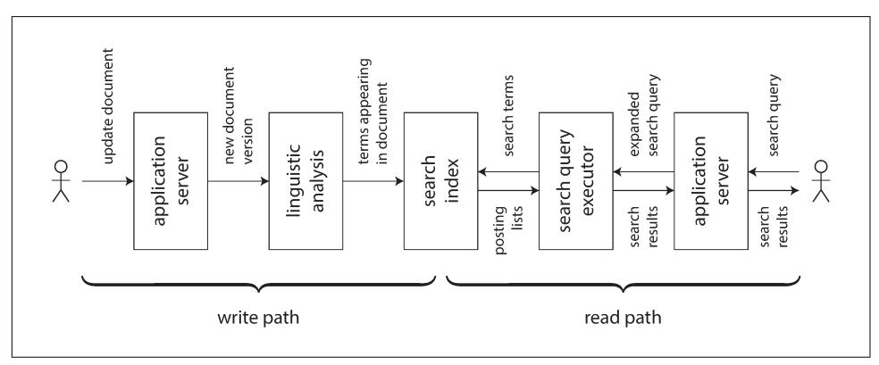

*Figure 12-1. In a search index, writes (document updates) meet reads (queries).*

But why do you create the derived dataset in the first place? Most likely because you want to query it again at a later time. This is the *read path*: when serving a user <span id="page-531-0"></span>request you read from the derived dataset, perhaps perform some more processing on the results, and construct the response to the user.

Taken together, the write path and the read path encompass the whole journey of the data, from the point where it is collected to the point where it is consumed (probably by another human). The write path is the portion of the journey that is precomputed —i.e., that is done eagerly as soon as the data comes in, regardless of whether anyone has asked to see it. The read path is the portion of the journey that only happens when someone asks for it. If you are familiar with functional programming lan‐ guages, you might notice that the write path is similar to eager evaluation, and the read path is similar to lazy evaluation.

The derived dataset is the place where the write path and the read path meet, as illus‐ trated in [Figure 12-1.](#page-530-0) It represents a trade-off between the amount of work that needs to be done at write time and the amount that needs to be done at read time.

## **Materialized views and caching**

A full-text search index is a good example: the write path updates the index, and the read path searches the index for keywords. Both reads and writes need to do some work. Writes need to update the index entries for all terms that appear in the docu‐ ment. Reads need to search for each of the words in the query, and apply Boolean logic to find documents that contain *all* of the words in the query (an AND operator), or *any* synonym of each of the words (an OR operator).

If you didn't have an index, a search query would have to scan over all documents (like grep), which would get very expensive if you had a large number of documents. No index means less work on the write path (no index to update), but a lot more work on the read path.

On the other hand, you could imagine precomputing the search results for all possi‐ ble queries. In that case, you would have less work to do on the read path: no Boolean logic, just find the results for your query and return them. However, the write path would be a lot more expensive: the set of possible search queries that could be asked is infinite, and thus precomputing all possible search results would require infinite time and storage space. That wouldn't work so well.iii

Another option would be to precompute the search results for only a fixed set of the most common queries, so that they can be served quickly without having to go to the index. The uncommon queries can still be served from the index. This would gener‐ ally be called a *cache* of common queries, although we could also call it a materialized

iii. Less facetiously, the set of distinct search queries with nonempty search results is finite, assuming a finite corpus. However, it would be exponential in the number of terms in the corpus, which is still pretty bad news.

<span id="page-532-0"></span>view, as it would need to be updated when new documents appear that should be included in the results of one of the common queries.

From this example we can see that an index is not the only possible boundary between the write path and the read path. Caching of common search results is possi‐ ble, and grep-like scanning without the index is also possible on a small number of documents. Viewed like this, the role of caches, indexes, and materialized views is simple: they shift the boundary between the read path and the write path. They allow us to do more work on the write path, by precomputing results, in order to save effort on the read path.

Shifting the boundary between work done on the write path and the read path was in fact the topic of the Twitter example at the beginning of this book, in ["Describing](#page-32-0) [Load" on page 11](#page-32-0). In that example, we also saw how the boundary between write path and read path might be drawn differently for celebrities compared to ordinary users. After 500 pages we have come full circle!

## **Stateful, offline-capable clients**

I find the idea of a boundary between write and read paths interesting because we can discuss shifting that boundary and explore what that shift means in practical terms. Let's look at the idea in a different context.

The huge popularity of web applications in the last two decades has led us to certain assumptions about application development that are easy to take for granted. In par‐ ticular, the client/server model—in which clients are largely stateless and servers have the authority over data—is so common that we almost forget that anything else exists. However, technology keeps moving on, and I think it is important to question the status quo from time to time.

Traditionally, web browsers have been stateless clients that can only do useful things when you have an internet connection (just about the only thing you could do offline was to scroll up and down in a page that you had previously loaded while online). However, recent "single-page" JavaScript web apps have gained a lot of stateful capa‐ bilities, including client-side user interface interaction and persistent local storage in the web browser. Mobile apps can similarly store a lot of state on the device and don't require a round-trip to the server for most user interactions.

These changing capabilities have led to a renewed interest in *offline-first* applications that do as much as possible using a local database on the same device, without requir‐ ing an internet connection, and sync with remote servers in the background when a network connection is available [\[42](#page-568-0)]. Since mobile devices often have slow and unre‐ liable cellular internet connections, it's a big advantage for users if their user interface does not have to wait for synchronous network requests, and if apps mostly work off‐ line (see ["Clients with offline operation" on page 170\)](#page-191-0).

<span id="page-533-0"></span>When we move away from the assumption of stateless clients talking to a central database and toward state that is maintained on end-user devices, a world of new opportunities opens up. In particular, we can think of the on-device state as a *cache of state on the server*. The pixels on the screen are a materialized view onto model objects in the client app; the model objects are a local replica of state in a remote datacenter [\[27](#page-567-0)].

## **Pushing state changes to clients**

In a typical web page, if you load the page in a web browser and the data subse‐ quently changes on the server, the browser does not find out about the change until you reload the page. The browser only reads the data at one point in time, assuming that it is static—it does not subscribe to updates from the server. Thus, the state on the device is a stale cache that is not updated unless you explicitly poll for changes. (HTTP-based feed subscription protocols like RSS are really just a basic form of poll‐ ing.)

More recent protocols have moved beyond the basic request/response pattern of HTTP: server-sent events (the EventSource API) and WebSockets provide communi‐ cation channels by which a web browser can keep an open TCP connection to a server, and the server can actively push messages to the browser as long as it remains connected. This provides an opportunity for the server to actively inform the enduser client about any changes to the state it has stored locally, reducing the staleness of the client-side state.

In terms of our model of write path and read path, actively pushing state changes all the way to client devices means extending the write path all the way to the end user. When a client is first initialized, it would still need to use a read path to get its initial state, but thereafter it could rely on a stream of state changes sent by the server. The ideas we discussed around stream processing and messaging are not restricted to run‐ ning only in a datacenter: we can take the ideas further, and extend them all the way to end-user devices [\[43](#page-568-0)].

The devices will be offline some of the time, and unable to receive any notifications of state changes from the server during that time. But we already solved that problem: in ["Consumer offsets" on page 449](#page-470-0) we discussed how a consumer of a log-based mes‐ sage broker can reconnect after failing or becoming disconnected, and ensure that it doesn't miss any messages that arrived while it was disconnected. The same techni‐ que works for individual users, where each device is a small subscriber to a small stream of events.

## **End-to-end event streams**

Recent tools for developing stateful clients and user interfaces, such as the Elm lan‐ guage [[30](#page-568-0)] and Facebook's toolchain of React, Flux, and Redux [[44\]](#page-569-0), already manage

<span id="page-534-0"></span>internal client-side state by subscribing to a stream of events representing user input or responses from a server, structured similarly to event sourcing (see ["Event Sourc‐](#page-478-0) [ing" on page 457\)](#page-478-0).

It would be very natural to extend this programming model to also allow a server to push state-change events into this client-side event pipeline. Thus, state changes could flow through an end-to-end write path: from the interaction on one device that triggers a state change, via event logs and through several derived data systems and stream processors, all the way to the user interface of a person observing the state on another device. These state changes could be propagated with fairly low delay—say, under one second end to end.

Some applications, such as instant messaging and online games, already have such a "real-time" architecture (in the sense of interactions with low delay, not in the sense of ["Response time guarantees" on page 298](#page-319-0)). But why don't we build all applications this way?

The challenge is that the assumption of stateless clients and request/response interac‐ tions is very deeply ingrained in our databases, libraries, frameworks, and protocols. Many datastores support read and write operations where a request returns one response, but much fewer provide an ability to subscribe to changes—i.e., a request that returns a stream of responses over time (see ["API support for change streams"](#page-477-0) [on page 456](#page-477-0)).

In order to extend the write path all the way to the end user, we would need to funda‐ mentally rethink the way we build many of these systems: moving away from request/ response interaction and toward publish/subscribe dataflow [\[27](#page-567-0)]. I think that the advantages of more responsive user interfaces and better offline support would make it worth the effort. If you are designing data systems, I hope that you will keep in mind the option of subscribing to changes, not just querying the current state.

#### **Reads are events too**

We discussed that when a stream processor writes derived data to a store (database, cache, or index), and when user requests query that store, the store acts as the bound‐ ary between the write path and the read path. The store allows random-access read queries to the data that would otherwise require scanning the whole event log.

In many cases, the data storage is separate from the streaming system. But recall that stream processors also need to maintain state to perform aggregations and joins (see ["Stream Joins" on page 472\)](#page-493-0). This state is normally hidden inside the stream pro‐ cessor, but some frameworks allow it to also be queried by outside clients [[45\]](#page-569-0), turn‐ ing the stream processor itself into a kind of simple database.

I would like to take that idea further. As discussed so far, the writes to the store go through an event log, while reads are transient network requests that go directly to <span id="page-535-0"></span>the nodes that store the data being queried. This is a reasonable design, but not the only possible one. It is also possible to represent read requests as streams of events, and send both the read events and the write events through a stream processor; the processor responds to read events by emitting the result of the read to an output stream [[46\]](#page-569-0).

When both the writes and the reads are represented as events, and routed to the same stream operator in order to be handled, we are in fact performing a stream-table join between the stream of read queries and the database. The read event needs to be sent to the database partition holding the data (see ["Request Routing" on page 214](#page-235-0)), just like batch and stream processors need to copartition inputs on the same key when joining (see ["Reduce-Side Joins and Grouping" on page 403\)](#page-424-0).

This correspondence between serving requests and performing joins is quite funda‐ mental [[47\]](#page-569-0). A one-off read request just passes the request through the join operator and then immediately forgets it; a subscribe request is a persistent join with past and future events on the other side of the join.

Recording a log of read events potentially also has benefits with regard to tracking causal dependencies and data provenance across a system: it would allow you to reconstruct what the user saw before they made a particular decision. For example, in an online shop, it is likely that the predicted shipping date and the inventory status shown to a customer affect whether they choose to buy an item [[4\]](#page-566-0). To analyze this connection, you need to record the result of the user's query of the shipping and inventory status.

Writing read events to durable storage thus enables better tracking of causal depen‐ dencies (see ["Ordering events to capture causality" on page 493\)](#page-514-0), but it incurs addi‐ tional storage and I/O cost. Optimizing such systems to reduce the overhead is still an open research problem [\[2](#page-566-0)]. But if you already log read requests for operational purposes, as a side effect of request processing, it is not such a great change to make the log the source of the requests instead.

## **Multi-partition data processing**

For queries that only touch a single partition, the effort of sending queries through a stream and collecting a stream of responses is perhaps overkill. However, this idea opens the possibility of distributed execution of complex queries that need to com‐ bine data from several partitions, taking advantage of the infrastructure for message routing, partitioning, and joining that is already provided by stream processors.

Storm's distributed RPC feature supports this usage pattern (see ["Message passing](#page-489-0) [and RPC" on page 468](#page-489-0)). For example, it has been used to compute the number of people who have seen a URL on Twitter—i.e., the union of the follower sets of every‐ one who has tweeted that URL [\[48](#page-569-0)]. As the set of Twitter users is partitioned, this computation requires combining results from many partitions.

<span id="page-536-0"></span>Another example of this pattern occurs in fraud prevention: in order to assess the risk of whether a particular purchase event is fraudulent, you can examine the reputation scores of the user's IP address, email address, billing address, shipping address, and so on. Each of these reputation databases is itself partitioned, and so collecting the scores for a particular purchase event requires a sequence of joins with differently partitioned datasets [[49\]](#page-569-0).

The internal query execution graphs of MPP databases have similar characteristics (see ["Comparing Hadoop to Distributed Databases" on page 414\)](#page-435-0). If you need to per‐ form this kind of multi-partition join, it is probably simpler to use a database that provides this feature than to implement it using a stream processor. However, treat‐ ing queries as streams provides an option for implementing large-scale applications that run against the limits of conventional off-the-shelf solutions.

## **Aiming for Correctness**

With stateless services that only read data, it is not a big deal if something goes wrong: you can fix the bug and restart the service, and everything returns to normal. Stateful systems such as databases are not so simple: they are designed to remember things forever (more or less), so if something goes wrong, the effects also potentially last forever—which means they require more careful thought [[50\]](#page-569-0).

We want to build applications that are reliable and *correct* (i.e., programs whose semantics are well defined and understood, even in the face of various faults). For approximately four decades, the transaction properties of atomicity, isolation, and durability ([Chapter 7\)](#page-242-0) have been the tools of choice for building correct applications. However, those foundations are weaker than they seem: witness for example the con‐ fusion of weak isolation levels (see ["Weak Isolation Levels" on page 233](#page-254-0)).

In some areas, transactions are being abandoned entirely and replaced with models that offer better performance and scalability, but much messier semantics (see for example ["Leaderless Replication" on page 177](#page-198-0)). *Consistency* is often talked about, but poorly defined (see ["Consistency" on page 224](#page-245-0) and [Chapter 9](#page-342-0)). Some people assert that we should "embrace weak consistency" for the sake of better availability, while lacking a clear idea of what that actually means in practice.

For a topic that is so important, our understanding and our engineering methods are surprisingly flaky. For example, it is very difficult to determine whether it is safe to run a particular application at a particular transaction isolation level or replication configuration [[51,](#page-569-0) [52\]](#page-569-0). Often simple solutions appear to work correctly when concur‐ rency is low and there are no faults, but turn out to have many subtle bugs in more demanding circumstances.

For example, Kyle Kingsbury's Jepsen experiments [[53\]](#page-569-0) have highlighted the stark discrepancies between some products' claimed safety guarantees and their actual <span id="page-537-0"></span>behavior in the presence of network problems and crashes. Even if infrastructure products like databases were free from problems, application code would still need to correctly use the features they provide, which is error-prone if the configuration is hard to understand (which is the case with weak isolation levels, quorum configura‐ tions, and so on).

If your application can tolerate occasionally corrupting or losing data in unpredicta‐ ble ways, life is a lot simpler, and you might be able to get away with simply crossing your fingers and hoping for the best. On the other hand, if you need stronger assur‐ ances of correctness, then serializability and atomic commit are established approaches, but they come at a cost: they typically only work in a single datacenter (ruling out geographically distributed architectures), and they limit the scale and fault-tolerance properties you can achieve.

While the traditional transaction approach is not going away, I also believe it is not the last word in making applications correct and resilient to faults. In this section I will suggest some ways of thinking about correctness in the context of dataflow archi‐ tectures.

## **The End-to-End Argument for Databases**

Just because an application uses a data system that provides comparatively strong safety properties, such as serializable transactions, that does not mean the application is guaranteed to be free from data loss or corruption. For example, if an application has a bug that causes it to write incorrect data, or delete data from a database, serial‐ izable transactions aren't going to save you.

This example may seem frivolous, but it is worth taking seriously: application bugs occur, and people make mistakes. I used this example in ["State, Streams, and Immut‐](#page-480-0) [ability" on page 459](#page-480-0) to argue in favor of immutable and append-only data, because it is easier to recover from such mistakes if you remove the ability of faulty code to destroy good data.

Although immutability is useful, it is not a cure-all by itself. Let's look at a more sub‐ tle example of data corruption that can occur.

## **Exactly-once execution of an operation**

In ["Fault Tolerance" on page 476](#page-497-0) we encountered an idea called *exactly-once* (or *effectively-once*) semantics. If something goes wrong while processing a message, you can either give up (drop the message—i.e., incur data loss) or try again. If you try again, there is the risk that it actually succeeded the first time, but you just didn't find out about the success, and so the message ends up being processed twice.

Processing twice is a form of data corruption: it is undesirable to charge a customer twice for the same service (billing them too much) or increment a counter twice

<span id="page-538-0"></span>(overstating some metric). In this context, *exactly-once* means arranging the compu‐ tation such that the final effect is the same as if no faults had occurred, even if the operation actually was retried due to some fault. We previously discussed a few approaches for achieving this goal.

One of the most effective approaches is to make the operation *idempotent* (see ["Idempotence" on page 478\)](#page-499-0); that is, to ensure that it has the same effect, no matter whether it is executed once or multiple times. However, taking an operation that is not naturally idempotent and making it idempotent requires some effort and care: you may need to maintain some additional metadata (such as the set of operation IDs that have updated a value), and ensure fencing when failing over from one node to another (see ["The leader and the lock" on page 301\)](#page-322-0).

## **Duplicate suppression**

The same pattern of needing to suppress duplicates occurs in many other places besides stream processing. For example, TCP uses sequence numbers on packets to put them in the correct order at the recipient, and to determine whether any packets were lost or duplicated on the network. Any lost packets are retransmitted and any duplicates are removed by the TCP stack before it hands the data to an application.

However, this duplicate suppression only works within the context of a single TCP connection. Imagine the TCP connection is a client's connection to a database, and it is currently executing the transaction in Example 12-1. In many databases, a transac‐ tion is tied to a client connection (if the client sends several queries, the database knows that they belong to the same transaction because they are sent on the same TCP connection). If the client suffers a network interruption and connection timeout after sending the COMMIT, but before hearing back from the database server, it does not know whether the transaction has been committed or aborted [\(Figure 8-1\)](#page-299-0).

*Example 12-1. A nonidempotent transfer of money from one account to another*

```
BEGIN TRANSACTION;
UPDATE accounts SET balance = balance + 11.00 WHERE account_id = 1234;
UPDATE accounts SET balance = balance - 11.00 WHERE account_id = 4321;
COMMIT;
```

The client can reconnect to the database and retry the transaction, but now it is out‐ side of the scope of TCP duplicate suppression. Since the transaction in Example 12-1 is not idempotent, it could happen that \$22 is transferred instead of the desired \$11. Thus, even though Example 12-1 is a standard example for transaction atomicity, it is actually not correct, and real banks do not work like this [[3\]](#page-566-0).

Two-phase commit (see ["Atomic Commit and Two-Phase Commit \(2PC\)"](#page-375-0) on page [354](#page-375-0)) protocols break the 1:1 mapping between a TCP connection and a transaction, since they must allow a transaction coordinator to reconnect to a database after a net‐ <span id="page-539-0"></span>work fault, and tell it whether to commit or abort an in-doubt transaction. Is this suf‐ ficient to ensure that the transaction will only be executed once? Unfortunately not.

Even if we can suppress duplicate transactions between the database client and server, we still need to worry about the network between the end-user device and the application server. For example, if the end-user client is a web browser, it probably uses an HTTP POST request to submit an instruction to the server. Perhaps the user is on a weak cellular data connection, and they succeed in sending the POST, but the signal becomes too weak before they are able to receive the response from the server.

In this case, the user will probably be shown an error message, and they may retry manually. Web browsers warn, "Are you sure you want to submit this form again?" and the user says yes, because they wanted the operation to happen. (The Post/Redi‐ rect/Get pattern [\[54](#page-569-0)] avoids this warning message in normal operation, but it doesn't help if the POST request times out.) From the web server's point of view the retry is a separate request, and from the database's point of view it is a separate transaction. The usual deduplication mechanisms don't help.

## **Operation identifiers**

To make the operation idempotent through several hops of network communication, it is not sufficient to rely just on a transaction mechanism provided by a database you need to consider the *end-to-end* flow of the request.

For example, you could generate a unique identifier for an operation (such as a UUID) and include it as a hidden form field in the client application, or calculate a hash of all the relevant form fields to derive the operation ID [[3\]](#page-566-0). If the web browser submits the POST request twice, the two requests will have the same operation ID. You can then pass that operation ID all the way through to the database and check that you only ever execute one operation with a given ID, as shown in Example 12-2.

*Example 12-2. Suppressing duplicate requests using a unique ID*

```
ALTER TABLE requests ADD UNIQUE (request_id);
BEGIN TRANSACTION;
INSERT INTO requests
 (request_id, from_account, to_account, amount)
 VALUES('0286FDB8-D7E1-423F-B40B-792B3608036C', 4321, 1234, 11.00);
UPDATE accounts SET balance = balance + 11.00 WHERE account_id = 1234;
UPDATE accounts SET balance = balance - 11.00 WHERE account_id = 4321;
COMMIT;
```

<span id="page-540-0"></span>[Example 12-2](#page-539-0) relies on a uniqueness constraint on the request\_id column. If a transaction attempts to insert an ID that already exists, the INSERT fails and the trans‐ action is aborted, preventing it from taking effect twice. Relational databases can gen‐ erally maintain a uniqueness constraint correctly, even at weak isolation levels (whereas an application-level check-then-insert may fail under nonserializable isola‐ tion, as discussed in ["Write Skew and Phantoms" on page 246\)](#page-267-0).

Besides suppressing duplicate requests, the requests table in [Example 12-2](#page-539-0) acts as a kind of event log, hinting in the direction of event sourcing (see ["Event Sourcing" on](#page-478-0) [page 457\)](#page-478-0). The updates to the account balances don't actually have to happen in the same transaction as the insertion of the event, since they are redundant and could be derived from the request event in a downstream consumer—as long as the event is processed exactly once, which can again be enforced using the request ID.

## **The end-to-end argument**

This scenario of suppressing duplicate transactions is just one example of a more general principle called the *end-to-end argument*, which was articulated by Saltzer, Reed, and Clark in 1984 [[55\]](#page-569-0):

The function in question can completely and correctly be implemented only with the knowledge and help of the application standing at the endpoints of the communica‐ tion system. Therefore, providing that questioned function as a feature of the commu‐ nication system itself is not possible. (Sometimes an incomplete version of the function provided by the communication system may be useful as a performance enhance‐ ment.)

In our example, the *function in question* was duplicate suppression. We saw that TCP suppresses duplicate packets at the TCP connection level, and some stream process‐ ors provide so-called exactly-once semantics at the message processing level, but that is not enough to prevent a user from submitting a duplicate request if the first one times out. By themselves, TCP, database transactions, and stream processors cannot entirely rule out these duplicates. Solving the problem requires an end-to-end solu‐ tion: a transaction identifier that is passed all the way from the end-user client to the database.

The end-to-end argument also applies to checking the integrity of data: checksums built into Ethernet, TCP, and TLS can detect corruption of packets in the network, but they cannot detect corruption due to bugs in the software at the sending and receiving ends of the network connection, or corruption on the disks where the data is stored. If you want to catch all possible sources of data corruption, you also need end-to-end checksums.

A similar argument applies with encryption [[55](#page-569-0)]: the password on your home WiFi network protects against people snooping your WiFi traffic, but not against attackers elsewhere on the internet; TLS/SSL between your client and the server protects <span id="page-541-0"></span>against network attackers, but not against compromises of the server. Only end-toend encryption and authentication can protect against all of these things.

Although the low-level features (TCP duplicate suppression, Ethernet checksums, WiFi encryption) cannot provide the desired end-to-end features by themselves, they are still useful, since they reduce the probability of problems at the higher levels. For example, HTTP requests would often get mangled if we didn't have TCP putting the packets back in the right order. We just need to remember that the low-level reliabil‐ ity features are not by themselves sufficient to ensure end-to-end correctness.

## **Applying end-to-end thinking in data systems**

This brings me back to my original thesis: just because an application uses a data sys‐ tem that provides comparatively strong safety properties, such as serializable transac‐ tions, that does not mean the application is guaranteed to be free from data loss or corruption. The application itself needs to take end-to-end measures, such as dupli‐ cate suppression, as well.

That is a shame, because fault-tolerance mechanisms are hard to get right. Low-level reliability mechanisms, such as those in TCP, work quite well, and so the remaining higher-level faults occur fairly rarely. It would be really nice to wrap up the remain‐ ing high-level fault-tolerance machinery in an abstraction so that application code needn't worry about it—but I fear that we have not yet found the right abstraction.

Transactions have long been seen as a good abstraction, and I do believe that they are useful. As discussed in the introduction to [Chapter 7](#page-242-0), they take a wide range of possi‐ ble issues (concurrent writes, constraint violations, crashes, network interruptions, disk failures) and collapse them down to two possible outcomes: commit or abort. That is a huge simplification of the programming model, but I fear that it is not enough.

Transactions are expensive, especially when they involve heterogeneous storage tech‐ nologies (see ["Distributed Transactions in Practice"](#page-381-0) on page 360). When we refuse to use distributed transactions because they are too expensive, we end up having to reimplement fault-tolerance mechanisms in application code. As numerous examples throughout this book have shown, reasoning about concurrency and partial failure is difficult and counterintuitive, and so I suspect that most application-level mecha‐ nisms do not work correctly. The consequence is lost or corrupted data.

For these reasons, I think it is worth exploring fault-tolerance abstractions that make it easy to provide application-specific end-to-end correctness properties, but also maintain good performance and good operational characteristics in a large-scale dis‐ tributed environment.

## <span id="page-542-0"></span>**Enforcing Constraints**

Let's think about correctness in the context of the ideas around unbundling databases (["Unbundling Databases" on page 499\)](#page-520-0). We saw that end-to-end duplicate suppres‐ sion can be achieved with a request ID that is passed all the way from the client to the database that records the write. What about other kinds of constraints?

In particular, let's focus on uniqueness constraints—such as the one we relied on in [Example 12-2.](#page-539-0) In ["Constraints and uniqueness guarantees" on page 330](#page-351-0) we saw sev‐ eral other examples of application features that need to enforce uniqueness: a user‐ name or email address must uniquely identify a user, a file storage service cannot have more than one file with the same name, and two people cannot book the same seat on a flight or in a theater.

Other kinds of constraints are very similar: for example, ensuring that an account balance never goes negative, that you don't sell more items than you have in stock in the warehouse, or that a meeting room does not have overlapping bookings. Techni‐ ques that enforce uniqueness can often be used for these kinds of constraints as well.

#### **Uniqueness constraints require consensus**

In [Chapter 9](#page-342-0) we saw that in a distributed setting, enforcing a uniqueness constraint requires consensus: if there are several concurrent requests with the same value, the system somehow needs to decide which one of the conflicting operations is accepted, and reject the others as violations of the constraint.

The most common way of achieving this consensus is to make a single node the leader, and put it in charge of making all the decisions. That works fine as long as you don't mind funneling all requests through a single node (even if the client is on the other side of the world), and as long as that node doesn't fail. If you need to tolerate the leader failing, you're back at the consensus problem again (see ["Single-leader rep‐](#page-388-0) [lication and consensus" on page 367](#page-388-0)).

Uniqueness checking can be scaled out by partitioning based on the value that needs to be unique. For example, if you need to ensure uniqueness by request ID, as in [Example 12-2](#page-539-0), you can ensure all requests with the same request ID are routed to the same partition (see [Chapter 6](#page-220-0)). If you need usernames to be unique, you can partition by hash of username.

However, asynchronous multi-master replication is ruled out, because it could hap‐ pen that different masters concurrently accept conflicting writes, and thus the values are no longer unique (see ["Implementing Linearizable Systems" on page 332\)](#page-353-0). If you want to be able to immediately reject any writes that would violate the constraint, synchronous coordination is unavoidable [[56\]](#page-569-0).

## <span id="page-543-0"></span>**Uniqueness in log-based messaging**

The log ensures that all consumers see messages in the same order—a guarantee that is formally known as *total order broadcast* and is equivalent to consensus (see ["Total](#page-369-0) [Order Broadcast" on page 348](#page-369-0)). In the unbundled database approach with log-based messaging, we can use a very similar approach to enforce uniqueness constraints.

A stream processor consumes all the messages in a log partition sequentially on a sin‐ gle thread (see ["Logs compared to traditional messaging" on page 448](#page-469-0)). Thus, if the log is partitioned based on the value that needs to be unique, a stream processor can unambiguously and deterministically decide which one of several conflicting opera‐ tions came first. For example, in the case of several users trying to claim the same username [\[57](#page-569-0)]:

- 1. Every request for a username is encoded as a message, and appended to a parti‐ tion determined by the hash of the username.
- 2. A stream processor sequentially reads the requests in the log, using a local data‐ base to keep track of which usernames are taken. For every request for a user‐ name that is available, it records the name as taken and emits a success message to an output stream. For every request for a username that is already taken, it emits a rejection message to an output stream.
- 3. The client that requested the username watches the output stream and waits for a success or rejection message corresponding to its request.

This algorithm is basically the same as in ["Implementing linearizable storage using](#page-371-0) [total order broadcast" on page 350.](#page-371-0) It scales easily to a large request throughput by increasing the number of partitions, as each partition can be processed independ‐ ently.

The approach works not only for uniqueness constraints, but also for many other kinds of constraints. Its fundamental principle is that any writes that may conflict are routed to the same partition and processed sequentially. As discussed in ["What is a](#page-195-0) [conflict?" on page 174](#page-195-0) and ["Write Skew and Phantoms" on page 246](#page-267-0), the definition of a conflict may depend on the application, but the stream processor can use arbitrary logic to validate a request. This idea is similar to the approach pioneered by Bayou in the 1990s [[58\]](#page-569-0).

## **Multi-partition request processing**

Ensuring that an operation is executed atomically, while satisfying constraints, becomes more interesting when several partitions are involved. In [Example 12-2,](#page-539-0) there are potentially three partitions: the one containing the request ID, the one con‐ taining the payee account, and the one containing the payer account. There is no rea‐ <span id="page-544-0"></span>son why those three things should be in the same partition, since they are all independent from each other.

In the traditional approach to databases, executing this transaction would require an atomic commit across all three partitions, which essentially forces it into a total order with respect to all other transactions on any of those partitions. Since there is now cross-partition coordination, different partitions can no longer be processed inde‐ pendently, so throughput is likely to suffer.

However, it turns out that equivalent correctness can be achieved with partitioned logs, and without an atomic commit:

- 1. The request to transfer money from account A to account B is given a unique request ID by the client, and appended to a log partition based on the request ID.
- 2. A stream processor reads the log of requests. For each request message it emits two messages to output streams: a debit instruction to the payer account A (par‐ titioned by A), and a credit instruction to the payee account B (partitioned by B). The original request ID is included in those emitted messages.
- 3. Further processors consume the streams of credit and debit instructions, dedu‐ plicate by request ID, and apply the changes to the account balances.

Steps 1 and 2 are necessary because if the client directly sent the credit and debit instructions, it would require an atomic commit across those two partitions to ensure that either both or neither happen. To avoid the need for a distributed transaction, we first durably log the request as a single message, and then derive the credit and debit instructions from that first message. Single-object writes are atomic in almost all data systems (see ["Single-object writes" on page 230](#page-251-0)), and so the request either appears in the log or it doesn't, without any need for a multi-partition atomic com‐ mit.

If the stream processor in step 2 crashes, it resumes processing from its last check‐ point. In doing so, it does not skip any request messages, but it may process requests multiple times and produce duplicate credit and debit instructions. However, since it is deterministic, it will just produce the same instructions again, and the processors in step 3 can easily deduplicate them using the end-to-end request ID.

If you want to ensure that the payer account is not overdrawn by this transfer, you can additionally have a stream processor (partitioned by payer account number) that maintains account balances and validates transactions. Only valid transactions would then be placed in the request log in step 1.

By breaking down the multi-partition transaction into two differently partitioned stages and using the end-to-end request ID, we have achieved the same correctness property (every request is applied exactly once to both the payer and payee accounts), even in the presence of faults, and without using an atomic commit protocol. The

<span id="page-545-0"></span>idea of using multiple differently partitioned stages is similar to what we discussed in ["Multi-partition data processing" on page 514](#page-535-0) (see also ["Concurrency control" on](#page-483-0) [page 462\)](#page-483-0).

## **Timeliness and Integrity**

A convenient property of transactions is that they are typically linearizable (see ["Lin‐](#page-345-0) [earizability" on page 324](#page-345-0)): that is, a writer waits until a transaction is committed, and thereafter its writes are immediately visible to all readers.

This is not the case when unbundling an operation across multiple stages of stream processors: consumers of a log are asynchronous by design, so a sender does not wait until its message has been processed by consumers. However, it is possible for a client to wait for a message to appear on an output stream. This is what we did in ["Unique‐](#page-543-0) [ness in log-based messaging" on page 522](#page-543-0) when checking whether a uniqueness con‐ straint was satisfied.

In this example, the correctness of the uniqueness check does not depend on whether the sender of the message waits for the outcome. The waiting only has the purpose of synchronously informing the sender whether or not the uniqueness check succeeded, but this notification can be decoupled from the effects of processing the message.

More generally, I think the term *consistency* conflates two different requirements that are worth considering separately:

#### *Timeliness*

Timeliness means ensuring that users observe the system in an up-to-date state. We saw previously that if a user reads from a stale copy of the data, they may observe it in an inconsistent state (see ["Problems with Replication Lag" on page](#page-182-0) [161](#page-182-0)). However, that inconsistency is temporary, and will eventually be resolved simply by waiting and trying again.

The CAP theorem (see ["The Cost of Linearizability" on page 335\)](#page-356-0) uses consis‐ tency in the sense of linearizability, which is a strong way of achieving timeliness. Weaker timeliness properties like *read-after-write* consistency (see ["Reading](#page-183-0) [Your Own Writes" on page 162\)](#page-183-0) can also be useful.

#### *Integrity*

Integrity means absence of corruption; i.e., no data loss, and no contradictory or false data. In particular, if some derived dataset is maintained as a view onto some underlying data (see ["Deriving current state from the event log" on page](#page-479-0) [458](#page-479-0)), the derivation must be correct. For example, a database index must cor‐ rectly reflect the contents of the database—an index in which some records are missing is not very useful.

<span id="page-546-0"></span>If integrity is violated, the inconsistency is permanent: waiting and trying again is not going to fix database corruption in most cases. Instead, explicit checking and repair is needed. In the context of ACID transactions (see ["The Meaning of](#page-244-0) [ACID" on page 223](#page-244-0)), consistency is usually understood as some kind of application-specific notion of integrity. Atomicity and durability are important tools for preserving integrity.

In slogan form: violations of timeliness are "eventual consistency," whereas violations of integrity are "perpetual inconsistency."

I am going to assert that in most applications, integrity is much more important than timeliness. Violations of timeliness can be annoying and confusing, but violations of integrity can be catastrophic.

For example, on your credit card statement, it is not surprising if a transaction that you made within the last 24 hours does not yet appear—it is normal that these sys‐ tems have a certain lag. We know that banks reconcile and settle transactions asyn‐ chronously, and timeliness is not very important here [\[3](#page-566-0)]. However, it would be very bad if the statement balance was not equal to the sum of the transactions plus the previous statement balance (an error in the sums), or if a transaction was charged to you but not paid to the merchant (disappearing money). Such problems would be violations of the integrity of the system.

## **Correctness of dataflow systems**

ACID transactions usually provide both timeliness (e.g., linearizability) and integrity (e.g., atomic commit) guarantees. Thus, if you approach application correctness from the point of view of ACID transactions, the distinction between timeliness and integ‐ rity is fairly inconsequential.

On the other hand, an interesting property of the event-based dataflow systems that we have discussed in this chapter is that they decouple timeliness and integrity. When processing event streams asynchronously, there is no guarantee of timeliness, unless you explicitly build consumers that wait for a message to arrive before returning. But integrity is in fact central to streaming systems.

*Exactly-once* or *effectively-once* semantics (see ["Fault Tolerance" on page 476\)](#page-497-0) is a mechanism for preserving integrity. If an event is lost, or if an event takes effect twice, the integrity of a data system could be violated. Thus, fault-tolerant message delivery and duplicate suppression (e.g., idempotent operations) are important for maintaining the integrity of a data system in the face of faults.

As we saw in the last section, reliable stream processing systems can preserve integ‐ rity without requiring distributed transactions and an atomic commit protocol, which means they can potentially achieve comparable correctness with much better <span id="page-547-0"></span>performance and operational robustness. We achieved this integrity through a com‐ bination of mechanisms:

- Representing the content of the write operation as a single message, which can easily be written atomically—an approach that fits very well with event sourcing (see ["Event Sourcing" on page 457](#page-478-0))
- Deriving all other state updates from that single message using deterministic der‐ ivation functions, similarly to stored procedures (see ["Actual Serial Execution"](#page-273-0) [on page 252](#page-273-0) and ["Application code as a derivation function" on page 505](#page-526-0))
- Passing a client-generated request ID through all these levels of processing, ena‐ bling end-to-end duplicate suppression and idempotence
- Making messages immutable and allowing derived data to be reprocessed from time to time, which makes it easier to recover from bugs (see ["Advantages of](#page-481-0) [immutable events" on page 460\)](#page-481-0)

This combination of mechanisms seems to me a very promising direction for build‐ ing fault-tolerant applications in the future.

## **Loosely interpreted constraints**

As discussed previously, enforcing a uniqueness constraint requires consensus, typi‐ cally implemented by funneling all events in a particular partition through a single node. This limitation is unavoidable if we want the traditional form of uniqueness constraint, and stream processing cannot avoid it.

However, another thing to realize is that many real applications can actually get away with much weaker notions of uniqueness:

- If two people concurrently register the same username or book the same seat, you can send one of them a message to apologize, and ask them to choose a dif‐ ferent one. This kind of change to correct a mistake is called a *compensating transaction* [\[59](#page-570-0), [60](#page-570-0)].
- If customers order more items than you have in your warehouse, you can order in more stock, apologize to customers for the delay, and offer them a discount. This is actually the same as what you'd have to do if, say, a forklift truck ran over some of the items in your warehouse, leaving you with fewer items in stock than you thought you had [[61](#page-570-0)]. Thus, the apology workflow already needs to be part of your business processes anyway, and so it might be unnecessary to require a linearizable constraint on the number of items in stock.
- Similarly, many airlines overbook airplanes in the expectation that some passen‐ gers will miss their flight, and many hotels overbook rooms, expecting that some guests will cancel. In these cases, the constraint of "one person per seat" is delib‐

<span id="page-548-0"></span>erately violated for business reasons, and compensation processes (refunds, upgrades, providing a complimentary room at a neighboring hotel) are put in place to handle situations in which demand exceeds supply. Even if there was no overbooking, apology and compensation processes would be needed in order to deal with flights being cancelled due to bad weather or staff on strike—recover‐ ing from such issues is just a normal part of business [[3\]](#page-566-0).

• If someone withdraws more money than they have in their account, the bank can charge them an overdraft fee and ask them to pay back what they owe. By limit‐ ing the total withdrawals per day, the risk to the bank is bounded.

In many business contexts, it is actually acceptable to temporarily violate a constraint and fix it up later by apologizing. The cost of the apology (in terms of money or repu‐ tation) varies, but it is often quite low: you can't unsend an email, but you can send a follow-up email with a correction. If you accidentally charge a credit card twice, you can refund one of the charges, and the cost to you is just the processing fees and per‐ haps a customer complaint. Once money has been paid out of an ATM, you can't directly get it back, although in principle you can send debt collectors to recover the money if the account was overdrawn and the customer won't pay it back.

Whether the cost of the apology is acceptable is a business decision. If it is acceptable, the traditional model of checking all constraints before even writing the data is unnecessarily restrictive, and a linearizable constraint is not needed. It may well be a reasonable choice to go ahead with a write optimistically, and to check the constraint after the fact. You can still ensure that the validation occurs before doing things that would be expensive to recover from, but that doesn't imply you must do the valida‐ tion before you even write the data.

These applications *do* require integrity: you would not want to lose a reservation, or have money disappear due to mismatched credits and debits. But they *don't* require timeliness on the enforcement of the constraint: if you have sold more items than you have in the warehouse, you can patch up the problem after the fact by apologizing. Doing so is similar to the conflict resolution approaches we discussed in ["Handling](#page-192-0) [Write Conflicts" on page 171](#page-192-0).

#### **Coordination-avoiding data systems**

We have now made two interesting observations:

- 1. Dataflow systems can maintain integrity guarantees on derived data without atomic commit, linearizability, or synchronous cross-partition coordination.
- 2. Although strict uniqueness constraints require timeliness and coordination, many applications are actually fine with loose constraints that may be temporar‐ ily violated and fixed up later, as long as integrity is preserved throughout.

<span id="page-549-0"></span>Taken together, these observations mean that dataflow systems can provide the data management services for many applications without requiring coordination, while still giving strong integrity guarantees. Such *coordination-avoiding* data systems have a lot of appeal: they can achieve better performance and fault tolerance than systems that need to perform synchronous coordination [\[56](#page-569-0)].

For example, such a system could operate distributed across multiple datacenters in a multi-leader configuration, asynchronously replicating between regions. Any one datacenter can continue operating independently from the others, because no syn‐ chronous cross-region coordination is required. Such a system would have weak timeliness guarantees—it could not be linearizable without introducing coordination —but it can still have strong integrity guarantees.

In this context, serializable transactions are still useful as part of maintaining derived state, but they can be run at a small scope where they work well [\[8](#page-566-0)]. Heterogeneous distributed transactions such as XA transactions (see ["Distributed Transactions in](#page-381-0) [Practice" on page 360\)](#page-381-0) are not required. Synchronous coordination can still be intro‐ duced in places where it is needed (for example, to enforce strict constraints before an operation from which recovery is not possible), but there is no need for everything to pay the cost of coordination if only a small part of an application needs it [[43\]](#page-568-0).

Another way of looking at coordination and constraints: they reduce the number of apologies you have to make due to inconsistencies, but potentially also reduce the performance and availability of your system, and thus potentially increase the num‐ ber of apologies you have to make due to outages. You cannot reduce the number of apologies to zero, but you can aim to find the best trade-off for your needs—the sweet spot where there are neither too many inconsistencies nor too many availability problems.

## **Trust, but Verify**

All of our discussion of correctness, integrity, and fault-tolerance has been under the assumption that certain things might go wrong, but other things won't. We call these assumptions our *system model* (see ["Mapping system models to the real world" on](#page-330-0) [page 309\)](#page-330-0): for example, we should assume that processes can crash, machines can suddenly lose power, and the network can arbitrarily delay or drop messages. But we might also assume that data written to disk is not lost after fsync, that data in mem‐ ory is not corrupted, and that the multiplication instruction of our CPU always returns the correct result.

These assumptions are quite reasonable, as they are true most of the time, and it would be difficult to get anything done if we had to constantly worry about our com‐ puters making mistakes. Traditionally, system models take a binary approach toward faults: we assume that some things can happen, and other things can never happen. In reality, it is more a question of probabilities: some things are more likely, other

<span id="page-550-0"></span>things less likely. The question is whether violations of our assumptions happen often enough that we may encounter them in practice.

We have seen that data can become corrupted while it is sitting untouched on disks (see ["Replication and Durability" on page 227](#page-248-0)), and data corruption on the network can sometimes evade the TCP checksums (see ["Weak forms of lying" on page 306\)](#page-327-0). Maybe this is something we should be paying more attention to?

One application that I worked on in the past collected crash reports from clients, and some of the reports we received could only be explained by random bit-flips in the memory of those devices. It seems unlikely, but if you have enough devices running your software, even very unlikely things do happen. Besides random memory corrup‐ tion due to hardware faults or radiation, certain pathological memory access patterns can flip bits even in memory that has no faults [[62\]](#page-570-0)—an effect that can be used to break security mechanisms in operating systems [[63](#page-570-0)] (this technique is known as *rowhammer*). Once you look closely, hardware isn't quite the perfect abstraction that it may seem.

To be clear, random bit-flips are still very rare on modern hardware [[64\]](#page-570-0). I just want to point out that they are not beyond the realm of possibility, and so they deserve some attention.

## **Maintaining integrity in the face of software bugs**

Besides such hardware issues, there is always the risk of software bugs, which would not be caught by lower-level network, memory, or filesystem checksums. Even widely used database software has bugs: I have personally seen cases of MySQL failing to correctly maintain a uniqueness constraint [[65\]](#page-570-0) and PostgreSQL's serializable isola‐ tion level exhibiting write skew anomalies [[66\]](#page-570-0), even though MySQL and PostgreSQL are robust and well-regarded databases that have been battle-tested by many people for many years. In less mature software, the situation is likely to be much worse.

Despite considerable efforts in careful design, testing, and review, bugs still creep in. Although they are rare, and they eventually get found and fixed, there is still a period during which such bugs can corrupt data.

When it comes to application code, we have to assume many more bugs, since most applications don't receive anywhere near the amount of review and testing that data‐ base code does. Many applications don't even correctly use the features that databases offer for preserving integrity, such as foreign key or uniqueness constraints [[36](#page-568-0)].

Consistency in the sense of ACID (see ["Consistency" on page 224](#page-245-0)) is based on the idea that the database starts off in a consistent state, and a transaction transforms it from one consistent state to another consistent state. Thus, we expect the database to always be in a consistent state. However, this notion only makes sense if you assume that the transaction is free from bugs. If the application uses the database incorrectly <span id="page-551-0"></span>in some way, for example using a weak isolation level unsafely, the integrity of the database cannot be guaranteed.

## **Don't just blindly trust what they promise**

With both hardware and software not always living up to the ideal that we would like them to be, it seems that data corruption is inevitable sooner or later. Thus, we should at least have a way of finding out if data has been corrupted so that we can fix it and try to track down the source of the error. Checking the integrity of data is known as *auditing*.

As discussed in ["Advantages of immutable events" on page 460](#page-481-0), auditing is not just for financial applications. However, auditability is highly important in finance pre‐ cisely because everyone knows that mistakes happen, and we all recognize the need to be able to detect and fix problems.

Mature systems similarly tend to consider the possibility of unlikely things going wrong, and manage that risk. For example, large-scale storage systems such as HDFS and Amazon S3 do not fully trust disks: they run background processes that continu‐ ally read back files, compare them to other replicas, and move files from one disk to another, in order to mitigate the risk of silent corruption [[67\]](#page-570-0).

If you want to be sure that your data is still there, you have to actually read it and check. Most of the time it will still be there, but if it isn't, you really want to find out sooner rather than later. By the same argument, it is important to try restoring from your backups from time to time—otherwise you may only find out that your backup is broken when it is too late and you have already lost data. Don't just blindly trust that it is all working.

#### **A culture of verification**

Systems like HDFS and S3 still have to assume that disks work correctly most of the time—which is a reasonable assumption, but not the same as assuming that they *always* work correctly. However, not many systems currently have this kind of "trust, but verify" approach of continually auditing themselves. Many assume that correct‐ ness guarantees are absolute and make no provision for the possibility of rare data corruption. I hope that in the future we will see more *self-validating* or *self-auditing* systems that continually check their own integrity, rather than relying on blind trust [[68\]](#page-570-0).

I fear that the culture of ACID databases has led us toward developing applications on the basis of blindly trusting technology (such as a transaction mechanism), and neglecting any sort of auditability in the process. Since the technology we trusted worked well enough most of the time, auditing mechanisms were not deemed worth the investment.

<span id="page-552-0"></span>But then the database landscape changed: weaker consistency guarantees became the norm under the banner of NoSQL, and less mature storage technologies became widely used. Yet, because the audit mechanisms had not been developed, we contin‐ ued building applications on the basis of blind trust, even though this approach had now become more dangerous. Let's think for a moment about designing for audita‐ bility.

## **Designing for auditability**

If a transaction mutates several objects in a database, it is difficult to tell after the fact what that transaction means. Even if you capture the transaction logs (see ["Change](#page-475-0) [Data Capture" on page 454](#page-475-0)), the insertions, updates, and deletions in various tables do not necessarily give a clear picture of *why* those mutations were performed. The invocation of the application logic that decided on those mutations is transient and cannot be reproduced.

By contrast, event-based systems can provide better auditability. In the event sourc‐ ing approach, user input to the system is represented as a single immutable event, and any resulting state updates are derived from that event. The derivation can be made deterministic and repeatable, so that running the same log of events through the same version of the derivation code will result in the same state updates.

Being explicit about dataflow (see ["Philosophy of batch process outputs"](#page-434-0) on page [413](#page-434-0)) makes the *provenance* of data much clearer, which makes integrity checking much more feasible. For the event log, we can use hashes to check that the event stor‐ age has not been corrupted. For any derived state, we can rerun the batch and stream processors that derived it from the event log in order to check whether we get the same result, or even run a redundant derivation in parallel.

A deterministic and well-defined dataflow also makes it easier to debug and trace the execution of a system in order to determine why it did something [\[4](#page-566-0), [69](#page-570-0)]. If some‐ thing unexpected occurred, it is valuable to have the diagnostic capability to repro‐ duce the exact circumstances that led to the unexpected event—a kind of time-travel debugging capability.

## **The end-to-end argument again**

If we cannot fully trust that every individual component of the system will be free from corruption—that every piece of hardware is fault-free and that every piece of software is bug-free—then we must at least periodically check the integrity of our data. If we don't check, we won't find out about corruption until it is too late and it has caused some downstream damage, at which point it will be much harder and more expensive to track down the problem.

Checking the integrity of data systems is best done in an end-to-end fashion (see ["The End-to-End Argument for Databases" on page 516\)](#page-537-0): the more systems we can <span id="page-553-0"></span>include in an integrity check, the fewer opportunities there are for corruption to go unnoticed at some stage of the process. If we can check that an entire derived data pipeline is correct end to end, then any disks, networks, services, and algorithms along the path are implicitly included in the check.

Having continuous end-to-end integrity checks gives you increased confidence about the correctness of your systems, which in turn allows you to move faster [\[70](#page-570-0)]. Like automated testing, auditing increases the chances that bugs will be found quickly, and thus reduces the risk that a change to the system or a new storage technology will cause damage. If you are not afraid of making changes, you can much better evolve an application to meet changing requirements.

## **Tools for auditable data systems**

At present, not many data systems make auditability a top-level concern. Some appli‐ cations implement their own audit mechanisms, for example by logging all changes to a separate audit table, but guaranteeing the integrity of the audit log and the data‐ base state is still difficult. A transaction log can be made tamper-proof by periodically signing it with a hardware security module, but that does not guarantee that the right transactions went into the log in the first place.

It would be interesting to use cryptographic tools to prove the integrity of a system in a way that is robust to a wide range of hardware and software issues, and even poten‐ tially malicious actions. Cryptocurrencies, blockchains, and distributed ledger tech‐ nologies such as Bitcoin, Ethereum, Ripple, Stellar, and various others [[71,](#page-570-0) [72](#page-570-0), [73](#page-570-0)] have sprung up to explore this area.

I am not qualified to comment on the merits of these technologies as currencies or mechanisms for agreeing contracts. However, from a data systems point of view they contain some interesting ideas. Essentially, they are distributed databases, with a data model and transaction mechanism, in which different replicas can be hosted by mutually untrusting organizations. The replicas continually check each other's integ‐ rity and use a consensus protocol to agree on the transactions that should be exe‐ cuted.

I am somewhat skeptical about the Byzantine fault tolerance aspects of these technol‐ ogies (see ["Byzantine Faults" on page 304](#page-325-0)), and I find the technique of *proof of work* (e.g., Bitcoin mining) extraordinarily wasteful. The transaction throughput of Bitcoin is rather low, albeit for political and economic reasons more than for technical ones. However, the integrity checking aspects are interesting.

Cryptographic auditing and integrity checking often relies on *Merkle trees* [[74\]](#page-570-0), which are trees of hashes that can be used to efficiently prove that a record appears in some dataset (and a few other things). Outside of the hype of cryptocurrencies, *certif‐ icate transparency* is a security technology that relies on Merkle trees to check the val‐ idity of TLS/SSL certificates [\[75](#page-570-0), [76](#page-571-0)].

<span id="page-554-0"></span>I could imagine integrity-checking and auditing algorithms, like those of certificate transparency and distributed ledgers, becoming more widely used in data systems in general. Some work will be needed to make them equally scalable as systems without cryptographic auditing, and to keep the performance penalty as low as possible. But I think this is an interesting area to watch in the future.

## **Doing the Right Thing**

In the final section of this book, I would like to take a step back. Throughout this book we have examined a wide range of different architectures for data systems, eval‐ uated their pros and cons, and explored techniques for building reliable, scalable, and maintainable applications. However, we have left out an important and fundamental part of the discussion, which I would now like to fill in.

Every system is built for a purpose; every action we take has both intended and unin‐ tended consequences. The purpose may be as simple as making money, but the con‐ sequences for the world may reach far beyond that original purpose. We, the engineers building these systems, have a responsibility to carefully consider those consequences and to consciously decide what kind of world we want to live in.

We talk about data as an abstract thing, but remember that many datasets are about people: their behavior, their interests, their identity. We must treat such data with humanity and respect. Users are humans too, and human dignity is paramount.

Software development increasingly involves making important ethical choices. There are guidelines to help software engineers navigate these issues, such as the ACM's Software Engineering Code of Ethics and Professional Practice [\[77](#page-571-0)], but they are rarely discussed, applied, and enforced in practice. As a result, engineers and product managers sometimes take a very cavalier attitude to privacy and potential negative consequences of their products [[78,](#page-571-0) [79, 80\]](#page-571-0).

A technology is not good or bad in itself—what matters is how it is used and how it affects people. This is true for a software system like a search engine in much the same way as it is for a weapon like a gun. I think it is not sufficient for software engi‐ neers to focus exclusively on the technology and ignore its consequences: the ethical responsibility is ours to bear also. Reasoning about ethics is difficult, but it is too important to ignore.

## **Predictive Analytics**

For example, predictive analytics is a major part of the "Big Data" hype. Using data analysis to predict the weather, or the spread of diseases, is one thing [\[81](#page-571-0)]; it is another matter to predict whether a convict is likely to reoffend, whether an applicant for a loan is likely to default, or whether an insurance customer is likely to make expensive claims. The latter have a direct effect on individual people's lives.

<span id="page-555-0"></span>Naturally, payment networks want to prevent fraudulent transactions, banks want to avoid bad loans, airlines want to avoid hijackings, and companies want to avoid hir‐ ing ineffective or untrustworthy people. From their point of view, the cost of a missed business opportunity is low, but the cost of a bad loan or a problematic employee is much higher, so it is natural for organizations to want to be cautious. If in doubt, they are better off saying no.

However, as algorithmic decision-making becomes more widespread, someone who has (accurately or falsely) been labeled as risky by some algorithm may suffer a large number of those "no" decisions. Systematically being excluded from jobs, air travel, insurance coverage, property rental, financial services, and other key aspects of soci‐ ety is such a large constraint of the individual's freedom that it has been called "algo‐ rithmic prison" [\[82](#page-571-0)]. In countries that respect human rights, the criminal justice system presumes innocence until proven guilty; on the other hand, automated sys‐ tems can systematically and arbitrarily exclude a person from participating in society without any proof of guilt, and with little chance of appeal.

## **Bias and discrimination**

Decisions made by an algorithm are not necessarily any better or any worse than those made by a human. Every person is likely to have biases, even if they actively try to counteract them, and discriminatory practices can become culturally institutional‐ ized. There is hope that basing decisions on data, rather than subjective and instinc‐ tive assessments by people, could be more fair and give a better chance to people who are often overlooked in the traditional system [\[83](#page-571-0)].

When we develop predictive analytics systems, we are not merely automating a human's decision by using software to specify the rules for when to say yes or no; we are even leaving the rules themselves to be inferred from data. However, the patterns learned by these systems are opaque: even if there is some correlation in the data, we may not know why. If there is a systematic bias in the input to an algorithm, the sys‐ tem will most likely learn and amplify that bias in its output [[84\]](#page-571-0).

In many countries, anti-discrimination laws prohibit treating people differently depending on protected traits such as ethnicity, age, gender, sexuality, disability, or beliefs. Other features of a person's data may be analyzed, but what happens if they are correlated with protected traits? For example, in racially segregated neighbor‐ hoods, a person's postal code or even their IP address is a strong predictor of race. Put like this, it seems ridiculous to believe that an algorithm could somehow take biased data as input and produce fair and impartial output from it [[85](#page-571-0)]. Yet this belief often seems to be implied by proponents of data-driven decision making, an attitude that has been satirized as "machine learning is like money laundering for bias" [[86\]](#page-571-0).

Predictive analytics systems merely extrapolate from the past; if the past is discrimi‐ natory, they codify that discrimination. If we want the future to be better than the <span id="page-556-0"></span>past, moral imagination is required, and that's something only humans can provide [[87\]](#page-571-0). Data and models should be our tools, not our masters.

## **Responsibility and accountability**

Automated decision making opens the question of responsibility and accountability [[87\]](#page-571-0). If a human makes a mistake, they can be held accountable, and the person affec‐ ted by the decision can appeal. Algorithms make mistakes too, but who is accounta‐ ble if they go wrong [[88\]](#page-571-0)? When a self-driving car causes an accident, who is responsible? If an automated credit scoring algorithm systematically discriminates against people of a particular race or religion, is there any recourse? If a decision by your machine learning system comes under judicial review, can you explain to the judge how the algorithm made its decision?

Credit rating agencies are an old example of collecting data to make decisions about people. A bad credit score makes life difficult, but at least a credit score is normally based on relevant facts about a person's actual borrowing history, and any errors in the record can be corrected (although the agencies normally do not make this easy). However, scoring algorithms based on machine learning typically use a much wider range of inputs and are much more opaque, making it harder to understand how a particular decision has come about and whether someone is being treated in an unfair or discriminatory way [\[89](#page-571-0)].

A credit score summarizes "How did you behave in the past?" whereas predictive analytics usually work on the basis of "Who is similar to you, and how did people like you behave in the past?" Drawing parallels to others' behavior implies stereotyping people, for example based on where they live (a close proxy for race and socioeco‐ nomic class). What about people who get put in the wrong bucket? Furthermore, if a decision is incorrect due to erroneous data, recourse is almost impossible [\[87](#page-571-0)].

Much data is statistical in nature, which means that even if the probability distribu‐ tion on the whole is correct, individual cases may well be wrong. For example, if the average life expectancy in your country is 80 years, that doesn't mean you're expected to drop dead on your 80th birthday. From the average and the probability distribu‐ tion, you can't say much about the age to which one particular person will live. Simi‐ larly, the output of a prediction system is probabilistic and may well be wrong in individual cases.

A blind belief in the supremacy of data for making decisions is not only delusional, it is positively dangerous. As data-driven decision making becomes more widespread, we will need to figure out how to make algorithms accountable and transparent, how to avoid reinforcing existing biases, and how to fix them when they inevitably make mistakes.

We will also need to figure out how to prevent data being used to harm people, and realize its positive potential instead. For example, analytics can reveal financial and <span id="page-557-0"></span>social characteristics of people's lives. On the one hand, this power could be used to focus aid and support to help those people who most need it. On the other hand, it is sometimes used by predatory business seeking to identify vulnerable people and sell them risky products such as high-cost loans and worthless college degrees [[87,](#page-571-0) [90\]](#page-571-0).

## **Feedback loops**

Even with predictive applications that have less immediately far-reaching effects on people, such as recommendation systems, there are difficult issues that we must con‐ front. When services become good at predicting what content users want to see, they may end up showing people only opinions they already agree with, leading to echo chambers in which stereotypes, misinformation, and polarization can breed. We are already seeing the impact of social media echo chambers on election campaigns [[91\]](#page-571-0).

When predictive analytics affect people's lives, particularly pernicious problems arise due to self-reinforcing feedback loops. For example, consider the case of employers using credit scores to evaluate potential hires. You may be a good worker with a good credit score, but suddenly find yourself in financial difficulties due to a misfortune outside of your control. As you miss payments on your bills, your credit score suffers, and you will be less likely to find work. Joblessness pushes you toward poverty, which further worsens your scores, making it even harder to find employment [\[87](#page-571-0)]. It's a downward spiral due to poisonous assumptions, hidden behind a camouflage of mathematical rigor and data.

We can't always predict when such feedback loops happen. However, many conse‐ quences can be predicted by thinking about the entire system (not just the computer‐ ized parts, but also the people interacting with it)—an approach known as *systems thinking* [[92\]](#page-571-0). We can try to understand how a data analysis system responds to dif‐ ferent behaviors, structures, or characteristics. Does the system reinforce and amplify existing differences between people (e.g., making the rich richer or the poor poorer), or does it try to combat injustice? And even with the best intentions, we must beware of unintended consequences.

## **Privacy and Tracking**

Besides the problems of predictive analytics—i.e., using data to make automated decisions about people—there are ethical problems with data collection itself. What is the relationship between the organizations collecting data and the people whose data is being collected?

When a system only stores data that a user has explicitly entered, because they want the system to store and process it in a certain way, the system is performing a service for the user: the user is the customer. But when a user's activity is tracked and logged as a side effect of other things they are doing, the relationship is less clear. The service

<span id="page-558-0"></span>no longer just does what the user tells it to do, but it takes on interests of its own, which may conflict with the user's interests.

Tracking behavioral data has become increasingly important for user-facing features of many online services: tracking which search results are clicked helps improve the ranking of search results; recommending "people who liked X also liked Y" helps users discover interesting and useful things; A/B tests and user flow analysis can help indicate how a user interface might be improved. Those features require some amount of tracking of user behavior, and users benefit from them.

However, depending on a company's business model, tracking often doesn't stop there. If the service is funded through advertising, the advertisers are the actual cus‐ tomers, and the users' interests take second place. Tracking data becomes more detailed, analyses become further-reaching, and data is retained for a long time in order to build up detailed profiles of each person for marketing purposes.

Now the relationship between the company and the user whose data is being collec‐ ted starts looking quite different. The user is given a free service and is coaxed into engaging with it as much as possible. The tracking of the user serves not primarily that individual, but rather the needs of the advertisers who are funding the service. I think this relationship can be appropriately described with a word that has more sin‐ ister connotations: *surveillance*.

#### **Surveillance**

As a thought experiment, try replacing the word *data* with *surveillance*, and observe if common phrases still sound so good [\[93](#page-572-0)]. How about this: "In our surveillancedriven organization we collect real-time surveillance streams and store them in our surveillance warehouse. Our surveillance scientists use advanced analytics and sur‐ veillance processing in order to derive new insights."

This thought experiment is unusually polemic for this book, *Designing Surveillance-Intensive Applications*, but I think that strong words are needed to emphasize this point. In our attempts to make software "eat the world" [[94\]](#page-572-0), we have built the great‐ est mass surveillance infrastructure the world has ever seen. Rushing toward an Inter‐ net of Things, we are rapidly approaching a world in which every inhabited space contains at least one internet-connected microphone, in the form of smartphones, smart TVs, voice-controlled assistant devices, baby monitors, and even children's toys that use cloud-based speech recognition. Many of these devices have a terrible security record [\[95](#page-572-0)].

Even the most totalitarian and repressive regimes could only dream of putting a microphone in every room and forcing every person to constantly carry a device capable of tracking their location and movements. Yet we apparently voluntarily, even enthusiastically, throw ourselves into this world of total surveillance. The differ‐ <span id="page-559-0"></span>ence is just that the data is being collected by corporations rather than government agencies [\[96](#page-572-0)].

Not all data collection necessarily qualifies as surveillance, but examining it as such can help us understand our relationship with the data collector. Why are we seem‐ ingly happy to accept surveillance by corporations? Perhaps you feel you have noth‐ ing to hide—in other words, you are totally in line with existing power structures, you are not a marginalized minority, and you needn't fear persecution [\[97](#page-572-0)]. Not everyone is so fortunate. Or perhaps it's because the purpose seems benign—it's not overt coercion and conformance, but merely better recommendations and more per‐ sonalized marketing. However, combined with the discussion of predictive analytics from the last section, that distinction seems less clear.

We are already seeing car insurance premiums linked to tracking devices in cars, and health insurance coverage that depends on people wearing a fitness tracking device. When surveillance is used to determine things that hold sway over important aspects of life, such as insurance coverage or employment, it starts to appear less benign. Moreover, data analysis can reveal surprisingly intrusive things: for example, the movement sensor in a smartwatch or fitness tracker can be used to work out what you are typing (for example, passwords) with fairly good accuracy [[98\]](#page-572-0). And algo‐ rithms for analysis are only going to get better.

## **Consent and freedom of choice**

We might assert that users voluntarily choose to use a service that tracks their activ‐ ity, and they have agreed to the terms of service and privacy policy, so they consent to data collection. We might even claim that users are receiving a valuable service in return for the data they provide, and that the tracking is necessary in order to provide the service. Undoubtedly, social networks, search engines, and various other free online services are valuable to users—but there are problems with this argument.

Users have little knowledge of what data they are feeding into our databases, or how it is retained and processed—and most privacy policies do more to obscure than to illuminate. Without understanding what happens to their data, users cannot give any meaningful consent. Often, data from one user also says things about other people who are not users of the service and who have not agreed to any terms. The derived datasets that we discussed in this part of the book—in which data from the entire user base may have been combined with behavioral tracking and external data sour‐ ces—are precisely the kinds of data of which users cannot have any meaningful understanding.

Moreover, data is extracted from users through a one-way process, not a relationship with true reciprocity, and not a fair value exchange. There is no dialog, no option for users to negotiate how much data they provide and what service they receive in <span id="page-560-0"></span>return: the relationship between the service and the user is very asymmetric and onesided. The terms are set by the service, not by the user [\[99](#page-572-0)].

For a user who does not consent to surveillance, the only real alternative is simply not to use a service. But this choice is not free either: if a service is so popular that it is "regarded by most people as essential for basic social participation" [\[99](#page-572-0)], then it is not reasonable to expect people to opt out of this service—using it is *de facto* mandatory. For example, in most Western social communities, it has become the norm to carry a smartphone, to use Facebook for socializing, and to use Google for finding informa‐ tion. Especially when a service has network effects, there is a social cost to people choosing *not* to use it.

Declining to use a service due to its tracking of users is only an option for the small number of people who are privileged enough to have the time and knowledge to understand its privacy policy, and who can afford to potentially miss out on social participation or professional opportunities that may have arisen if they had participa‐ ted in the service. For people in a less privileged position, there is no meaningful free‐ dom of choice: surveillance becomes inescapable.

## **Privacy and use of data**

Sometimes people claim that "privacy is dead" on the grounds that some users are willing to post all sorts of things about their lives to social media, sometimes mun‐ dane and sometimes deeply personal. However, this claim is false and rests on a mis‐ understanding of the word *privacy*.

Having privacy does not mean keeping everything secret; it means having the free‐ dom to choose which things to reveal to whom, what to make public, and what to keep secret. The right to privacy is a decision right: it enables each person to decide where they want to be on the spectrum between secrecy and transparency in each sit‐ uation [\[99](#page-572-0)]. It is an important aspect of a person's freedom and autonomy.

When data is extracted from people through surveillance infrastructure, privacy rights are not necessarily eroded, but rather transferred to the data collector. Compa‐ nies that acquire data essentially say "trust us to do the right thing with your data," which means that the right to decide what to reveal and what to keep secret is trans‐ ferred from the individual to the company.

The companies in turn choose to keep much of the outcome of this surveillance secret, because to reveal it would be perceived as creepy, and would harm their busi‐ ness model (which relies on knowing more about people than other companies do). Intimate information about users is only revealed indirectly, for example in the form of tools for targeting advertisements to specific groups of people (such as those suf‐ fering from a particular illness).

<span id="page-561-0"></span>Even if particular users cannot be personally reidentified from the bucket of people targeted by a particular ad, they have lost their agency about the disclosure of some intimate information, such as whether they suffer from some illness. It is not the user who decides what is revealed to whom on the basis of their personal preferences—it is the company that exercises the privacy right with the goal of maximizing its profit.

Many companies have a goal of not being *perceived* as creepy—avoiding the question of how intrusive their data collection actually is, and instead focusing on managing user perceptions. And even these perceptions are often managed poorly: for example, something may be factually correct, but if it triggers painful memories, the user may not want to be reminded about it [[100](#page-572-0)]. With any kind of data we should expect the possibility that it is wrong, undesirable, or inappropriate in some way, and we need to build mechanisms for handling those failures. Whether something is "undesirable" or "inappropriate" is of course down to human judgment; algorithms are oblivious to such notions unless we explicitly program them to respect human needs. As engi‐ neers of these systems we must be humble, accepting and planning for such failings.

Privacy settings that allow a user of an online service to control which aspects of their data other users can see are a starting point for handing back some control to users. However, regardless of the setting, the service itself still has unfettered access to the data, and is free to use it in any way permitted by the privacy policy. Even if the ser‐ vice promises not to sell the data to third parties, it usually grants itself unrestricted rights to process and analyze the data internally, often going much further than what is overtly visible to users.

This kind of large-scale transfer of privacy rights from individuals to corporations is historically unprecedented [\[99](#page-572-0)]. Surveillance has always existed, but it used to be expensive and manual, not scalable and automated. Trust relationships have always existed, for example between a patient and their doctor, or between a defendant and their attorney—but in these cases the use of data has been strictly governed by ethical, legal, and regulatory constraints. Internet services have made it much easier to amass huge amounts of sensitive information without meaningful consent, and to use it at massive scale without users understanding what is happening to their private data.

## **Data as assets and power**

Since behavioral data is a byproduct of users interacting with a service, it is some‐ times called "data exhaust"—suggesting that the data is worthless waste material. Viewed this way, behavioral and predictive analytics can be seen as a form of recy‐ cling that extracts value from data that would have otherwise been thrown away.

More correct would be to view it the other way round: from an economic point of view, if targeted advertising is what pays for a service, then behavioral data about people is the service's core asset. In this case, the application with which the user interacts is merely a means to lure users into feeding more and more personal infor‐ <span id="page-562-0"></span>mation into the surveillance infrastructure [\[99](#page-572-0)]. The delightful human creativity and social relationships that often find expression in online services are cynically exploi‐ ted by the data extraction machine.

The assertion that personal data is a valuable asset is supported by the existence of data brokers, a shady industry operating in secrecy, purchasing, aggregating, analyz‐ ing, inferring, and reselling intrusive personal data about people, mostly for market‐ ing purposes [[90\]](#page-571-0). Startups are valued by their user numbers, by "eyeballs"—i.e., by their surveillance capabilities.

Because the data is valuable, many people want it. Of course companies want it that's why they collect it in the first place. But governments want to obtain it too: by means of secret deals, coercion, legal compulsion, or simply stealing it [[101](#page-572-0)]. When a company goes bankrupt, the personal data it has collected is one of the assets that get sold. Moreover, the data is difficult to secure, so breaches happen disconcertingly often [[102\]](#page-572-0).

These observations have led critics to saying that data is not just an asset, but a "toxic asset" [\[101](#page-572-0)], or at least "hazardous material" [\[103](#page-572-0)]. Even if we think that we are capa‐ ble of preventing abuse of data, whenever we collect data, we need to balance the ben‐ efits with the risk of it falling into the wrong hands: computer systems may be compromised by criminals or hostile foreign intelligence services, data may be leaked by insiders, the company may fall into the hands of unscrupulous management that does not share our values, or the country may be taken over by a regime that has no qualms about compelling us to hand over the data.

When collecting data, we need to consider not just today's political environment, but all possible future governments. There is no guarantee that every government elected in future will respect human rights and civil liberties, so "it is poor civic hygiene to install technologies that could someday facilitate a police state" [\[104](#page-572-0)].

"Knowledge is power," as the old adage goes. And furthermore, "to scrutinize others while avoiding scrutiny oneself is one of the most important forms of power" [[105\]](#page-572-0). This is why totalitarian governments want surveillance: it gives them the power to control the population. Although today's technology companies are not overtly seek‐ ing political power, the data and knowledge they have accumulated nevertheless gives them a lot of power over our lives, much of which is surreptitious, outside of public oversight [[106](#page-572-0)].

#### **Remembering the Industrial Revolution**

Data is the defining feature of the information age. The internet, data storage, pro‐ cessing, and software-driven automation are having a major impact on the global economy and human society. As our daily lives and social organization have changed in the past decade, and will probably continue to radically change in the coming dec‐ ades, comparisons to the Industrial Revolution come to mind [[87](#page-571-0), [96\]](#page-572-0).

<span id="page-563-0"></span>The Industrial Revolution came about through major technological and agricultural advances, and it brought sustained economic growth and significantly improved liv‐ ing standards in the long run. Yet it also came with major problems: pollution of the air (due to smoke and chemical processes) and the water (from industrial and human waste) was dreadful. Factory owners lived in splendor, while urban workers often lived in very poor housing and worked long hours in harsh conditions. Child labor was common, including dangerous and poorly paid work in mines.

It took a long time before safeguards were established, such as environmental protec‐ tion regulations, safety protocols for workplaces, outlawing child labor, and health inspections for food. Undoubtedly the cost of doing business increased when facto‐ ries could no longer dump their waste into rivers, sell tainted foods, or exploit work‐ ers. But society as a whole benefited hugely, and few of us would want to return to a time before those regulations [\[87](#page-571-0)].

Just as the Industrial Revolution had a dark side that needed to be managed, our tran‐ sition to the information age has major problems that we need to confront and solve. I believe that the collection and use of data is one of those problems. In the words of Bruce Schneier [\[96](#page-572-0)]:

Data is the pollution problem of the information age, and protecting privacy is the environmental challenge. Almost all computers produce information. It stays around, festering. How we deal with it—how we contain it and how we dispose of it—is central to the health of our information economy. Just as we look back today at the early deca‐ des of the industrial age and wonder how our ancestors could have ignored pollution in their rush to build an industrial world, our grandchildren will look back at us during these early decades of the information age and judge us on how we addressed the chal‐ lenge of data collection and misuse.

We should try to make them proud.

## **Legislation and self-regulation**

Data protection laws might be able to help preserve individuals' rights. For example, the 1995 European Data Protection Directive states that personal data must be "col‐ lected for specified, explicit and legitimate purposes and not further processed in a way incompatible with those purposes," and furthermore that data must be "ade‐ quate, relevant and not excessive in relation to the purposes for which they are collec‐ ted" [\[107\]](#page-572-0).

However, it is doubtful whether this legislation is effective in today's internet context [[108\]](#page-572-0). These rules run directly counter to the philosophy of Big Data, which is to maximize data collection, to combine it with other datasets, to experiment and to explore in order to generate new insights. Exploration means using data for unfore‐ seen purposes, which is the opposite of the "specified and explicit" purposes for which the user gave their consent (if we can meaningfully speak of consent at all [[109\]](#page-573-0)). Updated regulations are now being developed [[89\]](#page-571-0).

<span id="page-564-0"></span>Companies that collect lots of data about people oppose regulation as being a burden and a hindrance to innovation. To some extent that opposition is justified. For exam‐ ple, when sharing medical data, there are clear risks to privacy, but there are also potential opportunities: how many deaths could be prevented if data analysis was able to help us achieve better diagnostics or find better treatments [[110\]](#page-573-0)? Overregulation may prevent such breakthroughs. It is difficult to balance such potential opportunities with the risks [\[105](#page-572-0)].

Fundamentally, I think we need a culture shift in the tech industry with regard to personal data. We should stop regarding users as metrics to be optimized, and remember that they are humans who deserve respect, dignity, and agency. We should self-regulate our data collection and processing practices in order to establish and maintain the trust of the people who depend on our software [[111\]](#page-573-0). And we should take it upon ourselves to educate end users about how their data is used, rather than keeping them in the dark.

We should allow each individual to maintain their privacy—i.e., their control over own data—and not steal that control from them through surveillance. Our individual right to control our data is like the natural environment of a national park: if we don't explicitly protect and care for it, it will be destroyed. It will be the tragedy of the commons, and we will all be worse off for it. Ubiquitous surveillance is not inevitable —we are still able to stop it.

How exactly we might achieve this is an open question. To begin with, we should not retain data forever, but purge it as soon as it is no longer needed [[111,](#page-573-0) [112](#page-573-0)]. Purging data runs counter to the idea of immutability (see ["Limitations of immutability" on](#page-484-0) [page 463\)](#page-484-0), but that issue can be solved. A promising approach I see is to enforce access control through cryptographic protocols, rather than merely by policy [\[113,](#page-573-0) [114](#page-573-0)]. Overall, culture and attitude changes will be necessary.

## **Summary**

In this chapter we discussed new approaches to designing data systems, and I included my personal opinions and speculations about the future. We started with the observation that there is no one single tool that can efficiently serve all possible use cases, and so applications necessarily need to compose several different pieces of software to accomplish their goals. We discussed how to solve this *data integration* problem by using batch processing and event streams to let data changes flow between different systems.

In this approach, certain systems are designated as systems of record, and other data is derived from them through transformations. In this way we can maintain indexes, materialized views, machine learning models, statistical summaries, and more. By making these derivations and transformations asynchronous and loosely coupled, a

<span id="page-565-0"></span>problem in one area is prevented from spreading to unrelated parts of the system, increasing the robustness and fault-tolerance of the system as a whole.

Expressing dataflows as transformations from one dataset to another also helps evolve applications: if you want to change one of the processing steps, for example to change the structure of an index or cache, you can just rerun the new transformation code on the whole input dataset in order to rederive the output. Similarly, if some‐ thing goes wrong, you can fix the code and reprocess the data in order to recover.

These processes are quite similar to what databases already do internally, so we recast the idea of dataflow applications as *unbundling* the components of a database, and building an application by composing these loosely coupled components.

Derived state can be updated by observing changes in the underlying data. Moreover, the derived state itself can further be observed by downstream consumers. We can even take this dataflow all the way through to the end-user device that is displaying the data, and thus build user interfaces that dynamically update to reflect data changes and continue to work offline.

Next, we discussed how to ensure that all of this processing remains correct in the presence of faults. We saw that strong integrity guarantees can be implemented scala‐ bly with asynchronous event processing, by using end-to-end operation identifiers to make operations idempotent and by checking constraints asynchronously. Clients can either wait until the check has passed, or go ahead without waiting but risk hav‐ ing to apologize about a constraint violation. This approach is much more scalable and robust than the traditional approach of using distributed transactions, and fits with how many business processes work in practice.

By structuring applications around dataflow and checking constraints asynchro‐ nously, we can avoid most coordination and create systems that maintain integrity but still perform well, even in geographically distributed scenarios and in the pres‐ ence of faults. We then talked a little about using audits to verify the integrity of data and detect corruption.

Finally, we took a step back and examined some ethical aspects of building dataintensive applications. We saw that although data can be used to do good, it can also do significant harm: making justifying decisions that seriously affect people's lives and are difficult to appeal against, leading to discrimination and exploitation, nor‐ malizing surveillance, and exposing intimate information. We also run the risk of data breaches, and we may find that a well-intentioned use of data has unintended consequences.

As software and data are having such a large impact on the world, we engineers must remember that we carry a responsibility to work toward the kind of world that we want to live in: a world that treats people with humanity and respect. I hope that we can work together toward that goal.

## <span id="page-566-0"></span>**References**

- [[1\]](#page-511-0) Rachid Belaid: "[Postgres Full-Text Search is Good Enough!,](http://rachbelaid.com/postgres-full-text-search-is-good-enough/)" *rachbelaid.com*, July 13, 2015.
- [[2\]](#page-515-0) Philippe Ajoux, Nathan Bronson, Sanjeev Kumar, et al.: ["Challenges to Adopting](https://www.usenix.org/system/files/conference/hotos15/hotos15-paper-ajoux.pdf) [Stronger Consistency at Scale](https://www.usenix.org/system/files/conference/hotos15/hotos15-paper-ajoux.pdf)," at *15th USENIX Workshop on Hot Topics in Operat‐ ing Systems* (HotOS), May 2015.
- [[3\]](#page-515-0) Pat Helland and Dave Campbell: ["Building on Quicksand](https://database.cs.wisc.edu/cidr/cidr2009/Paper_133.pdf)," at *4th Biennial Con‐ ference on Innovative Data Systems Research* (CIDR), January 2009.
- [[4\]](#page-515-0) Jessica Kerr: ["Provenance and Causality in Distributed Systems,](http://blog.jessitron.com/2016/09/provenance-and-causality-in-distributed.html)" *blog.jessi‐ tron.com*, September 25, 2016.
- [[5\]](#page-516-0) Kostas Tzoumas: ["Batch Is a Special Case of Streaming](http://data-artisans.com/batch-is-a-special-case-of-streaming/)," *data-artisans.com*, Sep‐ tember 15, 2015.
- [[6\]](#page-516-0) Shinji Kim and Robert Blafford: "[Stream Windowing Performance Analysis: Con‐](http://concord.io/posts/windowing_performance_analysis_w_spark_streaming) [cord and Spark Streaming,](http://concord.io/posts/windowing_performance_analysis_w_spark_streaming)" *concord.io*, July 6, 2016.
- [[7\]](#page-516-0) Jay Kreps: ["The Log: What Every Software Engineer Should Know About Real-](http://engineering.linkedin.com/distributed-systems/log-what-every-software-engineer-should-know-about-real-time-datas-unifying)[Time Data's Unifying Abstraction](http://engineering.linkedin.com/distributed-systems/log-what-every-software-engineer-should-know-about-real-time-datas-unifying)," *engineering.linkedin.com*, December 16, 2013.
- [[8\]](#page-517-0) Pat Helland: ["Life Beyond Distributed Transactions: An Apostate's Opinion](http://www-db.cs.wisc.edu/cidr/cidr2007/papers/cidr07p15.pdf)," at *3rd Biennial Conference on Innovative Data Systems Research* (CIDR), January 2007.
- [[9\]](#page-517-0) ["Great Western Railway \(1835–1948\)](https://www.networkrail.co.uk/VirtualArchive/great-western/)," Network Rail Virtual Archive, *network‐ rail.co.uk*.
- [[10\]](#page-518-0) Jacqueline Xu: ["Online Migrations at Scale](https://stripe.com/blog/online-migrations)," *stripe.com*, February 2, 2017.
- [[11\]](#page-518-0) Molly Bartlett Dishman and Martin Fowler: ["Agile Architecture,](http://conferences.oreilly.com/software-architecture/sa2015/public/schedule/detail/40388)" at *O'Reilly Software Architecture Conference*, March 2015.
- [[12\]](#page-518-0) Nathan Marz and James Warren: *[Big Data: Principles and Best Practices of Scala‐](https://www.manning.com/books/big-data) [ble Real-Time Data Systems](https://www.manning.com/books/big-data)*. Manning, 2015. ISBN: 978-1-617-29034-3
- [[13\]](#page-518-0) Oscar Boykin, Sam Ritchie, Ian O'Connell, and Jimmy Lin: "[Summingbird: A](http://www.vldb.org/pvldb/vol7/p1441-boykin.pdf) [Framework for Integrating Batch and Online MapReduce Computations](http://www.vldb.org/pvldb/vol7/p1441-boykin.pdf)," at *40th International Conference on Very Large Data Bases* (VLDB), September 2014.
- [[14\]](#page-518-0) Jay Kreps: "[Questioning the Lambda Architecture](https://www.oreilly.com/ideas/questioning-the-lambda-architecture)," *oreilly.com*, July 2, 2014.
- [[15\]](#page-519-0) Raul Castro Fernandez, Peter Pietzuch, Jay Kreps, et al.: ["Liquid: Unifying Near‐](http://www.cidrdb.org/cidr2015/Papers/CIDR15_Paper25u.pdf) [line and Offline Big Data Integration](http://www.cidrdb.org/cidr2015/Papers/CIDR15_Paper25u.pdf)," at *7th Biennial Conference on Innovative Data Systems Research* (CIDR), January 2015.

- <span id="page-567-0"></span>[[16\]](#page-520-0) Dennis M. Ritchie and Ken Thompson: ["The UNIX Time-Sharing System](http://www.cs.virginia.edu/~zaher/classes/CS656/p365-ritchie.pdf)," *Communications of the ACM*, volume 17, number 7, pages 365–375, July 1974. [doi:](http://dx.doi.org/10.1145/361011.361061) [10.1145/361011.361061](http://dx.doi.org/10.1145/361011.361061)
- [[17\]](#page-520-0) Eric A. Brewer and Joseph M. Hellerstein: "[CS262a: Advanced Topics in Com‐](http://people.eecs.berkeley.edu/~brewer/cs262/systemr.html) [puter Systems,](http://people.eecs.berkeley.edu/~brewer/cs262/systemr.html)" lecture notes, University of California, Berkeley, *cs.berkeley.edu*, August 2011.
- [[18\]](#page-522-0) Michael Stonebraker: ["The Case for Polystores](http://wp.sigmod.org/?p=1629)," *wp.sigmod.org*, July 13, 2015.
- [[19\]](#page-522-0) Jennie Duggan, Aaron J. Elmore, Michael Stonebraker, et al.: ["The BigDAWG](http://dspace.mit.edu/openaccess-disseminate/1721.1/100936) [Polystore System,](http://dspace.mit.edu/openaccess-disseminate/1721.1/100936)" *ACM SIGMOD Record*, volume 44, number 2, pages 11–16, June 2015. [doi:10.1145/2814710.2814713](http://dx.doi.org/10.1145/2814710.2814713)
- [[20\]](#page-522-0) Patrycja Dybka: "[Foreign Data Wrappers for PostgreSQL](http://www.vertabelo.com/blog/technical-articles/foreign-data-wrappers-for-postgresql)," *vertabelo.com*, March 24, 2015.
- [[21\]](#page-522-0) David B. Lomet, Alan Fekete, Gerhard Weikum, and Mike Zwilling: ["Unbun‐](https://www.microsoft.com/en-us/research/publication/unbundling-transaction-services-in-the-cloud/) [dling Transaction Services in the Cloud](https://www.microsoft.com/en-us/research/publication/unbundling-transaction-services-in-the-cloud/)," at *4th Biennial Conference on Innovative Data Systems Research* (CIDR), January 2009.
- [[22\]](#page-522-0) Martin Kleppmann and Jay Kreps: ["Kafka, Samza and the Unix Philosophy of](http://martin.kleppmann.com/papers/kafka-debull15.pdf) [Distributed Data,](http://martin.kleppmann.com/papers/kafka-debull15.pdf)" *IEEE Data Engineering Bulletin*, volume 38, number 4, pages 4–14, December 2015.
- [[23\]](#page-524-0) John Hugg: "[Winning Now and in the Future: Where VoltDB Shines](https://voltdb.com/blog/winning-now-and-future-where-voltdb-shines)," *voltdb.com*, March 23, 2016.
- [[24\]](#page-525-0) Frank McSherry, Derek G. Murray, Rebecca Isaacs, and Michael Isard: ["Differ‐](http://cidrdb.org/cidr2013/Papers/CIDR13_Paper111.pdf) [ential Dataflow](http://cidrdb.org/cidr2013/Papers/CIDR13_Paper111.pdf)," at *6th Biennial Conference on Innovative Data Systems Research* (CIDR), January 2013.
- [[25\]](#page-525-0) Derek G Murray, Frank McSherry, Rebecca Isaacs, et al.: "[Naiad: A Timely Data‐](http://research.microsoft.com/pubs/201100/naiad_sosp2013.pdf) [flow System](http://research.microsoft.com/pubs/201100/naiad_sosp2013.pdf)," at *24th ACM Symposium on Operating Systems Principles* (SOSP), pages 439–455, November 2013. [doi:10.1145/2517349.2522738](http://dx.doi.org/10.1145/2517349.2522738)
- [[26\]](#page-525-0) Gwen Shapira: ["We have a bunch of customers who are implementing 'database](https://twitter.com/gwenshap/status/758800071110430720) [inside-out' concept and they all ask 'is anyone else doing it? are we crazy?'"](https://twitter.com/gwenshap/status/758800071110430720) *twit‐ ter.com*, July 28, 2016.
- [[27\]](#page-525-0) Martin Kleppmann: ["Turning the Database Inside-out with Apache Samza,"](http://martin.kleppmann.com/2015/03/04/turning-the-database-inside-out.html) at *Strange Loop*, September 2014.
- [[28\]](#page-525-0) Peter Van Roy and Seif Haridi: *[Concepts, Techniques, and Models of Computer](http://www.epsa.org/forms/uploadFiles/3B6300000000.filename.booksingle.pdf) [Programming](http://www.epsa.org/forms/uploadFiles/3B6300000000.filename.booksingle.pdf)*. MIT Press, 2004. ISBN: 978-0-262-22069-9
- [[29\]](#page-525-0) "[Juttle Documentation,](http://juttle.github.io/juttle/)" *juttle.github.io*, 2016.

- <span id="page-568-0"></span>[[30\]](#page-525-0) Evan Czaplicki and Stephen Chong: "[Asynchronous Functional Reactive Pro‐](http://people.seas.harvard.edu/~chong/pubs/pldi13-elm.pdf) [gramming for GUIs](http://people.seas.harvard.edu/~chong/pubs/pldi13-elm.pdf)," at *34th ACM SIGPLAN Conference on Programming Language Design and Implementation* (PLDI), June 2013. [doi:10.1145/2491956.2462161](http://dx.doi.org/10.1145/2491956.2462161)
- [[31\]](#page-525-0) Engineer Bainomugisha, Andoni Lombide Carreton, Tom van Cutsem, Stijn Mostinckx, and Wolfgang de Meuter: "[A Survey on Reactive Programming,](http://soft.vub.ac.be/Publications/2012/vub-soft-tr-12-13.pdf)" *ACM Computing Surveys*, volume 45, number 4, pages 1–34, August 2013. [doi:](http://dx.doi.org/10.1145/2501654.2501666) [10.1145/2501654.2501666](http://dx.doi.org/10.1145/2501654.2501666)
- [[32\]](#page-525-0) Peter Alvaro, Neil Conway, Joseph M. Hellerstein, and William R. Marczak: ["Consistency Analysis in Bloom: A CALM and Collected Approach](http://www.eecs.berkeley.edu/~palvaro/cidr11.pdf)," at *5th Biennial Conference on Innovative Data Systems Research* (CIDR), January 2011.
- [[33\]](#page-525-0) Felienne Hermans: ["Spreadsheets Are Code](https://vimeo.com/145492419)," at *Code Mesh*, November 2015.
- [[34\]](#page-525-0) Dan Bricklin and Bob Frankston: ["VisiCalc: Information from Its Creators](http://danbricklin.com/visicalc.htm)," *danbricklin.com*.
- [[35\]](#page-526-0) D. Sculley, Gary Holt, Daniel Golovin, et al.: ["Machine Learning: The High-](http://research.google.com/pubs/pub43146.html)[Interest Credit Card of Technical Debt](http://research.google.com/pubs/pub43146.html)," at *NIPS Workshop on Software Engineering for Machine Learning* (SE4ML), December 2014.
- [[36\]](#page-527-0) Peter Bailis, Alan Fekete, Michael J Franklin, et al.: ["Feral Concurrency Control:](http://www.bailis.org/papers/feral-sigmod2015.pdf) [An Empirical Investigation of Modern Application Integrity,](http://www.bailis.org/papers/feral-sigmod2015.pdf)" at *ACM International Conference on Management of Data* (SIGMOD), June 2015. [doi:](http://dx.doi.org/10.1145/2723372.2737784) [10.1145/2723372.2737784](http://dx.doi.org/10.1145/2723372.2737784)
- [[37\]](#page-527-0) Guy Steele: ["Re: Need for Macros \(Was Re: Icon\)](https://people.csail.mit.edu/gregs/ll1-discuss-archive-html/msg01134.html)," email to *ll1-discuss* mailing list, *people.csail.mit.edu*, December 24, 2001.
- [[38\]](#page-528-0) David Gelernter: "[Generative Communication in Linda,](http://cseweb.ucsd.edu/groups/csag/html/teaching/cse291s03/Readings/p80-gelernter.pdf)" *ACM Transactions on Programming Languages and Systems* (TOPLAS), volume 7, number 1, pages 80–112, January 1985. [doi:10.1145/2363.2433](http://dx.doi.org/10.1145/2363.2433)
- [[39\]](#page-528-0) Patrick Th. Eugster, Pascal A. Felber, Rachid Guerraoui, and Anne-Marie Ker‐ marrec: ["The Many Faces of Publish/Subscribe,](http://www.cs.ru.nl/~pieter/oss/manyfaces.pdf)" *ACM Computing Surveys*, volume 35, number 2, pages 114–131, June 2003. [doi:10.1145/857076.857078](http://dx.doi.org/10.1145/857076.857078)
- [[40\]](#page-529-0) Ben Stopford: "[Microservices in a Streaming World,](https://www.infoq.com/presentations/microservices-streaming)" at *QCon London*, March 2016.
- [[41\]](#page-529-0) Christian Posta: ["Why Microservices Should Be Event Driven: Autonomy vs](http://blog.christianposta.com/microservices/why-microservices-should-be-event-driven-autonomy-vs-authority/) [Authority,](http://blog.christianposta.com/microservices/why-microservices-should-be-event-driven-autonomy-vs-authority/)" *blog.christianposta.com*, May 27, 2016.
- [[42\]](#page-532-0) Alex Feyerke: ["Say Hello to Offline First,](http://hood.ie/blog/say-hello-to-offline-first.html)" *hood.ie*, November 5, 2013.
- [[43\]](#page-533-0) Sebastian Burckhardt, Daan Leijen, Jonathan Protzenko, and Manuel Fähndrich: ["Global Sequence Protocol: A Robust Abstraction for Replicated Shared State](http://drops.dagstuhl.de/opus/volltexte/2015/5238/)," at

- <span id="page-569-0"></span>*29th European Conference on Object-Oriented Programming* (ECOOP), July 2015. [doi:10.4230/LIPIcs.ECOOP.2015.568](http://dx.doi.org/10.4230/LIPIcs.ECOOP.2015.568)
- [[44\]](#page-533-0) Mark Soper: ["Clearing Up React Data Management Confusion with Flux, Redux,](https://medium.com/@marksoper/clearing-up-react-data-management-confusion-with-flux-redux-and-relay-aad504e63cae) [and Relay](https://medium.com/@marksoper/clearing-up-react-data-management-confusion-with-flux-redux-and-relay-aad504e63cae)," *medium.com*, December 3, 2015.
- [[45\]](#page-534-0) Eno Thereska, Damian Guy, Michael Noll, and Neha Narkhede: ["Unifying](http://www.confluent.io/blog/unifying-stream-processing-and-interactive-queries-in-apache-kafka/) [Stream Processing and Interactive Queries in Apache Kafka](http://www.confluent.io/blog/unifying-stream-processing-and-interactive-queries-in-apache-kafka/)," *confluent.io*, October 26, 2016.
- [[46\]](#page-535-0) Frank McSherry: "[Dataflow as Database,](https://github.com/frankmcsherry/blog/blob/master/posts/2016-07-17.md)" *github.com*, July 17, 2016.
- [[47\]](#page-535-0) Peter Alvaro: "[I See What You Mean](https://www.youtube.com/watch?v=R2Aa4PivG0g)," at *Strange Loop*, September 2015.
- [[48\]](#page-535-0) Nathan Marz: "[Trident: A High-Level Abstraction for Realtime Computation](https://blog.twitter.com/2012/trident-a-high-level-abstraction-for-realtime-computation)," *blog.twitter.com*, August 2, 2012.
- [[49\]](#page-536-0) Edi Bice: "[Low Latency Web Scale Fraud Prevention with Apache Samza, Kafka](http://www.slideshare.net/edibice/extremely-low-latency-web-scale-fraud-prevention-with-apache-samza-kafka-and-friends) [and Friends](http://www.slideshare.net/edibice/extremely-low-latency-web-scale-fraud-prevention-with-apache-samza-kafka-and-friends)," at *Merchant Risk Council MRC Vegas Conference*, March 2016.
- [[50\]](#page-536-0) Charity Majors: "[The Accidental DBA](https://charity.wtf/2016/10/02/the-accidental-dba/)," *charity.wtf*, October 2, 2016.
- [[51\]](#page-536-0) Arthur J. Bernstein, Philip M. Lewis, and Shiyong Lu: "[Semantic Conditions for](http://db.cs.berkeley.edu/cs286/papers/isolation-icde2000.pdf) [Correctness at Different Isolation Levels](http://db.cs.berkeley.edu/cs286/papers/isolation-icde2000.pdf)," at *16th International Conference on Data Engineering* (ICDE), February 2000. [doi:10.1109/ICDE.2000.839387](http://dx.doi.org/10.1109/ICDE.2000.839387)
- [[52\]](#page-536-0) Sudhir Jorwekar, Alan Fekete, Krithi Ramamritham, and S. Sudarshan: "[Auto‐](http://www.vldb.org/conf/2007/papers/industrial/p1263-jorwekar.pdf) [mating the Detection of Snapshot Isolation Anomalies](http://www.vldb.org/conf/2007/papers/industrial/p1263-jorwekar.pdf)," at *33rd International Confer‐ ence on Very Large Data Bases* (VLDB), September 2007.
- [[53\]](#page-536-0) Kyle Kingsbury: [Jepsen blog post series](https://aphyr.com/tags/jepsen), *aphyr.com*, 2013–2016.
- [[54\]](#page-539-0) Michael Jouravlev: "[Redirect After Post](http://www.theserverside.com/news/1365146/Redirect-After-Post)," *theserverside.com*, August 1, 2004.
- [[55\]](#page-540-0) Jerome H. Saltzer, David P. Reed, and David D. Clark: ["End-to-End Arguments](http://www.ece.drexel.edu/courses/ECE-C631-501/SalRee1984.pdf) [in System Design,](http://www.ece.drexel.edu/courses/ECE-C631-501/SalRee1984.pdf)" *ACM Transactions on Computer Systems*, volume 2, number 4, pages 277–288, November 1984. [doi:10.1145/357401.357402](http://dx.doi.org/10.1145/357401.357402)
- [[56\]](#page-542-0) Peter Bailis, Alan Fekete, Michael J. Franklin, et al.: "[Coordination-Avoiding](http://arxiv.org/pdf/1402.2237.pdf) [Database Systems,](http://arxiv.org/pdf/1402.2237.pdf)" *Proceedings of the VLDB Endowment*, volume 8, number 3, pages 185–196, November 2014.
- [[57\]](#page-543-0) Alex Yarmula: "[Strong Consistency in Manhattan](https://blog.twitter.com/2016/strong-consistency-in-manhattan)," *blog.twitter.com*, March 17, 2016.
- [[58\]](#page-543-0) Douglas B Terry, Marvin M Theimer, Karin Petersen, et al.: ["Managing Update](http://css.csail.mit.edu/6.824/2014/papers/bayou-conflicts.pdf) [Conflicts in Bayou, a Weakly Connected Replicated Storage System](http://css.csail.mit.edu/6.824/2014/papers/bayou-conflicts.pdf)," at *15th ACM Symposium on Operating Systems Principles* (SOSP), pages 172–182, December 1995. [doi:10.1145/224056.224070](http://dx.doi.org/10.1145/224056.224070)

- <span id="page-570-0"></span>[[59\]](#page-547-0) Jim Gray: "[The Transaction Concept: Virtues and Limitations](http://research.microsoft.com/en-us/um/people/gray/papers/theTransactionConcept.pdf)," at *7th Interna‐ tional Conference on Very Large Data Bases* (VLDB), September 1981.
- [[60\]](#page-547-0) Hector Garcia-Molina and Kenneth Salem: ["Sagas](http://www.cs.cornell.edu/andru/cs711/2002fa/reading/sagas.pdf)," at *ACM International Con‐ ference on Management of Data* (SIGMOD), May 1987. [doi:10.1145/38713.38742](http://dx.doi.org/10.1145/38713.38742)
- [[61\]](#page-547-0) Pat Helland: "[Memories, Guesses, and Apologies,](http://blogs.msdn.com/b/pathelland/archive/2007/05/15/memories-guesses-and-apologies.aspx)" *blogs.msdn.com*, May 15, 2007.
- [[62\]](#page-550-0) Yoongu Kim, Ross Daly, Jeremie Kim, et al.: ["Flipping Bits in Memory Without](https://users.ece.cmu.edu/~yoonguk/papers/kim-isca14.pdf) [Accessing Them: An Experimental Study of DRAM Disturbance Errors](https://users.ece.cmu.edu/~yoonguk/papers/kim-isca14.pdf)," at *41st Annual International Symposium on Computer Architecture* (ISCA), June 2014. [doi:](http://dx.doi.org/10.1145/2678373.2665726) [10.1145/2678373.2665726](http://dx.doi.org/10.1145/2678373.2665726)
- [[63\]](#page-550-0) Mark Seaborn and Thomas Dullien: "[Exploiting the DRAM Rowhammer Bug to](https://googleprojectzero.blogspot.co.uk/2015/03/exploiting-dram-rowhammer-bug-to-gain.html) [Gain Kernel Privileges](https://googleprojectzero.blogspot.co.uk/2015/03/exploiting-dram-rowhammer-bug-to-gain.html)," *googleprojectzero.blogspot.co.uk*, March 9, 2015.
- [[64\]](#page-550-0) Jim N. Gray and Catharine van Ingen: ["Empirical Measurements of Disk Failure](https://www.microsoft.com/en-us/research/publication/empirical-measurements-of-disk-failure-rates-and-error-rates/) [Rates and Error Rates](https://www.microsoft.com/en-us/research/publication/empirical-measurements-of-disk-failure-rates-and-error-rates/)," Microsoft Research, MSR-TR-2005-166, December 2005.
- [[65\]](#page-550-0) Annamalai Gurusami and Daniel Price: "[Bug #73170: Duplicates in Unique Sec‐](http://bugs.mysql.com/bug.php?id=73170) [ondary Index Because of Fix of Bug#68021](http://bugs.mysql.com/bug.php?id=73170)," *bugs.mysql.com*, July 2014.
- [[66\]](#page-550-0) Gary Fredericks: ["Postgres Serializability Bug,](https://github.com/gfredericks/pg-serializability-bug)" *github.com*, September 2015.
- [[67\]](#page-551-0) Xiao Chen: ["HDFS DataNode Scanners and Disk Checker Explained,](http://blog.cloudera.com/blog/2016/12/hdfs-datanode-scanners-and-disk-checker-explained/)" *blog.clou‐ dera.com*, December 20, 2016.
- [[68\]](#page-551-0) Jay Kreps: ["Getting Real About Distributed System Reliability,](http://blog.empathybox.com/post/19574936361/getting-real-about-distributed-system-reliability)" *blog.empathy‐ box.com*, March 19, 2012.
- [[69\]](#page-552-0) Martin Fowler: "[The LMAX Architecture](http://martinfowler.com/articles/lmax.html)," *martinfowler.com*, July 12, 2011.
- [[70\]](#page-553-0) Sam Stokes: ["Move Fast with Confidence](http://blog.samstokes.co.uk/blog/2016/07/11/move-fast-with-confidence/)," *blog.samstokes.co.uk*, July 11, 2016.
- [[71\]](#page-553-0) "[Sawtooth Lake Documentation,](http://intelledger.github.io/introduction.html)" Intel Corporation, *intelledger.github.io*, 2016.
- [[72\]](#page-553-0) Richard Gendal Brown: ["Introducing R3 Corda™: A Distributed Ledger](https://gendal.me/2016/04/05/introducing-r3-corda-a-distributed-ledger-designed-for-financial-services/) [Designed for Financial Services,](https://gendal.me/2016/04/05/introducing-r3-corda-a-distributed-ledger-designed-for-financial-services/)" *gendal.me*, April 5, 2016.
- [[73\]](#page-553-0) Trent McConaghy, Rodolphe Marques, Andreas Müller, et al.: ["BigchainDB: A](https://www.bigchaindb.com/whitepaper/bigchaindb-whitepaper.pdf) [Scalable Blockchain Database,](https://www.bigchaindb.com/whitepaper/bigchaindb-whitepaper.pdf)" *bigchaindb.com*, June 8, 2016.
- [[74\]](#page-553-0) Ralph C. Merkle: ["A Digital Signature Based on a Conventional Encryption](https://people.eecs.berkeley.edu/~raluca/cs261-f15/readings/merkle.pdf) [Function](https://people.eecs.berkeley.edu/~raluca/cs261-f15/readings/merkle.pdf)," at *CRYPTO '87*, August 1987. [doi:10.1007/3-540-48184-2\\_32](http://dx.doi.org/10.1007/3-540-48184-2_32)
- [[75\]](#page-553-0) Ben Laurie: ["Certificate Transparency](http://queue.acm.org/detail.cfm?id=2668154)," *ACM Queue*, volume 12, number 8, pages 10-19, August 2014. [doi:10.1145/2668152.2668154](http://dx.doi.org/10.1145/2668152.2668154)

- <span id="page-571-0"></span>[[76\]](#page-553-0) Mark D. Ryan: "[Enhanced Certificate Transparency and End-to-End Encrypted](http://www.internetsociety.org/doc/enhanced-certificate-transparency-and-end-end-encrypted-mail) [Mail](http://www.internetsociety.org/doc/enhanced-certificate-transparency-and-end-end-encrypted-mail)," at *Network and Distributed System Security Symposium* (NDSS), February 2014. [doi:10.14722/ndss.2014.23379](http://dx.doi.org/10.14722/ndss.2014.23379)
- [[77\]](#page-554-0) "[Software Engineering Code of Ethics and Professional Practice,](http://www.acm.org/about/se-code)" Association for Computing Machinery, *acm.org*, 1999.
- [[78\]](#page-554-0) François Chollet: "[Software development is starting to involve important ethical](https://twitter.com/fchollet/status/792958695722201088) [choices,](https://twitter.com/fchollet/status/792958695722201088)" *twitter.com*, October 30, 2016.
- [[79\]](#page-554-0) Igor Perisic: "[Making Hard Choices: The Quest for Ethics in Machine Learning](https://engineering.linkedin.com/blog/2016/11/making-hard-choices--the-quest-for-ethics-in-machine-learning)," *engineering.linkedin.com*, November 2016.
- [[80\]](#page-554-0) John Naughton: "[Algorithm Writers Need a Code of Conduct](https://www.theguardian.com/commentisfree/2015/dec/06/algorithm-writers-should-have-code-of-conduct)," *theguar‐ dian.com*, December 6, 2015.
- [[81\]](#page-554-0) Logan Kugler: ["What Happens When Big Data Blunders?,](http://cacm.acm.org/magazines/2016/6/202655-what-happens-when-big-data-blunders/fulltext)" *Communications of the ACM*, volume 59, number 6, pages 15–16, June 2016. [doi:10.1145/2911975](http://dx.doi.org/10.1145/2911975)
- [[82\]](#page-555-0) Bill Davidow: "[Welcome to Algorithmic Prison](http://www.theatlantic.com/technology/archive/2014/02/welcome-to-algorithmic-prison/283985/)," *theatlantic.com*, February 20, 2014.
- [[83\]](#page-555-0) Don Peck: "[They're Watching You at Work](http://www.theatlantic.com/magazine/archive/2013/12/theyre-watching-you-at-work/354681/)," *theatlantic.com*, December 2013.
- [[84\]](#page-555-0) Leigh Alexander: "[Is an Algorithm Any Less Racist Than a Human?"](https://www.theguardian.com/technology/2016/aug/03/algorithm-racist-human-employers-work) *theguar‐ dian.com*, August 3, 2016.
- [[85\]](#page-555-0) Jesse Emspak: "[How a Machine Learns Prejudice](https://www.scientificamerican.com/article/how-a-machine-learns-prejudice/)," *scientificamerican.com*, December 29, 2016.
- [[86\]](#page-555-0) Maciej Cegłowski: ["The Moral Economy of Tech,](http://idlewords.com/talks/sase_panel.htm)" *idlewords.com*, June 2016.
- [[87\]](#page-556-0) Cathy O'Neil: *[Weapons of Math Destruction: How Big Data Increases Inequality](https://weaponsofmathdestructionbook.com/) [and Threatens Democracy](https://weaponsofmathdestructionbook.com/)*. Crown Publishing, 2016. ISBN: 978-0-553-41881-1
- [[88\]](#page-556-0) Julia Angwin: "[Make Algorithms Accountable](http://www.nytimes.com/2016/08/01/opinion/make-algorithms-accountable.html)," *nytimes.com*, August 1, 2016.
- [[89\]](#page-556-0) Bryce Goodman and Seth Flaxman: ["European Union Regulations on Algorith‐](https://arxiv.org/abs/1606.08813) [mic Decision-Making and a 'Right to Explanation'](https://arxiv.org/abs/1606.08813)," *arXiv:1606.08813*, August 31, 2016.
- [[90\]](#page-557-0) "[A Review of the Data Broker Industry: Collection, Use, and Sale of Consumer](https://www.commerce.senate.gov/public/index.cfm/reports?ID=57C428EC-8F20-44EE-BFB8-A570E9BE0CCC) [Data for Marketing Purposes,](https://www.commerce.senate.gov/public/index.cfm/reports?ID=57C428EC-8F20-44EE-BFB8-A570E9BE0CCC)" Staff Report, *United States Senate Committee on Com‐ merce, Science, and Transportation*, *commerce.senate.gov*, December 2013.
- [[91\]](#page-557-0) Olivia Solon: ["Facebook's Failure: Did Fake News and Polarized Politics Get](https://www.theguardian.com/technology/2016/nov/10/facebook-fake-news-election-conspiracy-theories) [Trump Elected?](https://www.theguardian.com/technology/2016/nov/10/facebook-fake-news-election-conspiracy-theories)" *theguardian.com*, November 10, 2016.
- [[92\]](#page-557-0) Donella H. Meadows and Diana Wright: *Thinking in Systems: A Primer*. Chelsea Green Publishing, 2008. ISBN: 978-1-603-58055-7

- <span id="page-572-0"></span>[[93\]](#page-558-0) Daniel J. Bernstein: "[Listening to a 'big data'/'data science' talk,](https://twitter.com/hashbreaker/status/598076230437568512)" *twitter.com*, May 12, 2015.
- [[94\]](#page-558-0) Marc Andreessen: ["Why Software Is Eating the World,](http://genius.com/Marc-andreessen-why-software-is-eating-the-world-annotated)" *The Wall Street Journal*, 20 August 2011.
- [[95\]](#page-558-0) J. M. Porup: "['Internet of Things' Security Is Hilariously Broken and Getting](http://arstechnica.com/security/2016/01/how-to-search-the-internet-of-things-for-photos-of-sleeping-babies/) [Worse,](http://arstechnica.com/security/2016/01/how-to-search-the-internet-of-things-for-photos-of-sleeping-babies/)" *arstechnica.com*, January 23, 2016.
- [[96\]](#page-559-0) Bruce Schneier: *[Data and Goliath: The Hidden Battles to Collect Your Data and](https://www.schneier.com/books/data_and_goliath/) [Control Your World](https://www.schneier.com/books/data_and_goliath/)*. W. W. Norton, 2015. ISBN: 978-0-393-35217-7
- [[97\]](#page-559-0) The Grugq: "[Nothing to Hide](https://grugq.tumblr.com/post/142799983558/nothing-to-hide)," *grugq.tumblr.com*, April 15, 2016.
- [[98\]](#page-559-0) Tony Beltramelli: ["Deep-Spying: Spying Using Smartwatch and Deep Learning](https://arxiv.org/abs/1512.05616)," Masters Thesis, IT University of Copenhagen, December 2015. Available at *arxiv.org/abs/1512.05616*
- [[99\]](#page-560-0) Shoshana Zuboff: ["Big Other: Surveillance Capitalism and the Prospects of an](http://papers.ssrn.com/sol3/papers.cfm?abstract_id=2594754) [Information Civilization](http://papers.ssrn.com/sol3/papers.cfm?abstract_id=2594754)," *Journal of Information Technology*, volume 30, number 1, pages 75–89, April 2015. [doi:10.1057/jit.2015.5](http://dx.doi.org/10.1057/jit.2015.5)
- [[100\]](#page-561-0) Carina C. Zona: ["Consequences of an Insightful Algorithm,](https://www.youtube.com/watch?v=YRI40A4tyWU)" at *GOTO Berlin*, November 2016.
- [[101\]](#page-562-0) Bruce Schneier: ["Data Is a Toxic Asset, So Why Not Throw It Out?](https://www.schneier.com/essays/archives/2016/03/data_is_a_toxic_asse.html)," *schne‐ ier.com*, March 1, 2016.
- [[102\]](#page-562-0) John E. Dunn: ["The UK's 15 Most Infamous Data Breaches](http://www.techworld.com/security/uks-most-infamous-data-breaches-2016-3604586/)," *techworld.com*, November 18, 2016.
- [[103\]](#page-562-0) Cory Scott: ["Data is not toxic which implies no benefit but rather hazardous](https://twitter.com/cory_scott/status/706586399483437056) [material, where we must balance need vs. want](https://twitter.com/cory_scott/status/706586399483437056)," *twitter.com*, March 6, 2016.
- [[104\]](#page-562-0) Bruce Schneier: "[Mission Creep: When Everything Is Terrorism](https://www.schneier.com/essays/archives/2013/07/mission_creep_when_e.html)," *schneier.com*, July 16, 2013.
- [[105\]](#page-562-0) Lena Ulbricht and Maximilian von Grafenstein: "[Big Data: Big Power Shifts?](http://policyreview.info/articles/analysis/big-data-big-power-shifts)," *Internet Policy Review*, volume 5, number 1, March 2016. [doi:10.14763/2016.1.406](http://dx.doi.org/10.14763/2016.1.406)
- [[106\]](#page-562-0) Ellen P. Goodman and Julia Powles: ["Facebook and Google: Most Powerful and](https://www.theguardian.com/technology/2016/sep/28/google-facebook-powerful-secretive-empire-transparency) [Secretive Empires We've Ever Known,](https://www.theguardian.com/technology/2016/sep/28/google-facebook-powerful-secretive-empire-transparency)" *theguardian.com*, September 28, 2016.
- [[107\]](#page-563-0) [Directive 95/46/EC on the protection of individuals with regard to the process‐](http://eur-lex.europa.eu/legal-content/EN/TXT/?uri=CELEX:31995L0046) [ing of personal data and on the free movement of such data,](http://eur-lex.europa.eu/legal-content/EN/TXT/?uri=CELEX:31995L0046) Official Journal of the European Communities No. L 281/31, *eur-lex.europa.eu*, November 1995.
- [[108\]](#page-563-0) Brendan Van Alsenoy: "[Regulating Data Protection: The Allocation of Respon‐](https://lirias.kuleuven.be/handle/123456789/545027) [sibility and Risk Among Actors Involved in Personal Data Processing](https://lirias.kuleuven.be/handle/123456789/545027)," Thesis, KU Leuven Centre for IT and IP Law, August 2016.

- <span id="page-573-0"></span>[[109\]](#page-563-0) Michiel Rhoen: "[Beyond Consent: Improving Data Protection Through Con‐](http://policyreview.info/articles/analysis/beyond-consent-improving-data-protection-through-consumer-protection-law) [sumer Protection Law,](http://policyreview.info/articles/analysis/beyond-consent-improving-data-protection-through-consumer-protection-law)" *Internet Policy Review*, volume 5, number 1, March 2016. [doi:](http://dx.doi.org/10.14763/2016.1.404) [10.14763/2016.1.404](http://dx.doi.org/10.14763/2016.1.404)
- [[110\]](#page-564-0) Jessica Leber: "[Your Data Footprint Is Affecting Your Life in Ways You Can't](https://www.fastcoexist.com/3057514/your-data-footprint-is-affecting-your-life-in-ways-you-cant-even-imagine) [Even Imagine](https://www.fastcoexist.com/3057514/your-data-footprint-is-affecting-your-life-in-ways-you-cant-even-imagine)," *fastcoexist.com*, March 15, 2016.
- [[111\]](#page-564-0) Maciej Cegłowski: ["Haunted by Data](http://idlewords.com/talks/haunted_by_data.htm)," *idlewords.com*, October 2015.
- [[112\]](#page-564-0) Sam Thielman: "[You Are Not What You Read: Librarians Purge User Data to](https://www.theguardian.com/us-news/2016/jan/13/us-library-records-purged-data-privacy) [Protect Privacy](https://www.theguardian.com/us-news/2016/jan/13/us-library-records-purged-data-privacy)," *theguardian.com*, January 13, 2016.
- [[113\]](#page-564-0) Conor Friedersdorf: "[Edward Snowden's Other Motive for Leaking](http://www.theatlantic.com/politics/archive/2014/05/edward-snowdens-other-motive-for-leaking/370068/)," *theatlan‐ tic.com*, May 13, 2014.
- [[114\]](#page-564-0) Phillip Rogaway: "[The Moral Character of Cryptographic Work](http://web.cs.ucdavis.edu/~rogaway/papers/moral-fn.pdf)," Cryptology ePrint 2015/1162, December 2015.

# **Glossary**

<span id="page-574-0"></span>

Please note that the definitions in this glossary are short and sim‐ ple, intended to convey the core idea but not the full subtleties of a term. For more detail, please follow the references into the main text.

#### **asynchronous**

Not waiting for something to complete (e.g., sending data over the network to another node), and not making any assumptions about how long it is going to take. See ["Synchronous Versus Asynchro‐](#page-174-0) [nous Replication" on page 153,](#page-174-0) ["Synchro‐](#page-305-0) [nous Versus Asynchronous Networks" on](#page-305-0) [page 284,](#page-305-0) and ["System Model and Reality"](#page-327-0) [on page 306](#page-327-0).

#### **atomic**

- 1. In the context of concurrent operations: describing an operation that appears to take effect at a single point in time, so another concurrent process can never encounter the operation in a "halffinished" state. See also *isolation*.
- 2. In the context of transactions: grouping together a set of writes that must either all be committed or all be rolled back, even if faults occur. See ["Atomicity" on page 223](#page-244-0) and ["Atomic Commit and Two-Phase](#page-375-0) [Commit \(2PC\)" on page 354](#page-375-0).

#### **backpressure**

Forcing the sender of some data to slow down because the recipient cannot keep

up with it. Also known as *flow control*. See ["Messaging Systems" on page 441.](#page-462-0)

#### **batch process**

A computation that takes some fixed (and usually large) set of data as input and pro‐ duces some other data as output, without modifying the input. See [Chapter 10.](#page-410-0)

#### **bounded**

Having some known upper limit or size. Used for example in the context of net‐ work delay (see ["Timeouts and Unboun‐](#page-302-0) [ded Delays" on page 281\)](#page-302-0) and datasets (see the introduction to [Chapter 11](#page-460-0)).

#### **Byzantine fault**

A node that behaves incorrectly in some arbitrary way, for example by sending contradictory or malicious messages to other nodes. See ["Byzantine Faults" on](#page-325-0) [page 304.](#page-325-0)

#### **cache**

A component that remembers recently used data in order to speed up future reads of the same data. It is generally not complete: thus, if some data is missing from the cache, it has to be fetched from some underlying, slower data storage <span id="page-575-0"></span>system that has a complete copy of the data.

#### **CAP theorem**

A widely misunderstood theoretical result that is not useful in practice. See ["The](#page-357-0) [CAP theorem" on page 336.](#page-357-0)

#### **causality**

The dependency between events that ari‐ ses when one thing "happens before" another thing in a system. For example, a later event that is in response to an earlier event, or builds upon an earlier event, or should be understood in the light of an earlier event. See ["The "happens-before"](#page-207-0) [relationship and concurrency" on page](#page-207-0) [186](#page-207-0) and ["Ordering and Causality" on page](#page-360-0) [339.](#page-360-0)

#### **consensus**

A fundamental problem in distributed computing, concerning getting several nodes to agree on something (for exam‐ ple, which node should be the leader for a database cluster). The problem is much harder than it seems at first glance. See ["Fault-Tolerant Consensus" on page 364](#page-385-0).

#### **data warehouse**

A database in which data from several dif‐ ferent OLTP systems has been combined and prepared to be used for analytics pur‐ poses. See ["Data Warehousing" on page](#page-112-0) [91.](#page-112-0)

#### **declarative**

Describing the properties that something should have, but not the exact steps for how to achieve it. In the context of quer‐ ies, a query optimizer takes a declarative query and decides how it should best be executed. See ["Query Languages for Data"](#page-63-0) [on page 42.](#page-63-0)

#### **denormalize**

To introduce some amount of redun‐ dancy or duplication in a *normalized* dataset, typically in the form of a *cache* or *index*, in order to speed up reads. A denormalized value is a kind of precom‐ puted query result, similar to a material‐

ized view. See ["Single-Object and Multi-](#page-249-0)[Object Operations" on page 228](#page-249-0) and ["Deriving several views from the same](#page-482-0) [event log" on page 461.](#page-482-0)

#### **derived data**

A dataset that is created from some other data through a repeatable process, which you could run again if necessary. Usually, derived data is needed to speed up a par‐ ticular kind of read access to the data. Indexes, caches, and materialized views are examples of derived data. See the introduction to [Part III.](#page-406-0)

#### **deterministic**

Describing a function that always pro‐ duces the same output if you give it the same input. This means it cannot depend on random numbers, the time of day, net‐ work communication, or other unpredict‐ able things.

#### **distributed**

Running on several nodes connected by a network. Characterized by *partial failures*: some part of the system may be broken while other parts are still working, and it is often impossible for the software to know what exactly is broken. See ["Faults](#page-295-0) [and Partial Failures" on page 274](#page-295-0).

#### **durable**

Storing data in a way such that you believe it will not be lost, even if various faults occur. See ["Durability" on page 226.](#page-247-0)

#### **ETL**

Extract–Transform–Load. The process of extracting data from a source database, transforming it into a form that is more suitable for analytic queries, and loading it into a data warehouse or batch processing system. See ["Data Warehousing" on page](#page-112-0) [91.](#page-112-0)

#### **failover**

In systems that have a single leader, fail‐ over is the process of moving the leader‐ ship role from one node to another. See ["Handling Node Outages" on page 156](#page-177-0).

#### <span id="page-576-0"></span>**fault-tolerant**

Able to recover automatically if some‐ thing goes wrong (e.g., if a machine crashes or a network link fails). See ["Reli‐](#page-27-0) [ability" on page 6.](#page-27-0)

#### **flow control**

See *backpressure*.

#### **follower**

A replica that does not directly accept any writes from clients, but only processes data changes that it receives from a leader. Also known as a *secondary*, *slave*, *read replica*, or *hot standby*. See ["Leaders and](#page-173-0) [Followers" on page 152](#page-173-0).

#### **full-text search**

Searching text by arbitrary keywords, often with additional features such as matching similarly spelled words or syno‐ nyms. A full-text index is a kind of *secon‐ dary index* that supports such queries. See ["Full-text search and fuzzy indexes" on](#page-109-0) [page 88](#page-109-0).

#### **graph**

A data structure consisting of *vertices* (things that you can refer to, also known as *nodes* or *entities*) and *edges* (connec‐ tions from one vertex to another, also known as *relationships* or *arcs*). See ["Graph-Like Data Models" on page 49](#page-70-0).

#### **hash**

A function that turns an input into a random-looking number. The same input always returns the same number as out‐ put. Two different inputs are very likely to have two different numbers as output, although it is possible that two different inputs produce the same output (this is called a *collision*). See ["Partitioning by](#page-224-0) [Hash of Key" on page 203](#page-224-0).

#### **idempotent**

Describing an operation that can be safely retried; if it is executed more than once, it has the same effect as if it was only exe‐ cuted once. See ["Idempotence" on page](#page-499-0) [478.](#page-499-0)

#### **index**

A data structure that lets you efficiently search for all records that have a particu‐ lar value in a particular field. See ["Data](#page-91-0) [Structures That Power Your Database" on](#page-91-0) [page 70](#page-91-0).

#### **isolation**

In the context of transactions, describing the degree to which concurrently execut‐ ing transactions can interfere with each other. *Serializable* isolation provides the strongest guarantees, but weaker isolation levels are also used. See ["Isolation"](#page-246-0) on [page 225.](#page-246-0)

#### **join**

To bring together records that have some‐ thing in common. Most commonly used in the case where one record has a refer‐ ence to another (a foreign key, a docu‐ ment reference, an edge in a graph) and a query needs to get the record that the ref‐ erence points to. See ["Many-to-One and](#page-54-0) [Many-to-Many Relationships" on page 33](#page-54-0) and ["Reduce-Side Joins and Grouping" on](#page-424-0) [page 403.](#page-424-0)

#### **leader**

When data or a service is replicated across several nodes, the leader is the designated replica that is allowed to make changes. A leader may be elected through some pro‐ tocol, or manually chosen by an adminis‐ trator. Also known as the *primary* or *master*. See ["Leaders and Followers" on](#page-173-0) [page 152.](#page-173-0)

#### **linearizable**

Behaving as if there was only a single copy of data in the system, which is updated by atomic operations. See ["Linearizability"](#page-345-0) [on page 324](#page-345-0).

#### **locality**

A performance optimization: putting sev‐ eral pieces of data in the same place if they are frequently needed at the same time. See ["Data locality for queries" on page 41](#page-62-0).

#### <span id="page-577-0"></span>**lock**

A mechanism to ensure that only one thread, node, or transaction can access something, and anyone else who wants to access the same thing must wait until the lock is released. See ["Two-Phase Locking](#page-278-0) [\(2PL\)" on page 257](#page-278-0) and ["The leader and](#page-322-0) [the lock" on page 301](#page-322-0).

#### **log**

An append-only file for storing data. A *write-ahead log* is used to make a storage engine resilient against crashes (see ["Mak‐](#page-103-0) [ing B-trees reliable" on page 82](#page-103-0)), a *logstructured* storage engine uses logs as its primary storage format (see ["SSTables](#page-97-0) [and LSM-Trees" on page 76](#page-97-0)), a *replication log* is used to copy writes from a leader to followers (see ["Leaders and Followers" on](#page-173-0) [page 152\)](#page-173-0), and an *event log* can represent a data stream (see ["Partitioned Logs" on](#page-467-0) [page 446\)](#page-467-0).

#### **materialize**

To perform a computation eagerly and write out its result, as opposed to calculat‐ ing it on demand when requested. See ["Aggregation: Data Cubes and Material‐](#page-122-0) [ized Views" on page 101](#page-122-0) and ["Materializa‐](#page-440-0) [tion of Intermediate State" on page 419](#page-440-0).

#### **node**

An instance of some software running on a computer, which communicates with other nodes via a network in order to accomplish some task.

#### **normalized**

Structured in such a way that there is no redundancy or duplication. In a normal‐ ized database, when some piece of data changes, you only need to change it in one place, not many copies in many different places. See ["Many-to-One and Many-to-](#page-54-0)[Many Relationships" on page 33.](#page-54-0)

#### **OLAP**

Online analytic processing. Access pattern characterized by aggregating (e.g., count, sum, average) over a large number of records. See ["Transaction Processing or](#page-111-0) [Analytics?" on page 90.](#page-111-0)

#### **OLTP**

Online transaction processing. Access pattern characterized by fast queries that read or write a small number of records, usually indexed by key. See ["Transaction](#page-111-0) [Processing or Analytics?" on page 90.](#page-111-0)

#### **partitioning**

Splitting up a large dataset or computa‐ tion that is too big for a single machine into smaller parts and spreading them across several machines. Also known as *sharding*. See [Chapter 6.](#page-220-0)

#### **percentile**

A way of measuring the distribution of values by counting how many values are above or below some threshold. For example, the 95th percentile response time during some period is the time *t* such that 95% of requests in that period com‐ plete in less than *t*, and 5% take longer than *t*. See ["Describing Performance" on](#page-34-0) [page 13](#page-34-0).

#### **primary key**

A value (typically a number or a string) that uniquely identifies a record. In many applications, primary keys are generated by the system when a record is created (e.g., sequentially or randomly); they are not usually set by users. See also *secondary index*.

#### **quorum**

The minimum number of nodes that need to vote on an operation before it can be considered successful. See ["Quorums for](#page-200-0) [reading and writing" on page 179](#page-200-0).

#### **rebalance**

To move data or services from one node to another in order to spread the load fairly. See ["Rebalancing Partitions" on](#page-230-0) [page 209.](#page-230-0)

#### **replication**

Keeping a copy of the same data on sev‐ eral nodes (*replicas*) so that it remains <span id="page-578-0"></span>accessible if a node becomes unreachable. See [Chapter 5.](#page-172-0)

#### **schema**

A description of the structure of some data, including its fields and datatypes. Whether some data conforms to a schema can be checked at various points in the data's lifetime (see ["Schema flexibility in](#page-60-0) [the document model" on page 39](#page-60-0)), and a schema can change over time (see [Chap‐](#page-132-0) [ter 4](#page-132-0)).

#### **secondary index**

An additional data structure that is main‐ tained alongside the primary data storage and which allows you to efficiently search for records that match a certain kind of condition. See ["Other Indexing Struc‐](#page-106-0) [tures" on page 85](#page-106-0) and ["Partitioning and](#page-227-0) [Secondary Indexes" on page 206](#page-227-0).

#### **serializable**

A guarantee that if several transactions execute concurrently, they behave the same as if they had executed one at a time, in some serial order. See ["Serializability"](#page-272-0) [on page 251](#page-272-0).

#### **shared-nothing**

An architecture in which independent nodes—each with their own CPUs, mem‐ ory, and disks—are connected via a con‐ ventional network, in contrast to sharedmemory or shared-disk architectures. See the introduction to [Part II](#page-166-0).

#### **skew**

- 1. Imbalanced load across partitions, such that some partitions have lots of requests or data, and others have much less. Also known as *hot spots*. See ["Skewed Work‐](#page-226-0) [loads and Relieving Hot Spots" on page](#page-226-0) [205](#page-226-0) and ["Handling skew" on page 407](#page-428-0).
- 2. A timing anomaly that causes events to appear in an unexpected, nonsequential order. See the discussions of *read skew* in ["Snapshot Isolation and Repeatable Read"](#page-258-0) [on page 237,](#page-258-0) *write skew* in ["Write Skew](#page-267-0) [and Phantoms" on page 246,](#page-267-0) and *clock*

*skew* in ["Timestamps for ordering events"](#page-312-0) [on page 291](#page-312-0).

#### **split brain**

A scenario in which two nodes simultane‐ ously believe themselves to be the leader, and which may cause system guarantees to be violated. See ["Handling Node Out‐](#page-177-0) [ages" on page 156](#page-177-0) and ["The Truth Is](#page-321-0) [Defined by the Majority" on page 300.](#page-321-0)

#### **stored procedure**

A way of encoding the logic of a transac‐ tion such that it can be entirely executed on a database server, without communi‐ cating back and forth with a client during the transaction. See ["Actual Serial Execu‐](#page-273-0) [tion" on page 252.](#page-273-0)

#### **stream process**

A continually running computation that consumes a never-ending stream of events as input, and derives some output from it. See [Chapter 11](#page-460-0).

#### **synchronous**

The opposite of *asynchronous*.

#### **system of record**

A system that holds the primary, authori‐ tative version of some data, also known as the *source of truth*. Changes are first writ‐ ten here, and other datasets may be derived from the system of record. See the introduction to [Part III.](#page-406-0)

#### **timeout**

One of the simplest ways of detecting a fault, namely by observing the lack of a response within some amount of time. However, it is impossible to know whether a timeout is due to a problem with the remote node, or an issue in the network. See ["Timeouts and Unbounded](#page-302-0) [Delays" on page 281](#page-302-0).

#### **total order**

A way of comparing things (e.g., time‐ stamps) that allows you to always say which one of two things is greater and which one is lesser. An ordering in which

<span id="page-579-0"></span>some things are incomparable (you can‐ not say which is greater or smaller) is called a *partial order*. See ["The causal](#page-362-0) [order is not a total order" on page 341](#page-362-0).

#### **transaction**

Grouping together several reads and writes into a logical unit, in order to sim‐ plify error handling and concurrency issues. See [Chapter 7.](#page-242-0)

#### **two-phase commit (2PC)**

An algorithm to ensure that several data‐ base nodes either all commit or all abort a

transaction. See ["Atomic Commit and](#page-375-0) [Two-Phase Commit \(2PC\)" on page 354.](#page-375-0)

#### **two-phase locking (2PL)**

An algorithm for achieving serializable isolation that works by a transaction acquiring a lock on all data it reads or writes, and holding the lock until the end of the transaction. See ["Two-Phase Lock‐](#page-278-0) [ing \(2PL\)" on page 257.](#page-278-0)

#### **unbounded**

Not having any known upper limit or size. The opposite of *bounded*.

# **Index**

<span id="page-580-0"></span>

| A                                                                                                                                   | in stream processes, 466                                                                                             |
|-------------------------------------------------------------------------------------------------------------------------------------|----------------------------------------------------------------------------------------------------------------------|
| aborts (transactions), 222, 224                                                                                                     | aggregation pipeline query language, 48                                                                              |
| in two-phase commit, 356                                                                                                            | Agile, 22                                                                                                            |
| performance of optimistic concurrency con‐<br>trol, 266<br>retrying aborted transactions, 231<br>abstraction, 21, 27, 222, 266, 321 | minimizing irreversibility, 414, 497<br>moving faster with confidence, 532<br>Unix philosophy, 394<br>agreement, 365 |
| access path (in network model), 37, 60                                                                                              | (see also consensus)                                                                                                 |
| accidental complexity, removing, 21                                                                                                 | Airflow (workflow scheduler), 402                                                                                    |
| accountability, 535                                                                                                                 | Ajax, 131                                                                                                            |
| ACID properties (transactions), 90, 223                                                                                             | Akka (actor framework), 139                                                                                          |
| atomicity, 223, 228                                                                                                                 | algorithms                                                                                                           |
| consistency, 224, 529                                                                                                               | algorithm correctness, 308                                                                                           |
| durability, 226                                                                                                                     | B-trees, 79-83                                                                                                       |
| isolation, 225, 228                                                                                                                 | for distributed systems, 306                                                                                         |
| acknowledgements (messaging), 445                                                                                                   | hash indexes, 72-75                                                                                                  |
| active/active replication (see multi-leader repli‐                                                                                  | mergesort, 76, 402, 405                                                                                              |
| cation)                                                                                                                             | red-black trees, 78                                                                                                  |
| active/passive replication (see leader-based rep‐                                                                                   | SSTables and LSM-trees, 76-79                                                                                        |
| lication)                                                                                                                           | all-to-all replication topologies, 175                                                                               |
| ActiveMQ (messaging), 137, 444                                                                                                      | AllegroGraph (database), 50                                                                                          |
| distributed transaction support, 361                                                                                                | ALTER TABLE statement (SQL), 40, 111                                                                                 |
| ActiveRecord (object-relational mapper), 30,                                                                                        | Amazon                                                                                                               |
| 232                                                                                                                                 | Dynamo (database), 177                                                                                               |
| actor model, 138                                                                                                                    | Amazon Web Services (AWS), 8                                                                                         |
| (see also message-passing)                                                                                                          | Kinesis Streams (messaging), 448                                                                                     |
| comparison to Pregel model, 425                                                                                                     | network reliability, 279                                                                                             |
| comparison to stream processing, 468                                                                                                | postmortems, 9                                                                                                       |
| Advanced Message Queuing Protocol (see                                                                                              | RedShift (database), 93                                                                                              |
| AMQP)                                                                                                                               | S3 (object storage), 398                                                                                             |
| aerospace systems, 6, 10, 305, 372                                                                                                  | checking data integrity, 530                                                                                         |
| aggregation                                                                                                                         | amplification                                                                                                        |
| data cubes and materialized views, 101                                                                                              | of bias, 534                                                                                                         |
| in batch processes, 406                                                                                                             | of failures, 364, 495                                                                                                |

| of tail latency, 16, 207                   | Apache Storm (see Storm)                      |
|--------------------------------------------|-----------------------------------------------|
| write amplification, 84                    | Apache Tajo (see Tajo)                        |
| AMQP (Advanced Message Queuing Protocol),  | Apache Tez (see Tez)                          |
| 444                                        | Apache Thrift (see Thrift)                    |
| (see also messaging systems)               | Apache ZooKeeper (see ZooKeeper)              |
| comparison to log-based messaging, 448,    | Apama (stream analytics), 466                 |
| 451                                        | append-only B-trees, 82, 242                  |
| message ordering, 446                      | append-only files (see logs)                  |
| analytics, 90                              | Application Programming Interfaces (APIs), 5, |
| comparison to transaction processing, 91   | 27                                            |
| data warehousing (see data warehousing)    | for batch processing, 403                     |
| parallel query execution in MPP databases, | for change streams, 456                       |
| 415                                        | for distributed transactions, 361             |
| predictive (see predictive analytics)      | for graph processing, 425                     |
| relation to batch processing, 411          | for services, 131-136                         |
| schemas for, 93-95                         | (see also services)                           |
| snapshot isolation for queries, 238        | evolvability, 136                             |
| stream analytics, 466                      | RESTful, 133                                  |
| using MapReduce, analysis of user activity | SOAP, 133                                     |
| events (example), 404                      | application state (see state)                 |
| anti-caching (in-memory databases), 89     | approximate search (see similarity search)    |
| anti-entropy, 178                          | archival storage, data from databases, 131    |
| Apache ActiveMQ (see ActiveMQ)             | arcs (see edges)                              |
| Apache Avro (see Avro)                     | arithmetic mean, 14                           |
| Apache Beam (see Beam)                     | ASCII text, 119, 395                          |
| Apache BookKeeper (see BookKeeper)         | ASN.1 (schema language), 127                  |
| Apache Cassandra (see Cassandra)           | asynchronous networks, 278, 553               |
| Apache CouchDB (see CouchDB)               | comparison to synchronous networks, 284       |
| Apache Curator (see Curator)               | formal model, 307                             |
| Apache Drill (see Drill)                   | asynchronous replication, 154, 553            |
| Apache Flink (see Flink)                   | conflict detection, 172                       |
| Apache Giraph (see Giraph)                 | data loss on failover, 157                    |
| Apache Hadoop (see Hadoop)                 | reads from asynchronous follower, 162         |
| Apache HAWQ (see HAWQ)                     | Asynchronous Transfer Mode (ATM), 285         |
| Apache HBase (see HBase)                   | atomic broadcast (see total order broadcast)  |
| Apache Helix (see Helix)                   | atomic clocks (caesium clocks), 294, 295      |
| Apache Hive (see Hive)                     | (see also clocks)                             |
| Apache Impala (see Impala)                 | atomicity (concurrency), 553                  |
| Apache Jena (see Jena)                     | atomic increment-and-get, 351                 |
| Apache Kafka (see Kafka)                   | compare-and-set, 245, 327                     |
| Apache Lucene (see Lucene)                 | (see also compare-and-set operations)         |
| Apache MADlib (see MADlib)                 | replicated operations, 246                    |
| Apache Mahout (see Mahout)                 | write operations, 243                         |
| Apache Oozie (see Oozie)                   | atomicity (transactions), 223, 228, 553       |
| Apache Parquet (see Parquet)               | atomic commit, 353                            |
| Apache Qpid (see Qpid)                     | avoiding, 523, 528                            |
| Apache Samza (see Samza)                   | blocking and nonblocking, 359                 |
| Apache Solr (see Solr)                     | in stream processing, 360, 477                |
| Apache Spark (see Spark)                   | maintaining derived data, 453                 |
|                                            |                                               |

| dataflow engines, 421-423                   |
|---------------------------------------------|
| fault tolerance, 406, 414, 422, 442         |
| for data integration, 494-498               |
| graphs and iterative processing, 424-426    |
| high-level APIs and languages, 403, 426-429 |
| log-based messaging and, 451                |
| maintaining derived state, 495              |
| MapReduce and distributed filesystems,      |
| 397-413                                     |
| (see also MapReduce)                        |
| measuring performance, 13, 390              |
| outputs, 411-413                            |
| key-value stores, 412                       |
| search indexes, 411                         |
| using Unix tools (example), 391-394         |
| Bayou (database), 522                       |
| Beam (dataflow library), 498                |
| bias, 534                                   |
| big ball of mud, 20                         |
| Bigtable data model, 41, 99                 |
| binary data encodings, 115-128              |
| Avro, 122-127                               |
| MessagePack, 116-117                        |
| Thrift and Protocol Buffers, 117-121        |
| binary encoding                             |
| based on schemas, 127                       |
| by network drivers, 128                     |
| binary strings, lack of support in JSON and |
|                                             |
| XML, 114                                    |
| BinaryProtocol encoding (Thrift), 118       |
| Bitcask (storage engine), 72                |
| crash recovery, 74                          |
| Bitcoin (cryptocurrency), 532               |
| Byzantine fault tolerance, 305              |
| concurrency bugs in exchanges, 233          |
| bitmap indexes, 97                          |
| blockchains, 532                            |
| Byzantine fault tolerance, 305              |
| blocking atomic commit, 359                 |
| Bloom (programming language), 504           |
| Bloom filter (algorithm), 79, 466           |
| BookKeeper (replicated log), 372            |
| Bottled Water (change data capture), 455    |
| bounded datasets, 430, 439, 553             |
| (see also batch processing)                 |
| bounded delays, 553                         |
| in networks, 285                            |
| process pauses, 298                         |
| broadcast hash joins, 409                   |
|                                             |

| brokerless messaging, 442                     | causality, 554                         |
|-----------------------------------------------|----------------------------------------|
| Brubeck (metrics aggregator), 442             | causal ordering, 339-343               |
| BTM (transaction coordinator), 356            | linearizability and, 342               |
| bulk synchronous parallel (BSP) model, 425    | total order consistent with, 344, 345  |
| bursty network traffic patterns, 285          | consistency with, 344-347              |
| business data processing, 28, 90, 390         | consistent snapshots, 340              |
| byte sequence, encoding data in, 112          | happens-before relationship, 186       |
| Byzantine faults, 304-306, 307, 553           | in serializable transactions, 262-265  |
| Byzantine fault-tolerant systems, 305, 532    | mismatch with clocks, 292              |
| Byzantine Generals Problem, 304               | ordering events to capture, 493        |
| consensus algorithms and, 366                 | violations of, 165, 176, 292, 340      |
|                                               | with synchronized clocks, 294          |
|                                               | CEP (see complex event processing)     |
| C                                             | certificate transparency, 532          |
| caches, 89, 553                               |                                        |
| and materialized views, 101                   | chain replication, 155                 |
| as derived data, 386, 499-504                 | linearizable reads, 351                |
| database as cache of transaction log, 460     | change data capture, 160, 454          |
| in CPUs, 99, 338, 428                         | API support for change streams, 456    |
| invalidation and maintenance, 452, 467        | comparison to event sourcing, 457      |
| linearizability, 324                          | implementing, 454                      |
| CAP theorem, 336-338, 554                     | initial snapshot, 455                  |
| Cascading (batch processing), 419, 427        | log compaction, 456                    |
| hash joins, 409                               | changelogs, 460                        |
| workflows, 403                                | change data capture, 454               |
| cascading failures, 9, 214, 281               | for operator state, 479                |
| Cascalog (batch processing), 60               | generating with triggers, 455          |
| Cassandra (database)                          | in stream joins, 474                   |
| column-family data model, 41, 99              | log compaction, 456                    |
| compaction strategy, 79                       | maintaining derived state, 452         |
| compound primary key, 204                     | Chaos Monkey, 7, 280                   |
| gossip protocol, 216                          | checkpointing                          |
| hash partitioning, 203-205                    | in batch processors, 422, 426          |
|                                               | in high-performance computing, 275     |
| last-write-wins conflict resolution, 186, 292 | in stream processors, 477, 523         |
| leaderless replication, 177                   | chronicle data model, 458              |
| linearizability, lack of, 335                 | circuit-switched networks, 284         |
| log-structured storage, 78                    | circular buffers, 450                  |
| multi-datacenter support, 184                 | circular replication topologies, 175   |
| partitioning scheme, 213                      | clickstream data, analysis of, 404     |
| secondary indexes, 207                        | clients                                |
| sloppy quorums, 184                           | calling services, 131                  |
| cat (Unix tool), 391                          |                                        |
| causal context, 191                           | pushing state changes to, 512          |
| (see also causal dependencies)                | request routing, 214                   |
| causal dependencies, 186-191                  | stateful and offline-capable, 170, 511 |
| capturing, 191, 342, 494, 514                 | clocks, 287-299                        |
| by total ordering, 493                        | atomic (caesium) clocks, 294, 295      |
| causal ordering, 339                          | confidence interval, 293-295           |
| in transactions, 262                          | for global snapshots, 294              |
| sending message to friends (example), 494     | logical (see logical clocks)           |

| skew, 291-294, 334                          | CompactProtocol encoding (Thrift), 119          |
|---------------------------------------------|-------------------------------------------------|
| slewing, 289                                | compare-and-set operations, 245, 327            |
| synchronization and accuracy, 289-291       | implementing locks, 370                         |
| synchronization using GPS, 287, 290, 294,   | implementing uniqueness constraints, 331        |
| 295                                         | implementing with total order broadcast,        |
| time-of-day versus monotonic clocks, 288    | 350                                             |
| timestamping events, 471                    | relation to consensus, 335, 350, 352, 374       |
| cloud computing, 146, 275                   | relation to transactions, 230                   |
| need for service discovery, 372             | compatibility, 112, 128                         |
| network glitches, 279                       | calling services, 136                           |
| shared resources, 284                       | properties of encoding formats, 139             |
| single-machine reliability, 8               | using databases, 129-131                        |
| Cloudera Impala (see Impala)                | using message-passing, 138                      |
| clustered indexes, 86                       | compensating transactions, 355, 461, 526        |
| CODASYL model, 36                           | complex event processing (CEP), 465             |
| (see also network model)                    | complexity                                      |
| code generation                             | distilling in theoretical models, 310           |
| with Avro, 127                              | hiding using abstraction, 27                    |
| with Thrift and Protocol Buffers, 118       | of software systems, managing, 20               |
| with WSDL, 133                              | composing data systems (see unbundling data‐    |
| collaborative editing                       | bases)                                          |
| multi-leader replication and, 170           | compute-intensive applications, 3, 275          |
| column families (Bigtable), 41, 99          | concatenated indexes, 87                        |
| column-oriented storage, 95-101             | in Cassandra, 204                               |
| column compression, 97                      | Concord (stream processor), 466                 |
| distinction between column families and, 99 | concurrency                                     |
| in batch processors, 428                    | actor programming model, 138, 468               |
| Parquet, 96, 131, 414                       | (see also message-passing)                      |
| sort order in, 99-100                       | bugs from weak transaction isolation, 233       |
| vectorized processing, 99, 428              | conflict resolution, 171, 174                   |
| writing to, 101                             | detecting concurrent writes, 184-191            |
| comma-separated values (see CSV)            | dual writes, problems with, 453                 |
| command query responsibility segregation    | happens-before relationship, 186                |
| (CQRS), 462                                 | in replicated systems, 161-191, 324-338         |
| commands (event sourcing), 459              | lost updates, 243                               |
| commits (transactions), 222                 | multi-version concurrency control               |
| atomic commit, 354-355                      | (MVCC), 239                                     |
| (see also atomicity; transactions)          | optimistic concurrency control, 261             |
| read committed isolation, 234               | ordering of operations, 326, 341                |
| three-phase commit (3PC), 359               | reducing, through event logs, 351, 462, 507     |
| two-phase commit (2PC), 355-359             | time and relativity, 187                        |
| commutative operations, 246                 | transaction isolation, 225                      |
| compaction                                  | write skew (transaction isolation), 246-251     |
| of changelogs, 456                          | conflict-free replicated datatypes (CRDTs), 174 |
| (see also log compaction)                   | conflicts                                       |
| for stream operator state, 479              | conflict detection, 172                         |
| of log-structured storage, 73               | causal dependencies, 186, 342                   |
| issues with, 84                             | in consensus algorithms, 368                    |
| size-tiered and leveled approaches, 79      | in leaderless replication, 184                  |
|                                             |                                                 |

| in log-based systems, 351, 521                   | crash recovery, 82                              |
|--------------------------------------------------|-------------------------------------------------|
| in nonlinearizable systems, 343                  | enforcing constraints (see constraints)         |
| in serializable snapshot isolation (SSI),        | eventual, 162, 322                              |
| 264                                              | (see also eventual consistency)                 |
| in two-phase commit, 357, 364                    | in ACID transactions, 224, 529                  |
| conflict resolution                              | in CAP theorem, 337                             |
| automatic conflict resolution, 174               | linearizability, 324-338                        |
| by aborting transactions, 261                    | meanings of, 224                                |
| by apologizing, 527                              | monotonic reads, 164-165                        |
| convergence, 172-174                             | of secondary indexes, 231, 241, 354, 491,       |
| in leaderless systems, 190                       | 500                                             |
| last write wins (LWW), 186, 292                  | ordering guarantees, 339-352                    |
| using atomic operations, 246                     | read-after-write, 162-164                       |
| using custom logic, 173                          | sequential, 351                                 |
| determining what is a conflict, 174, 522         | strong (see linearizability)                    |
| in multi-leader replication, 171-175             | timeliness and integrity, 524                   |
| avoiding conflicts, 172                          | using quorums, 181, 334                         |
| lost updates, 242-246                            | consistent hashing, 204                         |
| materializing, 251                               | consistent prefix reads, 165                    |
| relation to operation ordering, 339              | constraints (databases), 225, 248               |
| write skew (transaction isolation), 246-251      | asynchronously checked, 526                     |
| congestion (networks)                            | coordination avoidance, 527                     |
| avoidance, 282                                   | ensuring idempotence, 519                       |
| limiting accuracy of clocks, 293                 | in log-based systems, 521-524                   |
| queueing delays, 282                             | across multiple partitions, 522                 |
| consensus, 321, 364-375, 554                     | in two-phase commit, 355, 357                   |
| algorithms, 366-368                              | relation to consensus, 374, 521                 |
| preventing split brain, 367                      | relation to event ordering, 347                 |
| safety and liveness properties, 365              | requiring linearizability, 330                  |
|                                                  |                                                 |
| using linearizable operations, 351               | Consul (service discovery), 372                 |
| cost of, 369                                     | consumers (message streams), 137, 440           |
| distributed transactions, 352-375                | backpressure, 441                               |
| in practice, 360-364                             | consumer offsets in logs, 449                   |
| two-phase commit, 354-359                        | failures, 445, 449                              |
| XA transactions, 361-364                         | fan-out, 11, 445, 448                           |
| impossibility of, 353                            | load balancing, 444, 448                        |
| membership and coordination services,<br>370-373 | not keeping up with producers, 441, 450,<br>502 |
| relation to compare-and-set, 335, 350, 352,      | context switches, 14, 297                       |
| 374                                              | convergence (conflict resolution), 172-174, 322 |
| relation to replication, 155, 349                | coordination                                    |
| relation to uniqueness constraints, 521          | avoidance, 527                                  |
| consistency, 224, 524                            | cross-datacenter, 168, 493                      |
| across different databases, 157, 452, 462, 492   | cross-partition ordering, 256, 294, 348, 523    |
| causal, 339-348, 493                             | services, 330, 370-373                          |
| consistent prefix reads, 165-167                 | coordinator (in 2PC), 356                       |
| consistent snapshots, 156, 237-242, 294,         | failure, 358                                    |
| 455, 500                                         | in XA transactions, 361-364                     |
| (see also snapshots)                             | recovery, 363                                   |
|                                                  |                                                 |

| copy-on-write (B-trees), 82, 242               | Crunch (batch processing), 419, 427        |
|------------------------------------------------|--------------------------------------------|
| CORBA (Common Object Request Broker            | hash joins, 409                            |
| Architecture), 134                             | sharded joins, 408                         |
| correctness, 6                                 | workflows, 403                             |
| auditability, 528-533                          | cryptography                               |
| Byzantine fault tolerance, 305, 532            | defense against attackers, 306             |
| dealing with partial failures, 274             | end-to-end encryption and authentication,  |
| in log-based systems, 521-524                  | 519, 543                                   |
| of algorithm within system model, 308          | proving integrity of data, 532             |
| of compensating transactions, 355              | CSS (Cascading Style Sheets), 44           |
| of consensus, 368                              | CSV (comma-separated values), 70, 114, 396 |
| of derived data, 497, 531                      | Curator (ZooKeeper recipes), 330, 371      |
| of immutable data, 461                         | curl (Unix tool), 135, 397                 |
| of personal data, 535, 540                     | cursor stability, 243                      |
| of time, 176, 289-295                          | Cypher (query language), 52                |
| of transactions, 225, 515, 529                 | comparison to SPARQL, 59                   |
| timeliness and integrity, 524-528              |                                            |
| corruption of data                             | D                                          |
| detecting, 519, 530-533                        |                                            |
| due to pathological memory access, 529         | data corruption (see corruption of data)   |
| due to radiation, 305                          | data cubes, 102                            |
| due to split brain, 158, 302                   | data formats (see encoding)                |
| due to weak transaction isolation, 233         | data integration, 490-498, 543             |
| formalization in consensus, 366                | batch and stream processing, 494-498       |
| integrity as absence of, 524                   | lambda architecture, 497                   |
| network packets, 306                           | maintaining derived state, 495             |
| on disks, 227                                  | reprocessing data, 496                     |
| preventing using write-ahead logs, 82          | unifying, 498                              |
| recovering from, 414, 460                      | by unbundling databases, 499-515           |
| Couchbase (database)                           | comparison to federated databases, 501     |
| durability, 89                                 | combining tools by deriving data, 490-494  |
| hash partitioning, 203-204, 211                | derived data versus distributed transac‐   |
| rebalancing, 213                               | tions, 492                                 |
| request routing, 216                           | limits of total ordering, 493              |
| CouchDB (database)                             | ordering events to capture causality, 493  |
|                                                | reasoning about dataflows, 491             |
| B-tree storage, 242                            | need for, 385                              |
| change feed, 456                               | data lakes, 415                            |
| document data model, 31                        | data locality (see locality)               |
| join support, 34                               | data models, 27-64                         |
| MapReduce support, 46, 400                     | graph-like models, 49-63                   |
| replication, 170, 173                          | Datalog language, 60-63                    |
| covering indexes, 86                           | property graphs, 50                        |
| CPUs                                           | RDF and triple-stores, 55-59               |
| cache coherence and memory barriers, 338       | query languages, 42-48                     |
| caching and pipelining, 99, 428                | relational model versus document model,    |
| increasing parallelism, 43                     | 28-42                                      |
| CRDTs (see conflict-free replicated datatypes) | data protection regulations, 542           |
| CREATE INDEX statement (SQL), 85, 500          | data systems, 3                            |
| credit rating agencies, 535                    | about, 4                                   |
|                                                |                                            |

| concerns when designing, 5                          | observing derived state, 509-515                  |
|-----------------------------------------------------|---------------------------------------------------|
| future of, 489-544                                  | datacenters                                       |
| correctness, constraints, and integrity,<br>515-533 | geographically distributed, 145, 164, 278,<br>493 |
| data integration, 490-498                           | multi-tenancy and shared resources, 284           |
| unbundling databases, 499-515                       | network architecture, 276                         |
| heterogeneous, keeping in sync, 452                 | network faults, 279                               |
| maintainability, 18-22                              | replication across multiple, 169                  |
| possible faults in, 221                             | leaderless replication, 184                       |
| reliability, 6-10                                   | multi-leader replication, 168, 335                |
| hardware faults, 7                                  | dataflow, 128-139, 504-509                        |
| human errors, 9                                     | correctness of dataflow systems, 525              |
| importance of, 10                                   | differential, 504                                 |
| software errors, 8                                  | message-passing, 136-139                          |
|                                                     |                                                   |
| scalability, 10-18                                  | reasoning about, 491                              |
| unreliable clocks, 287-299                          | through databases, 129                            |
| data warehousing, 91-95, 554                        | through services, 131-136                         |
| comparison to data lakes, 415                       | dataflow engines, 421-423                         |
| ETL (extract-transform-load), 92, 416, 452          | comparison to stream processing, 464              |
| keeping data systems in sync, 452                   | directed acyclic graphs (DAG), 424                |
| schema design, 93                                   | partitioning, approach to, 429                    |
| slowly changing dimension (SCD), 476                | support for declarative queries, 427              |
| data-intensive applications, 3                      | Datalog (query language), 60-63                   |
| database triggers (see triggers)                    | datatypes                                         |
| database-internal distributed transactions, 360,    | binary strings in XML and JSON, 114               |
| 364, 477                                            | conflict-free, 174                                |
| databases                                           | in Avro encodings, 122                            |
| archival storage, 131                               | in Thrift and Protocol Buffers, 121               |
| comparison of message brokers to, 443               | numbers in XML and JSON, 114                      |
| dataflow through, 129                               | Datomic (database)                                |
| end-to-end argument for, 519-520                    | B-tree storage, 242                               |
| checking integrity, 531                             | data model, 50, 57                                |
| inside-out, 504                                     | Datalog query language, 60                        |
| (see also unbundling databases)                     | excision (deleting data), 463                     |
| output from batch workflows, 412                    | languages for transactions, 255                   |
| relation to event streams, 451-464                  | serial execution of transactions, 253             |
| (see also changelogs)                               | deadlocks                                         |
| API support for change streams, 456,                | detection, in two-phase commit (2PC), 364         |
| 506                                                 | in two-phase locking (2PL), 258                   |
| change data capture, 454-457                        | Debezium (change data capture), 455               |
| event sourcing, 457-459                             | declarative languages, 42, 554                    |
| keeping systems in sync, 452-453                    | Bloom, 504                                        |
| philosophy of immutable events,                     | CSS and XSL, 44                                   |
| 459-464                                             | Cypher, 52                                        |
| unbundling, 499-515                                 | Datalog, 60                                       |
| composing data storage technologies,                | for batch processing, 427                         |
| 499-504                                             | recursive SQL queries, 53                         |
| designing applications around dataflow,             | relational algebra and SQL, 42                    |
| 504-509                                             | SPARQL, 59                                        |
|                                                     |                                                   |

| delays                                         | issues with failover, 157                       |
|------------------------------------------------|-------------------------------------------------|
| bounded network delays, 285                    | limitations of distributed transactions, 363    |
| bounded process pauses, 298                    | multi-datacenter, 169, 335                      |
| unbounded network delays, 282                  | network problems, 277-286                       |
| unbounded process pauses, 296                  | quorums, relying on, 301                        |
| deleting data, 463                             | reasons for using, 145, 151                     |
| denormalization (data representation), 34, 554 | synchronized clocks, relying on, 291-295        |
| costs, 39                                      | system models, 306-310                          |
| in derived data systems, 386                   | use of clocks and time, 287                     |
| materialized views, 101                        | distributed transactions (see transactions)     |
| updating derived data, 228, 231, 490           | Django (web framework), 232                     |
| versus normalization, 462                      | DNS (Domain Name System), 216, 372              |
| derived data, 386, 439, 554                    | Docker (container manager), 506                 |
| from change data capture, 454                  | document data model, 30-42                      |
| in event sourcing, 458-458                     | comparison to relational model, 38-42           |
| maintaining derived state through logs,        | document references, 38, 403                    |
| 452-457, 459-463                               | document-oriented databases, 31                 |
| observing, by subscribing to streams, 512      | many-to-many relationships and joins, 36        |
| outputs of batch and stream processing, 495    | multi-object transactions, need for, 231        |
| through application code, 505                  | versus relational model                         |
| versus distributed transactions, 492           | convergence of models, 41                       |
|                                                |                                                 |
| deterministic operations, 255, 274, 554        | data locality, 41                               |
| accidental nondeterminism, 423                 | document-partitioned indexes, 206, 217, 411     |
| and fault tolerance, 423, 426                  | domain-driven design (DDD), 457                 |
| and idempotence, 478, 492                      | DRBD (Distributed Replicated Block Device),     |
| computing derived data, 495, 526, 531          | 153                                             |
| in state machine replication, 349, 452, 458    | drift (clocks), 289                             |
| joins, 476                                     | Drill (query engine), 93                        |
| DevOps, 394                                    | Druid (database), 461                           |
| differential dataflow, 504                     | Dryad (dataflow engine), 421                    |
| dimension tables, 94                           | dual writes, problems with, 452, 507            |
| dimensional modeling (see star schemas)        | duplicates, suppression of, 517                 |
| directed acyclic graphs (DAGs), 424            | (see also idempotence)                          |
| dirty reads (transaction isolation), 234       | using a unique ID, 518, 522                     |
| dirty writes (transaction isolation), 235      | durability (transactions), 226, 554             |
| discrimination, 534                            | duration (time), 287                            |
| disks (see hard disks)                         | measurement with monotonic clocks, 288          |
| distributed actor frameworks, 138              | dynamic partitioning, 212                       |
| distributed filesystems, 398-399               | dynamically typed languages                     |
| decoupling from query engines, 417             | analogy to schema-on-read, 40                   |
| indiscriminately dumping data into, 415        | code generation and, 127                        |
| use by MapReduce, 402                          | Dynamo-style databases (see leaderless replica‐ |
| distributed systems, 273-312, 554              | tion)                                           |
| Byzantine faults, 304-306                      |                                                 |
| cloud versus supercomputing, 275               | E                                               |
| detecting network faults, 280                  |                                                 |
| faults and partial failures, 274-277           | edges (in graphs), 49, 403                      |
| formalization of consensus, 365                | property graph model, 50                        |
|                                                | edit distance (full-text search), 88            |
| impossibility results, 338, 353                | effectively-once semantics, 476, 516            |

| (see also exactly-once semantics)      | Etherpad (collaborative editor), 170            |
|----------------------------------------|-------------------------------------------------|
| preservation of integrity, 525         | ethics, 533-543                                 |
| elastic systems, 17                    | code of ethics and professional practice, 533   |
| Elasticsearch (search server)          | legislation and self-regulation, 542            |
| document-partitioned indexes, 207      | predictive analytics, 533-536                   |
| partition rebalancing, 211             | amplifying bias, 534                            |
| percolator (stream search), 467        | feedback loops, 536                             |
| usage example, 4                       | privacy and tracking, 536-543                   |
| use of Lucene, 79                      | consent and freedom of choice, 538              |
| ElephantDB (database), 413             | data as assets and power, 540                   |
| Elm (programming language), 504, 512   | meaning of privacy, 539                         |
| encodings (data formats), 111-128      | surveillance, 537                               |
| Avro, 122-127                          | respect, dignity, and agency, 543, 544          |
| binary variants of JSON and XML, 115   | unintended consequences, 533, 536               |
| compatibility, 112                     | ETL (extract-transform-load), 92, 405, 452, 554 |
| calling services, 136                  | use of Hadoop for, 416                          |
| using databases, 129-131               | event sourcing, 457-459                         |
| using message-passing, 138             | commands and events, 459                        |
| defined, 113                           | comparison to change data capture, 457          |
| JSON, XML, and CSV, 114                | comparison to lambda architecture, 497          |
| language-specific formats, 113         | deriving current state from event log, 458      |
| merits of schemas, 127                 | immutability and auditability, 459, 531         |
| representations of data, 112           | large, reliable data systems, 519, 526          |
| Thrift and Protocol Buffers, 117-121   | Event Store (database), 458                     |
| end-to-end argument, 277, 519-520      | event streams (see streams)                     |
| checking integrity, 531                | events, 440                                     |
| publish/subscribe streams, 512         | deciding on total order of, 493                 |
| enrichment (stream), 473               | deriving views from event log, 461              |
| Enterprise JavaBeans (EJB), 134        | difference to commands, 459                     |
| entities (see vertices)                | event time versus processing time, 469, 477,    |
| epoch (consensus algorithms), 368      | 498                                             |
| epoch (Unix timestamps), 288           | immutable, advantages of, 460, 531              |
| equi-joins, 403                        | ordering to capture causality, 493              |
| erasure coding (error correction), 398 | reads as, 513                                   |
| Erlang OTP (actor framework), 139      | stragglers, 470, 498                            |
| error handling                         | timestamp of, in stream processing, 471         |
| for network faults, 280                | EventSource (browser API), 512                  |
| in transactions, 231                   | eventual consistency, 152, 162, 308, 322        |
| error-correcting codes, 277, 398       | (see also conflicts)                            |
| Esper (CEP engine), 466                | and perpetual inconsistency, 525                |
| etcd (coordination service), 370-373   | evolvability, 21, 111                           |
| linearizable operations, 333           | calling services, 136                           |
| locks and leader election, 330         | graph-structured data, 52                       |
| quorum reads, 351                      | of databases, 40, 129-131, 461, 497             |
| service discovery, 372                 | of message-passing, 138                         |
| use of Raft algorithm, 349, 353        | reprocessing data, 496, 498                     |
| Ethereum (blockchain), 532             | schema evolution in Avro, 123                   |
| Ethernet (networks), 276, 278, 285     | schema evolution in Thrift and Protocol         |
| packet checksums, 306, 519             | Buffers, 120                                    |

| schema-on-read, 39, 111, 128                  | of distributed transactions, 362-364              |
|-----------------------------------------------|---------------------------------------------------|
| exactly-once semantics, 360, 476, 516         | transaction atomicity, 223, 354-361               |
| parity with batch processors, 498             | faults, 6                                         |
| preservation of integrity, 525                | Byzantine faults, 304-306                         |
| exclusive mode (locks), 258                   | failures versus, 7                                |
| eXtended Architecture transactions (see XA    | handled by transactions, 221                      |
| transactions)                                 | handling in supercomputers and cloud              |
| extract-transform-load (see ETL)              | computing, 275                                    |
|                                               | hardware, 7                                       |
| F                                             | in batch processing versus distributed data‐      |
| Facebook                                      | bases, 417                                        |
| Presto (query engine), 93                     | in distributed systems, 274-277                   |
| React, Flux, and Redux (user interface libra‐ | introducing deliberately, 7, 280                  |
| ries), 512                                    | network faults, 279-281                           |
|                                               | asymmetric faults, 300                            |
| social graphs, 49                             | detecting, 280                                    |
| Wormhole (change data capture), 455           | tolerance of, in multi-leader replication,        |
| fact tables, 93                               | 169                                               |
| failover, 157, 554                            | software errors, 8                                |
| (see also leader-based replication)           | tolerating (see fault tolerance)                  |
| in leaderless replication, absence of, 178    | federated databases, 501                          |
| leader election, 301, 348, 352                | fence (CPU instruction), 338                      |
| potential problems, 157                       | fencing (preventing split brain), 158, 302-304    |
| failures                                      | generating fencing tokens, 349, 370               |
| amplification by distributed transactions,    | properties of fencing tokens, 308                 |
| 364, 495                                      | stream processors writing to databases, 478,      |
| failure detection, 280                        | 517                                               |
| automatic rebalancing causing cascading       | Fibre Channel (networks), 398                     |
| failures, 214                                 | field tags (Thrift and Protocol Buffers), 119-121 |
| perfect failure detectors, 359                | file descriptors (Unix), 395                      |
| timeouts and unbounded delays, 282,           | financial data, 460                               |
| 284                                           | Firebase (database), 456                          |
| using ZooKeeper, 371                          | Flink (processing framework), 421-423             |
| faults versus, 7                              | dataflow APIs, 427                                |
| partial failures in distributed systems,      | fault tolerance, 422, 477, 479                    |
| 275-277, 310                                  | Gelly API (graph processing), 425                 |
| fan-out (messaging systems), 11, 445          | integration of batch and stream processing,       |
| fault tolerance, 6-10, 555                    | 495, 498                                          |
| abstractions for, 321                         | machine learning, 428                             |
| formalization in consensus, 365-369           | query optimizer, 427                              |
| use of replication, 367                       | stream processing, 466                            |
| human fault tolerance, 414                    | flow control, 282, 441, 555                       |
| in batch processing, 406, 414, 422, 425       | FLP result (on consensus), 353                    |
| in log-based systems, 520, 524-526            | FlumeJava (dataflow library), 403, 427            |
| in stream processing, 476-479                 | followers, 152, 555                               |
| atomic commit, 477                            | (see also leader-based replication)               |
| idempotence, 478                              | foreign keys, 38, 403                             |
| maintaining derived state, 495                | forward compatibility, 112                        |
| microbatching and checkpointing, 477          | forward decay (algorithm), 16                     |
| rebuilding state after a failure, 478         |                                                   |

| Fossil (version control system), 463          | (see also MapReduce)                          |
|-----------------------------------------------|-----------------------------------------------|
| shunning (deleting data), 463                 | building search indexes, 411                  |
| FoundationDB (database)                       | task preemption, 418                          |
| serializable transactions, 261, 265, 364      | Pregel (graph processing), 425                |
| fractal trees, 83                             | Spanner (see Spanner)                         |
| full table scans, 403                         | TrueTime (clock API), 294                     |
| full-text search, 555                         | gossip protocol, 216                          |
| and fuzzy indexes, 88                         | government use of data, 541                   |
| building search indexes, 411                  | GPS (Global Positioning System)               |
| Lucene storage engine, 79                     | use for clock synchronization, 287, 290, 294, |
| functional reactive programming (FRP), 504    | 295                                           |
| functional requirements, 22                   | GraphChi (graph processing), 426              |
| futures (asynchronous operations), 135        | graphs, 555                                   |
| fuzzy search (see similarity search)          | as data models, 49-63                         |
|                                               | example of graph-structured data, 49          |
| G                                             | property graphs, 50                           |
| garbage collection                            | RDF and triple-stores, 55-59                  |
| immutability and, 463                         | versus the network model, 60                  |
| process pauses for, 14, 296-299, 301          | processing and analysis, 424-426              |
| (see also process pauses)                     | fault tolerance, 425                          |
| genome analysis, 63, 429                      | Pregel processing model, 425                  |
| geographically distributed datacenters, 145,  | query languages                               |
| 164, 278, 493                                 | Cypher, 52                                    |
| geospatial indexes, 87                        | Datalog, 60-63                                |
| Giraph (graph processing), 425                | recursive SQL queries, 53                     |
| Git (version control system), 174, 342, 463   | SPARQL, 59-59                                 |
| GitHub, postmortems, 157, 158, 309            | Gremlin (graph query language), 50            |
| global indexes (see term-partitioned indexes) | grep (Unix tool), 392                         |
| GlusterFS (distributed filesystem), 398       | GROUP BY clause (SQL), 406                    |
| GNU Coreutils (Linux), 394                    | grouping records in MapReduce, 406            |
| GoldenGate (change data capture), 161, 170,   | handling skew, 407                            |
| 455                                           |                                               |
| (see also Oracle)                             | H                                             |
| Google                                        | Hadoop (data infrastructure)                  |
| Bigtable (database)                           | comparison to distributed databases, 390      |
| data model (see Bigtable data model)          | comparison to MPP databases, 414-418          |
| partitioning scheme, 199, 202                 | comparison to Unix, 413-414, 499              |
| storage layout, 78                            | diverse processing models in ecosystem, 417   |
| Chubby (lock service), 370                    | HDFS distributed filesystem (see HDFS)        |
| Cloud Dataflow (stream processor), 466,       | higher-level tools, 403                       |
| 477, 498                                      | join algorithms, 403-410                      |
| (see also Beam)                               | (see also MapReduce)                          |
| Cloud Pub/Sub (messaging), 444, 448           | MapReduce (see MapReduce)                     |
| Docs (collaborative editor), 170              | YARN (see YARN)                               |
| Dremel (query engine), 93, 96                 | happens-before relationship, 340              |
| FlumeJava (dataflow library), 403, 427        | capturing, 187                                |
| GFS (distributed file system), 398            | concurrency and, 186                          |
| gRPC (RPC framework), 135                     | hard disks                                    |
| MapReduce (batch processing), 390             | access patterns, 84                           |

| detecting corruption, 519, 530               | high-performance computing (HPC), 275       |
|----------------------------------------------|---------------------------------------------|
| faults in, 7, 227                            | hinted handoff, 183                         |
| sequential write throughput, 75, 450         | histograms, 16                              |
| hardware faults, 7                           | Hive (query engine), 419, 427               |
| hash indexes, 72-75                          | for data warehouses, 93                     |
| broadcast hash joins, 409                    | HCatalog and metastore, 410                 |
| partitioned hash joins, 409                  | map-side joins, 409                         |
| hash partitioning, 203-205, 217              | query optimizer, 427                        |
| consistent hashing, 204                      | skewed joins, 408                           |
| problems with hash mod N, 210                | workflows, 403                              |
| range queries, 204                           | Hollerith machines, 390                     |
| suitable hash functions, 203                 | hopping windows (stream processing), 472    |
| with fixed number of partitions, 210         | (see also windows)                          |
| HAWQ (database), 428                         | horizontal scaling (see scaling out)        |
| HBase (database)                             | HornetQ (messaging), 137, 444               |
| bug due to lack of fencing, 302              | distributed transaction support, 361        |
| bulk loading, 413                            | hot spots, 201                              |
| column-family data model, 41, 99             | due to celebrities, 205                     |
| dynamic partitioning, 212                    | for time-series data, 203                   |
| key-range partitioning, 202                  | in batch processing, 407                    |
| log-structured storage, 78                   | relieving, 205                              |
| request routing, 216                         | hot standbys (see leader-based replication) |
| size-tiered compaction, 79                   | HTTP, use in APIs (see services)            |
| use of HDFS, 417                             | human errors, 9, 279, 414                   |
| use of ZooKeeper, 370                        | HyperDex (database), 88                     |
| HDFS (Hadoop Distributed File System),       | HyperLogLog (algorithm), 466                |
| 398-399                                      |                                             |
| (see also distributed filesystems)           | I                                           |
| checking data integrity, 530                 | I/O operations, waiting for, 297            |
| decoupling from query engines, 417           | IBM                                         |
| indiscriminately dumping data into, 415      | DB2 (database)                              |
| metadata about datasets, 410                 | distributed transaction support, 361        |
| NameNode, 398                                |                                             |
| use by Flink, 479                            | recursive query support, 54                 |
| use by HBase, 212                            | serializable isolation, 242, 257            |
| use by MapReduce, 402                        | XML and JSON support, 30, 42                |
| HdrHistogram (numerical library), 16         | electromechanical card-sorting machines,    |
| head (Unix tool), 392                        | 390                                         |
| head vertex (property graphs), 51            | IMS (database), 36                          |
| head-of-line blocking, 15                    | imperative query APIs, 46                   |
| heap files (databases), 86                   | InfoSphere Streams (CEP engine), 466        |
| Helix (cluster manager), 216                 | MQ (messaging), 444                         |
| heterogeneous distributed transactions, 360, | distributed transaction support, 361        |
| 364                                          | System R (database), 222                    |
| heuristic decisions (in 2PC), 363            | WebSphere (messaging), 137                  |
| Hibernate (object-relational mapper), 30     | idempotence, 134, 478, 555                  |
| hierarchical model, 36                       | by giving operations unique IDs, 518, 522   |
| high availability (see fault tolerance)      | idempotent operations, 517                  |
| high-frequency trading, 290, 299             | immutability                                |
|                                              | advantages of, 460, 531                     |

| deriving state from event log, 459-464      | B-trees, 79-83                                  |
|---------------------------------------------|-------------------------------------------------|
| for crash recovery, 75                      | building in batch processes, 411                |
| in B-trees, 82, 242                         | clustered, 86                                   |
| in event sourcing, 457                      | comparison of B-trees and LSM-trees, 83-85      |
| inputs to Unix commands, 397                | concatenated, 87                                |
| limitations of, 463                         | covering (with included columns), 86            |
| Impala (query engine)                       | creating, 500                                   |
| for data warehouses, 93                     | full-text search, 88                            |
| hash joins, 409                             | geospatial, 87                                  |
| native code generation, 428                 | hash, 72-75                                     |
| use of HDFS, 417                            | index-range locking, 260                        |
| impedance mismatch, 29                      | multi-column, 87                                |
| imperative languages, 42                    | partitioning and secondary indexes,             |
| setting element styles (example), 45        | 206-209, 217                                    |
| in doubt (transaction status), 358          | secondary, 85                                   |
| holding locks, 362                          | (see also secondary indexes)                    |
| orphaned transactions, 363                  | problems with dual writes, 452, 491             |
| in-memory databases, 88                     | SSTables and LSM-trees, 76-79                   |
| durability, 227                             | updating when data changes, 452, 467            |
| serial transaction execution, 253           | Industrial Revolution, 541                      |
| incidents                                   | InfiniBand (networks), 285                      |
| cascading failures, 9                       | InfiniteGraph (database), 50                    |
| crashes due to leap seconds, 290            | InnoDB (storage engine)                         |
| data corruption and financial losses due to | clustered index on primary key, 86              |
| concurrency bugs, 233                       | not preventing lost updates, 245                |
| data corruption on hard disks, 227          | preventing write skew, 248, 257                 |
| data loss due to last-write-wins, 173, 292  | serializable isolation, 257                     |
|                                             |                                                 |
| data on disks unreadable, 309               | snapshot isolation support, 239                 |
| deleted items reappearing, 174              | inside-out databases, 504                       |
| disclosure of sensitive data due to primary | (see also unbundling databases)                 |
| key reuse, 157                              | integrating different data systems (see data    |
| errors in transaction serializability, 529  | integration)                                    |
| gigabit network interface with 1 Kb/s       | integrity, 524                                  |
| throughput, 311                             | coordination-avoiding data systems, 528         |
| network faults, 279                         | correctness of dataflow systems, 525            |
| network interface dropping only inbound     | in consensus formalization, 365                 |
| packets, 279                                | integrity checks, 530                           |
| network partitions and whole-datacenter     | (see also auditing)                             |
| failures, 275                               | end-to-end, 519, 531                            |
| poor handling of network faults, 280        | use of snapshot isolation, 238                  |
| sending message to ex-partner, 494          | maintaining despite software bugs, 529          |
| sharks biting undersea cables, 279          | Interface Definition Language (IDL), 117, 122   |
| split brain due to 1-minute packet delay,   | intermediate state, materialization of, 420-423 |
| 158, 279                                    | internet services, systems for implementing,    |
| vibrations in server rack, 14               | 275                                             |
| violation of uniqueness constraint, 529     | invariants, 225                                 |
| indexes, 71, 555                            | (see also constraints)                          |
| and snapshot isolation, 241                 | inversion of control, 396                       |
| as derived data, 386, 499-504               | IP (Internet Protocol)                          |
|                                             |                                                 |

| unreliability of, 277<br>MapReduce reduce-side joins, 403-408<br>ISDN (Integrated Services Digital Network),<br>handling skew, 407<br>284<br>sort-merge joins, 405<br>isolation (in transactions), 225, 228, 555<br>parallel execution of, 415<br>correctness and, 515<br>secondary indexes and, 85<br>for single-object writes, 230<br>stream joins, 472-476<br>serializability, 251-266<br>stream-stream join, 473<br>actual serial execution, 252-256<br>stream-table join, 473<br>serializable snapshot isolation (SSI),<br>table-table join, 474<br>261-266<br>time-dependence of, 475<br>two-phase locking (2PL), 257-261<br>support in document databases, 42<br>violating, 228<br>JOTM (transaction coordinator), 356<br>weak isolation levels, 233-251<br>JSON<br>preventing lost updates, 242-246<br>Avro schema representation, 122<br>read committed, 234-237<br>binary variants, 115<br>snapshot isolation, 237-242<br>for application data, issues with, 114<br>iterative processing, 424-426<br>in relational databases, 30, 42<br>representing a résumé (example), 31<br>J<br>Juttle (query language), 504<br>Java Database Connectivity (JDBC)<br>K<br>distributed transaction support, 361<br>network drivers, 128<br>k-nearest neighbors, 429<br>Java Enterprise Edition (EE), 134, 356, 361<br>Kafka (messaging), 137, 448<br>Java Message Service (JMS), 444<br>(see also messaging systems)<br>461<br>comparison to log-based messaging, 448,<br>451<br>fault tolerance, 479<br>distributed transaction support, 361<br>leader-based replication, 153<br>message ordering, 446<br>log compaction, 456, 467<br>Java Transaction API (JTA), 355, 361<br>message offsets, 447, 478<br>Java Virtual Machine (JVM)<br>request routing, 216<br>bytecode generation, 428<br>transaction support, 477<br>garbage collection pauses, 296<br>usage example, 4<br>process reuse in batch processors, 422<br>Ketama (partitioning library), 213<br>JavaScript<br>key-value stores, 70 |                           |                                            |
|-------------------------------------------------------------------------------------------------------------------------------------------------------------------------------------------------------------------------------------------------------------------------------------------------------------------------------------------------------------------------------------------------------------------------------------------------------------------------------------------------------------------------------------------------------------------------------------------------------------------------------------------------------------------------------------------------------------------------------------------------------------------------------------------------------------------------------------------------------------------------------------------------------------------------------------------------------------------------------------------------------------------------------------------------------------------------------------------------------------------------------------------------------------------------------------------------------------------------------------------------------------------------------------------------------------------------------------------------------------------------------------------------------------------------------------------------------------------------------------------------------------------------------------------------------------------------------------------------------------------------------------------------------------------------------------------------------------------------------------------------------------------------------------------------------------------------------------------------------------------------------------------------------------------------------------------------------------------------------------------------|---------------------------|--------------------------------------------|
|                                                                                                                                                                                                                                                                                                                                                                                                                                                                                                                                                                                                                                                                                                                                                                                                                                                                                                                                                                                                                                                                                                                                                                                                                                                                                                                                                                                                                                                                                                                                                                                                                                                                                                                                                                                                                                                                                                                                                                                                 |                           |                                            |
|                                                                                                                                                                                                                                                                                                                                                                                                                                                                                                                                                                                                                                                                                                                                                                                                                                                                                                                                                                                                                                                                                                                                                                                                                                                                                                                                                                                                                                                                                                                                                                                                                                                                                                                                                                                                                                                                                                                                                                                                 |                           |                                            |
|                                                                                                                                                                                                                                                                                                                                                                                                                                                                                                                                                                                                                                                                                                                                                                                                                                                                                                                                                                                                                                                                                                                                                                                                                                                                                                                                                                                                                                                                                                                                                                                                                                                                                                                                                                                                                                                                                                                                                                                                 |                           |                                            |
|                                                                                                                                                                                                                                                                                                                                                                                                                                                                                                                                                                                                                                                                                                                                                                                                                                                                                                                                                                                                                                                                                                                                                                                                                                                                                                                                                                                                                                                                                                                                                                                                                                                                                                                                                                                                                                                                                                                                                                                                 |                           |                                            |
|                                                                                                                                                                                                                                                                                                                                                                                                                                                                                                                                                                                                                                                                                                                                                                                                                                                                                                                                                                                                                                                                                                                                                                                                                                                                                                                                                                                                                                                                                                                                                                                                                                                                                                                                                                                                                                                                                                                                                                                                 |                           |                                            |
|                                                                                                                                                                                                                                                                                                                                                                                                                                                                                                                                                                                                                                                                                                                                                                                                                                                                                                                                                                                                                                                                                                                                                                                                                                                                                                                                                                                                                                                                                                                                                                                                                                                                                                                                                                                                                                                                                                                                                                                                 |                           |                                            |
|                                                                                                                                                                                                                                                                                                                                                                                                                                                                                                                                                                                                                                                                                                                                                                                                                                                                                                                                                                                                                                                                                                                                                                                                                                                                                                                                                                                                                                                                                                                                                                                                                                                                                                                                                                                                                                                                                                                                                                                                 |                           |                                            |
|                                                                                                                                                                                                                                                                                                                                                                                                                                                                                                                                                                                                                                                                                                                                                                                                                                                                                                                                                                                                                                                                                                                                                                                                                                                                                                                                                                                                                                                                                                                                                                                                                                                                                                                                                                                                                                                                                                                                                                                                 |                           |                                            |
|                                                                                                                                                                                                                                                                                                                                                                                                                                                                                                                                                                                                                                                                                                                                                                                                                                                                                                                                                                                                                                                                                                                                                                                                                                                                                                                                                                                                                                                                                                                                                                                                                                                                                                                                                                                                                                                                                                                                                                                                 |                           |                                            |
|                                                                                                                                                                                                                                                                                                                                                                                                                                                                                                                                                                                                                                                                                                                                                                                                                                                                                                                                                                                                                                                                                                                                                                                                                                                                                                                                                                                                                                                                                                                                                                                                                                                                                                                                                                                                                                                                                                                                                                                                 |                           |                                            |
|                                                                                                                                                                                                                                                                                                                                                                                                                                                                                                                                                                                                                                                                                                                                                                                                                                                                                                                                                                                                                                                                                                                                                                                                                                                                                                                                                                                                                                                                                                                                                                                                                                                                                                                                                                                                                                                                                                                                                                                                 |                           |                                            |
|                                                                                                                                                                                                                                                                                                                                                                                                                                                                                                                                                                                                                                                                                                                                                                                                                                                                                                                                                                                                                                                                                                                                                                                                                                                                                                                                                                                                                                                                                                                                                                                                                                                                                                                                                                                                                                                                                                                                                                                                 |                           |                                            |
|                                                                                                                                                                                                                                                                                                                                                                                                                                                                                                                                                                                                                                                                                                                                                                                                                                                                                                                                                                                                                                                                                                                                                                                                                                                                                                                                                                                                                                                                                                                                                                                                                                                                                                                                                                                                                                                                                                                                                                                                 |                           |                                            |
|                                                                                                                                                                                                                                                                                                                                                                                                                                                                                                                                                                                                                                                                                                                                                                                                                                                                                                                                                                                                                                                                                                                                                                                                                                                                                                                                                                                                                                                                                                                                                                                                                                                                                                                                                                                                                                                                                                                                                                                                 |                           |                                            |
|                                                                                                                                                                                                                                                                                                                                                                                                                                                                                                                                                                                                                                                                                                                                                                                                                                                                                                                                                                                                                                                                                                                                                                                                                                                                                                                                                                                                                                                                                                                                                                                                                                                                                                                                                                                                                                                                                                                                                                                                 |                           |                                            |
|                                                                                                                                                                                                                                                                                                                                                                                                                                                                                                                                                                                                                                                                                                                                                                                                                                                                                                                                                                                                                                                                                                                                                                                                                                                                                                                                                                                                                                                                                                                                                                                                                                                                                                                                                                                                                                                                                                                                                                                                 |                           |                                            |
|                                                                                                                                                                                                                                                                                                                                                                                                                                                                                                                                                                                                                                                                                                                                                                                                                                                                                                                                                                                                                                                                                                                                                                                                                                                                                                                                                                                                                                                                                                                                                                                                                                                                                                                                                                                                                                                                                                                                                                                                 |                           |                                            |
|                                                                                                                                                                                                                                                                                                                                                                                                                                                                                                                                                                                                                                                                                                                                                                                                                                                                                                                                                                                                                                                                                                                                                                                                                                                                                                                                                                                                                                                                                                                                                                                                                                                                                                                                                                                                                                                                                                                                                                                                 |                           |                                            |
|                                                                                                                                                                                                                                                                                                                                                                                                                                                                                                                                                                                                                                                                                                                                                                                                                                                                                                                                                                                                                                                                                                                                                                                                                                                                                                                                                                                                                                                                                                                                                                                                                                                                                                                                                                                                                                                                                                                                                                                                 |                           |                                            |
|                                                                                                                                                                                                                                                                                                                                                                                                                                                                                                                                                                                                                                                                                                                                                                                                                                                                                                                                                                                                                                                                                                                                                                                                                                                                                                                                                                                                                                                                                                                                                                                                                                                                                                                                                                                                                                                                                                                                                                                                 |                           |                                            |
|                                                                                                                                                                                                                                                                                                                                                                                                                                                                                                                                                                                                                                                                                                                                                                                                                                                                                                                                                                                                                                                                                                                                                                                                                                                                                                                                                                                                                                                                                                                                                                                                                                                                                                                                                                                                                                                                                                                                                                                                 |                           |                                            |
|                                                                                                                                                                                                                                                                                                                                                                                                                                                                                                                                                                                                                                                                                                                                                                                                                                                                                                                                                                                                                                                                                                                                                                                                                                                                                                                                                                                                                                                                                                                                                                                                                                                                                                                                                                                                                                                                                                                                                                                                 |                           |                                            |
|                                                                                                                                                                                                                                                                                                                                                                                                                                                                                                                                                                                                                                                                                                                                                                                                                                                                                                                                                                                                                                                                                                                                                                                                                                                                                                                                                                                                                                                                                                                                                                                                                                                                                                                                                                                                                                                                                                                                                                                                 |                           |                                            |
|                                                                                                                                                                                                                                                                                                                                                                                                                                                                                                                                                                                                                                                                                                                                                                                                                                                                                                                                                                                                                                                                                                                                                                                                                                                                                                                                                                                                                                                                                                                                                                                                                                                                                                                                                                                                                                                                                                                                                                                                 |                           | Kafka Connect (database integration), 457, |
|                                                                                                                                                                                                                                                                                                                                                                                                                                                                                                                                                                                                                                                                                                                                                                                                                                                                                                                                                                                                                                                                                                                                                                                                                                                                                                                                                                                                                                                                                                                                                                                                                                                                                                                                                                                                                                                                                                                                                                                                 |                           |                                            |
|                                                                                                                                                                                                                                                                                                                                                                                                                                                                                                                                                                                                                                                                                                                                                                                                                                                                                                                                                                                                                                                                                                                                                                                                                                                                                                                                                                                                                                                                                                                                                                                                                                                                                                                                                                                                                                                                                                                                                                                                 |                           | Kafka Streams (stream processor), 466, 467 |
|                                                                                                                                                                                                                                                                                                                                                                                                                                                                                                                                                                                                                                                                                                                                                                                                                                                                                                                                                                                                                                                                                                                                                                                                                                                                                                                                                                                                                                                                                                                                                                                                                                                                                                                                                                                                                                                                                                                                                                                                 |                           |                                            |
|                                                                                                                                                                                                                                                                                                                                                                                                                                                                                                                                                                                                                                                                                                                                                                                                                                                                                                                                                                                                                                                                                                                                                                                                                                                                                                                                                                                                                                                                                                                                                                                                                                                                                                                                                                                                                                                                                                                                                                                                 |                           |                                            |
|                                                                                                                                                                                                                                                                                                                                                                                                                                                                                                                                                                                                                                                                                                                                                                                                                                                                                                                                                                                                                                                                                                                                                                                                                                                                                                                                                                                                                                                                                                                                                                                                                                                                                                                                                                                                                                                                                                                                                                                                 |                           |                                            |
|                                                                                                                                                                                                                                                                                                                                                                                                                                                                                                                                                                                                                                                                                                                                                                                                                                                                                                                                                                                                                                                                                                                                                                                                                                                                                                                                                                                                                                                                                                                                                                                                                                                                                                                                                                                                                                                                                                                                                                                                 |                           |                                            |
|                                                                                                                                                                                                                                                                                                                                                                                                                                                                                                                                                                                                                                                                                                                                                                                                                                                                                                                                                                                                                                                                                                                                                                                                                                                                                                                                                                                                                                                                                                                                                                                                                                                                                                                                                                                                                                                                                                                                                                                                 |                           |                                            |
|                                                                                                                                                                                                                                                                                                                                                                                                                                                                                                                                                                                                                                                                                                                                                                                                                                                                                                                                                                                                                                                                                                                                                                                                                                                                                                                                                                                                                                                                                                                                                                                                                                                                                                                                                                                                                                                                                                                                                                                                 |                           |                                            |
|                                                                                                                                                                                                                                                                                                                                                                                                                                                                                                                                                                                                                                                                                                                                                                                                                                                                                                                                                                                                                                                                                                                                                                                                                                                                                                                                                                                                                                                                                                                                                                                                                                                                                                                                                                                                                                                                                                                                                                                                 |                           |                                            |
|                                                                                                                                                                                                                                                                                                                                                                                                                                                                                                                                                                                                                                                                                                                                                                                                                                                                                                                                                                                                                                                                                                                                                                                                                                                                                                                                                                                                                                                                                                                                                                                                                                                                                                                                                                                                                                                                                                                                                                                                 |                           |                                            |
|                                                                                                                                                                                                                                                                                                                                                                                                                                                                                                                                                                                                                                                                                                                                                                                                                                                                                                                                                                                                                                                                                                                                                                                                                                                                                                                                                                                                                                                                                                                                                                                                                                                                                                                                                                                                                                                                                                                                                                                                 |                           |                                            |
|                                                                                                                                                                                                                                                                                                                                                                                                                                                                                                                                                                                                                                                                                                                                                                                                                                                                                                                                                                                                                                                                                                                                                                                                                                                                                                                                                                                                                                                                                                                                                                                                                                                                                                                                                                                                                                                                                                                                                                                                 | in MapReduce querying, 46 | as batch process output, 412               |
| setting element styles (example), 45<br>hash indexes, 72-75                                                                                                                                                                                                                                                                                                                                                                                                                                                                                                                                                                                                                                                                                                                                                                                                                                                                                                                                                                                                                                                                                                                                                                                                                                                                                                                                                                                                                                                                                                                                                                                                                                                                                                                                                                                                                                                                                                                                     |                           |                                            |
| use in advanced queries, 48<br>in-memory, 89                                                                                                                                                                                                                                                                                                                                                                                                                                                                                                                                                                                                                                                                                                                                                                                                                                                                                                                                                                                                                                                                                                                                                                                                                                                                                                                                                                                                                                                                                                                                                                                                                                                                                                                                                                                                                                                                                                                                                    |                           |                                            |
| Jena (RDF framework), 57<br>partitioning, 201-205                                                                                                                                                                                                                                                                                                                                                                                                                                                                                                                                                                                                                                                                                                                                                                                                                                                                                                                                                                                                                                                                                                                                                                                                                                                                                                                                                                                                                                                                                                                                                                                                                                                                                                                                                                                                                                                                                                                                               |                           |                                            |
| Jepsen (fault tolerance testing), 515<br>by hash of key, 203, 217                                                                                                                                                                                                                                                                                                                                                                                                                                                                                                                                                                                                                                                                                                                                                                                                                                                                                                                                                                                                                                                                                                                                                                                                                                                                                                                                                                                                                                                                                                                                                                                                                                                                                                                                                                                                                                                                                                                               |                           |                                            |
| jitter (network delay), 284<br>by key range, 202, 217                                                                                                                                                                                                                                                                                                                                                                                                                                                                                                                                                                                                                                                                                                                                                                                                                                                                                                                                                                                                                                                                                                                                                                                                                                                                                                                                                                                                                                                                                                                                                                                                                                                                                                                                                                                                                                                                                                                                           |                           |                                            |
| joins, 555<br>dynamic partitioning, 212                                                                                                                                                                                                                                                                                                                                                                                                                                                                                                                                                                                                                                                                                                                                                                                                                                                                                                                                                                                                                                                                                                                                                                                                                                                                                                                                                                                                                                                                                                                                                                                                                                                                                                                                                                                                                                                                                                                                                         |                           |                                            |
| by index lookup, 403<br>skew and hot spots, 205                                                                                                                                                                                                                                                                                                                                                                                                                                                                                                                                                                                                                                                                                                                                                                                                                                                                                                                                                                                                                                                                                                                                                                                                                                                                                                                                                                                                                                                                                                                                                                                                                                                                                                                                                                                                                                                                                                                                                 |                           |                                            |
| expressing as relational operators, 427<br>Kryo (Java), 113                                                                                                                                                                                                                                                                                                                                                                                                                                                                                                                                                                                                                                                                                                                                                                                                                                                                                                                                                                                                                                                                                                                                                                                                                                                                                                                                                                                                                                                                                                                                                                                                                                                                                                                                                                                                                                                                                                                                     |                           |                                            |
| in relational and document databases, 34<br>Kubernetes (cluster manager), 418, 506                                                                                                                                                                                                                                                                                                                                                                                                                                                                                                                                                                                                                                                                                                                                                                                                                                                                                                                                                                                                                                                                                                                                                                                                                                                                                                                                                                                                                                                                                                                                                                                                                                                                                                                                                                                                                                                                                                              |                           |                                            |
| MapReduce map-side joins, 408-410                                                                                                                                                                                                                                                                                                                                                                                                                                                                                                                                                                                                                                                                                                                                                                                                                                                                                                                                                                                                                                                                                                                                                                                                                                                                                                                                                                                                                                                                                                                                                                                                                                                                                                                                                                                                                                                                                                                                                               |                           |                                            |
|                                                                                                                                                                                                                                                                                                                                                                                                                                                                                                                                                                                                                                                                                                                                                                                                                                                                                                                                                                                                                                                                                                                                                                                                                                                                                                                                                                                                                                                                                                                                                                                                                                                                                                                                                                                                                                                                                                                                                                                                 |                           |                                            |
| L<br>broadcast hash joins, 409                                                                                                                                                                                                                                                                                                                                                                                                                                                                                                                                                                                                                                                                                                                                                                                                                                                                                                                                                                                                                                                                                                                                                                                                                                                                                                                                                                                                                                                                                                                                                                                                                                                                                                                                                                                                                                                                                                                                                                  |                           |                                            |
| merge joins, 410<br>lambda architecture, 497                                                                                                                                                                                                                                                                                                                                                                                                                                                                                                                                                                                                                                                                                                                                                                                                                                                                                                                                                                                                                                                                                                                                                                                                                                                                                                                                                                                                                                                                                                                                                                                                                                                                                                                                                                                                                                                                                                                                                    |                           |                                            |
| partitioned hash joins, 409<br>Lamport timestamps, 345                                                                                                                                                                                                                                                                                                                                                                                                                                                                                                                                                                                                                                                                                                                                                                                                                                                                                                                                                                                                                                                                                                                                                                                                                                                                                                                                                                                                                                                                                                                                                                                                                                                                                                                                                                                                                                                                                                                                          |                           |                                            |

| Large Hadron Collider (LHC), 64           | need for fencing, 302                       |
|-------------------------------------------|---------------------------------------------|
| last write wins (LWW), 173, 334           | ledgers, 460                                |
| discarding concurrent writes, 186         | distributed ledger technologies, 532        |
| problems with, 292                        | legacy systems, maintenance of, 18          |
| prone to lost updates, 246                | less (Unix tool), 397                       |
| late binding, 396                         | LevelDB (storage engine), 78                |
| latency                                   | leveled compaction, 79                      |
| instability under two-phase locking, 259  | Levenshtein automata, 88                    |
| network latency and resource utilization, | limping (partial failure), 311              |
| 286                                       | linearizability, 324-338, 555               |
| response time versus, 14                  | cost of, 335-338                            |
| tail latency, 15, 207                     | CAP theorem, 336                            |
| leader-based replication, 152-161         | memory on multi-core CPUs, 338              |
| (see also replication)                    | definition, 325-329                         |
| failover, 157, 301                        | implementing with total order broadcast,    |
| handling node outages, 156                | 350                                         |
| implementation of replication logs        | in ZooKeeper, 370                           |
| change data capture, 454-457              | of derived data systems, 492, 524           |
| (see also changelogs)                     | avoiding coordination, 527                  |
| statement-based, 158                      | of different replication methods, 332-335   |
| trigger-based replication, 161            | using quorums, 334                          |
| write-ahead log (WAL) shipping, 159       | relying on, 330-332                         |
| linearizability of operations, 333        | constraints and uniqueness, 330             |
| locking and leader election, 330          | cross-channel timing dependencies, 331      |
| log sequence number, 156, 449             | locking and leader election, 330            |
| read-scaling architecture, 161            | stronger than causal consistency, 342       |
| relation to consensus, 367                | using to implement total order broadcast,   |
| setting up new followers, 155             | 351                                         |
| synchronous versus asynchronous, 153-155  | versus serializability, 329                 |
| leaderless replication, 177-191           | LinkedIn                                    |
| (see also replication)                    | Azkaban (workflow scheduler), 402           |
| detecting concurrent writes, 184-191      | Databus (change data capture), 161, 455     |
| capturing happens-before relationship,    | Espresso (database), 31, 126, 130, 153, 216 |
| 187                                       | Helix (cluster manager) (see Helix)         |
| happens-before relationship and concur‐   | profile (example), 30                       |
| rency, 186                                | reference to company entity (example), 34   |
| last write wins, 186                      | Rest.li (RPC framework), 135                |
| merging concurrently written values,      | Voldemort (database) (see Voldemort)        |
| 190                                       | Linux, leap second bug, 8, 290              |
| version vectors, 191                      | liveness properties, 308                    |
| multi-datacenter, 184                     | LMDB (storage engine), 82, 242              |
| quorums, 179-182                          | load                                        |
| consistency limitations, 181-183, 334     | approaches to coping with, 17               |
| sloppy quorums and hinted handoff, 183    | describing, 11                              |
| read repair and anti-entropy, 178         | load testing, 16                            |
| leap seconds, 8, 290                      | load balancing (messaging), 444             |
| in time-of-day clocks, 288                | local indexes (see document-partitioned     |
| leases, 295                               | indexes)                                    |
|                                           |                                             |
| implementation with ZooKeeper, 370        | locality (data access), 32, 41, 555         |

| in batch processing, 400, 405, 421           | replication, 152, 158-161                    |
|----------------------------------------------|----------------------------------------------|
| in stateful clients, 170, 511                | change data capture, 454-457                 |
| in stream processing, 474, 478, 508, 522     | (see also changelogs)                        |
| location transparency, 134                   | coordination with snapshot, 156              |
| in the actor model, 138                      | logical (row-based) replication, 160         |
| locks, 556                                   | statement-based replication, 158             |
| deadlock, 258                                | trigger-based replication, 161               |
| distributed locking, 301-304, 330            | write-ahead log (WAL) shipping, 159          |
| fencing tokens, 303                          | scalability limits, 493                      |
| implementation with ZooKeeper, 370           | loose coupling, 396, 419, 502                |
| relation to consensus, 374                   | lost updates (see updates)                   |
| for transaction isolation                    | LSM-trees (indexes), 78-79                   |
| in snapshot isolation, 239                   | comparison to B-trees, 83-85                 |
| in two-phase locking (2PL), 257-261          | Lucene (storage engine), 79                  |
| making operations atomic, 243                | building indexes in batch processes, 411     |
| performance, 258                             | similarity search, 88                        |
| preventing dirty writes, 236                 | Luigi (workflow scheduler), 402              |
| preventing phantoms with index-range         | LWW (see last write wins)                    |
| locks, 260, 265                              |                                              |
| read locks (shared mode), 236, 258           | M                                            |
| shared mode and exclusive mode, 258          |                                              |
| in two-phase commit (2PC)                    | machine learning                             |
| deadlock detection, 364                      | ethical considerations, 534                  |
| in-doubt transactions holding locks, 362     | (see also ethics)                            |
| materializing conflicts with, 251            | iterative processing, 424                    |
| preventing lost updates by explicit locking, | models derived from training data, 505       |
| 244                                          | statistical and numerical algorithms, 428    |
| log sequence number, 156, 449                | MADlib (machine learning toolkit), 428       |
| logic programming languages, 504             | magic scaling sauce, 18                      |
| logical clocks, 293, 343, 494                | Mahout (machine learning toolkit), 428       |
| for read-after-write consistency, 164        | maintainability, 18-22, 489                  |
| logical logs, 160                            | defined, 23                                  |
| logs (data structure), 71, 556               | design principles for software systems, 19   |
| advantages of immutability, 460              | evolvability (see evolvability)              |
| compaction, 73, 79, 456, 460                 | operability, 19                              |
| for stream operator state, 479               | simplicity and managing complexity, 20       |
| creating using total order broadcast, 349    | many-to-many relationships                   |
| implementing uniqueness constraints, 522     | in document model versus relational model,   |
| log-based messaging, 446-451                 | 39                                           |
| comparison to traditional messaging,         | modeling as graphs, 49                       |
| 448, 451                                     | many-to-one and many-to-many relationships,  |
| consumer offsets, 449                        | 33-36                                        |
| disk space usage, 450                        | many-to-one relationships, 34                |
| replaying old messages, 451, 496, 498        | MapReduce (batch processing), 390, 399-400   |
| slow consumers, 450                          | accessing external services within job, 404, |
| using logs for message storage, 447          | 412                                          |
| log-structured storage, 71-79                | comparison to distributed databases          |
| log-structured merge tree (see LSM           | designing for frequent faults, 417           |
|                                              | diversity of processing models, 416          |
| trees)                                       | diversity of storage, 415                    |

| comparison to stream processing, 464              | meeting room booking (example), 249, 259, |
|---------------------------------------------------|-------------------------------------------|
| comparison to Unix, 413-414                       | 521                                       |
| disadvantages and limitations of, 419             | membership services, 372                  |
| fault tolerance, 406, 414, 422                    | Memcached (caching server), 4, 89         |
| higher-level tools, 403, 426                      | memory                                    |
| implementation in Hadoop, 400-403                 | in-memory databases, 88                   |
| the shuffle, 402                                  | durability, 227                           |
| implementation in MongoDB, 46-48                  | serial transaction execution, 253         |
| machine learning, 428                             | in-memory representation of data, 112     |
| map-side processing, 408-410                      | random bit-flips in, 529                  |
| broadcast hash joins, 409                         | use by indexes, 72, 77                    |
| merge joins, 410                                  | memory barrier (CPU instruction), 338     |
| partitioned hash joins, 409                       | MemSQL (database)                         |
| mapper and reducer functions, 399                 | in-memory storage, 89                     |
| materialization of intermediate state,            | read committed isolation, 236             |
| 419-423                                           | memtable (in LSM-trees), 78               |
| output of batch workflows, 411-413                | Mercurial (version control system), 463   |
| building search indexes, 411                      | merge joins, MapReduce map-side, 410      |
| key-value stores, 412                             | mergeable persistent data structures, 174 |
| reduce-side processing, 403-408                   | merging sorted files, 76, 402, 405        |
| analysis of user activity events (exam‐           | Merkle trees, 532                         |
| ple), 404                                         | Mesos (cluster manager), 418, 506         |
| grouping records by same key, 406                 | message brokers (see messaging systems)   |
| handling skew, 407                                | message-passing, 136-139                  |
| sort-merge joins, 405                             | advantages over direct RPC, 137           |
| workflows, 402                                    | distributed actor frameworks, 138         |
| marshalling (see encoding)                        | evolvability, 138                         |
| massively parallel processing (MPP), 216          | MessagePack (encoding format), 116        |
| comparison to composing storage technolo‐         | messages                                  |
| gies, 502                                         | exactly-once semantics, 360, 476          |
| comparison to Hadoop, 414-418, 428                | loss of, 442                              |
| master-master replication (see multi-leader       | using total order broadcast, 348          |
| replication)                                      | messaging systems, 440-451                |
| master-slave replication (see leader-based repli‐ | (see also streams)                        |
| cation)                                           | backpressure, buffering, or dropping mes‐ |
| materialization, 556                              | sages, 441                                |
| aggregate values, 101                             | brokerless messaging, 442                 |
| conflicts, 251                                    | event logs, 446-451                       |
| intermediate state (batch processing),            | comparison to traditional messaging,      |
| 420-423                                           | 448, 451                                  |
| materialized views, 101                           | consumer offsets, 449                     |
| as derived data, 386, 499-504                     | replaying old messages, 451, 496, 498     |
| maintaining, using stream processing,             | slow consumers, 450                       |
| 467, 475                                          | message brokers, 443-446                  |
| Maven (Java build tool), 428                      | acknowledgements and redelivery, 445      |
| Maxwell (change data capture), 455                | comparison to event logs, 448, 451        |
| mean, 14                                          | multiple consumers of same topic, 444     |
| media monitoring, 467                             | reliability, 442                          |
| median, 14                                        | uniqueness in log-based messaging, 522    |

| Meteor (web framework), 456                   | replication topologies, 175-177               |
|-----------------------------------------------|-----------------------------------------------|
| microbatching, 477, 495                       | use cases, 168                                |
| microservices, 132                            | clients with offline operation, 170           |
| (see also services)                           | collaborative editing, 170                    |
| causal dependencies across services, 493      | multi-datacenter replication, 168, 335        |
| loose coupling, 502                           | multi-object transactions, 228                |
| relation to batch/stream processors, 389,     | need for, 231                                 |
| 508                                           | Multi-Paxos (total order broadcast), 367      |
| Microsoft                                     | multi-table index cluster tables (Oracle), 41 |
| Azure Service Bus (messaging), 444            | multi-tenancy, 284                            |
| Azure Storage, 155, 398                       | multi-version concurrency control (MVCC),     |
| Azure Stream Analytics, 466                   | 239, 266                                      |
| DCOM (Distributed Component Object            | detecting stale MVCC reads, 263               |
| Model), 134                                   | indexes and snapshot isolation, 241           |
| MSDTC (transaction coordinator), 356          | mutual exclusion, 261                         |
| Orleans (see Orleans)                         | (see also locks)                              |
| SQL Server (see SQL Server)                   | MySQL (database)                              |
| migrating (rewriting) data, 40, 130, 461, 497 | binlog coordinates, 156                       |
| modulus operator (%), 210                     | binlog parsing for change data capture, 455   |
| MongoDB (database)                            | circular replication topology, 175            |
| aggregation pipeline, 48                      | consistent snapshots, 156                     |
| atomic operations, 243                        | distributed transaction support, 361          |
| BSON, 41                                      | InnoDB storage engine (see InnoDB)            |
| document data model, 31                       | JSON support, 30, 42                          |
|                                               |                                               |
| hash partitioning (sharding), 203-204         | leader-based replication, 153                 |
| key-range partitioning, 202                   | performance of XA transactions, 360           |
| lack of join support, 34, 42                  | row-based replication, 160                    |
| leader-based replication, 153                 | schema changes in, 40                         |
| MapReduce support, 46, 400                    | snapshot isolation support, 242               |
| oplog parsing, 455, 456                       | (see also InnoDB)                             |
| partition splitting, 212                      | statement-based replication, 159              |
| request routing, 216                          | Tungsten Replicator (multi-leader replica‐    |
| secondary indexes, 207                        | tion), 170                                    |
| Mongoriver (change data capture), 455         | conflict detection, 177                       |
| monitoring, 10, 19                            |                                               |
| monotonic clocks, 288                         | N                                             |
| monotonic reads, 164                          | nanomsg (messaging library), 442              |
| MPP (see massively parallel processing)       | Narayana (transaction coordinator), 356       |
| MSMQ (messaging), 361                         | NATS (messaging), 137                         |
| multi-column indexes, 87                      | near-real-time (nearline) processing, 390     |
| multi-leader replication, 168-177             | (see also stream processing)                  |
| (see also replication)                        | Neo4j (database)                              |
| handling write conflicts, 171                 | Cypher query language, 52                     |
| conflict avoidance, 172                       | graph data model, 50                          |
| converging toward a consistent state,         | Nephele (dataflow engine), 421                |
| 172                                           | netcat (Unix tool), 397                       |
| custom conflict resolution logic, 173         |                                               |
| determining what is a conflict, 174           | Netflix Chaos Monkey, 7, 280                  |
| linearizability, lack of, 333                 | Network Attached Storage (NAS), 146, 398      |
|                                               | network model, 36                             |

| graph databases versus, 60                   | stateful, offline-capable clients, 170, 511   |
|----------------------------------------------|-----------------------------------------------|
| imperative query APIs, 46                    | offline-first applications, 511               |
| Network Time Protocol (see NTP)              | offsets                                       |
| networks                                     | consumer offsets in partitioned logs, 449     |
| congestion and queueing, 282                 | messages in partitioned logs, 447             |
| datacenter network topologies, 276           | OLAP (online analytic processing), 91, 556    |
| faults (see faults)                          | data cubes, 102                               |
| linearizability and network delays, 338      | OLTP (online transaction processing), 90, 556 |
| network partitions, 279, 337                 | analytics queries versus, 411                 |
| timeouts and unbounded delays, 281           | workload characteristics, 253                 |
| next-key locking, 260                        | one-to-many relationships, 30                 |
| nodes (in graphs) (see vertices)             | JSON representation, 32                       |
| nodes (processes), 556                       | online systems, 389                           |
| handling outages in leader-based replica‐    | (see also services)                           |
| tion, 156                                    | Oozie (workflow scheduler), 402               |
| system models for failure, 307               | OpenAPI (service definition format), 133      |
| noisy neighbors, 284                         | OpenStack                                     |
| nonblocking atomic commit, 359               | Nova (cloud infrastructure)                   |
| nondeterministic operations                  | use of ZooKeeper, 370                         |
| accidental nondeterminism, 423               | Swift (object storage), 398                   |
| partial failures in distributed systems, 275 | operability, 19                               |
| nonfunctional requirements, 22               | operating systems versus databases, 499       |
| nonrepeatable reads, 238                     | operation identifiers, 518, 522               |
| (see also read skew)                         | operational transformation, 174               |
| normalization (data representation), 33, 556 | operators, 421                                |
| executing joins, 39, 42, 403                 | flow of data between, 424                     |
| foreign key references, 231                  | in stream processing, 464                     |
| in systems of record, 386                    | optimistic concurrency control, 261           |
| versus denormalization, 462                  | Oracle (database)                             |
| NoSQL, 29, 499                               | distributed transaction support, 361          |
| transactions and, 223                        | GoldenGate (change data capture), 161,        |
| Notation3 (N3), 56                           | 170, 455                                      |
| npm (package manager), 428                   | lack of serializability, 226                  |
| NTP (Network Time Protocol), 287             | leader-based replication, 153                 |
| accuracy, 289, 293                           | multi-table index cluster tables, 41          |
| adjustments to monotonic clocks, 289         | not preventing write skew, 248                |
| multiple server addresses, 306               | partitioned indexes, 209                      |
| numbers, in XML and JSON encodings, 114      | PL/SQL language, 255                          |
|                                              | preventing lost updates, 245                  |
| O                                            | read committed isolation, 236                 |
|                                              | Real Application Clusters (RAC), 330          |
| object-relational mapping (ORM) frameworks,  | recursive query support, 54                   |
| 30                                           | snapshot isolation support, 239, 242          |
| error handling and aborted transactions,     | TimesTen (in-memory database), 89             |
| 232                                          | WAL-based replication, 160                    |
| unsafe read-modify-write cycle code, 244     | XML support, 30                               |
| object-relational mismatch, 29               | ordering, 339-352                             |
| observer pattern, 506                        | by sequence numbers, 343-348                  |
| offline systems, 390                         | causal ordering, 339-343                      |
| (see also batch processing)                  |                                               |

| partial order, 341                              | ballot number, 368                         |
|-------------------------------------------------|--------------------------------------------|
| limits of total ordering, 493                   | Multi-Paxos (total order broadcast), 367   |
| total order broadcast, 348-352                  | percentiles, 14, 556                       |
| Orleans (actor framework), 139                  | calculating efficiently, 16                |
| outliers (response time), 14                    | importance of high percentiles, 16         |
| Oz (programming language), 504                  | use in service level agreements (SLAs), 15 |
|                                                 | Percona XtraBackup (MySQL tool), 156       |
| P                                               | performance                                |
|                                                 | describing, 13                             |
| package managers, 428, 505                      | of distributed transactions, 360           |
| packet switching, 285                           | of in-memory databases, 89                 |
| packets                                         | of linearizability, 338                    |
| corruption of, 306                              | of multi-leader replication, 169           |
| sending via UDP, 442                            | perpetual inconsistency, 525               |
| PageRank (algorithm), 49, 424                   |                                            |
| paging (see virtual memory)                     | pessimistic concurrency control, 261       |
| ParAccel (database), 93                         | phantoms (transaction isolation), 250      |
| parallel databases (see massively parallel pro‐ | materializing conflicts, 251               |
| cessing)                                        | preventing, in serializability, 259        |
| parallel execution                              | physical clocks (see clocks)               |
| of graph analysis algorithms, 426               | pickle (Python), 113                       |
| queries in MPP databases, 216                   | Pig (dataflow language), 419, 427          |
| Parquet (data format), 96, 131                  | replicated joins, 409                      |
| (see also column-oriented storage)              | skewed joins, 407                          |
| use in Hadoop, 414                              | workflows, 403                             |
| partial failures, 275, 310                      | Pinball (workflow scheduler), 402          |
| limping, 311                                    | pipelined execution, 423                   |
| partial order, 341                              | in Unix, 394                               |
| partitioning, 199-218, 556                      | point in time, 287                         |
| and replication, 200                            | polyglot persistence, 29                   |
| in batch processing, 429                        | polystores, 501                            |
| multi-partition operations, 514                 | PostgreSQL (database)                      |
| enforcing constraints, 522                      | BDR (multi-leader replication), 170        |
| secondary index maintenance, 495                | causal ordering of writes, 177             |
| of key-value data, 201-205                      | Bottled Water (change data capture), 455   |
|                                                 | Bucardo (trigger-based replication), 161,  |
| by key range, 202                               | 173                                        |
| skew and hot spots, 205                         | distributed transaction support, 361       |
| rebalancing partitions, 209-214                 | foreign data wrappers, 501                 |
| automatic or manual rebalancing, 213            | full text search support, 490              |
| problems with hash mod N, 210                   | leader-based replication, 153              |
| using dynamic partitioning, 212                 | log sequence number, 156                   |
| using fixed number of partitions, 210           | MVCC implementation, 239, 241              |
| using N partitions per node, 212                | PL/pgSQL language, 255                     |
| replication and, 147                            | PostGIS geospatial indexes, 87             |
| request routing, 214-216                        |                                            |
| secondary indexes, 206-209                      | preventing lost updates, 245               |
| document-based partitioning, 206                | preventing write skew, 248, 261            |
| term-based partitioning, 208                    | read committed isolation, 236              |
| serial execution of transactions and, 255       | recursive query support, 54                |
| Paxos (consensus algorithm), 366                | representing graphs, 51                    |

| serializable snapshot isolation (SSI), 261 | pure functions, 48                              |
|--------------------------------------------|-------------------------------------------------|
| snapshot isolation support, 239, 242       | putting computation near data, 400              |
| WAL-based replication, 160                 |                                                 |
| XML and JSON support, 30, 42               | Q                                               |
| pre-splitting, 212                         |                                                 |
| Precision Time Protocol (PTP), 290         | Qpid (messaging), 444                           |
| predicate locks, 259                       | quality of service (QoS), 285                   |
| predictive analytics, 533-536              | Quantcast File System (distributed filesystem), |
| amplifying bias, 534                       | 398                                             |
| ethics of (see ethics)                     | query languages, 42-48                          |
| feedback loops, 536                        | aggregation pipeline, 48                        |
| preemption                                 | CSS and XSL, 44                                 |
| of datacenter resources, 418               | Cypher, 52                                      |
| of threads, 298                            | Datalog, 60                                     |
| Pregel processing model, 425               | Juttle, 504                                     |
| primary keys, 85, 556                      | MapReduce querying, 46-48                       |
| compound primary key (Cassandra), 204      | recursive SQL queries, 53                       |
| primary-secondary replication (see leader  | relational algebra and SQL, 42                  |
| based replication)                         | SPARQL, 59                                      |
| privacy, 536-543                           | query optimizers, 37, 427                       |
|                                            | queueing delays (networks), 282                 |
| consent and freedom of choice, 538         | head-of-line blocking, 15                       |
| data as assets and power, 540              | latency and response time, 14                   |
| deleting data, 463                         | queues (messaging), 137                         |
| ethical considerations (see ethics)        | quorums, 179-182, 556                           |
| legislation and self-regulation, 542       | for leaderless replication, 179                 |
| meaning of, 539                            | in consensus algorithms, 368                    |
| surveillance, 537                          | limitations of consistency, 181-183, 334        |
| tracking behavioral data, 536              | making decisions in distributed systems,        |
| probabilistic algorithms, 16, 466          | 301                                             |
| process pauses, 295-299                    | monitoring staleness, 182                       |
| processing time (of events), 469           | multi-datacenter replication, 184               |
| producers (message streams), 440           | relying on durability, 309                      |
| programming languages                      | sloppy quorums and hinted handoff, 183          |
| dataflow languages, 504                    |                                                 |
| for stored procedures, 255                 | R                                               |
| functional reactive programming (FRP),     |                                                 |
| 504                                        | R-trees (indexes), 87                           |
| logic programming, 504                     | RabbitMQ (messaging), 137, 444                  |
| Prolog (language), 61                      | leader-based replication, 153                   |
| (see also Datalog)                         | race conditions, 225                            |
| promises (asynchronous operations), 135    | (see also concurrency)                          |
| property graphs, 50                        | avoiding with linearizability, 331              |
| Cypher query language, 52                  | caused by dual writes, 452                      |
| Protocol Buffers (data format), 117-121    | dirty writes, 235                               |
| field tags and schema evolution, 120       | in counter increments, 235                      |
| provenance of data, 531                    | lost updates, 242-246                           |
| publish/subscribe model, 441               | preventing with event logs, 462, 507            |
| publishers (message streams), 440          | preventing with serializable isolation, 252     |
| punch card tabulating machines, 390        | write skew, 246-251                             |
|                                            | Raft (consensus algorithm), 366                 |

| sensitivity to network problems, 369         | events in stream processing, 440             |
|----------------------------------------------|----------------------------------------------|
| term number, 368                             | recursive common table expressions (SQL), 54 |
| use in etcd, 353                             | redelivery (messaging), 445                  |
| RAID (Redundant Array of Independent         | Redis (database)                             |
| Disks), 7, 398                               | atomic operations, 243                       |
| railways, schema migration on, 496           | durability, 89                               |
| RAMCloud (in-memory storage), 89             | Lua scripting, 255                           |
| ranking algorithms, 424                      | single-threaded execution, 253               |
| RDF (Resource Description Framework), 57     | usage example, 4                             |
| querying with SPARQL, 59                     | redundancy                                   |
| RDMA (Remote Direct Memory Access), 276      | hardware components, 7                       |
| read committed isolation level, 234-237      | of derived data, 386                         |
| implementing, 236                            | (see also derived data)                      |
| multi-version concurrency control            | Reed–Solomon codes (error correction), 398   |
| (MVCC), 239                                  | refactoring, 22                              |
| no dirty reads, 234                          | (see also evolvability)                      |
| no dirty writes, 235                         | regions (partitioning), 199                  |
| read path (derived data), 509                | register (data structure), 325               |
| read repair (leaderless replication), 178    | relational data model, 28-42                 |
| for linearizability, 335                     | comparison to document model, 38-42          |
| read replicas (see leader-based replication) | graph queries in SQL, 53                     |
| read skew (transaction isolation), 238, 266  | in-memory databases with, 89                 |
| as violation of causality, 340               | many-to-one and many-to-many relation‐       |
| read-after-write consistency, 163, 524       | ships, 33                                    |
| cross-device, 164                            | multi-object transactions, need for, 231     |
| read-modify-write cycle, 243                 | NoSQL as alternative to, 29                  |
| read-scaling architecture, 161               | object-relational mismatch, 29               |
| reads as events, 513                         | relational algebra and SQL, 42               |
| real-time                                    | versus document model                        |
| collaborative editing, 170                   | convergence of models, 41                    |
| near-real-time processing, 390               | data locality, 41                            |
| (see also stream processing)                 | relational databases                         |
| publish/subscribe dataflow, 513              | eventual consistency, 162                    |
| response time guarantees, 298                | history, 28                                  |
| time-of-day clocks, 288                      | leader-based replication, 153                |
| rebalancing partitions, 209-214, 556         | logical logs, 160                            |
| (see also partitioning)                      | philosophy compared to Unix, 499, 501        |
| automatic or manual rebalancing, 213         | schema changes, 40, 111, 130                 |
| dynamic partitioning, 212                    | statement-based replication, 158             |
| fixed number of partitions, 210              | use of B-tree indexes, 80                    |
| fixed number of partitions per node, 212     | relationships (see edges)                    |
| problems with hash mod N, 210                | reliability, 6-10, 489                       |
| recency guarantee, 324                       | building a reliable system from unreliable   |
| recommendation engines                       | components, 276                              |
| batch process outputs, 412                   | defined, 6, 22                               |
| batch workflows, 403, 420                    | hardware faults, 7                           |
| iterative processing, 424                    | human errors, 9                              |
| statistical and numerical algorithms, 428    | importance of, 10                            |
| records, 399                                 | of messaging systems, 442                    |
|                                              |                                              |

| software errors, 8                            | approaches to, 214                           |
|-----------------------------------------------|----------------------------------------------|
| Remote Method Invocation (Java RMI), 134      | parallel query execution, 216                |
| remote procedure calls (RPCs), 134-136        | resilient systems, 6                         |
| (see also services)                           | (see also fault tolerance)                   |
| based on futures, 135                         | response time                                |
| data encoding and evolution, 136              | as performance metric for services, 13, 389  |
| issues with, 134                              | guarantees on, 298                           |
| using Avro, 126, 135                          | latency versus, 14                           |
| using Thrift, 135                             | mean and percentiles, 14                     |
| versus message brokers, 137                   | user experience, 15                          |
| repeatable reads (transaction isolation), 242 | responsibility and accountability, 535       |
| replicas, 152                                 | REST (Representational State Transfer), 133  |
| replication, 151-193, 556                     | (see also services)                          |
| and durability, 227                           | RethinkDB (database)                         |
| chain replication, 155                        | document data model, 31                      |
| conflict resolution and, 246                  | dynamic partitioning, 212                    |
| consistency properties, 161-167               | join support, 34, 42                         |
| consistent prefix reads, 165                  | key-range partitioning, 202                  |
| monotonic reads, 164                          | leader-based replication, 153                |
| reading your own writes, 162                  | subscribing to changes, 456                  |
| in distributed filesystems, 398               | Riak (database)                              |
| leaderless, 177-191                           | Bitcask storage engine, 72                   |
| detecting concurrent writes, 184-191          | CRDTs, 174, 191                              |
| limitations of quorum consistency,            | dotted version vectors, 191                  |
| 181-183, 334                                  | gossip protocol, 216                         |
| sloppy quorums and hinted handoff, 183        | hash partitioning, 203-204, 211              |
| monitoring staleness, 182                     | last-write-wins conflict resolution, 186     |
| multi-leader, 168-177                         | leaderless replication, 177                  |
| across multiple datacenters, 168, 335         | LevelDB storage engine, 78                   |
| handling write conflicts, 171-175             | linearizability, lack of, 335                |
| replication topologies, 175-177               | multi-datacenter support, 184                |
| partitioning and, 147, 200                    | preventing lost updates across replicas, 246 |
| reasons for using, 145, 151                   | rebalancing, 213                             |
| single-leader, 152-161                        | search feature, 209                          |
| failover, 157                                 | secondary indexes, 207                       |
| implementation of replication logs,           | siblings (concurrently written values), 190  |
| 158-161                                       | sloppy quorums, 184                          |
| relation to consensus, 367                    | ring buffers, 450                            |
| setting up new followers, 155                 | Ripple (cryptocurrency), 532                 |
| synchronous versus asynchronous,              | rockets, 10, 36, 305                         |
| 153-155                                       | RocksDB (storage engine), 78                 |
| state machine replication, 349, 452           | leveled compaction, 79                       |
| using erasure coding, 398                     | rollbacks (transactions), 222                |
| with heterogeneous data systems, 453          | rolling upgrades, 8, 112                     |
| replication logs (see logs)                   | routing (see request routing)                |
| reprocessing data, 496, 498                   | row-oriented storage, 96                     |
| (see also evolvability)                       | row-based replication, 160                   |
| from log-based messaging, 451                 | rowhammer (memory corruption), 529           |
| request routing, 214-216                      | RPCs (see remote procedure calls)            |

| Rubygems (package manager), 428               | schema evolution, 120                        |
|-----------------------------------------------|----------------------------------------------|
| rules (Datalog), 61                           | traditional approach to design, fallacy in,  |
|                                               | 462                                          |
| S                                             | searches                                     |
|                                               | building search indexes in batch processes,  |
| safety and liveness properties, 308           | 411                                          |
| in consensus algorithms, 366                  | k-nearest neighbors, 429                     |
| in transactions, 222                          | on streams, 467                              |
| sagas (see compensating transactions)         |                                              |
| Samza (stream processor), 466, 467            | partitioned secondary indexes, 206           |
| fault tolerance, 479                          | secondaries (see leader-based replication)   |
| streaming SQL support, 466                    | secondary indexes, 85, 557                   |
| sandboxes, 9                                  | partitioning, 206-209, 217                   |
| SAP HANA (database), 93                       | document-partitioned, 206                    |
| scalability, 10-18, 489                       | index maintenance, 495                       |
| approaches for coping with load, 17           | term-partitioned, 208                        |
| defined, 22                                   | problems with dual writes, 452, 491          |
| describing load, 11                           | updating, transaction isolation and, 231     |
| describing performance, 13                    | secondary sorts, 405                         |
| partitioning and, 199                         | sed (Unix tool), 392                         |
| replication and, 161                          | self-describing files, 127                   |
| scaling up versus scaling out, 146            | self-joins, 480                              |
|                                               | self-validating systems, 530                 |
| scaling out, 17, 146                          | semantic web, 57                             |
| (see also shared-nothing architecture)        | semi-synchronous replication, 154            |
| scaling up, 17, 146                           | sequence number ordering, 343-348            |
| scatter/gather approach, querying partitioned | generators, 294, 344                         |
| databases, 207                                | insufficiency for enforcing constraints, 347 |
| SCD (slowly changing dimension), 476          | Lamport timestamps, 345                      |
| schema-on-read, 39                            | use of timestamps, 291, 295, 345             |
| comparison to evolvable schema, 128           |                                              |
| in distributed filesystems, 415               | sequential consistency, 351                  |
| schema-on-write, 39                           | serializability, 225, 233, 251-266, 557      |
| schemaless databases (see schema-on-read)     | linearizability versus, 329                  |
| schemas, 557                                  | pessimistic versus optimistic concurrency    |
| Avro, 122-127                                 | control, 261                                 |
| reader determining writer's schema, 125       | serial execution, 252-256                    |
| schema evolution, 123                         | partitioning, 255                            |
| dynamically generated, 126                    | using stored procedures, 253, 349            |
| evolution of, 496                             | serializable snapshot isolation (SSI),       |
| affecting application code, 111               | 261-266                                      |
| compatibility checking, 126                   | detecting stale MVCC reads, 263              |
| in databases, 129-131                         | detecting writes that affect prior reads,    |
| in message-passing, 138                       | 264                                          |
|                                               | distributed execution, 265, 364              |
| in service calls, 136                         | performance of SSI, 265                      |
| flexibility in document model, 39             | preventing write skew, 262-265               |
| for analytics, 93-95                          | two-phase locking (2PL), 257-261             |
| for JSON and XML, 115                         | index-range locks, 260                       |
| merits of, 127                                | performance, 258                             |
| schema migration on railways, 496             |                                              |
| Thrift and Protocol Buffers, 117-121          | Serializable (Java), 113                     |

| serialization, 113                               | clock skew, 291-294, 334                     |
|--------------------------------------------------|----------------------------------------------|
| (see also encoding)                              | in transaction isolation                     |
| service discovery, 135, 214, 372                 | read skew, 238, 266                          |
| using DNS, 216, 372                              | write skew, 246-251, 262-265                 |
| service level agreements (SLAs), 15              | (see also write skew)                        |
| service-oriented architecture (SOA), 132         | meanings of, 238                             |
| (see also services)                              | unbalanced workload, 201                     |
| services, 131-136                                | compensating for, 205                        |
| microservices, 132                               | due to celebrities, 205                      |
| causal dependencies across services, 493         | for time-series data, 203                    |
| loose coupling, 502                              | in batch processing, 407                     |
| relation to batch/stream processors, 389,        | slaves (see leader-based replication)        |
| 508                                              | sliding windows (stream processing), 472     |
| remote procedure calls (RPCs), 134-136           | (see also windows)                           |
| issues with, 134                                 | sloppy quorums, 183                          |
| similarity to databases, 132                     | (see also quorums)                           |
| web services, 132, 135                           | lack of linearizability, 334                 |
| session windows (stream processing), 472         | slowly changing dimension (data warehouses), |
| (see also windows)                               | 476                                          |
| sessionization, 407                              | smearing (leap seconds adjustments), 290     |
| sharding (see partitioning)                      | snapshots (databases)                        |
|                                                  |                                              |
| shared mode (locks), 258                         | causal consistency, 340                      |
| shared-disk architecture, 146, 398               | computing derived data, 500                  |
| shared-memory architecture, 146                  | in change data capture, 455                  |
| shared-nothing architecture, 17, 146-147, 557    | serializable snapshot isolation (SSI),       |
| (see also replication)                           | 261-266, 329                                 |
| distributed filesystems, 398                     | setting up a new replica, 156                |
| (see also distributed filesystems)               | snapshot isolation and repeatable read,      |
| partitioning, 199                                | 237-242                                      |
| use of network, 277                              | implementing with MVCC, 239                  |
| sharks                                           | indexes and MVCC, 241                        |
| biting undersea cables, 279                      | visibility rules, 240                        |
| counting (example), 46-48                        | synchronized clocks for global snapshots,    |
| finding (example), 42                            | 294                                          |
| website about (example), 44                      | snowflake schemas, 95                        |
| shredding (in relational model), 38              | SOAP, 133                                    |
| siblings (concurrent values), 190, 246           | (see also services)                          |
| (see also conflicts)                             | evolvability, 136                            |
| similarity search                                | software bugs, 8                             |
| edit distance, 88                                | maintaining integrity, 529                   |
| genome data, 63                                  | solid state drives (SSDs)                    |
| k-nearest neighbors, 429                         | access patterns, 84                          |
| single-leader replication (see leader-based rep‐ | detecting corruption, 519, 530               |
| lication)                                        | faults in, 227                               |
| single-threaded execution, 243, 252              | sequential write throughput, 75              |
| in batch processing, 406, 421, 426               | Solr (search server)                         |
| in stream processing, 448, 463, 522              | building indexes in batch processes, 411     |
| size-tiered compaction, 79                       | document-partitioned indexes, 207            |
| skew, 557                                        | request routing, 216                         |
|                                                  |                                              |

| usage example, 4                             | read committed isolation, 236                 |
|----------------------------------------------|-----------------------------------------------|
| use of Lucene, 79                            | recursive query support, 54                   |
| sort (Unix tool), 392, 394, 395              | serializable isolation, 257                   |
| sort-merge joins (MapReduce), 405            | snapshot isolation support, 239               |
| Sorted String Tables (see SSTables)          | T-SQL language, 255                           |
| sorting                                      | XML support, 30                               |
| sort order in column storage, 99             | SQLstream (stream analytics), 466             |
| source of truth (see systems of record)      | SSDs (see solid state drives)                 |
| Spanner (database)                           | SSTables (storage format), 76-79              |
| data locality, 41                            | advantages over hash indexes, 76              |
| snapshot isolation using clocks, 295         | concatenated index, 204                       |
| TrueTime API, 294                            | constructing and maintaining, 78              |
| Spark (processing framework), 421-423        | making LSM-Tree from, 78                      |
| bytecode generation, 428                     | staleness (old data), 162                     |
| dataflow APIs, 427                           | cross-channel timing dependencies, 331        |
| fault tolerance, 422                         | in leaderless databases, 178                  |
| for data warehouses, 93                      | in multi-version concurrency control, 263     |
| GraphX API (graph processing), 425           | monitoring for, 182                           |
| machine learning, 428                        | of client state, 512                          |
| query optimizer, 427                         | versus linearizability, 324                   |
| Spark Streaming, 466                         | versus timeliness, 524                        |
| microbatching, 477                           | standbys (see leader-based replication)       |
| stream processing on top of batch process‐   | star replication topologies, 175              |
| ing, 495                                     | star schemas, 93-95                           |
| SPARQL (query language), 59                  | similarity to event sourcing, 458             |
| spatial algorithms, 429                      | Star Wars analogy (event time versus process‐ |
| split brain, 158, 557                        | ing time), 469                                |
| in consensus algorithms, 352, 367            | state                                         |
| preventing, 322, 333                         | derived from log of immutable events, 459     |
| using fencing tokens to avoid, 302-304       | deriving current state from the event log,    |
| spreadsheets, dataflow programming capabili‐ | 458                                           |
| ties, 504                                    | interplay between state changes and appli‐    |
| SQL (Structured Query Language), 21, 28, 43  | cation code, 507                              |
| advantages and limitations of, 416           | maintaining derived state, 495                |
| distributed query execution, 48              | maintenance by stream processor in stream     |
| graph queries in, 53                         | stream joins, 473                             |
| isolation levels standard, issues with, 242  | observing derived state, 509-515              |
| query execution on Hadoop, 416               | rebuilding after stream processor failure,    |
| résumé (example), 30                         | 478                                           |
| SQL injection vulnerability, 305             | separation of application code and, 505       |
| SQL on Hadoop, 93                            | state machine replication, 349, 452           |
| statement-based replication, 158             | statement-based replication, 158              |
| stored procedures, 255                       | statically typed languages                    |
| SQL Server (database)                        | analogy to schema-on-write, 40                |
| data warehousing support, 93                 | code generation and, 127                      |
| distributed transaction support, 361         | statistical and numerical algorithms, 428     |
| leader-based replication, 153                | StatsD (metrics aggregator), 442              |
| preventing lost updates, 245                 | stdin, stdout, 395, 396                       |
|                                              |                                               |
| preventing write skew, 248, 257              | Stellar (cryptocurrency), 532                 |

| stock market feeds, 442                      | maintaining derived state, 495               |
|----------------------------------------------|----------------------------------------------|
| STONITH (Shoot The Other Node In The         | maintenance of materialized views, 467       |
| Head), 158                                   | messaging systems (see messaging systems)    |
| stop-the-world (see garbage collection)      | reasoning about time, 468-472                |
| storage                                      | event time versus processing time, 469,      |
| composing data storage technologies,         | 477, 498                                     |
| 499-504                                      | knowing when window is ready, 470            |
| diversity of, in MapReduce, 415              | types of windows, 472                        |
| Storage Area Network (SAN), 146, 398         | relation to databases (see streams)          |
| storage engines, 69-104                      | relation to services, 508                    |
| column-oriented, 95-101                      | search on streams, 467                       |
| column compression, 97-99                    | single-threaded execution, 448, 463          |
| defined, 96                                  | stream analytics, 466                        |
| distinction between column families          | stream joins, 472-476                        |
| and, 99                                      | stream-stream join, 473                      |
| Parquet, 96, 131                             | stream-table join, 473                       |
| sort order in, 99-100                        | table-table join, 474                        |
| writing to, 101                              | time-dependence of, 475                      |
| comparing requirements for transaction       | streams, 440-451                             |
| processing and analytics, 90-96              | end-to-end, pushing events to clients, 512   |
| in-memory storage, 88                        | messaging systems (see messaging systems)    |
| durability, 227                              | processing (see stream processing)           |
| row-oriented, 70-90                          | relation to databases, 451-464               |
| B-trees, 79-83                               | (see also changelogs)                        |
| comparing B-trees and LSM-trees, 83-85       | API support for change streams, 456          |
| defined, 96                                  | change data capture, 454-457                 |
| log-structured, 72-79                        | derivative of state by time, 460             |
| stored procedures, 161, 253-255, 557         | event sourcing, 457-459                      |
| and total order broadcast, 349               | keeping systems in sync, 452-453             |
| pros and cons of, 255                        | philosophy of immutable events,              |
| similarity to stream processors, 505         | 459-464                                      |
| Storm (stream processor), 466                | topics, 440                                  |
| distributed RPC, 468, 514                    | strict serializability, 329                  |
| Trident state handling, 478                  | strong consistency (see linearizability)     |
| straggler events, 470, 498                   | strong one-copy serializability, 329         |
| stream processing, 464-481, 557              | subjects, predicates, and objects (in triple |
| accessing external services within job, 474, | stores), 55                                  |
| 477, 478, 517                                | subscribers (message streams), 440           |
| combining with batch processing              | (see also consumers)                         |
| lambda architecture, 497                     | supercomputers, 275                          |
| unifying technologies, 498                   | surveillance, 537                            |
| comparison to batch processing, 464          | (see also privacy)                           |
| complex event processing (CEP), 465          | Swagger (service definition format), 133     |
| fault tolerance, 476-479                     | swapping to disk (see virtual memory)        |
| atomic commit, 477                           | synchronous networks, 285, 557               |
| idempotence, 478                             | comparison to asynchronous networks, 284     |
| microbatching and checkpointing, 477         | formal model, 307                            |
| rebuilding state after a failure, 478        | synchronous replication, 154, 557            |
| for data integration, 494-498                | chain replication, 155                       |
|                                              |                                              |

| conflict detection, 172                    | CompactProtocol, 119                         |
|--------------------------------------------|----------------------------------------------|
| system models, 300, 306-310                | field tags and schema evolution, 120         |
| assumptions in, 528                        | throughput, 13, 390                          |
| correctness of algorithms, 308             | TIBCO, 137                                   |
| mapping to the real world, 309             | Enterprise Message Service, 444              |
| safety and liveness, 308                   | StreamBase (stream analytics), 466           |
| systems of record, 386, 557                | time                                         |
| change data capture, 454, 491              | concurrency and, 187                         |
| treating event log as, 460                 | cross-channel timing dependencies, 331       |
| systems thinking, 536                      | in distributed systems, 287-299              |
|                                            | (see also clocks)                            |
|                                            | clock synchronization and accuracy, 289      |
| T                                          | relying on synchronized clocks, 291-295      |
| t-digest (algorithm), 16                   | process pauses, 295-299                      |
| table-table joins, 474                     | reasoning about, in stream processors,       |
| Tableau (data visualization software), 416 | 468-472                                      |
| tail (Unix tool), 447                      | event time versus processing time, 469,      |
| tail vertex (property graphs), 51          |                                              |
| Tajo (query engine), 93                    | 477, 498                                     |
| Tandem NonStop SQL (database), 200         | knowing when window is ready, 470            |
| TCP (Transmission Control Protocol), 277   | timestamp of events, 471                     |
| comparison to circuit switching, 285       | types of windows, 472                        |
| comparison to UDP, 283                     | system models for distributed systems, 307   |
| connection failures, 280                   | time-dependence in stream joins, 475         |
| flow control, 282, 441                     | time-of-day clocks, 288                      |
| packet checksums, 306, 519, 529            | timeliness, 524                              |
| reliability and duplicate suppression, 517 | coordination-avoiding data systems, 528      |
| retransmission timeouts, 284               | correctness of dataflow systems, 525         |
| use for transaction sessions, 229          | timeouts, 279, 557                           |
| telemetry (see monitoring)                 | dynamic configuration of, 284                |
| Teradata (database), 93, 200               | for failover, 158                            |
| term-partitioned indexes, 208, 217         | length of, 281                               |
| termination (consensus), 365               | timestamps, 343                              |
| Terrapin (database), 413                   | assigning to events in stream processing,    |
| Tez (dataflow engine), 421-423             | 471                                          |
| fault tolerance, 422                       | for read-after-write consistency, 163        |
| support by higher-level tools, 427         | for transaction ordering, 295                |
| thrashing (out of memory), 297             | insufficiency for enforcing constraints, 347 |
| threads (concurrency)                      | key range partitioning by, 203               |
| actor model, 138, 468                      | Lamport, 345                                 |
| (see also message-passing)                 | logical, 494                                 |
| atomic operations, 223                     | ordering events, 291, 345                    |
| background threads, 73, 85                 | Titan (database), 50                         |
| execution pauses, 286, 296-298             | tombstones, 74, 191, 456                     |
| memory barriers, 338                       | topics (messaging), 137, 440                 |
| preemption, 298                            | total order, 341, 557                        |
|                                            | limits of, 493                               |
| single (see single-threaded execution)     | sequence numbers or timestamps, 344          |
| three-phase commit, 359                    | total order broadcast, 348-352, 493, 522     |
| Thrift (data format), 117-121              | consensus algorithms and, 366-368            |
| BinaryProtocol, 118                        |                                              |

| implementation in ZooKeeper and etcd, 370    | triple-stores, 55-59                       |
|----------------------------------------------|--------------------------------------------|
| implementing with linearizable storage, 351  | SPARQL query language, 59                  |
| using, 349                                   | tumbling windows (stream processing), 472  |
| using to implement linearizable storage, 350 | (see also windows)                         |
| tracking behavioral data, 536                | in microbatching, 477                      |
| (see also privacy)                           | tuple spaces (programming model), 507      |
| transaction coordinator (see coordinator)    | Turtle (RDF data format), 56               |
| transaction manager (see coordinator)        | Twitter                                    |
| transaction processing, 28, 90-95            | constructing home timelines (example), 11, |
| comparison to analytics, 91                  | 462, 474, 511                              |
| comparison to data warehousing, 93           | DistributedLog (event log), 448            |
| transactions, 221-267, 558                   | Finagle (RPC framework), 135               |
| ACID properties of, 223                      | Snowflake (sequence number generator),     |
| atomicity, 223                               | 294                                        |
| consistency, 224                             | Summingbird (processing library), 497      |
| durability, 226                              | two-phase commit (2PC), 353, 355-359, 558  |
| isolation, 225                               | confusion with two-phase locking, 356      |
| compensating (see compensating transac‐      | coordinator failure, 358                   |
| tions)                                       | coordinator recovery, 363                  |
| concept of, 222                              | how it works, 357                          |
| distributed transactions, 352-364            | issues in practice, 363                    |
| avoiding, 492, 502, 521-528                  | performance cost, 360                      |
| failure amplification, 364, 495              | transactions holding locks, 362            |
| in doubt/uncertain status, 358, 362          | two-phase locking (2PL), 257-261, 329, 558 |
| two-phase commit, 354-359                    | confusion with two-phase commit, 356       |
| use of, 360-361                              | index-range locks, 260                     |
| XA transactions, 361-364                     | performance of, 258                        |
| OLTP versus analytics queries, 411           | type checking, dynamic versus static, 40   |
| purpose of, 222                              |                                            |
| serializability, 251-266                     |                                            |
| actual serial execution, 252-256             | U                                          |
| pessimistic versus optimistic concur‐        | UDP (User Datagram Protocol)               |
| rency control, 261                           | comparison to TCP, 283                     |
| serializable snapshot isolation (SSI),       | multicast, 442                             |
| 261-266                                      | unbounded datasets, 439, 558               |
| two-phase locking (2PL), 257-261             | (see also streams)                         |
| single-object and multi-object, 228-232      | unbounded delays, 558                      |
| handling errors and aborts, 231              | in networks, 282                           |
| need for multi-object transactions, 231      | process pauses, 296                        |
| single-object writes, 230                    | unbundling databases, 499-515              |
| snapshot isolation (see snapshots)           | composing data storage technologies,       |
| weak isolation levels, 233-251               | 499-504                                    |
| preventing lost updates, 242-246             | federation versus unbundling, 501          |
| read committed, 234-238                      | need for high-level language, 503          |
| transitive closure (graph algorithm), 424    | designing applications around dataflow,    |
| trie (data structure), 88                    | 504-509                                    |
| triggers (databases), 161, 441               | observing derived state, 509-515           |
| implementing change data capture, 455        | materialized views and caching, 510        |
| implementing replication, 161                | multi-partition data processing, 514       |
|                                              | pushing state changes to clients, 512      |

| uncertain (transaction status) (see in doubt)  | handling writes, 101                          |
|------------------------------------------------|-----------------------------------------------|
| uniform consensus, 365                         | replicas using different sort orders, 100     |
| (see also consensus)                           | vertical scaling (see scaling up)             |
| uniform interfaces, 395                        | vertices (in graphs), 49                      |
| union type (in Avro), 125                      | property graph model, 50                      |
| uniq (Unix tool), 392                          | Viewstamped Replication (consensus algo‐      |
| uniqueness constraints                         | rithm), 366                                   |
| asynchronously checked, 526                    | view number, 368                              |
| requiring consensus, 521                       | virtual machines, 146                         |
| requiring linearizability, 330                 | (see also cloud computing)                    |
| uniqueness in log-based messaging, 522         | context switches, 297                         |
| Unix philosophy, 394-397                       | network performance, 282                      |
| command-line batch processing, 391-394         | noisy neighbors, 284                          |
| Unix pipes versus dataflow engines, 423        | reliability in cloud services, 8              |
| comparison to Hadoop, 413-414                  | virtualized clocks in, 290                    |
| comparison to relational databases, 499, 501   | virtual memory                                |
| comparison to stream processing, 464           | process pauses due to page faults, 14, 297    |
| composability and uniform interfaces, 395      | versus memory management by databases,        |
| loose coupling, 396                            | 89                                            |
| pipes, 394                                     | VisiCalc (spreadsheets), 504                  |
| relation to Hadoop, 499                        | vnodes (partitioning), 199                    |
| UPDATE statement (SQL), 40                     | Voice over IP (VoIP), 283                     |
| updates                                        | Voldemort (database)                          |
| preventing lost updates, 242-246               | building read-only stores in batch processes, |
| atomic write operations, 243                   | 413                                           |
| automatically detecting lost updates, 245      | hash partitioning, 203-204, 211               |
| compare-and-set operations, 245                | leaderless replication, 177                   |
| conflict resolution and replication, 246       | multi-datacenter support, 184                 |
| using explicit locking, 244                    | rebalancing, 213                              |
| preventing write skew, 246-251                 | reliance on read repair, 179                  |
|                                                | sloppy quorums, 184                           |
| V                                              | VoltDB (database)                             |
|                                                | cross-partition serializability, 256          |
| validity (consensus), 365                      | deterministic stored procedures, 255          |
| vBuckets (partitioning), 199                   | in-memory storage, 89                         |
| vector clocks, 191                             | output streams, 456                           |
| (see also version vectors)                     | secondary indexes, 207                        |
| vectorized processing, 99, 428                 | serial execution of transactions, 253         |
| verification, 528-533                          | statement-based replication, 159, 479         |
| avoiding blind trust, 530                      | transactions in stream processing, 477        |
| culture of, 530                                |                                               |
| designing for auditability, 531                | W                                             |
| end-to-end integrity checks, 531               |                                               |
| tools for auditable data systems, 532          | WAL (write-ahead log), 82                     |
| version control systems, reliance on immutable | web services (see services)                   |
| data, 463                                      | Web Services Description Language (WSDL),     |
| version vectors, 177, 191                      | 133                                           |
| capturing causal dependencies, 343             | webhooks, 443                                 |
| versus vector clocks, 191                      | webMethods (messaging), 137                   |
| Vertica (database), 93                         | WebSocket (protocol), 512                     |

| windows (stream processing), 466, 468-472   | X                                             |
|---------------------------------------------|-----------------------------------------------|
| infinite windows for changelogs, 467, 474   | XA transactions, 355, 361-364                 |
| knowing when all events have arrived, 470   | heuristic decisions, 363                      |
| stream joins within a window, 473           | limitations of, 363                           |
| types of windows, 472                       | xargs (Unix tool), 392, 396                   |
| winners (conflict resolution), 173          | XML                                           |
| WITH RECURSIVE syntax (SQL), 54             | binary variants, 115<br>encoding RDF data, 57 |
| workflows (MapReduce), 402                  |                                               |
| outputs, 411-414                            | for application data, issues with, 114        |
| key-value stores, 412                       | in relational databases, 30, 41               |
| search indexes, 411                         | XSL/XPath, 45                                 |
| with map-side joins, 410                    |                                               |
| working set, 393                            |                                               |
| write amplification, 84                     | Y                                             |
| write path (derived data), 509              | Yahoo!                                        |
| write skew (transaction isolation), 246-251 | Pistachio (database), 461                     |
| characterizing, 246-251, 262                | Sherpa (database), 455                        |
| examples of, 247, 249                       | YARN (job scheduler), 416, 506                |
| materializing conflicts, 251                | preemption of jobs, 418                       |
| occurrence in practice, 529                 | use of ZooKeeper, 370                         |
| phantoms, 250                               |                                               |
| preventing                                  | Z                                             |
| in snapshot isolation, 262-265              | Zab (consensus algorithm), 366                |
| in two-phase locking, 259-261               | use in ZooKeeper, 353                         |
| options for, 248                            | ZeroMQ (messaging library), 442               |
| write-ahead log (WAL), 82, 159              | ZooKeeper (coordination service), 370-373     |
| writes (database)                           | generating fencing tokens, 303, 349, 370      |
| atomic write operations, 243                | linearizable operations, 333, 351             |
| detecting writes affecting prior reads, 264 | locks and leader election, 330                |
| preventing dirty writes with read commit‐   | service discovery, 372                        |
| ted, 235                                    | use for partition assignment, 215, 371        |
| WS-* framework, 133                         | use of Zab algorithm, 349, 353, 366           |
| (see also services)                         |                                               |
| WS-AtomicTransaction (2PC), 355             |                                               |

## **About the Author**

**Martin Kleppmann** is a researcher in distributed systems at the University of Cam‐ bridge, UK. Previously he was a software engineer and entrepreneur at internet com‐ panies including LinkedIn and Rapportive, where he worked on large-scale data infrastructure. In the process he learned a few things the hard way, and he hopes this book will save you from repeating the same mistakes.

Martin is a regular conference speaker, blogger, and open source contributor. He believes that profound technical ideas should be accessible to everyone, and that deeper understanding will help us develop better software.

## **Colophon**

The animal on the cover of *Designing Data-Intensive Applications* is an Indian wild boar (*Sus scrofa cristatus*), a subspecies of wild boar found in India, Myanmar, Nepal, Sri Lanka, and Thailand. They are distinctive from European boars in that they have higher back bristles, no woolly undercoat, and a larger, straighter skull.

The Indian wild boar has a coat of gray or black hair, with stiff bristles running along the spine. Males have protruding canine teeth (called tushes) that are used to fight with rivals or fend off predators. Males are larger than females, but the species aver‐ ages 33–35 inches tall at the shoulder and 200–300 pounds in weight. Their natural predators include bears, tigers, and various big cats.

These animals are nocturnal and omnivorous—they eat a wide variety of things, including roots, insects, carrion, nuts, berries, and small animals. Wild boars are also known to root through garbage and crop fields, causing a great deal of destruction and earning the enmity of farmers. They need to eat 4,000–4,500 calories a day. Boars have a well-developed sense of smell, which helps them forage for underground plant material and burrowing animals. However, their eyesight is poor.

Wild boars have long held significance in human culture. In Hindu lore, the boar is an avatar of the god Vishnu. In ancient Greek funerary monuments, it was a symbol of a gallant loser (in contrast to the victorious lion). Due to its aggression, it was depicted on the armor and weapons of Scandinavian, Germanic, and Anglo-Saxon warriors. In the Chinese zodiac, it symbolizes determination and impetuosity.

Many of the animals on O'Reilly covers are endangered; all of them are important to the world. To learn more about how you can help, go to *[animals.oreilly.com](http://animals.oreilly.com)*.

The cover image is from Shaw's *Zoology*. The cover fonts are URW Typewriter and Guardian Sans. The text font is Adobe Minion Pro; the font in diagrams is Adobe Myriad Pro; the heading font is Adobe Myriad Condensed; and the code font is Dal‐ ton Maag's Ubuntu Mono.